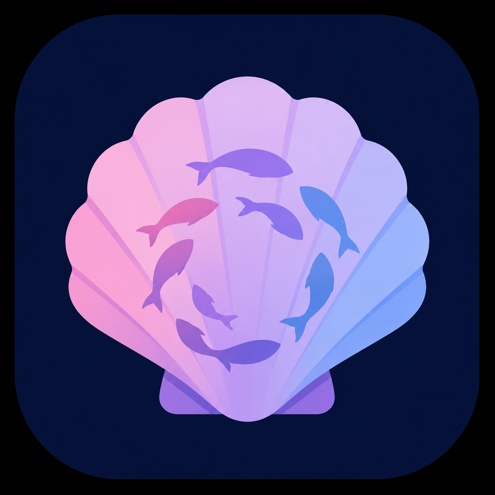
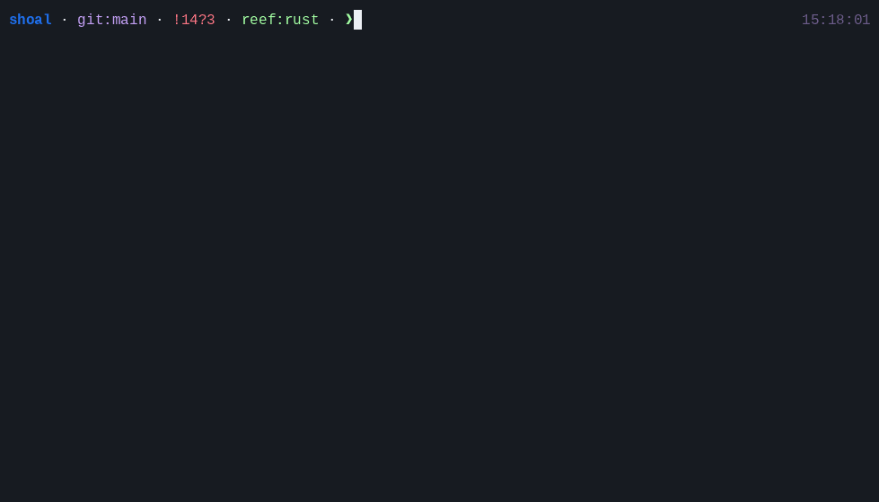

<div align="center">



# shoal

**A structured shell for humans and agents.**

Typed values instead of text plumbing. Dot-chains instead of pipes. Scoped, content-addressed tool
resolution instead of ambient `PATH`. One typed core across terminal, scripts, and agent sessions.

[](https://github.com/alliecatowo/shoal/actions/workflows/ci.yml)
[](#license)
[](#)
[](#)

[Quickstart](https://alliecatowo.github.io/shoal/docs/quickstart/) ·
[Manual](https://alliecatowo.github.io/shoal/docs/) ·
[Architecture](https://alliecatowo.github.io/shoal/internals/) ·
[Status and limits](https://alliecatowo.github.io/shoal/docs/status-limits/) ·
[Roadmap](https://alliecatowo.github.io/shoal/docs/roadmap/)

</div>

<div align="center">



</div>

Shoal runs ordinary terminal programs on a real PTY, preserving colors, prompts, progress bars,
password input, job control, and full-screen TUIs. When a command participates in an expression,
its result becomes a typed value that can be filtered, sorted, transformed, journaled, shared, or
queried by an agent without reparsing rendered text.

```shoal
# Collections and command output compose with methods, not a byte pipe.
ls.where(.size > 1mb).sort_by(.size).map(.name)

# Units are values.
1.5gb + 500mb
# → 2gb

# Functions are commands with typed parameters.
fn deploy(env: str, dry: bool = false) {
    if dry { "would deploy to {env}" } else { "deployed to {env}" }
}
deploy staging --dry

# Keep POSIX as an explicit escape hatch.
sh { git log --oneline -5 }
```

Typing `|`, `$VAR`, a heredoc, or an fd-numbered redirect produces a targeted diagnostic explaining
the shoal form: dot-chain a structured value, use `env.NAME`, feed a value with `.feed(...)`, inspect
`.stderr`, or enter an explicit `sh { ... }` block.

## Try it

Shoal is pre-release and is not ready to replace a login shell. The language engine, REPL, process
runner, Reef resolver, journal/CAS, Leash policy path, streams/channels, kernel protocol, and MCP
facade are implemented and tested on Linux and macOS.

**Shoal is Unix-only.** It relies on Unix-domain sockets, POSIX process/signal/PTY semantics, and
(where available) Landlock/Seatbelt sandboxing; Windows is out of scope for now and would need a
deliberate port (see [Current status and limits](https://alliecatowo.github.io/shoal/docs/status-limits/)).

```bash
# Install the pinned tools, then all ten binaries and man pages
mise install
mise run install

# Interactive shell
shoal

# Evaluate source
cargo run -p shoal -- -c $'let answer = 6 * 7\nanswer'

# Run a script
cargo run -p shoal -- examples/example.shl
```

The repository currently ships **49 declarative adapters** and a normative corpus of **1,355
cases across 79 suites**. The corpus is the executable language contract.

## The model

- Values include null, booleans, numbers, strings, paths, globs, regexes, sizes, durations,
  datetimes, bytes, lists, records, tables, streams, outcomes, tasks, errors, closures, and command
  references.
- A command in statement position uses the terminal and raises on failure. A command used as a
  value captures an `outcome` with status, signal, structured output, stderr, timing, pid, command,
  and source span.
- `^name` forces command parsing past a non-callable shadow and bypasses an adapter to reach the
  external/Reef-resolved command. Session functions and aliases remain callable; computed names use
  `run(name, args...)`.
- `alias gs = git status` stores an AST partial call, not a text macro. Later arguments and flags
  append structurally.
- The journal records source, AST, effects, output hashes, and typed undo inverses. `undo` replays
  only a reversible entry and refuses stale filesystem state.
- Reef resolves tools through session, project, user, system, provider, and ambient scopes. Locks
  record executable content hashes and detect drift.
- Leash evaluates semantic effects before execution. Executable hash pins are enforced for a
  principal that configures a non-empty `proc_spawn` allowlist; the ordinary default with no pins
  remains permissive. Filesystem scopes lower to Landlock on Linux or Seatbelt on macOS when a
  useful sandbox is requested, with unsupported dimensions reported honestly.

Spawned command outcomes now carry the invocation's source span all the way to the wire. Outcomes
that have no honest source site—such as some builtin wrappers or journal reconstructions—omit the
optional span instead of inventing one.

## Agents and interactive programs

The default CLI/REPL starts an isolated private `shoal-kernel` over an inherited descriptor;
`shoal --standalone` selects the embedded evaluator. A separate durable named-socket kernel serves
agent Sessions, and `shoal-mcp` provides the MCP facade. The
installable Claude Code [plugin](plugin/) adds the full language card and **13 tools** for structured
execution, plans, approvals, refs, journal queries, cancellation, and interactive PTYs.

Large values are automatically elided into a bounded preview plus a fetchable `shoal://` URI. MCP
resources browse session state and fetch transcript/CAS values; subscriptions push task, journal,
transcript, approval, and user-channel changes. PTY tools start an editor or TUI on a real terminal,
accept named keys, and return a bounded rendered screen instead of raw ANSI bytes.

Registering `shoal mcp` is normally enough: the bridge starts a detached kernel when its socket is
absent. Set a non-empty `SHOAL_NO_AUTOSTART` when supervising the kernel yourself. See the
[agent workflow manual](https://alliecatowo.github.io/shoal/docs/mcp-workflows/) and
[MCP reference](https://alliecatowo.github.io/shoal/docs/mcp-tools-reference/).

## Documentation

The [Shoal Manual](https://alliecatowo.github.io/shoal/docs/) is for users, operators, and agent
authors. Start with the [Quickstart](https://alliecatowo.github.io/shoal/docs/quickstart/), then use
the language, shell, tools, agent, and reference chapters as needed.

The [Architecture Atlas](https://alliecatowo.github.io/shoal/internals/) is for contributors and
maintainers. Its [system map](https://alliecatowo.github.io/shoal/internals/system-map/) leads into
crate ownership, execution, protocols, persistence, and security. The site keeps 123 curated,
accessible relationship diagrams in compact pan/zoom viewers while preserving every existing
`/docs/` and `/internals/` URL.

## Workspace

| Area | Responsibility |
|---|---|
| `shoal-syntax`, `shoal-ast` | modal lexer, parser, AST, formatter |
| `shoal-value`, `shoal-eval` | value algebra, methods, evaluator, streams, effects |
| `shoal-exec` | capture, PTY execution, cancellation, sandbox handoff |
| `shoal-reef`, `shoal-adapters` | reproducible tool resolution and typed CLI schemas |
| `shoal-journal` | SQLite journal and blake3 content-addressed storage |
| `shoal-leash` | plans, grants, hash pins, OS enforcement |
| `shoal-proto`, `shoal-kernel`, `shoal-mcp` | principal-private sessions and agent protocols |
| `shoal-prompt`, `shoal-lsp`, `shoal` | prompt, editor tooling, CLI and REPL host |

The [Architecture Atlas](https://alliecatowo.github.io/shoal/internals/) traces crate boundaries,
runtime flows, security boundaries, protocol contracts, and implementation status back to source.

## Build and test

```bash
mise install
mise run check
```

The gate itself is a checked-in Shoal program. It drives formatting, strict Clippy, workspace and
conformance tests, release builds, dependency audits, Reef validation, source-policy checks, man
page/help execution, diagram governance, and the documentation build.

Run only the executable language contract with:

```bash
cargo test -p shoal --test conformance --locked -- --nocapture
```

Contributors and coding agents should start with [CLAUDE.md](CLAUDE.md), then follow its links to
the canonical manual and atlas sources.

## License

Dual-licensed under either [MIT](LICENSE-MIT) or [Apache-2.0](LICENSE-APACHE), at your option.
