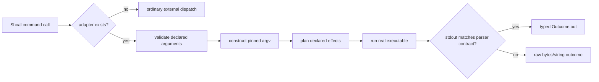
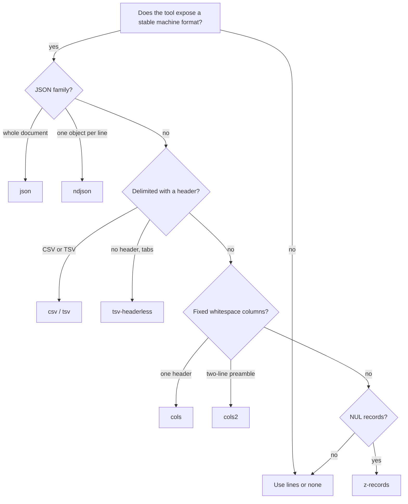

+++
title = "Command adapters"
description = "Understand Shoal's typed command adapters, structured output contracts, bundled catalog, and extension format."
weight = 150
template = "docs/page.html"

[extra]
eyebrow = "Integrate tools"
group = "Shell & tools"
audience = "Shell users, automation authors, and adapter maintainers"
status = "Current implementation"
toc = true
+++

Command adapters are Shoal's bridge between an ordinary executable and a typed language. An adapter does not replace the program. It declares how a command should be invoked, which arguments Shoal can validate, which effects a plan should report, which exit codes count as success, and—only when the program exposes a stable machine format—how stdout becomes a Shoal value.

The bundled catalog currently covers 49 command heads. A bare adapted head still launches the real executable. The difference is that Shoal gets a truthful contract around that launch.



The last branch is an important design rule: a parser mismatch degrades to raw output. It does not manufacture a table that only looks trustworthy.

## Why adapters exist

Traditional shells treat almost every command boundary as text. That is flexible, but it forces each caller to remember flags, parse unstable display formats, and reconstruct meaning from strings. Shoal adapters move only the stable portion of that knowledge into reviewed data.

Compare an adapted call:

```shl
let changes = (git status)
changes.out.where(.state == "modified").select("path", "status")
```

with an explicitly raw external call:

```shl
let raw = (^git status --short)
raw.stdout
```

The first call selects the bundled `git` adapter, pins `--porcelain=v2`, and parses a table. The second bypasses adapter dispatch and asks the installed `git` executable for exactly the raw interface written by the caller.

Adapters are particularly useful for:

- stable JSON, NDJSON, CSV, TSV, or NUL-delimited output modes;
- portable invocations whose defaults differ between GNU and BSD tools;
- argument validation before a process is spawned;
- effect-aware planning for filesystem, process, and network operations;
- interpreter blocks such as `python { ... }` and `jq { ... }`;
- nonzero exit statuses that carry a normal result, such as `rg` finding no matches.

They deliberately do not attempt to turn every human display into a schema. Free-form patches, terminal UIs, progress bars, and version-dependent prose should remain raw.

## Dispatch and precedence

At command-head position, Shoal resolves a name in this broad order:

1. a callable session binding, such as a function or alias;
2. Shoal's special and structured built-ins;
3. an adapter, unless the head is forced with `^`;
4. an external executable.

The force marker has a precise scope. `^git` bypasses the `git` adapter and a non-callable value shadow, but it does not override a callable binding or a Shoal builtin with the same name. Use `run("name", ...)` when a dynamically selected external must be reached even if a callable or builtin owns that command head. See [External commands](@/docs/external-commands.md#the-three-command-tiers) for the complete resolution model.

An adapter subcommand is selected only when the first command word exactly matches a key in its `sub` table. Flattened names are ordinary adapter keys, not automatic underscore expansion. For example, the bundled `gh` adapter declares `pr_list` and rewrites it to `pr list`:

```shl
gh pr_list --limit 20
```

If the first word is not a declared subcommand, the adapter's top-level specification handles the entire call.

## Outcomes remain outcomes

An adapted process still returns an `outcome`. The adapter changes `out`, not the fundamental process result:

```shl
let result = (git status)

result.ok       # true when status is accepted
result.status   # process exit code
result.stdout   # original stdout bytes/text
result.stderr   # original stderr bytes/text
result.out      # parsed table when parsing succeeded
```

This lets code inspect the original process evidence even after a successful structured parse. A failed adapted command behaves like another external command: uncaptured failure raises `cmd_failed`; a captured outcome can be inspected or explicitly unwrapped. See [Errors and outcomes](@/docs/language-errors-outcomes.md).

## Argument validation

Adapter parameters are declarations, not permissive documentation. A declared long flag is type-checked before spawn:

```shl
cargo build --jobs 8

# Fails before cargo starts: jobs is declared int?.
cargo build --jobs "many"
```

An undeclared long or short flag is an `arg_error` on an adapted subcommand. This is intentional: the adapter can only make claims about the interface it models.

```shl
# If a newly released git flag is not in the adapter yet:
^git log --brand-new-upstream-flag
```

Use `^` as the explicit escape hatch, then consider updating the adapter if the flag is stable and broadly useful.

### Parameter types

The adapter schema recognizes these parameter type strings:

| Type | Accepted intent |
| --- | --- |
| `str` | A required scalar string. |
| `bool` | A presence flag; no following value is consumed. |
| `int` | An integer argument. |
| `float` | A floating-point argument. |
| `path` | A path value. |
| `glob` | A glob whose literal pattern is passed through for the child to interpret. |
| `size` | A Shoal size value. |
| `size_kb` | A bare count of 1024-byte blocks, converted to a Shoal size by output parsers. |
| `duration` | A duration value. |
| `time` | A time value. |
| `list<T>` | A list whose element type is recursively one of the supported types. |

Appending `?` makes a scalar parameter optional, for example `path?` or `int?`. `list<T>` can also contain an optional-supported inner declaration, though adapter authors should prefer the simplest contract that matches the executable.

### Long flags

A long command flag maps to a declared parameter with the same Shoal-side name:

```toml
params = { ignore_case = "bool", max_count = "int?" }
```

Shoal converts underscores to hyphens while building argv:

```text
--ignore_case  ->  --ignore-case
--max_count 5  ->  --max-count 5
```

A one-character parameter is emitted with one dash. Thus a declared parameter named `n` accepts Shoal's long-form parser spelling `--n=10` or `--n 10`, but emits the executable's conventional `-n 10`.

For non-boolean parameters, either `--name=value` or `--name value` supplies the value. A boolean is represented by presence alone.

### Short flags

Short spellings must map to declared parameter names:

```toml
[cmd.example.sub.list]
params = { all = "bool", jobs = "int?" }
flags = { short = { a = "all", j = "jobs" } }
```

Shoal validates each character in a short-flag group. The current adapter argv builder treats grouped short flags as flag characters; adapter authors should not rely on a grouped short spelling to consume a following typed value. The long spelling is the clearest form for value-taking options.

### Positional arguments

The `positional` array names parameters in order:

```toml
params = { archive = "path", paths = "glob" }
positional = ["archive", "paths"]
```

Each positional name must also exist in `params`; otherwise the command definition is rejected while the catalog loads. Positional arguments beyond the declared list are still forwarded, but receive no adapter type validation.

A positional value typed `glob` preserves the pattern for the child program. A glob in a non-`glob` position follows Shoal's normal argument expansion. This distinction lets tools such as `rg` receive a pattern they understand while ordinary commands receive expanded path arguments.

### The `--` separator

`--` is forwarded to the executable. It stops Shoal's command parser from interpreting subsequent words as options in the usual way and is the right boundary for filenames beginning with a dash or arguments belonging to a nested command.

## Invocation rewriting

`invoke` is an argv template. When present, it replaces the ordinary subcommand word and is placed immediately after the adapter's real binary:

```toml
[cmd.cargo.sub.metadata]
invoke = ["metadata", "--format-version", "1"]
```

The call:

```shl
cargo metadata --no_deps
```

therefore starts from an argv equivalent to:

```text
cargo metadata --format-version 1 --no-deps
```

If a subcommand has no `invoke`, its Shoal-side subcommand name is forwarded literally. If the top-level specification has no `invoke`, only its binary and user arguments are used.

Pinned invocation templates make parsing deterministic. `df` always requests POSIX one-line output in 1024-byte blocks; `ps` chooses a stable cross-platform column order; `git log` uses an explicit NUL-delimited format. Environment-dependent display defaults never silently redefine those contracts.

## Consumed flags protect output contracts

Some otherwise valid flags switch a tool away from the machine format an adapter pins. These parameters belong in `consumed`.

```toml
[cmd.git.sub.status]
params = { short = "bool", branch = "bool" }
invoke = ["status", "--porcelain=v2"]
consumed = ["short", "branch"]
```

`git status --short` remains recognized, but `--short` is validated and then omitted from argv. The structured porcelain-v2 table already contains the requested information; forwarding a last-wins format flag would corrupt the parser contract.

The bundled catalog uses this protection for:

- `git status --short` and `--branch`;
- `docker ps/images --quiet`;
- `podman ps --quiet`;
- `du --human_readable`.

Every consumed name must be a declared parameter. The same rule applies to its short alias. Catalog loading rejects an invalid definition without poisoning valid sibling commands.

## Structured output parsers

Adapters may select one of the following parser strategies. An omitted output block defaults to `none`.

| Strategy | Contract |
| --- | --- |
| `json` | Parse the complete stdout as JSON and convert it to Shoal values. |
| `ndjson` | Parse every nonblank line as one JSON value; object rows become a table. |
| `csv` | Parse a header and RFC4180-style comma-delimited rows. |
| `tsv` | Parse a header and tab-delimited rows. |
| `z-records` | Split NUL-delimited fixed-width records using fields from `output.type`. |
| `porcelain-v2` | Parse the supported record forms from `git status --porcelain=v2`. |
| `cols` | Discard one header line, split whitespace columns, and take field names/types from the hint. |
| `cols2` | Like `cols`, but discard a two-line preamble. |
| `tsv-headerless` | Parse every tab-delimited line as data, taking the schema positionally from the hint. |
| `lines` | Return one string per line without promising internal fields. |
| `kv` | Parse nonblank `key=value` or `key: value` lines into a record. |
| `none` | Do not parse stdout. |

### JSON conversion

JSON objects become records. A non-empty array containing only objects becomes a table; an empty array or a mixed/scalar array remains a list. Numbers, booleans, strings, and null map to their corresponding Shoal values. The `output.type` hint documents the intended result but does not impose a second runtime JSON schema validator.

### Delimited tables

`csv` and `tsv` use the first row as column names and require every later row to have the same field count. Quoted delimiters, doubled quotes, and embedded newlines are supported. When the type hint names a header field, the parser coerces that cell; unmentioned fields remain strings.

`tsv-headerless` is for tools such as `du` and GNU `stat` whose first line is real data. It requires exactly the hinted field count on every nonempty line. Using ordinary `tsv` for such output would silently consume the first result as a header, so the distinction is semantic, not cosmetic.

### Whitespace columns

`cols` ignores header spelling and uses the hint's field order. It requires at least that many whitespace-separated cells. Extra cells are joined into the final column, allowing a mount point or command name containing spaces to survive. `cols2` behaves identically after discarding two leading lines, which matches procps `vmstat`.

### Typed cell coercion

Delimited, NUL-record, and column parsers recognize these output cell types:

- `str` and `datetime` become strings;
- `path` becomes a path value;
- `int`, `float`, and `bool` parse strictly;
- `size` parses a unit-bearing Shoal size;
- `size_kb` parses a nonnegative numeric block count and scales it by 1024;
- `duration` and `time` use Shoal's literal parsers;
- an unknown or richer nested field hint falls back to a string cell.

If a required conversion fails, the entire structured parse fails and the outcome retains raw output. Partial rows are not returned as if complete.

### Git porcelain semantics

The specialized `porcelain-v2` parser supports untracked (`?`), ignored (`!`), ordinary (`1`), and renamed/copied (`2`) records. It emits:

| Field | Meaning |
| --- | --- |
| `status` | The raw porcelain marker or two-character `XY` code. |
| `state` | A semantic word such as `modified`, `added`, `deleted`, `renamed`, `copied`, `typechange`, `unmerged`, `untracked`, or `ignored`. |
| `path` | Current path. |
| `orig` | Original path when a rename/copy record supplies it. |

An unsupported unmerged `u` record or malformed line causes a complete fallback to raw output. Silently skipping an unmodeled change would make the resulting status table dangerous.

## Exit codes

The command-level `ok_codes` list defaults to `[0]`. A subcommand may override it. This distinguishes a useful nonzero status from process failure:

- `rg` accepts `0` (matches) and `1` (no matches);
- `git diff` accepts `0` and `1`;
- `npm outdated` and `yarn outdated` accept `0` and `1`.

The accepted code still appears as `outcome.status`; `outcome.ok` records whether it belongs to the declared set.

## Effect declarations and planning

Each adapter can declare abstract effects such as:

```toml
effects = [
  "fs.read(cwd)",
  "fs.write(cwd/target)",
  "net.connect(crates.io:443)",
  "proc.spawn(test-binaries)",
]
```

The planner substitutes bound arguments into effect templates. For example, the bundled `git push` declaration uses the selected remote in `net.connect($remote)`, and `curl` describes both `net.connect($url)` and `fs.write($output)`.

Every adapter launch also has the process-spawn reality of its executable. Effect declarations are planning metadata; they do not prove that an arbitrary third-party program will confine itself to only those effects. Enforcement belongs to the active Leash/OS policy boundary, discussed in [Security and trust boundaries](@/docs/security.md).

## Interpreter adapters

An adapter with `class = "interpreter"` changes how a raw block immediately following the command head is parsed:

```shl
python {
import json
print(json.dumps({"answer": 42}))
}

jq {
.items[] | select(.enabled)
}
```

The raw balanced-brace body is not parsed as Shoal. It becomes the interpreter payload. `invoke_payload` controls how the body reaches the process:

- `arg` appends one argv word after the `invoke` template and is the default;
- `stdin` sends the payload on standard input.

Declaring `invoke_payload` on a non-interpreter command is a schema error. The bundled interpreter adapters all currently use the default `arg` mode:

| Head | Executable and template |
| --- | --- |
| `bash` | `bash -c BODY` |
| `deno` | `deno eval BODY` |
| `jq` | `jq FILTER` with its declared input interface |
| `node` | `node -e BODY` |
| `python` | `python3 -c BODY` |
| `ruby` | `ruby -e BODY` |
| `yq` | `yq -o=json FILTER` |

Interpreter classification affects the raw-block form. Ordinary non-block invocations still use the same adapter argument and output machinery.

## Authoring an adapter

An adapter file can contain one or more `[cmd.<name>]` tables. Here is a complete small example:

```toml
[cmd.acme]
bin = "acme"
class = "cli"
ok_codes = [0]
effects = ["fs.read(cwd)"]

[cmd.acme.sub.list]
params = { all = "bool", limit = "int?", root = "path?" }
positional = ["root"]
flags = { short = { a = "all", n = "limit" } }
invoke = ["list", "--output=json"]
output = { parse = "json", type = "table<{name: str, path: path}>" }
effects = ["fs.read($root)"]
```

The schema fields are:

| Location | Field | Meaning |
| --- | --- | --- |
| command | `bin` | Executable name; defaults to the Shoal command name. |
| command | `class` | `cli`, `tui`, `daemon`, or `interpreter`; defaults to `cli`. |
| command | `ok_codes` | Accepted statuses; defaults to `[0]`. |
| command | `invoke_payload` | `arg` or `stdin`, only for interpreter-class commands. |
| command/sub | `params` | Parameter-name to type-string table. |
| command/sub | `positional` | Ordered names drawn from `params`. |
| command/sub | `flags.short` | One-character spelling to declared parameter. |
| command/sub | `invoke` | Fixed argv template. |
| command/sub | `consumed` | Declared flags recognized but not forwarded. |
| command/sub | `output.parse` | One of the supported parser strategies. |
| command/sub | `output.type` | Human-readable/positional type hint. |
| command/sub | `effects` | Abstract planning-effect strings. |
| sub | `ok_codes` | Per-subcommand override of the command-level list. |

### Loader behavior

Catalog loading scans `.toml` files in sorted path order. A malformed file or invalid command produces a warning while valid siblings remain available. If two files in one directory define the same command, the later file wins and a duplicate warning is emitted.

Schema checks include:

- the command and subcommand values must be tables;
- `class`, `invoke_payload`, parameter types, and parser strategies must be known;
- `invoke_payload` is interpreter-only;
- positional names, short-flag targets, and consumed names must refer to declared parameters;
- strings and integer arrays must contain only the expected TOML types.

Treat warnings as release failures for a maintained catalog even though the interactive shell can continue with valid definitions.

### Selecting a parser honestly

Use this decision process:



Pin every format-changing option in `invoke`. If a useful user flag competes with the pinned format, either omit it or declare it as `consumed` only when the structured result genuinely contains at least the same information.

Test real output from each supported platform and tool version family. A type hint is a promise to users, not a wish.

## Custom adapter directories

Main configuration accepts:

```toml
[adapters]
dirs = ["/home/me/.config/shoal/adapters"]
```

There is an important current limitation: each loaded directory replaces the evaluator's active catalog rather than merging into it. The bundled directory is loaded first, followed by configured directories in order, so the last successfully loaded directory may be the only catalog used for actual dispatch. The completer can still discover names from all loaded catalogs, which can make completion appear broader than execution.

Until catalog merging is implemented, make the last custom directory a complete catalog, including any bundled definitions you need. This behavior is tracked in [Current status and compatibility](@/docs/status-limits.md#adapter-limitations).

## Bundled catalog at a glance

The following table describes every bundled command head. “Structured surfaces” lists only calls with an output parser; other declared subcommands still receive validation and effect metadata.

| Head | Class | Structured surfaces | Notes |
| --- | --- | --- | --- |
| `aws` | CLI | `s3_ls` → lines; `sts_get_caller_identity` → record | Network effects; high-level S3 listing is honestly text. |
| `bash` | interpreter | — | Raw block via `bash -c`. |
| `brew` | CLI | `list` → lines; `info` → record | Homebrew on macOS or Linux. |
| `bun` | CLI | `pm_ls` → lines | `install` is effect-declared but not parsed. |
| `cargo` | CLI | `metadata` → record | Build, check, run, and test are validated/effect-declared. |
| `curl` | CLI | — | Typed URL/request/header/data/output flags; raw response. |
| `deno` | interpreter | — | Raw block via `deno eval`. |
| `df` | CLI | top level → typed table | Portable `-kP`; sizes are scaled from KiB blocks. |
| `docker` | daemon | `ps`, `images` → TSV tables | Quiet flags are consumed; `run` is effect-declared. |
| `du` | CLI | top level → typed table | Portable `-k`; headerless TSV; human-readable is consumed. |
| `env` | CLI | top level → record | Parses `KEY=VALUE` lines. |
| `fd` | CLI | top level → `list<path>` | Line-oriented path results. |
| `findmnt` | CLI | top level → record | Pins JSON output. Linux ecosystem tool. |
| `gcloud` | CLI | `projects_list` → table; `config_list` → record | Pins JSON formats. |
| `gh` | CLI | `pr_list`, `issue_list`, `run_list` → tables | Requests explicit GitHub fields. |
| `git` | CLI | `status`, `log`, `show`, `remote`, `stash_list`, `branch`, `diff` | Status/log structured where safe; patch-like output remains lines. |
| `go` | CLI | `list` → record | Pins `go list -json`. |
| `helm` | CLI | `list` → table | Pins JSON; Kubernetes network effect. |
| `ip` | CLI | `addr`, `route`, `link` → tables | Linux iproute2 JSON. |
| `jj` | CLI | `status`, `log` → lines | Stable no-color/no-pager display, no fabricated record schema. |
| `journalctl` | CLI | top level → table | Linux/systemd NDJSON. |
| `jq` | interpreter | top level → JSON-derived value | Raw filter blocks; accepts status 4 for valid no-result behavior where declared. |
| `kubectl` | CLI | `get` → record; `logs`, `config_current_context` → lines | Apply/delete are effect-declared. |
| `lsblk` | CLI | top level → record | Linux block-device JSON. |
| `lscpu` | CLI | top level → record | Linux CPU-description JSON. |
| `node` | interpreter | — | Raw block via `node -e`. |
| `npm` | CLI | `ls`, `outdated` → records | Outdated accepts status 1. |
| `pip` | CLI | `list` → table | Pins JSON. |
| `pnpm` | CLI | `list` → table | Pins JSON. |
| `podman` | CLI | `ps`, `images` → JSON tables | `ps --quiet` is consumed. |
| `ps` | CLI | top level → typed table | GNU/BSD-compatible explicit columns. |
| `python` | interpreter | — | Maps head to `python3`; raw block via `-c`. |
| `rg` | CLI | top level → NDJSON table | Accepts status 1 for no matches. |
| `ruby` | interpreter | — | Raw block via `ruby -e`. |
| `rustup` | CLI | `toolchain_list`, `target_list` → lines | Cross-platform toolchain queries. |
| `sqlite3` | CLI | top level → dynamic table | Query-selected JSON columns are inherently dynamic. |
| `ss` | CLI | top level → typed table | Linux iproute2 socket listing. |
| `stat` | CLI | top level → typed table | GNU/Linux flag surface; raw byte count remains integer. |
| `systemctl` | CLI | top level → typed table | Linux/systemd only. |
| `systemd-analyze` | CLI | `blame` → lines | Mixed duration display remains honest text. |
| `tar` | CLI | — | Typed create/extract/list flags and filesystem effects. |
| `terraform` | CLI | `state_list` → lines; `show` → record | Pins `show -json`. |
| `unzip` | CLI | `list` → `list<path>` | Extraction is the top-level action. |
| `uv` | CLI | `pip_list` → table | Pins pip-compatible JSON. |
| `vmstat` | CLI | top level → typed table | Linux procps; two-line preamble and KiB scaling. |
| `who` | CLI | top level → typed table | Portable `-H` supplies a header. |
| `yarn` | CLI | `list`, `outdated` → records | Yarn Classic JSON envelopes; outdated accepts status 1. |
| `yq` | interpreter | top level → JSON-derived value | Targets mikefarah/yq and pins JSON output. |
| `zip` | CLI | — | Archive creation with typed paths/effects; free-form progress remains raw. |

## Detailed structured surfaces

This section is a field-oriented index for the commands most useful in typed pipelines. Tool versions may add fields to their JSON; the table lists the contract the bundled adapter intentionally requests or derives.

### Filesystems and host inspection

| Call | Result shape | Key fields |
| --- | --- | --- |
| `df` | table | `filesystem`, `size`, `used`, `avail`, `use_pct`, `mounted` |
| `du PATHS` | table | `size`, `path` |
| `env` | record | dynamic environment names and string values |
| `fd PATTERN PATHS` | list of paths | one emitted path per item |
| `findmnt` | record | tool-provided JSON tree |
| `lsblk` | record | tool-provided block-device JSON tree |
| `lscpu` | record | tool-provided CPU JSON |
| `ps` | table | `pid`, `ppid`, `user`, `cpu`, `mem`, `command` |
| `stat PATHS` | table | `size_bytes`, `mtime`, `kind`, `name` |
| `vmstat` | table | process, memory, I/O, system, and CPU counters |
| `who` | table | `user`, `line`, `date`, `time` |

`df`, `du`, and `vmstat` expose Shoal `size` values where their pinned options establish that bare numbers are 1024-byte blocks. `stat`'s GNU `%s` is a bare byte count and no current output type represents “bare bytes,” so `size_bytes` remains an integer.

### Source control

| Call | Result shape | Key fields |
| --- | --- | --- |
| `git status` | table | `status`, `state`, `path`, optional `orig` |
| `git log` | table | `hash`, `author`, `date`, `subject` |
| `git show` | list of strings | raw commit/patch lines |
| `git remote` | list of strings | names or verbose remote lines |
| `git stash_list` | list of strings | one stash display line per item |
| `git branch` | list of strings | one branch display line per item |
| `git diff` | list of strings | unified diff lines |
| `jj status` | list of strings | no-color status display |
| `jj log` | list of strings | no-graph one-line display |

Only `git status` and `git log` promise records. A patch is meaningful text whose internal grammar and context are richer than the adapter parser set, so `show` and `diff` remain lines.

### Containers and orchestration

| Call | Result shape | Key fields |
| --- | --- | --- |
| `docker ps` | table | `CONTAINER ID`, `IMAGE`, `STATUS`, `NAMES` |
| `docker images` | table | `REPOSITORY`, `TAG`, `IMAGE ID`, `SIZE` |
| `podman ps` | table | `Id`, `Image`, `Names`, `State` |
| `podman images` | table | `Id`, `Repository`, `Tag`, `Size` |
| `kubectl get ...` | record | Kubernetes API JSON selected by the resource |
| `kubectl logs ...` | list of strings | log lines |
| `helm list` | table | `name`, `namespace`, `revision`, `updated`, `status`, `chart`, `app_version` |

JSON field spelling follows the upstream tool. Docker's pinned table headers contain spaces and uppercase text; use explicit selection rather than assuming lowercase aliases.

### Development ecosystems

| Call | Result shape | Notes |
| --- | --- | --- |
| `cargo metadata` | record | Cargo format version 1. |
| `go list` | record | One JSON package description for the modeled invocation. |
| `npm ls` | record | Dependency tree. |
| `npm outdated` | record | Dynamic package keys. |
| `pnpm list` | table | `name`, `version`, `path`, `private`. |
| `pip list` | table | `name`, `version`. |
| `uv pip_list` | table | `name`, `version`. |
| `yarn list` | record | Yarn Classic JSON envelope. |
| `yarn outdated` | record | Yarn Classic JSON envelope. |
| `brew info` | record | Homebrew JSON v2 document. |
| `brew list` | list of strings | Installed names. |
| `bun pm_ls` | list of strings | Human package tree; not falsely structured. |
| `rustup toolchain_list` | list of strings | Installed toolchain display lines. |
| `rustup target_list` | list of strings | Target display lines. |

### Cloud and project services

| Call | Result shape | Notes |
| --- | --- | --- |
| `aws sts_get_caller_identity` | record | AWS CLI v2 JSON. |
| `aws s3_ls` | list of strings | High-level S3 helper has no JSON mode. |
| `gcloud projects_list` | table | `projectId`, `name`, `projectNumber`. |
| `gcloud config_list` | record | Active gcloud configuration. |
| `gh pr_list` | table | `number`, `title`, `state`, `author`, `url`, `createdAt`. |
| `gh issue_list` | table | Same selected identity fields as PRs. |
| `gh run_list` | table | `databaseId`, `name`, `status`, `conclusion`, `workflowName`, `createdAt`. |
| `terraform state_list` | list of strings | One resource address per line. |
| `terraform show` | record | Terraform JSON document. |

### Networking and systemd

| Call | Result shape | Platform |
| --- | --- | --- |
| `ip addr` | table with `ifname`, `addr_info` | Linux/iproute2 |
| `ip route` | table with `dst`, `dev`, `gateway` | Linux/iproute2 |
| `ip link` | table with `ifindex`, `ifname`, `mtu`, `operstate`, `address` | Linux/iproute2 |
| `ss` | table with socket queues/endpoints | Linux/iproute2 |
| `journalctl` | table of selected journal fields | Linux/systemd |
| `systemctl` | table with unit/load/active/sub/description | Linux/systemd |
| `systemd-analyze blame` | list of strings | Linux/systemd |

The adapter catalog does not emulate missing ecosystem tools. On macOS, a Linux-only head fails honestly rather than running an unrelated substitute and misparsing it.

## Common patterns

### Filter changed paths

```shl
(git status)
  .out
  .where(row => row.state == "modified" || row.state == "added")
  .select("path", "state")
```

### Inspect large directories

```shl
(du .)
  .out
  .where(.size > 100mb)
  .sort_by(.size)
  .reverse()
```

### Query pull requests

```shl
(gh pr_list --limit 100)
  .out
  .where(.state == "OPEN")
  .select("number", "title", "url")
```

### Keep both structured and raw evidence

```shl
let r = (rg "TODO" .)

if (r.ok) {
  {
    events: r.out,
    original: r.stdout,
    status: r.status,
  }
} else {
  r.err
}
```

### Bypass a stale adapter

```shl
^kubectl get widgets --output=custom-columns=NAME:.metadata.name
```

The force marker is a compatibility valve, not a reason to hide drift. If a stable upstream surface becomes common, update the adapter and its fixtures.

## Failure modes

### “Unknown flag” before the program runs

The active adapter does not declare that option for the selected subcommand. Check spelling, use a modeled equivalent, or prefix the head with `^` to use the executable's raw CLI.

### Output is raw instead of a table

The child ran, but stdout did not satisfy the promised parser. Inspect `result.stdout`, the executable version, locale/configuration, and whether a format-changing option escaped the pinned interface. Raw fallback is the safety behavior.

### Completion knows a command that dispatch does not adapt

With custom adapter directories configured, completion can scan several catalogs while evaluation uses only the last one loaded. Consolidate definitions into the final directory until catalog merging is fixed.

### A platform-specific adapter fails

Confirm the actual executable family. `stat` targets GNU coreutils; `ip`, `ss`, `findmnt`, `lsblk`, `lscpu`, and systemd tools target Linux ecosystems. Shoal does not translate those interfaces on macOS.

### A successful “no results” is treated as failure

The adapter may be missing a normal nonzero code in `ok_codes`. Confirm the upstream contract and add the code only when it unambiguously means a valid result rather than an operational error.

## Adapter review checklist

Before shipping a new or changed adapter:

1. Verify the command exists on every platform claimed by its comments/docs.
2. Pin a machine-readable format and disable color/pagers where relevant.
3. Declare only parameters whose forwarding semantics are understood.
4. Test long, short, positional, optional, list, path, and glob cases used by the definition.
5. Mark competing format flags consumed only when no information is lost.
6. Choose `ok_codes` from documented process behavior.
7. Parse fixtures for success, empty output, malformed output, encoding errors, and shape drift.
8. Ensure mismatch returns raw output rather than a partial structured value.
9. Declare concrete planning effects and test argument substitution.
10. Run the bundled catalog loader test and the adapter fixture suite.
11. Exercise real binaries where host-dependent integration tests are possible.
12. Update this catalog index and [Current status](@/docs/status-limits.md) when compatibility changes.

Adapters are intentionally conservative. A smaller truthful typed surface is more useful than an ambitious schema that occasionally lies.
