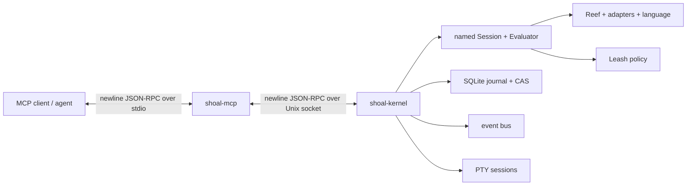
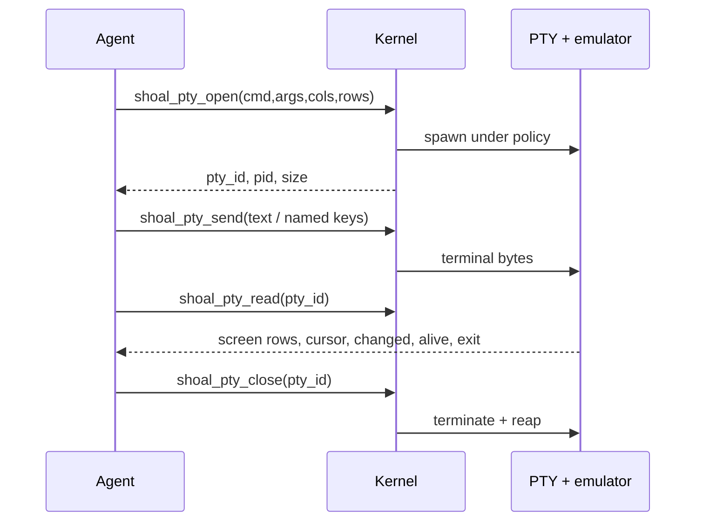

+++
title = "Agents, kernel, and MCP"
description = "Run Shoal as a long-lived structured execution service for agents, clients, and interactive terminal programs."
weight = 170
template = "docs/page.html"

[extra]
eyebrow = "Agent interface"
group = "Agents & protocol"
audience = "Agent integrators, MCP users, and kernel operators"
status = "Implemented; current limitations are explicit"
toc = true
+++

Shoal has a long-lived kernel and an MCP facade for clients that need structured execution without terminal scraping. The agent surface is built around three rules:

1. actions are small verbs;
2. values and state are addressable resources;
3. changes arrive as events.

An agent receives a compact value shape and a stable reference, then fetches only the field or slice it needs. Interactive programs run on real PTYs, but the agent reads a bounded terminal screen rather than raw ANSI escape bytes.



The ordinary interactive `shoal` REPL now spawns a listener-free private `shoal-kernel` child and connects over an inherited anonymous descriptor. That server-selected transport is the only local-human trust root. Each REPL remains isolated: it does not bind or attach to the durable named socket used by MCP/agents, and two REPLs do not share live bindings, `it`/`out`, jobs, or cwd merely because their Session names match. `shoal --standalone` (or `kernel.enabled = false`) selects the older in-process evaluator path.

## Components

| Component | Role |
| --- | --- |
| `shoal-kernel` | Owns named evaluator sessions, transcript refs, plans, tasks, PTYs, event channels, journal/CAS access, authentication, and policy decisions. |
| `shoal-mcp` | Presents the kernel through MCP stdio: 13 tools, resources, templates, and subscriptions. |
| `shoal-token` | Creates, lists, and revokes bearer tokens for agent principals. |
| `shoal` | Interactive CLI backed by an isolated private kernel by default; `--standalone` uses a local evaluator, and `mcp` launches the companion from `PATH`. |

Detailed references:

- [MCP tools](@/docs/mcp-tools-reference.md)
- [Resources and events](@/docs/mcp-resources-events.md)
- [Kernel JSON-RPC protocol](@/docs/kernel-protocol.md)
- [Agent workflows](@/docs/mcp-workflows.md)
- [Security and trust boundaries](@/docs/security.md)

## Fastest setup: let MCP autostart

Register this command as an MCP server in your client:

```bash
shoal-mcp --session default
```

or, when using the main dispatcher and companion binaries are installed on `PATH`:

```bash
SHOAL_SESSION=default shoal mcp
```

The `shoal mcp` dispatcher currently accepts no trailing arguments; configure that form through `SHOAL_SOCKET`, `SHOAL_SESSION`, and `SHOAL_TOKEN`. Invoke `shoal-mcp` directly when you prefer flags.

When the socket is absent, `shoal-mcp` best-effort starts a detached `shoal-kernel`, passing the selected socket. It redirects the daemon's standard streams, gives it a new process group, and waits for readiness in 50 ms intervals for roughly five seconds. Two racing MCP clients are safe: the kernel refuses to replace a socket with a live listener, so one daemon wins and both clients connect to the listener.

Autostart failure is not swallowed as success. The facade attempts its normal connection after the bounded wait, and that connection error becomes the visible failure.

Disable autostart when a service manager or operator owns lifecycle:

```bash
SHOAL_NO_AUTOSTART=1 shoal-mcp --session work
```

Any nonempty value disables it; an empty variable does not.

## Start the kernel explicitly

```bash
shoal-kernel \
  --session work \
  --state-dir "$HOME/.local/state/shoal" \
  --policy "$HOME/.config/shoal/leash.toml"
```

Command-line interface:

```text
shoal-kernel [--session NAME] [--socket PATH] [--state-dir PATH] [--policy FILE]
```

| Flag | Default | Meaning |
| --- | --- | --- |
| `--session NAME` | `default` | Used only to derive the default socket filename. Clients still name the attached session. |
| `--socket PATH` | runtime-derived | Unix socket to bind. |
| `--state-dir PATH` | XDG-derived | Journal, CAS, token store, and supporting durable state. |
| `--policy FILE` | none | Load a Leash policy instead of the local-human permissive default. |

On startup the process prints `shoal-kernel: ready PATH` to stderr. SIGINT/SIGTERM handling asks the serve loop to stop and the bound-socket guard removes the socket on normal teardown.

### Socket discovery

Kernel and MCP use the same order:

1. explicit `--socket` / MCP `SHOAL_SOCKET`;
2. `$XDG_RUNTIME_DIR/shoal/<session>.sock`;
3. `$TMPDIR/shoal-<uid>/shoal/<session>.sock`;
4. `/tmp/shoal-<uid>/shoal/<session>.sock`.

The `$TMPDIR` fallback makes the default usable on macOS, where `XDG_RUNTIME_DIR` is commonly unset.

The kernel creates an owned socket directory with mode `0700` and the socket file with mode `0600`. If an explicit socket lives under a shared directory the kernel does not own, it leaves that directory's permissions alone; the socket file is still the primary access boundary. A stale path is removed only when it is an unconnected socket owned by the effective user. The kernel refuses an active listener, an unowned socket, or a non-socket path.

### State directory

The default is:

```text
$XDG_STATE_HOME/shoal
# otherwise
~/.local/state/shoal
```

The kernel opens its journal there, creates `tokens.json`, and gives each named session's evaluator a second handle to the same SQLite/WAL journal so in-language `history` sees real kernel activity. If the per-session evaluator handle cannot open, session creation continues with a warning and only that in-language history surface is disabled; the kernel's coarse execution journal remains authoritative.

## MCP process configuration

```text
shoal-mcp [--socket PATH] [--session NAME] [--token TOKEN]
```

Environment equivalents:

| Variable | Meaning |
| --- | --- |
| `SHOAL_SOCKET` | Explicit kernel socket. |
| `SHOAL_SESSION` | Named session, default `default`. |
| `SHOAL_TOKEN` | Bearer token used by `session.attach`. |
| `SHOAL_NO_AUTOSTART` | Nonempty disables detached kernel startup. |

Flags overwrite environment-derived values. `shoal-mcp` speaks newline-delimited JSON-RPC 2.0 on stdin/stdout and never writes protocol noise to stdout.

The initialized MCP protocol version is `2025-06-18`. Advertised capabilities are tools and subscribable resources, with no dynamic list-change notifications.

## Named sessions

A session owns:

- one long-lived evaluator and its language bindings;
- current directory and process environment;
- transcript values (`out:N`);
- per-client last-seen transcript bookkeeping;
- Reef cache/lock state held by that evaluator;
- an in-language event bus bridged to wire `user.*` channels;
- task and PTY visibility scoped by session.

The first attachment to a session name creates it. Later attachments to the same running kernel reuse that evaluator, so state persists across MCP process reconnects:

```text
client A: shoal_exec "let project = 'shoal'"
client B, same session: shoal_exec "project"
```

Transcript references are session-scoped. `out:3` in session `work` does not authorize lookup of `out:3` in another session.

Kernel restart recreates evaluator sessions; live bindings, tasks, plans, PTYs, and transcript maps do not survive. The journal/CAS and token store do. The durable `journal` and `session.transcript` event channels rebuild their sequence indices from journal state so replay cursors continue across restart.

## Principals and attachment

Every kernel connection begins with `session.attach` before most other operations. The MCP facade performs this automatically.

Without a token, the connection becomes the local human principal:

```text
uid:<effective uid>
profile: local-human
```

With a valid token, principal, profile, and declared token capabilities come from the token store. Invalid, expired, or revoked tokens fail with `AUTH_FAILED` (`-32030`). An ephemeral in-memory kernel has no token store and rejects bearer authentication.

Attachment returns:

| Field | Meaning |
| --- | --- |
| `session` | Attached session name. |
| `principal` | OS-local or token principal. |
| `caps` | Policy profile, token caps, enforcement tier, opaque-effect verdict. |
| `cwd` | Wire path with optional raw bytes for non-UTF-8 names. |
| `env_hash` | Currently the literal placeholder `local`. |
| `ast_version` | Current serialized AST vocabulary version, `2`. |
| `caps_enforced` | True only when a real OS backend exists and the principal has a concrete sandbox. |
| `elide_defaults` | Wire size/row/item thresholds and hard cap. |
| `channels` | Static subscribable channel names. |

The strongest available enforcement tier is reported honestly: Landlock (`A`) on supported Linux, Seatbelt (`C`) on macOS, otherwise advisory (`D`) in the current detector. A backend being available does not make the permissive local-human profile confined; read `caps_enforced`.

## Create agent tokens

```bash
# Secret is printed once on stdout; metadata goes to stderr.
shoal-token create agent:reviewer reviewer \
  --cap fs.read \
  --cap proc.spawn \
  --ttl 3600

shoal-token list
shoal-token revoke TOKEN_ID
```

The default store is the same path the default kernel opens:

```text
$XDG_STATE_HOME/shoal/tokens.json
# or ~/.local/state/shoal/tokens.json
```

Override both the CLI and the kernel's expected location carefully. `shoal-token` honors `SHOAL_TOKEN_STORE`, while `shoal-kernel` always opens `<state-dir>/tokens.json`; if those differ, newly created tokens will not authenticate to that kernel.

The bearer secret is 32 random bytes encoded URL-safe without padding. The store persists a keyed BLAKE3 digest rather than the secret and forces file mode `0600`. Token IDs are short digest prefixes used for listing/revocation. TTL is seconds and is converted to an absolute nanosecond expiration.

Token `caps` are reported at attach, but kernel authorization is ultimately evaluated against the loaded Leash policy for the token principal. Do not mistake arbitrary cap labels in token metadata for a self-granting policy language.

## The 13 MCP tools

The current surface is exactly:

| Tool | Purpose |
| --- | --- |
| `shoal_exec` | Run/plan source, optionally in background or with a handoff timeout. |
| `shoal_plan` | Derive effects without executing. |
| `shoal_apply` | Execute a stored approved/allowed plan. |
| `shoal_get` | Fetch a referenced value, field, or slice. |
| `shoal_journal` | Query structured execution history. |
| `shoal_cancel` | Request task cancellation. |
| `shoal_cap_request` | Request approval for a stored plan and effect scope. |
| `shoal_pty_open` | Start a real interactive terminal program. |
| `shoal_pty_send` | Send text, bytes, or named keys. |
| `shoal_pty_read` | Read a rendered terminal grid. |
| `shoal_pty_resize` | Resize the child terminal/emulator. |
| `shoal_pty_close` | Terminate and reap the PTY child. |
| `shoal_pty_list` | List open PTYs in the session. |

There are seven execution/data/control tools and six PTY tools. See [MCP tools](@/docs/mcp-tools-reference.md) for exact JSON Schemas and result shapes.

## Position semantics

`shoal_exec` defaults to `position: "value"` at the MCP facade, even though the raw kernel `ExecParams` type defaults to statement position when omitted. Always send the desired position from a raw client.

### Value position

The final top-level expression is evaluated as a value. A nonzero external outcome is captured rather than automatically raised:

```json
{"src":"^sh { exit 7 }","position":"value"}
```

This is useful for agents that need structured `status`, `stderr`, and `ok`. Initial statements before the final expression still use statement semantics so their bindings/effects occur normally.

### Statement position

Normal statement semantics apply. An uncaptured failed external command raises a Shoal error, which the kernel returns as RPC `RAISED` with an addressable transcript error ref in `data`.

The position distinction does not turn every syntactic statement into an expression. A final `let`, `fn`, `for`, or other non-expression statement follows its ordinary meaning.

## Plans and approval

Planning parses source and derives concrete effect records without executing it:


Plan references bind the full source/AST, effects, reversibility, estimates, principal, and Session through a full BLAKE3 digest, then add a monotonic per-kernel object suffix so storing identical content twice still creates two objects. Application rechecks the stored identity and source. `cap.request` requires an attachment; by default the requester cannot approve its own plan, and a distinct approver needs the embedded-human trust root or an explicit `supervisor`/`plan.approve` bearer. Plans remain ephemeral object handles rather than durable authorization tokens.

`shoal_cap_request` does not modify a policy file. It marks a stored plan approved when the policy does not deny it and the requested effect-kind scope covers every plan effect. The response reports whether OS enforcement will actually apply.

Plans are in-memory and disappear on kernel restart.

## Tasks and timeout handoff

`background: true` immediately returns:

```json
{"task":"task:7","events":"task.7"}
```

`timeout_ms` starts the same task machinery but waits for the deadline. A fast command returns its ordinary inline execution result. A slower command keeps running and returns:

```json
{"task":"task:7","events":"task.7","timed_out":true}
```

Timeout is a context handoff, not a kill switch. Subscribe to the task resource/channel, await/read it later, or cancel explicitly.

Task states include `running`, `cancelling`, `completed`, `failed`, and `cancelled`. Cancellation signals the evaluator's cancellation token; the final state still reflects what the actual returned outcome/error shows.

Kernel `task.suspend` and `task.resume` currently return `TASK_CONTROL_UNAVAILABLE`. A kernel task is a Rust thread recursively dispatching an execution, not one tracked process group. Local REPL job control is a different implementation and can suspend actual foreground process groups.

## Stable references

| Short ref | URI | Meaning |
| --- | --- | --- |
| `out:N` | `shoal://out/N` | Session transcript value/error. |
| `val:blake3:HEX` | `shoal://val/blake3:HEX` | Immutable CAS value/blob. |
| `task:N` | `shoal://task/N` | Background task record. |
| `plan:HEX16` | `shoal://plan/HEX16` | Stored plan. |
| `pty:N` | `shoal://pty/N` | Open terminal session/screen. |

Refs let an agent re-read without re-executing. The result of `shoal_exec` includes a compact structured value and a resource link. Large payloads become ref-shaped previews automatically.

## Elision at a glance

Default thresholds are:

| Dimension | Default |
| --- | --- |
| encoded JSON | 8 KiB |
| table rows | 100 |
| list items | 500 |
| bytes | 4 KiB |
| maximum requested byte budget | 64 KiB |

An elided value still carries type, count, table column types, a five-item/row or 256-byte preview, a render head, and a URI. An outcome keeps process metadata while its large `.out` becomes the ref.

Per-call `elide` can tighten or loosen `max_bytes`, `max_rows`, and `max_items`; only the byte budget is clamped to the 64 KiB hard cap. Row/item limits can currently be set arbitrarily high, though encoded-size elision still applies.

Human renders are stripped of ANSI for headless clients and capped to 64 KiB. See [Resources and events](@/docs/mcp-resources-events.md#formats) for caveats, including the current `format=raw` full-base64 bypass.

## PTY surface

PTY tools are for Vim, installers, REPLs, TUIs, and any program whose interface depends on a terminal. They do not return raw terminal bytes.



Each screen is bounded by `cols × rows`. `changed` compares with the previous read; `exit` is null while alive, otherwise `{status, signal}`. PTYs are session-scoped, listed without screen contents, and disappear on close/restart.

The PTY spawn uses the session's cwd and environment plus supplied overrides. It applies the principal's process-hash allowlist and OS sandbox. It does not currently resolve the command through the evaluator's full adapter/Reef command pipeline; it asks the process layer to resolve the provided command and hashes that executable for pinning.

## Events instead of polling

Static channels advertised at attach are:

```text
session.transcript
journal
approval
render
```

Dynamic channels are `task.N` and `user.NAME`. Reef is intentionally not advertised because no live Reef event forwarder exists yet.

Native clients use `events.subscribe`; MCP clients subscribe to `shoal://events/CHANNEL` or a task resource. Each event has `{channel, seq, ts, payload}`, with sequence monotonic per channel. Delivery is at least once; consumers deduplicate by `(channel, seq)`.

`journal` and `session.transcript` replay from durable journal data even after their 1024-event rings age out and across kernel restart. Other channels are ring-only. Slow subscribers have a private queue of 256 events; overflow becomes a coalesced `{dropped, latest_seq}` notification and never blocks producers or other subscribers.

See [Resources and events](@/docs/mcp-resources-events.md) for payloads, cursors, and subscription semantics.

## A first structured execution

At the MCP level:

```json
{
  "jsonrpc": "2.0",
  "id": 1,
  "method": "tools/call",
  "params": {
    "name": "shoal_exec",
    "arguments": {
      "src": "ls .",
      "position": "value"
    }
  }
}
```

The result has:

- `content[0]`: bounded human text;
- optional `content[1]`: a `resource_link`;
- `structuredContent`: the kernel result containing `ref`, structured value/elision, and render;
- `isError`: true only when the facade received a kernel error for the tool call.

Kernel errors are deliberately returned as a successful MCP `tools/call` envelope with `isError: true`, so the client receives structured error content. Transport/protocol mapping failures become MCP JSON-RPC errors.

## Raw wire clients

Kernel transport is JSON-RPC 2.0, one JSON object per newline, on a Unix stream. The maximum input frame is 16 MiB. A connection that sends malformed JSON directly to the kernel is closed at framing; the MCP stdio bridge instead emits JSON-RPC parse error `-32700` and continues reading subsequent lines.

Raw clients must attach, preserve request IDs, and tolerate event notifications interleaved with responses. Pushed events are not ordered before/after the response to the action that produced them; subscription writers are intentionally asynchronous.

The raw method set is broader than MCP tools and includes parsing, completion, explanation, task await/control, event publish/read, plan/resource inspection, environment/Reef views, and CAS blob retrieval. See [Kernel protocol](@/docs/kernel-protocol.md).

## Current boundaries

- The default REPL uses its own listener-free private kernel; it does not join the durable MCP/agent kernel. Explicit `--standalone` does not use kernel sessions.
- Kernel transport is Unix-socket/Unix-API based; Windows is not implemented.
- Stream values carry only a label; no wire chunk-pull protocol exists.
- Language streams can feed captured commands through a bounded incremental stdin queue; streams
  still have no item-pull representation on the kernel wire.
- Task output is captured as one value on completion, not incrementally cursor-readable.
- Task suspend/resume is unavailable on the kernel wire.
- `format=raw` bytes can currently place full base64 in `structuredContent`, bypassing the nominal 64 KiB wall.
- Session `cwd` in MCP resources is cached from attach rather than refreshed from the kernel, while env/Reef views are live.
- Each active MCP resource subscription owns one dedicated kernel connection and OS thread;
  `resources/unsubscribe` shuts down and joins that worker.
- Plans, tasks, PTYs, transcript maps, and evaluator bindings are in-memory.
- Per-client last `it` is tracked internally but has no read method.
- Configured WebAssembly component plugins load through the shared host bootstrap and are callable in
  kernel sessions. ABI v1 is narrow; fuel, epoch wall deadline, memory/table/instance, value, and
  hostcall limits apply.

These are captured in [Current status and compatibility](@/docs/status-limits.md#kernel-and-agents), not hidden behind aspirational language.

## Where to go next

- Implement an agent: [MCP tools reference](@/docs/mcp-tools-reference.md)
- Browse without re-running: [Resources and events](@/docs/mcp-resources-events.md)
- Use raw JSON-RPC: [Kernel protocol](@/docs/kernel-protocol.md)
- Follow safe patterns: [Agent workflows](@/docs/mcp-workflows.md)
- Operate principals and policy: [Security](@/docs/security.md)
