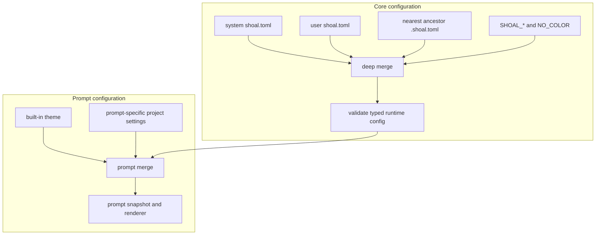

+++
title = "Configuration and prompt"
description = "Layer Shoal configuration safely, tune history and rendering, and build a fast structured prompt."
weight = 140
template = "docs/page.html"

[extra]
eyebrow = "Operate Shoal"
group = "Shell & tools"
audience = "Interactive users and administrators"
status = "Current implementation, with wiring gaps called out"
toc = true
+++

Shoal has two related configuration loaders. The main loader controls shell behavior; the prompt loader understands a richer prompt schema and also reads a dedicated `prompt.toml`. Knowing where they intentionally differ prevents most surprising configurations.

## Main configuration precedence

The main loader deep-merges four layers from lowest to highest precedence:

1. `/etc/shoal/shoal.toml`
2. `$XDG_CONFIG_HOME/shoal/shoal.toml`, or `~/.config/shoal/shoal.toml`
3. the nearest `.shoal.toml` found by walking from the current directory toward the filesystem root
4. supported environment overrides

Only the nearest project file participates. Tables merge key by key, so a project can replace `history.max_entries` without copying the rest of `[history]`.



A missing file is normal. Malformed TOML, a wrong value type, or an invalid constrained value is a startup error. Unknown keys produce warnings, including a spelling suggestion when one is close enough; they are not accepted silently.

## A practical user configuration

Put this at `$XDG_CONFIG_HOME/shoal/shoal.toml` (usually `~/.config/shoal/shoal.toml`) and trim it to taste:

```toml
version = 1

[history]
enabled = true
max_entries = 20000
dedup = true
ignore_space = true
ignore = ["token *", "secret *"]

[render]
color = true
paging = "auto"
pager = "less -R"
echo = "quiet"

[editor]
mode = "emacs"
bracketed_paste = true

[completion]
fuzzy = true
case_insensitive = true
menu = true
max_results = 100

[aliases]
gs = "git status"
la = "ls --all"

[env]
EDITOR = "nvim"
PAGER = "less -R"

[init]
files = ["~/.config/shoal/interactive.shl"]
```

Aliases are parsed as Shoal source at startup, rather than pasted into a Bourne shell. Environment entries populate Shoal's session environment. Init files run in order at the start of an interactive session; keep machine-dependent setup in the user file and repository conventions in `.shoal.toml`.

## Validation and diagnostics

Configuration loading distinguishes warnings from hard errors. This matters operationally: an unknown future/typo key does not prevent startup, while a value of the wrong type or an invalid constrained value does.

### Unknown keys are warnings

Every key actually present in a loaded file is checked against the generic configuration schema. An unrecognized dotted path is preserved as a warning with its source file and, when a sibling key is sufficiently close, a spelling suggestion:

```text
/home/dev/.config/shoal/shoal.toml: unknown config key `editor.bracketde_paste` (did you mean `editor.bracketed_paste`?)
```

When no candidate is close enough, no misleading suggestion is invented. Rich prompt keys under `[prompt]` are a known exception in practice: the generic loader only formally knows `prompt.template`, while the separate prompt loader understands the larger schema. Put rich configuration in `prompt.toml` to avoid those warnings.

### Type mismatches are hard errors

The loader reports the exact dotted key and expected shape before falling through to a generic deserializer message:

```text
/home/dev/.config/shoal/shoal.toml: history.max_entries: expected a non-negative integer, found string
```

Array and map locations include their precise index/key, such as `adapters.dirs[1]` or `aliases.gs`. Existing files that cannot be read are also errors; a file that does not exist is simply an absent layer.

### Malformed TOML is a hard error

Syntax errors retain TOML's line/column diagnostic and are prefixed with the source path. User-controlled config parsing returns a structured error rather than panicking.

### Semantic constraints

Values that parse and have the right TOML type still must satisfy these rules:

| Key | Requirement |
| --- | --- |
| `version` | exactly `1` |
| `history.max_entries` | greater than zero |
| `editor.mode` | `emacs` or `vi` |
| `render.paging` | `never` or `auto` |
| `render.echo` | `quiet`, `commands`, or `all` when present |
| `completion.max_results` | greater than zero |
| alias names | nonempty and contain no whitespace |
| environment names | nonempty |
| every `history.ignore` pattern | nonempty |

Representative messages are stable and actionable:

```text
version: unsupported config version 2 (expected 1)
history.max_entries: must be greater than 0
editor.mode: must be `emacs` or `vi`
aliases: alias name `g s` must not contain whitespace
```

The main loader validates the `[reef]` containers loosely enough for Reef to reparse its richer tool/runner grammar. Consult [Reef tool resolution](@/docs/reef.md#native-manifest-schema) for that contract.

## Main configuration reference

The table below reflects the schema and defaults in the current code. An empty “runtime note” means the setting is wired on the relevant shell surface.

| Key | Type and default | Runtime note |
| --- | --- | --- |
| `version` | integer, `1` | Configuration format version. |
| `prompt.template` | string, `"{cwd}"` | Legacy prompt form; prefer `prompt.toml`. |
| `history.enabled` | boolean, `true` | Interactive history only. |
| `history.max_entries` | integer, `10000` | Caps retained file entries. |
| `history.path` | path, platform default | Explicit history file. |
| `history.dedup` | boolean, `true` | Skips a line identical to the immediately previous entry. |
| `history.ignore` | string list, empty | Whole-line shell-style `*`/`?` patterns excluded from history. |
| `history.ignore_space` | boolean, `true` | A line beginning with a space is not recorded. |
| `render.color` | boolean, `true` | `NO_COLOR` can disable it. |
| `render.width` | positive integer or absent | Overrides terminal detection for block tables, prompt context, protocol rendering, wrapping, and pager decisions. |
| `render.paging` | `"never"` or `"auto"`, `"never"` | Paging is interactive and TTY-sensitive. |
| `render.pager` | command string or absent | Falls back to `$PAGER`, then `less -R`. |
| `render.echo` | `"quiet"`, `"commands"`, `"all"`, or absent | Surface default: `all` in the REPL, `quiet` for scripts and `-c`. |
| `editor.mode` | `"emacs"` or `"vi"`, `"emacs"` | Selects the interactive editing mode. |
| `editor.bracketed_paste` | boolean, `true` | Controls paste handling. |
| `editor.keybindings` | chord-to-action table, empty | Extends or replaces actions for named chords. |
| `completion.fuzzy` | boolean, `true` | Allows non-prefix matching. |
| `completion.case_insensitive` | boolean, `true` | Applies to candidate matching. |
| `completion.max_results` | integer, `100` | Bounds the candidate set. |
| `completion.menu` | boolean, `true` | `false` enables quick/shared-prefix completion, but a popup can still appear when ambiguous candidates have no common prefix. |
| `adapters.dirs` | path list, empty | Adds adapter catalogs; see the caveat below. |
| `init.files` | path list, empty | Interactive startup scripts, in order. |
| `aliases` | string table, empty | Persistent session aliases. |
| `env` | string table, empty | Initial session environment. |
| `reef.tools` | constraint table, empty | User-scope Reef constraints. |
| `reef.runners` | runner table, empty | User-scope script runners. |
| `reef.options.hermetic` | boolean, `false` | Removes the ambient `PATH` tail when engaged. |
| `kernel.enabled` | boolean, `true` | The default interactive REPL runs through an isolated private `shoal-kernel` child. Set false (or pass `--standalone`) for the local evaluator path. |
| `kernel.session` | string, `"default"` | Names the principal-private Session inside the default REPL's private kernel. It does not attach to a durable public kernel socket. |
| `journal.enabled` | boolean, `true` | Enables language-facing `history`/`journal`/`undo`; it never disables mandatory kernel security/approval/event audit. |
| `journal.state_dir` | path or absent | Local language journal/jump and embedded-kernel state root; relative paths resolve from startup cwd. |
| `leash.policy` | path or absent | Loaded fail-closed by the shared host bootstrap for local/kernel evaluators and passed to the default private REPL kernel. |

`history.dedup` compares with the immediately preceding entry, including the last entry read from a previous session. An environment name that is nonempty but cannot be expressed as a Shoal identifier can pass generic validation yet produce a startup warning when the host tries to apply it.

The default interactive REPL spawns a listener-free private kernel and connects over an inherited anonymous descriptor. Each shell gets isolated live bindings, `it`/`out`, cwd, jobs, and policy state; it does not join the named-socket kernel used by MCP/agents. `shoal --standalone` and `kernel.enabled = false` select the in-process evaluator path. Kernel process flags and token policy are documented in [Agents, kernel, and MCP](@/docs/agents-kernel-mcp.md); durable execution history is covered in [Filesystem, jobs, and history](@/docs/filesystem-jobs-history.md).

### Adapter-directory precedence

`adapters.dirs` is an ordered extension path. The bundled catalog loads first; each configured
directory overlays it, and a later definition replaces only a matching command head. Shoal warns
when an overlay shadows an earlier head. Completion and dispatch are assembled from the same ordered
catalog set. Use `^command` when you deliberately want to bypass the resulting adapter.

## Environment overrides

Boolean overrides accept `1`, `true`, `yes`, or `on` for true, and `0`, `false`, `no`, or `off` for false, case-insensitively.

| Environment variable | Configuration target |
| --- | --- |
| `NO_COLOR` | disables `render.color` |
| `SHOAL_PROMPT_TEMPLATE` | `prompt.template` |
| `SHOAL_PROMPT` | legacy `prompt.template`; also a deprecated rich-prompt left-format alias |
| `SHOAL_HISTORY_ENABLED` / `SHOAL_HISTORY` | `history.enabled` |
| `SHOAL_HISTORY_MAX_ENTRIES` | `history.max_entries` |
| `SHOAL_HISTORY_FILE` | `history.path` |
| `SHOAL_HISTORY_DEDUP` | `history.dedup` |
| `SHOAL_RENDER_COLOR` | `render.color` |
| `SHOAL_RENDER_WIDTH` | `render.width` |
| `SHOAL_RENDER_PAGING` | `render.paging` |
| `SHOAL_RENDER_PAGER` | `render.pager` |
| `SHOAL_RENDER_ECHO` | `render.echo` |
| `SHOAL_EDITOR_MODE` | `editor.mode` |
| `SHOAL_EDITOR_BRACKETED_PASTE` | `editor.bracketed_paste` |
| `SHOAL_KERNEL_ENABLED` / `SHOAL_KERNEL` | `kernel.enabled` |
| `SHOAL_KERNEL_SESSION` | `kernel.session` |
| `SHOAL_JOURNAL_ENABLED` | `journal.enabled` |
| `SHOAL_LEASH_POLICY` | `leash.policy` |
| `SHOAL_COMPLETION_FUZZY` | `completion.fuzzy` |
| `SHOAL_COMPLETION_CASE_INSENSITIVE` | `completion.case_insensitive` |
| `SHOAL_COMPLETION_MAX_RESULTS` | `completion.max_results` |
| `SHOAL_COMPLETION_MENU` | `completion.menu` |

Avoid `SHOAL_PROMPT`: the two loaders retain different legacy meanings for it. Use `SHOAL_PROMPT_LEFT` for the rich prompt or `SHOAL_PROMPT_TEMPLATE` for the legacy template.

## Rich prompt configuration

The safest place for the current prompt schema is:

```text
$XDG_CONFIG_HOME/shoal/prompt.toml
```

Its root is the prompt configuration itself—do not wrap it in `[prompt]`.

```toml
theme = "rich"
nerd_font = "auto"
unicode = true
right_prompt_on_last_line = false

[format]
left = "$directory$git_branch$git_status$reef$character"
right = "$cmd_duration $jobs $time"
continuation = "... "
transient = "$character "

[transient]
enabled = false

[budget]
render_deadline_ms = 5
warn_on_exceed = true

[style]
ok = "green bold"
error = "red bold"
warn = "yellow bold"
info = "blue"
muted = "8"
accent = "purple"

[module.directory]
repo_relative = true
truncate_to = 3
truncate_style = "middle"
style = "cyan bold"

[module.cmd_duration]
min_ms = 500

[module.time]
format = "%H:%M:%S"
style = "dim"
```

Built-in themes are `default`, `minimal`, and `rich`. A theme is the lowest-precedence prompt layer; your explicit settings override it.

### Prompt precedence is slightly different

The prompt loader merges these sources from low to high:

1. the named built-in theme
2. `/etc/shoal/shoal.toml`'s `[prompt]` table
3. the user `shoal.toml`'s `[prompt]` table
4. the user `prompt.toml` root
5. `./.shoal.toml`'s `[prompt]` table in the exact startup directory
6. prompt environment overrides

Unlike main project configuration, the prompt loader currently checks only `cwd/.shoal.toml`; it does not walk ancestors. Rich keys placed under `[prompt]` in `shoal.toml` may also trigger false “unknown key” warnings from the generic configuration schema, which formally knows only `prompt.template`. `prompt.toml` avoids both ambiguity and warning noise.


The prompt-specific overrides are `SHOAL_PROMPT_LEFT`, `SHOAL_PROMPT_RIGHT`, `SHOAL_PROMPT_THEME`, and `SHOAL_NERD_FONT`. For the font variable, `1` means `always` and `0` means `never`.

Prompt files are advisory and bounded. A missing file is ignored; an unreadable, non-regular,
non-UTF-8, malformed, or larger-than-1-MiB file produces a warning and is skipped without stopping
the shell. The loader also rejects excessively deep or wide TOML, strings or recognized prompt
environment values above 64 KiB, and more than 128 custom or language modules. Other valid prompt
layers and built-in defaults continue to work.

## Format placeholders

A format string combines literal text with `$module_id` placeholders. The fixed IDs are:

```text
character directory git_branch git_status git_state cmd_duration
exit_status jobs time username hostname reef principal leash battery
```

`$indent` is also recognized. Dynamic modules use `$language_NAME` and `$custom_NAME`, where `NAME` is the table key under `[module.language]` or `[module.custom]`.

```toml
[format]
left = "$directory$git_branch$language_rust$custom_cluster$character"

[module.language.rust]
tool = "rustc"
symbol = "rs "
style = "red"
when = "constrained"
probe_ttl_s = 30
format = "${symbol}${version} "

[module.custom.cluster]
command = "kubectl config current-context"
when = "KUBECONFIG"
cache_ttl = "10s"
style = "blue bold"
format = "${output} "
```

These dynamic tables have a sharp type boundary: `language.when`, `custom.command`, `custom.when`, and `custom.cache_ttl` are strings, not arrays or numeric durations. A wrong type makes the rich prompt fail deserialization and fall back to the complete default prompt, with a warning.

The schema is ahead of the host wiring here. Language modules can render an existing Reef binding; only the exact value `when = "constrained"` has distinct behavior, while every other string currently uses the same “resolved or constrained” test. `probe_ttl_s` is not consumed by the host. The host currently supplies no custom-command snapshots and no battery snapshot, so `$custom_NAME` and `$battery` render empty; `custom.command`, `custom.when`, and `custom.cache_ttl` describe planned scheduling rather than an operational background runner. Keep those tables out of a production prompt unless you are testing renderer input directly.

Unknown format module IDs and unknown prompt keys warn rather than preventing the shell from starting. Invalid prompt data falls back to defaults with a warning.

## Module configuration map

Each static table supports `enabled` plus module-specific keys:

| Table | Important keys |
| --- | --- |
| `module.character` | `success_symbol`, `error_symbol`, `vicmd_symbol`, and their styles |
| `module.directory` | `truncate_to`, `truncate_style`, `repo_relative`, `read_only_symbol`, `symbol`, `style`, `home_symbol` |
| `module.git_branch` | `symbol`, `ascii_symbol`, `style`, `truncate_to`, `truncate_symbol`, `format` |
| `module.git_status` | `ahead`, `behind`, `diverged`, `staged`, `unstaged`, `untracked`, `conflicted`, `stashed`, `stale_symbol`, `engine`, `style` |
| `module.git_state` | labels for `rebase`, `merge`, `cherry_pick`, `bisect`, `revert`, plus `style` |
| `module.cmd_duration` | `min_ms`, `style` |
| `module.exit_status` | `show_on_success`, `format`, `style` |
| `module.jobs` | `symbol`, `threshold`, `format`, `style`; formats may use active `${total}`, `${running}`, `${suspended}`, and bounded-history `${completed}` |
| `module.time` | `format`, `style` |
| `module.username` | `show_always`, `style`, `root_style` |
| `module.hostname` | `show_always`, `symbol`, `style` |
| `module.reef` | `format`, `show_when_empty`, `show_ambient`, `style` |
| `module.principal` | `human_symbol`, `agent_symbol`, `show_agent_name`, `style`, `agent_style` |
| `module.leash` | `style_by_tier`, `symbol_by_tier`, `hide_when_enforced` |
| `module.battery` | charging/discharging symbols, `low_threshold`, `low_style`, `style`, `sample_interval_s` |

Style strings accept color names and attributes such as `bold` and `dim`. A style can also name a palette entry (`ok`, `error`, `warn`, `info`, `muted`, or `accent`).

## Prompt performance model

Prompt rendering is snapshot-based. Shoal collects mutable facts once after a command completes and the renderer formats that immutable snapshot while the line editor redraws. A redraw therefore does not repeatedly inspect the filesystem or launch commands. In a Git repository, status collection runs at most one `git status` subprocess per completed command.


Inspect or benchmark the result without opening an interactive shell:

```bash
shoal prompt print --side left
shoal prompt explain --side right
shoal prompt bench --side left --n 1000
```

If the prompt exceeds `budget.render_deadline_ms`, Shoal can warn when `warn_on_exceed` is enabled. Static/Git/Reef snapshot work should stay cheap. The custom-command/cache configuration is future-shaped and inert in the current host because no custom snapshot scheduler populates it; do not rely on `custom.command`, `custom.when`, or `custom.cache_ttl` executing anything yet.

## Troubleshooting configuration

- If a repository `.shoal.toml` seems ignored, remember that main configuration uses the nearest ancestor but prompt configuration only uses the file in the exact startup directory.
- If rich prompt keys warn from `shoal.toml`, move them to the root of `prompt.toml`.
- If a legacy `{cwd}` template appears, migrate it to `format.left = "$directory..."`.
- If output is unexpectedly silent in a script, set `render.echo = "all"` temporarily; see [CLI and execution modes](@/docs/cli.md).
- If a configured adapter disappears, consolidate the complete catalog into the last `adapters.dirs` entry.
- If a schema-valid setting has no effect, check the runtime-note column above and [Current status and limits](@/docs/status-limits.md).
