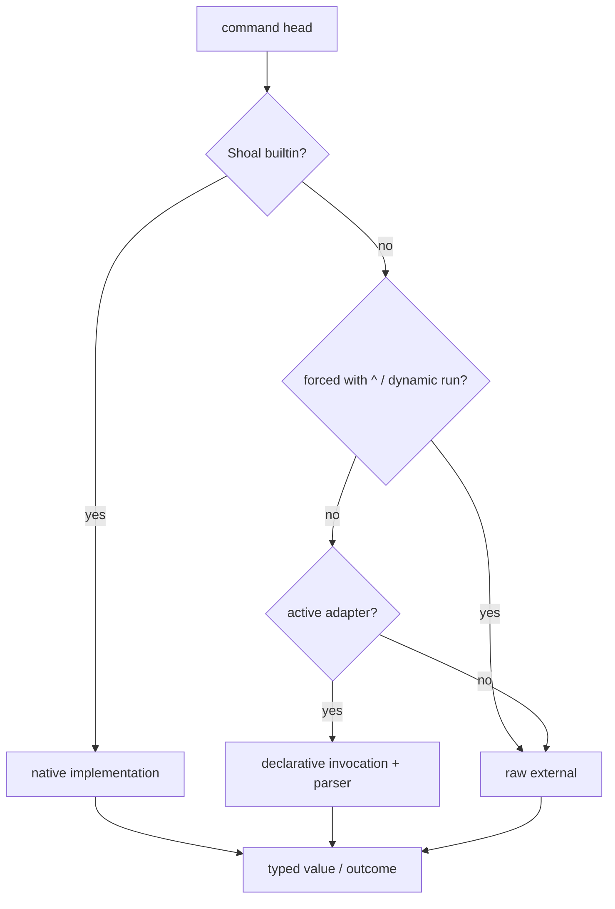

+++
title = "External commands and data exchange"
description = "Run raw and adapted programs, understand PTY versus capture, serialize stdin with feed, redirect output, and embed interpreter source safely."
weight = 100
template = "docs/page.html"

[extra]
eyebrow = "Process I/O"
group = "Shell & tools"
audience = "Shell and integration authors"
status = "Current process runner and adapter pack"
toc = true
+++

Shoal treats process invocation as a typed boundary: command arguments become argv, stdin is supplied explicitly, and completion produces an outcome containing status, bytes, timing, and optionally parsed data.

## The three command tiers



- Builtins provide native typed behavior.
- Adapters validate a known command surface, may pin a machine-readable output mode, declare effects, and parse output.
- Raw externals receive argv without an adapter schema.

Skip adapter dispatch with `^` (provided no callable binding or builtin owns the same head):

```text
git status               # adapter when active
^git status --porcelain  # raw git; bypasses adapter validation/parsing
```

`^` also bypasses a non-callable value shadow, but it does not bypass functions, aliases, other callables, or builtins. Those resolve first. Use `run("name", ...)` when an executable shares one of those names.

Dynamic raw names use `run`:

```text
let tool = "printf"
run(tool, "%s\n", "hello")
```

## Statement execution and capture

In an interactive terminal, a foreground external command in statement position can run through a real PTY and tee bytes directly to the terminal. This preserves colors, progress UI, prompts, signals, and terminal sizing. Shoal marks the outcome as streamed so its renderer does not duplicate the bytes afterward.

In value position, scripts, `-c`, and other non-interactive hosts, output is captured:

```text
let result = (^git rev-parse HEAD)
result.ok
result.stdout
result.out
```

Interactive programs that truly need a terminal can also be reached through the `interact` surface or MCP PTY tools. Do not expect a captured value invocation to satisfy arbitrary TUI terminal assumptions.

## Argument conversion

Raw external argv accepts values with a clear argument representation. Paths remain path arguments; scalar values render as one argument. Collections, records, tasks, streams, errors, closures, and secrets are not silently flattened into arbitrary argv.

```text
^printf "%s\n" (42)
^cat (path("./README.md"))
```

Use a typed Shoal function or adapter when a command needs schema-driven conversion and validation. Use `--` to stop flag interpretation where the command grammar supports it.

## Adapter behavior

An adapter can describe:

- executable name and class (`cli`, `tui`, `daemon`, `interpreter`);
- accepted status codes;
- top-level and subcommand parameters;
- positional binding and short-flag aliases;
- a fixed invocation prefix;
- flags consumed by Shoal to protect a pinned output format;
- output parser and optional type shape;
- effects used by planning/policy.

For example, the bundled Git status adapter invokes porcelain v2 and parses rows with `status`, semantic `state`, `path`, and optional original path. The bundled `ps` and `df` adapters pin portable column layouts and return typed tables.

```text
(git status).where(.state == "modified").map(.path)
(ps).sort_by(.cpu).reverse().first(10)
(df).where(.avail < 5gb)
```

An active adapter rejects unknown flags rather than passing them through and hoping its parser still matches. Prefix with `^` when using an unsupported real CLI flag intentionally.

If parsing fails, raw stdout remains available on the outcome; Shoal does not fabricate structured rows.

## Bundled and custom adapters

The repository currently ships 49 adapter definition files, catalogued in [Reference inventory](@/docs/reference.md). They cover common version-control, container, cloud, package, system-inspection, archive, search, language-runtime, and data tools.

Add directories in configuration:

```toml
[adapters]
dirs = ["~/.config/shoal/adapters"]
```

A minimal custom file:

```toml
[cmd.example]
bin = "example"
class = "cli"
ok_codes = [0]
params = { format = "str?" }
output = { parse = "json", type = "record" }
effects = ["fs.read(cwd)"]

[cmd.example.sub.list]
invoke = ["list", "--format", "json"]
params = { all = "bool" }
output = { parse = "json", type = "table<{name: str}>" }
effects = ["fs.read(cwd)"]
```

Supported output parsers are `json`, `ndjson`, `csv`, `tsv`, `z-records`, `porcelain-v2`, `cols`, `cols2`, `tsv-headerless`, `lines`, `kv`, and `none`.

Malformed adapter files produce warnings while valid siblings continue loading. Current preview caveat: the host loads the bundled directory and configured directories in order, but the evaluator catalog setter replaces the active catalog; with custom directories configured, the final directory can become the active execution catalog rather than a true merged overlay. Completion may still see names from all catalogs. Treat cross-directory layering as unfinished and keep a needed combined pack in one directory for now.

## Feed a finite value to stdin

`feed` is explicit byte plumbing:

```text
"alpha\nbeta\n".feed(^wc -l)
["alpha", "beta"].feed(^sort -r)
{ project: "shoal", ready: true }.feed(^jq .project)
```

Both orientations are accepted when useful:

```text
value.feed(command args)
(command args).feed(value)
```

The serialization contract is:

| Value | stdin bytes |
|---|---|
| `str` | UTF-8 bytes, no added newline |
| `bytes` | raw bytes |
| `int`, `float`, `bool`, `size`, `duration`, `datetime`, `time` | inline rendered text, no added newline |
| `list<str>` | newline-joined, with a trailing newline |
| other `list` | compact JSON array |
| `record`, `table` | compact JSON |
| successful `outcome` | semantic `out` when structured, otherwise stdout |

A path is a name, not its content, and cannot be fed directly:

```text
path("input.txt").read.feed(^consumer)
path("input.bin").read_bytes.feed(^consumer)
```

Secrets, tasks, closures, errors, globs, and regexes are not feedable. Streams feed a process
incrementally through a bounded stdin queue; each item uses the same serialization rules and is
line-framed. This works for finite and live streams, and stops the upstream pump when the command
exits or fails to spawn:

```text
tail(path("input.log"), from_start: true)
  .take(100)
  .feed(^consumer)
```

An endless stream keeps the command alive until the command exits, the stream is bounded, or the
operation is cancelled.

## Redirect command output

```text
^tool > ./result.txt
^tool >> ./result.log
^tool < ./input.txt
```

Redirection applies to builtins and externals. If captured stdout spilled to content-addressed storage, output redirection loads the full content rather than writing only its resident preview.

Overwriting an existing file can participate in journal undo when the prior bytes fit the journal cap. Creating a new file by redirection currently records no delete-on-undo inverse. Append/overwrite behavior and limitations are in [Filesystem, jobs, history, and undo](@/docs/filesystem-jobs-history.md).

## Interpreter blocks

Interpreter blocks preserve source verbatim instead of forcing it through Shoal string and command parsing:

```text
python3 {
import json
print(json.dumps({"answer": 42}))
}.out.answer

sh '''
printf '%s\n' "$HOME"
'''
```

Known inline conventions are:

| Tools | Program delivery |
|---|---|
| `sh`, `bash`, `zsh`, `fish`, `python`, `python3` | `-c PROGRAM` |
| `node`, `ruby`, `perl`, `lua`, `Rscript`, `osascript` | `-e PROGRAM` |
| `php` | `-r PROGRAM` |
| `deno` | `eval PROGRAM` |
| `jq` | program as positional argument |
| unknown interpreter-class convention | program on stdin |

Source and data are separate channels when the interpreter supports an inline-program argument:

```text
{"name":"shoal"}.feed(python3 {
import json, sys
print(json.load(sys.stdin)["name"].upper())
})
```

An interpreter whose **program itself** is delivered on stdin cannot simultaneously receive fed data on that same stdin; the evaluator reports an error instead of concatenating two protocols.

`sh { ... }` is the escape hatch for a small, intentional POSIX pipeline. Shoal cannot infer detailed filesystem/network effects inside opaque shell source, and undo cannot reverse those mutations automatically.

## Effects and plans

Every process spawn has at least a spawn effect. Adapters can add precise filesystem/network effects derived from typed parameters. Raw commands and interpreter blocks are necessarily more opaque.

```text
plan { git push origin main }
explain("git status")
```

Planning does not make an adapter truthful by itself—the adapter declaration is part of the trusted integration surface. Review custom effect declarations before using them for agent authorization.

## Secrets at process boundaries

Secret values deliberately fail ordinary argv, interpolation, feed, and serialization. Policy-aware integrations can inject them in explicit contexts such as an HTTP header. This prevents accidental log/render leaks but does not protect a secret after an authorized child receives it.

For remote agent execution, combine secret handling with principal identity, capability approval, and leash policy; see [Agents, kernel, and MCP](@/docs/agents-kernel-mcp.md).
