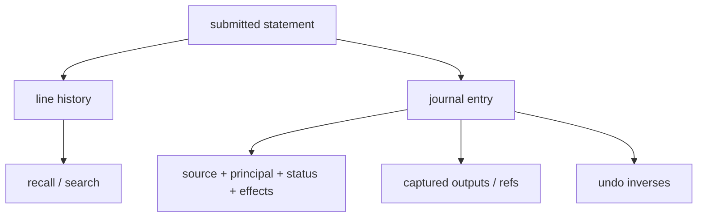
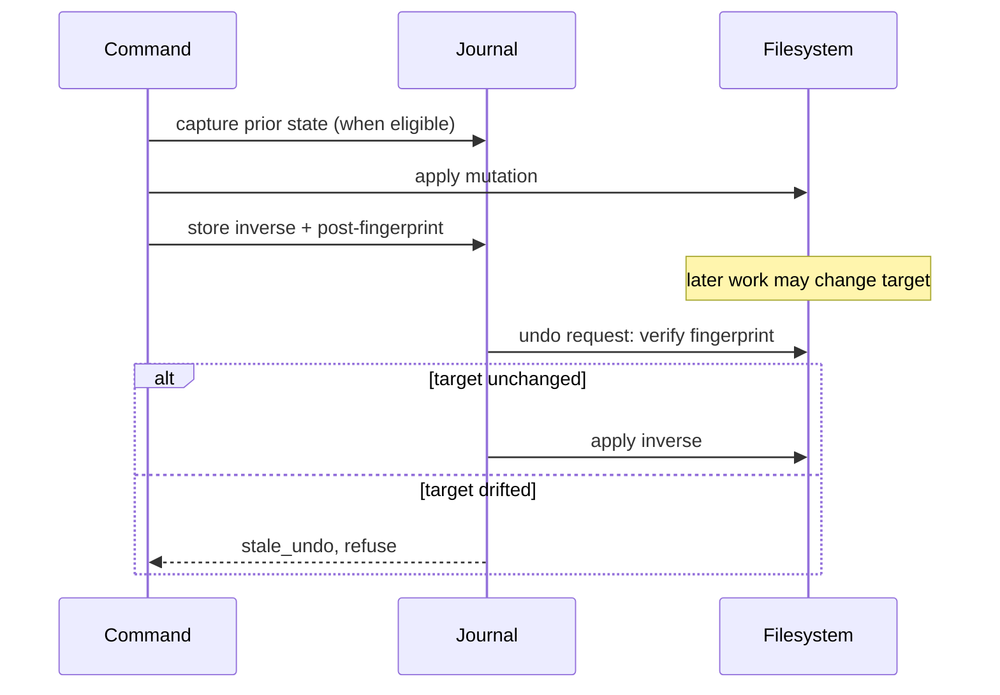

+++
title = "Filesystem, jobs, history, and undo"
description = "Use structured filesystem builtins, manage local tasks and process groups, inspect the journal, and understand exactly which mutations can be reversed."
weight = 120
template = "docs/page.html"

[extra]
eyebrow = "Session operations"
group = "Shell & tools"
audience = "Interactive users and automation authors"
status = "Current local host and evaluator behavior"
toc = true
+++

Shoal's native filesystem commands return typed values and can record effects in a journal. That enables safer inspection and targeted undo, but only for operations with a captured inverse. It is not a universal transactional filesystem.

## Filesystem query builtins

`ls` returns a table. Each row currently contains:

| Field | Type | Meaning |
|---|---|---|
| `path` | `path` | full path used by the evaluator |
| `name` | `str` | basename |
| `type` | `str` | `file`, `dir`, `symlink`, or `other` |
| `size` | `size` | metadata byte length |
| `modified` | `datetime` or `null` | modification time |

```text
(ls .)
  .where(.type == "file")
  .where(.size > 1mb)
  .sort_by(.modified)
```

`ls --all`/`-a` includes dot entries. Multiple path arguments are accepted and results are sorted by path.

`stat` returns one record for one path and a table for multiple paths, using the same metadata shape:

```text
(stat ./Cargo.toml).size
stat ./README.md ./LICENSE
```

Other read-oriented builtins:

```text
cat ./one.txt ./two.txt       # bytes concatenated
head ./service.log 20         # list<str>, lossy UTF-8
which cargo                   # Reef-aware resolution report in evaluator surface
env                           # environment record
env HOME                      # string or null
```

Because `which` is intercepted by Reef-aware dispatch, its public result is richer than the low-level fallback path lookup. See [Reef environments](@/docs/reef.md).

## Mutation builtins

```text
mkdir --parents ./build/output
touch ./build/output/ready
cp --recursive ./assets ./build/assets
mv ./draft.txt ./final.txt
ln --symbolic ../final.txt ./build/final-link
rm ./obsolete.txt
```

| Command | Result payload |
|---|---|
| `mkdir` | list of created paths |
| `touch` | list of touched paths |
| `cp` | list of destination paths |
| `mv` | list of destination paths |
| `ln` | `{target, link, symbolic}` |
| default `rm` | list of `{path, trash, trash_retention_days}` records, with cleanup warnings when applicable |
| `rm --permanent` | list of removed paths |

Directories require `cp --recursive` and `rm --recursive` where relevant. An unmatched/empty removal is an error rather than a silently successful destructive command.

Default `rm` atomically moves targets into a private, process-specific directory beneath Shoal's UID-qualified runtime directory. If that directory is on another filesystem (or is unavailable), Shoal instead uses a private, UID-qualified hidden `.shoal-trash-UID` directory beside the source so the move remains atomic and preserves directories, symlinks, metadata, and journal undo. On Unix, unsafe ownership, symlinks, or group/other permissions are rejected. A bounded best-effort cleanup pass removes trash sessions older than 30 days; cleanup failures are reported in `trash_cleanup_warnings` rather than hiding a successful move. Trash still consumes disk space until that cleanup runs. Use `rm --permanent` when space must be reclaimed immediately; it deletes directly and has no restore inverse.

## Path methods and save forms

```text
let p = path("./notes.txt")
p.read
p.read_bytes
p.lines
p.exists
p.size

"replacement".save(p)
"append this".append(p)
save(p, "replacement")
```

Method form places the content on the receiver. The evaluator's `save(path, value)` function form places the path first. Use bytes when exact content matters.

`open` delegates to the host/platform opener surface. It is a host interaction, not a data read; do not use it in headless automation without checking availability.

## Current directory and directory stack

```text
pwd
cd ./crates
pushd ../site
dirs
popd
cd -
```

`dirs` returns `list<path>` with current directory first. `j`/`jump` use a frecency database in interactive sessions. Current-directory mutations are session state and are disallowed inside function bodies; scope them with `with cwd:` instead.

## Tasks

Create tasks with a block or trailing ampersand:

```text
let test_task = spawn { cargo test }
sleep 30s &

jobs
test_task.is_done()
test_task.await()
```

Task methods are:

```text
await wait cancel is_done suspend resume is_suspended
```

`await`/`wait` return the task result or propagate its error. `cancel` requests cancellation. Local suspension methods are meaningful where the task owns controllable local process state.

## Local process-group job control

The interactive Unix REPL gives foreground externals a process group:

- `Ctrl-C` interrupts the foreground tree without killing Shoal.
- `Ctrl-Z` stops the foreground group and registers a job.
- `jobs` reports IDs, descriptions, state, completion, and suspension.
- `fg %N` resumes in the foreground.
- `bg %N` resumes in the background.

```text
jobs
bg %1
fg %1
```

`fg task_variable` is rewritten to resume and await a language task. A known preview gap is incomplete asynchronous state refresh for an external resumed with `bg`; after it exits, its table state may stay “running” until foregrounded or session shutdown.

This is local REPL behavior. Kernel task suspend/resume currently returns `TASK_CONTROL_UNAVAILABLE`, and MCP PTY control is a separate rendered-terminal protocol.

## Line history versus journal



Line history powers the editor. The journal is structured execution history. View journal rows with either command head:

```text
journal
history
journal --head=rm --limit=20
journal --principal=human --limit=50
```

Rows contain `id`, `ts`, `principal`, full `src`, `ok`, `status`, and serialized `effects`. A host without an installed journal returns an empty table.

In the local REPL, state defaults under `$XDG_STATE_HOME/shoal`, falling back to `~/.local/state/shoal`. Journal ownership and principal information are more important in a kernel session, where humans and agents share a durable session host.

## Undo protocol

```text
undo                 # newest journal entry with an inverse
undo 42              # specific journal entry ID
undo out[3]           # REPL maps transcript result to entry ID
```

Undo first validates that the target still matches the fingerprint recorded after the original mutation. If later activity changed it, Shoal raises `stale_undo` instead of overwriting the newer state.



## What is reversible

| Operation | Current inverse | Important condition |
|---|---|---|
| default `rm` | move temp-trash item back | trash item still matches fingerprint |
| overwrite via `cp` | restore prior bytes | prior file captured below journal cap |
| overwrite via `mv` | move destination back | paths/fingerprints still safe |
| overwrite via `save`/path `.save` | restore prior bytes | prior file existed and fit cap |
| overwrite/append redirect | restore prior bytes | target existed and fit cap |

## What is not reversible

- `rm --permanent`;
- opaque changes made inside `sh { ... }` or an arbitrary external command;
- creation of a previously nonexistent file by redirect/save (no delete inverse yet);
- a prior file too large to capture without truncation;
- changes whose post-state fingerprint no longer matches;
- network, process, and other non-filesystem effects;
- work executed in a host with no installed journal.

“Journaled” means recorded, not automatically reversible. Inspect the `effects` and the command's documented inverse class before assuming rollback.

## Captured output and CAS

Value-position process output is bounded in memory. The default resident capture cap is 64 MiB and can be changed with `SHOAL_CAPTURE_CAP_BYTES`. In a journaled session, overflow can spill into content-addressed storage up to the spill cap (default 1 GiB, `SHOAL_CAPTURE_SPILL_CAP_BYTES`). A lazy bytes reference preserves the true length and loads content on demand.

The journal also has an output hard cap (default 256 MiB). Prior file content that exceeds the applicable journal cap is deliberately left without an undo inverse; restoring truncated bytes would be worse than refusing undo.

Large captures and kernel response refs are detailed in [Agents, kernel, and MCP](@/docs/agents-kernel-mcp.md) and [Current status and limits](@/docs/status-limits.md).

## Safety checklist

Before a destructive workflow:

1. Run it in value position or `plan { ... }` when you need inspection.
2. Prefer native builtins/adapters over opaque `sh` for effect visibility.
3. Verify the session actually has a journal.
4. Avoid `--permanent` unless irreversibility is intentional.
5. Check `journal --head=<command>` immediately after the operation.
6. Treat `undo` as a guarded inverse, not as a filesystem snapshot.
