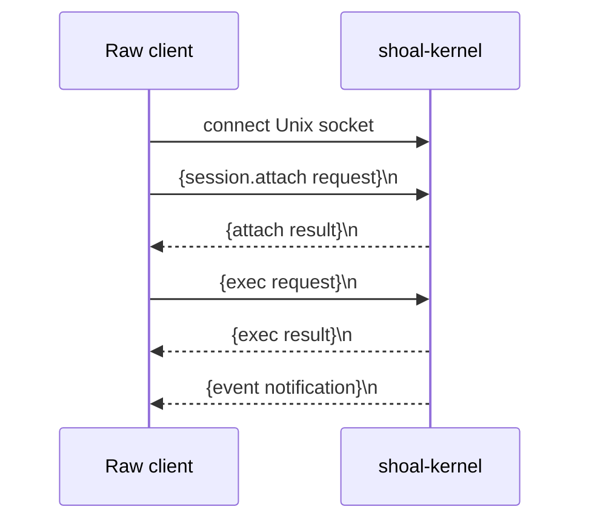

+++
title = "Kernel JSON-RPC protocol"
description = "The raw newline-framed Shoal kernel API: attachment, execution, values, tasks, plans, PTYs, events, wire types, and errors."
weight = 200
template = "docs/page.html"

[extra]
eyebrow = "Protocol reference"
group = "Agents & protocol"
audience = "Kernel client implementers and Shoal maintainers"
status = "Current implementation, including known security defects"
toc = true
+++

`shoal-kernel` serves JSON-RPC 2.0 over a Unix-domain socket. Each request or response is one compact JSON object followed by a newline. The API is useful for native clients that need methods not exposed by MCP, but it is a lower-level and less protected boundary: clients own framing, attachment, notification demultiplexing, resource limits, and reconnect behavior.

> **Security warning:** socket possession must currently be treated as full kernel trust. `cap.request` and `journal.query` are mistakenly routed without requiring `session.attach`; the latter can disclose global journal source/AST/effects/output hashes, while the former can approve a known non-denied plan without authenticating its caller. Keep the socket in a private `0700` directory with a `0600` socket, do not proxy it to untrusted peers, and read [Security and trust boundaries](@/docs/security.md).

## Transport



Wire rules:

- Unix-domain stream socket only;
- UTF-8 JSON text;
- exactly one JSON value per newline-delimited frame;
- maximum input line length 16 MiB;
- JSON-RPC version string must be `"2.0"`;
- request IDs are arbitrary JSON values and are echoed verbatim;
- subscription notifications have no `id`;
- multiple requests may share a connection, but clients must demultiplex responses by `id` because event notifications can interleave.

Request:

```json
{"jsonrpc":"2.0","id":1,"method":"parse","params":{"src":"1 + 2"}}
```

Success:

```json
{"jsonrpc":"2.0","id":1,"result":{"ast_version":2,"ast":{"stmts":[]}}}
```

Failure:

```json
{
  "jsonrpc": "2.0",
  "id": 1,
  "error": {
    "code": -32001,
    "message": "expected expression",
    "data": { "span": { "start": 4, "end": 4 }, "hint": null }
  }
}
```

The raw kernel reader does not produce a `-32700` response for malformed JSON. A bad JSON frame or a line over 16 MiB ends that connection. The MCP stdio facade, by contrast, reports malformed MCP JSON as `-32700`.

Use one writer lock per connection. A subscription writer in the kernel may emit a complete `event` frame while ordinary request handling is active, but the kernel serializes whole frames so bytes do not interleave.

## Discover the socket

The path selection used by shipped clients is:

1. explicit configured path;
2. `$XDG_RUNTIME_DIR/shoal/<session>.sock`;
3. `$TMPDIR/shoal-<uid>/shoal/<session>.sock`;
4. `/tmp/shoal-<uid>/shoal/<session>.sock`.

The kernel creates an owned runtime directory with mode `0700` and the socket with mode `0600`. It refuses to replace a live listener, another user's socket, or a non-socket path. An explicitly selected parent directory may be outside the kernel's ownership, so operators must secure it themselves.

There is no protocol version negotiation on this socket. `session.attach` returns `ast_version: 2`, which versions the serialized AST vocabulary, not the entire RPC surface. Additive result fields should be ignored by older clients; incompatible method changes require coordinated client/server release management.

## Attachment and the trust model

Most methods require one successful attachment per connection:

```json
{
  "jsonrpc": "2.0",
  "id": 1,
  "method": "session.attach",
  "params": {
    "session": "work",
    "token": "optional bearer secret",
    "client": { "kind": "native-agent", "tty": false }
  }
}
```

| Param | Type | Default | Meaning |
| --- | --- | --- | --- |
| `session` | string or null | `default` | Named long-lived evaluator. |
| `token` | string or null | no token | Authenticate an agent principal. |
| `client.kind` | string | empty | Informational client kind. |
| `client.tty` | boolean | `false` | Preserve terminal color in bounded renders when true. |

Without a token, attachment grants the kernel process's local `uid:<euid>` principal and `local-human` profile. The kernel does not authenticate the Unix peer with `SO_PEERCRED`; ability to reach the private socket is what protects this path. With a token, the token store supplies principal, profile, declared capabilities, expiry, and revocation state.

Representative result:

```json
{
  "session": "work",
  "principal": "agent:reviewer",
  "caps": {
    "enforced": true,
    "tier": "A",
    "available_tier": "A",
    "policy_principal": "agent:reviewer",
    "profile": "reviewer",
    "token_caps": ["fs.read", "proc.spawn"],
    "opaque": "deny"
  },
  "cwd": { "display": "/home/me/project" },
  "env_hash": "local",
  "ast_version": 2,
  "caps_enforced": true,
  "elide_defaults": {
    "max_bytes": 8192,
    "max_rows": 100,
    "max_items": 500,
    "max_bytes_raw": 4096,
    "hard_cap": 65536
  },
  "channels": ["session.transcript", "journal", "approval", "render"]
}
```

`env_hash` is currently the literal placeholder `local`; do not use it for cache invalidation. `caps_enforced` is the concise answer to whether this principal has a real OS sandbox, while `available_tier` only describes the best backend detectable on the host.

### Methods before attachment

Intended read-only pre-attachment methods are:

- `session.attach`;
- `parse`;
- `complete`.

Current routing also permits `cap.request` and `journal.query` before attachment. That behavior is a P0 defect, not a supported anonymous API. A secure client or proxy must not reproduce it as an authorization rule.

## Method index

| Method | Attachment | Summary |
| --- | --- | --- |
| `session.attach` | no | Select session and principal. |
| `session.env` | yes | Live policy-filtered environment. |
| `session.reef` | yes | Live Reef scope/bindings. |
| `parse` | no | Parse source to versioned AST. |
| `complete` | no | Complete at a source byte offset. |
| `explain` | yes | Parse/accept AST and derive effects without storing/applying. |
| `exec` | yes | Run, plan, or internally apply source. |
| `value.get` | yes | Select/slice/render a transcript value. |
| `blob.get` | yes | Read CAS content by hash. |
| `journal.query` | **currently no** | Query global durable journal; missing gate is a defect. |
| `task.list` | yes | List session tasks. |
| `task.get` | yes | Snapshot a task. |
| `task.await` | yes | Block until a task terminal state. |
| `task.cancel` | yes | Request cancellation. |
| `task.suspend` | yes | Present but currently always unavailable. |
| `task.resume` | yes | Present but currently always unavailable. |
| `plan.get` | yes | Inspect stored plan. |
| `plan.list` | yes | List plans matching stored caller metadata. |
| `plan.apply` | yes | Apply an allowed/approved stored plan. |
| `cap.request` | **currently no** | Approve known plan; missing gate is a defect. |
| `pty.open` | yes | Spawn interactive child. |
| `pty.send` | yes | Write terminal input. |
| `pty.read` | yes | Read emulated screen. |
| `pty.resize` | yes | Resize grid/window. |
| `pty.close` | yes | Terminate and reap. |
| `pty.list` | yes | List session PTYs. |
| `events.read` | yes | Cursor-read channel. |
| `events.publish` | yes | Publish `user.*`. |
| `events.subscribe` | yes | Push channel events on connection. |
| `events.unsubscribe` | yes | Remove same-connection subscription. |

## Session inspection

### `session.env`

Params are `{}`. Result when environment reading is allowed:

```json
{
  "granted": true,
  "names": ["HOME", "PATH"],
  "env": { "HOME": "/home/me", "PATH": "/usr/bin" }
}
```

When denied, `granted` is false and only sorted names are returned. Values are read live from the session evaluator. Non-UTF-8 environment names/values are currently omitted because this view only includes pairs convertible to UTF-8.

### `session.reef`

Params are `{}`. Result:

```json
{
  "active_scope": "/home/me/project",
  "bindings": [
    {
      "tool": "jq",
      "version": "1.7.1",
      "provider": "system",
      "scope": "/home/me/project",
      "constrained": true
    }
  ]
}
```

This is a cached evaluator snapshot: no subprocess, download, or fresh resolution is performed.

## Parsing, completion, and explanation

### `parse`

```json
{"src":"let answer = 6 * 7"}
```

Returns `{ "ast_version": 2, "ast": ... }`. Language syntax errors use `PARSE_ERROR` (`-32001`) with source span/hint data. Parsing does not evaluate, attach, inspect the filesystem, or store a plan.

### `complete`

```json
{"src":"(ls .).whe","cursor":10}
```

`cursor` is an optional UTF-8 **byte offset**, defaulting to `src.len()`. Values greater than length are clamped. The result is `{ "candidates": [...] }`. Candidate shape is implementation-defined and may grow; use offered replacement spans rather than reconstructing them from labels when present.

### `explain`

Accept exactly one useful input form:

```json
{"src":"rm ./scratch.txt"}
```

or:

```json
{"ast":{"stmts":[...]}}
```

It returns `ast_version`, canonical AST, derived `effects`, `reversibility`, and a calculated `plan_ref`. It does **not** insert the plan into the stored-plan map, request approval, or execute. If both `src` and `ast` are present, `src` wins. If neither is present, params are invalid.

The returned reference is only a planner fingerprint, not proof that `plan.get`/`plan.apply` will find a stored plan. Use `exec` with `mode: "plan"` to store one.

## `exec`

Raw params:

```json
{
  "src": "(ls .).where(.type == 'file')",
  "mode": "run",
  "position": "stmt",
  "async": false,
  "timeout_ms": 5000,
  "elide": {
    "max_bytes": 8192,
    "max_rows": 100,
    "max_items": 500
  },
  "plan_ref": null
}
```

| Param | Default | Notes |
| --- | --- | --- |
| `src` | required | Shoal source. |
| `mode` | `run` | Public values `run` or `plan`; `approved` is internal re-entry and must pass stored-plan checks. |
| `position` | `stmt` | `stmt` raises a failed final outcome; `value` captures it. |
| `async` | false | Alias `background` is also accepted during deserialization. |
| `timeout_ms` | none | Converts unfinished work to a task; does not kill it. |
| `elide` | defaults | Optional thresholds. |
| `plan_ref` | none | Required and verified for `mode: "approved"`. |

Unlike MCP `shoal_exec`, the raw default position is `stmt`. Make position explicit in cross-surface code.

Completed success:

```json
{
  "ref": "out:12",
  "value": { "$": "int", "v": 42 },
  "render": "42"
}
```

A language error stores an addressable `out:N` error value and returns `RAISED` (`-32002`) with the reference/URI in error data. A parse error occurs before transcript insertion.

Background result:

```json
{"task":"task:7","events":"task.7"}
```

Timed-out wait:

```json
{"task":"task:7","events":"task.7","timed_out":true}
```

If timeout-backed work finishes before the deadline, the result is returned inline. Internally the work still ran through a task entry, which may remain visible in `task.list`.

### Planning and internal approval mode

`mode: "plan"` derives policy effects, stores source/session/principal metadata, and inserts the plan under `plan:<16 hex>`. It returns:

```json
{
  "plan_ref": "plan:7b2fd854cb805ba1",
  "effects": [{"kind":"fs_write","path":"./out"}],
  "reversibility": "conditional",
  "verdict": "approval_required",
  "approval_pending": true
}
```

The reference hashes effects, reversibility, and estimates—not source, session, or principal—and is truncated to 16 hex characters. One global map uses it as the key, so same-shape plans can overwrite across callers. Stored metadata is checked during get/apply/approved execution and prevents a direct source swap, but the handle is collision-prone and ephemeral.

Clients should never send `mode: "approved"` directly as a privilege assertion. The handler requires a stored plan whose session, principal, exact source, and approval/allow state match. Use `plan.apply`.

## Values and blobs

### `value.get`

```json
{
  "ref": "out:12",
  "path": ".rows[0].name",
  "slice": [0, 10],
  "format": "json",
  "elide": { "max_bytes": 4096 }
}
```

`path` is applied first, then the half-open top-level slice, then format/elision. Paths support dot fields, nonnegative `[n]`, and `[a..b]`; tables expose columns and `.rows`; outcome unknown fields forward into structured `.out`. Path indexes/ranges support lists/tables, while top-level slices additionally support strings and bytes.

Formats:

- `json` or omitted: `{ref, value}` using tagged wire types;
- `render`: `{ref, render}` with bounded 80-column display;
- `raw`: `{ref, raw}` for strings or `{ref, raw_base64}` for bytes/CAS bytes.

Current `raw` behavior materializes and returns the complete string/bytes and does not apply the normal 64 KiB encoded hard cap. Callers must impose their own bound. Other types reject raw format with `BAD_PATH_OR_SLICE`.

### `blob.get`

```json
{"hash":"8baef..."}
```

Returns `{hash, value}`. A CAS blob containing tagged JSON is decoded structurally; other bytes return:

```json
{"$":"bytes","len":1234,"v":"base64..."}
```

The method currently reads a complete blob into the response and has no range parameter. Use content refs deliberately and account for response size.

## Tasks

All task selectors use `{ "task": "task:7" }`.

| Method | Behavior |
| --- | --- |
| `task.list {}` | Returns records whose session ID matches the attached session. |
| `task.get` | Nonblocking record snapshot. |
| `task.await` | Blocks the connection until state is no longer `running`/`cancelling`. |
| `task.cancel` | Sets the cancellation token and returns `{task, cancel_requested:true}`. |
| `task.suspend` | Always returns `-32020` today. |
| `task.resume` | Always returns `-32020` today. |

Record:

```json
{
  "task": "task:7",
  "session": "work",
  "state": "completed",
  "started_ns": 1750000000000000000,
  "finished_ns": 1750000000123000000,
  "result_ref": "out:12",
  "error": null
}
```

Task access checks session name, not principal. Because multiple principals can attach to the same named session, a session is a collaboration/trust boundary rather than a principal-isolation boundary.

`task.await` has no timeout param and occupies the request path until terminal state. Prefer subscriptions/polling when the client must stay responsive.

## Plans and approval

### `plan.get`

```json
{"plan_ref":"plan:7b2fd854cb805ba1"}
```

Returns stored source, reparsed AST, effects, reversibility, current policy verdict, pending/approved flags. It requires stored session/principal equality.

### `plan.list`

Params `{}`. Returns summaries whose stored metadata matches attached session and principal. A colliding insertion may already have overwritten an earlier plan, so absence does not necessarily mean it was never derived.

### `plan.apply`

```json
{"plan_ref":"plan:7b2fd854cb805ba1"}
```

Checks stored session/principal and approval/current allow verdict, then internally dispatches exact stored source as statement-position approved execution. It cannot accept a replacement source. Plans are not transactions and are lost on restart.

### `cap.request`

```json
{
  "plan_ref": "plan:7b2fd854cb805ba1",
  "effects": ["fs.write", {"kind":"proc_spawn"}]
}
```

Strings and object `kind` fields are normalized. When a nonempty requested set does not cover every stored plan effect kind, the result remains `approval_pending` and lists uncovered effects. If policy is `Deny`, the method returns `LEASH_DENIED`. Otherwise it sets `approved: true` and returns enforcement truth.

**Current P0 defect:** the handler receives no attachment and verifies no caller principal/session. Anyone who can reach the socket and guess/learn a live plan reference can invoke it, including before `session.attach`. The MCP facade attaches its kernel connection first, but the kernel still does not use that attachment for this method. Do not expose the raw socket across a trust boundary.

## Journal

### `journal.query`

```json
{
  "since": 1750000000000000000,
  "until": 1750000100000000000,
  "principal": "agent:reviewer",
  "head": "git",
  "ok": true,
  "effects": ["fs.write"],
  "limit": 100
}
```

Returns entries containing ID, session, principal, nanosecond timestamp/duration, encoded cwd, original source, AST, effect data, status/ok/opaque, and output descriptors `{kind, hash, len}`.

`effects` uses all-of matching after normalizing dotted/snake-case names. `until` and effects are post-filters applied after the store query and its limit, so a tight limit can yield fewer results than requested even when older matching rows exist.

**Current P0 disclosure defect:** this handler has no attachment check and queries the process-wide journal. An unauthenticated socket client can read source, AST, effects, principals, paths, and output hashes. Socket filesystem permissions are presently the only reliable boundary.

## PTYs

Raw PTY params match the [MCP tool reference](@/docs/mcp-tools-reference.md#pty-lifecycle), except raw dimensions deserialize as unsigned 16-bit integers and do not carry the MCP schema's explicit `1..=1000` validation.

```json
{"cmd":"vim","args":["notes.md"],"cols":100,"rows":30,"env":{}}
```

```json
{"pty_id":"pty:2","input":["i","hello",{"key":"Escape"}]}
```

```json
{"pty_id":"pty:2"}
```

```json
{"pty_id":"pty:2","cols":120,"rows":40}
```

`pty.read` returns screen rows, cursor, change/liveness/exit metadata; no raw ANSI stream is available. `pty.list {}` and all selectors are session-scoped, not principal-scoped. `pty.close` terminates and reaps rather than detaching.

## Events

### Pull

```json
{"channel":"journal","since":81,"limit":100}
```

Result is `{channel, events:[...]}`; `since` is exclusive and `limit` keeps the newest matching tail.

### Publish

```json
{"channel":"user.build","payload":{"phase":"done"}}
```

Only `user.*` may be client-published. Result contains channel/seq/timestamp; the payload is also injected into the attached session's in-language channel bus.

### Subscribe

```json
{"channel":"task.7","since":2}
```

Result:

```json
{"channel":"task.7","subscribed":true}
```

Then the same connection receives:

```json
{
  "jsonrpc": "2.0",
  "method": "event",
  "params": {
    "channel": "task.7",
    "seq": 3,
    "ts": 1750000000000000000,
    "payload": {"$":"str","v":"started"}
  }
}
```

Replay from `since` is enqueued through the same 256-entry subscriber queue as live events. Overflow emits a synthetic `{dropped, latest_seq}` payload. `journal` and `session.transcript` support journal-backed older replay; other channels retain only 1,024 in memory.

### Unsubscribe

```json
{"channel":"task.7"}
```

Removes that channel subscription for the current connection and stops its kernel writer queue. It cannot unsubscribe a separate connection. This raw method works; the MCP facade's `resources/unsubscribe` currently does not forward it.

## Wire values

Shoal values use an internally tagged JSON object with `$` as the type discriminator.

| Shoal value | Wire example / fields |
| --- | --- |
| null | `{"$":"null"}` |
| bool | `{"$":"bool","v":true}` |
| int | `{"$":"int","v":42}` |
| float | `{"$":"float","v":3.5}` |
| str | `{"$":"str","v":"hello"}` |
| size | `{"$":"size","v":4096}` in bytes |
| duration | `{"$":"duration","v":1000000}` in ns |
| bytes | `{"$":"bytes","v":"base64..."}` |
| path | `{"$":"path","v":"display","raw":"optional base64"}` |
| list | `{"$":"list","v":[...]}` |
| record | `{"$":"record","v":{"field":...}}` |
| table | `{"$":"table","cols":{"name":[...]},"n":3}` |
| outcome | status/ok/signal/out/err/dur_ns/pid/cmd/optional span |
| error | code/msg/optional span/hint/stderr |
| datetime | `{"$":"datetime","v":"..."}`; see defect below |
| time | `{"$":"time","v":"HH:MM:SS"}` |
| glob | `{"$":"glob","pattern":"*.rs"}` |
| regex | `{"$":"regex","src":"..."}` |
| range | start/end/inclusive |
| task | id/done snapshot |
| closure | display-only `repr`; not wire-invocable |
| stream | label only; no wire chunk-pull method yet |
| secret | name only; material is never encoded |
| cmd | display-only `repr` |
| ref | URI/type/count/schema/preview/render head for elision |

Tables are columnar. Every column array has exactly `n` entries, and a missing field in a row becomes tagged null. Consumers can reconstruct rows by indexing all columns.

Paths preserve non-UTF-8 Unix bytes by including lossy `v`/`display` plus optional base64 `raw`. When `raw` exists, it is authoritative for round-trip filesystem operations.

### Current DateTime mismatch

The protocol type comment promises RFC 3339, but the encoder currently emits Unix epoch seconds as a decimal string:

```json
{"$":"datetime","v":"1750000123"}
```

Clients should accept this exact current behavior and avoid presenting it as RFC 3339 without conversion. This mismatch is tracked as a protocol defect and may be corrected in a future incompatible/negotiated revision.

### Elided references

When a value crosses row/item/byte thresholds, it becomes:

```json
{
  "$": "ref",
  "uri": "shoal://out/12",
  "of": "table",
  "n": 12000,
  "cols": {"name":"str","size":"size"},
  "preview": {"$":"table","cols":{},"n":5},
  "render_head": "first display lines…"
}
```

Defaults are 8 KiB encoded JSON, 100 table rows, 500 collection items, and 4 KiB raw bytes, with five preview items/rows or 256 preview bytes/chars and a ten-line render head. `max_bytes` is clamped to 64 KiB. Item/row overrides are not independently hard-capped, but the encoded byte wall still applies in JSON mode.

## Error codes

RPC errors and Shoal language `error` values are separate. The former control the JSON-RPC response; the latter can be stored in the transcript and use string codes such as `cmd_failed`.

| Code | Name | Meaning |
| ---: | --- | --- |
| `-32700` | RPC parse error | MCP malformed JSON only; raw kernel closes bad frame. |
| `-32600` | invalid request | Wrong JSON-RPC envelope/version. |
| `-32601` | method not found | No router method. |
| `-32602` | invalid params | Decode/enum/scope validation failed. |
| `-32603` | internal error | Serialization, journal I/O, or missing live subscribe connection. |
| `-32000` | not attached | Method requires `session.attach`. |
| `-32001` | Shoal parse error | Submitted source invalid. |
| `-32002` | raised | Evaluation raised; error value may have an output ref. |
| `-32004` | unknown ref | Transcript/CAS reference missing. |
| `-32005` | bad path or slice | Selection/format incompatible. |
| `-32010` | Leash denied | Policy denial or cross-session/principal plan access. |
| `-32011` | approval required | Plan/effects need approval. |
| `-32012` | unknown plan | Stored plan missing/expired/overwritten. |
| `-32020` | task control unavailable | Suspend/resume not implemented for kernel task. |
| `-32021` | unknown task | Missing or other-session task. |
| `-32022` | unknown PTY | Missing, closed, or other-session PTY. |
| `-32023` | PTY spawn failed | Executable/sandbox/PTY setup failure. |
| `-32030` | auth failed | Token unavailable/invalid/expired/revoked. |

Do not branch on error message prose. Branch on numeric code, then use structured `data` when present. Preserve unknown codes for forward compatibility.

## Minimal native-client loop

```text
connect socket
start one reader loop
send session.attach(id=1)
wait for response id=1

for each call:
    allocate unique id
    write one JSON object + newline under a writer lock
    await the matching id without discarding event notifications

reader loop:
    if frame.method == "event" and no id:
        dispatch by params.channel and seq
    else:
        resolve pending request by frame.id

on EOF or malformed frame:
    fail pending calls
    reconnect, attach, and restore subscriptions/cursors
```

Keep request-response reading and event processing in one authoritative demultiplexer. A simple “write then read next line” client breaks as soon as a subscription notification arrives before its response.

For the higher-level surface that handles attachment and wrapping, use [MCP tools](@/docs/mcp-tools-reference.md) and [MCP resources/events](@/docs/mcp-resources-events.md).
