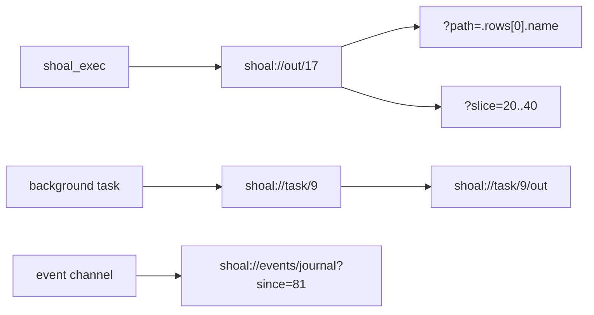
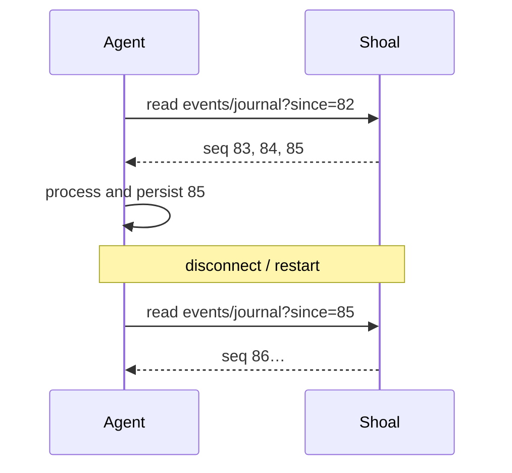

+++
title = "MCP resources and events"
description = "Addressable Shoal values, session views, task and PTY resources, event cursors, replay, and subscription behavior."
weight = 190
template = "docs/page.html"

[extra]
eyebrow = "Agent interface"
group = "Agents & protocol"
audience = "MCP client implementers and long-running agents"
status = "Current resource and event contract"
toc = true
+++

Shoal resources turn execution results and live session state into addressable nouns. An agent can execute once, keep a URI, and retrieve a small field later without repeating the command. Event resources add monotonic per-channel cursors so a client can catch up after a pause and subscribe for changes.



The MCP facade implements:

- `resources/list` for stable roots plus live tasks, plans, and PTYs;
- `resources/templates/list` for parameterized URI forms;
- `resources/read` for current content;
- `resources/subscribe` for event and task update notifications;
- `resources/unsubscribe`, currently acknowledged but not connected to the background forwarder.

## Listed resources

`resources/list` always begins with six roots:

| URI | Name | Meaning |
| --- | --- | --- |
| `shoal://journal` | `journal` | Structured execution journal. |
| `shoal://jobs` | `jobs` | Background task table. |
| `shoal://session/cwd` | `cwd` | Working directory captured at MCP attachment time. |
| `shoal://session/env` | `env` | Live environment view, with values policy-gated. |
| `shoal://session/reef` | `reef` | Live active Reef scope and tool bindings. |
| `shoal://pty` | `pty` | Open interactive PTY summaries. |

The list then asks the kernel for live session state and adds:

- one `shoal://task/{id}` entry per open/recent task returned by `task.list`;
- one `shoal://plan/{ref}` entry per plan whose stored metadata is visible to this session and principal;
- one `shoal://pty/{id}` entry per open PTY in this session.

`resources/list` is a snapshot, not an inventory subscription. A resource may disappear before it is read, and a newly created task will not appear in a previously cached list. Transcript and content-addressed values are discoverable from execution results and URI templates rather than enumerated wholesale.

Every listed entry advertises `application/json`, even when a later read with `format=render` or `format=raw` returns `text/plain`.

## URI templates

The facade advertises nine templates:

| Template | Purpose |
| --- | --- |
| `shoal://out/{n}{?path,slice,format}` | Session transcript value. |
| `shoal://val/{hash}` | Immutable content-addressed value. |
| `shoal://task/{id}` | Task record. |
| `shoal://task/{id}/out{?path,slice,format}` | Completed task's captured output. |
| `shoal://plan/{ref}` | Stored plan details. |
| `shoal://session/{view}` | `cwd`, `env`, or `reef`. |
| `shoal://pty/{id}` | Rendered PTY screen. |
| `shoal://journal{?since,until,head,principal,ok,effects,limit}` | Filtered journal query. |
| `shoal://events/{channel}{?since,limit}` | Cursor read of an event channel. |

URI path segments and query values receive percent decoding. Encode characters such as spaces, slashes inside a single segment, brackets in strict clients, and nested query punctuation. Query parameters that cannot be parsed into their required type are generally omitted/defaulted by the resource parser rather than becoming arbitrary language expressions.

## Resource read envelope

A JSON-valued resource read has this MCP shape:

```json
{
  "contents": [
    {
      "uri": "shoal://out/17?path=.name",
      "mimeType": "application/json",
      "text": "{\n  \"$\": \"str\",\n  \"v\": \"shoal\"\n}"
    }
  ],
  "structuredContent": { "$": "str", "v": "shoal" }
}
```

Use `structuredContent` as the machine value. The `text` member is a bounded, pretty JSON representation for hosts that only display resource text. It uses the same 64 KiB text cap as MCP tool rendering.

When the kernel returns a `render` or `raw` string, the content uses `text/plain`:

```json
{
  "contents": [
    {
      "uri": "shoal://out/17?format=render",
      "mimeType": "text/plain",
      "text": "42"
    }
  ],
  "structuredContent": {
    "ref": "out:17",
    "render": "42"
  }
}
```

Kernel errors during `resources/read` become an MCP request error string prefixed with `kernel error:` rather than a resource result with `isError`; `isError` is a tool-result concept.

## Transcript values: `shoal://out/{n}`

An ordinary execution returns a short reference such as `out:17` and the equivalent URI `shoal://out/17`. The number is allocated within one named session's live evaluator. It is not globally unique, durable across kernel restart, or valid in another session.

```text
shoal://out/17
shoal://out/17?path=.rows[0].name
shoal://out/17?slice=20..40
shoal://out/17?path=.items&slice=0..10&format=json
```

The complete value is held by the session transcript store even when the first response showed only a preview. Reading a URI does not execute the original source again.

### Paths

The path selector supports a deliberately side-effect-free subset:

| Form | Meaning |
| --- | --- |
| `.field` | Record/outcome field or table column. |
| `[n]` | Nonnegative list/table/string/bytes index where applicable. |
| `[a..b]` | Half-open nested slice. |
| `.rows` | Table rows as records. |
| `.out.users[0].name` | Chained selection. |

Paths cannot call methods, evaluate operators, dereference variables, or run source. A malformed selector, missing field, invalid index, or incompatible scalar produces kernel `BAD_PATH` (`-32005`).

### Slices

The URI query uses `slice=a..b`, not JSON array syntax:

```text
shoal://out/17?slice=0..50
```

It maps to the raw kernel array `[0, 50]`. Bounds are nonnegative and the end is exclusive. Lists slice by item, tables by row, bytes by octet, and strings by Unicode scalar value. Use `path` and `slice` together to page a nested collection.

### Formats

| `format` | Result |
| --- | --- |
| omitted or `json` | Tagged wire JSON with normal elision. |
| `render` | Human display string in `text/plain`. |
| `raw` | Verbatim string, or base64 for bytes/CAS blobs; other value types reject it. |

`format=raw` is intended for explicit data transfer, not casual inspection. In the current implementation, raw string/byte retrieval bypasses the normal encoded 64 KiB value ceiling: the MCP `contents[].text` presentation is bounded, but `structuredContent.raw` or `structuredContent.raw_base64` can contain the full payload. Treat the URI as potentially large and apply client-side limits. This is a known current behavior, not a guarantee that future versions will remain unbounded.

The `shoal_get` MCP tool intentionally does not advertise `format`; representation selection is available through the URI or raw kernel method.

### Elision through a URI

The implementation accepts an additional, currently unadvertised `elide` query value containing percent-encoded JSON:

```text
shoal://out/17?elide=%7B%22max_rows%22%3A20%7D
```

Because it is not part of the published URI template, portable MCP clients should prefer `shoal_get` for a custom elision budget. The stable drill-down mechanisms are `path` and `slice`.

## Content values: `shoal://val/{hash}`

Large immutable values may be stored in the content-addressed store and referenced as:

```text
val:blake3:8baef...
shoal://val/blake3:8baef...
shoal://val/8baef...
```

The resource layer accepts the bare hash or strips the `blake3:` prefix before calling `blob.get`. Content references are backed by the kernel's CAS and can survive evaluator/session recreation when the journal/state directory survives. Their availability is still subject to garbage collection and state-directory selection.

A content hash identifies bytes, not authorization. The local socket/token/session policy remains the access boundary around `blob.get`.

## Tasks: `shoal://task/{id}`

Read the current record for background or timed-out execution:

```text
shoal://task/9
```

The URI restores the short `task:9` form and calls `task.get`. A record exposes state, source/description metadata, timestamps, and—after successful capture—a `result_ref`. Task registry state is live-memory state and disappears on kernel restart.

### Task output

```text
shoal://task/9/out
shoal://task/9/out?path=.rows&slice=0..25
shoal://task/9/out?format=render
```

Once the task has `result_ref`, this resource resolves that transcript value and applies the same path, slice, format, and optional elision processing as `shoal://out/{n}`.

While a task is still running—or if it failed before producing a captured value—the output URI returns the task record itself. It does not return an empty value that could be mistaken for completed empty output.

Task output is whole-result capture at completion. There is no incremental stdout cursor behind `/out`; subscribing to it announces state changes, not byte chunks.

## Plans: `shoal://plan/{ref}`

```text
shoal://plan/7b2fd854cb805ba1
```

The resource layer restores `plan:` and calls `plan.get`. The result lets a client inspect stored source/session/principal metadata, derived effects, reversibility, policy verdict, and approval state before calling `shoal_apply`.

Plan listing, reading, and application normally check the stored session/principal metadata. Plans are in kernel memory and disappear on restart. Reading a plan does not apply it and cannot alter its effects.

The short reference currently excludes source/session/principal from its hash and is used as the key in a process-global plan map. Two plans with the same effects/reversibility/estimates can therefore collide and overwrite. Treat the resource as an inspectable ephemeral handle, not a durable or cryptographically bound identity; see [Security and trust boundaries](@/docs/security.md).

## Session views

### `shoal://session/cwd`

This view is served from the MCP facade's cached `session.attach` result. It is the directory at the time that MCP process attached, not a guaranteed live view after an in-session `cd`:

```text
shoal://session/cwd
```

If exact current directory matters after mutation, evaluate `pwd` or reconnect the facade. This cache asymmetry is a current implementation limitation.

### `shoal://session/env`

This is a live kernel read of the evaluator environment. Policy governs disclosure:

- when `EnvRead` is granted, entries may include values;
- otherwise the view exposes names and indicates that values were not granted.

Never assume that the presence of a variable name means its value was authorized. Never log the complete environment by default; it commonly contains credentials even in a local-only deployment.

### `shoal://session/reef`

This live view reports the active Reef scope and tool bindings from the session evaluator. Use it to explain which project manifest/lockfile is active and which declared tools can resolve. It is state inspection, not a package-install or refresh operation.

There is no current `reef` event channel. Read the view again after an operation that may change the lock or current scope.

## PTYs: `shoal://pty`

The root returns the same session-scoped summaries as `shoal_pty_list`:

```text
shoal://pty
```

One PTY URI returns the same rendered screen shape as `shoal_pty_read`:

```text
shoal://pty/3
```

The resource parser restores `pty:3`. A closed or unknown ID produces `UNKNOWN_PTY` (`-32022`). PTYs are not subscribable resources; poll reads at a measured interval when driving an interactive program.

## Journal: `shoal://journal`

The root reads structured history. Query parameters map to `journal.query`:

```text
shoal://journal?principal=agent%3Areviewer&ok=false&head=git&limit=25
shoal://journal?since=1750000000000000000&until=1750000300000000000
shoal://journal?effects=fs.write,proc.spawn
```

| Parameter | Parse | Meaning |
| --- | --- | --- |
| `since` | signed integer | Lower nanosecond time boundary. |
| `until` | signed integer | Upper nanosecond time boundary. |
| `head` | string | Command-head filter. |
| `principal` | string | Exact principal. |
| `ok` | boolean | Success/failure filter. |
| `effects` | comma-separated strings | Require listed effect kinds. |
| `limit` | nonnegative integer | Result limit; invalid or omitted maps to `0`, for the kernel's default behavior. |

Do not confuse journal query time bounds with event `seq` cursors. They are different namespaces and different units.

## Event channels

Every event has:

```json
{
  "channel": "journal",
  "seq": 82,
  "ts": 1750000123456789000,
  "payload": {
    "entry_id": 119,
    "head": "git",
    "ok": true,
    "principal": "agent:reviewer"
  }
}
```

`seq` starts at zero and increases monotonically **within one channel**. It is the replay/deduplication key. `ts` is nanoseconds since the Unix epoch and is useful for display/filtering but is not the ordering authority.

Static channels advertised at attachment:

| Channel | Payload role | Retention |
| --- | --- | --- |
| `session.transcript` | Successful execution transcript references/value announcements. | Journal-backed replay. |
| `journal` | Coarse execution-completion summaries. | Journal-backed replay. |
| `approval` | Approval/policy activity. | Last 1,024 in process. |
| `render` | Rendering activity. | Last 1,024 in process. |

Dynamic channels:

| Form | Producer | Retention |
| --- | --- | --- |
| `task.{id}` | Kernel task lifecycle. | Last 1,024 in process. |
| `user.{name}` | Wire clients and in-language channels. | Last 1,024 in process. |

There is deliberately no advertised `reef` channel today because no evaluator-to-kernel Reef event bridge exists.

Channel names outside the static set are not globally predeclared. Reading an unknown channel returns an empty event list. Only `user.*` is writable by clients; semantic channel ownership stays with the kernel.

## Pull reads and cursors

Read events through:

```text
shoal://events/journal
shoal://events/journal?since=82
shoal://events/user.build?since=11&limit=100
```

The response is structurally:

```json
{
  "channel": "journal",
  "events": [
    { "channel": "journal", "seq": 83, "ts": 1750000123, "payload": {} }
  ]
}
```

`since` is exclusive: `since=82` returns events with `seq > 82`. Persist the greatest successfully processed sequence per channel. On restart/reconnect, read from that cursor before or while resubscribing.

When `limit` is smaller than the matching set, Shoal keeps the **newest tail**, not the earliest page. For chronological catch-up without gaps, choose a limit large enough for expected backlog and detect whether the first returned sequence jumps beyond `since + 1`.



### Retention and durable replay

Every channel has an in-memory ring of 1,024 events. `journal` and `session.transcript` additionally maintain a durable mapping to journal rows. Their reads can reconstruct events older than the ring, and the kernel seeds their next sequence from an existing journal after restart.

Other channels are ring-only. If a consumer's cursor is older than the oldest retained event, the read starts at the retained tail; the consumer must recognize the sequence gap and reconcile from authoritative state. For a task, read the task record. For user events, the publishing application must define its own snapshot/reconciliation strategy.

Garbage collection of durable journal rows can still remove material needed for very old replay. “Journal-backed” means recoverable from surviving state, not immutable archival storage.

## Publishing user events

MCP does not expose a dedicated publish tool, but the raw kernel supports:

```json
{
  "jsonrpc": "2.0",
  "id": 7,
  "method": "events.publish",
  "params": {
    "channel": "user.build",
    "payload": { "phase": "test", "passed": 1310 }
  }
}
```

Only names beginning `user.` are accepted. Publishing to `journal`, `approval`, `render`, `session.transcript`, or `task.*` returns invalid params.

The kernel also injects a wire-published `user.*` payload into the attached session's language event bus. Conversely, language publishing on a bridged `user.*` channel can reach the wire bus. The bridge prevents echo loops.

Use a namespaced suffix with a stable payload schema, such as `user.mytool.build.v1`. The kernel does not validate your application payload or provide schema negotiation.

## Subscriptions

The following URI forms are subscribable through MCP:

```text
shoal://events/{channel}
shoal://task/{id}
shoal://task/{id}/out
```

Both task forms map to the same `task.{id}` event channel. Session views, values, plans, PTYs, the journal root, and jobs root are not subscribable.

For each `resources/subscribe`, the MCP facade opens a **new kernel connection**, attaches it with the same socket/session/token configuration, subscribes that connection, and starts a dedicated forwarding thread. Kernel `event` frames become MCP notifications:

```json
{
  "jsonrpc": "2.0",
  "method": "notifications/resources/updated",
  "params": {
    "uri": "shoal://task/9/out",
    "seq": 4,
    "payload": { "state": "completed", "result_ref": "out:18" }
  }
}
```

The notification announces that a resource changed. Read the resource for authoritative current state; do not assume every payload is a complete replacement representation.

### Ordering

Subscription notifications are asynchronous relative to ordinary tool responses. A completion event can be forwarded before or after the client observes a related request response. Ordering is guaranteed only by per-channel sequence, not by arrival order across channels or across the request stream.

Delivery should be treated as at-least-once from the consumer's perspective. Deduplicate by `(channel, seq)`, or by the subscribed URI and forwarded `seq` when the channel is implicit.

### Backpressure and dropped summaries

The kernel gives each subscriber a queue of 256 pending events and a dedicated socket-writer thread. Publishing never waits on a slow subscriber. When that subscriber's queue is full, additional events are dropped and coalesced. Once delivery resumes, it receives a synthetic event payload:

```json
{
  "dropped": 37,
  "latest_seq": 991
}
```

This tells the consumer that its live stream has a gap. Read the channel from the last processed cursor; for a ring-only channel whose gap is older than retention, reconcile from authoritative state.

### Unsubscribe lifetime

The MCP facade owns one worker per subscribed URI. `resources/unsubscribe` removes that worker,
shuts down its dedicated kernel connection, and joins its forwarding thread; disconnecting that
connection also removes the kernel-side subscription. Repeated subscription churn therefore does
not leak dormant workers. Active subscriptions are still comparatively expensive—one Unix socket
and one OS thread each—so consolidate channels and bound their count.

The raw kernel `events.unsubscribe` remains the lighter same-connection operation: it removes the
named channel from the current connection without closing that connection.

## Robust event-consumer algorithm

For each channel:

1. Load the last durably processed sequence, or use no cursor for a first read.
2. Pull `shoal://events/{channel}?since={cursor}`.
3. Process returned events in ascending sequence order.
4. Persist the cursor only after the corresponding work is durable/idempotent.
5. Subscribe to the channel URI for low-latency notifications.
6. On each notification, reject duplicates and detect sequence jumps.
7. After a jump or reconnect, pull from the last persisted cursor.
8. Reconcile from a task/session/application snapshot if old ring-only events are unavailable.


Continue with [Kernel JSON-RPC protocol](@/docs/kernel-protocol.md) for raw publishing and task-control methods, or [Agent workflows](@/docs/mcp-workflows.md) for practical orchestration patterns.
