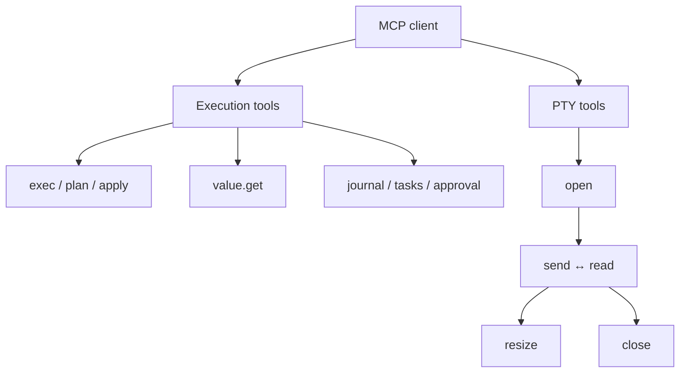
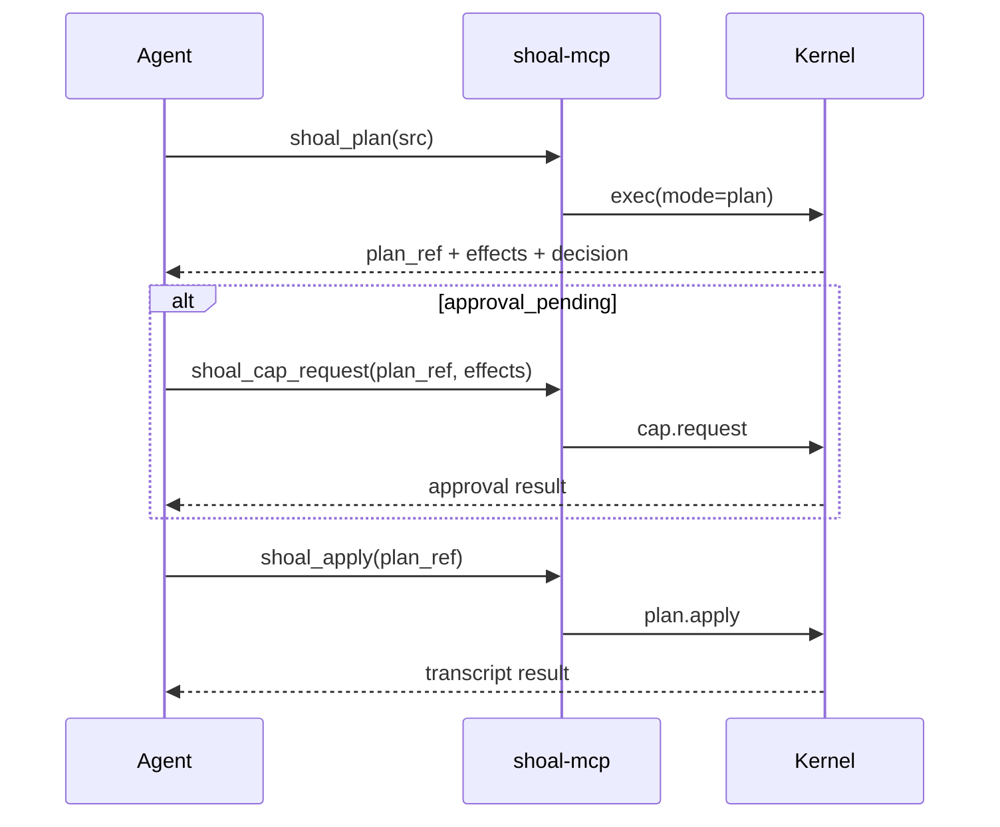
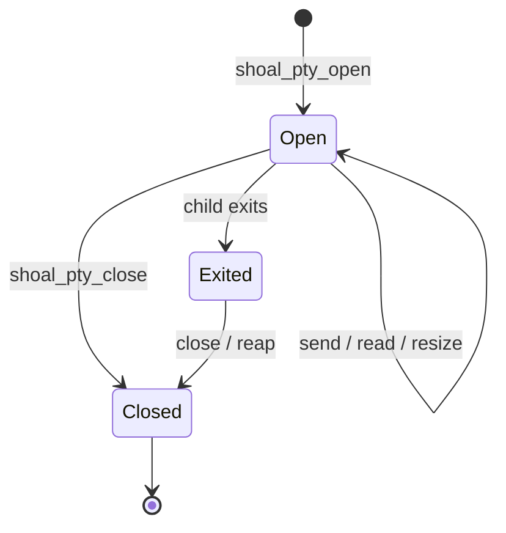

+++
title = "MCP tool reference"
description = "Exact schemas, defaults, return shapes, and failure behavior for all thirteen Shoal MCP tools."
weight = 180
template = "docs/page.html"

[extra]
eyebrow = "Agent interface"
group = "Agents & protocol"
audience = "Agent authors and MCP client implementers"
status = "Current MCP facade contract"
toc = true
+++

The Shoal MCP facade exposes thirteen tools. Seven operate on structured Shoal execution, plans, values, journal entries, and tasks; six drive real terminal programs through PTYs.

This page documents the MCP layer, not every method accepted by the kernel socket. The facade validates each argument object against its advertised JSON Schema, supplies MCP-specific defaults, maps the call to a kernel method, and wraps the kernel response in an MCP tool result. For the lower-level API, see [Kernel JSON-RPC protocol](@/docs/kernel-protocol.md).

## Tool map

| MCP tool | Kernel method | Purpose |
| --- | --- | --- |
| `shoal_exec` | `exec` | Run or plan Shoal source. |
| `shoal_plan` | `exec` with `mode: "plan"` | Concise plan-only convenience tool. |
| `shoal_apply` | `plan.apply` | Apply a stored, approved plan. |
| `shoal_get` | `value.get` | Query a transcript value without rerunning source. |
| `shoal_journal` | `journal.query` | Search structured execution history. |
| `shoal_cancel` | `task.cancel` | Request cancellation of a background task. |
| `shoal_cap_request` | `cap.request` | Request approval for effects in a stored plan. |
| `shoal_pty_open` | `pty.open` | Start an interactive terminal program. |
| `shoal_pty_send` | `pty.send` | Type text, keys, or bytes into a PTY. |
| `shoal_pty_read` | `pty.read` | Read the rendered terminal screen. |
| `shoal_pty_resize` | `pty.resize` | Change the terminal grid. |
| `shoal_pty_close` | `pty.close` | Terminate and reap the PTY process. |
| `shoal_pty_list` | `pty.list` | List open PTYs in the attached session. |



## Tool-result envelope

Every successful facade dispatch returns the normal MCP `CallToolResult` shape:

```json
{
  "content": [
    { "type": "text", "text": "human-readable bounded rendering" },
    { "type": "resource_link", "uri": "shoal://out/17" }
  ],
  "structuredContent": {
    "ref": "out:17",
    "uri": "shoal://out/17",
    "value": { "$": "int", "v": 42 },
    "render": "42"
  },
  "isError": false
}
```

The `resource_link` member is included only when the response contains an addressable URI or reference. Use `structuredContent` for program logic and the resource link for later retrieval. The text is a display aid, not the canonical data model.

The facade places a hard 64 KiB limit on the textual content of one tool result. If a rendering is longer, Shoal keeps whole leading lines where possible and appends a marker such as:

```text
…(832 more lines, fetch via shoal://out/17)
```

This MCP text limit is separate from value elision. `structuredContent` contains the kernel's already-elided result, including the reference needed to drill into it.

### Kernel errors are tool errors

If the kernel returns a JSON-RPC error, the facade turns that error object into a valid tool result with `isError: true`. It does not fail the MCP request transport:

```json
{
  "content": [{ "type": "text", "text": "{ ...kernel error... }" }],
  "structuredContent": {
    "code": -32011,
    "message": "approval required",
    "data": { "plan_ref": "plan:..." }
  },
  "isError": true
}
```

Malformed MCP arguments, an unknown tool name, a broken kernel connection, or another bridge-level failure can instead become an MCP JSON-RPC error. Clients should therefore handle both a failed request and a successful `tools/call` whose result has `isError: true`.

## `shoal_exec`

Execute Shoal source in the attached named session.

```json
{
  "src": "(ls .).where(.type == 'file')",
  "mode": "run",
  "position": "value",
  "background": false,
  "timeout_ms": 5000,
  "elide": {
    "max_bytes": 8192,
    "max_rows": 100,
    "max_items": 500
  }
}
```

| Argument | Type | Required | Default | Meaning |
| --- | --- | --- | --- | --- |
| `src` | string | yes | — | Shoal source to parse and execute or plan. |
| `mode` | `"run"` or `"plan"` | no | `"run"` | Execute now or derive effects without spawning. |
| `position` | `"stmt"` or `"value"` | no | `"value"` | Decide whether a final failed outcome raises or remains inspectable. |
| `background` | boolean | no | `false` | Return a task immediately instead of waiting. |
| `timeout_ms` | integer ≥ 1 | no | no timeout | Wait this long, then return the still-running work as a task. |
| `elide` | object | no | server defaults | Override `max_bytes`, `max_rows`, and/or `max_items` for this response. |

Unknown properties are rejected by the advertised schema.

### Position is semantic

The MCP tool defaults to `position: "value"`, unlike the raw kernel `exec` method, whose omitted-position default is statement position. In value position, the final command may return an `outcome` with `ok: false`:

```json
{
  "src": "^false",
  "position": "value"
}
```

That is useful when failure is expected and the agent wants to inspect `status`, `stderr`, or the structured error. In statement position, the same final failed outcome raises `cmd_failed`.

Position applies to the final expression boundary. Earlier source statements still have statement semantics. This can surprise a caller who sends a multi-statement block:

```text
^false
42
```

The first statement fails before `42` can become the value. Capture expected failures explicitly in language syntax:

```text
let probe = (^false)
{ probe, answer: 42 }
```

See [Outcomes and errors](@/docs/language-errors-outcomes.md) for the language rules.

### Run versus plan

`mode: "plan"` parses and analyzes the source, derives effects and reversibility, evaluates policy, stores a plan, and does not spawn the planned command. A plan response contains a `plan_ref`, concrete effect descriptors, a decision, and stored source/session/principal metadata used by `shoal_apply`.

Planning is meaningful for command-shaped work. Pure expressions can have no external effects. Analysis is conservative: opaque or dynamically computed effects may require a stricter policy decision than an equivalent fully concrete action.

### Background and timeout

With `background: true`, Shoal returns a `task:N` reference without waiting for completion. The task runs in the session's evaluator worker and emits `task.N` events.

With `timeout_ms`, Shoal waits up to the given duration. If execution finishes, the ordinary transcript result is returned. If it is still running, Shoal returns the task rather than killing it. Timeout is therefore a wait budget, not an execution deadline. Follow with task resources/events or `shoal_cancel`.

Do not set both options merely to make a task: `background: true` already returns immediately, so a timeout does not add a useful deadline.

### Result and references

A completed execution normally returns fields including:

| Field | Meaning |
| --- | --- |
| `ref` | Short session transcript reference such as `out:17`. |
| `uri` | MCP resource URI such as `shoal://out/17`. |
| `value` | Tagged wire value, possibly elided. |
| `render` | Bounded human-oriented rendering. |
| `elapsed_ms` | Execution time when reported by the kernel. |

The reference names the complete stored value, not merely the preview embedded in this result. Use `shoal_get` to select a small field or slice.

### Elision budget

`elide` may tighten or loosen three presentation thresholds:

```json
{
  "src": "range(0, 100000).collect()",
  "elide": { "max_items": 20, "max_bytes": 4096 }
}
```

The kernel's encoded result still has a 64 KiB hard ceiling in normal JSON/render modes. Large values receive an addressable reference and preview. Per-call item and row values are not currently schema-capped, so setting enormous limits is not a promise that the whole value will be inlined.

## `shoal_plan`

Convenience form for a value-position plan:

```json
{
  "src": "cp ./report.csv ./archive/report.csv"
}
```

It is exactly mapped as:

```json
{
  "method": "exec",
  "params": {
    "src": "cp ./report.csv ./archive/report.csv",
    "mode": "plan",
    "position": "value"
  }
}
```

Only `src` is accepted. Use `shoal_exec` with `mode: "plan"` if you need the general tool form, although the current facade does not add a plan-specific elision option either way.

A typical flow is:



## `shoal_apply`

Apply a previously stored plan:

```json
{
  "plan_ref": "plan:7b2fd854cb805ba1"
}
```

`plan_ref` is the only argument. Applying does not accept replacement source, altered arguments, or an alternate effect list. The kernel checks the selected stored plan's session, principal, source, and policy state before application.

The reference contains a full digest over source, canonical AST, effects, reversibility, estimates, Session, and principal plus a unique per-kernel object suffix. Same-shape and identical repeated plans cannot overwrite one another, and application rechecks the stored owner/source binding. The object remains ephemeral and disappears on restart; do not use `plan_ref` as a durable ID, secret, or transferable authorization token.

Plans are ephemeral kernel state. They do not survive daemon restart. An unknown or expired-in-memory reference produces `UNKNOWN_PLAN` (`-32012`). A plan that still needs approval produces `APPROVAL_REQUIRED` (`-32011`).

Plan application evaluates the stored source; it is not a transaction across arbitrary external systems. “Reversible” records the planner's knowledge and supports journal/undo integrations where an inverse is available, but it is not a universal rollback guarantee.

## `shoal_get`

Fetch a transcript value, a nested path, or a top-level slice without re-executing source.

```json
{
  "ref": "out:17",
  "path": ".rows[0].name",
  "elide": { "max_bytes": 2048 }
}
```

| Argument | Type | Required | Meaning |
| --- | --- | --- | --- |
| `ref` | string | yes | Short reference such as `out:17`, or another reference accepted by the kernel. |
| `path` | string | no | Field/index/range selector applied to the referenced value. |
| `slice` | two-integer array | no | Top-level half-open range `[start, end]`. |
| `elide` | object | no | Per-call `max_bytes`, `max_rows`, and/or `max_items`. |

The MCP schema does **not** expose a `format` argument. Use a resource URI such as `shoal://out/17?format=raw`, or the raw kernel method, when the representation format matters.

### Path grammar

Paths are intentionally smaller than the Shoal language:

```text
.field
[0]
[2..8]
.users[0].name
.rows[10..20]
```

- Dot segments select a record or outcome field.
- `[n]` selects a nonnegative index.
- `[a..b]` selects a half-open range.
- Table field selection may name a column; `.rows` exposes row records.
- Outcome fields are selectable, and selection can continue through `out`.

Paths do not evaluate arbitrary expressions, invoke methods, interpolate variables, accept negative indexes, or execute code. That limitation is deliberate: retrieval is deterministic and side-effect-free.

### Top-level slices

`slice: [start, end]` applies to the value after any path selection and supports:

- lists, by element;
- tables, by row;
- strings, by Unicode scalar value rather than UTF-8 byte offset;
- bytes, by byte.

The end is exclusive. Invalid bounds or slicing a scalar produces `BAD_PATH` (`-32005`). Prefer a path range when the slice is naturally part of a nested selector; prefer the separate `slice` field for pagination generated by a client.

### Retrieval is not recomputation

The transcript holds the value produced by the original execution. Fetching `.rows[0]` does not rerun `ls`, reread a file, or invoke a method. That gives agents a stable “execute once, inspect many times” pattern.

## `shoal_journal`

Query durable structured execution history:

```json
{
  "since": 1200,
  "until": 1800,
  "principal": "agent:reviewer",
  "ok": false,
  "effects": ["proc.spawn"],
  "head": "git",
  "limit": 50
}
```

All arguments are optional.

| Argument | Type | Meaning |
| --- | --- | --- |
| `since` | integer | Lower time/sequence boundary accepted by the journal handler. |
| `until` | integer | Upper boundary. |
| `principal` | string | Exact principal filter. |
| `ok` | boolean | Only successful or failed entries. |
| `effects` | string array | Require matching effect categories. |
| `head` | string | Filter by command head. |
| `limit` | integer ≥ 1 | Maximum entries to return. |

Journal entries describe executions and plans; they are not raw terminal transcripts. Treat field additions as forward-compatible. A client should select the fields it understands rather than requiring byte-for-byte object equality.

The kernel journal and the standalone `shoal-history` CLI use compatible storage code but can default to different XDG roots. See [Companion CLI reference](@/docs/companion-cli-reference.md) before diagnosing an apparently empty journal.

## `shoal_cancel`

Request cancellation of a task:

```json
{
  "task": "task:9"
}
```

Cancellation is cooperative at the evaluator/task layer. The result reports the updated task state; clients should not assume the process vanished before observing a terminal state. Read `shoal://task/9`, subscribe to it, or poll the task resource until it is completed, failed, or cancelled.

Task references and visibility are scoped to the attached named session. A daemon restart loses the task registry. Unknown tasks produce `UNKNOWN_TASK` (`-32021`); an operation not available for the task's current execution form produces `TASK_CONTROL_UNAVAILABLE` (`-32020`).

MCP exposes cancellation but not the kernel's `task.suspend` or `task.resume`; those require the raw kernel protocol.

## `shoal_cap_request`

Request an approval/grant for a plan that is waiting on policy:

```json
{
  "plan_ref": "plan:7b2fd854cb805ba1",
  "effects": ["fs.write", "proc.spawn"]
}
```

| Argument | Type | Required | Default |
| --- | --- | --- | --- |
| `plan_ref` | string | yes | — |
| `effects` | array | no | `[]` |

The effect list scopes the requested grant; it does not rewrite the plan's derived effects. Send only the capability categories the user or supervising system has actually approved. An empty list delegates the current implementation's default request behavior and should not be used as a blanket “approve everything” convention.

Approval and enforcement are distinct. An approval changes the policy decision associated with the stored plan; `caps_enforced` on attachment tells you whether an OS sandbox is actually active. See [Security and trust boundaries](@/docs/security.md).

## PTY lifecycle

The PTY tools are for programs whose behavior depends on a terminal: editors, installers, REPLs, pagers, password-less prompts, and full-screen TUIs. Prefer `shoal_exec` for noninteractive commands because it returns typed outcomes and participates in normal adapters.



PTY reads expose an emulator's current screen, not the original byte stream. This removes ANSI control sequences and bounds the response to the terminal grid, but it also means scrollback and byte-perfect output are not an audit log.

## `shoal_pty_open`

Start a program on a real pseudoterminal:

```json
{
  "cmd": "python3",
  "args": ["-q"],
  "cols": 100,
  "rows": 30,
  "env": { "TERM": "xterm-256color" }
}
```

| Argument | Type | Required | Default | Meaning |
| --- | --- | --- | --- | --- |
| `cmd` | string | yes | — | Executable name or path. |
| `args` | string array | no | `[]` | Arguments, without repeating `cmd`. |
| `cols` | integer 1–1000 | no | `80` | Terminal columns. |
| `rows` | integer 1–1000 | no | `24` | Terminal rows. |
| `env` | string map | no | `{}` | Overrides applied over the session environment. |

The process starts in the attached session's current directory with its environment plus overrides. Spawn is Leash-gated and, when available, pinned to the selected OS sandbox policy. A denied spawn returns `LEASH_DENIED` (`-32010`); an approval-required spawn returns `APPROVAL_REQUIRED` (`-32011`); OS/PTY setup failures use `PTY_SPAWN_FAILED` (`-32023`).

The result includes `pty_id`, `pid`, command, dimensions, and liveness information. Store the `pty_id`; it is required by every other PTY tool.

The PTY tool itself does not provide a plan/apply handshake for a spawn that needs approval. Pre-authorize the relevant policy outside this call or use a noninteractive planned execution when the workflow permits it. This is a current surface limitation, not an instruction to bypass policy.

## `shoal_pty_send`

Send one input item or an array of items:

```json
{
  "pty_id": "pty:3",
  "input": [
    "print(6 * 7)",
    { "key": "Enter" },
    { "key": "Ctrl-D" }
  ]
}
```

Accepted item forms:

```json
"text typed verbatim"
```

```json
{ "text": "text typed verbatim" }
```

```json
{ "key": "Enter" }
```

```json
{ "bytes": "base64-encoded-bytes" }
```

An array may mix all forms. Objects must select a supported member; raw bytes are base64 because JSON strings cannot preserve arbitrary octets.

Named keys include:

- `Enter`, `Tab`, `Escape`, `Backspace`, `Delete`, and `Space`;
- `Up`, `Down`, `Left`, and `Right`;
- `Home`, `End`, `PageUp`, and `PageDown`;
- `F1` through `F12`;
- `Ctrl-A` through `Ctrl-Z`.

Text is not shell-escaped or interpreted by Shoal; it is written to the terminal input exactly as text. Whether an Enter submits it, an editor inserts it, or a TUI treats it as a command is determined by the child program's terminal mode.

Sending input and reading output are separate calls. After a send, read until the screen is stable enough for the workflow rather than assuming one response cycle is sufficient.

## `shoal_pty_read`

Read the current rendered screen:

```json
{
  "pty_id": "pty:3"
}
```

Representative result:

```json
{
  "pty_id": "pty:3",
  "screen": [
    ">>> print(6 * 7)",
    "42",
    ">>>"
  ],
  "cursor": { "row": 2, "col": 4, "hidden": false },
  "changed": true,
  "alive": true,
  "exit": null,
  "pid": 48120,
  "cmd": "python3"
}
```

`screen` is an array of rows bounded by the configured grid. Trailing empty cells are rendered as text rather than an ANSI stream. `cursor` uses grid coordinates. `changed` means the emulator screen changed since this PTY's previous read; it is a hint for polling, not a durable event cursor.

When the child exits, `alive` becomes false and `exit` carries status information. Read once more after exit if the final output matters, then call `shoal_pty_close` to release the registry entry and reap resources.

PTY output is currently not exposed as a subscribable MCP resource. Poll `shoal_pty_read` with a reasonable client-side delay; avoid a tight loop.

## `shoal_pty_resize`

Resize both the operating-system PTY and the terminal emulator:

```json
{
  "pty_id": "pty:3",
  "cols": 120,
  "rows": 40
}
```

All three fields are required by the MCP schema; dimensions must be in `1..=1000`. Many TUIs repaint asynchronously after receiving the resize signal, so follow with `shoal_pty_read` and allow for more than one screen update.

## `shoal_pty_close`

Terminate and reap a PTY session:

```json
{
  "pty_id": "pty:3"
}
```

Close is the explicit lifecycle boundary. Use it even after the child appears to have exited so the kernel can remove the PTY from the session registry. Closing a live PTY terminates the process; do not use it as a “detach and leave running” operation.

## `shoal_pty_list`

List open PTY registry entries in the attached session:

```json
{}
```

The result is a stable, ascending list of summaries such as:

```json
[
  {
    "pty_id": "pty:2",
    "cmd": "vim",
    "pid": 48091,
    "cols": 100,
    "rows": 30,
    "alive": true
  }
]
```

Summaries do not include screen contents. Call `shoal_pty_read` for one ID, or read `shoal://pty` for the same discovery view. PTYs in other named sessions are not listed.

## Choosing the right tool

| Need | Prefer | Why |
| --- | --- | --- |
| Evaluate data or run a normal command | `shoal_exec` | Typed outcome, transcript ref, adapter support. |
| Inspect likely effects before acting | `shoal_plan` | No planned spawn; records effects and caller metadata. |
| Continue an approved plan | `shoal_apply` | Rechecks the selected stored plan's caller/source metadata. |
| Read part of a prior result | `shoal_get` | No re-execution and small context cost. |
| Find prior activity | `shoal_journal` | Durable structured filters. |
| Stop background work | `shoal_cancel` | Task-aware control. |
| Drive an editor or TUI | PTY tools | Real terminal semantics and rendered screen. |
| Run a program that merely prints text | `shoal_exec`, not PTY | Easier status handling and structured capture. |

## Client-side resilience checklist

1. Check both the MCP request status and `isError` in the tool result.
2. Treat `structuredContent` as authoritative; text is bounded presentation.
3. Save returned references and fetch narrow paths/slices instead of repeating work.
4. Expect daemon restart to invalidate plans, tasks, PTYs, and transcript refs.
5. Use event sequence numbers for subscriptions and task resources for final state.
6. Treat timeout as conversion to background work, not termination.
7. Close every PTY you open.
8. Never infer OS sandbox enforcement solely from an allowed policy decision.
9. Keep session names as trust-boundary choices, not cosmetic labels.
10. Make unknown fields nonfatal so clients can survive additive protocol evolution.

Continue with [Resources and events](@/docs/mcp-resources-events.md) for addressable state and subscriptions, or [Agent workflows](@/docs/mcp-workflows.md) for end-to-end patterns.
