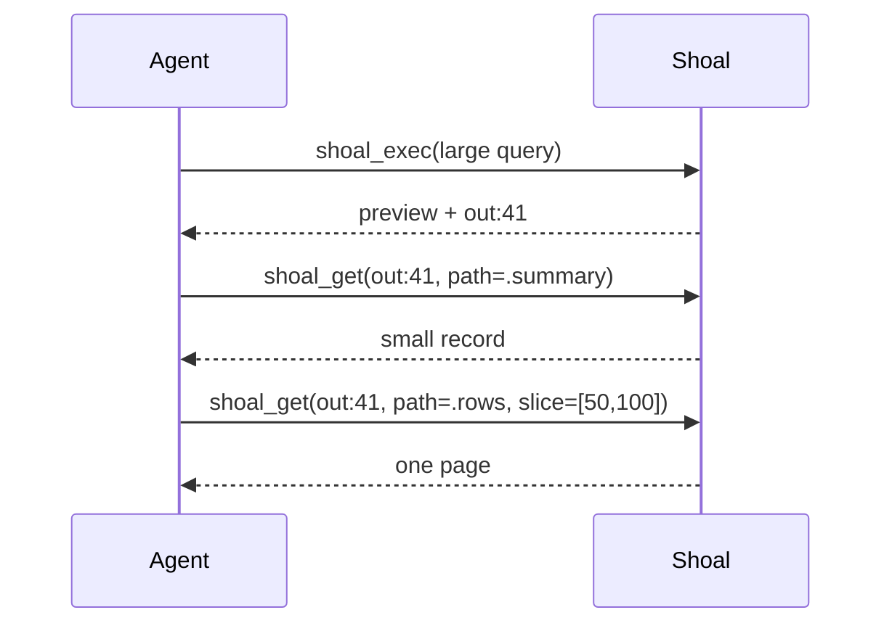
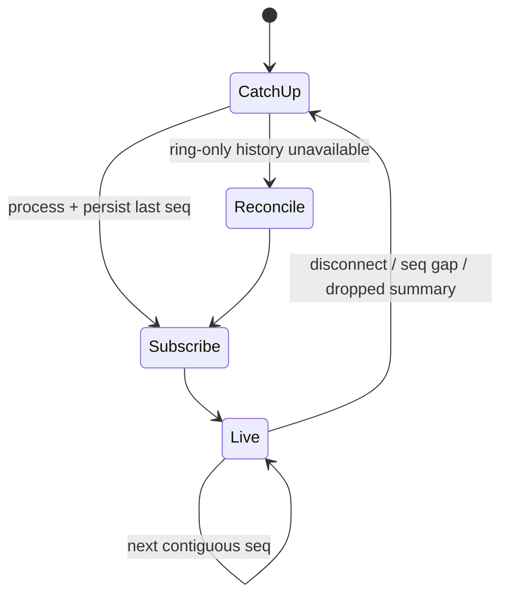

+++
title = "Agent and MCP workflows"
description = "Reliable patterns for structured execution, planning and approval, drill-down retrieval, background tasks, events, PTYs, and reconnect recovery."
weight = 210
template = "docs/page.html"

[extra]
eyebrow = "Agent guide"
group = "Agents & protocol"
audience = "Agent authors, tool orchestrators, and MCP users"
status = "Recommended patterns for the current preview"
toc = true
+++

The most reliable way to use Shoal from an agent is to treat execution, retrieval, and observation as separate phases:

1. execute or plan once;
2. retain the returned reference;
3. retrieve only the fields/slices needed for the next decision;
4. observe long-running state through task records and event cursors;
5. re-plan when identity or live state is no longer trustworthy.


Before deploying an agent, read [Security and trust boundaries](@/docs/security.md). In the current preview, the kernel socket must be fully trusted; session names are collaboration boundaries, not tenant isolation.

## Configure one stable MCP process

Typical MCP command:

```bash
shoal-mcp --session agent-review
```

With a token:

```bash
SHOAL_TOKEN='bearer-secret' \
  shoal-mcp --session agent-review
```

Prefer environment injection by the MCP host's protected secret facility over embedding the token in a world-readable configuration file. The process attaches once and reuses the named evaluator across tool calls.

Choose a session deliberately:

- same session: shared bindings, cwd, env, transcript, tasks, PTYs, and Reef state;
- different session in same kernel: separate evaluator/transcript, but shared process-wide plans/journal/CAS and the same socket trust boundary;
- different kernel/socket/state/OS user: real operational separation.

For an agent whose turns reconnect, keep the same session name if language state is useful. Do not depend solely on live bindings for durable workflow state; kernel restart removes them.

## Inspect before acting

A good first turn gathers small, structured context:

```json
{
  "src": "{cwd: (pwd), files: (ls .).take(20)}",
  "position": "value",
  "elide": {"max_rows": 20, "max_bytes": 8192}
}
```

Then read the live Reef view:

```text
shoal://session/reef
```

And, only when needed and authorized:

```text
shoal://session/env
```

The resource `shoal://session/cwd` is cached at MCP attach time. Use `pwd` after any `cd` rather than assuming the resource refreshed.

Avoid beginning with giant recursive listings, full environment dumps, or raw history. Ask a question that produces a typed table/record with bounded rows.

## Structured execution

### Keep logic in Shoal, not in output parsing

Instead of asking a command to print everything and parsing prose in the model, select in the shell:

```text
(ls .).where(.type == "file").map({name: .name, size: .size})
```

```text
(git status --short).where(.status != "ignored")
```

```text
let probe = (^some-command --json)
if probe.ok { probe.out.items } else { {status: probe.status, stderr: probe.stderr} }
```

Adapters can make known CLIs structured; native Shoal collections then preserve types. See [Command adapters](@/docs/adapters.md) and [External commands](@/docs/external-commands.md).

### Make position explicit

MCP defaults to value position, but explicit intent is clearer:

```json
{"src":"^false","position":"value"}
```

returns an inspectable failed outcome, while:

```json
{"src":"^false","position":"stmt"}
```

returns a raised tool error. Use value position for probes and expected nonzero statuses. Use statement position when failure should abort the action.

In a multi-statement submission, prior statements still have statement semantics. Capture expected failures:

```text
let check = (^git diff --quiet)
{clean: check.ok, status: check.status}
```

### Return decision-sized records

An agent benefits from a stable, explicit result contract:

```text
let files = (ls src).where(.type == "file")
{
  total: files.len(),
  largest: files.sort_by(.size).reverse().take(10),
  has_manifest: files.any(.name == "Cargo.toml")
}
```

That is cheaper and safer than returning an unbounded table and hoping the display contains the relevant tail.

## Execute once, inspect many times

Suppose `shoal_exec` returns `out:41` with a large table preview. Keep the reference and request narrow projections:

```json
{"ref":"out:41","path":".rows[0].name"}
```

```json
{"ref":"out:41","path":".size","slice":[0,50]}
```

or read resources:

```text
shoal://out/41?path=.rows[0].name
shoal://out/41?path=.rows&slice=50..100
```



Advantages:

- the external command runs once;
- later questions see a stable snapshot;
- tool context stays bounded;
- pagination is deterministic;
- failures in later reasoning do not repeat side effects.

Transcript references disappear on kernel restart. If the value must survive, write an intentional artifact or keep a content-addressed ref that remains in the state store; still account for garbage collection.

### Do not use raw format casually

`format=raw` is available through resource URIs/raw kernel, not `shoal_get`. It can return complete strings/bytes beyond the normal 64 KiB structured-value wall. Prefer slices:

```text
shoal://out/41?slice=0..4096&format=raw
```

and impose a receiving-side maximum. Base64 expands bytes by roughly one third.

## Plan, review, approve, apply

Use planning when an operation writes/deletes, touches a network/service, uses a secret, or has an opaque adapter effect.

### Step 1: derive a plan

```json
{
  "src": "cp ./report.csv ./archive/report.csv"
}
```

Inspect:

- `effects`: are paths/hosts/names concrete and expected?
- `reversibility`: is rollback meaningful?
- `verdict`: allow, deny, or approval required?
- `approval_pending`: is a supervising decision needed?
- `plan_ref`: ephemeral handle only.

If effects are unexpectedly `opaque`, improve the command/adapter or stop. Approval of opaque work is a trust decision, not analysis.

### Step 2: obtain human/supervisor approval

The approving system should display the source and complete effect list, not only the plan reference. Scope the request to the reviewed effects:

```json
{
  "plan_ref": "plan:7b2fd854cb805ba1",
  "effects": ["fs.read", "fs.write"]
}
```

If the requested list omits a required kind, Shoal keeps it pending and lists uncovered effects.

`cap.request` authenticates the approving attachment, denies requester self-approval by default, requires explicit cross-principal approval authority, and durably records the immutable grant binding. It is a one-shot approval workflow, not a durable policy edit or transferable capability.

### Step 3: re-inspect and apply promptly

Read:

```text
shoal://plan/7b2fd854cb805ba1
```

Then:

```json
{"plan_ref":"plan:7b2fd854cb805ba1"}
```

Plan references bind full source/AST/effects/Session/principal identity and include a unique per-kernel object suffix, so same-shape and identical repeated plans do not overwrite one another. Still inspect before apply and re-plan after a daemon restart: the object is ephemeral and approval is one-shot.

### Step 4: verify the effect

External systems are not transactional. Read back the intended state:

```text
(ls ./archive).where(.name == "report.csv")
```

Keep verification read-only and structured. A successful process exit is not always proof of the desired semantic result.

## Background work

Start immediately:

```json
{
  "src": "cargo test --workspace",
  "position": "value",
  "background": true
}
```

Result:

```json
{"task":"task:9","events":"task.9"}
```

Or give synchronous work a wait budget:

```json
{
  "src": "cargo test --workspace",
  "position": "value",
  "timeout_ms": 5000
}
```

If it exceeds five seconds, the same task pattern is returned with `timed_out: true`. The process continues.

### Observe state

Read:

```text
shoal://task/9
```

Subscribe:

```text
shoal://task/9
```

On completion, read output:

```text
shoal://task/9/out
shoal://task/9/out?path=.status
```

Task output is captured as a whole transcript value after completion; it is not incremental stdout streaming. The task event payload is a lifecycle hint. Always read the task record/output for authoritative state.

### Cancel carefully

```json
{"task":"task:9"}
```

The response means cancellation was requested, not necessarily that every descendant is already gone. Continue observing until a terminal state. Decide how partial filesystem/network effects will be reconciled; cancellation is not rollback.

Raw kernel task suspend/resume controls process-backed tasks; it reports unavailable for pure
evaluator work. MCP intentionally exposes cancellation but not those raw pause/resume methods, so do
not design an MCP workflow around pausing tasks.

## Resumable event processing

Persist one sequence cursor per channel. `since` is exclusive.

```text
shoal://events/session.transcript?since=52
shoal://events/journal?since=80
```

Recommended loop:



Pseudocode:

```text
cursor = durable_load(channel)
do:
    page = read(channel, since=cursor)
    for event in page.events ordered by seq:
        if event.seq <= cursor: continue
        if event.seq != cursor + 1: reconcile()
        handle_idempotently(event)
        durable_store(event.seq)
        cursor = event.seq
while page.truncated
subscribe(channel)
```

The first event in a channel is `seq=0`, so an implementation may represent “no cursor” separately instead of initializing to zero and skipping it.

`journal` and `session.transcript` can reconstruct surviving durable history beyond their count/byte-bounded ring. Task, approval, render, and user channels cannot. A `{dropped, dropped_bytes, latest_seq}` event means pull/reconcile before proceeding.

MCP `resources/unsubscribe` removes that URI's registered worker, shuts down its dedicated kernel
connection, and joins the forwarding thread. Facade process termination performs the same cleanup
for subscriptions that remain active.

## Interactive PTY workflow

Use PTYs only when a program genuinely needs a terminal. A normal command through `shoal_exec` gives better status, structure, capture, planning, and journal integration.

### Open

```json
{
  "cmd": "python3",
  "args": ["-q"],
  "cols": 100,
  "rows": 30,
  "env": {"PYTHONUNBUFFERED":"1"}
}
```

Store the returned `pty_id`.

### Read before typing

```json
{"pty_id":"pty:3"}
```

Confirm the expected screen/prompt. This avoids sending destructive input to a different mode than assumed.

### Send semantic keys

```json
{
  "pty_id": "pty:3",
  "input": [
    "print(6 * 7)",
    {"key":"Enter"}
  ]
}
```

Use named keys for Enter/Escape/arrows/control combinations instead of embedding terminal escape bytes. Use raw base64 bytes only for protocols that explicitly require them.

### Wait for a screen condition

PTY has no event subscription. Poll with a client-side delay and a bounded deadline:

```text
deadline = now + 10 seconds
repeat:
    screen = shoal_pty_read(id)
    if desired prompt appears: continue workflow
    if !screen.alive: handle exit
    if now >= deadline: stop and ask/close
    wait 50–250 ms, with backoff
```

`changed=false` helps avoid reprocessing an unchanged grid but is not a durable cursor. A rapidly repainting TUI may never be perfectly stable; look for semantic anchors.

### Close

```json
{"pty_id":"pty:3"}
```

Always close. It terminates/reaps a live child; it does not detach and leave it running.

### Example: editor transaction


Do not send passwords or bearer tokens through a PTY unless the threat model accepts child/process-screen exposure. Prefer purpose-built secret channels.

## Working with command adapters

Adapters can make `git`, `kubectl`, `docker`, package tools, and other CLIs return tables/records. The agent should know when an adapter was expected:

```text
git status --short
```

versus forced external execution:

```text
^git status --short
```

`^` skips the external adapter when the head is otherwise external; it is useful for diagnosing parser drift. `run("git", "status", "--short")` is unconditional dynamic external execution.

If a structured adapter unexpectedly returns raw text or `adapter_parse` errors:

1. inspect the exact command/version;
2. try forced external execution to see native output;
3. check `SHOAL_ADAPTER_PATH` replacement semantics;
4. do not silently make business decisions from a guessed text schema.

See [Command adapters](@/docs/adapters.md) for parser and schema contracts.

## Reef-aware agent work

Read `shoal://session/reef` before assuming a tool version/provider. Reef resolution is lazy and the evaluator caches its discovered scope; same-cwd manifest changes may not be noticed until a relevant state transition/restart.

When reproducibility matters:

- commit exact manifest constraints and materialize the host-local lock during setup;
- verify hash-pinned tools;
- use hermetic Reef scope intentionally;
- distinguish Reef's tool selection from Leash's behavior policy;
- do not infer a usable tool merely because a manifest constrains it—the binding may be null/unlocked.

See [Reef tool resolution](@/docs/reef.md).

## Error-recovery matrix

| Observation | Meaning | Recovery |
| --- | --- | --- |
| MCP request error | Facade/schema/transport failure | Validate arguments, inspect process/socket, reconnect. |
| Tool result `isError=true` | Kernel RPC error | Branch on numeric code in `structuredContent`. |
| `-32001` | Shoal parse error | Use span/hint; fix source; do not retry unchanged. |
| `-32002` | Language raised | Inspect returned error ref when present. |
| `-32010` | Policy/cross-scope denial | Do not brute-force; inspect policy and caller/session. |
| `-32011` | Approval required | Plan, display effects, obtain authorized approval. |
| `-32012` | Plan absent/overwritten/restart | Derive a fresh plan. |
| `-32021` | Task absent/other session/restart | Reconcile journal/artifact; cannot restore live task. |
| `-32022` | PTY absent/closed/other session | Do not replay keystrokes blindly; reopen after confirmation. |
| auth failed | Token invalid/expired/revoked or store unavailable | Align the state path, repair the store, or refresh the bearer. |
| event sequence gap | Dropped/retention/restart | Pull cursor, then reconcile authoritative state. |

Never retry an effectful `shoal_exec` automatically merely because the client lost its response. The command may have completed. Query the journal, transcript events, expected artifact, or an idempotency key in the target system first.

## Reconnect and daemon restart

Across an MCP facade reconnect to the same running kernel/session:

- language bindings and cwd/environment persist;
- transcript refs persist;
- tasks/plans/PTYs persist;
- new subscriptions must be established;
- attachment-time cached cwd refreshes.

Across kernel restart:

- evaluator bindings/cwd changes disappear;
- transcript refs, tasks, plans, and PTYs disappear;
- token/journal/CAS state remains in the selected state directory;
- durable journal/transcript channel sequence state is rebuilt;
- token file changes become visible;
- ring-only event history disappears.

Recovery procedure:

1. reconnect and attach;
2. verify returned session/principal/capability enforcement;
3. read live cwd/Reef/env as needed;
4. catch up durable event cursors;
5. reconcile work from journal and external artifacts;
6. re-plan any pending mutation;
7. reopen interactive programs only after confirming they are not still running outside Shoal.

## Context-efficiency patterns

Good:

```text
execute -> compact summary + ref
get .errors count
get .errors[0..20]
decide
```

Wasteful/risky:

```text
execute huge query repeatedly
request raw full bytes
parse display text in the model
retry side effects after ambiguous timeout
```

Use small elision budgets early, then widen only the relevant field. A reference is cheap; a 60 KiB rendering repeated through several turns is not.

## Production-readiness gate

Before automating consequential work, confirm:

- the socket is private and every connector process is trusted;
- the token principal exists in explicit policy;
- token CLI and kernel use the same state path (changes are observed live);
- `caps_enforced` and platform dimension gaps are acceptable;
- the plan's effects are concrete and reviewed;
- the session is not shared with an untrusted principal;
- event cursor storage and idempotent reconciliation exist;
- raw/blob retrieval has receiving limits;
- every PTY has a bounded polling deadline and close path;
- ambiguous failures do not trigger blind effectful retries.

For exact schemas, keep [MCP tools](@/docs/mcp-tools-reference.md), [Resources and events](@/docs/mcp-resources-events.md), and [Kernel protocol](@/docs/kernel-protocol.md) nearby.
