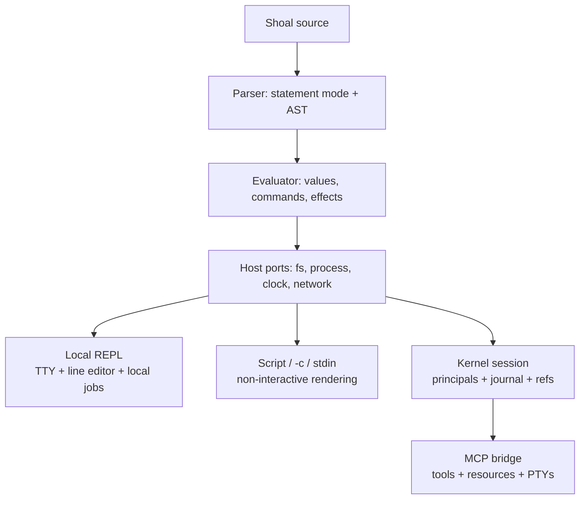
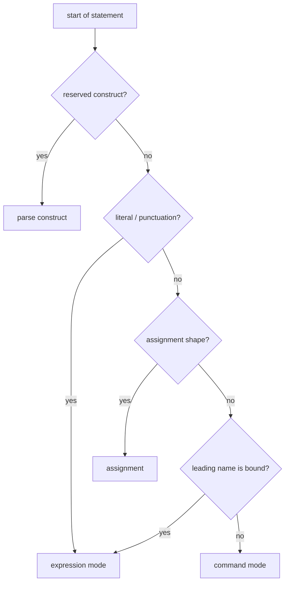
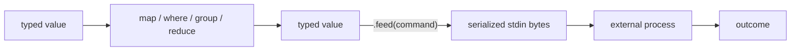
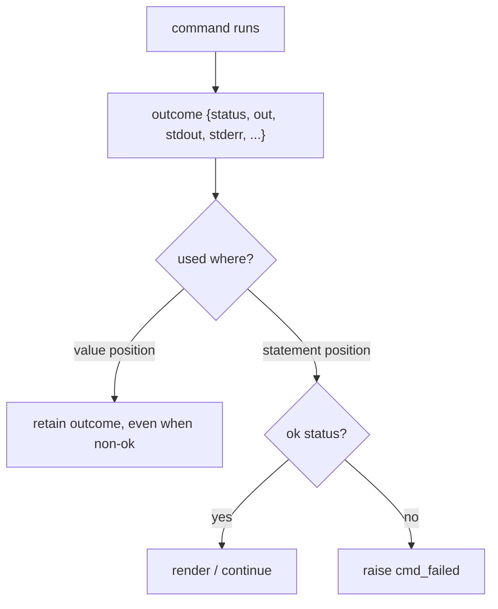
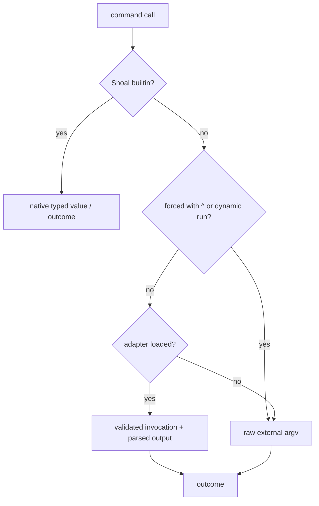

+++
title = "The command/expression model"
description = "Understand how Shoal decides what a line means, where outcomes become errors, and how typed values replace text pipelines."
weight = 20
template = "docs/page.html"

[extra]
eyebrow = "Core concepts"
group = "Start here"
audience = "Everyone writing Shoal"
status = "Current implementation"
toc = true
+++

Shoal is easiest to learn as a language with a command-friendly front door, not as a POSIX shell with extra object syntax. Its central decision is whether the current statement is a **command** or an **expression**. Everything else—argument coercion, external-process behavior, rendering, and failure—follows from that decision and from where the result is used.

## One runtime, several surfaces

The same parser and evaluator power scripts, the local REPL, and kernel-hosted agent sessions, but the hosts add different capabilities.



The language is shared. Host behavior is not always identical: for example, the local REPL can suspend a foreground process group with `Ctrl-Z`, while kernel task suspend/resume currently returns `TASK_CONTROL_UNAVAILABLE`. The manual calls out those boundaries rather than treating every host as interchangeable.

## How a statement chooses its mode

At the beginning of a statement, Shoal applies a small dispatch rule:

1. Reserved words such as `let`, `fn`, `if`, `for`, `match`, `use`, and `with` start their language constructs.
2. A statement beginning with a literal or punctuation is an expression.
3. A leading identifier followed by an assignment operator is an assignment.
4. A leading identifier that is already bound is an expression.
5. An otherwise unbound leading identifier is a command name.



Compare:

```text
status                         # unbound: command named status
let status = "ready"
status                         # now bound: expression value "ready"
^status                        # bypass this non-callable value shadow
run("status")                 # dynamic raw command name
```

An immediately attached method chain stays part of a command result:

```text
ls.path                        # run ls, then access/forward .path
git.status().ok                # exact meaning depends on bindings and adapter surface
```

In practice, parenthesize a command whenever it appears inside a larger expression. It makes both parser intent and human intent obvious:

```text
let files = (ls ./src)
if (^git diff --quiet).ok { "clean" } else { "dirty" }
```

## Command words are typed deliberately

Command mode is not a second string-only parser. Each argument word first has a syntactic category:

- `./src`, `../x`, `/tmp/x`, and `~/x` are paths.
- `*.rs` and `src/**` are globs.
- `--long`, `--name=value`, and `-abc` are flags.
- `(expression)` embeds an evaluated value.
- Other words begin as strings and may be bound to a declared function or adapter type.

```text
cp ./input.txt ./archive/input.txt
rm *.tmp
deploy staging --replicas 3 --dry-run
echo (today())
```

Raw external programs ultimately receive argv strings. Typed Shoal functions and adapters can bind words to `int`, `float`, `path`, `size`, `duration`, `time`, `datetime`, `bool`, and collection parameters before execution. A failed conversion is an argument error, not a best-effort guess.

## Values replace pipelines

A conventional shell pipeline is primarily a byte transport. Shoal keeps data in values and uses methods for transformations:

```text
let large = (ls .)
  .where(.type == "file")
  .where(.size > 10mb)
  .sort_by(.size)
  .reverse()

large.map({ name: .name, megabytes: .size / 1mb })
```

The next line may begin with `.` after an incomplete chain, so long transformations remain readable. There is no command-pipeline `|`. Use:

- methods such as `map`, `where`, `group_by`, and `reduce` for values;
- `feed` for a finite value that must become process stdin;
- a `stream` and stream combinators for asynchronous sequences;
- channels to bridge named event flows across language and kernel sessions.



Streams do not currently feed a process incrementally. Use `.take(n).collect()` or another bounded sink before `feed`; see [Streams and channels](@/docs/streams-channels.md).

## Results depend on position

Every external process has an outcome. Whether a non-zero status is raised as an error depends on the syntactic position.

```text
^false                 # statement position: cmd_failed
let check = (^false)   # value position: non-ok outcome is retained
check.ok               # false
```

This is a contextual policy, not two kinds of process. It makes the normal interactive case loud without making expected-failure probing awkward.

Builtins often also return outcomes, though a few evaluator-native operations such as `pwd` return a bare value. Use the visible type and documented fields rather than assuming every command has exactly the same wrapper.



`&&` and `||` understand booleans and outcomes. They short-circuit and return the operand that decided the result rather than converting it to a generic boolean:

```text
(^test -d .git) && "repository"
(^git diff --quiet) || "working tree changed"
```

## An outcome is more than stdout

An outcome records process metadata and output together:

```text
let o = (^printf '{"answer":42}\n')
o.ok
o.status
o.pid
o.dur
o.stdout
o.stderr
o.out.answer
```

`out` is the semantic payload. For adapted commands it may be a typed table or record. For raw external output it may be parsed structured data when safely recognizable, otherwise text/bytes. Outcome field access can forward to fields on structured `out`, but indexing does not silently forward. Prefer `o.out[...]` when indexing.

Shoal's own `echo` preserves the value it was given; it does not stringify and then reparse JSON merely because a string happens to contain braces.

## Errors are values with control behavior

An evaluation error carries a stable-ish code, message, source span where available, and optional diagnostic fields such as a hint, stderr, or status. Uncaught errors stop the current evaluation. `try`/`catch` and postfix `catch` recover them explicitly.

```text
let parsed = try {
  json.parse(input)
} catch err {
  { error: err.code, message: err.msg }
}

let port = env.PORT.parse_int() catch 8080
```

There is no general truthiness. Conditions accept a `bool` or an outcome (successful means true). Empty strings, zero, empty lists, and null do not acquire ad hoc boolean meanings.

```text
if items.is_empty() { "none" } else { "some" }
if (^test -e ./Cargo.toml) { "present" } else { "missing" }
```

## State is explicit and scoped

`let` creates an immutable binding; `var` creates a mutable one. Environment and current-directory mutations are session state. A `with` block applies a temporary dynamic scope and restores it even when evaluation fails.

```text
let root = pwd
var attempts = 0
attempts += 1

with cwd: ./crates, env: { RUST_LOG: "debug" } {
  cargo test
}

pwd == root
```

Direct `cd` and environment mutation are intentionally restricted to session top level rather than being hidden inside arbitrary functions. Use parameters, returned values, or `with` for composable code.

## Structured does not mean magically typed

Shoal provides three levels of command knowledge:

1. **Builtins** return values designed by Shoal.
2. **Adapters** declare known flags, effects, invocation rules, and output parsers for a CLI.
3. **Raw externals** receive argv and return a generic outcome.



`^name` bypasses a non-callable value shadow and currently skips adapters. It does not bypass a function/alias/callable or a builtin, which resolve earlier. For an adapter-backed external such as `git`, this escape hatch matters when the adapter is incomplete or intentionally rejects a flag; it also gives up the adapter's precise effect and output knowledge. Use `run("name", ...)` to reach an executable that shares a builtin or callable name.

## Rendering is not the value

Tables, paths, sizes, outcomes, and errors have human renderings, but presentation does not change their identity. A table displayed as columns remains a list-like structured collection; a size displayed as `12.4 MB` retains its unit-aware arithmetic.

Non-interactive runs render bare-command output and the final value by default. The REPL renders each submitted result. Paging is a host concern applied only to the final REPL result, never a language operation. Use `.json()`, namespace serializers, or explicit field projection when a machine-readable representation matters.

## A reliable way to read unfamiliar Shoal

For any line, ask four questions in order:

1. Which mode begins this statement: construct, assignment, expression, or command?
2. What typed value does each subexpression produce?
3. Is a command result in statement position or value position?
4. Which host is executing it: local REPL, non-interactive runner, or kernel session?

Those questions explain most surprising behavior. Continue with [Syntax and literals](@/docs/language-syntax.md) for the exact forms and [Values and methods](@/docs/language-values.md) for the data model.
