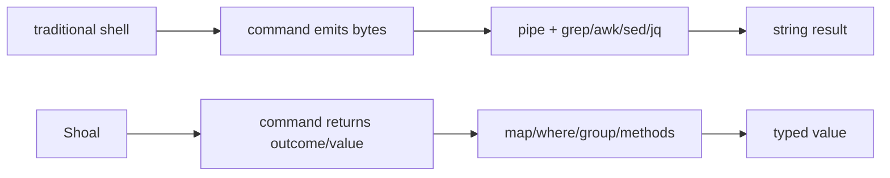

+++
title = "Migrating from traditional shells"
description = "Translate Bash, zsh, fish, and Nushell habits into Shoal's command/expression modes, typed values, outcomes, feeds, scopes, and structured workflows."
weight = 35
template = "docs/page.html"

[extra]
eyebrow = "Migration guide"
group = "Start here"
audience = "Experienced shell users adopting Shoal"
status = "Current syntax and semantic differences"
toc = true
+++

Shoal is not a Bash-compatible shell with nicer objects. It keeps command-line ergonomics, but replaces expansion and byte pipelines with expression evaluation and typed values. The fastest migration strategy is to preserve external commands at the edges and rewrite the data transformations between them.



## The five biggest mental shifts

1. Variables are expression names, not textual substitutions.
2. Parenthesized commands produce values; `$()` does not exist.
3. There is no command-pipeline `|`; transform values with methods and use `.feed(...)` only at byte-process boundaries.
4. External failure is an `outcome`; statement position raises it, value position lets you inspect it.
5. `sh { ... }` is an explicit compatibility island, not the default parser.

Read [The command/expression model](@/docs/mental-model.md) after this guide for the formal rule.

## Variables: values, not expansion

Bash/zsh:

```bash
project=shoal
printf '%s\n' "$project"
```

Fish:

```fish
set project shoal
printf '%s\n' $project
```

Shoal:

```text
let project = "shoal"
echo (project)
```

`let` is immutable. Use `var` for intentional reassignment:

```text
var attempts = 0
attempts = attempts + 1
```

There is no `$project`, `${project}`, `$project[1]`, or implicit interpolation during word splitting. Embed an expression in a command argument with parentheses:

```text
let path = path("./report.csv")
cp (path) ./archive/report.csv
```

Use quoted interpolation where supported by Shoal syntax as documented in [Grammar reference](@/docs/grammar-reference.md), but prefer passing a value directly when the whole argument is one expression.

## Environment variables are a namespace

Bash/zsh:

```bash
export LOG_LEVEL=debug
printf '%s\n' "$HOME"
LOG_LEVEL=trace command
```

Shoal:

```text
env.LOG_LEVEL = "debug"
echo (env.HOME)

with env: {LOG_LEVEL: "trace"} {
  command
}
```

Session environment mutation is explicit and shared within that evaluator session. Prefer `with env:` for reusable/local scopes.

## Command substitution becomes value capture

Bash/zsh:

```bash
count=$(find . -type f | wc -l)
```

Shoal, using a structured builtin:

```text
let count = (ls .).where(.type == "file").len()
```

For an external command:

```text
let result = (^printf '{"count":3}\n')
let count = result.out.count
```

Parentheses do not mean “capture trimmed stdout as a string.” They place the command in expression/value position and retain the typed result/outcome.

## Quoting and argument boundaries

Traditional shells use quoting partly to prevent word splitting/globbing:

```bash
file='report with spaces.csv'
cp -- "$file" archive/
```

Shoal passes one value as one argument:

```text
let file = path("report with spaces.csv")
cp (file) ./archive/
```

There is no implicit split of a string on whitespace. If you have a list of arguments, use the language's explicit collection/call forms rather than assembling one shell command string. Dynamic command name:

```text
run("cp", "report with spaces.csv", "archive/")
```

Raw external argv still becomes OS strings at the process boundary. Typed functions/adapters can bind words to declared types first.

## Globs are typed values

Bash expands a glob before the command:

```bash
rm -- *.tmp
```

Shoal recognizes glob-shaped command words and can pass a typed glob to a builtin/adapted parameter:

```text
rm *.tmp
```

An unmatched glob is not a magical literal fallback for destructive operations; Shoal reports no matches/error where the builtin requires targets. Use `glob("pattern")`/documented glob methods when building patterns dynamically, not string concatenation and hoped-for expansion.

## Pipelines become value transformations

Bash/zsh:

```bash
find . -type f -print0 \
  | xargs -0 stat ... \
  | sort -n \
  | tail -20
```

Shoal:

```text
(ls .)
  .where(.type == "file")
  .sort_by(.size)
  .reverse()
  .take(20)
```

There is no command-pipeline `|`. Choose based on the thing flowing:

| Flow | Shoal mechanism |
| --- | --- |
| Finite typed collection | `.map`, `.where`, `.sort_by`, `.group`, `.reduce`, etc. |
| One finite value into process stdin | `value.feed(^command ...)` |
| Live/asynchronous sequence | stream combinators and bounded sinks |
| Named cross-session events | `channel("user.name")` |
| Legacy byte pipeline | explicit `sh { ... }` block |

## Replace `grep`, `awk`, and `cut` with fields/methods

Bash:

```bash
git status --porcelain | awk '$1 != "??" {print $2}'
```

With a structured adapter (schema depends on the command adapter):

```text
(git status --short)
  .where(.status != "untracked")
  .map(.path)
```

The key is not the shorter spelling; it is that `.path` remains a path/string field even when filenames contain whitespace/newlines.

For raw text intentionally:

```text
path("./service.log").lines
  .where(line => line.contains("ERROR"))
```

## `jq` often becomes direct field access

Bash:

```bash
curl -s https://example/api | jq -r '.items[] | select(.active) | .name'
```

Shoal HTTP namespace:

```text
let response = http.get("https://example/api")
if response.ok {
  response.json.items.where(.active).map(.name)
} else {
  {error: "http_status", status: response.status, body: response.body}
}
```

Or retain an external tool boundary:

```text
let response = (^curl -s https://example/api)
response.out.items.where(.active).map(.name)
```

If structured detection does not parse the payload safely, use `json.parse(response.stdout)` explicitly.

## Feed values to processes explicitly

Bash:

```bash
printf '%s\n' alpha beta | sort -r
```

Shoal:

```text
["alpha", "beta"].feed(^sort -r)
```

Serialization is type-defined:

- string: exact UTF-8, no newline added;
- bytes: exact bytes;
- `list<str>`: newline-separated with trailing newline;
- record/table/other list: compact JSON;
- path: not file content—use `.read`/`.read_bytes`.

Streams cannot currently feed incrementally. Bound and collect first:

```text
tail(path("./input.log"), from_start: true)
  .take(100)
  .collect()
  .feed(^consumer)
```

## Redirection remains familiar—but typed alternatives exist

Shoal supports:

```text
^tool > ./result.txt
^tool >> ./result.log
^tool < ./input.txt
```

For values:

```text
json.stringify(data, pretty: true).save(path("./result.json"))
"next line\n".append(path("./result.log"))
```

Redirection/save can participate in journal undo for overwrites when prior bytes fit the cap. Creating a new file currently has no delete inverse.

## Conditions use values/outcomes

Bash:

```bash
if git diff --quiet; then
  echo clean
else
  echo dirty
fi
```

Shoal:

```text
let diff = (^git diff --quiet)
if diff.ok {
  "clean"
} else {
  "dirty"
}
```

Short-circuit operators understand booleans/outcomes and return the deciding operand:

```text
(^test -d .git) && "repository"
(^git diff --quiet) || "working tree changed"
```

For clarity in scripts, explicit `.ok` is often easier to maintain.

## `set -e` becomes statement/value intent

Bash `set -e` has context-sensitive exceptions that are famously subtle. Shoal's central rule is:

- failed final command in statement position raises;
- a command captured in value position remains a non-ok outcome;
- `try`/`catch` handles raised errors explicitly.

Abort on failure:

```text
^critical-step
^next-step
```

Inspect an expected failure:

```text
let probe = (^optional-check)
if not probe.ok { echo (probe.stderr) }
```

Handle a raised error:

```text
try {
  ^critical-step
} catch err {
  {code: err.code, message: err.msg}
}
```

Do not translate `set -euo pipefail` literally; encode which failures are expected and which should propagate.

## Defaulting and missing data

Bash:

```bash
value=${VALUE:-default}
```

Environment in Shoal:

```text
let value = env.VALUE ?? "default"
```

Nested optional data:

```text
let city = response.json?.user?.address?.city ?? "unknown"
```

`??` handles null, not arbitrary false/zero/empty unless the language operation explicitly returns null. Missing lexical names are errors, not empty strings.

## Arrays and maps are first-class

Bash arrays/associative arrays require special expansion syntax:

```bash
items=(alpha beta)
declare -A user=([name]=Ada [role]=admin)
```

Shoal:

```text
let items = ["alpha", "beta"]
let user = {name: "Ada", role: "admin"}

items[0]
user.name
user.get("role", "guest")
```

Tables are lists of records with a column-oriented rendering/operations:

```text
let users = [
  {name: "Ada", active: true},
  {name: "Lin", active: false},
]
users.where(.active).map(.name)
```

## Functions are values and command heads

Bash:

```bash
greet() { printf 'hello %s\n' "$1"; }
```

Shoal:

```text
fn greet(name: str) {
  "hello " + name
}

greet Ada
greet("Ada")
```

The same definition participates in command-shaped and expression-shaped calls. Typed/default/variadic parameters replace positional `$1`/`$@` conventions.

## Modules replace sourced global mutation

Bash:

```bash
. ./lib/deploy.sh
deploy production
```

Shoal:

```text
use ./lib/deploy
deploy.run("production")
```

Only exported module members are bound under the module namespace, reducing accidental global collisions. Module code is still trusted code and may have effects.

## Local state uses scopes

Bash subshell:

```bash
( cd subdir && LOG=debug command )
```

Shoal:

```text
with cwd: path("./subdir"), env: {LOG: "debug"} {
  command
}
```

`with` expresses intended ambient changes without depending on process-subshell text semantics.

## Background work and jobs

Bash/zsh:

```bash
long-command &
jobs
wait %1
```

Shoal language task:

```text
let task = spawn { long-command }
task.is_done()
task.await()
```

Trailing ampersand also exists:

```text
sleep 30s &
jobs
```

The interactive Unix host has `fg`/`bg` process-group behavior. Kernel tasks are a different surface; raw kernel suspend/resume is currently unavailable.

## Functions should not mutate global cwd

Shoal disallows top-level session cwd commands inside function bodies. Instead:

```text
fn test_crate(dir: path) {
  with cwd: dir {
    cargo test
  }
}
```

This makes a reusable function's ambient dependency visible.

## Process substitution has no direct spelling

Bash `<(command)`/`>(command)` exposes pipes as pseudo-files. Shoal currently has no direct process-substitution construct. Choose:

- keep the result as a value and transform it;
- `.feed` it to stdin;
- save to an explicit temporary/file path with lifecycle you control;
- use a small `sh { ... }` compatibility block when a program strictly requires multiple pseudo-files.

Do not invent `/dev/fd` assumptions in portable Shoal scripts.

## Here-documents become strings or interpreter blocks

Bash:

```bash
python3 <<'PY'
print("hello")
PY
```

Shoal:

```text
python3 {
print("hello")
}
```

For data stdin:

```text
"alpha\nbeta\n".feed(^consumer)
```

Interpreter blocks preserve program source separately from fed data when the interpreter supports an inline program argument.

## Secrets should not be ordinary environment/string variables

Traditional shell:

```bash
export TOKEN=...
curl -H "Authorization: $TOKEN" ...
```

Shoal:

```bash
printf %s "$TOKEN" | shoal-secret set api-token
```

```text
let token = secret.get("api-token")
http.get(url, headers: {Authorization: token})
```

Typed redaction reduces accidental display/journal encoding. Once passed to an external program, the program can still expose it; this is not a remote vault.

## Tool version managers become Reef scopes

Instead of implicit shell activation hooks mutating PATH:

```toml
# .reef.toml
[tools]
node = "22"
jq = "1"
```

```text
reef lock
which node
```

Reef synthesizes child PATH from locked bindings. There are no arbitrary activation hooks. Hermetic Reef removes ambient PATH tail but does not replace Leash/OS sandboxing.

## Safer destructive scripts use plan + journal + undo

Traditional shell often uses `set -x`, dry-run flags, and backups. Shoal adds structured layers:

```text
plan {
  mkdir --parents ./archive
  cp ./report.csv ./archive/report.csv
  rm ./report.csv
}
```

After actual execution:

```text
journal --limit=10
undo out[3]
```

Only typed inverses are reversible. Network/opaque external work and permanent deletion are not rolled back.

## Migrating Nushell habits

Shoal and Nushell both value structured data, but their grammar/execution model differs:

| Nushell habit | Shoal equivalent/difference |
| --- | --- |
| Pipeline carries values | No `|`; command capture then method chain. |
| `$name` variables | Plain lexical `name`. |
| `where`/`select` commands | `.where(...)` and `.map(...)`/field access. |
| External command `^cmd` | Shoal also uses `^` to force external/skip adapter; exact precedence differs. |
| Error/status model | External returns Shoal `outcome`; statement/value position controls raising. |
| Environment | `env.NAME` / scoped `with env:`. |
| Plugin ecosystem | Shoal adapters describe schemas/effects; not Nushell plugin protocol. |

Do not mechanically translate Nushell pipelines to a fake Shoal pipe. Bind the command result and chain methods.

## Migrating fish habits

Fish users will recognize friendly command syntax and non-POSIX function ideas, but:

- variables do not use `$` at read sites;
- lists are typed values, not fish's list-expansion behavior;
- `and`/`or` semantics operate on bools/outcomes, not only `$status`;
- command substitution is value capture, not newline splitting;
- scopes use `let`/`var`/function/module rules, not fish's `set -l/-g/-x` flags;
- functions can be called in expression form and return structured values.

## Incremental migration strategy

### Phase 1: keep legacy blocks at the edge

```text
let raw = (sh {
  legacy-command | awk '...'
})
```

Inspect `raw.ok`, `raw.stdout`, and `raw.stderr`. Do not pretend the block's internal effects are visible/reversible.

### Phase 2: replace parsing

Replace `grep`/`awk`/`jq` stages with an adapter/native structured result and methods. This yields the biggest correctness improvement for the least external-tool change.

### Phase 3: replace state/flow

Move shell variables to `let`/`var`, `$()` to captured values, conditional status checks to outcomes, and subshell cwd/env to `with`.

### Phase 4: add reproducibility/safety

Declare Reef tools, commit locks, add plan/effect review for mutation, enable journal/undo where supported, and write conformance/integration tests.

### Phase 5: remove compatibility islands selectively

Some specialized POSIX snippets are clearer left inside an explicit `sh` block. The goal is not zero shell text; it is making data, failure, state, and effects explicit where correctness matters.

## Translation checklist

For each legacy script, identify:

1. Which commands are external boundaries?
2. Which pipelines parse text that can become typed data?
3. Which failures are expected probes versus abort conditions?
4. Which variables are lexical values versus environment?
5. Which implicit cwd/env changes need `with`?
6. Which globs/word-splitting assumptions are load-bearing?
7. Which operations mutate and can be planned/journaled/undone?
8. Which tool versions need Reef locks?
9. Which secrets should become typed secret references?
10. Which legacy fragments should remain explicit `sh` blocks?

Continue with [Recipes](@/docs/recipes.md), [External commands](@/docs/external-commands.md), and [Outcomes and errors](@/docs/language-errors-outcomes.md).
