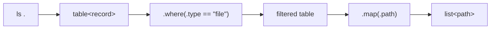

+++
title = "Quickstart"
description = "Build Shoal, enter the shell, run a first structured query, and write a script without importing habits that do not apply."
weight = 10
template = "docs/page.html"

[extra]
eyebrow = "Start here"
group = "Start here"
audience = "New Shoal users"
status = "Current implementation"
toc = true
+++

Shoal is a structured shell: commands still launch programs, but successful work can remain a typed value instead of becoming text that must be split and reparsed. The language deliberately looks familiar at the command line while using expression syntax for selection, transformation, branching, and error recovery.

This project is an early preview. Build it from source, keep another shell available, and read [current limits](@/docs/status-limits.md) before treating it as your login shell.

## Build from source

Shoal currently targets Linux and macOS. You need a current stable Rust toolchain, Git, and the native build dependencies required by your platform.

```bash
git clone https://github.com/alliecatowo/shoal.git
cd shoal
cargo build --release -p shoal
./target/release/shoal --version
```

For a user-local Cargo installation:

```bash
cargo install --path crates/shoal
shoal --version
```

The repository also contains companion binaries for the kernel, MCP bridge, language server, diagnostics, history, secrets, and sandbox helpers. A plain interactive session only requires the `shoal` binary; agent-hosted sessions need `shoal-kernel` and `shoal-mcp` on `PATH` as described in [Agents, kernel, and MCP](@/docs/agents-kernel-mcp.md).

## Start the interactive shell

Run Shoal with no arguments in a terminal:

```bash
shoal
```

At the prompt, try these one at a time:

```text
pwd
ls .
(ls .).where(.type == "file")
(ls .).where(.type == "file").map(.path)
```

`pwd` returns a `path`. `ls` returns a table whose rows have fields such as `path`, `name`, `type`, `size`, and `modified`. `where` and `map` operate on those values; no column-position parsing or filename splitting is involved.

The parentheses in `(ls .)` mean “use this command's result as a value.” At the top level, `ls .` is a command statement and renders naturally. Inside a larger expression, parenthesizing a command call makes the boundary explicit.



## Learn the two reading modes

Shoal reads a statement in one of two modes:

- **Command mode** treats the first unbound word as a command and the remaining words as arguments. `git status --short` and `ls ./src` are command-shaped.
- **Expression mode** evaluates names, literals, operators, calls, and method chains. `files.len()`, `3 * 7`, and `user?.name ?? "unknown"` are expression-shaped.

```text
echo hello world              # command mode
let greeting = "hello"       # a language construct
greeting.upper()              # expression mode: greeting is bound
^printf "%s\n" hello         # skip an adapter/value shadow; printf is otherwise external
run("printf", "%s\n", "hi") # dynamic command name
```

There is no Bourne-style `$name` expansion and no backtick substitution. Variables are just names; environment variables live under `env`.

```text
let project = "shoal"
echo (project.upper())
env.EDITOR
env.LOG_LEVEL = "debug"
```

Read [The command/expression model](@/docs/mental-model.md) before translating a large Bash script literally. It explains the few rules that make the rest of the language predictable.

## Work with an external command

External processes always produce an `outcome` when their result is used as a value. The outcome records status and captured output rather than throwing away either.

```text
let result = (^printf '{"project":"shoal","ready":true}\n')
result.ok
result.status
result.out.project
```

When stdout is valid structured data, `out` can expose the parsed value. When it is ordinary text, use `stdout`, `out`, or string methods explicitly. An adapter can provide a stronger schema for a known CLI; `^` skips that adapter when no callable or builtin owns the head, and `run("name", ...)` is the unconditional dynamic-external form.

Non-zero status behaves differently by position:

```text
^false                       # command statement: raises cmd_failed
let probe = (^false)         # value position: captures the non-ok outcome
probe.ok                     # false
probe.status                 # usually 1
```

That distinction lets short interactive commands fail loudly while scripts can inspect expected failures. See [Outcomes and errors](@/docs/language-errors-outcomes.md).

## Replace pipes with value flow

Shoal reserves `|` for pattern alternation, not shell pipelines. Transform structured values with methods, and pass a value to a program's stdin with `feed`.

```text
let names = (ls .).where(.type == "file").map(.name).sort()
names

"alpha\nbeta\n".feed(^wc -l)
```

`feed` serializes ordinary values deliberately: strings become their bytes, a list of strings becomes newline-delimited text, and records/tables become compact JSON. Streams cannot currently feed a process incrementally; collect a bounded stream first. The exact serialization rules are in [External commands and data exchange](@/docs/external-commands.md).

## Write and run a script

Create `hello.shl`:

```text
fn greet(name: str, excited: bool = false) -> str {
  let suffix = if excited { "!" } else { "." }
  "Hello, {name}{suffix}"
}

let who = if args.is_empty() { "world" } else { args.first().str() }
greet(who, true)
```

Run it:

```bash
shoal hello.shl Shoal
```

Script arguments are available as the language-level `args` list. A script's final value is rendered by default; intermediate pure expressions stay quiet unless `render.echo` is configured otherwise.

Other entry points are useful for automation:

```bash
shoal -c '1 + 2'
printf 'json.parse("{\"ok\":true}").ok\n' | shoal
shoal fmt --check hello.shl
shoal doctor --json
```

Parse failures exit with code `2`, evaluation failures with code `1`, and `exit N` uses `N`. See [Command-line interface](@/docs/cli.md) for the complete dispatcher.

## Add configuration

Shoal loads system, user, nearest-project, then environment configuration. Start with `~/.config/shoal/shoal.toml` (or `$XDG_CONFIG_HOME/shoal/shoal.toml`):

```toml
version = 1

[editor]
mode = "vi"

[history]
max_entries = 20000
dedup = true

[aliases]
gs = "git status"

[env]
EDITOR = "hx"

[render]
paging = "auto"
```

Aliases are parsed as command syntax, not pasted as text. Configuration is validated; unknown keys produce warnings and invalid types or values stop startup. Prompt configuration has a richer companion schema covered in [Configuration and prompt](@/docs/configuration-prompt.md).

## Pin project tools with Reef

Reef scopes tool versions to a project without replacing your ambient `PATH` wholesale. Add a constraint:

```text
reef add node@22
reef
which node
```

`reef add` updates the nearest applicable `.reef.toml` and attempts to lock the resolved binary. Interactive resolution can create missing lock entries; non-interactive scripts require locked tools. The binary hash is checked again at spawn. Read [Reef environments](@/docs/reef.md) before using it in CI.

## Choose the next guide

- Read [The command/expression model](@/docs/mental-model.md) for the language's core semantics.
- Use [Interactive shell](@/docs/repl.md) for history, completion, jobs, paging, and recovery.
- Continue with [Syntax and literals](@/docs/language-syntax.md), then [Values and methods](@/docs/language-values.md).
- Jump to [Recipes](@/docs/recipes.md) for copyable end-to-end patterns.
- Keep [Current status and limits](@/docs/status-limits.md) close while evaluating the preview.
