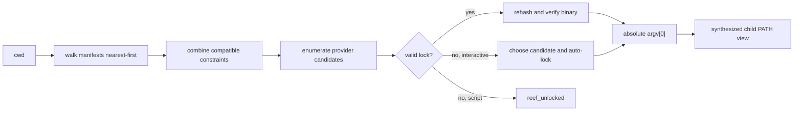

+++
title = "Reef tool resolution"
description = "Make tool selection explicit with scoped manifests, content-hashed locks, providers, synthesized PATH views, and script runners."
weight = 160
template = "docs/page.html"

[extra]
eyebrow = "Reproducible tools"
group = "Shell & tools"
audience = "Developers, build engineers, and automation authors"
status = "Implemented preview; edge cases and isolation gaps are called out"
toc = true
+++

Reef is Shoal's scoped tool resolver. It turns “which executable does this name mean here?” into an inspectable decision based on project manifests, user constraints, installed providers, and a content-hashed lock.

It does not require activation hooks or shell shims. Changing directories changes the next scope discovery; Reef never mutates the session environment merely because a project exists.



The central principle is that `PATH` becomes output for legacy children, not hidden input to a constrained Shoal command.

## Start with a project manifest

Create `.reef.toml` at a project root:

```toml
[tools]
node = "22"
python = "3.12"
rg = "*"
go = { provider = "mise" }
deno = { version = "1.46", provider = "mise" }

[runners]
py = "python"
js = "node"
ts = { tool = "deno", args = ["run"] }
rb = "ruby"

[options]
hermetic = false
```

Then inspect and lock it:

```shoal
reef
reef lock
which node
```

The first interactive execution of a constrained tool can also create its lock automatically:

```shoal
node --version
# reef: locked node@22.x.y via mise (.../node)
```

Commit `.reef.toml` with exact constraints when the repository expects repeatable versions. Generate `reef.lock` on each host after installing tools; the lock binds that host's absolute executable paths and byte hashes and is ignored by Git by default.

## What engages Reef

Reef only takes over a spawn when all of these are true:

1. at least one tools-bearing Reef/foreign/user manifest is in scope, or a `with reef:` override is active;
2. the process head is a bare name, not an explicit path containing `/`;
3. some active scope explicitly mentions that name.

If no manifest mentions `git`, then `git` retains ordinary ambient command behavior even when the same project constrains `node`. This makes adoption incremental.


An explicit path bypasses Reef name resolution:

```shoal
/usr/bin/node --version
./vendor/tool --help
```

The `^` force marker bypasses command adapters, but it does not bypass Reef. `^node` still arrives at external spawn as the bare name `node`, so a matching Reef constraint applies. Use an explicit path when the intent is to bypass name resolution itself.

## Scope discovery

For every directory from the current working directory to the filesystem root, discovery checks files in this exact order:

1. `.reef.toml`
2. `mise.toml`
3. `.mise.toml`
4. `.tool-versions`

Entries are appended nearest-directory first. Within one directory, native `.reef.toml` therefore precedes foreign formats. Finally, the user manifest is considered at:

```text
$XDG_CONFIG_HOME/shoal/shoal.toml
# or
~/.config/shoal/shoal.toml
```

Its `[reef]` table becomes the lowest-priority user scope.


Discovery parsing is best-effort. Unreadable or malformed files are skipped by the scope walk and retained within fixed warning limits. Interactive evaluation prints those warnings once per unchanged scope identity and can keep using valid farther scopes. Noninteractive scripts and agent sessions refuse external execution with `reef_provider` until the bad manifest is fixed, so a malformed nearer authority cannot silently expose an ambient or farther tool. Evaluator-hosted discovery reads through the installed filesystem capability with a one MiB regular-file/UTF-8 wall. Use `reef doctor`, `reef add`, or validate TOML directly when diagnosing a file that seems absent; `reef add` deliberately notices a malformed local `.reef.toml` instead of quietly editing an ancestor.

### Tool-free scopes

A native project manifest containing only `[runners]` or `hermetic = true` is an active scope. The same applies to a user `[reef]` table, so runner and isolation policy do not require a dummy tool constraint:

```toml
[runners]
py = "python"
```

### Cache behavior

The evaluator caches parsed scopes, but checks a fixed-size metadata fingerprint covering every candidate and adjacent `reef.lock` path from `cwd` to the root plus the user scope. Creating, editing, repairing, replacing, or removing a manifest or lock invalidates the cache without requiring `cd` or a session restart. The fingerprint includes file kind, device, inode, byte length, modification time, and Unix change time; contents are reparsed only after that identity changes.

## Native manifest schema

### Tool requirements

A short string declares a constraint:

```toml
[tools]
node = "22"
python = "3.12.4"
rg = "*"
```

A table can pin a provider and optionally a version:

```toml
[tools]
go = { provider = "mise" }
deno = { version = "1.46", provider = "mise" }
```

If a table omits `version`, its constraint is `*`.

### Constraints

Reef parses constraints leniently:

| Form | Meaning |
| --- | --- |
| `"*"` or empty | Any candidate, with no version probe required. |
| `"latest"` | Any candidate; selection still prefers the highest ranked version. |
| `"22"` | Numeric prefix: major version 22. |
| `"3.12"` | Numeric prefix: major/minor 3.12. |
| `"v22.3"` | Same numeric-prefix behavior after removing `v`. |
| nonnumeric text | Raw prefix match against the candidate's reported version. |

Numeric releases compare component by component, padding missing components with zero for equality. A final release ranks above its prerelease at the same numeric version. Numeric versions rank above opaque versions; unknown versions rank lowest.

This is not a full semver range language. Operators such as `^`, `~`, `>=`, or comma intersections are not interpreted as npm/Cargo ranges; they become raw-prefix constraints and will usually not do what a semver user expects.

### Compatibility across scopes

Every scope mentioning the same tool participates. The nearest mention supplies the base decision, while farther compatible constraints refine it. Examples:

| Near scope | Far scope | Result |
| --- | --- | --- |
| `22` | `*` | `22` |
| `22` | `22.3` | `22.3` |
| `22.3` | `22` | `22.3` |
| `22` | `20` | `reef_conflict` |
| provider `mise` | provider `mise` | compatible |
| provider `mise` | provider `system` | `reef_conflict` |

Reef does not silently let “nearest wins” erase an incompatible organizational/user constraint. The conflict names both sources and asks the user to reconcile them.

### Runners

Runner keys are file extensions without a dot. A string names the tool; a table adds argv before the script path:

```toml
[runners]
py = "python"
ts = { tool = "deno", args = ["run", "--allow-read"] }
```

Runner tables merge from farthest to nearest atop defaults, so the nearest scope wins per extension.

### Hermetic child paths

```toml
[options]
hermetic = true
```

If any active scope sets `hermetic = true`, the synthesized child `PATH` contains only Reef's content-addressed view directory. Otherwise the original child `PATH` is appended as a tail. A farther hermetic scope cannot be weakened by a nearer `false` in the current implementation; the effective rule is logical OR.

Hermetic here is specifically a `PATH` property. It is not a complete filesystem, network, environment, or syscall sandbox. Combine it with an enforced Leash policy when those boundaries matter.

## Foreign manifests

Reef reads existing tool-manager files without mutating them.

### `mise.toml` and `.mise.toml`

Only `[tools]` is adapted. Supported values are:

- a string;
- an array, where only the first item is used;
- a table with a `version` key.

Runners and hermetic settings are never inferred from mise files. Unknown/unsupported value shapes are skipped.

### `.tool-versions`

Each nonblank, noncomment line is treated as:

```text
tool version [ignored fallbacks...]
```

Only the first version token becomes the constraint. Inline comments beginning with `#` are removed.

### Precedence in the same directory

Native `.reef.toml` is earlier than both mise forms, which are earlier than `.tool-versions`. All still appear in the chain, so incompatible declarations can surface as a conflict rather than being discarded.

## Resolution providers

The default provider stack is ordered:

1. `npm-local`
2. `venv`
3. `mise`
4. `cargo`
5. `system`

Provider order breaks ties; it does not always choose the winner first. Reef collects satisfying candidates across providers, selects the highest version, then breaks equal-version ties by provider order and path.

| Provider | Discovery | Version knowledge | Fetch support |
| --- | --- | --- | --- |
| `npm-local` | nearest ancestor `node_modules/.bin/<tool>` | unknown | no |
| `venv` | nearest ancestor `.venv/bin/<tool>` | unknown | no |
| `mise` | `$MISE_DATA_DIR/installs/<tool>/<version>/bin/<tool>`, else `~/.local/share/mise/...` | directory name | yes |
| `cargo` | `$CARGO_HOME/bin/<tool>`, else `~/.cargo/bin/<tool>` | unknown | no |
| `system` | `/usr/bin`, `/usr/local/bin`, `/bin`, then unique ambient `PATH` dirs | lazy probe | no |

All candidates must be regular executable files (or symlinks resolving to such files) with an executable bit. The current provider implementation is Unix-oriented.

### Unknown versions

Unknown candidates satisfy `*` and `latest`, because those constraints do not require concrete version information. A numeric or raw constraint requires a version. The system provider can then probe `<tool> --version`; npm-local, venv, and cargo keep their version unknown and therefore will not satisfy a numeric constraint.

Version probes have a hard 300 ms timeout. Output is searched leniently for a dotted numeric token, then a bare integer. Timeout, spawn failure, or unparseable output yields `unknown`.

### System versus ambient scope

The system provider marks candidates from its three canonical roots as `system`. Additional directories inherited from `$PATH` are `ambient`. `which --all` exposes the distinction. An unconstrained resolution report also calls the selected scope `ambient` when the candidate came from a noncanonical `PATH` directory.

### Fetching

Only the mise provider currently implements acquisition. It locates `mise` on the ambient path and runs:

```text
mise install TOOL@CONSTRAINT
```

Then it rediscovers candidates and returns the highest satisfying installed version. Reef never fetches during normal resolution.

`reef fetch TOOL` loops providers in the default order and uses the nearest constraint and provider pin. Since only mise implements fetch, it normally delegates there or reports `{fetched: false, note: "no provider can fetch this tool"}`. Follow a successful fetch with `reef lock`.

## Lockfiles

`reef.lock` lives beside the nearest native `.reef.toml`. If no native manifest exists, the evaluator chooses the first discovered scope and places the lock next to that file. For a user-only native `[reef]` scope, that means alongside the user `shoal.toml`, not in the general state directory.

Each entry contains:

```toml
[tool.node]
name = "node"
version = "22.3.0"
provider = "mise"
path = "/home/me/.local/share/mise/installs/node/22.3.0/bin/node"
blake3 = "full-lowercase-blake3-hex"
resolved_at = "2026-07-16T12:34:56Z"
```

| Field | Purpose |
| --- | --- |
| `name` | Tool key. |
| `version` | Exact selected candidate version or `unknown`. |
| `provider` | Provider that supplied the path. |
| `path` | Absolute executable path. |
| `blake3` | Content digest at lock time. |
| `resolved_at` | RFC3339 UTC timestamp. |

### Interactive versus script policy

When a constrained tool has no valid satisfying lock:

- an interactive evaluator selects a candidate, records it, emits a one-line notice, and proceeds;
- a script/noninteractive evaluator raises `reef_unlocked` before process spawn.

This prevents CI and script execution from silently selecting a new tool version. Prepare locks with `reef lock` in an interactive/maintenance step.

An unconstrained tool is not locked by Reef.

### Validating an existing entry

A lock entry is reusable when its provider pin (if any) matches and its version satisfies the effective constraint. Reef then hashes the current file and compares it with `blake3`.

A mismatch is `reef_drift`, even if the path and version string are unchanged:

```text
reef_drift: node: on-disk hash 1a2b... != locked 9f8e...
hint: run `reef lock --refresh`
```

An unreadable locked binary becomes `reef_not_found` with the same refresh hint.

Hashing is cached by file identity/metadata to avoid repeatedly reading unchanged binaries.

### Lock persistence and portability

The evaluator persists spawn-time interactive auto-locks, bare `reef` resolutions, `which TOOL`, `reef add`, and explicit `reef lock` results before publishing them as locked evaluator state. Manifest and lock reads/writes use the evaluator's installed filesystem capability. Lockfiles and `reef add` manifest edits use atomic replacement; a write failure is `reef_provider`, an auto-lock failure stops before process spawn, and `reef lock` cannot return successful rows for a file it did not write.

An invalid, oversized, non-UTF-8, or non-regular existing lock also fails closed instead of being treated as an unlocked project and overwritten. `reef doctor` reports the invalid lockfile; inspect or remove it before intentionally rebuilding it.

`reef.lock` is a host-local materialization record, not a cross-platform dependency lock. Its absolute paths and BLAKE3 executable hashes are deliberately specific to the installed artifacts on one machine. Keep it ignored, commit exact constraints in `.reef.toml` or a supported foreign manifest, install those versions on each host, and run `reef lock` during environment/CI setup. Requiring one committed digest across Linux and macOS would either reject legitimate platform artifacts or weaken the byte-identity guarantee, so Reef does neither implicitly.

## Candidate selection in detail

For a constrained name, Reef performs these steps:

1. Gather every scope that mentions the tool.
2. Reject incompatible constraints or provider pins.
3. Reuse a satisfying lock entry if its content hash matches.
4. Under script policy, reject an unlocked constrained tool.
5. Ask every allowed provider for candidates.
6. Probe unknown versions only when the constraint needs one and the provider implements probing.
7. Discard candidates that do not satisfy the constraint.
8. Choose the highest version.
9. Break ties by provider order, then lexicographically by path.
10. Hash the selected executable and update the lock.


## Synthesized PATH views

After resolving a constrained head, Reef builds a content-addressed directory of symlinks:

```text
$XDG_RUNTIME_DIR/shoal/views/<binding-set-hash>/bin
```

When `XDG_RUNTIME_DIR` is absent, the root is:

```text
$TMPDIR/shoal-views-<uid>
# /tmp is used when TMPDIR is absent
```

The binding-set hash is order-independent and covers each tool name and path. Construction uses a staging directory and atomic rename, so concurrent identical builders converge on one view. Reuse is verified rather than trusted: the root must be an owned real `0700` directory, binding names cannot contain traversal/separators, targets must be absolute executable regular files, and `bin` must contain exactly the expected symlinks. A tampered view is quarantined and rebuilt before its path is returned.

The spawned child's `PATH` becomes:

```text
<view>/bin:<previous child PATH>
```

or, with any hermetic scope:

```text
<view>/bin
```

The view contains the just-resolved tool plus every entry already present in the loaded lock. This helps a locked `npm`, build script, or compiler find the same bound tools when it launches nested processes.

Shoal's session `PATH` is not mutated. Unconstrained spawns do not receive a Reef view.

## Leash hash pinning

Reef returns the resolved binary's full BLAKE3 digest to the evaluator. When the active Leash principal has a non-empty `proc_spawn` allowlist, the spawn gate compares the resolved executable by content hash before exec. A digest copied from Reef uses the same encoding as Leash's preflight hashing.

Two qualifications matter:

- an empty or absent `proc_spawn` list means unrestricted spawning; it is not default-deny;
- every production child evaluator (`spawn`, `.shl`, parallel, stream, and channel routes) now inherits the audited parent policy/principal and Reef resolver/configuration through one constructor. Treat a divergence as a security regression; this still does not remove the external-spawn TOCTOU window.

See [Security and trust boundaries](@/docs/security.md) for the full enforcement matrix.

## Script runners

`run(PATH, ARGS...)` treats a path or recognized existing filename as a script target. Resolution is:

1. extension mapping;
2. first-line shebang fallback;
3. `runner_not_found`.

The default runner table is:

| Extension | Invocation |
| --- | --- |
| `.py` | Reef tool `python` |
| `.js` | Reef tool `node` |
| `.ts` | Reef tool `deno`, template `run` |
| `.sh` | Reef tool `sh` |
| `.shl` | Shoal itself (`self`) |
| `.rb` | Reef tool `ruby` |
| `.lua` | Reef tool `lua` |

Rust is intentionally special: `.rs` has no table default because compile-versus-script semantics are ambiguous. Shoal first uses `rust-script` if it exists on the session path, otherwise invokes `rustc`, compiles to a temporary executable, and runs it.

### Examples

```shoal
run("scripts/check.py", "--quick")
run(path("tools/build.ts"), "--release")
run("local.rb")
```

A bare filename without a slash is treated as a script when it exists and its extension appears in the effective runner table (or is `rs`). Otherwise `run("name", ...)` is dynamic external-command invocation.

### Extension before shebang

An extension mapping wins over a contradictory shebang. For an extensionless or unrecognized path, Shoal reads only the first line:

```text
#!/usr/bin/env python3
```

becomes tool `python3`; a direct `#!/bin/bash` uses `/bin/bash`. Extra shebang words are preserved for the evaluator's fallback parser, while Reef's lower-level runner sniff reduces `/usr/bin/env TOOL` to the named tool.

### Current runner activation wrinkles

The Reef runner table is only consulted for actual execution when a tools-bearing manifest is in scope. Without one, Shoal's fixed fallback handles `.sh` with `sh`, `.py` with `python3`, `.js` with `node`, `.shl` internally, and `.rs` specially. Consequently the table defaults for `.ts`, `.rb`, and `.lua` require an active tools-bearing manifest; otherwise only a suitable shebang can rescue them.

Also, typing `./script.py` directly as a command head does not currently route through the general runner table. Use `run("./script.py")`. Bare `.shl` execution has a separate internal path.

### Script isolation

A `.shl` script receives a fresh language scope with `args` and `script` bindings plus the audited inherited process environment/adapters/ports/bus, Reef, and Leash context. It does not leak its `let` bindings into the caller. The outer statement owns journaling rather than creating implicit nested script rows.

## `which`

```shoal
which node
which node --all
which -a node
```

Singular `which` returns a record:

| Field | Meaning |
| --- | --- |
| `name` | Queried tool name. |
| `scope` | Winning scope, such as `reef`, `user`, `system`, or `ambient`. |
| `constraint` | Effective rendered constraint. |
| `version` | Selected version or `unknown`. |
| `path` | Executable path. |
| `hash8` | First eight hex characters of the content digest when Reef resolved it. |
| `provider` | `npm-local`, `venv`, `mise`, `cargo`, `system`, or ambient fallback label. |
| `chain` | Table of `{scope, source, constraint, outcome}` decisions. |

The chain is nearest-first. Outcomes are `selected`, `shadowed`, or `absent` in completed reports.

For an ordinary name with no Reef candidate, `which` falls back to the session's ambient path. A hit yields a minimal record with unknown version and no hash; a miss yields null.

Protection errors are not hidden by ambient fallback. Conflict, drift, unlocked, and provider errors return an unresolved record whose `scope` is `unresolved: <code>`, whose binding fields are null, and whose `note`/optional `hint` explain the real state.

`which --all` does not perform a lock/conflict decision. It enumerates every provider candidate as rows containing `tool`, `version`, `path`, `provider`, and `scope`.

## Reef commands

### `reef`

Bare `reef` returns one row per constrained tool:

```text
name | constraint | version | hash8 | provider | scope
```

An unresolved row has null binding fields and a scope such as `unresolved: reef_drift`.

### `reef add TOOL@VERSION`

```shoal
reef add node@22
```

Target selection is intentionally careful:

1. if `cwd/.reef.toml` exists, edit it—even if malformed;
2. otherwise edit the nearest ancestor native `.reef.toml`;
3. otherwise create `cwd/.reef.toml`.

The command inserts/updates the `[tools]` string entry, invalidates scope cache, and attempts a fresh lock. Its record contains `added`, `manifest`, `locked`, and, on success, `version` and `path`. If the constraint is written but resolution fails, the edit remains and `locked` is false with a note.

`reef add` reads at most one MiB, rejects non-UTF-8, over-nested, or malformed TOML and a non-table `tools` key, and atomically replaces the updated manifest. It requires exactly the `name@version` shape with nonempty sides.

### `reef lock [--refresh]`

`reef lock` resolves every distinct constrained tool and writes a table with `name`, `version`, `hash8`, and `locked`; failures include an `error` code per row. Existing valid entries are reused.

`reef lock --refresh` removes each entry before selecting and hashing it again. With no discovered scope, the command raises `reef_not_found`.

### `reef fetch TOOL`

Delegates explicit acquisition to providers as described above. A successful record includes `fetched`, `provider`, `version`, and `path`. Fetching does not itself rewrite the lock; run `reef lock --refresh` afterward.

### `reef doctor`

`reef doctor` always returns a table, including an empty table for a clean/empty scope. It emits:

| Check | Meaning |
| --- | --- |
| `drift` | One row for every constrained name: `ok`, `drift`, or `unlocked`, with path/hash fields where available. |
| `shadowed_ambient` | A locked constrained name also exists at a different ambient path. |
| `orphan` | The lock contains a name no active manifest mentions. |

Use it in repository diagnostics:

```shoal
let findings = (reef doctor)
findings.where(.status != "ok")
```

## Dynamic overrides

`with reef:` creates a highest-priority constraint scope for the dynamic extent of a block:

```shoal
with reef: {node: "20", python: "3.11"} {
  node --version
  python --version
}
```

Every value must be a string constraint. Nested blocks put the innermost override first. The scope is popped on normal return and error paths.

Overrides do not carry runner or hermetic settings. When no discovered manifest supplies a lock path, an interactive resolution inside an override can exist only in memory; a noninteractive one raises `reef_unlocked`.

## Error reference

| Code | Trigger | Typical repair |
| --- | --- | --- |
| `reef_unlocked` | A script tries a constrained tool with no satisfying lock. | Run `reef lock` interactively and commit the result. |
| `reef_drift` | Current executable bytes differ from the lock digest. | Investigate replacement, then `reef lock --refresh` if intentional. |
| `reef_conflict` | Active constraints/provider pins cannot coexist. | Reconcile the named manifest sources. |
| `reef_not_found` | No candidate satisfies the requirement, or a locked path is unreadable. | Install/fetch the tool or refresh/fix the constraint. |
| `reef_provider` | Manifest mutation, hashing, PATH synthesis, or provider operation failed. | Read the message; fix TOML, permissions, layout, or provider tooling. |
| `runner_not_found` | No extension mapping or shebang can run a path. | Add a runner or shebang. |

A constrained-not-installed error also mentions an ambient executable when one exists but is shadowed by the project constraint. This is diagnostic only; Reef does not silently run the shadowed binary.

## Operational workflow

For a repository adopting Reef:

1. Add the smallest useful `[tools]` set to `.reef.toml`.
2. Use exact major/minor prefixes your project can support; do not write unsupported semver operators.
3. Run `which TOOL --all` to understand available candidates.
4. Run `reef lock` and review paths/providers/hashes.
5. Commit `.reef.toml`; keep the host-local `reef.lock` ignored.
6. Install the constrained versions, run `reef lock`, and run `reef doctor` in local diagnostics and CI setup.
7. Use `hermetic = true` only after all nested tool dependencies are represented by locked bindings.
8. Configure runners and exercise each script extension with `run(...)`.
9. Treat manifest constraint changes like dependency changes and review local lock refresh provenance, not only version text.
10. Add Leash policy separately when you need enforced filesystem/network/process capabilities.

## Current boundaries

Reef is implemented and actively used for constrained external spawns, but it is not yet the total execution substrate originally envisioned.

- Windows provider executability, symlink views, and resolution semantics are deferred.
- Scope discovery silently skips malformed/unreadable manifests.
- A completely empty manifest, or one whose options retain their defaults, has no scope effect.
- Lockfiles are deliberately host-local; portable multi-platform artifact locking is not implied.
- `reef fetch` is mise-only in the shipped provider stack. Restricted principals must allow its opaque installer effect and spawn pin. Version probes and mise installers use bounded, cancellation-aware evaluator process authority; requested filesystem scopes are OS-sandboxed or fail closed when enforcement is unavailable. This does not provide an OS network sandbox.
- General bare-path command heads do not use runners; spell `run(PATH)`.
- Child evaluators inherit Reef/Leash context through the audited unified child constructor; future child routes must join that inventory.
- Hermetic controls only the emitted `PATH`, not all process effects.
- Provider inventory and `which --all` are host-dependent by design.

Those boundaries are tracked alongside the broader implementation matrix in [Current status and compatibility](@/docs/status-limits.md#reef).
