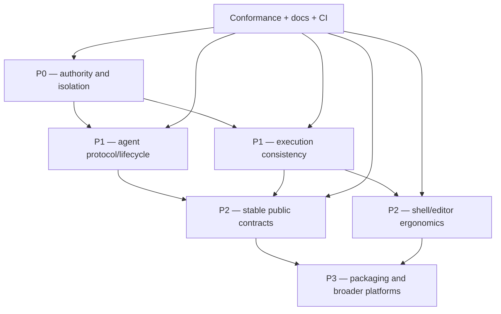

+++
title = "Roadmap"
description = "Priority-ordered work from trusted-local preview to a hardened structured shell and agent runtime, with concrete acceptance criteria."
weight = 250
template = "docs/page.html"

[extra]
eyebrow = "Project direction"
group = "Project"
audience = "Contributors, adopters, and maintainers"
status = "Living priorities; no date promises"
toc = true
+++

Shoal's next milestone is not “more syntax.” It is making the implemented shell and agent surface trustworthy: close authority gaps, preserve policy through every execution path, stabilize identities/lifecycles, and prove those properties with adversarial integration tests. Language ergonomics, LSP depth, adapter growth, packaging, and new platforms follow that foundation.

This roadmap is priority-ordered, not date-ordered. Items move only when code and acceptance tests land; a label here is not a release promise.

## Dependency map



## Principles

Every roadmap change should preserve these constraints:

1. **The corpus decides language behavior.** Add/adjust conformance cases for every user-visible semantic change.
2. **Authority is explicit.** No method or nested execution path may infer broader privilege from socket reachability, a short reference, or missing context.
3. **Enforcement truth is dimensional.** Report what filesystem/network/process/resource boundaries are actually active.
4. **Values remain addressable and bounded.** Large data travels by reference and deliberate slices/ranges.
5. **Session collaboration is intentional.** Sharing must be authorized and visible, not an accidental consequence of knowing a string.
6. **macOS is not a stub; Windows is not hand-waved.** Platform claims require native tests.
7. **Docs describe shipped code.** Aspirational design belongs here, clearly marked—not in reference pages as present tense.

## P0 — authority and isolation blockers

These block any claim of hostile/multi-tenant agent safety.

### Consolidate the attachment gate

The audited stateful handlers now require attachment, including the former `journal.query` and
`cap.request` holes. Consolidate that property into a router/method-policy table so a new sensitive
method cannot accidentally omit `Attachment`.

Required changes:

- classify every RPC as pre-attach public, attached read, attached mutation, subscription, or supervisor-only;
- permit only `session.attach`, `parse`, and `complete` before attachment unless a narrowly reviewed exception exists;
- reject `journal.query` and `cap.request` with `NOT_ATTACHED` on fresh connections;
- make the classification exhaustively testable when methods are added.

Acceptance:

```text
fresh connection + each method
  -> only attach/parse/complete succeed
  -> every other method returns -32000
```

Include malformed params tests so decoding cannot occur before the authorization decision and leak method behavior.

### Authorize journal reads

The exact-owner read baseline is implemented: `journal.query`, journal-backed `blob.get`, and the
`journal` event channel require attachment plus `JournalRead`, then remain scoped to the attached
principal-private Session. Remaining work is broader administration:

- supervisor/admin cross-principal query through a distinct grant;

Acceptance:

- unauthenticated query denied;
- principal A cannot search principal B by omitting filters;
- filtering cannot widen scope;
- output hashes/blobs inherit entry authorization; **implemented for `blob.get`**;
- durable journal-event replay does not bypass query policy; **implemented**;
- tests include same session/different principal and different session/same principal.

### Extend the bound approval workflow

`cap.request` is now an authenticated, one-shot supervision action with immutable requester,
approver, plan/source hash, Session, exact scope, timestamp, and durable journal audit. It denies
self-approval by default and requires explicit cross-principal authority. Remaining extensions are:

- make approver routing policy more expressive than the current embedded-human / `supervisor` / `plan.approve` rule;
- add optional expiry and human reason metadata;
- separate “request approval” from “grant approval” if asynchronous agents and humans need different roles;
- define notification/UI flows around the already durable grant row.

Acceptance:

- unknown/unprivileged approver denied;
- partial effect grant cannot widen;
- approval becomes invalid after plan/source identity changes;
- concurrent replacement/collision cannot transfer approval;
- every grant is queryable with approver identity.

### Evolve plan identity lifecycle

The audit's overwriting 16-hex identity is fixed: stored plans now use a full digest over source/AST/effects/estimates/Session/principal plus a unique object suffix, bind approval to immutable content, expire in memory, and never replace identical objects. Remaining lifecycle work is to specify deletion/retention across very long-lived kernels, decide whether policy/security generations belong in invalidation, and add larger cross-principal stress/fault-injection suites.

### Evolve the unified child execution context

All production child-evaluator routes now build through one explicit context carrying identity,
policy, Reef, filesystem/watch ports, echo behavior, and cancellation, with an inventory test preventing
direct construction. Remaining evolution should add/clarify:

- explicit deadline/task lineage across every nested worker;
- whether nested journal rows should exist (today the outer statement owns journaling);
- end-to-end restrictive-policy tests for every future child factory.

Audit and test `spawn`, `.shl` runner execution, `parallel`, channel handlers, module/function workers, and future evaluator factories. Make construction without a context impossible or limited to tests through an explicit untrusted/default-deny constructor.

Acceptance:

- a file denied at top level is also denied inside every nesting feature;
- a spawn hash denied at top level is denied nested;
- nested Reef tool resolution uses the same locked binding;
- cancellation reaches descendants;
- journal rows retain actual actor/task lineage;
- an end-to-end MCP restrictive-policy test proves behavior, not only reported flags.

### Socket identity and mandatory authentication

Deployable named-listener modes now implemented:

- `--require-peer-uid` verifies the Unix peer UID (`SO_PEERCRED`/`getpeereid`) against the kernel effective UID before worker allocation;
- `--require-token` rejects tokenless public attachment;

Remaining transport designs:

- configurable peer-UID allowlists beyond the exact kernel UID;
- optional separate human and agent sockets;
- refuse insecure socket directory ownership/modes rather than relying only on file mode;
- rotate/revoke connection authorization intentionally.

Public tokenless attachment already becomes restricted `agent:mcp`, while asserted local-human auth
is rejected. The local-human trust root is the server-selected anonymous descriptor of a private
interactive kernel. A hardened public mode can still add mandatory bearers and peer-UID binding.

### Extend principal-private Session membership

The implemented model is private Session per principal and visible name. Transcript values,
bindings, cwd/env, tasks, PTYs, subscriptions, quotas, Reef state, plans, and journal views use the
same exact owner. Future work is an explicit invitation/ACL design if collaboration rooms are ever
added; matching visible names must never imply sharing.

## P0 completion gate

P0 is complete only when an adversarial matrix is green:

| Actor A / Actor B | Same session | Different session |
| --- | --- | --- |
| transcript read | explicit grant only | denied |
| task get/cancel | explicit grant only | denied |
| PTY read/send/close | explicit grant only | denied |
| plan get/apply/approve | owner/supervisor rules | denied |
| journal query/blob get | policy-scoped | policy-scoped |
| events subscribe/publish | channel ACL | denied or explicit share |
| nested external spawn | same Leash boundary | same Leash boundary |

The matrix must run over raw kernel and MCP, on Linux and macOS where platform behavior differs.

## P1 — agent protocol and lifecycle

### Live token management — implemented core

Token create/revoke and validation serialize with fd locks and fresh reads. The kernel revalidates a
bearer before each attached request, so create is visible immediately and revocation, expiry, or a
store failure clears the live attachment without restart. `shoal-token list` exposes metadata but not
bearers. Profile/cap strings remain descriptive labels; principal policy is authoritative. Remaining
cleanup is vocabulary/path configuration consistency, not serving-state correctness.

### Stable protocol/version negotiation

- Define kernel protocol version separately from AST version.
- Negotiate supported versions/features on attach.
- Correct DateTime to RFC 3339 or version the current epoch-string representation.
- Publish JSON Schemas or generated typed bindings for params/results/wire values.
- Make additive vs breaking rules explicit.
- Preserve numeric error taxonomy and add missing distinct codes where overload is harmful.

### Close resource-size bypasses

- Apply a hard response cap to `format=raw` and `blob.get`.
- Add byte-range retrieval for blobs/raw strings/bytes.
- Stream/chunk large content with explicit cursor/hash/length and integrity checks.
- Bound/decode `elide` query safely and advertise it only when stable.
- Add decompression/base64 expansion accounting.

Acceptance: no single request can force an unbounded response or full blob allocation beyond configured server limits.

### Delivered: multiplex MCP subscriptions

One managed event connection and registry now replaces the former connection/thread per resource:

- real `resources/unsubscribe`;
- idempotent duplicate subscription;
- connection cleanup and subscription counts;
- explicit resubscribe/cursor reconciliation after a disconnected hub;
- bounded queue/drop reporting preserved;
- no URI-proportional writer/thread growth in long-lived MCP hosts.

### Live session resources

- Make `session/cwd` a live kernel read rather than attach cache.
- Add a session-generation/revision field for cwd/env/Reef changes.
- Decide which views are subscribable and publish real events only when producers exist.
- Add Reef event bridge before advertising a `reef` channel.

### Task and process-tree lifecycle

- Process-group ownership per task, cancel escalation, truthful suspend/resume, bounded active/retained task counts, and a bounded `task.await` worker wait are implemented.

Remaining work:

- Hard `deadline_ms` distinct from the caller wait timeout is implemented with a 24-hour server ceiling and observable expiry.
- Add incremental output cursor where a child produces streams.
- Extend descendant-tree guarantees beyond owned process groups on platforms where children can escape them.

### PTY lifecycle

- Add screen-update subscription or a bounded cursor protocol.
- Define scrollback/output audit behavior separately from screen state.
- Add detach/reattach semantics only with explicit ownership and cleanup.
- Plan/approve interactive spawn effects through a real PTY approval workflow.
- Bound PTY count, dimensions, read rate, lifetime, and child resources.

### Resource quotas and observability

Per kernel/session/principal limits for:

- sessions, tasks, plans, PTYs, subscriptions;
- response bytes and CAS/blob reads;
- journal/CAS disk budget;
- execution wall/CPU/memory/process count;
- event publish rate.

Expose structured metrics/health and reasons for quota rejection.

## P1 — execution consistency

### Unified command resolution — implemented core

One canonical resolver result now covers:

```text
lexical function / alias / builtin / Reef tool / adapter / PATH external / interpreter runner
```

Evaluator dispatch/planning, completion, highlighting, and LSP consume the same source kinds and
precedence table. A future explanation surface may record why a candidate won and its provider/path;
it must consume this resolver rather than introduce a second list.

Acceptance:

- one precedence table (implemented) and optional trace object;
- no separate hand-copied head lists;
- forced-head tests at each collision pair;
- resolution explanation exposed to users/agents.

### Generalize script runners

- Make bare path execution use the unified runner registry for declared interpreter extensions/classes.
- Preserve explicit `.shl` semantics and safe unknown-file errors.
- Include runner path/version/hash in plan and Reef/Leash checks.
- Test shebang, extension, executable bit, spaces/non-UTF-8 paths, and project adapters.

### Keep method metadata and dispatch aligned

The known table/range `.get()` and boolean conversion drift is fixed and covered by owning
behavioral fixtures. The remaining evolution path is to generate richer signature/arity metadata
from one registry, or add a bidirectional executable fixture for every advertised receiver-method
pair as the surface grows.

### Stream semantics

- Decide whether `buffer(n)` remains a documented synchronous no-op or becomes real bounded prefetch.
- Keep exact `distinct(max_values)` limits and retained-byte accounting aligned with the session resource model.
- Make live overflow marker types part of a stable schema.
- Expose stream chunks over kernel protocol with cancellation/backpressure.
- Add deterministic virtual-clock/filesystem tests for live operators.

### Filesystem/undo robustness

- Expand production tests for macOS `/tmp`→`/private/tmp`, leading symlink aliases, mount boundaries, races, and atomic replacement.
- Make undo preview/planning visible before replay.
- Clarify/extend which builtins record inverses.
- Pin required prior blobs automatically for the undo retention window and expose that lifecycle.

## P1 — enforcement depth

### Stable per-dimension capability report

Replace/coexist with coarse `caps_enforced`:

```json
{
  "filesystem": {"mode":"landlock","enforced":true,"abi":7},
  "network": {"mode":"advisory","enforced":false},
  "spawn_identity": {"mode":"preflight_hash","enforced":false,"toctou":true},
  "resources": {"cpu":false,"memory":false,"pids":false}
}
```

Report the active child policy, not only host availability.

### Stronger spawn identity

- Eliminate hash-to-exec TOCTOU through fd-based exec/immutable store/BPF-LSM appropriate to platform.
- Bind Reef locked hash, Leash pin, resolved executable, and actual exec object.
- Fail closed when a requested guarantee is unavailable.

### Network and resource enforcement

Evaluate platform-appropriate mechanisms (Linux namespaces/seccomp/eBPF/cgroups, macOS sandbox/service controls) and report gaps honestly. Do not block portability on one mechanism; define an abstract requested capability and measurable active result.

## P2 — stable public contracts

### Language/config compatibility

- Publish a versioned language reference and deprecation process.
- Version/validate `shoal.toml`, `.reef.toml`, adapter TOML, Leash TOML, and lockfiles.
- Add migration diagnostics and `shoal config migrate/check`.
- Define CLI exit/output stability for automation.

### Journal schema and migrations

- Version migrations with backup/rollback testing.
- Define retention/archival/export/import.
- Continue evolving schema-v2 execution identity with optional statement ordinals/host vocabulary;
  coarse exec and fine statement rows are already explicit and parent-linked.
- Preserve principal attribution across shared/nested execution.
- Add query indexes/streaming for large stores and scoped access.

### Distribution

- Reproducible release artifacts for supported Linux/macOS architectures.
- Install all companion binaries and place sandbox helper correctly.
- Checksums/signatures/SBOM/provenance.
- User services for systemd/launchd with private socket/state modes.
- Upgrade/rollback and live token-store revalidation behavior documented/automated.

### Documentation automation

- Generate builtin/method/namespace/adapter schema tables from authoritative registries.
- Run every documentation code block that can be deterministic.
- Validate all internal links and Mermaid syntax in CI.
- Publish versioned docs per release and mark main/nightly clearly.
- Keep architecture dependency diagrams generated/checked against Cargo metadata where possible.

## P2 — shell and editor ergonomics

### LSP semantic depth

- Real parser/semantic scopes for completion.
- Extend the implemented local/direct-module definition lookup into references and rename across a workspace graph.
- Signature help and type/method receiver diagnostics.
- Semantic tokens, document/workspace symbols, code actions.
- Add project/manifest awareness and a reusable cross-document index; incremental sync is already implemented.
- Formatter configuration and range formatting where semantics permit.

### Interactive shell maturity

- Broader job-control/process-group testing.
- Startup/login/session lifecycle specification.
- Better completion descriptions/types and resolution trace.
- Keybinding discovery/conflict diagnostics and config reload.
- Structured terminal notifications for background completion.
- Explicit compatibility/non-compatibility guides for common shells.

### Prompt architecture

- Deferred/async segments with cached event-driven Git state.
- Hard latency budgets and cancellation.
- Stable segment plugin/data interface without arbitrary render-path subprocesses.
- Right-prompt/transient behavior tests across terminal widths/Unicode.

### Adapter developer experience

- `shoal adapter check/test/explain` commands.
- Golden fixtures by upstream tool/version/platform/locale.
- Schema/effect validation and ambiguity diagnostics.
- Additive adapter search-path semantics or explicit replace/append controls.
- Compatibility metadata and fallback policy when parsing fails.
- Community adapter packaging/signing/trust model.

### Reef robustness

- Watch/mtime invalidation for same-cwd manifest/lock edits.
- Transactional `reef add` rollback or explicit partial-edit recovery.
- Offline cache/export/import and provider diagnostics.
- Lock provenance/signatures and reproducible provider selection.
- Event producer/bridge for lock/drift/fetch before advertising subscriptions.
- Unified resolution with adapters/runners/Leash.

## P3 — ecosystem and platforms

### Windows design, not a conditional-compile patch

Define equivalents for:

- path/drive/UNC/case semantics;
- named pipes/socket discovery and ACLs;
- ConPTY screen/process lifecycle;
- process groups/cancellation/job objects;
- environment encoding;
- sandbox and capability truth;
- executable resolution/extensions/shebang runners;
- filesystem atomicity and symlink/reparse-point safety.

Only claim Windows after conformance plus native kernel/MCP/PTY/journal/undo tests run in CI.

### Plugin and collaboration ecosystem

After the trust model is hardened:

- stable SDK/typed clients;
- safe remote transport with mutually authenticated encryption and explicit principal mapping;
- session invitations/collaboration UI;
- signed adapter/Reef provider registries;
- observability integrations;
- editor packages with version-matched LSP binaries.

Remote access is intentionally late: adding TLS to the current authority model would merely expose its flaws more securely.

## Continuous work

These happen alongside priority waves:

### Conformance growth

The current 1,364 cases exceed the original 1,000-case target, but every bug fix/feature needs a minimal regression. Focus new cases on:

- precedence and command-resolution collisions;
- error spans/hints and method receiver boundaries;
- nested execution/context propagation;
- stream cancellation/backpressure;
- adapter fallbacks and version drift;
- Reef lock/provider edge cases;
- cross-platform paths/Unicode.

Host-dependent behaviors belong in unit/integration tests with controlled fakes when possible, not permanent skips.

### Architecture hygiene

- Respect dependency direction and hexagonal ports.
- Keep large evaluator/kernel modules split by responsibility.
- Avoid adding another registry when one source can generate consumers.
- Add concurrency/lock-order tests and documentation for session/task/event state.
- Run `cargo fmt`, Clippy with warnings denied, workspace tests, Zola check, and link validation before release.

### Adapter/catalog growth

New adapters are welcome when they include:

- exact schema and parser fixture;
- deterministic flags/environment;
- effect declarations;
- upstream version/platform coverage;
- failure/fallback tests;
- documentation generated/updated.

Count alone is not the goal; trustworthy structure is.

## Suggested execution order

Within available parallelism:

1. central attachment gate + failing security regression tests;
2. journal authorization and approval authority in parallel after the gate contract;
3. plan identity/store redesign;
4. child evaluator context propagation (serialize broad evaluator edits);
5. session ownership/mandatory auth design and adversarial matrix;
6. raw/blob bounds, token reload, MCP subscription lifecycle;
7. command resolution + method registry + runner unification;
8. protocol version/capability schema and task/PTY lifecycle;
9. stable contracts, distribution, editor/UX work;
10. broader platforms/remote ecosystem only after security gate.


The chart conveys dependency/priority only; its numeric axis is not weeks, sprints, or a commitment.

## Definition of done

An item is done when:

1. user-visible semantics have conformance/integration coverage;
2. negative/security cases exist, not only happy paths;
3. Linux and macOS behavior is tested or the limitation is explicit;
4. structured errors and observability are sufficient to diagnose failure;
5. public/internal docs and diagrams match source;
6. old paths/claims are migrated or rejected with useful diagnostics;
7. formatting, Clippy, workspace tests, docs build, and links are clean;
8. no “temporary” bypass silently weakens the declared authority model.

## How to pick work

- Security/kernel contributor: take a P0 item and begin with a failing adversarial test.
- Evaluator/language contributor: child-context propagation first; then unified resolution/method registry.
- Protocol contributor: response bounds, version negotiation, subscription multiplexing.
- UX/editor contributor: LSP semantic work and shell ergonomics can progress without claiming security readiness.
- Adapter/Reef contributor: fixtures, invalidation, provider/offline robustness.
- Documentation contributor: executable examples, generated references, versioned publishing, architecture drift checks.

Start with [Current status and limits](@/docs/status-limits.md) so a roadmap item is grounded in exact present behavior, then use the [Internal architecture documentation](@/internals/_index.md) to find owners and dependency boundaries.
