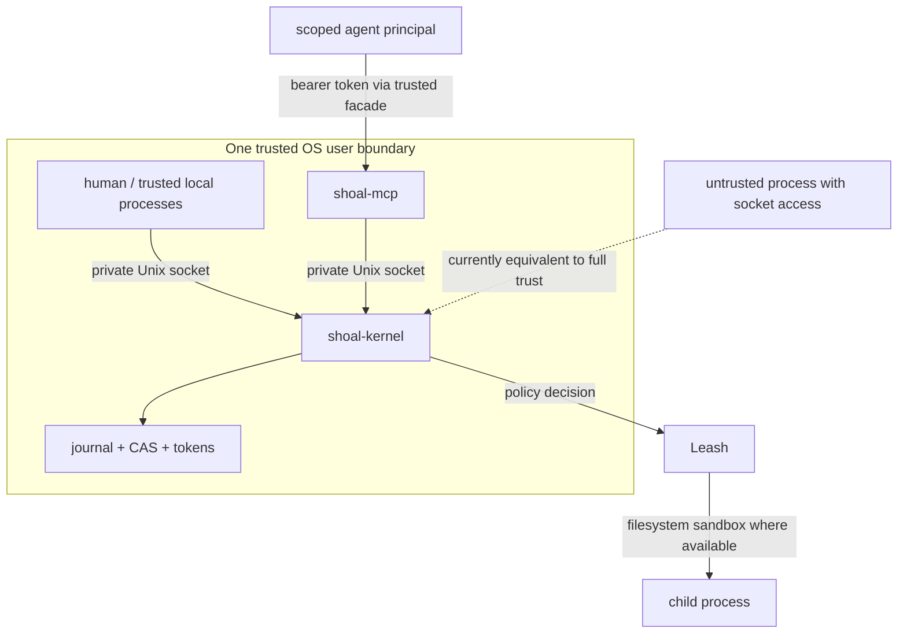
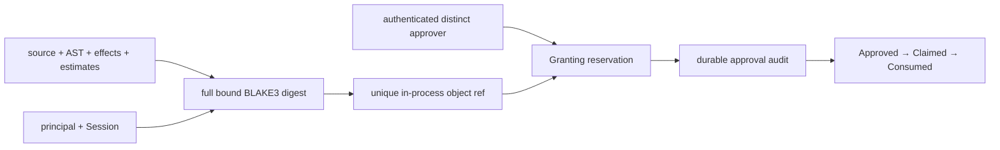

+++
title = "Security and trust boundaries"
description = "Threat model, socket and token authentication, Leash policy, sandbox enforcement, secret handling, isolation gaps, and safe deployment guidance."
weight = 220
template = "docs/page.html"

[extra]
eyebrow = "Security"
group = "Agents & protocol"
audience = "Operators, agent integrators, and security reviewers"
status = "Preview; hardened local boundary with explicit remaining limits"
toc = true
+++

Shoal has useful policy, identity, and sandbox machinery, but one kernel process is not a hard multi-tenant security boundary. Run it as an unprivileged local service, keep its Unix socket private, and use separate OS users/processes/state roots for mutually hostile tenants.

The first deep-audit P0s are closed: journal reads and approvals require scoped attachments; approvals bind and durably audit a distinct authorized approver; plan objects use full caller/content-bound digests and non-overwriting IDs; child evaluators inherit one audited execution context; public sockets cannot assert local-human authority; visible Session names are principal-private; and raw/blob retrieval is owner-checked and byte-bounded. Remaining risk is concentrated in incomplete OS enforcement dimensions, startup-only token loading, same-process resource sharing, and native-code behavior beyond the planner's model.

Do not forward the raw socket casually through TCP, a web gateway, a shared container volume, an untrusted plugin, or another-user IPC bridge. Those transports change the threat model even though socket possession no longer grants local-human authority.

## Threat-model summary



| Boundary | Current strength |
| --- | --- |
| Private socket filesystem permissions | Primary access boundary. Strong against other Unix users when path ownership/modes are correct. |
| Bearer token | Identifies an opt-in agent principal; does not make socket access token-mandatory. |
| Leash plan policy | Evaluates declared effects and approval rules. Useful, but declarations can be opaque/incomplete. |
| Linux Landlock / macOS Seatbelt | Real filesystem restriction for child spawns when a concrete sandbox is resolved. |
| Network restrictions | Policy/advisory only; no OS network enforcement today. |
| Spawn hash/name allowlist | Pre-exec check with a documented TOCTOU window. |
| Named session | Collaboration namespace, not principal isolation. |
| MCP facade | Safer convenience surface, not an authorization proxy around a hostile kernel peer. |

## Safe deployment checklist

For the current release:

1. Run `shoal-kernel` as an unprivileged dedicated user or your own desktop user, never root.
2. Use the default per-user runtime directory or an explicitly owned `0700` directory.
3. Verify the socket is `0600` and never bind it inside a broadly shared/mounted directory.
4. Do not forward the socket over SSH/TCP or mount it into containers with untrusted workloads.
5. Give mutually untrusted agents separate kernel **processes**, state directories, sockets, and preferably OS users—not merely separate session names.
6. Configure an explicit Leash policy for every token principal.
7. Do not permit a scoped/untrusted agent to use nested-evaluator features as though the parent sandbox automatically follows it; isolate the whole kernel process at the OS/service layer.
8. Read `caps_enforced` and the detailed platform limitations; approval is not equivalent to sandboxing.
9. Restart the kernel after creating or revoking tokens because the token store is loaded only at startup.
10. Keep journal/state/secret directories private and back them up as sensitive data.
11. Avoid `format=raw` on untrusted large values without a client-side size limit.

## Socket access is authentication

Default discovery puts the socket under a per-user directory. The kernel creates an owned directory as `0700` and binds the socket as `0600`. It refuses to delete an active listener, another user's stale socket, or a non-socket path.

This protects against other Unix users when the containing filesystem and ownership behave normally. It does not protect against:

- another process running as the same UID;
- root or a sufficiently privileged container host;
- accidental socket forwarding;
- a shared volume that changes ownership/mode semantics;
- a compromised MCP client launched under the same user;
- filesystem backup/snapshot readers with access to the state directory.

The public listener does not accept client-asserted human presence. An attachment with neither bearer nor `local_auth` becomes the restricted `agent:mcp` principal; `local_auth:"local-human"` is rejected on every public/named socket. The only local-human trust root is the server-selected inherited anonymous descriptor used by the default interactive REPL's private, listener-free child kernel. Bearer tokens select explicit machine identities; `supervisor` or `plan.approve` authority is required for cross-principal approval.

The kernel still does not validate `SO_PEERCRED`, so socket isolation remains important: a same-UID process can reach the restricted public surface and attempt any operation its effective principal/policy permits, and a stolen bearer remains a credential. Socket possession alone no longer upgrades a client to local human.

## State-directory sensitivity

The kernel state directory defaults to:

```text
$XDG_STATE_HOME/shoal
# otherwise
~/.local/state/shoal
```

It contains or anchors:

- SQLite/WAL journal entries with original source, AST, effects, paths, principals, statuses, and output descriptors;
- content-addressed blobs for captured output;
- transcript-event persistence;
- `tokens.json`, including the keyed-hash secret and token metadata/digests.

Journal redaction keeps `secret` values out of the typed wire/journal value encoding, but the journal is still sensitive. Source text may reveal filenames, URLs, user-provided literals, and commands; external program output may contain secrets unrelated to Shoal's `secret` type.

Use ordinary private-home permissions, encrypt backups where appropriate, and choose separate state directories when separating trust domains.

## Bearer tokens

Create an agent identity with the standalone companion:

```bash
shoal-token create agent:reviewer reviewer \
  --cap fs.read \
  --cap proc.spawn \
  --ttl 3600
```

The 32-byte random bearer is printed once on stdout. Only a keyed BLAKE3 digest is persisted; validation uses a constant-time digest comparison. Metadata includes:

- 16-hex token ID derived from the first eight digest bytes;
- principal string;
- profile label;
- capability-label array;
- creation/expiry/revocation nanosecond timestamps.

The store is written atomically through a `0600` temporary file and rename, and an existing store is tightened to `0600` when opened.

### Profile and `--cap` are metadata today

The kernel copies token `profile` and `caps` into the `session.attach` result, but authorization does not derive grants from them. Leash evaluates the token's **principal string** against `[principal."..."]` in the policy file.

This means:

- `--cap fs.read` does not itself grant filesystem reading;
- a token principal absent from the policy is denied by plan evaluation;
- two tokens with the same principal share the same Leash policy even if their metadata labels differ;
- operators must keep token metadata and policy entries consistent themselves.

Treat the fields as claims/labels for clients and auditing, not enforced capability objects.

### Runtime reload limitation

`shoal-kernel` opens `tokens.json` into memory once at startup. `shoal-token` runs in another process and rewrites the file, but the daemon has no watcher or reload method.

Consequences:

- a token created while the kernel is running is not accepted until restart;
- a token revoked while the kernel is running can remain valid in that daemon until restart;
- a token that reaches its expiry is rejected without restart because expiry is evaluated at validation time;
- separate kernels with different restart times may temporarily disagree about the same store.

After create/revoke, restart every kernel process that uses the store. If immediate revocation is required, also stop the MCP process/connection that already holds the bearer.

### Store-path alignment

`shoal-token` uses:

```text
$SHOAL_TOKEN_STORE
# otherwise $XDG_STATE_HOME/shoal/tokens.json
# otherwise ~/.local/state/shoal/tokens.json
```

The kernel does not read `SHOAL_TOKEN_STORE`; it opens `<--state-dir>/tokens.json`. Pointing the CLI at an override does nothing for a kernel using another state directory. Align the paths deliberately.

## Leash policy

Start a kernel with an explicit file:

```bash
shoal-kernel --policy "$HOME/.config/shoal/leash.toml"
```

An explicit missing or malformed policy is fatal to kernel startup. Without `--policy`, the kernel constructs a permissive policy for its local-human `uid:<euid>` principal; token principals are not implicitly added.

Example:

```toml
[principal."agent:reviewer"]
net_connect = ["github.com:443", "*.githubusercontent.com:443"]
net_listen = []
proc_spawn = ["git", "rg", "cargo"]
env_read = ["HOME", "PATH", "CARGO_HOME"]
env_write = []
secret_use = ["github-token"]
session_write = true
journal_read = true
time = true
auto_apply = "reversible"
opaque = "ask"
hermetic = false

[principal."agent:reviewer".fs]
read = ["~/develop/shoal/**", "~/.cargo/**", "/usr/**"]
write = ["~/develop/shoal/**", "~/.cache/shoal/**"]
delete = ["~/develop/shoal/target/**"]
```

TOML accepts the nested `[...fs]` form above. Dotted fields such as `fs.read = [...]` are flattened by the loader as well.

### Policy fields

| Field | Value | Matching |
| --- | --- | --- |
| `fs.read` | string array | Every planned path must match a glob. |
| `fs.write` | string array | Every planned path must match a glob. |
| `fs.delete` | string array | Every planned path must match a glob. |
| `net_connect` / alias `net` | `host-pattern:port` array | Glob host; exact port or `*`. |
| `net_listen` | port array | Exact port. |
| `proc_spawn` / alias `spawn` | string array | Exact full hash, argv0, or basename at spawn gate. |
| `env_read` | name array | Exact name or `*`. |
| `env_write` | name array | Exact name or `*`. |
| `secret_use` / alias `secrets` | name array | Exact name or `*`. |
| `session_write` | boolean | Session mutation effect. |
| `journal_read` | boolean | Declared journal-read effect. |
| `time` | boolean | Wall-clock access effect. |
| `auto_apply` | `never`, `in-grant`, `reversible` | Whether an otherwise allowed plan runs without approval. |
| `opaque` | `deny`, `ask`, `allow` | Treatment of unanalyzable effects. |
| `hermetic` | boolean | Ask spawn layer to fail rather than degrade requested sandbox dimensions. |

All listed path/name/host requirements use all-of semantics: one missing grant denies the effect. Unknown principals are denied by plan evaluation.

### Path matching and sandbox roots differ

The plan layer matches normalized planned paths against full glob patterns. The OS sandbox lowers each grant to its longest concrete prefix:

```text
~/work/project/**  ->  ~/work/project
/etc/hosts         ->  /etc/hosts
/**                ->  /
**/secrets         ->  no concrete root
```

Only existing roots are installed. Nonexistent roots are dropped rather than causing sandbox setup to fail. This is fail-closed for access to that root, but it means a policy intended to permit creation under a path must have an existing concrete ancestor grant.

Parent components are lexically normalized; this is not a proof against every symlink/race edge. OS sandbox behavior remains the final filesystem boundary when active.

### Network grant syntax

Each `net_connect` item must contain a final colon:

```toml
net_connect = [
  "api.example.com:443",
  "*.example.net:*",
]
```

The host side is a glob. The port is exact `u16` or `*`. This representation does not naturally express raw IPv6 literals containing colons without additional convention; verify actual planner output before relying on an IPv6 policy.

### Auto-apply and opaque behavior

Effect evaluation first applies individual grants. Deny dominates approval; approval dominates allow. If all effects are allowed:

- `auto_apply = "never"` still requires approval;
- `auto_apply = "in-grant"` allows immediately;
- `auto_apply = "reversible"` allows only plans marked fully reversible.

`opaque` controls an effect that analysis could not make concrete:

- `deny` rejects;
- `ask` requests explicit approval;
- `allow` permits it, subject to auto-apply.

Approving an opaque effect does not teach the OS sandbox what the program will do. Use `opaque = "deny"` for high-assurance agent profiles.

## Effect model

Shoal can derive these semantic effect variants:


| Effect | Concrete data |
| --- | --- |
| `fs_read` | path list |
| `fs_write` | path list |
| `fs_delete` | path list |
| `proc_spawn` | binary content hash and argv0 |
| `net_connect` | host and port |
| `net_listen` | port |
| `env_read` | name list |
| `env_write` | name list |
| `secret_use` | name list |
| `session_write` | marker |
| `journal_read` | marker |
| `time` | marker |
| `opaque` | analysis gap |

Effects describe the planner's understanding. They are not a complete behavior proof for arbitrary native programs. An adapter can declare that `curl URL` connects to a host and writes an output path, but a compromised `curl` binary can attempt more. OS enforcement is what constrains attempted filesystem operations; unimplemented dimensions remain policy/advisory.

## Plan/approval integrity

A plan record stores source, session, principal, effects, and approval state. `plan.get`, `plan.list`, `plan.apply`, and internal approved execution compare stored metadata against the attached caller. That is the useful part of the design.

The stored object identity and approval transition are bound together as follows:



Exact current behavior:

- the full source, canonical AST, effects, reversibility, estimates, Session, and requester feed a domain-separated full BLAKE3 plan hash;
- a monotonic per-kernel suffix makes repeated storage of identical content produce distinct non-overwriting object references;
- `cap.request` requires an authenticated attachment and binds requester, approver, plan/source hashes, Session, and exact effect scope into a durable journal audit;
- self-approval is denied by default; cross-principal approval requires the embedded-human trust root or a `supervisor`/`plan.approve` bearer;
- grant/apply transitions are reserved and one-shot, with rollback on audit/request failure and compare-and-set state checks;
- plans and references remain in-memory and disappear on kernel restart, so they are not durable capabilities or secrets.

## Journal query boundary

`journal.query` requires an attachment, caps each page server-side, treats `limit:0` as an empty page, and forces principal/Session filters to the exact attached owner. An unattached or cross-principal query is rejected. Journal rows and CAS remain sensitive persisted data, so filesystem/state-directory permissions and bearer handling still matter.

## Named sessions are principal-private

A Session is keyed by both authenticated principal and visible name. Two principals requesting `default` receive different evaluators, bindings, cwd, environment, transcripts, tasks, PTYs, Reef state, and event ownership. References and quotas use the same exact owner key rather than the user-chosen name alone.

Current access checks:

| State | Scope check |
| --- | --- |
| Transcript `out:N` | principal + Session |
| Tasks | principal + Session |
| PTYs | principal + Session |
| Environment/cwd/bindings | principal-private evaluator |
| Plans | principal + Session + immutable content binding |
| Journal query | attached principal + exact Session |

This is identity isolation inside one process, not a complete hostile-tenant sandbox. Principals still share the kernel process, global resource budgets, journal/CAS files, and any process-wide failure boundary. Use separate OS users/processes/state directories for mutually hostile tenants.

## Sandbox enforcement

Shoal reports the strongest available platform tier and whether a concrete sandbox is active for the principal.

| Tier | Current meaning |
| --- | --- |
| A | Linux Landlock detected; filesystem rules can be fully installed. |
| B | Linux without usable Landlock; namespace fallback is not installed. |
| C | macOS Seatbelt filesystem profile available through the shipped backend. |
| D | No OS sandbox backend; policy is advisory. |

`available_tier` answers what the host could support. `caps_enforced` becomes true only when an A/C backend exists **and** the principal's grants lower to a nontrivial filesystem sandbox. A permissive `/**` local-human policy deliberately resolves to no sandbox and reports false.

Even when `caps_enforced` is true:

- filesystem access is the enforced dimension;
- network enforcement reports false—there is no seccomp/network-namespace backend;
- spawn content hashing is a preflight, not exec-time pinning;
- the binary can change between hash and exec (TOCTOU);
- policy analysis can miss behavior and emit `opaque`;
- child programs can communicate through already-available resources not modeled by a declared path/host.

Never render a single “sandboxed” badge without the dimension details.

### Nested evaluator policy propagation

Every production child-evaluator route (`spawn`, `.shl` scripts, parallel closures, stream producers, and channel handlers) builds through one audited child-context constructor. It carries principal, Leash policy, Reef resolver/configuration, echo policy, filesystem port, and cancellation semantics; targeted tests and a production-site inventory pin that boundary. The outer parent statement owns journaling, so children do not silently create nested journal entries. This closes the earlier policy-loss gap, but it does not turn planner effects into a complete proof of arbitrary native code behavior; the concrete OS sandbox remains the enforcement boundary.

### Linux Landlock

The child applies read/write/delete path-beneath rules after fork and immediately before exec. The implementation requests a hard compatibility level and errors if Landlock is not fully active. It does not install seccomp or a network namespace.

Landlock is unprivileged and useful, but its exact coverage depends on kernel ABI and filesystem behavior. Test the policy on the production kernel/filesystem combination.

### macOS Seatbelt

The child applies a generated filesystem profile with `sandbox_init`. It reports active tier C when successful. Network restrictions are not installed. Apple considers this interface legacy/private for some contexts, so validate behavior across target macOS releases.

### Hermetic intent

`hermetic = true` asks the spawn layer to refuse rather than proceed when the concrete requested sandbox cannot be fully applied. This is safer than best-effort for supported dimensions, but it is not currently a general hermetic build environment:

- network grants are not lowered into an enforced network sandbox;
- time, process tree, CPU/memory, device, and IPC isolation are not comprehensive;
- Reef's tool hermeticity and Leash's OS sandbox are related but different layers.

Test fail-closed behavior for every effect dimension your workload depends on.

## Process pinning

A nonempty `proc_spawn` list activates spawn pinning. A candidate matches when one entry equals:

- the full BLAKE3 content hash;
- the complete argv0 string;
- the executable basename.

Hash pins are stronger than names but currently use a preflight read followed by normal exec. The file can be replaced between those operations. Reef-provided hashes are reused when available; otherwise Shoal resolves through ambient `PATH` and hashes the binary.

For higher assurance:

- prefer root-owned/immutable tool locations;
- use Reef hash locks and Leash hash pins together;
- prevent write access to executable directories;
- do not claim exec-time content identity until a BPF-LSM/fd-exec-style mechanism exists.

## Secrets

Shoal's `secret` value is redacted by construction on the wire:

```json
{"$":"secret","name":"github-token"}
```

Material is held inside the evaluator value and may be converted to an OS argument only at the command boundary. The journal/value encoder records the name, not the secret bytes. Ordinary value coercion rejects accidental stringification in several contexts.

Limits still matter:

- a child process can print the secret, causing it to enter captured output/journal CAS;
- command-line arguments may be visible to same-user process inspection on some systems;
- downstream programs can write it to files or network;
- debug logging/crashes outside Shoal's typed encoder can leak it;
- secret-use policy is only as complete as effect derivation.

Prefer programs that accept secrets through protected stdin or dedicated file descriptors, avoid echoing them, and scope child filesystem/network access.

The evaluator secret store resolves:

```text
$SHOAL_SECRET_DIR
$XDG_DATA_HOME/shoal/secrets
~/.local/share/shoal/secrets
```

The standalone `shoal-secret` CLI does **not** currently honor `SHOAL_SECRET_DIR`; it uses its XDG/HOME default. This path mismatch can cause operators to update one store while the evaluator reads another. See [Companion CLI reference](@/docs/companion-cli-reference.md).

## Resource and denial-of-service limits

The protocol limits an input frame to 16 MiB and normally elides values around 8 KiB with a 64 KiB encoded hard cap. These are context protections, not comprehensive service quotas.

Current unbounded/high-cost surfaces include:

- `value.get format=raw` returning full string/bytes/base64;
- `blob.get` loading a full CAS blob;
- many named sessions, tasks, plans, PTYs, and MCP subscription threads;
- `task.await` blocking a connection indefinitely;
- PTY child resource consumption;
- journal/CAS disk growth until garbage collection;
- CPU/memory consumed by evaluated source or child processes.

Connections, retained principal Sessions, active tasks, PTYs (per Session/principal/global), subscriptions, plan/source bytes, transcripts, stream cursors, frames, and event queues have explicit bounds. There is still no general per-principal rate, memory, CPU, or descendant-process-tree meter. Use OS service controls (cgroups/launchd limits/container quotas where appropriate), supervise the daemon, and keep hostile code outside a shared kernel process.

## Security review priorities

Before describing Shoal as safe for mutually untrusted agents, the remaining minimum work is:

1. add deployable mandatory-token and socket peer-credential modes;
2. reload/revoke token state live;
3. decide and enforce explicit `JournalRead` policy beyond the implemented exact-owner scoping;
4. add stronger network/process/CPU/memory enforcement while preserving per-dimension truth;
5. close raw retrieval and blob-size denial-of-service gaps;
6. extend adversarial multi-principal, fault-injection, and long-duration lifecycle testing.

Track implementation status in [Current status and limits](@/docs/status-limits.md) and [Roadmap](@/docs/roadmap.md).
