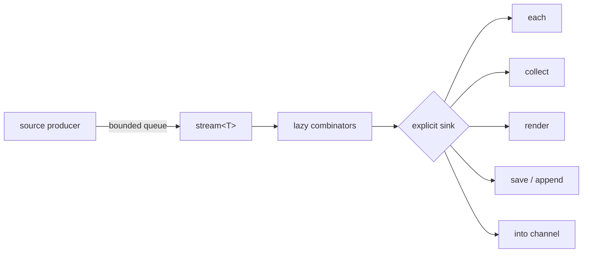
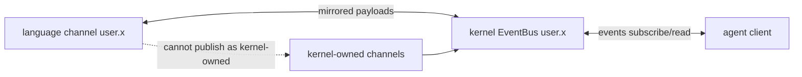

+++
title = "Streams and channels"
description = "Build bounded live dataflows from timers, filesystem events, tailed files, and named channels—with explicit sinks and honest overflow behavior."
weight = 110
template = "docs/page.html"

[extra]
eyebrow = "Live data"
group = "Shell & tools"
audience = "Users building event-driven workflows"
status = "Current local/evaluator implementation"
toc = true
+++

A stream is a single-consumer sequence that may produce values over time. A channel is a named, session-scoped event bus with a bounded replay ring. They share value methods but solve different ownership problems: streams model pull-driven flow, while channels decouple publishers and subscribers.

## Lifecycle first



Streams are consumed once. A second attempt raises `stream_consumed`. A stream can be bounded (known to end) or unbounded. Materializing an unbounded stream raises `stream_unbounded` instead of buffering forever.

A bare stream at the REPL renders a descriptor. It does **not** automatically start a live view:

```text
every(1s)                    # stream descriptor
every(1s).take(5).render()   # drives five values
```

## Timer source

`every(interval)` starts a timer producer and returns `stream<datetime>`:

```text
every(1s).take(5).collect()
every(250ms).take(20).each(t => echo (t))
```

The interval must be positive. The producer has a one-slot buffer. If the consumer is slow, additional ticks are dropped/coalesced with no marker; memory remains constant. The retained slot is the earliest undelivered tick, so its timestamp can be up to roughly one interval stale when the consumer resumes.

Construction currently starts the producer thread immediately. “Lazy” describes downstream pulling and combinators, not deferred creation of every underlying OS resource.

## Watch filesystem events

```text
watch(path("./src"), recursive: true)
  .where(.kind == "modified")
  .take(10)
  .collect()
```

`watch` accepts a path or glob and returns events:

```text
{ path: path, kind: "created" | "modified" | "removed", ts: datetime }
```

A glob watches its literal directory prefix and filters full paths. The current consumer queue holds 64 events. When a burst overflows it, events are dropped and a summary event is owed:

```text
{ marker: "stream_gap", reason: "watch_overflow", dropped: n,
  from_seq: null, to_seq: null,
  path: watched_root, kind: "modified", ts: datetime, coalesced: true }
```

Consumers that require an exact audit trail must rescan authoritative state after `coalesced: true`; a watch stream is a notification channel, not a durable journal.

## Tail a file

```text
tail(path("./service.log"))
  .where(.contains("ERROR"))
  .take(20)
  .collect()
```

`tail(file, from_start: false)` follows complete lines. It begins at EOF by default or byte zero with `from_start: true`, tracks truncation/rotation when the file shrinks, and uses native filesystem notifications.

Its queue also holds 64 items. Dropped lines are represented by a marker value:

```text
{ marker: "stream_gap", reason: "tail_overflow", dropped: 37,
  from_seq: null, to_seq: null }
```

That means the stream can contain either strings or marker records under pressure. Branch on shape instead of assuming every element is text.

## Lazy combinators

Current stream-specific combinators are:

| Method | Behavior |
|---|---|
| `map(f)` | transform each item |
| `where(f)` / `filter(f)` | retain items whose predicate is true |
| `scan(initial, f)` | emit running state |
| `flat_map(f)` | drain each returned collection/stream before pulling the next outer item |
| `take(n)` | stop after `n`; makes the stream bounded |
| `take_until(f_or_stream)` | stop when predicate triggers or another stream produces |
| `dedupe()` | drop adjacent duplicates |
| `distinct(limit?)` | hash and drop all previously seen equal values; default 4,096, fail typed at the caller/default identity limit or 16 MiB retained history |
| `debounce(duration)` | emit after quiet interval |
| `throttle(duration)` | rate-limit emissions |
| `window(count_or_duration)` | collect exact count/time windows; at most 4,096 items and 16 MiB retained history |
| `buffer(n)` | eager lossless producer queue with capacity `n`; zero is a rendezvous |
| `enumerate()` | pair items with sequence positions |
| `merge(other)` | fair interleave; round-robin while both sides are ready |
| `zip(other)` | pair positionally, holding at most one unpaired item per side |

Every combinator consumes its input stream and returns a new one. Assign the new stream, not the old handle:

```text
let filtered = watch(path("./src")).where(.kind == "modified")
filtered.take(10).render()
```

`flat_map` is sequential, not concurrent: an endless returned substream prevents later outer items from being pulled. Compact range results are pulled lazily instead of first expanding into a queue. `distinct` uses equality-compatible hash buckets and preserves exact membership up to its caller/default 4,096-identity and 16 MiB walls; reaching either raises `stream_distinct_limit`. Prefer `dedupe` when only adjacent duplicate suppression is required.

## Sinks

Sinks drive a stream until it ends, errors, or is canceled:

```text
stream.each(item => handle(item))
stream.collect()
stream.render()
stream.save(path("events.ndjson"))
stream.append(path("events.ndjson"))
stream.into(channel("user.events"))
```

`collect()` rejects an unbounded stream. `each` returns null after completion. `render` sends each value to the evaluator's statement sink.

For streams, both `.save(path)` and `.append(path)` currently open the file in append mode and write one line per item. Strings and bytes are written as their content; other values become JSON per line. `.save` does not truncate, despite its name—this is an important preview behavior.

`buffer(n)` consumes its input immediately and starts an owned producer pump. The queue holds exactly `n` items and paces rather than dropping; the producer may additionally hold the item it is trying to enqueue. `buffer(0)` is a lossless rendezvous with no queued item. Dropping the buffered stream or canceling its parent stops the pump. Buffer and stream-feed pumps share a process-wide limit of 64 workers with live `every`, `watch`, and `tail` sources; creating another returns `stream_pump_limit` until one finishes or is dropped.

`tee(n)` returns independently drivable streams. A bounded stream materializes once for exact replay. A live stream uses a queue of at most 64 pending items per fork. When a slow fork falls behind, overflowed values are dropped and later represented in order by a `{marker: "stream_gap", reason: "tee_overflow", dropped: n, from_seq: null, to_seq: null}` record. The marker appears as soon as that fork's queue has room, or after its buffered items drain; overflow does not raise an error and is never silent.

## Feed a process incrementally

`.feed(command)` drives a finite or live stream into captured child stdin without collecting it first:

```text
tail(path("service.log")).take(100).feed(grep ERROR)
["alpha", "beta"].stream().feed(sort)
```

Ordinary values are line-framed so item boundaries survive; byte values and outcome output remain raw. The child-stdin queue holds 16 chunks of at most 64 KiB (at most 1 MiB queued). Backpressure is lossless, and the pump stops on cancellation, child exit, closed stdin, or a serialization/upstream error. Feeding forces captured execution rather than a PTY. The kernel wire still does not expose a general stream-ref chunk-pull protocol.

## Named channels

Create a handle with `channel(name)`:

```text
let updates = channel("user.builds")
updates.emit({ id: 42, state: "started" })
updates.latest()
updates.events()
updates.take(timeout: 5s)
```

Channel methods:

| Method | Result |
|---|---|
| `emit(value)` | publish, return null |
| `latest()` | latest payload or null; never waits |
| `events(since: seq?)` | stream of event records; replay then live |
| `take(timeout: duration?)` | wait for the next future payload only |

Event records have a common shape:

```text
{ channel: str, seq: int, ts: datetime, payload: value }
```

Each subscriber queue is capped at 256 deliveries. If it falls behind, the oldest queued entries are compacted into an in-band record before the newest event:

```text
{ marker: "stream_gap",
  reason: "subscriber_overflow" | "history_evicted" | "mixed_overflow",
  dropped: n, from_seq: first_missing, to_seq: last_missing,
  channel: str, seq: null, ts: datetime, payload: null, overflow: true }
```

Sequence numbers are monotonic per channel. Each channel retains its most recent 1,024 events. `events()` queues retained records then goes live, subject to the same 256-delivery bound. `events(since: n)` selects records with `seq > n`; if the cursor predates the ring, a queued `history_evicted` gap accounts for the missing range. A replay that itself exceeds 256 deliveries can compact that marker with later loss into `mixed_overflow` while preserving the count and widest sequence range. Persist events separately when recovery of the missing payloads matters.

`take()` subscribes without replay, so it sees only an event published after the call. A timeout raises `timeout` rather than returning null.

## Handlers and stream-to-channel bridges

```text
let task = on(channel("user.builds"), event => {
  echo (event.payload)
})

watch(path("./src"))
  .into(channel("user.files"))
```

`on(channel_or_name, handler)` subscribes before spawning its handler task so the startup gap does not lose an event. It is equivalent in intent to spawning `.events().each(handler)`. An idle receive checks `task.cancel()` every 25 ms and cancellation takes priority over queued backlog; a handler already running must still return cooperatively.

There is no `on channel(...) { ... }` keyword form; `on(...)` is a function call in the current grammar.

## Kernel bridge

In a kernel-hosted session, only channels beginning with `user.` bridge bidirectionally between language code and the external event bus. This prevents language code from spoofing kernel-owned semantic channels such as approvals, journal notifications, or session transcript events.

Wire `events.publish` treats the wire event as authoritative and reports the language-side result in `language_mirror`. A full or quarantined bounded language bus returns `language_mirror.ok = false`; the wire event remains committed, so clients should not retry it as though the publish itself failed.



The local standalone REPL has no external forwarder; its channels remain session-local.

## Cancellation and resources

Dropping/finishing a stream usually disconnects its bounded receiver, causing timer/watch/tail producers to exit and release resources. A timer thread sleeping until its next interval notices disconnection only when it wakes and tries to send. Owned buffer/feed pumps and `on` receives poll cancellation explicitly; generic sinks over other live sources can still depend on source shutdown, so bound live workflows explicitly.

For durable event history use `.save`, journal-aware workflows, or an external store. Channels and source buffers intentionally trade completeness under overload for bounded memory.
