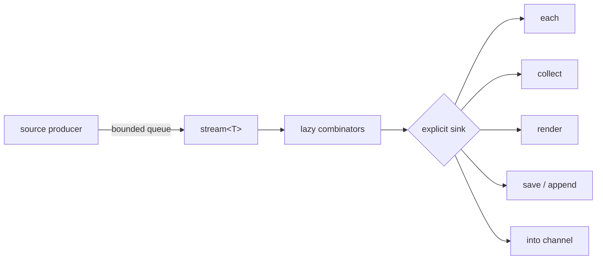
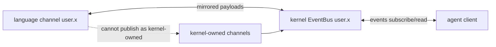

+++
title = "Streams and channels"
description = "Build bounded live dataflows from timers, filesystem events, tailed files, and named channels—with explicit sinks and honest overflow behavior."
weight = 110
template = "docs/page.html"

[extra]
eyebrow = "Live data"
group = "Shell & tools"
audience = "Users building event-driven workflows"
status = "Current local/evaluator implementation"
toc = true
+++

A stream is a single-consumer sequence that may produce values over time. A channel is a named, session-scoped event bus with a bounded replay ring. They share value methods but solve different ownership problems: streams model pull-driven flow, while channels decouple publishers and subscribers.

## Lifecycle first



Streams are consumed once. A second attempt raises `stream_consumed`. A stream can be bounded (known to end) or unbounded. Materializing an unbounded stream raises `stream_unbounded` instead of buffering forever.

A bare stream at the REPL renders a descriptor. It does **not** automatically start a live view:

```text
every(1s)                    # stream descriptor
every(1s).take(5).render()   # drives five values
```

## Timer source

`every(interval)` starts a timer producer and returns `stream<datetime>`:

```text
every(1s).take(5).collect()
every(250ms).take(20).each(t => echo (t))
```

The interval must be positive. The producer has a one-slot buffer. If the consumer is slow, additional ticks are dropped/coalesced with no marker; memory remains constant. The retained slot is the earliest undelivered tick, so its timestamp can be up to roughly one interval stale when the consumer resumes.

Construction currently starts the producer thread immediately. “Lazy” describes downstream pulling and combinators, not deferred creation of every underlying OS resource.

## Watch filesystem events

```text
watch(path("./src"), recursive: true)
  .where(.kind == "modified")
  .take(10)
  .collect()
```

`watch` accepts a path or glob and returns events:

```text
{ path: path, kind: "created" | "modified" | "removed", ts: datetime }
```

A glob watches its literal directory prefix and filters full paths. The current consumer queue holds 64 events. When a burst overflows it, events are dropped and a summary event is owed:

```text
{ path: watched_root, kind: "modified", ts: datetime, coalesced: true }
```

Consumers that require an exact audit trail must rescan authoritative state after `coalesced: true`; a watch stream is a notification channel, not a durable journal.

## Tail a file

```text
tail(path("./service.log"))
  .where(.contains("ERROR"))
  .take(20)
  .collect()
```

`tail(file, from_start: false)` follows complete lines. It begins at EOF by default or byte zero with `from_start: true`, tracks truncation/rotation when the file shrinks, and uses native filesystem notifications.

Its queue also holds 64 items. Dropped lines are represented by a marker value:

```text
{ dropped: 37 }
```

That means the stream can contain either strings or marker records under pressure. Branch on shape instead of assuming every element is text.

## Lazy combinators

Current stream-specific combinators are:

| Method | Behavior |
|---|---|
| `map(f)` | transform each item |
| `where(f)` / `filter(f)` | retain items whose predicate is true |
| `scan(initial, f)` | emit running state |
| `flat_map(f)` | emit items from each returned collection/substream, one source drained fully at a time (sequential, not interleaved) |
| `take(n)` | stop after `n`; makes the stream bounded |
| `take_until(f_or_stream)` | stop when predicate triggers or another stream produces |
| `dedupe()` | drop adjacent duplicates |
| `distinct()` | drop all previously seen values; history can grow |
| `debounce(duration)` | emit after quiet interval |
| `throttle(duration)` | rate-limit emissions |
| `window(count_or_duration)` | collect count/time windows |
| `buffer(n)` | decouple: a producer thread runs the upstream up to `n` items ahead |
| `enumerate()` | pair items with sequence positions |
| `merge(other)` | interleave two streams |
| `zip(other)` | pair two streams |

Every combinator consumes its input stream and returns a new one. Assign the new stream, not the old handle:

```text
let filtered = watch(path("./src")).where(.kind == "modified")
filtered.take(10).render()
```

`distinct` is a deliberate memory tradeoff: source buffers remain bounded, but the set of every distinct value seen is inherently unbounded. Prefer `dedupe` or a bounded window when long-lived cardinality is unknown.

## Sinks

Sinks drive a stream until it ends, errors, or is canceled:

```text
stream.each(item => handle(item))
stream.collect()
stream.render()
stream.save(path("events.ndjson"))
stream.append(path("events.ndjson"))
stream.into(channel("user.events"))
```

`collect()` rejects an unbounded stream. `each` returns null after completion. `render` sends each value to the evaluator's statement sink.

For streams, both `.save(path)` and `.append(path)` currently open the file in append mode and write one line per item. Strings and bytes are written as their content; other values become JSON per line. `.save` does not truncate, despite its name—this is an important preview behavior.

`buffer(n)` is a real decoupling stage: it starts a background producer that eagerly drives everything below it — closures included — and stays at most `n` items ahead of the consumer. Items are paced, never dropped, so the sequence is exactly preserved; `buffer(0)` is a rendezvous handoff between the two threads. Construction is eager (production begins immediately, like `every`/`watch`/`tail`), stages written after the buffer stay lazy, and a bounded stream stays collectable through it. Cancelling the session or dropping the stream stops the producer promptly.

`tee(n)` returns independently drivable streams. A bounded stream materializes once for exact replay. A live stream uses a queue of at most 64 pending items per fork. When a slow fork falls behind, overflowed values are dropped and later represented in order by a `{dropped: n}` marker. The marker appears as soon as that fork's queue has room, or after its buffered items drain; overflow does not raise an error and is never silent.

## Streams cannot feed processes yet

The finite-value `feed` serializer rejects streams. Incremental stream-to-child-stdin is not wired:

```text
# current workaround
let batch = source.take(100).collect()
batch.feed(^consumer)
```

Likewise, the kernel wire does not currently expose a general stream-ref chunk-pull protocol. Keep live consumption inside language code or bridge through `user.*` channels.

## Named channels

Create a handle with `channel(name)`:

```text
let updates = channel("user.builds")
updates.emit({ id: 42, state: "started" })
updates.latest()
updates.events()
updates.take(timeout: 5s)
```

Channel methods:

| Method | Result |
|---|---|
| `emit(value)` | publish, return null |
| `latest()` | latest payload or null; never waits |
| `events(since: seq?)` | stream of event records; replay then live |
| `take(timeout: duration?)` | wait for the next future payload only |

Event records have a common shape:

```text
{ channel: str, seq: int, ts: datetime, payload: value }
```

Sequence numbers are monotonic per channel. Each channel retains its most recent 1,024 events. `events()` replays the current ring then goes live; `events(since: n)` replays only records with `seq > n`. If a cursor is older than the ring, evicted history cannot be recovered from the channel; persist it separately.

Each live subscription buffers a bounded number of undelivered events (the replay prefix plus 256). Replay is always delivered whole. If a subscriber falls further behind, newer events are dropped for that subscriber — publishers never block — and the gap is reported in order by a single marker record `{channel, seq, ts, payload: null, dropped: n}` once the queue has room again. The marker's `seq` is the newest dropped event's sequence, so `events(since: seq)` recovers whatever the ring still retains of the gap. Distinguish markers from real events by the `dropped` field.

`take()` subscribes without replay, so it sees only an event published after the call. A timeout raises `timeout` rather than returning null.

## Handlers and stream-to-channel bridges

```text
let task = on(channel("user.builds"), event => {
  echo (event.payload)
})

watch(path("./src"))
  .into(channel("user.files"))
```

`on(channel_or_name, handler)` subscribes before spawning its handler task so the startup gap does not lose an event. It is equivalent in intent to spawning `.events().each(handler)`.

There is no `on channel(...) { ... }` keyword form; `on(...)` is a function call in the current grammar.

## Kernel bridge

In a kernel-hosted session, only channels beginning with `user.` bridge bidirectionally between language code and the external event bus. This prevents language code from spoofing kernel-owned semantic channels such as approvals, journal notifications, or session transcript events.



The local standalone REPL has no external forwarder; its channels remain session-local.

## Cancellation and resources

Dropping/finishing a stream usually disconnects its bounded receiver, causing timer/watch/tail producers to exit and release resources. A timer thread sleeping until its next interval notices disconnection only when it wakes and tries to send. `Ctrl-C` and task cancellation propagate through host cancellation paths, but code should still bound live workflows explicitly.

For durable event history use `.save`, journal-aware workflows, or an external store. Channels and source buffers intentionally trade completeness under overload for bounded memory.
