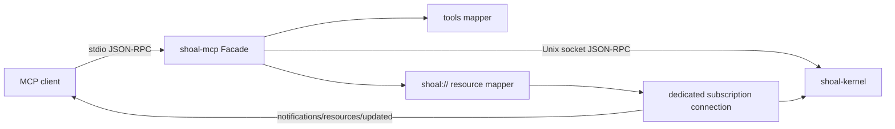
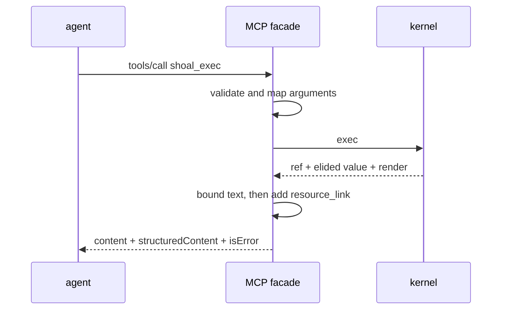
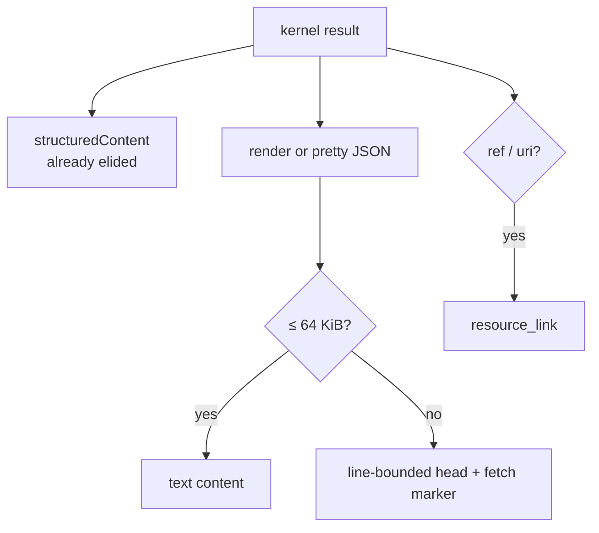
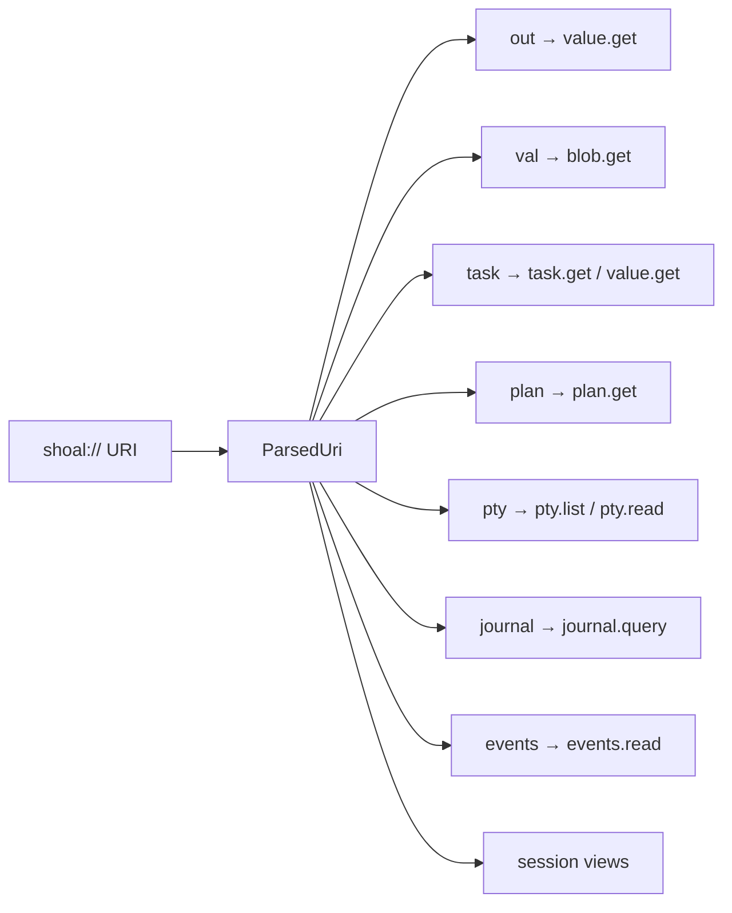
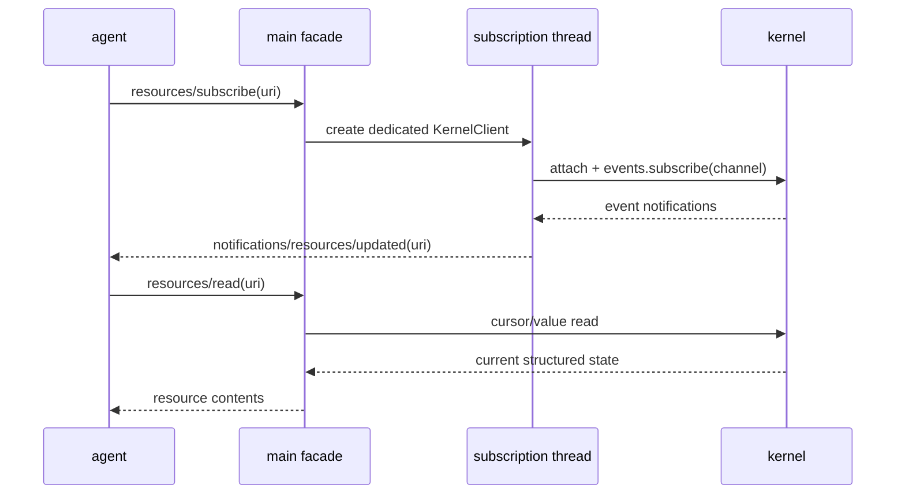

+++
title = "Agent and MCP surface"
description = "How shoal-mcp projects kernel methods into bounded tools, URI resources, subscriptions, and a zero-config stdio server."
weight = 80
template = "docs/page.html"

[extra]
group = "Kernel & agents"
eyebrow = "Agent architecture"
status = "MCP 2025-06-18 facade"
audience = "Agent-tool and protocol contributors"
wide = true
+++

`shoal-mcp` is a transport facade, not a second evaluator. It reads newline-framed MCP JSON-RPC from
stdin, connects to a kernel Unix socket, attaches as a non-TTY client, maps tools/resources to kernel
methods, and writes bounded MCP results to stdout.

## Bridge topology



The facade advertises MCP protocol version `2025-06-18`, tools, resources, and resource
subscriptions. It does not expose prompts.

Source: [`shoal-mcp`](https://github.com/alliecatowo/shoal/tree/main/crates/shoal-mcp/src).

## Startup and transport

On startup, the facade attempts to connect to the discovered kernel socket. If unavailable, it
best-effort spawns a detached `shoal-kernel`, polls readiness for about five seconds, then connects.
`SHOAL_NO_AUTOSTART` opts out for externally supervised kernels. Competing autostarts rely on the
kernel's socket preparation to leave one winner.

Both MCP stdio and kernel socket protocols use newline JSON frames with a 16 MiB completed-frame
limit. Like the kernel reader, the MCP reader calls `read_line` before checking size, so memory is not
strictly bounded while the line is being accumulated.

Stdout is locked per complete frame. This lets the request loop and subscription-forwarder threads
write without interleaving JSON bytes.

## Tool projection

The facade currently exposes 13 tools:

| MCP tool | Kernel method | Purpose |
|---|---|---|
| `shoal_exec` | `exec` | run/plan source, position, background/timeout, elision |
| `shoal_plan` | `exec(mode=plan)` | derive effects without spawning |
| `shoal_apply` | `plan.apply` | apply a stored approved plan |
| `shoal_get` | `value.get` | drill into/slice a transcript value |
| `shoal_journal` | `journal.query` | structured durable query |
| `shoal_cancel` | `task.cancel` | request task cancellation |
| `shoal_cap_request` | `cap.request` | request approval/grant for a plan |
| `shoal_pty_open` | `pty.open` | start a real interactive program |
| `shoal_pty_send` | `pty.send` | send text, named keys, or byte input |
| `shoal_pty_read` | `pty.read` | read rendered screen/cursor/liveness |
| `shoal_pty_resize` | `pty.resize` | resize terminal and emulator grid |
| `shoal_pty_close` | `pty.close` | terminate and reap a PTY |
| `shoal_pty_list` | `pty.list` | enumerate session PTYs |

The facade's main `KernelClient` attaches before calling these methods, but that does not make every
kernel handler authorization-safe. In particular, `cap.request` ignores the attachment because its
router/handler signature receives none, and `journal.query` likewise has no attachment or
caller-principal filter. A normal MCP call happens to arrive on an attached connection; a direct
kernel client can call the same methods unattached, and an attached MCP principal is not checked as
the approver. This must be fixed in the kernel boundary rather than papered over in the facade.



Kernel RPC errors become successful MCP `tools/call` envelopes with `isError: true` and structured
error content. Transport/argument mapping failures become MCP-level errors.

## Bounded agent context

For every tool result, `structuredContent` carries the kernel's already-elided response. Human text
prefers the kernel render and is independently capped at 64 KiB. Truncation keeps whole leading lines
when possible and appends a marker describing remaining lines and the ref/URI to fetch. If an
addressable ref is present, the result also includes an MCP `resource_link`.



This is a context-safety boundary: a command can produce gigabytes without forcing the whole payload
into the model context. The agent follows a ref and requests only a field, range, or format.

## Resource model

Stable roots include:

- `shoal://journal`;
- `shoal://jobs`;
- `shoal://session/cwd`, `/env`, and `/reef`;
- `shoal://pty`.

Dynamic resource listing adds live/recent tasks, stored plans, and open PTYs. Templates cover:

```text
shoal://out/{n}{?path,slice,format}
shoal://val/{hash}
shoal://task/{id}
shoal://task/{id}/out{?path,slice,format}
shoal://plan/{ref}
shoal://session/{view}
shoal://pty/{id}
shoal://journal{?since,until,head,principal,ok,effects,limit}
shoal://events/{channel}{?since,limit}
```



Resource reads return textual content plus `structuredContent`. `format=render` or `format=raw`
becomes `text/plain`; structured data is pretty JSON text with the same bounded-text rule.

There is a current raw-value escape in that mapping. Kernel `value.get {format:"raw"}` returns
complete bytes as `raw_base64`, without normal elision. The MCP resource reader recognizes a field
named `raw` for plain-text handling but does not special-case `raw_base64`; the entire base64 payload
therefore remains in `structuredContent` and its JSON text representation. A CAS ref that looked
context-cheap can expand to the full blob in both kernel memory and agent context. Raw fetch needs a
bounded slice/stream or explicit out-of-band resource contract before it is safe to advertise as an
elision exception.

Session env is names-only unless the kernel policy grants reading all requested names. The facade
does not reimplement that authority decision.

## Subscriptions

Only `shoal://events/{channel}` and task URIs map to event channels. Each subscription opens a
dedicated kernel client connection and starts a forwarding thread, avoiding contention with normal
request/response reads.



The push notification says a resource changed; the agent then reads the resource. Task output is not
incrementally streamed: once the kernel task has a result ref, `/out` resolves the captured outcome.

PTY resources are **not** subscribable. `shoal_pty_read` must be polled, and its `changed` bit tells
the caller whether the rendered screen changed since its last read. MCP `resources/unsubscribe`
currently acknowledges without an explicit facade-side thread registry; kernel disconnect cleanup
ultimately removes a subscription when its connection ends.

## Agent-relevant semantic boundaries

- Default `shoal_exec` position is value position, so non-zero external status is a returned outcome
  rather than automatically raised.
- A timed-out synchronous request becomes a task ref; timeout does not imply cancellation.
- A task channel is `task.N`, while its object ref is `task:N`.
- Plans are not bearer permissions; apply verifies session/principal/source and current approval.
- `WireValue::Stream` is descriptive only; no wire chunk-pull method currently exists.
- PTY reads return the emulator's rendered grid, not escape sequences or an unbounded byte log.
- MCP sees the kernel host's adapters/config/initialization state, which is not currently equal to the
  local REPL's host assembly.

## Maintaining the facade

When adding a kernel method, first decide whether it is an action (tool), an addressable noun
(resource), a change signal (subscription), or some combination. Keep schemas closed with
`additionalProperties: false` where appropriate, forward every documented option, and test the live
kernel path—not only mapper unit tests.

Every potentially large result needs all three layers:

1. kernel structural elision with an addressable ref;
2. kernel render bounding;
3. MCP text bounding and resource link.

Bypassing one layer can flood a direct kernel client or an agent context even if the others are safe.
