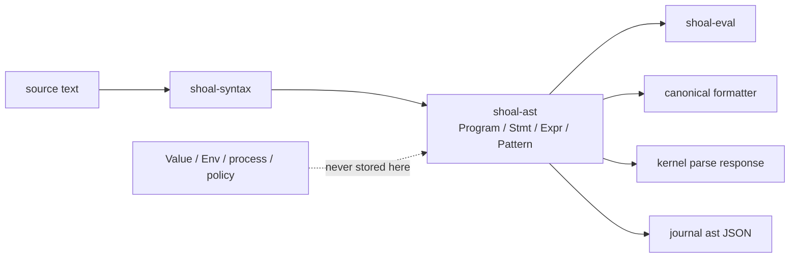
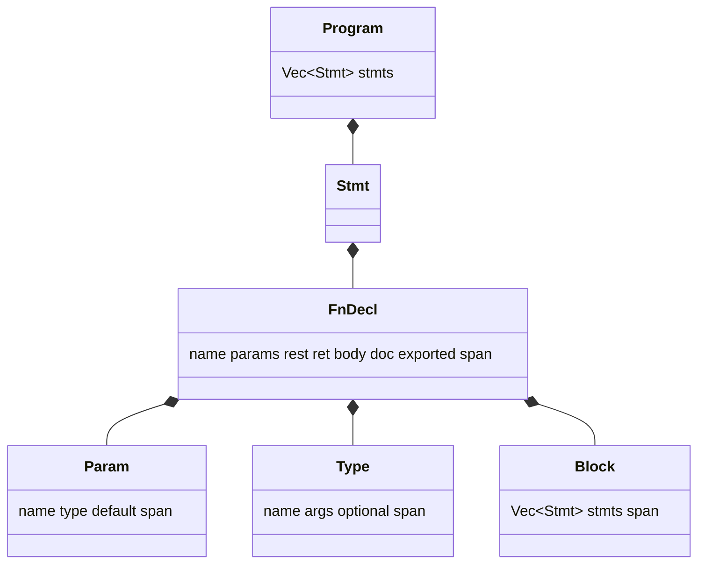
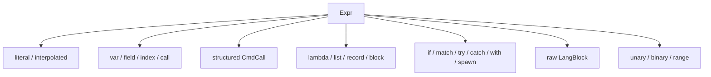
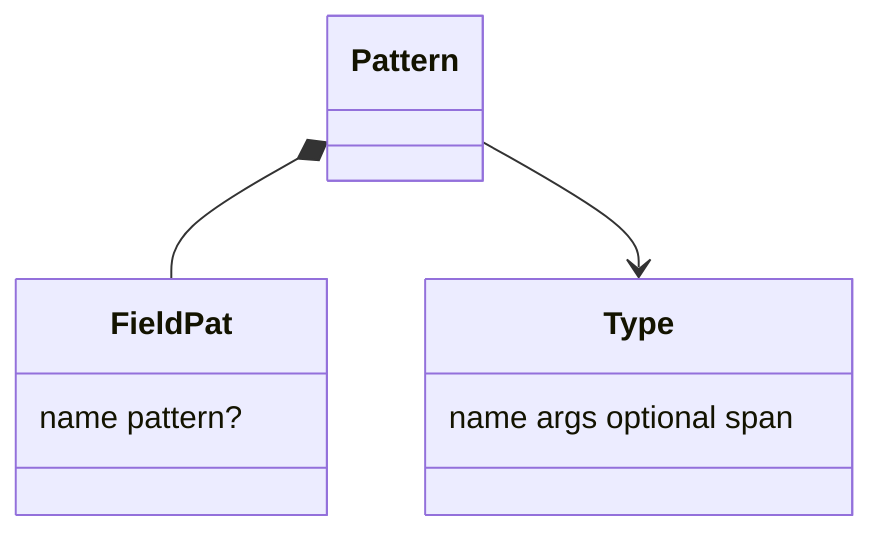
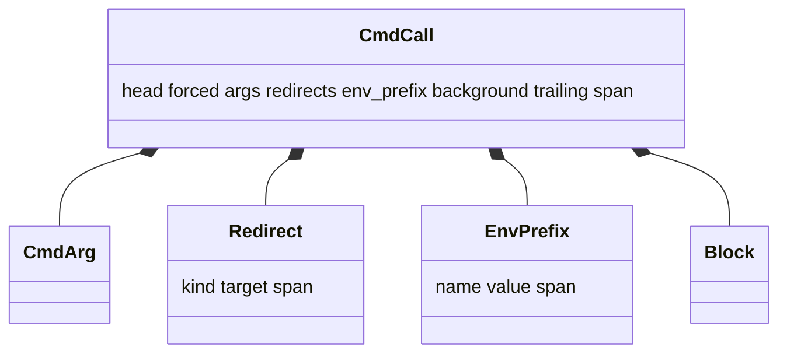
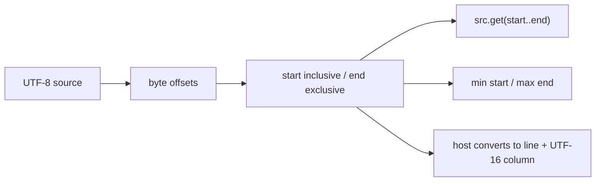
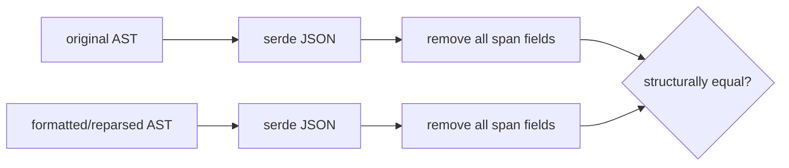

+++
title = "AST model, spans, and serialization"
description = "Every syntax node, the byte-span contract, command structure, serde shape, AST version boundary, and safe evolution workflow."
weight = 31
template = "docs/page.html"

[extra]
group = "Language & runtime"
eyebrow = "Language book"
status = "Canonical syntax representation"
audience = "Parser, evaluator, formatter, and protocol contributors"
wide = true
+++

`shoal-ast` is a dependency-free description of parsed Shoal source. It owns representation, not
meaning: there is no environment, resolved executable, open handle, policy verdict, or runtime
`Value` in an AST. Syntax, evaluator, kernel parse responses, journal AST snapshots, and formatters
all depend on this stability.

Source: [`crates/shoal-ast/src/ast.rs`](https://github.com/alliecatowo/shoal/blob/main/crates/shoal-ast/src/ast.rs)
and [`span.rs`](https://github.com/alliecatowo/shoal/blob/main/crates/shoal-ast/src/span.rs).

## Ownership boundary



The crate has three files: `lib.rs` re-exports the model, `ast.rs` defines nodes, and `span.rs`
defines source byte ranges.

## Root and statement nodes

`Program` is only `Vec<Stmt>`. It does not retain the original source, filename, line table, parser
context, or AST version. Hosts keep those separately.

| Statement variant | Required structure | Runtime concern deliberately absent |
|---|---|---|
| `Let` | pattern, optional type, initializer, mutable/exported flags, span | evaluated value and binding cell |
| `Fn` | `FnDecl` with params/rest/return/body/doc/export/span | captured environment |
| `Alias` | name and structured `CmdCall` target | resolved callable |
| `Use` | source path text | canonical module path/cache entry |
| `Assign` | expression target, assign operator, value | lvalue resolution and mutation result |
| `Return` | optional expression | call-frame flow |
| `Break`, `Continue` | span | loop-frame flow |
| `For` | binding pattern, iterable, block | iterator values and lexical child scope |
| `While` | condition and block | truth evaluation/cancellation |
| `Expr` | expression and statement span | statement/value position behavior |



Function doc comments are syntax data because the evaluator synthesizes callable `--help` from the
declaration. Type annotations are recursive name/argument/optional syntax; the AST does not resolve
whether a type name is valid or how coercion works.

## Expression inventory

The enum is broad but intentionally shallow: nested ownership is `Box<Expr>` or vectors, and every
top-level variant carries its covering span.

| Family | Variants | Important stored distinction |
|---|---|---|
| literals | `Null`, `Bool`, `Int`, `Float`, `Str`, `Size`, `Duration`, `Time`, `DateTime`, `Regex` | sizes are bytes, durations nanoseconds; datetime/regex validation occurs later |
| interpolated text | `StrInterp` with `StrPart::Lit` / `StrPart::Expr` | literal and expression parts remain distinct |
| access | `Var`, `Field`, `Index`, `MethodCall`, `FnCall` | optional navigation is a flag on field/method nodes |
| commands | `Cmd` | full command grammar is nested, not flattened to a string |
| functions/data | `Lambda`, `List`, `Record`, `Block` | lambda body is an expression; a block is an expression containing statements |
| control | `If`, `Match`, `Try`, `Catch`, `With`, `Spawn` | postfix `Catch` remains distinct for lossless formatting |
| foreign language | `LangBlock` | interpreter tool name plus raw source body |
| operators | `Binary`, `Unary`, `Range` | operator enums and inclusive flag |



Position is not stored on `Expr::Cmd`. The evaluator supplies `Position::Statement` or
`Position::Value` from the surrounding evaluation path. Reusing one AST in a different position can
therefore change capture and non-zero-status behavior without changing the node.

## Patterns

Patterns are a separate algebra rather than arbitrary expressions:

- wildcard;
- binding name;
- restricted literal expression;
- integer range;
- type test with optional binder;
- record fields with shorthand or nested patterns;
- fixed/list-rest destructuring.



This separation lets parser and evaluator enumerate binders without executing source. A new pattern
variant requires updates to parser binding collection, runtime matching, formatter, serde tests, and
every exhaustive `Pattern::span` match.

## Commands remain structured

A `CmdCall` preserves the command head and all shell-like syntax as typed fields:



`CmdArg` distinguishes word, path, glob, quoted string expression, parenthesized expression, long
flag with optional structured value, short-flag cluster, `--`, and bare `-`. Redirects distinguish
overwrite, append, and input. Environment prefixes are retained separately from arguments.

These distinctions are load-bearing later:

- words are coerced against callable or adapter signatures;
- globs can be expanded by a generic caller or passed intact to a `glob` parameter;
- paths remain source text until expansion/resolution;
- flags bind by name and short-flag tables;
- adapter `consumed` parameters can be recognized but not forwarded;
- effects can substitute typed argument/path positions;
- redirects work for both builtin and external outcomes.

`background` and environment-prefix syntax are represented rather than eagerly rewritten by the
parser. The evaluator desugars a background call to a spawned block; environment prefixes lower to
scoped process environment at execution.

## Span contract

`Span { start: u32, end: u32 }` is a half-open range of **UTF-8 source bytes**.



Invariants:

- child spans lie within their source unit and normally within the parent span;
- `join` returns the smallest covering range;
- synthesized zero-width nodes use a meaningful anchor;
- `Expr::span`, `Stmt::span`, `Pattern::span`, and `CmdArg::span` are exhaustive accessors;
- line/column conversion occurs only at presentation/protocol boundaries.

Two implementation edges deserve awareness. `Span::new` casts `usize` to `u32`, so source beyond
4 GiB cannot be represented safely. `Span::slice` returns `""` for an invalid range rather than
failing, which is friendly for diagnostics but can hide a producer bug. Do not use empty slice as
proof that a node legitimately covered no text.

## Serialization shape

Every node derives Serde serialization and deserialization. Tagged enums use a `kind` discriminator
with snake-case variant names:

```json
{
  "kind": "let",
  "pattern": { "kind": "bind", "name": "x", "span": { "start": 4, "end": 5 } },
  "ty": null,
  "init": { "kind": "int", "value": 3, "span": { "start": 8, "end": 9 } },
  "mutable": false,
  "exported": false,
  "span": { "start": 0, "end": 9 }
}
```

Operators and redirect kinds serialize as snake-case enum strings. Struct field names are their Rust
field names, including escaped Rust identifiers such as `else` represented through its Serde field
name. Round-trip equality includes spans.

### Version is out-of-band

Serialized `Program` contains no version field. The kernel currently advertises `AST_VERSION = 2`
in attach/parse/explain responses and stores bare AST JSON in journal rows. A client must retain the
out-of-band version; a raw JSON blob alone is not self-describing. Any incompatible node/field change
must deliberately bump the kernel constant and define what journal readers do with older snapshots.

## Canonical equivalence

The formatter's `canonical_equivalent` serializes two ASTs, recursively removes every `span` field,
and compares remaining JSON. This distinguishes semantic syntax structure from expected span changes
after formatting.



It is not runtime semantic equivalence: two different AST shapes that happen to evaluate to the same
value remain unequal, and context-dependent command dispatch is already resolved by parsing.

## Safe AST evolution workflow

1. Decide whether the feature needs a new node or can be expressed through existing structure.
2. Add spans and Serde shape consciously; avoid runtime-only fields.
3. Update all `span()` accessors and exhaustive evaluator/formatter/plan matches.
4. Add JSON round-trip and representative shape tests in `shoal-ast`.
5. Add parser → AST and AST → canonical source → AST tests.
6. Update plan/effect derivation before enabling new side effects.
7. Update kernel wire AST version for incompatible serialized changes.
8. Test old journal/protocol fixtures if stored AST compatibility matters.
9. Update this inventory and external language reference.
