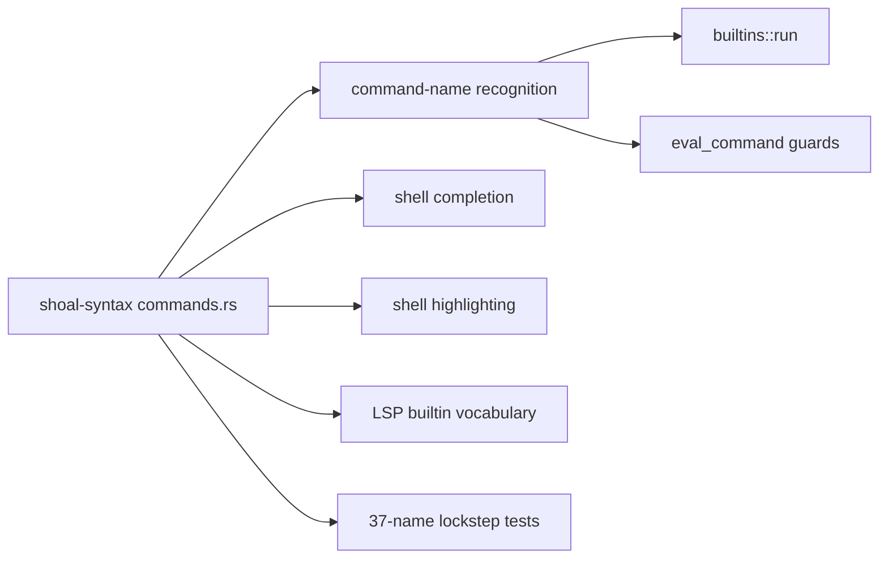
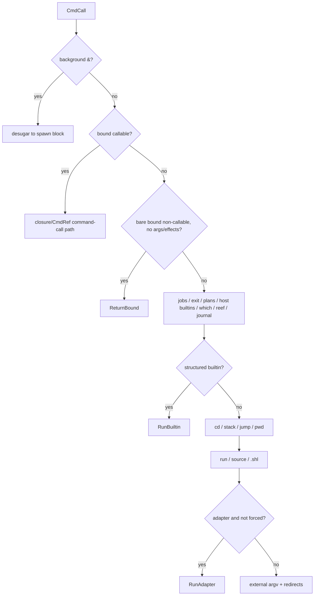

+++
title = "Builtin registry and command dispatch"
description = "The complete builtin inventory, dispatch precedence, typed argument path, structured filesystem commands, special verbs, outcome wrapping, and safe addition workflow."
weight = 35
template = "docs/page.html"

[extra]
group = "Language & runtime"
eyebrow = "Runtime reference"
status = "Canonical builtin inventory"
audience = "Language, evaluator, shell UI, and LSP contributors"
wide = true
+++

Shoal's builtin surface is distributed by behavior but centralized by **name**. The canonical list
lives in `shoal-syntax`, while execution lives across evaluator modules. This split lets syntax-aware
clients share vocabulary without depending on the runtime, but it creates a lockstep obligation
between registry membership and dispatch guards.

Sources: [`commands.rs`](https://github.com/alliecatowo/shoal/blob/main/crates/shoal-syntax/src/commands.rs),
[`builtins.rs`](https://github.com/alliecatowo/shoal/blob/main/crates/shoal-eval/src/builtins.rs),
[`command.rs`](https://github.com/alliecatowo/shoal/blob/main/crates/shoal-eval/src/command.rs), and
[`host.rs`](https://github.com/alliecatowo/shoal/blob/main/crates/shoal-eval/src/host.rs).

## Canonical vocabulary

There are exactly 37 builtin command heads: 14 structured builtins and 23 special heads. The public
`builtin_names()` result is sorted and deduplicated.

### Structured builtins

```text
cat  cp  echo  env  head  ln  ls  mkdir  mv  rm  sleep  stat  touch  which
```

These names are accepted by `is_builtin` and normally route through `builtins::run` and `dispatch`.
`which` is exceptional: normal command dispatch intercepts it earlier to provide Reef-aware output.
Its lower-level structured implementation still exists in `builtins.rs`.

### Special heads

```text
apply  assert  cd  dirs  exit  explain  history  interact  j  jobs  journal
jump  open  plan  popd  pushd  pwd  quit  reef  run  save  source  undo
```

These names are accepted by `is_special_head` and must have explicit handling in `eval_command`.
They cannot route through the pure structured dispatcher because they mutate session state, need
host integration, operate on plans/journals/Reef, or have nonuniform argument semantics.



The registry test pins sortedness, deduplication, exact count, membership helpers, and the fact that
`clear` is not a builtin. `command.rs` has complementary tests that compare dispatch guards with the
special-head registry.

## Command dispatch precedence

`eval_command` is ordered behavior. Earlier branches deliberately shadow later ones:



`^head` bypasses a non-callable binding and adapters, but callable session bindings still resolve.
This makes force syntax a request for command-like resolution, not a blanket ban on Shoal functions.

Adding an early guard changes collision behavior. For example, a newly intercepted name may become
unavailable to adapters or external programs even if the registry and UI look correct.

## Command calls into user functions

When the head resolves to a closure or `CmdRef`, command words become `CallArgs`. Closure parameter
types influence parsing of the word list:

- a declared non-boolean long flag may consume the next word (`--name value`);
- a boolean or unknown flag without a value becomes `true`;
- a `glob` parameter receives the compiled glob rather than expanded matches;
- a non-variadic `list<T>` parameter receives a whole word/glob expansion as one list;
- other words/globs expand normally and are coerced to declared parameter types.

`--help` on a closure synthesizes a signature and documentation string and sends it through the
statement renderer. This behavior is runtime dispatch, not a separate documentation command.

## Structured builtin input pipeline


`DashDash` is ignored by the structured collector after parsing has classified later tokens. Long
and short flags are reduced to names; most builtins use a simple presence test and do not reject
unknown flags. That permissiveness is observable and should be changed only with compatibility tests.

The variadic coercion table is:

| Commands | Coercion applied to each expanded argument |
|---|---|
| `ls`, `cat`, `mkdir`, `touch`, `cp`, `mv`, `rm`, `stat` | `path` |
| `sleep` | `duration` |
| `which`, `env` | `str` |
| `echo`, `head`, `ln` | none at the generic stage |

`head` and `ln` perform their own positional validation. `echo` accepts arbitrary values and renders
strings/paths specially.

## Structured builtin return contract

`builtins/admission.rs` is the transient allocation boundary for structured builtin results.
Builders admit at most 16,384 values and 16 MiB of measured retained state before outcome wrapping;
strings and byte concatenation use the same 16 MiB wall. Breaches raise `builtin_output_limit` with
a hint to narrow or stream the input. Production filesystem adapters must override bounded
directory reads so `ls` enforces the row wall during iteration, not after collecting the directory.

| Head | Key arguments/flags | Raw structured result |
|---|---|---|
| `echo` | any values | one `Str`, joined by spaces |
| `ls` | paths; `-a`/`--all` | sorted `Table` of metadata records |
| `cat` | one or more paths | concatenated `Bytes` |
| `mkdir` | paths; `-p`/`--parents` | `List<Path>` created |
| `touch` | one or more paths | `List<Path>` touched |
| `cp` | sources + destination; recursive flags | `List<Path>` destinations |
| `mv` | sources + destination | `List<Path>` destinations |
| `rm` | paths; recursive/permanent flags | paths or path/trash records |
| `stat` | one or more paths | one `Record`, or `Table` for many |
| `head` | file, optional count default 10 | `List<Str>` |
| `ln` | target + link; `-s`/`--symbolic` | link description `Record` |
| `which` | exactly one name | `Path` or `null` in lower-level implementation |
| `env` | zero or one name | UTF-8 `Record`, one `Str`, or `null` |
| `sleep` | one nonnegative duration/int seconds | `null` after completion/cancellation |

The table describes the raw value before `builtin_outcome`. Normal structured command invocation
returns an `Outcome` whose `parsed` field holds this value.

## Filesystem metadata records

Both `ls` and `stat` rely on `metadata_record`:

| Field | Runtime type | Derivation |
|---|---|---|
| `path` | `Path` | full input/discovered path |
| `name` | `Str` | lossy filename text, suitable for string methods |
| `type` | `Str` | `dir`, `symlink`, `file`, or `other` |
| `size` | `Size` | metadata length |
| `modified` | `DateTime` or `null` | system modification time converted from Unix epoch |

The path retains platform-native path identity while `name` intentionally trades invalid Unicode
bytes for replacement characters. Do not use `name` for round-trip filesystem operations.

`ls` defaults to cwd. Directory entries beginning with `.` are filtered unless all is set. Results
are sorted by their `path` field, giving a deterministic table independent of directory iteration
order.

## Copy, move, removal, and undo

Multiple `cp`/`mv` sources require a directory destination. Copy recurses only with a recursive flag;
move always uses `Fs::rename`. Recursive copy follows the type information exposed by the `Fs` port
and creates destination directories as it descends.

`rm` is nonpermanent by default. It creates a per-process temporary trash directory:

```text
<system temp>/shoal-trash/<pid>/<sequence>-<name>
```

and renames each target there. Its returned records preserve original and trash paths. Permanent
directory removal requires recursive mode. Empty arguments produce `no_matches`, explicitly making
an empty glob safe rather than treating it like an implicit broad deletion.

At the command layer, journaling hooks snapshot overwritten/deleted state before mutations and attach
typed inverses afterward. This is a no-op when no journal entry is active. A new mutating builtin
must be added to the undo pre/post analysis; implementing the filesystem operation alone is not
enough.

## `head`, links, environment, and sleep

`head` reads the entire file through `Fs`, decodes UTF-8 lossily, and returns the first `n` logical
lines. It is structured but not streaming; very large inputs are buffered.

Symbolic `ln` preserves its target argument verbatim so a relative target remains relative to the
link's directory. Hard-link targets are resolved against evaluator cwd. The link name is resolved in
both modes.

`env` enumerates only key/value pairs that both decode as UTF-8. One-name lookup uses the evaluator's
session `process_env`, not a fresh process-wide read. The constructor snapshot and later session
mutations therefore remain authoritative.

`sleep` accepts a duration or nonnegative integer seconds. It polls cancellation at most every 50 ms
rather than sleeping once for the whole interval. Cancellation ends sleep successfully with `null`.

## Special-head behavior ledger

| Head(s) | Owning behavior | Why special |
|---|---|---|
| `jobs` | evaluator task table | reads session task registry |
| `exit`, `quit` | set pending host exit | must not terminate embedded process |
| `plan`, `apply`, `explain` | plan derivation/application | operate on AST and session plan table |
| `interact` | force interactive PTY | temporarily changes execution mode |
| `assert` | raise `assert_failed` | shared command/function form |
| `open` | opener port | detached host integration |
| `save` | value-method write + undo | value-first serialization and journal hook |
| `which` | Reef resolution report | scope/provider aware rather than PATH-only |
| `reef` | scope/lock/provider operations | resolver state and lock persistence |
| `undo` | apply journal inverse | journal transaction semantics |
| `journal`, `history` | journal view | session persistence query |
| `cd` | cwd mutation | oldpwd, frecency, function-body guard |
| `pushd`, `popd`, `dirs` | directory stack | session navigation state |
| `j`, `jump` | frecency navigation | reads/ranks persisted directories |
| `pwd` | cwd projection | session cwd, not process cwd |
| `run` | polyglot/dynamic runner | extension and runtime dispatch |
| `source` | same-evaluator script | lexical/session mutation semantics |

`.shl` command heads are also recognized dynamically even though arbitrary filenames cannot be
enumerated in the static registry. They run in a child evaluator with a fresh lexical scope, unlike
`source`, which evaluates in the current evaluator.

## Host builtins

`interact` saves the current `interactive` flag, forces it true, invokes argv in statement position
with inherited stdin, and restores the flag. Any early-return edit must preserve restoration.

`open` accepts exactly one path/string, resolves it against cwd, and calls the `Opener` port. `save`
accepts `(path, value)`, delegates to the value's `save` method, and surrounds the call with journal
overwrite hooks.

`parallel` evaluates callable arguments first, then spawns one OS thread per callable. Each child
gets a new evaluator populated with captured environment, cwd, process environment, adapters, and
selected ports. It collects values or `Value::Error`; without `settle: true`, it returns the first
error after joining all threads. Despite the name, fail-fast refers to the returned semantics, not
early cancellation of remaining threads.

`retry` requires a positive attempt count and a thunk. It calls sequentially until success, sleeping
the optional positive duration between failures, then returns the last error. Its delay currently
uses direct `thread::sleep`, so cancellation and the evaluator clock port do not govern it.

## Outcome unification

`builtin_outcome` makes structured commands compose like external processes:

| Outcome field | Builtin value |
|---|---|
| `status` | `Some(0)` |
| `signal` | `None` |
| `ok` | `true` |
| `stdout` | rendered bytes from raw structured value |
| `stdout_ref` | `None` |
| `stderr` | empty |
| `dur_ns` | `0` |
| `pid` | `0` |
| `cmd` | builtin head |
| `parsed` | raw structured result |
| `streamed` | `false` |
| `span` | `None` |

`value_bytes` preserves raw bytes, resolves `CasBytes` where possible, adds a newline to strings that
lack one, uses outcome stdout, emits nothing for `null`, and top-renders other values plus newline.
Builtin redirects write these bytes through `Fs`; once an output redirect captures a result, the
command returns `null` so it is not rendered a second time.


## Registry change workflow

To add a command builtin safely:

1. choose structured or special ownership; never add the same name to both lists;
2. add the name in `shoal-syntax/src/commands.rs` and update the pinned count;
3. for a structured builtin, add its dispatch arm, argument coercion rule, typed return contract,
   flags, cancellation behavior, and error spans;
4. for a special head, add an explicit `eval_command` branch and keep registry/guard parity tests
   passing;
5. decide collision behavior with variables, callables, adapters, `^`, Reef tools, and PATH;
6. route effects through ports and apply Leash/spawn gates where execution is involved;
7. wrap structured success in `Outcome` and make redirects work;
8. add journal undo analysis for every mutation;
9. add completion, highlighting, LSP, language docs, and protocol examples through the canonical
   registry rather than duplicate lists;
10. test command position, value position, redirect, pipeline/feed, and noninteractive echo modes.

## Known sharp edges

- `which` exists in the structured table but normal dispatch intercepts it for Reef-aware behavior;
  the two implementations can drift.
- Unknown flags are often collected and ignored by structured builtins.
- `head` buffers the complete file and `cp` recursion is synchronous.
- Default trash is process-temporary, not a durable desktop trash specification.
- `parallel` manually copies evaluator capabilities and currently omits some state such as the config
  port/event bus in the shown host implementation; child inheritance requires continuing audits.
- `retry` delay is neither cancellation-aware nor routed through a sleep/clock capability.
- Builtin outcomes report zero duration and have no invocation span, reducing telemetry fidelity.
- The registry centralizes names, not signatures or help text; behavioral metadata still lives in
  multiple evaluator files.
