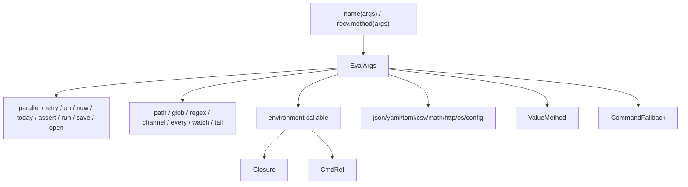
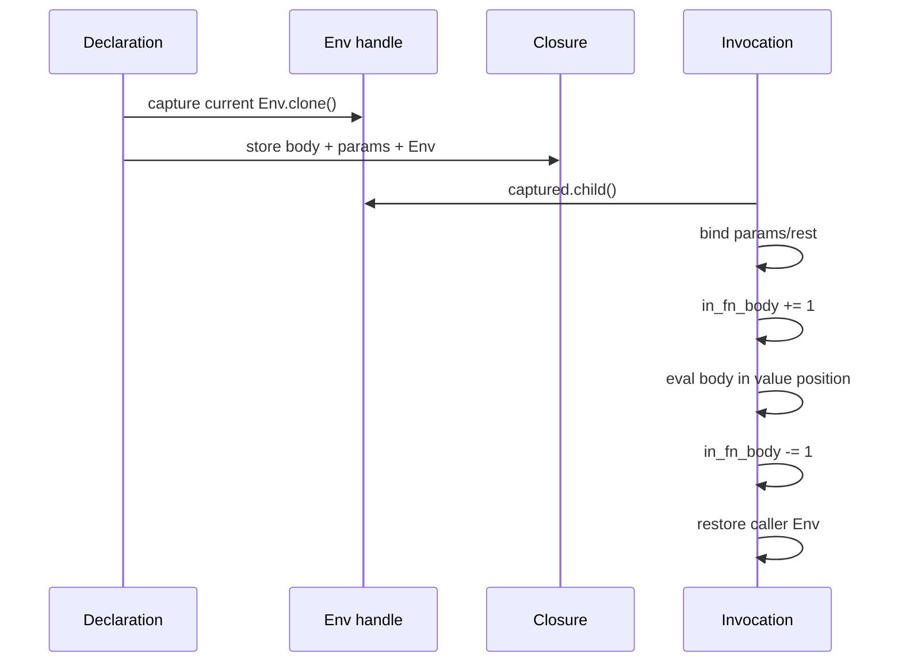
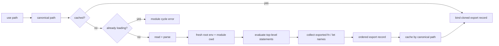

+++
title = "Calls, closures, modules, and namespaces"
description = "Callable dispatch, strict argument binding, closure capture, module evaluation and caching, constructors, and synthetic namespace behavior."
weight = 34
template = "docs/page.html"

[extra]
group = "Language & runtime"
eyebrow = "Runtime book"
status = "Callable and module semantics"
audience = "Language and runtime contributors"
wide = true
+++

Shoal has several callable surfaces that converge only after parsing: user closures, command
references, evaluator-recognized functions, type-like constructors, namespace methods, value
methods, and ordinary commands. Their precedence and argument conversions are language semantics.

Sources: [`call.rs`](https://github.com/alliecatowo/shoal/blob/main/crates/shoal-eval/src/call.rs),
[`modules.rs`](https://github.com/alliecatowo/shoal/blob/main/crates/shoal-eval/src/modules.rs),
[`namespaces.rs`](https://github.com/alliecatowo/shoal/blob/main/crates/shoal-eval/src/namespaces.rs),
and [`env.rs`](https://github.com/alliecatowo/shoal/blob/main/crates/shoal-value/src/env.rs).

## Call surface map



`eval_args` evaluates positional expressions left-to-right, then named argument expressions in
their source order, producing `CallArgs { pos, named }`. Named arguments remain an ordered vector,
not a map. Duplicate-name rejection, if desired, must happen at syntax or binding time; map-like
overwrite behavior should never be assumed.

## Runtime callable values

Only two ordinary `Value` variants are accepted by `call_value_inner`:

| Callable | Stored state | Invocation behavior |
|---|---|---|
| `Closure` | optional name, params, rest, return annotation, body, captured `Env`, docs | creates child of captured env and binds arguments |
| `CmdRef` | structured `CmdCall` | appends call-site arguments/flags, then executes command in value position |

All other values produce `type_error: <type> is not callable`. Constructors and namespace methods
are evaluator dispatch cases, not first-class callable values. Consequently `let f = json.parse`
does not yield a function; namespace functions must be called through their syntactic receiver.

## Recursion guard

`call_value` increments `call_depth`, rejects depth above 10,000 with `recursion_limit`, calls the
inner dispatcher, and decrements afterward. The decrement happens for success and returned
`VResult` errors, but native stack exhaustion can still precede a friendly limit on platforms with
small stacks. The conformance corpus skips a deep-recursion case on a native test thread for this
reason.


## Strict closure binding

Closure calls reject excess positional arguments unless a rest parameter exists. They reject any
named argument whose name is absent from the declared parameter list. For each declared parameter,
binding priority is:

1. a matching named argument;
2. the positional argument at the parameter's declaration index;
3. the parameter's default expression;
4. otherwise `arg_error` for a missing argument.

This means named arguments do not compact the positional list. A positional value at index `i`
targets parameter `i` even if another parameter was supplied by name.


Defaults execute after the evaluator has swapped to `captured_env.child()` and after earlier
parameters have been declared. They can therefore reference earlier parameters and captured
bindings. On binding/coercion failure, the previous evaluator environment is restored before the
error returns.

`list<T>` is special: the evaluator coerces each element through `coerce_list_param`. This applies
to expression calls too, while command-originated typed words may already have been coerced. Scalar
parameter annotations are **not** validated by `call_value_inner` on expression calls. Even on the
command path, `coerce_word` parses strings but passes an already non-string runtime value through, so
an expression-valued argument can bypass a declared scalar type. Return annotations are stored in
the closure but are likewise not enforced. Types are therefore parsing/coercion hints today, not a
sound runtime contract.

The rest parameter receives a `List` of positional values after the fixed parameter count. Named
arguments never flow into rest.

## Closure environment lifecycle



`Env` is an `Arc<Mutex<EnvInner>>`. Cloning an environment shares its bindings; it is not a snapshot.
Each `EnvInner` has a variable map and optional parent. `get` checks the current map, releases the
lock, then walks the parent. `assign` walks to the binding that owns the name and rejects immutable
bindings. `declare` always writes the current scope and replaces any same-scope binding.

The mutex makes environment handles shareable, but it does not make arbitrary evaluator execution
parallel-safe: the `Evaluator` itself remains mutable and closures also rely on its cwd, ports,
command catalog, and other session fields.

## Command references

An alias is stored as a `CmdRef` containing a structured AST command. Calling it clones that command,
converts each positional runtime value to a command argument, and appends named arguments as long
flags. `Bool(true)` becomes a presence flag; every other named value becomes the flag's value.

```text
alias gs = git status
gs(--short: true)       # structured equivalent of git status --short
```

The evaluator then calls ordinary command dispatch in **value position**. The clone is important:
one alias invocation cannot mutate the command used by the next.

## Constructor table

Constructors are recognized by name before ordinary command fallback.

| Name | Accepted input | Result / notes |
|---|---|---|
| `path` | exactly one `str` or `path` | `Path`, with path input cloned |
| `glob` | one pattern string, optional `hidden`/`follow` names | lazy `GlobVal` rooted at current cwd; current implementation stores `hidden` but not `follow` |
| `regex` | exactly one string | compiled `RegexVal` or validation error |
| `channel` | exactly one string | language channel handle record |
| `every` | one nonnegative duration | lazy interval stream |
| `watch` | one path or glob; `recursive` defaults true | filesystem event stream |
| `tail` | one file path; `from_start` defaults false | appended-line stream |

Constructor dispatch returns `Option<Value>` internally: `None` means the name was not a constructor
and resolution continues. An error means the name was recognized but arguments were invalid; it
must not fall through to an external command of the same name.

## Module resolution

`use ./lib/deploy` is resolved relative to the evaluator cwd. If the supplied path has no extension,
the loader tries `<path>.shl` first and the exact path second. It canonicalizes the first existing
candidate and uses that canonical path as both cache key and cycle identity.


Canonicalization means symlink and spelling aliases generally converge on one module identity. It
also means module resolution requires the file to exist and can fail on filesystem permission or
canonicalization errors before evaluation begins.

## Module evaluation lifecycle



The loader resets `in_fn_body` to zero during module top-level evaluation, allowing module setup to
use top-level-only operations. It restores the prior environment, cwd, and function nesting after
success or failure. The module-stack entry is also popped before propagating an evaluation error.

A module is evaluated at most once per evaluator. Its exports value is cloned from the cache on
subsequent `use` statements, and then declared under the canonical file's stem. Caching means changes
to the file are not observed until a new evaluator/session.

## Export model

Only top-level `export fn` and `export let` contribute fields to the exports record. Exported let
patterns are traversed recursively, including list-pattern rest names. Aliases and other statement
forms are not exported by `collect_exports`.

Private declarations remain in the module environment. An exported closure captures that environment
and can continue reading private helpers after the loader restores the caller environment. Exported
plain values are cloned into the record.


There is no module manifest, package identity, explicit import list, re-export mechanism, or cache
invalidation protocol in this layer. Module naming is the file stem, so two files with the same stem
cannot be bound simultaneously in one scope without replacement/shadowing behavior.

## Circular-use diagnostics

Before loading, the canonical path is checked against `module_stack`. A match constructs an error
chain from every stack path plus the repeated path. This is dynamic cycle detection: only the actual
evaluation path matters. Cached modules return before the stack check because completed loads cannot
form an active cycle.

## Synthetic namespaces

Namespaces do not have a runtime `Value` variant. The evaluator recognizes an unbound receiver name
and dispatches directly:

| Namespace | Fields | Methods |
|---|---|---|
| `json` | none | `parse`, `stringify` |
| `yaml` | none | `parse`, `stringify` |
| `toml` | none | `parse`, `stringify` |
| `csv` | none | `parse`, `stringify` |
| `math` | `pi`, `e`, `tau`, `inf`, `nan`, `sqrt2` | numeric functions such as `sqrt`, trig, logs, rounding, `pow`, `min`, `max`, `hypot`, `clamp` |
| `http` | none | `get`, `delete`, `post`, `put` |
| `os` | none | system/session queries and environment operations implemented in `namespaces.rs` |
| `config` | projected keys | `get`, `all` |

An environment binding shadows a namespace. This check is explicit: namespace dispatch occurs only
when `env.get(ns).is_none()`. Field access on a function-only namespace returns a diagnostic telling
the caller to invoke it.


## Data namespace conversions

JSON, YAML, and TOML parsing first deserialize into `serde_json::Value`, then use the shared
`json_to_value` projection. Stringification performs the reverse `value_to_json` projection. That
common bridge means unsupported or lossy runtime types have the same JSON-shaped fallback concerns
across all three formats.

`json.stringify` accepts `pretty` either as a named boolean or second positional `true`. TOML
stringification can reject values which are legal Shoal/JSON but invalid at TOML's top level.

CSV parse treats the first row as headers and returns a `Table`; all fields are strings. CSV
stringify accepts a table, a list of records, or one record. It chooses header order from the first
record and renders non-string cells inline. Missing fields become empty cells, and later-record keys
that were absent from the first record are omitted.

## HTTP namespace limits

HTTP calls are synchronous evaluator effects. The implementation applies a 30-second request timeout
and caps response bodies at 64 MiB before projecting the response. `get` and `delete` do not take a
body; `post` and `put` do. Changes here belong in the effect/security audit because namespace syntax
can otherwise make network access look like a pure method.

## Configuration namespace

The evaluator never walks configuration files on a `config` access. The host injects an already
resolved `ConfigPort`; default construction uses an empty `ConfigSnapshot`. This keeps language
reads consistent with host-applied configuration and makes tests deterministic.

The direct `config.member` form projects one key. `config.get`/`config.all` are method forms. Adding a
host setting requires deciding whether it is intentionally public to language programs and how its
type projects into `Value`; do not expose arbitrary internal configuration serialization by accident.

## Known sharp edges

- Return type annotations are carried by closures but not enforced in the core call path.
- Scalar parameter annotations are not soundly enforced: expression calls skip them and command
  coercion accepts already non-string values without validating the target type.
- Namespace functions are not first-class values.
- `glob(..., follow: ...)` is accepted by constructor validation, but the stored `GlobVal` shown in
  `call.rs` only records `hidden`; contributors should verify the intended follow-symlink contract.
- Module loading uses `Path::is_file` directly during candidate discovery while content reads go
  through the `Fs` port. A fully virtual filesystem cannot currently control the whole operation.
- Module evaluation has a fresh lexical root, not a pure/effect-isolated sandbox.
- Cache lifetime is the evaluator lifetime; no file watcher or content hash invalidates modules.
- Synthetic namespace precedence is hand-coded in expression evaluation. A new access path can omit
  the shadowing rule and create inconsistent behavior.

## Change protocol

For a new call form or namespace member:

1. decide whether it must be first-class; if yes, a synthetic namespace may be the wrong model;
2. place it deliberately in the dispatch precedence and specify user-binding shadow behavior;
3. validate unknown named arguments and excess positionals consistently;
4. use existing coercion functions instead of parsing rendered values ad hoc;
5. route filesystem, process, clock, network, opener, secret, and config work through the correct
   capability boundary;
6. preserve the call-site span and narrower argument spans;
7. test direct use, captured use, module use, and command-name collision;
8. for modules, test cache identity, relative resolution, private capture, and a multi-file cycle;
9. update external language documentation if syntax-visible;
10. update kernel value projection when a newly returned runtime type can reach RPC.
