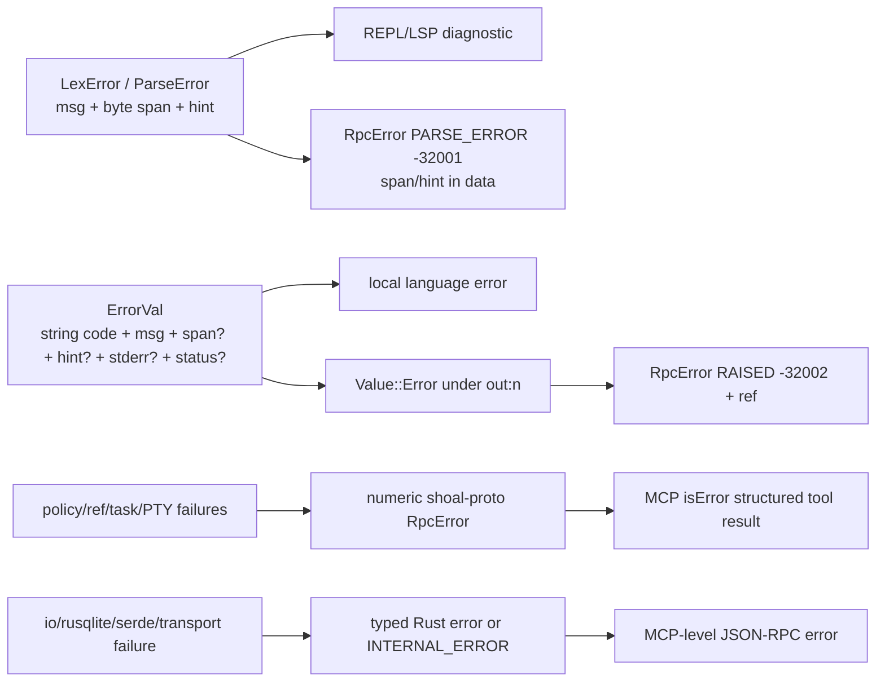

+++
title = "Change map, invariants, and known debt"
description = "A contributor blast-radius guide, layered error model, non-negotiable invariants, and a source-grounded register of current architecture risks and incomplete paths."
weight = 120
template = "docs/page.html"

[extra]
group = "Maintenance"
eyebrow = "Maintainer field guide"
status = "Audit snapshot: 2026-07-16"
audience = "Reviewers and future maintainers"
wide = true
+++

Use this page before a cross-cutting change. It identifies the canonical owner, predictable downstream
consumers, tests that prove the boundary, and places where the implementation is currently incomplete
or internally inconsistent. Findings are statements about the audited source, not a promise that the
same risk remains forever.

## Truth hierarchy

When sources disagree, use this order:

1. current public types, handler branches, and runtime code;
2. executable tests, with the normative conformance corpus deciding language behavior;
3. current internal documentation explaining intent and invariants;
4. historical design prose, comments, README examples, and stale counts.

Comments remain valuable evidence of deliberate choices, but they can describe a planned integration
that Cargo dependencies prove does not exist. Update this atlas in the same change that moves a
boundary.

## Error layers

Shoal has four error spaces. They should be translated at boundaries, not merged into one string.



### Language codes

Pinned core `ErrorVal.code` values are:

```text
parse_error type_error arg_error undefined_var not_found cmd_failed div_zero
index_range field_missing utf8_error stream_consumed no_matches custom
assert_failed permission recursion_limit overflow
```

Extensions include Reef (`reef_unlocked`, `reef_drift`, `reef_conflict`, `reef_not_found`,
`reef_provider`), IO (`feed_error`, `lang_block_unbalanced`, `runner_not_found`), and streams
(`stream_unbounded`). Implementation also uses boundary-specific values such as `io_error`,
`net_error`, and `channel_closed`; any corpus-assertable code must be added to the pinned contract
rather than invented ad hoc at one call site.

`ErrorVal::or_span` preserves the innermost existing span. Higher evaluation layers should add a span
only when the lower layer had none.

### Protocol codes

Numeric codes and meanings are centralized in `shoal-proto::error_code`; see the
[kernel protocol table](../kernel-protocol/#error-taxonomy). Never inline a `-32xxx` literal in a
handler. A language `type_error` is not JSON-RPC `INVALID_PARAMS`: the former is a first-class value
raised while evaluating valid source; the latter means the method call itself was malformed.

## Non-negotiable invariants

### Language and values

- Statement-head dispatch remains deterministic from syntax plus explicit `ParseCtx`.
- Spans are source byte ranges and survive through teaching diagnostics and outcomes.
- Values stay structured until rendering, wire, persistence, or stdin explicitly needs bytes.
- Conditions remain strict; generic truthiness is not introduced through a convenience method.
- Equality does not perform unbounded IO, consume a stream, or await a task.
- Stream consumption is explicit, single-owner, and bounded before collection.
- Paths retain raw OS bytes; display text is never treated as the canonical path encoding.
- Secrets never fall through generic rendering or stdin conversion.

### Execution and authority

- Session `cwd` and environment are evaluator state, never process-global mutations.
- Every new side effect has an `Effect`, plan derivation, policy path, and testable port.
- Approval **must** be bound to exact plan contents, source, session, principal, and an authorized
  approver; the current `cap.request`/plan-ref findings below violate this invariant.
- External children use process groups and bounded cancellation escalation.
- Sandboxing reports what the OS enforced and refuses unmet hermetic requests.
- Reversibility is claimed only with exact, safely replayable evidence.

### Persistence and protocol

- Journal metadata survives output aging and unfinished/crashed execution.
- CAS content is re-hashed on read; truncation is explicit.
- Undo refuses scope escape, symlink parents, stale fingerprints, and partial snapshots.
- Wire responses are bounded and expose a followable ref for elided data.
- Refs are scoped to the owning session/principal rules; dynamic objects are not ambient IDs.
- Subscriber backpressure never blocks publishers or unrelated clients.
- In-memory state is never described as durable across kernel restart.

## Contributor blast-radius matrix

| Change | Start here | Also inspect/update | Proof |
|---|---|---|---|
| new syntax form | `shoal-ast`, `shoal-syntax` parser | formatter, parse status, eval, plan derivation, LSP, highlighter/completer | syntax tests + format round trip + corpus + host parse parity |
| new builtin/verb | syntax builtin registry + `shoal-eval/command` or `builtins` | args/coercion, outcome redirects, effects/reversibility, ports, completion/LSP | corpus + fake-port/effect tests + local/kernel behavior |
| new value kind | `shoal-value::Value` | type name, equality, methods, ops, render, JSON, stdin, plan, kernel wire/elision/path, persistence/MCP | value tests + wire round trips + ref/elision integration |
| new stream operator/source | value stream upstream/operator or eval streams | boundedness, timeout/end/error propagation, tee/backpressure, cancellation, wire limitations | stream integration + slow-consumer/timeout tests |
| process/PTY behavior | `shoal-exec` | evaluator position semantics, Leash sandbox, local job control, kernel PTY, MCP tool | real process/PTY tests on Linux and macOS |
| new effect/grant | `shoal-leash` | static derivation, adapter templates, evaluator port, sandbox lowering, policy docs, kernel approval | allow/ask/deny + hermetic enforcement + fake-port tests |
| core config field | `shoal-config` schema/load/type | CLI REPL and source host assembly, config snapshot, doctor, docs | config loader + `shoal/tests/config_wiring.rs` |
| prompt module | `shoal-prompt` context/config/render | `shoal/src/prompt` gather phase, themes, transient rendering | pure render parity + speed/no-IO test |
| Reef provider/resolution | `shoal-reef` | evaluator resolution/script/which, lock/view/report, host user scope, doctor | temp-tree provider tests + evaluator integration |
| adapter feature | `shoal-adapters` schema | bundled specs, evaluator binding/effects/parser, CLI catalog/completion, interpreter syntax seam | fixture + conflicting-format + representative bytes tests |
| journal schema/CAS | `shoal-journal` | evaluator hooks, kernel coarse rows/replay, history CLI, wire blobs, migration version | prior-schema fixture + integrity/GC/undo + live kernel replay |
| kernel RPC | `shoal-proto` types/errors then kernel router/handler | attachment/session scope, wire bounds, event channel, MCP tool/resource | handler unit + live daemon + live MCP tests |
| MCP surface | `shoal-mcp` tool/resource mapper | kernel method, bounded text/ref, subscription lifecycle | schema unit + live-kernel end-to-end |
| LSP semantic feature | reusable semantic index (new boundary) | parser context, UTF-16 mapping, workspace/document lifecycle | multi-document scope tests; do not extend lexical splitter alone |


## Current architecture debt

### Critical: approval mutation and journal reads bypass attachment

**Evidence:** `Kernel::dispatch` routes both `cap.request` and `journal.query` without passing the
connection's `Attachment`. `handle_cap_request` looks up the process-global plan map by ref and sets
`stored.approved = true` after policy evaluation, but never authenticates or authorizes the caller as
an approver. `handle_journal_query` returns the shared journal without a caller-principal filter.
The protocol comment claiming the complete unattached-method set also omits `journal.query`, so the
comment and router disagree.

**Compounding identity defect:** `Plan::new` derives `plan_ref` from only effects, reversibility, and
estimates, truncated to 16 hex characters. Kernel storage is `HashMap<plan_ref, StoredPlan>`, so
equal-effect plans from different source/session/principal records overwrite one another. Apply does
re-check the currently stored source/session/principal and therefore rejects many confused uses, but
the ref is not a unique owner-scoped plan identity.

**Risk:** a same-user socket client can approve a known or derived non-denied plan without an
approver identity and inspect journal data across token principals. Equal-shape plans can invalidate
or replace each other's stored objects.

**Direction:** require attachment plus an explicit approver/journal-read capability, scope queries,
separate unique stored-object IDs from content fingerprints, and add two-token/two-session collision
tests. Pin the only genuinely public methods in a router test.

### High: session identity is weaker than session naming

**Evidence:** `Kernel::session(name, principal)` uses `principal` only when first creating a named
session. Later principals attaching the same name receive the same evaluator and transcript. The
evaluator journal principal remains the creator's, while coarse exec rows use each current actor.

**Risk:** cross-principal state disclosure/mutation and confused provenance when a name crosses a
trust boundary.

**Direction:** key sessions by an authenticated ownership identity or enforce an explicit ACL at
attach, then migrate journal/transcript scoping and add same-name/two-principal tests.

### High: token administration is a stale startup snapshot

**Evidence:** persistent kernel constructors open `TokenStore` once and retain its in-memory token
vector. The separate `shoal-token` command opens and atomically rewrites the same file, but the kernel
has no reload/watcher/generation check. Token `profile` and `caps` appear in attach output, while
authorization evaluates Leash by `principal`; no handler consumes the cap strings.

**Risk:** external revocation does not stop an already-known bearer until kernel restart, newly
created tokens fail until restart, and operators/clients can mistake descriptive cap strings for
grants. Concurrent management processes can also replace updates from a stale file snapshot.

**Direction:** make the kernel own token mutation or add locked generation-aware reload with an
explicit maximum revocation latency. Define cap/profile values as enforced policy input or rename and
document them as labels. Test create/revoke against a live serving kernel.

### High: the local shell and kernel are divergent composition roots

**Evidence:** the CLI loads layered config, aliases/env, config snapshot, init files, bundled and extra
adapters, prompt, and user Reef scope. Kernel session creation installs journal/frecency/event
forwarding but not those features.

**Risk:** documentation and tests can claim a universal language feature that agents cannot use—or
agents can observe defaults different from humans.

**Direction:** extract a host-neutral evaluator builder with explicit profiles, then make deliberate
differences data rather than copy/pasted setup.

### High: policy and OS containment have sharp trust assumptions

**Evidence:** malformed user Leash policy falls back to permissive in the convenience local loader;
network grants are plan-only because no network backend exists; executable hash pinning has a
preflight TOCTOU gap.

**Risk:** a caller can mistake a parsed policy or “hermetic” label for stronger enforcement than the
host actually supplies.

**Direction:** require an explicit fail-open/fail-closed loader mode by host, surface enforcement
dimensions in every relevant attach/plan result, and keep hermetic refusal tests for unsupported
network/spawn guarantees.

### Medium-high: parser context parity is incomplete

**Evidence:** the local REPL parses with current evaluator bindings; kernel exec uses the context-free
parse entry point per request.

**Risk:** a session binding at statement head can be classified differently across local source and
multi-request kernel execution.

**Direction:** expose a read-only evaluator parse snapshot or move binding-neutral disambiguation into
a shared post-parse dispatch, with exact host-parity cases.

### Medium-high: MCP unsubscribe does not own subscription lifetime

**Evidence:** subscribe spawns a dedicated connection/thread; the facade stores no handle; MCP
`resources/unsubscribe` immediately acknowledges without signalling that worker.

**Risk:** subscriptions and threads persist until connection/process termination, violating client
expectations and scaling poorly across repeated subscribe/unsubscribe cycles.

**Direction:** registry keyed by subscription URI/client request, cancellation token plus join/close,
and an end-to-end test that publication stops after unsubscribe.

### Medium-high: dual kernel journal granularity is easy to misquery

**Evidence:** each RPC run appends a coarse entry while the evaluator writes per-top-level-statement
entries to the same store; the event index tracks only coarse IDs.

**Risk:** counts, “latest” logic, principal attribution, and history UI can double-count or mix row
kinds without a schema discriminator.

**Direction:** add an entry kind/parent-exec relation or choose one canonical lifecycle. Return IDs
directly instead of inferring latest rows.

### Medium: incomplete stream, task, PTY, and WASM paths

These are four separate, explicitly unimplemented surfaces:

| Gap | Source evidence | Architectural work required |
|---|---|---|
| stream → process stdin | `feed_bytes(Value::Stream)` returns a type error | bounded backpressure/cancellation-aware producer-to-child pipe |
| wire stream chunks | `WireValue::Stream` carries a label, no pull method | cursor/ref protocol with item/error/end, budgets, ownership and cancellation |
| language EventBus live backpressure | replay ring is capped at 1,024, but live subscribers use unbounded queues and are cloned/sent under the bus mutex | bounded subscriber queues, explicit overflow/gap markers, and shorter publish critical section |
| child evaluator authority escape | spawn/parallel/on/.shl children omit parent Leash and broadly omit Reef; some omit ConfigPort | one capability-complete child constructor plus inheritance tests at every site |
| incomplete filesystem port | direct path metadata/canonicalize/exists/OpenOptions/watch calls coexist with injected `Fs` | expand capability traits and prohibit direct host path access in evaluator/value effect paths |
| method metadata/dispatch parity | sequence metadata advertises table/range `.get` that dispatch rejects; bool omits valid `.str`/`.display` | generate receiver metadata from executable dispatch tests or pin bidirectional parity fixtures |
| function type soundness | scalar parameter and return annotations are not consistently enforced; non-string command arguments can bypass coercion | one runtime validator shared by expression/command calls plus return checking and conformance cases |
| kernel task suspend/resume | handlers return `TASK_CONTROL_UNAVAILABLE` | task runtime that can identify/control owned child groups, or remove verbs |
| WASM evaluation | `shoal-wasm` has no eval/host dependency or invocation API | effect-scoped host ABI, component lifecycle, value/wire conversion, limits |
| WASM deadline | `shoal_wasm::Limits` has fuel/memory/table/instance ceilings but no wall-clock timeout | host deadline/interruption design and tests before claiming timeout confinement |
| Reef runner/options-only scope | scope discovery ignores manifests whose `tools` map is empty | decide whether non-tool Reef configuration constitutes a scope; add discovery tests |
| companion state-root parity | `shoal-history` and doctor defaults use XDG data while evaluator/kernel use XDG state | one shared root resolver or mandatory explicit state-dir plumbing |

PTY change subscription is also absent; MCP callers poll rendered screens. Do not paper over these
gaps with eager materialization or background threads without a lifecycle protocol.

### Medium: memory-only kernel state has no recovery story

Sessions, live transcript values, plans/approvals, tasks, PTYs, event rings, and subscriber state are
lost at restart. Journal and CAS remain, but identity-bearing values cannot simply be deserialized.
A recovery design should explicitly classify reconstructible summaries, immutable CAS data, and
non-recoverable live objects rather than imply full session durability.

### Medium: lock poisoning and thread-per-subscription scaling

Long-lived kernel state uses many `Mutex::lock().unwrap()` sites. A panic while holding a shared lock
can poison it and cascade through later requests. Every event subscription adds a blocking writer
thread; MCP adds another forwarding connection/thread. First remove panic sources inside critical
sections and add stress/lock-order tests; then consider a supervised task/executor model if scaling
needs justify it.

### Medium: frame caps are checked after allocation

Kernel and MCP readers accumulate a full line with `read_line` before applying the 16 MiB check. A
hostile peer can grow memory with a newline-free frame. Use a bounded `fill_buf`/`take` loop that
drains or closes once the cap is crossed, and test partial frames plus multiple valid frames.

### Medium: spill pins lack automatic release

Evaluator spill adoption pins CAS blobs, but no evaluator/session/value-drop path unpins them. Manual
history CLI operations can unpin. Model pins as named leases/owners or persist ref counts so live
values stay safe without permanent growth.

### Medium: Reef discovery and identity can hide changes

Normal scope discovery silently skips malformed/unreadable manifests. Hash caching keys on file
identity metadata rather than content every time. Together these favor speed/best-effort operation
over conspicuous failure. Record discovery diagnostics and make strict script/agent mode surface
them; harden cache identity without hashing every executable on every prompt render.

### Medium-low: schema fields exist without runtime wiring

Core config accepts `render.width`, `kernel.*`, `journal.*`, and `leash.policy` without corresponding
host behavior. Its typed `prompt.template` field is also not passed through, but the rich prompt
loader independently rereads legacy `template` from system/user and cwd-local prompt files and
migrates it to `format.left`. Preserve that compatibility while unifying discovery: core config uses
one nearest ancestor `.shoal.toml`, whereas rich prompt currently checks only `cwd/.shoal.toml`.

### Medium-low: duplicated classifications invite drift

- parser interpreter block names are static while adapters declare an interpreter class;
- completer and highlighter reimplement parser/dispatch context heuristics;
- LSP declarations are token-split rather than semantically indexed;
- prompt config and core prompt fields are separate;
- two conformance harnesses duplicate schema/fixture behavior.

Prefer leaf-owned registries, explicit context snapshots, and shared test-support crates. Do not
solve drift by introducing dependency cycles.

### Low but concrete maintenance debt

- `shoal-history::entry` scans all journal rows instead of `entries_by_id`.
- Fuzz targets are shallow and their CI build is allowed to fail.
- Color/highlighter tests inherit ambient `NO_COLOR` while asserting ANSI output.
- Workspace lints are declared but member crates do not inherit them.
- A `JobsSnapshot` comment says suspended is always zero while implementation counts suspended
  tasks; code is authoritative, but misleading comments make future regressions likely.
- Some historical root-doc counts and feature-status claims are stale relative to source and the
  1,310-case corpus.

## Prioritization map


The coordinates are qualitative triage, not measured project estimates. Re-rank them against the
next product goal, but preserve the dependency ordering: identity and host parity should be resolved
before layering more agent-visible features over ambiguous sessions.

## Architecture review template

For a substantial change, record these answers in the PR:

1. What is the canonical owning crate and why?
2. Which local shell, script, kernel, MCP, and LSP paths observe the behavior?
3. Which state lifetime changes: expression, evaluator, connection, session, process, or disk?
4. Which value/effect/error/wire/schema contracts change?
5. What remains bounded under large input, slow consumers, cancellation, and restart?
6. What authority is required, what the OS enforces, and what remains advisory?
7. How is non-UTF-8 data preserved?
8. What proves behavior at the lowest invariant layer and at the live host boundary?
9. Which atlas diagrams/tables are now stale?
