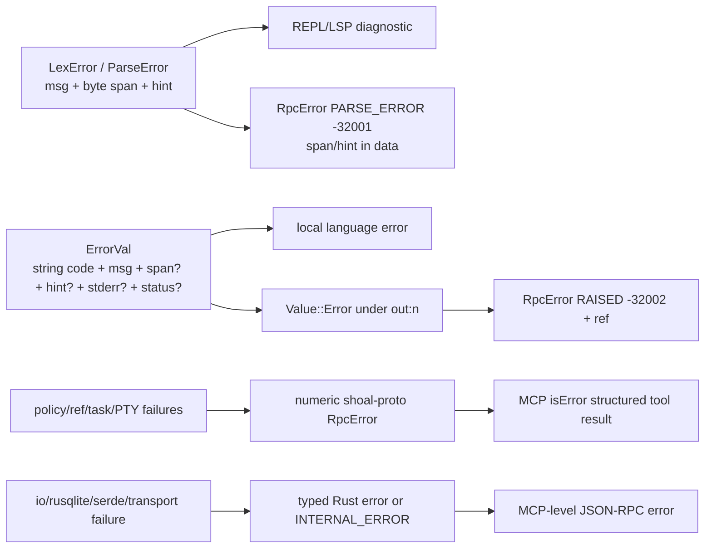

+++
title = "Change map, invariants, and known debt"
description = "A contributor blast-radius guide, layered error model, non-negotiable invariants, and a source-grounded register of current architecture risks and incomplete paths."
weight = 120
template = "docs/page.html"

[extra]
group = "Maintenance"
eyebrow = "Maintainer field guide"
status = "Audit snapshot: 2026-07-16"
audience = "Reviewers and future maintainers"
wide = true
+++

Use this page before a cross-cutting change. It identifies the canonical owner, predictable downstream
consumers, tests that prove the boundary, and places where the implementation is currently incomplete
or internally inconsistent. Findings are statements about the audited source, not a promise that the
same risk remains forever.

## Truth hierarchy

When sources disagree, use this order:

1. current public types, handler branches, and runtime code;
2. executable tests, with the normative conformance corpus deciding language behavior;
3. current internal documentation explaining intent and invariants;
4. historical design prose, comments, README examples, and stale counts.

Comments remain valuable evidence of deliberate choices, but they can describe a planned integration
that Cargo dependencies prove does not exist. Update this atlas in the same change that moves a
boundary.

## Error layers

Shoal has four error spaces. They should be translated at boundaries, not merged into one string.



### Language codes

Pinned core `ErrorVal.code` values are:

```text
parse_error type_error arg_error undefined_var not_found cmd_failed div_zero
index_range field_missing utf8_error stream_consumed no_matches custom
assert_failed permission recursion_limit overflow
```

Extensions include Reef (`reef_unlocked`, `reef_drift`, `reef_conflict`, `reef_not_found`,
`reef_provider`), IO (`feed_error`, `lang_block_unbalanced`, `runner_not_found`), and streams
(`stream_unbounded`, `channel_closed`, `channel_poisoned`, `channel_name_limit`,
`channel_registry_limit`, `channel_subscriber_limit`, `channel_payload_limit`, and
`channel_payload_type`), and journal integrity (`journal_begin_failed`,
`journal_commit_indeterminate`, `journal_read_failed`). Implementation also uses boundary-specific
values such as `io_error` and `net_error`; any corpus-assertable code must be added to the pinned
contract rather than invented ad hoc at one call site.

`ErrorVal::or_span` preserves the innermost existing span. Higher evaluation layers should add a span
only when the lower layer had none.

### Protocol codes

Numeric codes and meanings are centralized in `shoal-proto::error_code`; see the
[kernel protocol table](../kernel-protocol/#error-taxonomy). Never inline a `-32xxx` literal in a
handler. A language `type_error` is not JSON-RPC `INVALID_PARAMS`: the former is a first-class value
raised while evaluating valid source; the latter means the method call itself was malformed.

## Non-negotiable invariants

### Language and values

- Statement-head dispatch remains deterministic from syntax plus explicit `ParseCtx`.
- Spans are source byte ranges and survive through teaching diagnostics and outcomes.
- Values stay structured until rendering, wire, persistence, or stdin explicitly needs bytes.
- Conditions remain strict; generic truthiness is not introduced through a convenience method.
- Equality does not perform unbounded IO, consume a stream, or await a task.
- Stream consumption is explicit, single-owner, and bounded before collection.
- Paths retain raw OS bytes; display text is never treated as the canonical path encoding.
- Secrets never fall through generic rendering or stdin conversion.

### Execution and authority

- Session `cwd` and environment are evaluator state, never process-global mutations.
- Every new side effect has an `Effect`, plan derivation, policy path, and testable port.
- Approval **must** be bound to exact plan contents, source, session, principal, and an authorized
  approver; the current `cap.request`/plan-ref findings below violate this invariant.
- External children use process groups and bounded cancellation escalation.
- Sandboxing reports what the OS enforced and refuses unmet hermetic requests.
- Reversibility is claimed only with exact, safely replayable evidence.

### Persistence and protocol

- Journal metadata survives output aging and unfinished/crashed execution.
- CAS content is re-hashed on read; truncation is explicit.
- Undo refuses scope escape, symlink parents, stale fingerprints, and partial snapshots.
- Wire responses are bounded and expose a followable ref for elided data.
- Refs are scoped to the owning session/principal rules; dynamic objects are not ambient IDs.
- Subscriber backpressure never blocks publishers or unrelated clients.
- In-memory state is never described as durable across kernel restart.

## Contributor blast-radius matrix

| Change | Start here | Also inspect/update | Proof |
|---|---|---|---|
| new syntax form | `shoal-ast`, `shoal-syntax` parser | formatter, parse status, eval, plan derivation, LSP, highlighter/completer | syntax tests + format round trip + corpus + host parse parity |
| new builtin/verb | syntax builtin registry + `shoal-eval/command` or `builtins` | args/coercion, outcome redirects, effects/reversibility, ports, completion/LSP | corpus + fake-port/effect tests + local/kernel behavior |
| new value kind | `shoal-value::Value` | type name, equality, methods, ops, render, JSON, stdin, plan, kernel wire/elision/path, persistence/MCP | value tests + wire round trips + ref/elision integration |
| new stream operator/source | value stream upstream/operator or eval streams | boundedness, timeout/end/error propagation, tee/backpressure, cancellation, wire limitations | stream integration + slow-consumer/timeout tests |
| process/PTY behavior | `shoal-exec` | evaluator position semantics, Leash sandbox, local job control, kernel PTY, MCP tool | real process/PTY tests on Linux and macOS |
| new effect/grant | `shoal-leash` | static derivation, adapter templates, evaluator port, sandbox lowering, policy docs, kernel approval | allow/ask/deny + hermetic enforcement + fake-port tests |
| core config field | `shoal-config` schema/load/type | CLI REPL and source host assembly, config snapshot, doctor, docs | config loader + `shoal/tests/config_wiring.rs` |
| prompt module | `shoal-prompt` context/config/render | `shoal/src/prompt` gather phase, themes, transient rendering | pure render parity + speed/no-IO test |
| Reef provider/resolution | `shoal-reef` | evaluator resolution/script/which, lock/view/report, host user scope, doctor | temp-tree provider tests + evaluator integration |
| adapter feature | `shoal-adapters` schema | bundled specs, evaluator binding/effects/parser, CLI catalog/completion, interpreter syntax seam | fixture + conflicting-format + representative bytes tests |
| journal schema/CAS | `shoal-journal` | evaluator hooks, kernel coarse rows/replay, history CLI, wire blobs, migration version | prior-schema fixture + integrity/GC/undo + live kernel replay |
| kernel RPC | `shoal-proto` types/errors then kernel router/handler | attachment/session scope, wire bounds, event channel, MCP tool/resource | handler unit + live daemon + live MCP tests |
| MCP surface | `shoal-mcp` tool/resource mapper | kernel method, bounded text/ref, subscription lifecycle | schema unit + live-kernel end-to-end |
| LSP semantic feature | reusable semantic index (new boundary) | parser context, UTF-16 mapping, workspace/document lifecycle | multi-document scope tests; do not extend lexical splitter alone |


## Current architecture debt

### Closed hardening boundaries that must remain invariant

The former approval, journal, plan-identity, named-session, and token-snapshot defects are closed:

- every stateful handler uses an attachment; journal reads force the attachment's exact owner;
- approval reserves a one-shot transition, durably audits it before publication, and binds the
  consuming execution;
- plan ids bind full source/AST/effects/Session/principal content plus a unique object suffix;
- session identity is `(principal, visible Session name)`, with matching exact-owner refs and quotas;
- token operations use shared/exclusive fd locks and fresh disk reads, while attached requests
  revalidate live and fail closed on revocation, expiry, or store failure.

Regression work belongs in collision, concurrency, audit-failure, and live-revocation tests. Token
`profile` and `caps` remain descriptive attach metadata: principal Leash policy and explicit handler
checks are the authorization boundary.

### Resolved: shared evaluator composition with enforced surface profiles

**Resolution:** `shoal-host::SessionBootstrap` applies layered config, aliases/environment, config
snapshot, bundled/configured adapters, WebAssembly plugins, Reef inputs, echo, and configured policy
to noninteractive, standalone-interactive, private-kernel, and durable-kernel evaluators.

`Surface` makes deliberate differences data. Init files run only for `Interactive`; the API itself
no-ops for other profiles. Only an inherited private-human transport with a real TTY may select that
profile, so the default private REPL gets init while public/bearer/MCP agent Sessions cannot execute
terminal startup code. Prompt/editor/history UI remains correctly owned by the CLI.

**Proof:** host tests apply the same env, aliases, and configured adapter directories across all
profiles and pin the init omission. Real daemon tests prove private interactive init execution and
durable public-kernel omission of a configured malformed init file.

### Resolved: policy and OS containment report sharp trust assumptions

**Resolution:** a present malformed user Leash policy enters explicit deny-all quarantine (only a
genuinely missing convenience policy keeps the local permissive default). `session.attach` and
`exec mode=plan` now return one typed enforcement preview: available tier, deferred activation,
filesystem request/enforceability, network scope/backend status, spawn-pin atomicity, hermetic
intent/disposition, and stable limitation labels.

Hermetic filesystem scopes that resolve to no usable root are retained and refused before target
spawn instead of disappearing. Hermetic principal network allowlists refuse because no network
backend exists, and hermetic spawn pins refuse because hash-before-exec remains TOCTOU-prone.
Nonhermetic callers retain compatible best-effort behavior with the limitation surfaced.

**Proof:** policy and exec tests cover unresolved scopes plus direct unsupported network/identity
requests; evaluator integrations drive both configured hermetic limitations through a real external
command path. Kernel coverage requires attach and plan previews to be identical, protocol
deserialization keeps older plan results compatible, and the kernel composition-root ceiling forced
the forecast into its own module rather than growing `lib.rs`.

### Resolved: evaluator-owned parser-context parity

**Resolution:** `Evaluator::parse_context` is the single read-only snapshot of value-bound and
callable names. The standalone REPL and both kernel `exec` plan/run paths call it immediately before
`parse_with_ctx`; the kernel holds the evaluator lock from snapshot through evaluation.

**Proof:** a real two-request kernel test defines a value, then plans and runs a later expression
whose head would be an external command under context-free parsing. Local classification tests cover
value/callable partitioning, and structural guards prohibit either host from rebuilding the scan.

The public `parse` and completion endpoints remain intentionally context-free because they do not
name an attached evaluator session; that is an explicit API distinction, not exec-host drift.

### Medium-high: MCP subscriptions retain a thread-per-URI cost

**Evidence:** each subscribe stores a dedicated connection/thread in the facade's URI-keyed worker
registry. `resources/unsubscribe` removes the worker, shuts down its socket, and joins the thread.

**Risk:** lifecycle ownership is now correct, but many simultaneously active URIs still scale as one
kernel connection plus one forwarding thread each.

**Direction:** retain the tested unsubscribe ownership invariant; introduce multiplexing or a bounded
executor only if measured active-subscription scale justifies the protocol change.

### Resolved: explicit dual journal granularity and execution identity

**Resolution:** schema v2 stores an explicit `statement|exec|approval` kind and nullable parent exec
ID. Kernel statement rows name their coarse execution, journal-channel queries filter `kind=exec`,
and both kernel and standalone REPL consume the evaluator's exact completed entry ID directly.

**Proof:** v1 and legacy-v0 migration fixtures preserve data and classify old producer shapes;
round-trip/query tests cover kind and parent; event tests prove JSON shape cannot enroll a statement
or exclude an exec; kernel multi-statement/restart tests verify exact parentage and replay counts.

**Remaining evolution:** historical parent IDs are honestly null because they cannot be reconstructed;
statement ordinals and host vocabulary can be added if a concrete query needs them.

### Medium: WASM ABI evolution

The remaining plugin surface is evolutionary rather than a missing execution path:

| Gap | Source evidence | Architectural work required |
|---|---|---|
| WASM ABI evolution | preview ABI v1 is integrated with declared+authorized hostcalls and bounded values | keep new hostcalls effect-scoped, versioned, cancellable, and adversarially tested |

Compilation admission is now closed as a concurrency-amplification gap: at most two component
compilers run process-wide, callers wait at most a configured two seconds by default (with an
immutable ten-second ceiling), and Wasmtime's optional parallel-compilation feature is disabled.
The admitted compiler remains synchronous and cannot be epoch-interrupted; hard per-compilation
preemption would require an isolated compiler process or trusted precompiled artifacts.

Reef's shipped provider subprocess gap is also closed. Evaluator version probes and `mise install`
receive an injected bounded runner carrying the session environment, cancellation epoch, and Leash
filesystem sandbox. A requested provider sandbox is fail-closed when OS enforcement is unavailable;
probe/install wall time and retained output are bounded. Third-party in-process `Provider`
implementations remain trusted host code, as do all Rust trait implementations injected by a host.

PTY change subscription is also absent; MCP callers poll rendered screens. Do not paper over these
gaps with eager materialization or background threads without a lifecycle protocol.

### Medium: memory-only kernel state has no recovery story

Sessions, live transcript values, plans/approvals, tasks, PTYs, event rings, and subscriber state are
lost at restart. Journal and CAS remain, but identity-bearing values cannot simply be deserialized.
A recovery design should explicitly classify reconstructible summaries, immutable CAS data, and
non-recoverable live objects rather than imply full session durability.

### Medium: thread-per-subscription scaling

Kernel subscription queues and writes are bounded, MCP unsubscribe owns and joins its worker, and
poison-sensitive state now has explicit recovery or quarantine policy. The remaining cost is
structural: each kernel event subscription adds a blocking writer thread and each MCP subscription
adds another forwarding connection/thread. Consider multiplexing or a bounded executor if measured
scale requires it; preserve slow-consumer isolation and exact lifecycle cleanup.

### Resolved: spill pins have automatic multi-owner release

Evaluator spill adoption now atomically increments a `(hash, owner)` refcount and returns a guard
owned by the lazy `CasBytes` loader. The final value clone drops the guard and releases its row;
identical content leased by another journal owner remains protected. Permanent history pins stay in
their existing operator-managed table and cannot impersonate or remove a live lease.

Each owner holds an exclusive per-owner lockfile through an `Arc` shared by its journal handle and
value guards. Applied GC treats a missing/acquirable owner lock as crash-stale, deletes those lease
rows inside its candidate-selection transaction, then evaluates retention. Tests cover same-owner
refcounts, two independent owners, evaluator-outliving values, last-value release, and stale-owner
recovery.

### Medium: Reef discovery and identity can hide changes

Normal scope discovery silently skips malformed/unreadable manifests. Hash caching keys on file
identity metadata rather than content every time. Together these favor speed/best-effort operation
over conspicuous failure. Record discovery diagnostics and make strict script/agent mode surface
them; harden cache identity without hashing every executable on every prompt render.

### Medium-low: configuration discovery still has two prompt paths

The shared host bootstrap now consumes render width/color/echo, kernel mode/session, journal
enablement/state root, Leash policy, adapters, plugins, Reef, aliases, and environment. The remaining
split is prompt-specific: the rich prompt loader independently rereads legacy `template` from
system/user and cwd-local prompt files and migrates it to `format.left`. Preserve that compatibility
while converging discovery; core config uses one nearest ancestor `.shoal.toml`, whereas rich prompt
currently checks only `cwd/.shoal.toml`.

### Medium-low: duplicated classifications invite drift

- parser interpreter block names are static while adapters declare an interpreter class;
- completer and highlighter reimplement parser/dispatch context heuristics;
- LSP declarations are token-split rather than semantically indexed;
- prompt config and core prompt fields are separate;
- two conformance harnesses duplicate schema/fixture behavior.

Prefer leaf-owned registries, explicit context snapshots, and shared test-support crates. Do not
solve drift by introducing dependency cycles.

### Low but concrete maintenance debt

- Fuzz targets are shallow; PR compilation is blocking and scheduled runtime fuzzing is the
  behavioral gate.
- Color/highlighter tests isolate ambient `NO_COLOR` while asserting ANSI output.
- Workspace lints are declared at the root and every member crate inherits them with
  `[lints] workspace = true`.
- Historical root-doc counts must remain explicitly dated relative to the current 1,355-case corpus.

## Prioritization map


The coordinates are qualitative triage, not measured project estimates. Re-rank them against the
next product goal, but preserve the dependency ordering: identity and host parity should be resolved
before layering more agent-visible features over ambiguous sessions.

## Architecture review template

For a substantial change, record these answers in the PR:

1. What is the canonical owning crate and why?
2. Which local shell, script, kernel, MCP, and LSP paths observe the behavior?
3. Which state lifetime changes: expression, evaluator, connection, session, process, or disk?
4. Which value/effect/error/wire/schema contracts change?
5. What remains bounded under large input, slow consumers, cancellation, and restart?
6. What authority is required, what the OS enforces, and what remains advisory?
7. How is non-UTF-8 data preserved?
8. What proves behavior at the lowest invariant layer and at the live host boundary?
9. Which atlas diagrams/tables are now stale?
