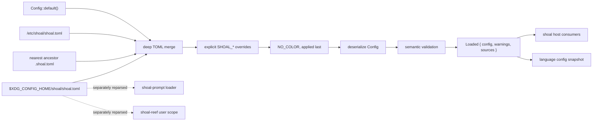
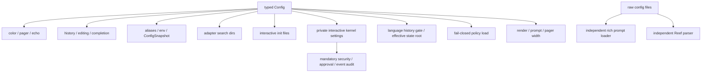

+++
title = "Configuration reference and wiring audit"
description = "The exact shoal-config schema, layer and environment precedence, validation behavior, host consumers, and settings that are currently inert."
weight = 91
template = "docs/page.html"

[extra]
group = "Storage & tooling"
eyebrow = "Configuration architecture"
status = "Source-derived reference with wiring gaps"
audience = "Host, configuration, prompt, and integration contributors"
wide = true
+++

Configuration is not one thing in Shoal. The repository currently has a typed core configuration,
a richer prompt-specific configuration loader, Reef's own manifest parser, adapter manifests, and
several environment-only controls. This chapter describes the typed `shoal-config` path exactly and
then shows where another subsystem deliberately—or accidentally—takes a different path.

The most important rule is therefore:

> A field being accepted by `shoal-config` does not by itself prove that a running host consumes it.

The source of truth for schema and merging is
[`shoal-config`](https://github.com/alliecatowo/shoal/tree/main/crates/shoal-config/src). The source of
truth for local-shell wiring is
[`shoal/src/main.rs`](https://github.com/alliecatowo/shoal/blob/main/crates/shoal/src/main.rs) and
[`shoal/src/repl.rs`](https://github.com/alliecatowo/shoal/blob/main/crates/shoal/src/repl.rs).

## Configuration dataflow



There are three different kinds of output:

- `Loaded.config` is the complete typed value after defaults, files, environment, and validation;
- `Loaded.warnings` contains unknown-key diagnostics collected per file layer;
- `Loaded.sources` lists only file paths that existed and were successfully merged, from lowest to
  highest precedence. Environment is not represented as a source path.

Malformed TOML, filesystem errors other than not-found, type mismatches, malformed environment
values, unsupported versions, and invalid semantic values are hard errors. Unknown keys are
warnings; they are not silently treated as valid future fields.

Each layered file is a regular-file control-plane input capped at 1 MiB and 64 levels of TOML
bracket/inline-table nesting. Reads retain at most the limit plus one sentinel byte, so a sparse file
or a file that grows during startup cannot force an unbounded allocation before rejection. Files
must be UTF-8; symlinks to regular files remain supported. Each recognized string environment
override is capped at 64 KiB before it is copied into the merged TOML tree.

## Discovery and precedence

`LoadOptions::discover(cwd)` proposes these layers, in ascending precedence:

| Rank | Layer | Location or rule | Missing behavior |
|---:|---|---|---|
| 0 | built-in defaults | `Config::default()` | always present |
| 1 | system | `/etc/shoal/shoal.toml` | skipped |
| 2 | user | `$XDG_CONFIG_HOME/shoal/shoal.toml`; otherwise `$HOME/.config/shoal/shoal.toml` | skipped |
| 3 | project | first `.shoal.toml` found from `cwd` upward | omitted when none exists |
| 4 | environment | explicit static `SHOAL_*` table | only recognized names participate |
| 5 | color veto | presence of `NO_COLOR` | forces `render.color = false` |

Project discovery stops at the **first** matching ancestor. It does not combine every ancestor
`.shoal.toml`, and it does not stop at a Git root or home-directory boundary. For a working
directory `/a/b/c`, the search is `/a/b/c/.shoal.toml`, `/a/b/.shoal.toml`,
`/a/.shoal.toml`, then `/.shoal.toml`. This differs from Reef's multi-scope tool chain and from the
prompt loader's current-directory-only project prompt layer.


### Merge semantics

Tables merge recursively, key by key. A later scalar or array replaces the earlier value in full.
There is no deletion marker and no array concatenation.

```toml
# system
[history]
enabled = false
max_entries = 5000

# user
[history]
max_entries = 20000
```

The result keeps `history.enabled = false` and sets `history.max_entries = 20000`. In contrast, a
later `history.ignore = ["secret *"]` replaces the whole earlier ignore array.

Each file is schema-checked before merging. A wrong type in a lower-precedence file is therefore an
error even when a later layer would have replaced it. This produces local, source-attributed errors
instead of permitting a malformed layer to be hidden.

## Complete typed schema

The following is the exact public `Config` tree. “Default” means the value produced by
`Config::default()` before any layer is read.

| Path | Type | Default | Intended meaning |
|---|---|---|---|
| `version` | unsigned integer | `1` | schema version; only version 1 is accepted |
| `prompt.template` | string | `"{cwd}"` | legacy/simple prompt template, migrated by the rich loader |
| `history.enabled` | boolean | `true` | enable interactive persistent line history |
| `history.max_entries` | unsigned integer | `10000` | file-backed history capacity |
| `history.path` | optional path string | absent | host-selected state path when absent |
| `history.dedup` | boolean | `true` | exclude an entry identical to its immediate predecessor |
| `history.ignore` | string array | empty | host-matched exclusion patterns |
| `history.ignore_space` | boolean | `true` | exclude lines beginning with a space |
| `render.width` | optional positive integer | absent | output/prompt/pager width override; absent follows the live terminal |
| `render.color` | boolean | `true` | ANSI color permission |
| `render.paging` | string enum | `"never"` | `never` or interactive `auto` paging |
| `render.pager` | optional string | absent | explicit pager command |
| `render.echo` | optional string enum | absent | `quiet`, `commands`, or `all` |
| `editor.mode` | string enum | `"emacs"` | `emacs` or `vi` Reedline edit mode |
| `editor.bracketed_paste` | boolean | `true` | enable bracketed-paste handling |
| `editor.keybindings` | string map | empty | chord to action overrides |
| `kernel.enabled` | boolean | `true` | intended resident-kernel gate |
| `kernel.session` | string | `"default"` | intended named kernel session |
| `adapters.dirs` | path-string array | empty | extra adapter directories, in order |
| `journal.enabled` | boolean | `true` | language-facing statement history/undo gate; never disables mandatory kernel security audit |
| `journal.state_dir` | optional path string | absent | local language journal/jump and embedded-kernel state root |
| `leash.policy` | optional path string | absent | intended Leash policy file |
| `init.files` | path-string array | empty | interactive startup scripts, in order |
| `completion.fuzzy` | boolean | `true` | enable fuzzy ranking |
| `completion.case_insensitive` | boolean | `true` | fold case while matching |
| `completion.max_results` | unsigned integer | `100` | candidate cap |
| `completion.menu` | boolean | `true` | menu selection versus quick cycling |
| `reef.tools` | opaque TOML table | empty | user-scope tool declarations |
| `reef.runners` | opaque TOML table | empty | user-scope extension runners |
| `reef.options.hermetic` | boolean | `false` | request a synthesized-only child `PATH` |
| `aliases` | string map | empty | startup alias name to expansion |
| `env` | string map | empty | startup environment name to value |

“Opaque” is an intentional ownership boundary: `shoal-config` verifies that the value is a table but
does not inspect its user-chosen keys or entry shapes. `shoal-reef` owns that grammar and separately
parses the raw user file. This lets Reef evolve without duplicating all of its schema in the core
configuration crate, at the cost of two parsing paths that must remain coordinated.

### Default object

An equivalent abbreviated default file is:

```toml
version = 1

[prompt]
template = "{cwd}"

[history]
enabled = true
max_entries = 10000
dedup = true
ignore = []
ignore_space = true

[render]
color = true
paging = "never"

[editor]
mode = "emacs"
bracketed_paste = true

[editor.keybindings]

[kernel]
enabled = true
session = "default"

[adapters]
dirs = []

[journal]
enabled = true

[leash]

[init]
files = []

[completion]
fuzzy = true
case_insensitive = true
max_results = 100
menu = true

[reef.tools]
[reef.runners]
[reef.options]
hermetic = false

[aliases]
[env]
```

Optional values such as history path, pager, echo, journal state directory, and Leash policy are
absent rather than serialized as TOML `null`, which does not exist.

## Schema checking and diagnostics

The declarative `schema::ROOT` tree describes fixed tables, opaque tables, booleans, unsigned
integers, strings, string arrays, and string maps. One recursive walk does both unknown-key detection
and type checking.

| Input defect | Result | Detail |
|---|---|---|
| unknown fixed-table key | warning | full dotted path and optional near-name suggestion |
| user-defined key inside `aliases`, `env`, or `editor.keybindings` | accepted | values must be strings |
| user-defined key inside `reef.tools` or `reef.runners` | accepted | only containing table is checked |
| scalar where table expected | hard error | path, expected type, found TOML type |
| negative integer for unsigned field | hard error | reported as expected non-negative integer |
| non-string array member | hard error | indexed path such as `history.ignore[2]` |
| malformed TOML | hard error | source path plus parser message |
| unreadable existing file | hard error | source path plus I/O message |

Suggestions use Levenshtein distance with a length-sensitive threshold: distance 1 for keys up to
three characters, 2 for four through six, and 3 for longer keys. A wildly unrelated spelling gets
no speculative recommendation.

```text
/work/.shoal.toml: unknown config key `hsitory` (did you mean `history`?)
```

Unknown keys remain in the merged TOML value, but Serde ignores them when materializing `Config`.
The warning is therefore the only evidence that a setting had no typed effect. Hosts must display
the warnings; suppressing them turns a diagnosed typo back into a silent one.

### Semantic validation

After deserialization, `validate` applies constraints that types alone cannot express:

- `version` must equal 1;
- `history.max_entries` and `completion.max_results` must be greater than zero;
- `editor.mode` must be `emacs` or `vi`;
- `render.paging` must be `never` or `auto`;
- a present `render.echo` must be `quiet`, `commands`, or `all`;
- alias names may not be empty or contain whitespace;
- environment names may not be empty;
- history ignore patterns may not be empty strings.

Environment names are **not** validated against POSIX identifier syntax. Alias validation likewise
does not require a language identifier. The host later synthesizes source statements from these
maps, so a name can pass configuration validation but fail or be skipped during binding injection.
This should be treated as a schema/consumer mismatch, not as a supported exotic-name feature.

## Environment override table

Environment overrides are an explicit list, not an automatic conversion from field names. This
avoids ambiguity around underscores in names such as `max_entries` and `bracketed_paste`.

| Environment variable | Typed path | Coercion |
|---|---|---|
| `SHOAL_PROMPT_TEMPLATE` | `prompt.template` | string |
| `SHOAL_PROMPT` | `prompt.template` | string; legacy alias |
| `SHOAL_HISTORY_ENABLED` | `history.enabled` | boolean |
| `SHOAL_HISTORY` | `history.enabled` | boolean; legacy alias |
| `SHOAL_HISTORY_MAX_ENTRIES` | `history.max_entries` | unsigned integer |
| `SHOAL_HISTORY_FILE` | `history.path` | string/path |
| `SHOAL_HISTORY_DEDUP` | `history.dedup` | boolean |
| `SHOAL_RENDER_COLOR` | `render.color` | boolean |
| `SHOAL_RENDER_WIDTH` | `render.width` | unsigned integer |
| `SHOAL_RENDER_PAGING` | `render.paging` | string |
| `SHOAL_RENDER_PAGER` | `render.pager` | string |
| `SHOAL_RENDER_ECHO` | `render.echo` | string |
| `SHOAL_EDITOR_MODE` | `editor.mode` | string |
| `SHOAL_EDITOR_BRACKETED_PASTE` | `editor.bracketed_paste` | boolean |
| `SHOAL_KERNEL_ENABLED` | `kernel.enabled` | boolean |
| `SHOAL_KERNEL` | `kernel.enabled` | boolean; legacy alias |
| `SHOAL_KERNEL_SESSION` | `kernel.session` | string |
| `SHOAL_JOURNAL_ENABLED` | `journal.enabled` | boolean |
| `SHOAL_LEASH_POLICY` | `leash.policy` | string/path |
| `SHOAL_COMPLETION_FUZZY` | `completion.fuzzy` | boolean |
| `SHOAL_COMPLETION_CASE_INSENSITIVE` | `completion.case_insensitive` | boolean |
| `SHOAL_COMPLETION_MAX_RESULTS` | `completion.max_results` | unsigned integer |
| `SHOAL_COMPLETION_MENU` | `completion.menu` | boolean |

Boolean values accept `1`, three case variants of `true`, `yes`, or `on`; false accepts `0`, three
case variants of `false`, `no`, or `off`. Other capitalization such as `YeS` is rejected. Integer
values must parse as non-negative signed-64-bit TOML integers.

`NO_COLOR` is special. Its **presence**, even with an empty or false-looking value, forces
`render.color = false`. It runs after every named override, so `SHOAL_RENDER_COLOR=true` cannot undo
it.

There are no environment overrides for `history.ignore`, `history.ignore_space`, keybindings,
adapter directories, journal state directory, init files, Reef declarations/options, aliases, or the
general environment map.

## Host wiring matrix

This table distinguishes accepted schema from observed local-host behavior. “Active” means an
ordinary `shoal` path reads the typed field and changes behavior. “Parallel path” means the feature
exists but the authoritative consumer reparses another representation. “Inert” means the local host
currently accepts and snapshots the field without applying its intended behavior.

| Setting area | Interactive shell | `-c` / script / stdin | Status and evidence |
|---|---|---|---|
| `render.color` | active | active | applied before diagnostics and rendering |
| `render.paging`, `pager` | active for final REPL result | not used | pager is explicitly interactive-only |
| `render.echo` | active | active | host-specific fallback: `all` interactive, `quiet` noninteractive |
| `render.width` | active | active | one resolved override feeds block rendering, prompt context, protocol width, wrapping, and paging; absent follows terminal resize |
| all `history.*` | active | no history | wraps Reedline history with exclusions/dedup |
| `editor.mode`, `bracketed_paste`, `keybindings` | active | not applicable | edit-mode and binding builder consume them |
| `adapters.dirs` | active | active | bundled adapters load first, configured directories later |
| `init.files` | active, in order | deliberately skipped | startup scripts are REPL-only |
| all `completion.*` | active | not applicable | controls matcher, cap, and Reedline menu behavior |
| `aliases`, `env` | active | active | synthesized into evaluator bindings/environment |
| resolved config snapshot | active | active | exposed to language `config` methods |
| `prompt.template` | parallel path | not applicable | rich prompt loader independently reads and migrates it |
| `reef.*` | parallel path | parallel path | Reef reparses raw user config with its own schema |
| `kernel.enabled`, `kernel.session` | active | not consumed | default interactive execution uses an isolated private kernel; `false` selects local evaluation; session names that private principal-owned Session |
| `journal.enabled`, `journal.state_dir` | active | no language journal | `enabled` gates language history/undo only; state root feeds local storage and private kernel; kernel security audit remains mandatory |
| `leash.policy` | active | active | shared bootstrap loads configured policy before evaluation; malformed configured policy fails startup rather than degrading permissively |



### Interactive assembly

The REPL loads configuration at startup, applies color, prints warnings, sets echo, installs the
config snapshot, seeds aliases and environment, adds user Reef config, opens journal/frecency,
loads adapters, evaluates init files, then builds completion, keybindings, history, and prompt. A
change on disk is not automatically reloaded into an existing session.

The journal distinction is important: `journal.enabled` controls the language-facing statement
journal behind `history`, `journal`, and `undo`. It does not and cannot disable the durable kernel
security/approval/event audit required for fail-closed authorization. `journal.state_dir` selects
the local statement/jump store and the private embedded kernel's state root; relative paths resolve
from startup cwd. Noninteractive evaluation does not install a language journal.

### Noninteractive assembly

Noninteractive execution still loads the layered configuration and consumes color, echo, aliases,
environment, config snapshot, user Reef path, and adapter directories. It deliberately omits
editor, completion, history, prompt, init files, and journal. The default echo policy is `quiet`, not
the REPL's `all`.

### In-language snapshot

The host serializes the complete typed `Config` to JSON and converts that JSON into Shoal `Value`
data for `config.get` and `config.all`. This is a startup snapshot, not a live facade over files or
environment.

The snapshot's journal gate describes language history, not the kernel's mandatory security audit.
`render.width` reflects an active override; when absent, the host deliberately follows the current
terminal width. `shoal doctor` reports effective state root, language-history state, width source,
and the mandatory audit distinction.

Production child evaluators now build through one audited child context and inherit the parent's
config port/snapshot together with Reef, event bus, filesystem, cancellation, and Leash state. The
outer statement deliberately owns journaling rather than creating implicit nested rows. See
[Evaluator state and host injection](@/internals/evaluator-state.md) and
[Security and authority propagation](@/internals/security-threat-model.md).

## Rich prompt configuration is a separate system

The prompt renderer does not consume the typed `Prompt { template }` as its complete schema. Its
host loader assembles these layers:

1. `/etc/shoal/shoal.toml`'s `[prompt]` table;
2. user `shoal.toml`'s `[prompt]` table;
3. user `prompt.toml` as a prompt-root document;
4. **only** `cwd/.shoal.toml`'s `[prompt]` table, without walking ancestors;
5. prompt-specific environment overrides.

The rich schema supports left/right/continuation formats, transient mode, rendering budgets,
palette and module settings. When `format` is absent, the loader can migrate the legacy
`prompt.template`; if both are present, the rich `format` wins. Legacy `{cwd}` becomes the rich
`$directory` module reference.

This means the following can all be true at once:

- `shoal-config` chooses an ancestor project `.shoal.toml`;
- the prompt loader ignores it because it is not literally in `cwd`;
- the evaluator's `config` snapshot reports its typed `prompt.template`;
- the displayed prompt comes from `prompt.toml` or a rich prompt environment override.

The dedicated [Prompt, editor, completion, and LSP internals](@/internals/prompt-editor-lsp.md)
chapter maps that path in detail.

## Reef configuration is a separate system

The typed Reef tables preserve and expose user declarations, but evaluator integration passes the
user `shoal.toml` path to Reef, which reparses `[reef]` according to Reef's richer grammar. Project
tool scopes come from `.reef.toml` and foreign manifests, not from the typed project config object.

Consequences:

- type success in `shoal-config` proves only that `reef.tools` and `reef.runners` are tables;
- entry errors appear later from Reef parsing/resolution;
- a typed deep merge is not necessarily the same as Reef scope precedence;
- `Config.reef.options.hermetic` is not simply copied into an evaluator field—the Reef scope chain
  determines effective hermetic behavior.

See [Reef resolution and executable views](@/internals/reef-resolution.md) for the authoritative
scope and locking behavior.

## Failure and observability model


The loader does not log. Returning warnings and source paths keeps it usable in CLI, tests, and
future kernel hosts, but every host must choose how and when to render them. `shoal doctor` should
report discovered sources, effective values, and consumer/wiring status rather than only proving
that deserialization succeeded.

## Safe extension procedure

Adding a setting is a cross-layer change, not just a struct field:

1. add the typed field and a usable default in `shoal-config/src/lib.rs`;
2. add its expected shape to `schema::ROOT`;
3. add semantic validation if the Rust type is too broad;
4. add an explicit environment mapping only if environment control is intended;
5. add loader tests for default round-trip, layer merge, bad type, and validation;
6. wire the field into every applicable host surface;
7. include it in effective-state or doctor output;
8. add integration tests proving behavior, not merely successful parsing;
9. update this table and the external configuration reference;
10. if another parser owns the nested schema, document the ownership and precedence boundary.

A test that `Config` contains a value is not a wiring test. For security or persistence settings,
the behavioral test must demonstrate the denied/redirected/disabled operation.

## Current risks and ranked work

| Priority | Gap | Why it matters | Minimum credible repair |
|---:|---|---|---|
| P1 | rich prompt and core config use different project discovery | prompt can visibly disagree with `config.all` | share a discovered layer set or explicitly separate files |
| P1 | Reef user config is reparsed independently | schema and precedence drift can surprise users | share raw parsed layers or expose a structured handoff |
| P2 | interactive and noninteractive kernel semantics differ | users may assume `-c`/scripts join the private REPL kernel path | keep `kernel.enabled/session`, `--standalone`, and surface boundaries explicit in CLI/config docs |
| P2 | alias/env name validation differs from source injection | accepted config can fail later | validate exact consumer grammar and environment-name rules |
| P3 | no live reload | long sessions retain stale configuration | define transactional reload and which state may change safely |

## Behavioral invariants worth preserving

- An absent configuration is a complete, usable configuration.
- Missing optional files are not errors; unreadable present files are.
- Oversized, non-UTF-8, non-regular, or excessively nested present files fail before merging.
- A file's type error cannot be hidden by a later layer.
- Tables merge deeply; scalars and arrays replace.
- Only the nearest ancestor project config participates.
- Unknown fixed keys remain visible as warnings with precise paths.
- Environment override names are explicit and testable.
- `NO_COLOR` presence always wins.
- The language snapshot and host assembly begin from the same typed object.
- Any exception to shared configuration—prompt and Reef today—is named as a separate parser and
  precedence system, never implied to be ordinary typed-config wiring.

## Test map

The core config tests cover:

- default TOML round-trip and self-schema consistency;
- precedence and key-preserving deep merge;
- missing layers;
- malformed TOML and exact source paths;
- precise nested type errors;
- environment boolean/integer parsing and `NO_COLOR` precedence;
- unknown-key warnings and spelling suggestions;
- project discovery;
- version, enum, capacity, map-name, and ignore-pattern validation.

Host tests must carry the remaining burden: editor mode and custom bindings, history exclusion,
completion limits, echo behavior, paging, alias/env injection, adapter directories, config language
snapshot, and—once repaired—journal/Leash/kernel wiring. The implementation-status chapter treats a
schema-only test as weaker evidence than a host behavioral test.

## Source navigation

| Concern | Primary source |
|---|---|
| typed schema and defaults | `crates/shoal-config/src/lib.rs` |
| discovery, merge, environment, validation | `crates/shoal-config/src/load.rs` |
| static shape and suggestions | `crates/shoal-config/src/schema.rs` |
| structured errors | `crates/shoal-config/src/error.rs` |
| noninteractive host wiring | `crates/shoal/src/main.rs` |
| interactive host wiring | `crates/shoal/src/repl.rs` |
| rich prompt layers | `crates/shoal/src/prompt.rs`, `crates/shoal-prompt/src/config/` |
| Reef user-config handoff | `crates/shoal-eval/src/reef.rs`, `crates/shoal-reef/src/` |
