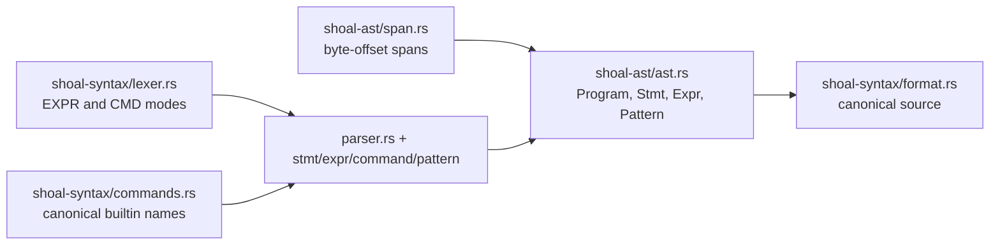
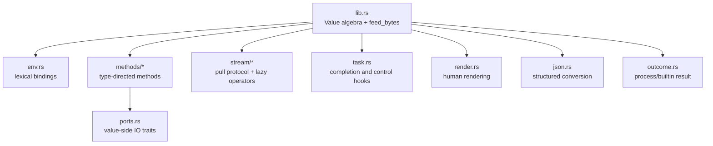
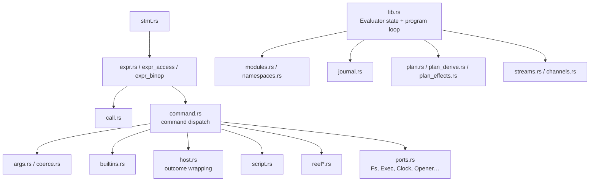
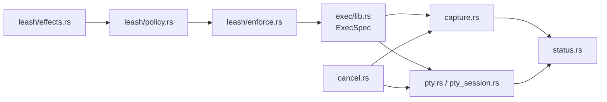
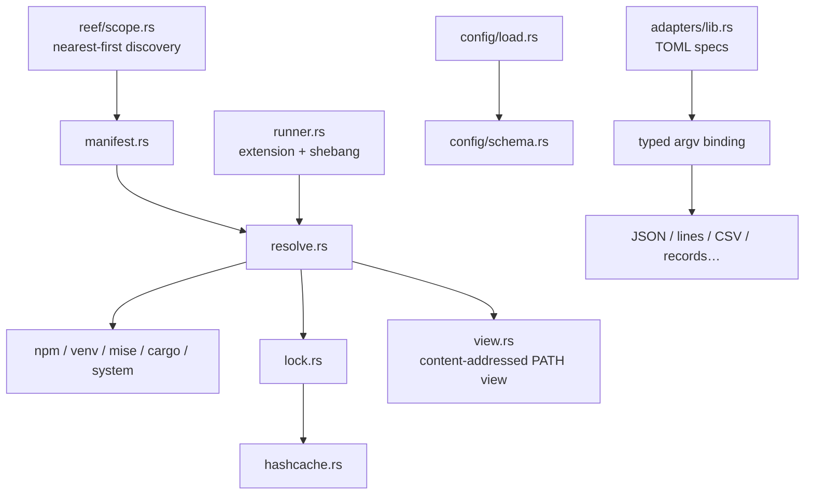

+++
title = "Crate and module ledger"
description = "An ownership ledger for every workspace crate, its internal modules, dependency direction, and intended reasons to change it."
weight = 20
template = "docs/page.html"

[extra]
group = "Orientation"
eyebrow = "Architecture atlas"
status = "22 workspace crates"
audience = "Contributors choosing a change boundary"
wide = true
+++

The workspace contains 22 crates. The table below is a routing contract: start a change in the crate
that owns the invariant, then let hosts adapt to it. Do not begin in a composition root merely
because that is where a symptom appears.

## Workspace ledger

| Crate | Owns | Internal Shoal dependencies | Change it when… |
|---|---|---|---|
| [`shoal-ast`](https://github.com/alliecatowo/shoal/tree/main/crates/shoal-ast) | spans and the serializable language tree | — | the language can represent a new form |
| [`shoal-syntax`](https://github.com/alliecatowo/shoal/tree/main/crates/shoal-syntax) | mode-aware lexer, parser, parse status, canonical formatter, builtin registry | ast | source maps to a different AST or formatting rule |
| [`shoal-value`](https://github.com/alliecatowo/shoal/tree/main/crates/shoal-value) | runtime value algebra, environments, methods, streams, tasks, rendering, stdin conversion | ast | a value or generic value operation changes |
| [`shoal-eval`](https://github.com/alliecatowo/shoal/tree/main/crates/shoal-eval) | tree-walk semantics, command dispatch, builtins, plans, ports, modules, Reef integration | adapters, ast, exec, journal, leash, picker, reef, secret, syntax, value | AST meaning or language-owned runtime behavior changes |
| [`shoal-exec`](https://github.com/alliecatowo/shoal/tree/main/crates/shoal-exec) | process spawning, capture, process groups, PTY modes, cancellation, OS sandbox application | leash | the child-process/terminal boundary changes |
| [`shoal-leash`](https://github.com/alliecatowo/shoal/tree/main/crates/shoal-leash) | effects, content-addressed plans, policy verdicts, sandbox lowering | — | authority, approval, or containment semantics change |
| [`shoal-journal`](https://github.com/alliecatowo/shoal/tree/main/crates/shoal-journal) | SQLite schema/query, transcript rows, CAS, spill, undo, GC | — | durable execution history or bytes change |
| [`shoal-reef`](https://github.com/alliecatowo/shoal/tree/main/crates/shoal-reef) | scoped manifests, constraints, providers, locks, hash cache, executable views, runner selection | — | reproducible tool/script resolution changes |
| [`shoal-adapters`](https://github.com/alliecatowo/shoal/tree/main/crates/shoal-adapters) | declarative command specifications, typed binding, output parsers, bundled adapter loading | ast, value | an external CLI gains a structured Shoal surface |
| [`shoal-config`](https://github.com/alliecatowo/shoal/tree/main/crates/shoal-config) | layered core config schema and provenance | — | CLI configuration loading or validation changes |
| [`shoal-prompt`](https://github.com/alliecatowo/shoal/tree/main/crates/shoal-prompt) | pure prompt context and formatting, prompt-specific config/themes/modules | — | prompt display or prompt config changes |
| [`shoal-auth`](https://github.com/alliecatowo/shoal/tree/main/crates/shoal-auth) | bearer-token hashing, expiry, revocation, and persisted token store | — | kernel identity proof changes |
| [`shoal-secret`](https://github.com/alliecatowo/shoal/tree/main/crates/shoal-secret) | encrypted local secret map and permissions | — | secret-at-rest storage changes |
| [`shoal-proto`](https://github.com/alliecatowo/shoal/tree/main/crates/shoal-proto) | newline-framed JSON-RPC, wire values/refs, RPC error codes, request/response types | — | the kernel wire contract changes |
| [`shoal-kernel`](https://github.com/alliecatowo/shoal/tree/main/crates/shoal-kernel) | Unix-socket server, sessions, RPC routing, tasks, PTYs, plans, events, transcript refs | ast, auth, eval, exec, journal, leash, proto, syntax, value | remote/session semantics change |
| [`shoal-mcp`](https://github.com/alliecatowo/shoal/tree/main/crates/shoal-mcp) | MCP stdio facade, kernel client, tools, resources, resource subscriptions | none normally | the agent-facing MCP projection changes |
| [`shoal-lsp`](https://github.com/alliecatowo/shoal/tree/main/crates/shoal-lsp) | lexical editor service: diagnostics, formatting, completion, hover | syntax | editor protocol behavior changes |
| [`shoal-history`](https://github.com/alliecatowo/shoal/tree/main/crates/shoal-history) | small journal inspection CLI/library | journal | non-interactive journal inspection changes |
| [`shoal-doctor`](https://github.com/alliecatowo/shoal/tree/main/crates/shoal-doctor) | installation/state diagnostics | adapters, journal, leash | a user-visible health check changes |
| [`shoal-picker`](https://github.com/alliecatowo/shoal/tree/main/crates/shoal-picker) | alternate-screen fuzzy picker | value | interactive selection UI changes |
| [`shoal-wasm`](https://github.com/alliecatowo/shoal/tree/main/crates/shoal-wasm) | component validation, manifest checks, resource limits, ambient-import rejection | — | the future WASM isolation boundary changes |
| [`shoal`](https://github.com/alliecatowo/shoal/tree/main/crates/shoal) | CLI actions, REPL host, editor integration, configuration assembly, prompt snapshots | adapters, ast, config, doctor, eval, journal, leash, prompt, syntax, value | the human-facing composition root changes |

## Module atlas

### Syntax and representation

`shoal-syntax` is divided by grammar concern: `lexer`, `parser`, `stmt`, `expr`, `command`,
`pattern`, `block`, `string`, and `number`. `format` walks the resulting AST. `commands` is the
shared builtin-name registry used by evaluator and editor-facing classification.

### Values and generic operations

The methods directory separates list, record, string, numeric, path, outcome, task, and stream
families. Stream operators live under `stream/` because they own pull state, timeout propagation,
single-consumption, and tee buffering rather than only method name dispatch.

### Evaluation

This is a tree-walk evaluator. `lib.rs` holds session state and the top-level evaluation loop;
semantic cases are split by AST kind. `command.rs` is intentionally a high-fan-out dispatch point,
so additions there deserve parity tests across callable, builtin, adapter, script, Reef, and
external-command cases.

### Execution and policy

`shoal-exec` separates `capture` from `pty` and `pty_session`; `cancel`, `watcher`, and `status`
normalize lifecycle behavior; `which` locates executables; `sandbox` selects the OS implementation.
OS-specific enforcement is in Leash's `enforce` and `seatbelt` modules. This is where the workspace's
unsafe and Unix-specific code should remain concentrated and reviewable.

### Kernel and agent bridge

The kernel's `dispatch.rs` is a thin method router. Handler modules own session, execution/plan,
value/event, task, and PTY families. `session.rs` owns shared evaluator/transcript state; `wire.rs`
does bounded `Value` conversion; `eventbus.rs` owns rings, durable replay integration, and subscriber
queues. `lib.rs` owns connection lifecycle and shared maps.

`shoal-mcp` is divided into a socket `client`, MCP `tools`, URI-backed `resources`, and the stdio
server in `lib`. It deliberately consumes the public kernel contract rather than reaching into
kernel memory.

### Reef, adapters, and configuration

Core config and prompt config are separate systems. `shoal-config` loads the shell's core schema;
`shoal-prompt` has its own `config` and formatting modules. Reef manifests are also parsed through
their own discovery path. Treating all three as one configuration object will miss real behavior.

## Complete source-module routing index

This index names every current Rust source module, including binary entrypoints and nested modules.
It is intentionally mechanical: a newly added module should appear here in the same change so future
maintainers can tell whether the architecture gained a boundary or only an implementation split.

| Crate | Modules and responsibility |
|---|---|
| `shoal-adapters` | `lib` — TOML model, catalog loading, argument binding, output parsers, bundled-spec access |
| `shoal-ast` | `lib` — exports/version surface; `ast` — nodes; `span` — byte spans |
| `shoal-auth` | `lib` — token store/verification; `main` — token-management CLI |
| `shoal-config` | `lib` — typed config/public API; `load` — discovery/merge/env overrides; `schema` — shape validation and suggestions; `error` — located failures |
| `shoal-doctor` | `lib` — diagnostic checks/results; `main` — standalone diagnostic CLI |
| `shoal-eval` | `lib` — evaluator state/program loop; `stmt`, `expr`, `expr_access`, `expr_binop`, `pattern` — tree-walk semantics; `call`, `args`, `coerce`, `helpers` — calls/signatures/coercion; `command`, `builtins`, `host` — ordered dispatch and outcome wrapping; `ports` — host capabilities; `journal` — statement lifecycle/undo hooks; `modules`, `namespaces` — imports and namespace values; `plan`, `plan_derive`, `plan_effects` — plan verbs/static effects; `reef`, `reef_builtins`, `reef_resolve`, `script` — tool and script resolution; `streams`, `channels` — language producers/event bridge; `frecency` — jump store integration |
| `shoal-exec` | `lib` — `ExecSpec`/`ExecResult` and orchestration; `capture` — pipe capture/spill; `pty` — foreground PTY tee and parked jobs; `pty_session` — long-lived terminal emulator; `cancel` — cancellation token/escalation; `status` — wait status normalization; `watcher` — child lifecycle polling; `sandbox` — pre-exec enforcement selection; `which` — executable lookup; `main` — standalone harness/entrypoint |
| `shoal-history` | `lib` — journal lookup/render API; `main` — history CLI |
| `shoal-journal` | `lib` — journal API and entry/output records; `schema` — SQLite schema/version; `query` — filters; `cas` — compressed content store; `gc` — orphan/LRU/TTL collection; `undo` — inverse records and safe apply; `transcript` — durable transcript events; `tests` — crate-internal integration-style tests |
| `shoal-kernel` | `main` — daemon args/socket startup; `lib` — shared maps, server/connection lifecycle and types; `dispatch` — method router; `session` — attachment/session creation; `handlers_session` — parse/complete/explain/session views; `handlers_exec` — exec/plan/apply; `handlers_value` — value/blob/journal/event handlers; `handlers_task` — task/plan capability lifecycle; `handlers_pty` — PTY lifecycle; `wire` — navigation/encoding/elision/render bounds; `eventbus` — rings, durable replay, subscriber backpressure |
| `shoal-leash` | `lib` — exported authority/enforcement API; `effects` — `Effect`/`Plan`; `policy` — TOML grants and verdicts; `enforce` — sandbox representation, Landlock, hashing/status; `seatbelt` — macOS profile generation; `main` — policy/enforcement CLI |
| `shoal-lsp` | `lib` — LSP service; `main` — stdio server entrypoint |
| `shoal-mcp` | `main` — stdio entrypoint/config; `lib` — MCP router/autostart/framing; `client` — attached kernel client and event forwarder; `tools` — tool schemas/mapping/bounds; `resources` — URI parser/list/read/subscribe |
| `shoal-picker` | `lib` — alternate-screen fuzzy picker and terminal lifecycle |
| `shoal-prompt` | `lib` — renderer API; `context` — immutable gathered facts; `config/mod`, `config/schema`, `config/module_config` — prompt loading/validation/module settings; `format` — template parsing; `fmt` — value formatting helpers; `style` — ANSI style model; `themes` — built-ins; `render/mod`, `render/helpers`, `render/modules` — pure rendering and module implementations |
| `shoal-proto` | `lib` — complete JSON-RPC frame/types/error/ref/wire-path contract |
| `shoal-reef` | `lib` — public resolver model; `manifest` — native manifest; `scope` — native/foreign discovery; `resolve` — constraint/provider/lock policy; `lock` — lockfile; `hashcache` — executable identity cache; `view` — content-addressed PATH view; `runner` — extension/shebang runner table; `version` — constraints/order; `timestamp` — portable metadata time; `report` — resolution explanation; `error` — typed failures; `provider/mod` — provider trait/order; `provider/npm`, `provider/venv`, `provider/mise`, `provider/cargo`, `provider/system` — concrete candidate sources |
| `shoal-secret` | `lib` — encrypted store and permission checks; `main` — secret CLI |
| `shoal-syntax` | `lib` — parse/format/status exports; `commands` — canonical builtin registry; `format` — AST formatter; `lexer` with `lexer/number`, `lexer/string` — mode-aware tokenization; `parser` with `parser/stmt`, `parser/expr`, `parser/command`, `parser/pattern`, `parser/block` — grammar implementation |
| `shoal-value` | `lib` — `Value`, equality and stdin conversion; `env` — lexical chain; `value_types` — domain scalar types; `outcome` — command result; `task` — task state/hooks; `ops` — generic operators; `json` — JSON conversion; `render` — human output; `ports` — value-side callback traits; `methods/mod`, `methods/list`, `methods/num`, `methods/outcome`, `methods/path`, `methods/record`, `methods/stream`, `methods/strops`, `methods/task` — method families; `methods/suggest` — did-you-mean; `stream/mod`, `stream/ops`, `stream/tee` — pull state, lazy operators, fan-out |
| `shoal-wasm` | `lib` — component/manifest validation, resource limits, ambient-import policy |
| `shoal` | `main` — CLI dispatch and non-interactive host; `args` — action parsing; `repl` — Reedline/evaluator session; `adapters` — bundled/extra catalog host loading; `completer` — context candidates/cache/ranking; `highlight` — editor coloring; `keybindings` — config-to-Reedline mapping; `prompt` — host fact gathering/snapshot adapter |

### Entrypoints are adapters

Every `main.rs` should remain thin: parse process arguments/environment, construct the owning library,
choose exit behavior, and report errors. Business rules placed only in a binary cannot be reused by
the `shoal` companion launcher or exercised through library integration tests.

## Public boundaries versus implementation modules

Changing a private module is not automatically a local change. These cross-crate concepts are the
effective public architecture:

| Concept | Canonical owner | Main consumers |
|---|---|---|
| AST shape and `AST_VERSION` compatibility | ast + proto | syntax, eval, kernel clients |
| builtin names | syntax `commands` | parser, eval, completion, highlighter, LSP |
| `Value` kinds and equality/feed semantics | value | eval, adapters, picker, kernel wire |
| effect and plan serialization | leash | eval, exec, kernel, agents |
| journal entry/output schema | journal | eval, kernel, history, doctor |
| JSON-RPC codes and wire refs | proto | kernel and external clients |
| adapter TOML schema | adapters | bundled specs, config directories, evaluator |
| Reef manifest/lock format | reef | evaluator, projects, `reef` commands |

## Workspace-level maintenance signals

The root `Cargo.toml` declares a workspace lint policy, but member manifests do not currently opt in
with `[lints] workspace = true`. CI still runs Clippy with warnings denied, so today the executable
quality gate is the CI command rather than inherited manifest metadata. If lint inheritance is
enabled, do it across the workspace and expect latent warnings rather than assuming the table is
already active.

Workspace package metadata now uses the same `alliecatowo/shoal` repository as the checked-out
remote and documentation links. Keep this as one workspace-level value rather than overriding it in
individual crates.
