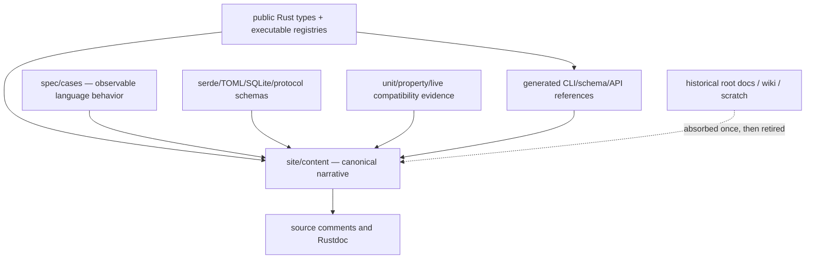

+++
title = "Documentation governance and canonicalization"
description = "How the Zola atlas, executable schemas, source comments, generated references, and historical root docs stay synchronized without creating parallel truth."
weight = 130
template = "docs/page.html"

[extra]
group = "Maintenance"
eyebrow = "Anti-drift operating model"
status = "Zola is the sole canonical narrative source"
audience = "Every contributor and release maintainer"
wide = true
+++

Shoal's canonical narrative documentation lives in this Zola site. Root Markdown design documents,
wiki pages, issue descriptions, scratch audits, and source comments may explain local context, but
they must not become independent normative manuals.

The rule is simple:

> One narrative home, many executable authorities, no duplicated hand-maintained registries.

## What “canonical” means

“Sole canonical narrative” does **not** mean prose overrides code. It means architectural intent,
explanations, maturity labels, diagrams, guides, and cross-links have one maintained home. Exact
enumerations and observable behaviors remain executable:

| Information | Normative authority | Narrative treatment |
|---|---|---|
| builtin names | `shoal_syntax::commands::builtin_names()` | explain categories and lifecycle; do not hand-copy as authority |
| value methods | metadata in `methods/suggest.rs` plus real dispatch and behavioral fixtures | publish generated tables; treat dispatch as exact arity/value authority |
| AST/wire/config structs | public serde/Rust types | explain invariants, compatibility, and examples |
| RPC integer codes | `shoal_proto::error_code` + pinned test | explain meaning and client handling |
| adapter/manifest grammar | deserializers and fixture corpus | explain precedence and extension process |
| language behavior | reviewed `spec/cases` + implementation tests | give coherent semantics and links |
| SQLite schema/version | journal schema/migration source + old fixtures | explain lifecycle, data safety, and operations |
| CLI flags | argument parser or generated CLI schema | provide task-oriented usage and generated reference |

## Content classes

Every page should make its class obvious:

- **User guide:** supported tasks and behavior; should not expose internal uncertainty unless it
  affects users.
- **Reference:** exhaustive, source-derived shapes/names/defaults; ideally generated or verified.
- **Architecture:** ownership, control/data flow, invariants, failure modes, diagrams, change map.
- **Implementation status:** what is wired and tested now, distinct from schema/scaffold.
- **Roadmap:** ordered future work with dependencies and exit evidence.
- **Decision/rationale:** why a durable choice exists and what would justify reversing it.

Do not mix roadmap aspiration into a reference table without a status column. Do not mark a feature
implemented because a type, config key, renderer branch, or protocol struct exists.

## Page status vocabulary

Use consistent evidence labels:

| Label | Meaning |
|---|---|
| implemented | reachable through a real host path with behavioral tests |
| partial | useful path exists, but named cases/platforms/consumers are missing |
| scaffolded | type/schema/renderer/handler shell exists without end-to-end wiring |
| aspirational | design intent only; no current behavior claim |
| deprecated | still accepted/served for compatibility, with a replacement |
| historical | rationale or migration context, not current contract |

“Done” is not a useful implementation-status label without the evidence and platform boundary.

## Source-comment link policy

Rustdoc and source comments should be local first and link outward only for cross-cutting context:

1. explain the immediate invariant beside the code;
2. link to a canonical Zola page/section for architecture or user-visible contract;
3. link to a Rust type/function for exact signatures;
4. never cite `scratch/`, a wiki, ignored file, deleted root design doc, or mutable issue as normative;
5. avoid section-number-only citations such as “TDD §317”; use a stable page slug and descriptive
   anchor/text;
6. when a published-site URL is unsuitable for offline Rustdoc, name the page slug and repository
   source path in one stable form chosen project-wide.

Examples of intended retargeting:

| Stale citation family | Stable destination |
|---|---|
| `docs/TDD.md` language decisions | [Language and conformance contract](@/internals/language-conformance-contract.md) |
| `docs/CONTRACTS.md` ports/signatures | [Inter-crate and protocol contracts](@/internals/intercrate-protocol-contracts.md) |
| `docs/ROADMAP.md` completion/status claims | [Implementation status](@/internals/implementation-status.md) + [prioritized roadmap](@/internals/roadmap-and-priorities.md) |
| `docs/AGENT-SURFACE.md` handler inventory | [Kernel RPC handler reference](@/internals/kernel-rpc-reference.md) |
| `scratch/design-prompt.md` | [Prompt, editor, completion, picker, and LSP](@/internals/prompt-editor-lsp.md) |
| `scratch/audit-arch.md` port/DAG notes | inter-crate contract + evaluator/system maps |
| `scratch/audit-quality.md` lint/test notes | [Tooling and quality gates](@/internals/tooling-and-quality.md) |

## Historical root-doc absorption map

The following migration table records where useful content went and whether the root artifact can be
retired. “Retire” means delete after source links and repository navigation have been retargeted—not
silently preserve two copies.

| Historical artifact | Valuable content absorbed into | Gaps corrected during absorption | Disposition |
|---|---|---|---|
| `docs/VISION.md` | external overview plus system map/status/roadmap | single mandatory kernel and broad completion claims separated from current hosting | retire after overview review |
| `docs/ROADMAP.md` | implementation status + prioritized roadmap + change map | “done” waves replaced by source/test/wiring evidence | retire |
| `docs/TDD.md` | language/conformance contract plus focused syntax/value/process/security/storage chapters | stale name lists, state paths, mandatory interactive kernel, aspiration vs behavior | retire and retarget all comments |
| `docs/STREAMS.md` | streams/channels chapter plus external stream guide | per-source boundedness, evaluator-language EventBus unbounded live subscribers, implemented vs proposed sources | retire |
| `docs/IO.md` | value/feed/process/script-runner chapters and external I/O guide | exact runner/feed behavior checked against source; aspirations labeled | retire |
| `docs/REEF.md` | Reef resolution chapter, config and external guide | actual multi-scope discovery, tool-free policy scopes, provider/lock behavior | retire |
| `docs/CONFIG.md` | configuration reference + external configuration guide | nearest-only project layer, parallel prompt/Reef parsers, inert fields | retire |
| `docs/AGENT-SURFACE.md` | kernel/protocol/RPC reference, MCP, security, status/roadmap | unattached approval/journal handlers, colliding plan identity, token reload semantics, raw-base64 bypass, incomplete stream/ref promises | retire and retarget protocol comments |
| `docs/CONTRACTS.md` | inter-crate/protocol contract + focused crate chapters | exact APIs delegated to source, port bypasses admitted, current DAG/types used | retire and retarget comments |
| `docs/BENCHMARKS.md` | tooling/quality performance review section | budgets labeled reviewed targets rather than asserted results | retire |
| `docs/shoal.1` | external CLI reference and generated man-page pipeline | current hand-written page is tiny and can drift from args | replace/retain only as generated packaging artifact |

### Man-page disposition

The man page is different from design prose because packages may install it. Do not simply delete it
until packaging/install scripts are searched. The preferred model is:

If current packaging consumes `docs/shoal.1`, retain the path but generate/verify its synopsis,
options, subcommands, exit status, environment, files, and examples from the argument definition.
Until generation exists, mark it a packaging artifact and add a drift check against `shoal --help`.
The Zola CLI page remains the canonical human narrative.

## Update checklists by change type

### Add or change a builtin

1. update the canonical builtin-name registry and evaluator dispatch;
2. define signature/flags, effects, result/error behavior;
3. add focused and conformance cases;
4. audit completion, highlighter, LSP, plan/explain, Leash, journal;
5. regenerate/update external command reference and internal builtin ledger;
6. confirm no separate word list was introduced.

### Add or change a value method

1. update real dispatch and `methods/suggest.rs` metadata together;
2. test every supported receiver, arity, type error, closure callback, stream boundedness, and effect;
3. audit field-to-zero-arg-method fallback;
4. audit render/JSON/feed/wire when result types change;
5. add corpus behavior and regenerate the method matrix;
6. resolve metadata/dispatch diff to zero or document the intentional exception.

### Add or change an RPC method

1. add typed params/results in `shoal-proto` with serde defaults for compatibility;
2. register/dispatch the handler and attachment/authority rules;
3. define ref lifetime, elision, error codes, and notification sequencing;
4. add handler and live socket tests, plus MCP mapping if exposed;
5. update RPC tables, wire diagrams, security matrix, external agent reference;
6. test old/malformed clients and frame/context bounds.

### Add or change configuration

1. typed field and safe default;
2. schema shape, semantic validation, optional explicit environment mapping;
3. merge/error tests;
4. wire every applicable host and add behavioral tests;
5. expose configured versus effective state in doctor/introspection;
6. update internal wiring matrix and external reference;
7. do not call it implemented while it is snapshot-only.

### Add or change a crate

1. state one owned invariant and why an existing crate cannot own it;
2. audit Cargo direction/features/dev-only edges and cycle pressure;
3. add it to workspace checks, crate/module ledger, system map, ownership/change maps;
4. define public compatibility and error/effect boundaries;
5. add focused tests and release packaging where applicable;
6. remove obsolete ownership claims from neighboring crates.

### Add or change a durable schema

1. define forward/backward compatibility window;
2. add a real prior-version fixture and data-preservation test;
3. refuse unsupported newer versions safely;
4. audit backup, GC, undo, refs, transaction/concurrency semantics;
5. update storage reference, operational recovery guide, and release notes.

## Anti-drift automation

The documentation pipeline should fail on mechanically detectable divergence:

| Check | Mechanism |
|---|---|
| broken internal links | Zola build plus explicit `@/…` target scan |
| missing source paths | scan inline/backtick source paths against checkout |
| builtin docs drift | compare rendered table data to `builtin_names()` |
| method docs drift | compare metadata to real dispatch and generated table |
| RPC docs drift | derive method/param/error-code inventory from proto/kernel registries |
| config docs drift | serialize default config + schema/env mapping inventory |
| corpus ledger drift | count suite files/cases; ensure all 77/current suites appear once |
| crate ledger drift | derive workspace members and internal dependency edges from Cargo metadata |
| stale old-doc links | `rg` forbidden paths (`docs/TDD.md`, `scratch/…`, wiki URLs) in source |
| diagrams/fences | Markdown fence balance and Mermaid parse/render smoke test |
| CLI/man drift | compare generated/reference options to parser `--help` snapshots |

Generated output should be clearly marked and regenerated by one documented command. Do not hand-edit
generated tables. Narrative surrounding the table remains reviewed prose.

## Documentation review evidence

A documentation-only claim should cite at least one of:

- exact source module/type/handler;
- focused test or corpus suite;
- reproducible command and dated result;
- durable schema/migration fixture;
- live protocol/process/PTY integration test.

When the evidence is inference, say so. When a value can change—counts, platform support, current
default, CI matrix—date it or derive it. Avoid screenshots as the only contract evidence.

## Pull-request documentation gate

Reviewers should ask:

- Did this change alter a name, default, wire/storage shape, error, effect, platform, or host path?
- Is the update in the canonical Zola page rather than a new root Markdown file?
- Does the page distinguish intent, current wiring, and tests?
- Are source comments linked to a stable destination?
- Can a table be generated or mechanically checked?
- Did an old page become redundant, and was it retired/redirected?
- Do diagrams still match control/data/authority flow?
- Does the implementation-status/roadmap ranking change?

## Ownership and cadence

The contributor changing a contract owns its documentation in the same change. Release maintainers
run the global link/generation/status audit; they do not reverse-engineer every feature after the
fact. Periodic doc sweeps are still useful for cross-cutting drift, but they are a safety net rather
than the primary update mechanism.

At release time:

1. run the complete corpus/workspace/CI-equivalent checks;
2. regenerate registries/reference tables/man page;
3. verify implementation-status evidence and roadmap priorities;
4. build Zola with warnings treated as failures where possible;
5. scan for forbidden canonical links and stale root docs;
6. publish the same site revision as the release source revision.

## Canonicalization invariant

After migration, repository navigation should be unambiguous:

- `README` introduces and links the Zola site;
- Zola owns all maintained narrative/reference/architecture content;
- Rustdoc owns exact local API documentation and links into Zola for systems context;
- executable schemas/registries/corpus own enumerated facts;
- generated man/reference artifacts come from those authorities;
- issues/roadmap tools link to the status/roadmap pages rather than duplicating them;
- no wiki or root design-document fork remains available to age silently.
