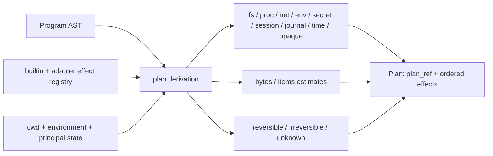
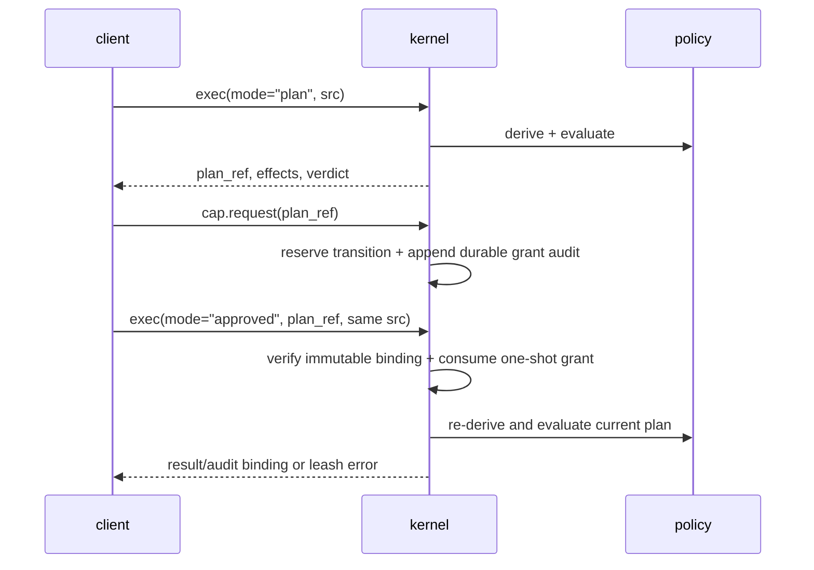
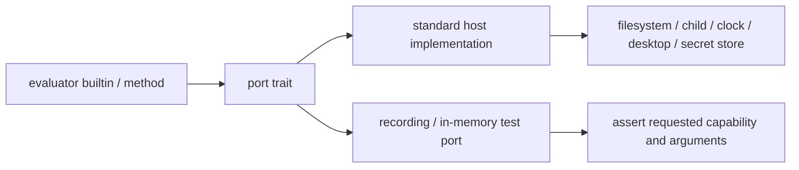
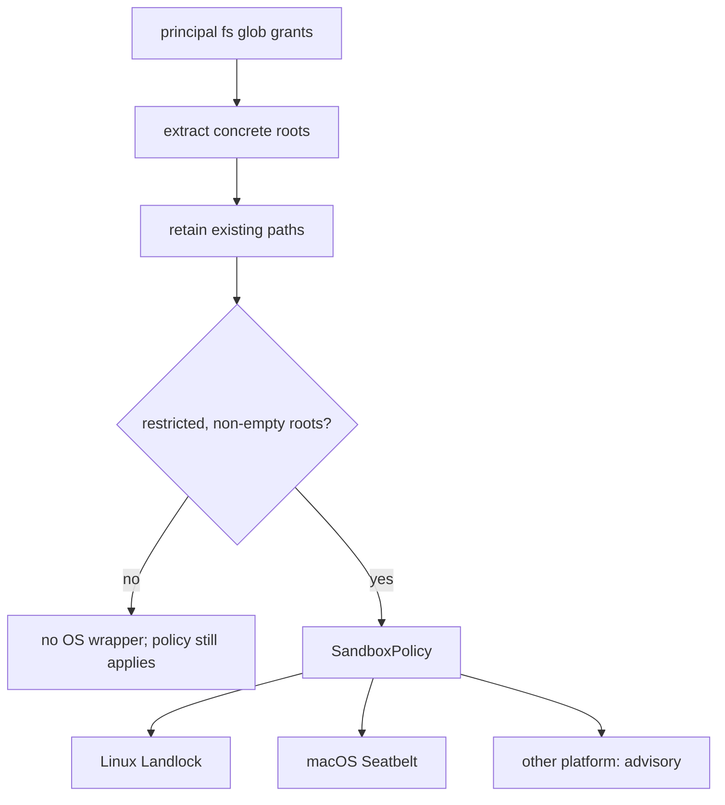

+++
title = "Effects, plans, ports, and authority"
description = "How Shoal describes side effects, derives stable plans, evaluates principal policy, lowers sandboxes, and keeps testable capabilities at the runtime edge."
weight = 50
template = "docs/page.html"

[extra]
group = "Execution & security"
eyebrow = "Authority model"
status = "Policy plus best-available enforcement"
audience = "Security, evaluator, and kernel contributors"
wide = true
+++

Shoal separates four questions that are easy to conflate:

1. **What might this program do?** Static plan derivation answers with semantic effects.
2. **May this principal do it unattended?** Leash policy returns allow, deny, or approval required.
3. **What can the OS enforce for this spawn?** Sandbox lowering and the execution backend report it.
4. **How does evaluator code reach the outside world?** Ports make those capabilities explicit and
   replaceable in tests.

Policy is authority. Sandboxing is defense in depth and must report partial enforcement honestly.

## Effect vocabulary

Plans contain concrete effects from a closed enum:

| Effect | Meaning |
|---|---|
| `FsRead`, `FsWrite`, `FsDelete` | access to named path sets |
| `ProcSpawn` | spawn identified by executable hash and `argv0` |
| `NetConnect`, `NetListen` | outbound host/port or inbound port |
| `EnvRead`, `EnvWrite` | session/process environment names |
| `SecretUse` | named secret access |
| `SessionWrite` | mutation of session state |
| `JournalRead` | durable history access |
| `Time` | clock observation |
| `Opaque` | behavior cannot be bounded by the static derivation |

Every `Plan` also carries `Reversibility` (`Reversible`, `Irreversible`, or `Unknown`), optional byte
and item estimates, and a stable `plan_ref` derived from canonical serialized contents.

Source: [`shoal-leash/src/effects.rs`](https://github.com/alliecatowo/shoal/blob/main/crates/shoal-leash/src/effects.rs).

## Plan derivation

The evaluator walks AST and command metadata without executing it. Known builtins and adapter specs
can contribute concrete effect templates. Paths and arguments are resolved as far as the AST and
current evaluator state allow. Dynamic calls, unknown external behavior, or constructs that cannot
be bounded become `Opaque` and normally make reversibility unknown.

Adapter effect declarations parse against the **full** effect vocabulary — `fs.read`, `fs.write`,
`fs.delete`, `proc.spawn`, `net.connect`, `net.listen`, `env.read`, `env.write`, `secret.use`,
`session.write`, `journal.read`, and `time` — in both parenthesized (`proc.spawn(container)`) and
bare (`session.write`) forms. A declaration whose kind is outside the vocabulary is **never silently
dropped**: it plans as `Opaque` so an unrecognized adapter effect forces approval rather than
vanishing from the plan.

Derivation is intentionally conservative and fail-closed. The AST walk is structurally exhaustive —
a match over every statement and expression node with **no wildcard arm**, so a new syntax form
cannot be added without classifying its effects. Concretely the walk covers: `use` (module `FsRead`
plus `Opaque` for the module body), persistent `env.NAME = …` (`EnvWrite`), command redirects
(`>`/`>>` → `FsWrite`, `< file` → `FsRead`), the method sinks `.save`/`.append` and the path reads
`.read`/`.lines`/…, `.feed` (an **external** spawn of the fed command, matching the runtime's
`run_argv` path rather than builtin dispatch), the effectful builtins `run`/`open`/`save` and the
bodies of `spawn`/`parallel`/lambda arguments, and generic external commands (a concrete `ProcSpawn`
with a resolved binary hash, consistent with adapter spawns). A call that cannot be statically
expanded — a session-stored closure, or any unrecognized name — becomes an approval-requiring
`Opaque` effect; an empty effect set is emitted only for forms that are provably effect-free
(literals, pure constructors, and control-flow scaffolding). It is safer to require approval for an
opaque program than to manufacture a precise-looking plan that omits a dynamic effect.

Command-head resolution consumes the same canonical builtin registry as runtime dispatch,
completion, and the LSP. Structured builtins derive their declared filesystem/environment effects;
special heads derive their runtime meaning (`history`/`journal` → `JournalRead`, directory/session
mutation → `SessionWrite`, `interact cmd` → the command's `ProcSpawn`). A special head whose behavior
cannot be bounded, such as a stored-plan `apply` or effectful `reef` subcommand, becomes `Opaque`.
It never falls through as an external process merely because it has no entry in the structured
builtin effect table. The HR-A11 regression suite iterates every canonical builtin name and pins all
original audit probes to their meaningful effect and target.

Sources: [`plan_derive.rs`](https://github.com/alliecatowo/shoal/blob/main/crates/shoal-eval/src/plan_derive.rs)
and [`plan_effects.rs`](https://github.com/alliecatowo/shoal/blob/main/crates/shoal-eval/src/plan_effects.rs).

## Policy evaluation

Policy is keyed by principal. Each principal can grant path globs, executable names/hashes, network
destinations, environment names, secrets, session/journal/time access, an opaque mode, hermetic
intent, and an automatic-apply rule.

Denial dominates approval, which dominates allow. Unknown principals deny at this evaluator. Local
human operation ordinarily installs a built-in permissive principal policy to preserve normal shell
behavior.

### Spawn pinning exception

An empty `proc_spawn` list means spawn pinning is inactive, not “deny every ordinary command.” The
spawn path first checks `spawn_pinning_active`; only principals that opted into a non-empty allowlist
pay the hash-and-match gate. This exception is explicit in the policy API and must remain covered by
tests if plan evaluation is refactored.

### Approval lifecycle in the kernel

`cap.request` requires an attached authorized approver and separates requester from approver by
default. It reserves the exact owner-bound plan transition, appends the grant audit before publishing
authority, and restores the reservation if audit append fails or unwinds. `plan.apply` and approved
`exec` re-check the immutable source/AST/effects/Session/principal binding, re-derive the current plan,
and atomically consume the grant once. The consuming execution id is bound to the audit record.

Kernel plan refs use the full binding digest plus a unique per-kernel object suffix, so equal-shape
and identical repeated plans remain distinct. They are ephemeral object identifiers, never bearer
permissions or durable ids.

## Ports

The evaluator holds ports for filesystem I/O, filesystem event registration, execution, clock,
opener, secrets, configuration, and CAS-byte loading. Default ports perform real host actions;
tests can inject deterministic fakes. Language-visible filesystem reads, probes, navigation, and
writes cross `Fs`; watch and tail registration cross `WatchPort`. The standard adapters are the
explicit ambient-authority boundary, as inventoried below.

### In-process filesystem-effect ledger (HR-C3, 2026-07-16)

Inventory of language-visible filesystem operations in `shoal-value` and `shoal-eval`. Ordinary
filesystem I/O/probes cross `Fs`; event registration crosses the narrower `WatchPort`. Standard
adapters are the explicit ambient boundary. A new operation adds a routed row and a denial test.

**Routed write/read effects** — mediated by the `Fs` port, so a fake can observe or deny them and a
sandbox can enforce them:

| Site | Effect | Port route |
|---|---|---|
| `shoal-value` `methods/path.rs::save` — value `.save`/`.append`, `save(path, value)` builtin | file write / append | `CallCtx::fs().write` / `.append` (HR-C1) |
| `shoal-value` `methods/stream.rs::stream_save` — stream `.save`/`.append` | open-once incremental append | `CallCtx::fs().open_append` (HR-C2) |
| `shoal-value` `ports.rs::StdFs` | every `std::fs` syscall | the port adapter itself — the boundary, not a bypass |
| `shoal-eval` `expr_access.rs::path_fs_method` — path `.read`/`.read_bytes`/`.lines`/`.exists`/`.is_dir`/`.is_file`/`.size`/`.modified` | file read / stat | `self.fs.read` / `.metadata` |
| `shoal-eval` `command.rs` redirects `>` and `>>` | file write / append | `self.fs.write` / `.append` |
| `shoal-eval` `builtins.rs` — `cat`/`ls`/`mkdir`/`touch`/`mv`/`cp`/`rm`/`trash`/`ln` | read / write / dir / rename / link | `self.fs.*` |
| `shoal-eval` `frecency.rs` dir-jump store load/save | read / write / rename | `self.fs.*` |
| `shoal-eval` `journal.rs` undo snapshot + restore | read | `self.fs.read` |
| `shoal-eval` `reef_builtins.rs` manifest read | stat / read | `self.fs.is_file` / `.read_to_string` |
| `shoal-eval` module/script/navigation/plan resolution | stat / canonicalize | `self.host.fs.*` |
| `shoal-eval` `streams.rs` watch/tail existence and tail reads | stat / seekable reads | `self.host.fs.*` |
| `shoal-eval` `WatchPort` | watch registration / event delivery | injected `Arc<dyn WatchPort>`; `StdWatchPort` owns `notify` |

The `Fs` port also mediates the `CallCtx::fs()` seam value methods reach through. `CallCtx::fs()` is
required: an embedding must explicitly return either `StdFs` (real host authority) or an injected
adapter, so forgetting the wire is a compile error. The evaluator returns its `Arc<dyn Fs>`
(`set_fs`), and recording/denying tests prove scalar and stream saves reach that adapter end to end.
Production hosts currently leave the evaluator on `StdFs`; this seam is not itself a Leash-backed
in-process sandbox.

Child evaluators created by `spawn_block`, `.shl` `run_script_file`, `parallel`, and `on` inherit
the parent's Leash policy/principal, all ports (including `ConfigPort` and `WatchPort`), Reef state,
event bus, and cancellation through the single `ChildContext` constructor (HR-B1–B6); cross-route
propagation is pinned by `child_context_propagation.rs`. Destructuring makes omission of an
already-captured field a compile error. Adding a new `Evaluator` field still requires an explicit
inheritance audit because Rust cannot infer that the separate `ChildContext` must grow with it.

This boundary is not only for test convenience. It prevents value methods and language semantics
from acquiring accidental ambient authority. A new side-effecting builtin should define its effect,
policy behavior, port method, standard implementation, and fake-port test together.

## Lowering grants to an OS sandbox

Filesystem globs are reduced to their longest concrete leading roots. Nonexistent roots are dropped;
an unrestricted root grant produces no sandbox. A nonhermetic grant set with no useful existing root
also preserves that best-effort behavior, while a hermetic unresolved scope reaches the execution
boundary and refuses before target spawn. The plan verdict remains the authority for modeled effects.

The concrete request records filesystem scopes, a coarse network policy, optional spawn hash, and a
`hermetic` flag. A hermetic request must fail the spawn if any requested dimension cannot be
enforced; non-hermetic execution uses the strongest available backend and returns an
`EnforcementStatus` describing what actually happened.

### Enforcement truth table

| Dimension | Current status |
|---|---|
| filesystem on supported Linux | Landlock backend |
| filesystem on macOS | Seatbelt backend |
| executable identity | preflight BLAKE3 check; no exec-time pin |
| network | plan/policy gate only; no seccomp/network-namespace backend |
| unsupported OS | advisory policy, no strong OS sandbox |

The spawn hash has a documented time-of-check/time-of-use gap: the path is hashed before `exec`, so
the file can theoretically change between those events. Enforcement reports this rather than
claiming an exec-time guarantee. Hermetic principals therefore refuse configured spawn pinning until
an atomic backend exists. They also refuse configured network scoping because the current semantic
allowlist cannot confine an opaque child.

Source: [`shoal-leash/src/enforce.rs`](https://github.com/alliecatowo/shoal/blob/main/crates/shoal-leash/src/enforce.rs).

## Authentication, capabilities, and policy are distinct

Kernel bearer tokens authenticate a principal. Token records also carry advertised capability
metadata, but Leash authorization is evaluated against principal policy. Do not describe the token's
capability list as if it directly grants an effect.

The auth store persists a keyed hash, expiry, revocation state, and the keyed-hash secret in the same
mode-restricted store. It does not persist the original bearer token. Verification uses a
constant-time comparison. Create/revoke take an exclusive fd lock and reload fresh state; validation
takes a shared fd lock and reloads fresh state. The kernel revalidates each bearer-backed attachment
before every request and fails closed on revocation, expiry, or store error. File permissions are
part of the threat model; this is local same-user infrastructure, not a hardware-backed identity
service.

## Secret storage

`shoal-secret` stores a name/value map encrypted with AES-256-GCM. It validates restrictive directory
and file modes. Bounded regular-file admission precedes JSON/base64/decryption; the fixed envelope,
canonical encodings, decrypted map identities, values, aggregate bytes, and JSON shape are all
checked fail closed without rewriting a bad snapshot. Shared/exclusive fd locks serialize fresh
reads and whole-map mutation. Master-key, plaintext buffers, parse-error partial maps, and map values
zeroize on drop; final language/child-process copies remain in the process-memory threat model. The
master key resides alongside the store under the same user-level permission boundary. This protects
accidental disclosure and detects ciphertext tampering; it does not protect against a process
already running as the same compromised user. Values of type `Secret` are deliberately not
generally renderable/feedable.

## WASM boundary: bounded preview runtime

`shoal-wasm` validates components/manifests and retains the validated component rather than rereading
the path. Plugin commands participate in canonical evaluator resolution and execute through preview
ABI v1. Only manifest-declared hostcalls that current principal policy authorizes are linked; current
providers include bounded time and scoped file reading. Fuel, memory/table/instance, byte/count,
epoch deadline, cancellation, and two-second wall-time limits constrain invocation. Synchronous
compilation is byte-capped but not epoch-interruptible. Treat every new hostcall as a new authority
surface requiring canonical effects, scoped inputs, bounded transfer, and adversarial tests.

## Fail-open local policy is a conscious risk

`Policy::load_user_or_permissive` falls back to a permissive policy if the per-user policy is missing
**or malformed**, so a syntax error does not brick an interactive shell. That is convenient for local
humans and dangerous if callers assume malformed policy fails closed. Kernel startup with an
explicit policy path uses the fallible loader instead. Any new agent host should choose and document
its loader deliberately.

## Review checklist for a new effect

- Is the effect concrete enough to evaluate without executing?
- What makes a path/name/hash comparison canonical and cross-platform?
- Does denial dominate every alternate dispatch route, including adapters and scripts?
- Is approval bound to principal, session, exact source, and current plan contents?
- Which port performs the action, and can a test observe it without real IO?
- Which OS dimensions are actually enforced, and what does hermetic mode do when unavailable?
- Is undo evidence sufficient to call the mutation reversible?
- Can a secret or raw path escape through rendering, errors, events, journal rows, or wire values?
