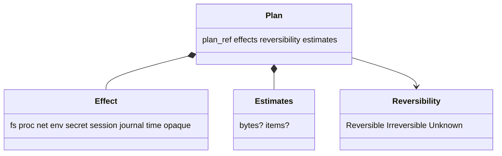
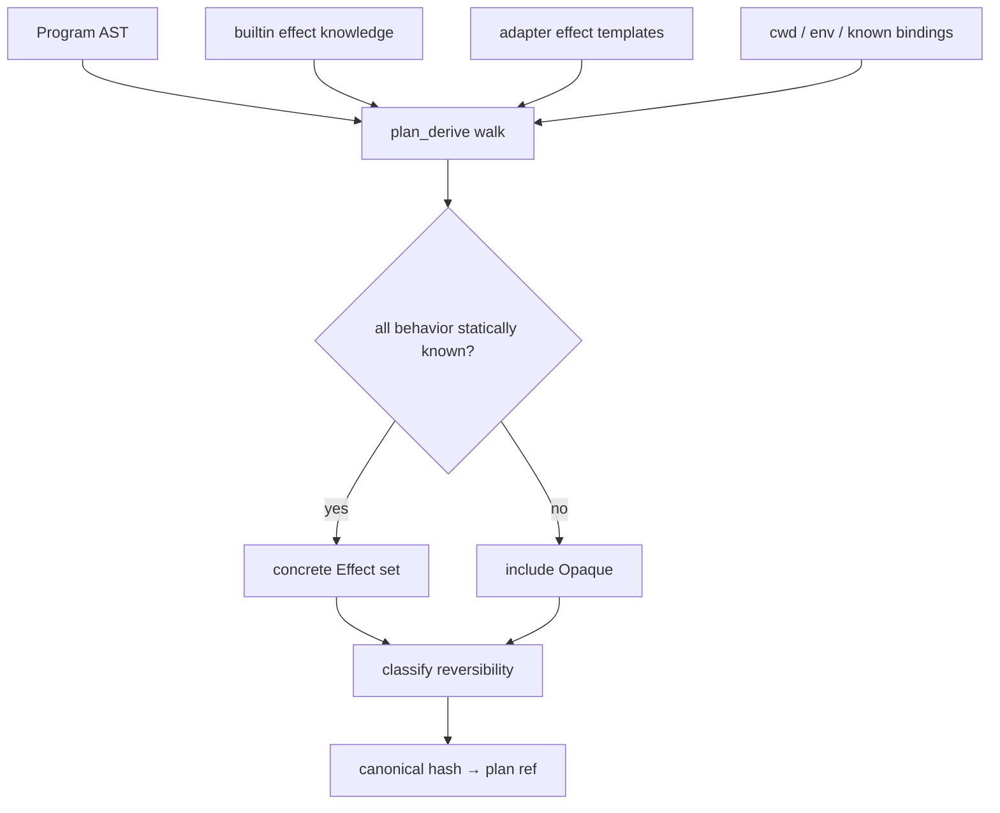
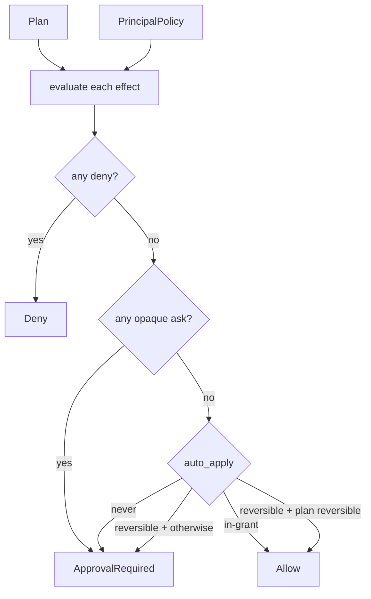
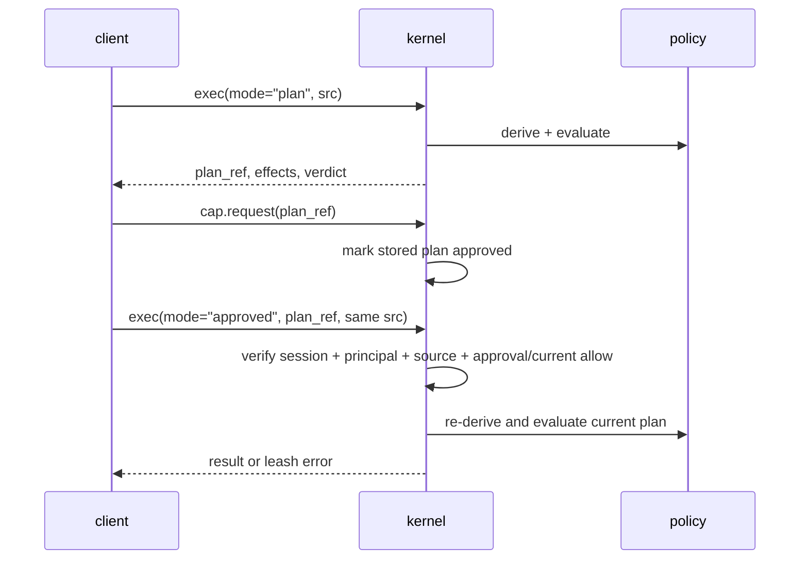
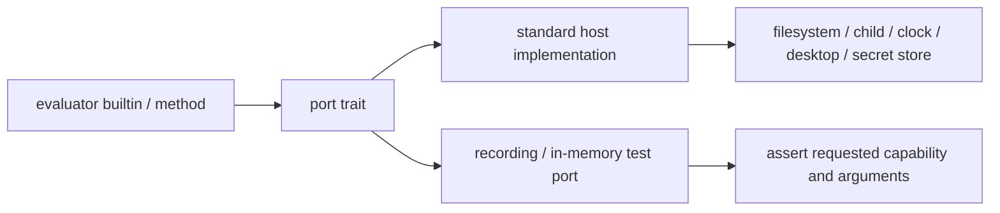
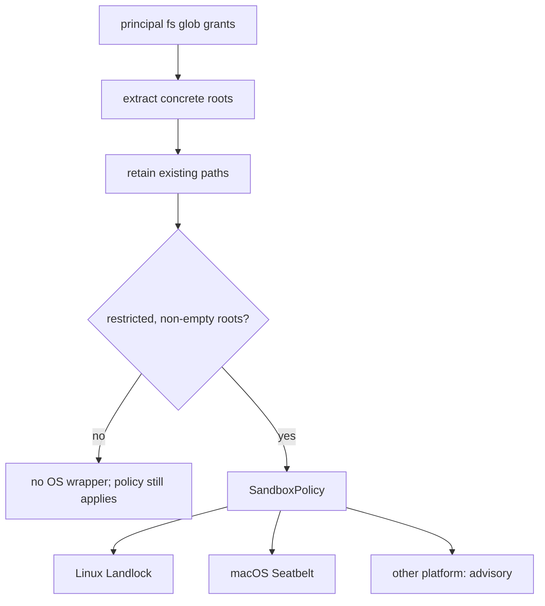
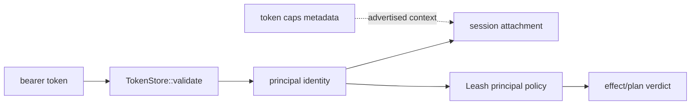

+++
title = "Effects, plans, ports, and authority"
description = "How Shoal describes side effects, derives stable plans, evaluates principal policy, lowers sandboxes, and keeps testable capabilities at the runtime edge."
weight = 50
template = "docs/page.html"

[extra]
group = "Execution & security"
eyebrow = "Authority model"
status = "Policy plus best-available enforcement"
audience = "Security, evaluator, and kernel contributors"
wide = true
+++

Shoal separates four questions that are easy to conflate:

1. **What might this program do?** Static plan derivation answers with semantic effects.
2. **May this principal do it unattended?** Leash policy returns allow, deny, or approval required.
3. **What can the OS enforce for this spawn?** Sandbox lowering and the execution backend report it.
4. **How does evaluator code reach the outside world?** Ports make those capabilities explicit and
   replaceable in tests.

Policy is authority. Sandboxing is defense in depth and must report partial enforcement honestly.

## Effect vocabulary

Plans contain concrete effects from a closed enum:

| Effect | Meaning |
|---|---|
| `FsRead`, `FsWrite`, `FsDelete` | access to named path sets |
| `ProcSpawn` | spawn identified by executable hash and `argv0` |
| `NetConnect`, `NetListen` | outbound host/port or inbound port |
| `EnvRead`, `EnvWrite` | session/process environment names |
| `SecretUse` | named secret access |
| `SessionWrite` | mutation of session state |
| `JournalRead` | durable history access |
| `Time` | clock observation |
| `Opaque` | behavior cannot be bounded by the static derivation |

Every `Plan` also carries `Reversibility` (`Reversible`, `Irreversible`, or `Unknown`), optional byte
and item estimates, and a stable `plan_ref` derived from canonical serialized contents.

Source: [`shoal-leash/src/effects.rs`](https://github.com/alliecatowo/shoal/blob/main/crates/shoal-leash/src/effects.rs).

## Plan derivation

The evaluator walks AST and command metadata without executing it. Known builtins and adapter specs
can contribute concrete effect templates. Paths and arguments are resolved as far as the AST and
current evaluator state allow. Dynamic calls, unknown external behavior, or constructs that cannot
be bounded become `Opaque` and normally make reversibility unknown.

Derivation is intentionally conservative. It is safer to require approval for an opaque program
than to manufacture a precise-looking plan that omits a dynamic effect.

Sources: [`plan_derive.rs`](https://github.com/alliecatowo/shoal/blob/main/crates/shoal-eval/src/plan_derive.rs)
and [`plan_effects.rs`](https://github.com/alliecatowo/shoal/blob/main/crates/shoal-eval/src/plan_effects.rs).

## Policy evaluation

Policy is keyed by principal. Each principal can grant path globs, executable names/hashes, network
destinations, environment names, secrets, session/journal/time access, an opaque mode, hermetic
intent, and an automatic-apply rule.

Denial dominates approval, which dominates allow. Unknown principals deny at this evaluator. Local
human operation ordinarily installs a built-in permissive principal policy to preserve normal shell
behavior.

### Spawn pinning exception

An empty `proc_spawn` list means spawn pinning is inactive, not “deny every ordinary command.” The
spawn path first checks `spawn_pinning_active`; only principals that opted into a non-empty allowlist
pay the hash-and-match gate. This exception is explicit in the policy API and must remain covered by
tests if plan evaluation is refactored.

### Approval lifecycle in the kernel

`plan.apply` and approved `exec` re-check the currently stored session, principal, source, and
approval state. That execution-side check is real. The approval mutation itself is currently unsafe:
`cap.request` is routed without an attachment, receives no caller principal, and marks a global
stored plan approved by ref. A direct socket caller therefore does not prove approver authority.

Plan refs are also not unique stored-object identities. `Plan::new` hashes only effects,
reversibility, and estimates (first 16 hex characters), while the kernel map is keyed solely by that
ref. Two plans with equal effect shape but different source/session/principal overwrite the same
entry. Treat the current ref as a short content-shape fingerprint, not a capability or stable object
ID, until the [P0 authority work](../roadmap-and-priorities/)
lands.

## Ports

The evaluator holds ports for filesystem, execution, clock, opener, secrets, configuration, and
CAS-byte loading. Default ports perform real host actions; tests can inject deterministic fakes.
This is an incomplete seam, not proof that every effect is port-routed: direct `Path::is_dir`,
`exists`, `canonicalize`, `std::fs::OpenOptions`, and OS watcher setup remain in production paths.
See the filesystem-boundary ledger in the evaluator-state chapter.

More seriously, fresh evaluators created by `spawn_block`, `.shl` `run_script_file`, `parallel`, and
`on` do not inherit the parent Leash policy/principal; they also omit Reef state, and some omit
`ConfigPort`. A child external spawn can therefore resolve no sandbox despite a constrained parent.
Until one audited child-construction API closes this, Leash is not a transitive authority boundary.

This boundary is not only for test convenience. It prevents value methods and language semantics
from acquiring accidental ambient authority. A new side-effecting builtin should define its effect,
policy behavior, port method, standard implementation, and fake-port test together.

## Lowering grants to an OS sandbox

Filesystem globs are reduced to their longest concrete leading roots. Nonexistent roots are dropped;
an unrestricted root grant or a grant set that yields no useful existing roots produces no sandbox.
The plan verdict remains the authority in those cases.

The concrete request records filesystem scopes, a coarse network policy, optional spawn hash, and a
`hermetic` flag. A hermetic request must fail the spawn if any requested dimension cannot be
enforced; non-hermetic execution uses the strongest available backend and returns an
`EnforcementStatus` describing what actually happened.

### Enforcement truth table

| Dimension | Current status |
|---|---|
| filesystem on supported Linux | Landlock backend |
| filesystem on macOS | Seatbelt backend |
| executable identity | preflight BLAKE3 check; no exec-time pin |
| network | plan/policy gate only; no seccomp/network-namespace backend |
| unsupported OS | advisory policy, no strong OS sandbox |

The spawn hash has a documented time-of-check/time-of-use gap: the path is hashed before `exec`, so
the file can theoretically change between those events. Enforcement reports this rather than
claiming an exec-time guarantee.

Source: [`shoal-leash/src/enforce.rs`](https://github.com/alliecatowo/shoal/blob/main/crates/shoal-leash/src/enforce.rs).

## Authentication, capabilities, and policy are distinct

Kernel bearer tokens authenticate a principal. Token records also carry advertised capability
metadata, but Leash authorization is evaluated against principal policy. Do not describe the token's
capability list as if it directly grants an effect.

The auth store persists a keyed hash, expiry, revocation state, and the keyed-hash secret in the same
mode-restricted store. It does not persist the original bearer token. Verification uses a
constant-time comparison. File permissions are part of the threat model; this is local same-user
infrastructure, not a hardware-backed identity service.

## Secret storage

`shoal-secret` stores a name/value map encrypted with AES-256-GCM. It validates restrictive directory
and file modes and rewrites the encrypted map on mutation. The master key resides alongside the
store under the same user-level permission boundary. This protects accidental disclosure and
detects ciphertext tampering; it does not protect against a process already running as the same
compromised user. Values of type `Secret` are deliberately not generally renderable/feedable.

## WASM boundary: validated, not integrated

`shoal-wasm` validates component/manifests, rejects ambient imports, and represents fuel, memory,
table, and instance ceilings. Its `Limits` type has **no wall-clock timeout**. It currently has no
evaluator or command-dispatch dependency and no invocation
API wired into normal Shoal execution. Treat it as a prepared isolation component, not a supported
plugin runtime. Integration must start with an explicit host-capability interface and effects—not by
calling it directly from a builtin.

## Fail-open local policy is a conscious risk

`Policy::load_user_or_permissive` falls back to a permissive policy if the per-user policy is missing
**or malformed**, so a syntax error does not brick an interactive shell. That is convenient for local
humans and dangerous if callers assume malformed policy fails closed. Kernel startup with an
explicit policy path uses the fallible loader instead. Any new agent host should choose and document
its loader deliberately.

## Review checklist for a new effect

- Is the effect concrete enough to evaluate without executing?
- What makes a path/name/hash comparison canonical and cross-platform?
- Does denial dominate every alternate dispatch route, including adapters and scripts?
- Is approval bound to principal, session, exact source, and current plan contents?
- Which port performs the action, and can a test observe it without real IO?
- Which OS dimensions are actually enforced, and what does hermetic mode do when unavailable?
- Is undo evidence sufficient to call the mutation reversible?
- Can a secret or raw path escape through rendering, errors, events, journal rows, or wire values?
