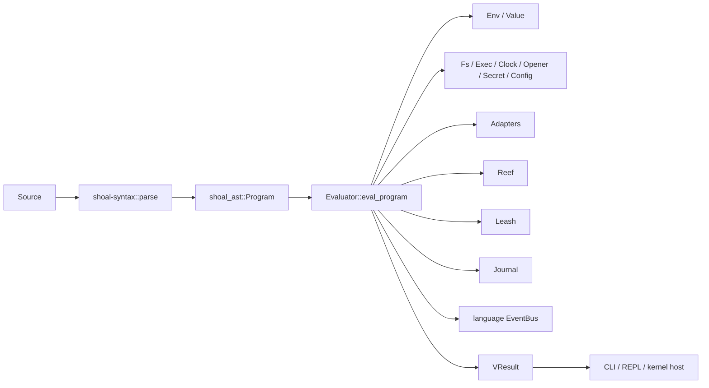
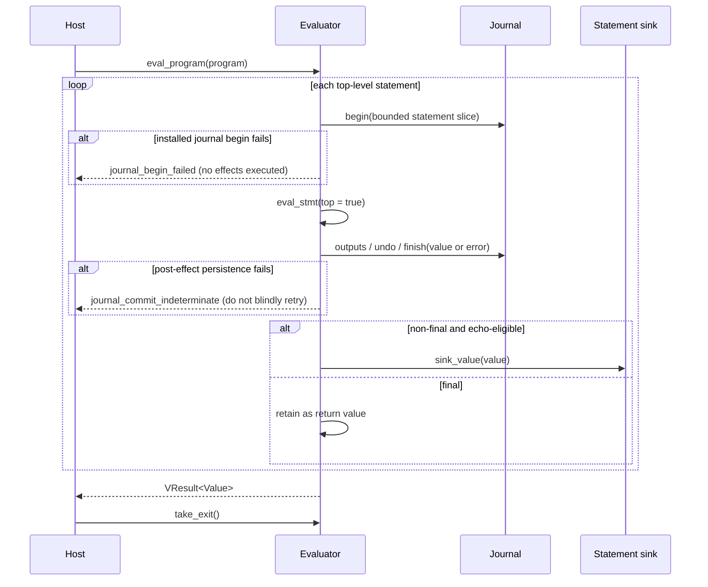
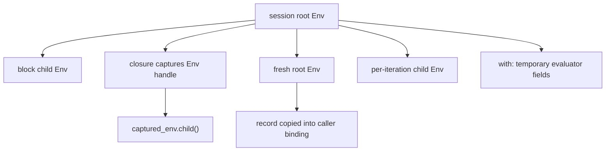
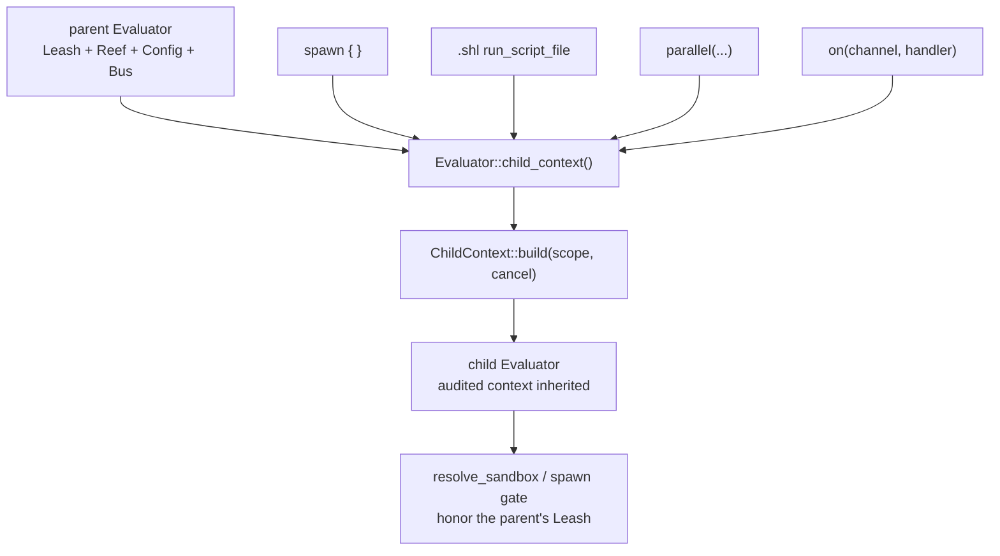

+++
title = "Evaluator state and control flow"
description = "A field-by-field map of the tree-walk evaluator, statement and expression flow, scope transitions, echo semantics, and host boundaries."
weight = 33
template = "docs/page.html"

[extra]
group = "Language & runtime"
eyebrow = "Runtime book"
status = "Source-level evaluator atlas"
audience = "Runtime, language, host, and embedding contributors"
wide = true
+++

`shoal-eval` is the semantic center of Shoal. It consumes the canonical AST, owns one session's
mutable language state, asks effect ports to touch the outside world, and returns runtime values or
typed errors. It is a tree-walk evaluator: there is no bytecode, VM instruction stream, optimizer,
or separate compile phase hidden between parsing and execution.

Primary sources: [`lib.rs`](https://github.com/alliecatowo/shoal/blob/main/crates/shoal-eval/src/lib.rs),
[`stmt.rs`](https://github.com/alliecatowo/shoal/blob/main/crates/shoal-eval/src/stmt.rs), and
[`expr.rs`](https://github.com/alliecatowo/shoal/blob/main/crates/shoal-eval/src/expr.rs).

## The interpreter boundary



The evaluator does **not** own source acquisition, terminal rendering policy, process termination,
kernel framing, or configuration discovery. A host constructs it, installs optional capabilities,
passes a parsed program, and interprets the result plus side-channel requests such as `take_exit()`.

## Complete state ledger

The `Evaluator` struct is a session object, not a disposable visitor. Every field below can affect
later evaluations on the same instance.

| Field | Meaning | Lifetime and sharing rule |
|---|---|---|
| `env` | current lexical environment | swapped for calls/modules; closures retain captured `Env` handles |
| `cwd` | logical working directory | session-local; changed by navigation and temporarily by `with cwd:`/modules |
| `process_env` | environment passed to children | snapshot of `vars_os()` at construction, then session mutations |
| `interactive` | whether interactive behavior is allowed | host-selected |
| `it` | last top-level value | updated after each successful top-level statement |
| `cancel` | cooperative cancellation token | consulted by sleeps, streams, and execution paths |
| `adapters` | discovered adapter catalog | installed by host; participates in command resolution |
| `sink` | renderer callback for statement-position values | optional boxed callback; default renderer otherwise |
| `call_depth` | recursion guard counter | incremented around every callable value; maximum depth 128 |
| `in_fn_body` | function nesting counter | gates ambient `cd` and `env.NAME = ...` mutation |
| `jobs` | `TaskVal` registry | session table for spawned and stopped tasks |
| `external_jobs` | task id to stopped child PID | bridges evaluator tasks to PTY job-control storage |
| `pending_stop` | newest stopped foreground command | consumed by the interactive host for the stop notice |
| `reef_chain` | cached cwd plus discovered scopes | invalidated on cwd/user-manifest change |
| `reef_resolver` | provider stack | injected or built lazily for constrained resolution |
| `reef_lock` | in-memory lockfile | loaded/persisted beside nearest manifest |
| `reef_lock_path` | lock persistence target | absent outside a manifest scope |
| `reef_user_manifest` | optional user scope | host-injected; absent by default |
| `reef_overrides` | dynamic `with reef:` layers | innermost-first stack |
| `journal` | optional SQLite journal handle | deliberately not shared with spawned child evaluators |
| `session_id` | journal session label | ignored without a journal |
| `principal` | journal actor label | `human` or an agent identity by convention |
| `current_entry` | open top-level journal entry | allows nested effects to attach undo records |
| `source` | current program source text | used to slice statement source for journal rows |
| `leash` | active policy and principal | resolves per-spawn sandbox policy |
| `bus` | in-language event bus | `Arc`; shared across spawned/session children |
| `pending_exit` | requested exit status | evaluator stops the program; host performs termination |
| `modules` | canonical path to export value cache | once-per-evaluator module memoization |
| `module_stack` | modules currently loading | circular import detection and diagnostic chain |
| `plans` | derived but unapplied programs | one-based plan references in the session |
| `jump_store` | frecency persistence path | absent by default so noninteractive runs do not write |
| `oldpwd` | directory left by last navigation | exact `PathBuf` used by `cd -` |
| `dir_stack` | directories beneath current cwd | backing state for `pushd`, `popd`, and `dirs` |
| `fs` | filesystem port | `Arc<dyn Fs>`, defaults to `StdFs` |
| `watch` | filesystem event-registration port | `Arc<dyn WatchPort>`, defaults to bounded `StdWatchPort` |
| `exec` | process execution port | `Arc<dyn Exec>`, defaults to `StdExec` |
| `clock` | wall/monotonic time port | `Arc<dyn Clock>`, defaults to `StdClock` |
| `opener` | desktop opener port | `Arc<dyn Opener>`, defaults to `StdOpener` |
| `secrets` | secret retrieval port | `Arc<dyn SecretPort>`, defaults to `StdSecret` |
| `config` | resolved configuration snapshot | `Arc<dyn ConfigPort>`, empty snapshot by default |
| `echo_mode` | intermediate-value policy | `All`, `Commands`, or `Quiet` |

This breadth is why adding state casually is dangerous. Decide whether new state is lexical,
dynamic, session-global, host-global, inherited into children, journaled, or reset for modules. A
field without an explicit rule will eventually behave differently in `spawn`, `source`, module
loading, and kernel sessions.

## Construction defaults are compatibility behavior

`Evaluator::new(cwd)` creates a root environment, snapshots the OS environment, starts with
`interactive = false`, `it = null`, no adapters beyond an empty catalog, and no installed journal
or Leash policy. It installs standard effect ports, creates a shared language bus, and selects
`EchoMode::All`.


The absence of a journal or Leash policy is meaningful. It preserves the embedding and test path:
plain evaluator construction performs no journaling setup and adds no sandbox wrapper. Host code
must opt in explicitly.

## Program evaluation transaction

`eval_program` walks `Program.stmts` in order. For every top-level statement it:

1. opens a journal entry when a journal is installed, rejecting before evaluation if persistence
   fails;
2. calls `eval_stmt(stmt, true)`;
3. records bounded outputs/undo metadata and finishes the entry with either the value or error;
4. converts ordinary `Flow::Value` into the current `it`;
5. emits eligible non-final values, or saves the final value for return;
6. rejects `return`, `break`, or `continue` that escaped their legal context;
7. stops before the next statement when `pending_exit` is set.



The journal completion path runs before the evaluator consumes the statement result, so failed
statements are recorded as failures. Completion is the last persistence step: an earlier output or
undo error cannot stamp a clean-success row. If completion itself fails, the durable append remains
honestly unfinished and the caller receives an indeterminate error that retains the primary
evaluation diagnostic. With no installed journal, all of this remains a no-op. `it` is updated only
after a successful ordinary value. The public `it` field and the transcript
bindings maintained by `record_transcript` are related but not identical: transcript recording is
a host hook that declares `it` and appends to `out` in the environment.

## Internal nonlocal flow

Rust errors represent language failures. A separate private enum represents successful nonlocal
control:

```text
Flow::Value(Value)
Flow::Return(Value)
Flow::Break
Flow::Continue
```

That distinction prevents `return` and loop control from being confused with an `ErrorVal` that a
language `try` might catch. `eval_expr_flow` exists for expressions such as blocks and conditionals
which must preserve the flow marker when evaluated in statement context.


## Statement semantics

| Statement | Main transition | Returned flow/value |
|---|---|---|
| `let` | evaluate initializer, bind pattern in current environment | `null` |
| `fn` | create closure capturing the current `Env`, declare immutable name | `null` |
| `alias` | store an immutable `CmdRef` containing the structured call | `null` |
| `use` | resolve, evaluate, cache, and bind module exports | `null` |
| assignment | evaluate RHS, mutate existing binding or session env | assigned value |
| `return` | evaluate optional expression | `Flow::Return` |
| `break` / `continue` | no value evaluation | corresponding flow marker |
| `for` | convert iterable, bind per-iteration child scope, honor loop flow | `null` |
| `while` | test condition per iteration in child scope | `null` |
| expression | evaluate in statement or value position | expression value/flow |

Functions capture the `Env` handle at declaration time. Since environments are interior-mutable
parent-linked scopes, this is lexical closure capture, not a frozen copy of every visible value.

### Assignment boundary

Although the AST can structurally place any expression on the left side, runtime assignment in
v0.1 accepts only a variable, plus the special `env.NAME = value` form. Field and index mutation are
not implemented. Compound variable assignment reads the current value and delegates to
`shoal_value::ops::binop`.

`env.NAME` accepts only simple `=` and converts through the argv coercion path. It is rejected while
`in_fn_body > 0`; functions should use a dynamic `with env:` context instead of leaking ambient
session changes. This is a semantic restriction, not a parser restriction.

## Expression dispatch order

Expression evaluation is not merely a match over node shapes. Several names have ordered special
resolution rules.

For a variable:


For a function-call node, closure-aware builtins (`parallel`, `retry`, `on`) and evaluator builtins
(`now`, `today`, `assert`, `run`, `save`, `open`) are intercepted before constructors, environment
callables, and command fallback. For a method call, `.feed`, `secret.get`, unshadowed namespaces,
and then generic value methods are checked in that order.

This ordering is part of the language. Adding a new intercepted name can steal a call from a user
binding unless the implementation applies the same shadowing rule as namespaces.

## Position is semantic context

`Position::Statement` and `Position::Value` tell command and binary-chain evaluation whether output
belongs to a top-level rendering context or must remain a composable value. The AST deliberately
does not encode this distinction.


Blocks add another subtlety. They evaluate in a child environment. Intermediate statements can be
discarded or routed to the sink, while the consumed tail expression becomes the block value. Bare
commands in discard context still execute as statement-position work; the tail must not be emitted
and returned twice. Any edit to block evaluation should run the double-echo and command-chain tests.

## Echo and rendering ownership

`EchoMode` controls only intermediate top-level values:

| Mode | Intermediate pure expressions | Intermediate bare commands | Final value |
|---|---:|---:|---|
| `All` | emit | emit | returned to host |
| `Commands` | suppress | emit | host may suppress a non-command final value |
| `Quiet` | suppress | emit | returned to host |

`sink_value` discards `null`. It also suppresses `Outcome` values with `streamed = true`, because a
PTY tee already wrote those bytes to the terminal. Captured externals and builtin outcomes have
`streamed = false` and still need host rendering.

The evaluator never calls `process::exit`. `exit` and `quit` set `pending_exit`; the host calls
`take_exit` and owns process or session shutdown. Preserving that boundary is essential for the
kernel, tests, and library embeddings.

## Scope transitions



The important asymmetry is module loading: it swaps in a fresh root, so caller locals are invisible.
Exported closures retain the module environment after the caller environment is restored. A module
does share the evaluator's effect ports and most session machinery because it runs on the same
`Evaluator`; contributors should not infer isolation from the fresh lexical root.

## Child evaluator inheritance

Fresh child evaluators used by concurrency/script features — `spawn { }` (`script.rs::spawn_block`),
a `.shl` script (`script.rs::run_script_file`), `parallel(...)` (`host.rs::builtin_parallel`), and
`on(channel, handler)` (`channels.rs::builtin_on`) — are built through **one authoritative
constructor** (`child_context.rs`). `Evaluator::child_context` captures the session context currently
audited for inheritance in one place; `ChildContext::build(scope, cancel)` re-applies it to a fresh
evaluator. This is the *only* supported way to derive a child from a parent: there is no partial `inherit_ports`/
`set_bus` seam a call site can under-inherit, and because `build` destructures the captured struct,
forgetting to re-apply a field already captured there is a compile error. A newly added `Evaluator`
field still requires an explicit inheritance decision; the compiler cannot infer that it belongs in
the separate `ChildContext`.

`ChildContext` propagates, by construction: the lexical env (per `ChildScope`), process env, cwd,
adapter catalog, all effect ports (`Fs`/`Exec`/`Clock`/`Opener`/`SecretPort`/`ConfigPort`), the leash
policy/principal, the full reef state (scope chain, resolver, lock + lock path, user manifest, and
`with reef:` overrides), the event bus, and the journal *session identity* (`session_id`/`principal`).
The cancellation token is passed explicitly: `spawn`/`on` wire a *fresh* token to the task's cancel
hook (so cancelling the task cancels the child), while a synchronous `.shl` script and a `parallel`
batch inherit the parent's token (so a host cancel reaches them).

Deliberately *not* inherited — a child gets fresh state, each documented inline at the `build` seam:

| Capability | Inherited? | Reason |
|---|---:|---|
| effect ports + config | yes | fake/test/host behavior must stay consistent |
| adapter catalog | yes | otherwise command resolution diverges |
| event bus | yes | session channels are cross-task coordination |
| leash policy/principal | yes | a child must not escape confinement |
| reef scope/resolver/lock/overrides | yes | constrained tool resolution must not diverge |
| journal session identity | yes | attribution matches the parent |
| lexical env | per `ChildScope` | closure/`spawn`/`parallel`/`on` children inherit; a `.shl` script gets a fresh root so its `let`s do not leak |
| process env / cwd | yes (snapshot) | commands need the caller's dynamic context |
| cancellation token | explicit arg | fresh + task-wired for `spawn`/`on`; parent's for script/`parallel` |
| journal handle | no | parent records the outer invocation; nested/concurrent entry semantics need a synchronized handle or connection factory |
| sink / interactive / echo mode | no | a child returns a value; it never owns the terminal or a renderer |
| per-session tables (`jobs`, `modules`, `plans`, `dir_stack`, `it`, …) | no | a child is its own session |



`crates/shoal-eval/tests/child_context_propagation.rs` pins the security-critical guarantee: a
restrictive leash policy's `proc_spawn` spawn-hash gate denies an unlisted binary identically
foreground and via `spawn`, `parallel`, an `on` handler, and a `.shl` script; an injected config
snapshot is readable in every route (including `spawn`, which formerly dropped the config port); and
parent cancellation reaches the synchronous `parallel`/`.shl` children through the inherited token.
This closes 2026-07-16 audit finding B (HR-B1–B7).

## Filesystem and watcher port boundaries

Filesystem reads, metadata/type/existence probes, canonicalization, directory operations, and
mutations use the injected `Fs`. Watch/tail registration uses the separately injected `WatchPort`;
its standard adapter alone owns `notify` and a bounded raw-event queue. Denial and structural tests
pin both routes. The full inventory lives in the HR-C3 ledger in
[`effects-plans-security.md`](@/internals/effects-plans-security.md).

## Cancellation and error spans

The evaluator carries a `CancelToken`, but individual operations must consult or pass it. A new
long-running loop that never polls cancellation makes host cancellation appear broken even if the
token is correctly set. Process execution, sleep, stream sources, retries, and waits are primary
audit sites.

`eval_expr` records the node span and applies it to errors that do not already carry a more precise
span. Call binding and coercion should preserve the argument/declaration location where possible.
Do not erase a nested error's span merely to attach the outer expression.

## Known sharp edges

- `JobsSnapshot`'s source comment says suspended is always zero, but implementation now counts
  suspended tasks. The code behavior is authoritative; the comment needs correction.
- The evaluator is a large state aggregate, but child creation is funneled through the single
  `ChildContext` constructor (`child_context.rs`). Destructuring prevents forgetting to re-apply a
  field already captured there; adding an `Evaluator` field still requires an inheritance audit and
  an explicit capture when appropriate.
- Module lexical isolation is stronger than effect isolation; a module can still perform effects.
- Command names can be invoked by an otherwise-unbound variable expression, so adding a builtin can
  change an `undefined_var` into execution.
- Assignment AST generality exceeds runtime support.
- Environment visible-name order ultimately comes from hash maps and is not a stable presentation
  contract unless sorted by the caller.
- `echo_mode`, expression `Position`, `Outcome.streamed`, and host rendering form one distributed
  presentation state machine. Changing only one layer commonly creates missing or duplicated output.

## Change protocol

When adding evaluator state or semantics:

1. identify the owning source module and all child evaluator construction sites;
2. write down default, reset, inheritance, persistence, and concurrency behavior;
3. decide whether the change is syntax-visible, runtime-only, or host configuration;
4. preserve `Flow` rather than laundering control into errors or ordinary values;
5. route external work through an existing or new port;
6. attach the narrowest available source span;
7. test REPL statement position and value position separately;
8. test inside a closure, block, module, and spawned child where relevant;
9. test both with and without journal/Leash/config host wiring;
10. update the protocol projection if a new value can cross the kernel boundary.

The safest mental model is that `Evaluator` is a small operating session. Every field participates
in a lifecycle, and every evaluation mode is a different view onto that same lifecycle.
