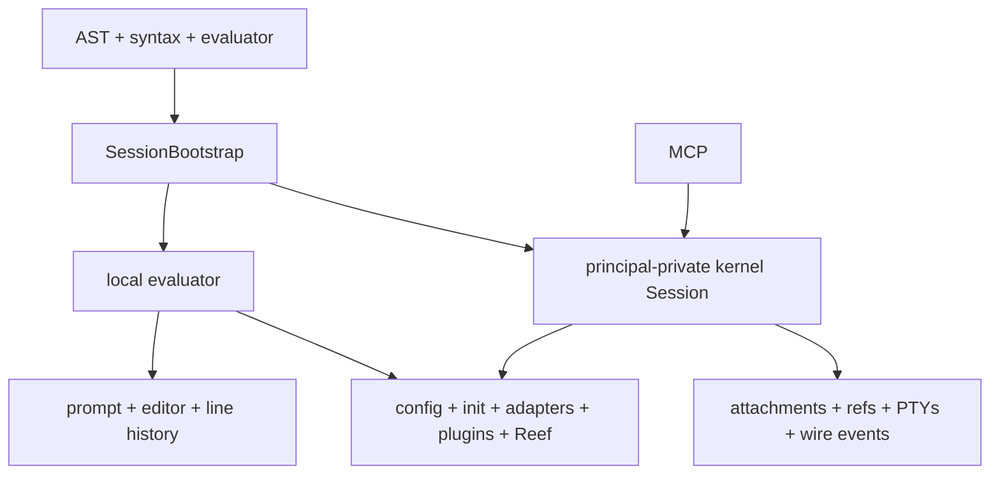
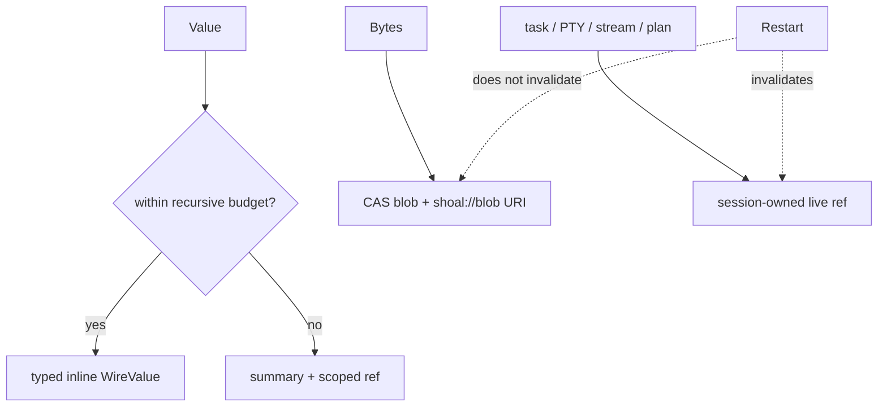

+++
title = "Implementation status and evidence ledger"
description = "A source-audited maturity ledger for every Shoal subsystem, host surface, security boundary, platform promise, and historical design claim."
weight = 121
template = "docs/page.html"

[extra]
group = "Maintenance"
eyebrow = "Reality map"
status = "Reconciled against the hardened branch: 2026-07-17"
audience = "Maintainers, reviewers, and release owners"
wide = true
+++

This page answers one deliberately narrow question: **what is real in the current tree, through
which host, and with what evidence?** It is not a release announcement and it is not a substitute
for executable tests. It reconciles historical design documents with the source so that an old
“done” label cannot quietly become an architecture guarantee.

Read the [system map](../system-map/) first for ownership, the
[change map](../change-map/) before editing a boundary, and the
[roadmap](../roadmap-and-priorities/) for ordered future work. The status vocabulary below is the
same vocabulary future audits should use.

## Status vocabulary

| Label | Meaning | Required evidence |
|---|---|---|
| **Implemented** | The behavior is reachable through at least one real composition root. | Runtime source plus a focused or integration test. |
| **Implemented, host-limited** | The behavior works, but not through every surface implied by broad product prose. | Host matrix names the supported and missing routes. |
| **Partial** | A useful path exists, but an important semantic, authority, lifecycle, or portability requirement is absent. | The missing requirement is stated explicitly. |
| **Scaffolded** | Types, config, protocol, or a leaf implementation exist without an end-to-end caller. | The last real caller and missing edge are named. |
| **Aspirational** | The idea exists only in design prose or an intentionally deferred contract. | No current user-facing claim is made. |
| **Drifted** | Two executable or serialized descriptions disagree. | Both sides and the intended authority are named. |

“Implemented” never means “finished forever.” It means the audited claim is reachable and tested at
the stated scope. A unit-tested leaf with no host caller remains scaffolded. A UI that returns an
honest unavailable error is a correctly implemented error boundary around an incomplete feature.

## Evidence hierarchy

The audit uses this order when sources disagree:

1. public types and reachable runtime branches;
2. integration tests and the normative language corpus;
3. focused unit tests;
4. generated schemas and protocol fixtures;
5. current internal documentation;
6. historical root documents, comments, wiki prose, and remembered demonstrations.

The reconciliation inspected the workspace manifests, all composition roots, the 78 conformance suites,
the kernel router and handlers, MCP mappings, configuration consumers, Reef resolution, prompt
producers, journal schema, and CI definitions. It does **not** certify every OS backend on every
kernel version, every third-party adapter executable, or performance targets on release hardware.

## Executive dashboard

| Area | Status | Strongest current evidence | Material qualification |
|---|---|---|---|
| lexical grammar and parser | Implemented | parser tests, format round trips, conformance corpus | host parse context differs for some statement heads |
| AST and source spans | Implemented | typed AST, parser fixtures, wire span tests | optional outcome spans survive normal and elided wire paths; producers may honestly omit them |
| evaluator and structured values | Implemented | evaluator tests and 1,355 corpus cases | dynamic/opaque values retain tag-level rather than static element schemas |
| builtins and namespaces | Implemented | canonical command precedence plus corpus | namespaces are not first-class callable values |
| process capture | Implemented | real process-group and dual-pipe tests | hash preflight has an exec-time TOCTOU window |
| interactive PTY execution | Implemented, host-limited | Unix PTY integration and REPL tests | Windows/ConPTY is deferred; kernel PTYs are poll-based |
| streams and channels | Implemented, host-limited | evaluator stream/feed tests and live kernel bridge | local process stdin is bounded; wire stream pulling remains unavailable |
| effects and plans | Implemented with enforcement limits | static derivation, policy tests, plan/apply handlers | planning cannot describe every native-program effect; network enforcement is absent |
| Leash filesystem sandbox | Implemented, host-limited | Linux/macOS backend tests and enforcement reporting | network enforcement is unavailable; local malformed-policy mode is permissive |
| task lifecycle | Implemented, execution-form limited | evaluator jobs and kernel process-control tests | pure evaluator tasks have no independently suspendable OS owner |
| modules and script runners | Implemented, host-limited | module/corpus tests and `.shl` execution | non-`.shl` bare path heads require explicit `run` |
| Reef environments | Implemented | resolver/provider/lock/view tests, strict discovery tests, bounded provider runners, and live sandbox integration | metadata-to-open/hash-to-exec races and platform portability remain |
| adapters | Implemented | schema fixtures, bundled catalog, evaluator bindings | external tools and output dialects remain inherently environment-dependent |
| configuration | Implemented, host-limited | typed loader tests and shared host-bootstrap integration | host-specific editor/history/prompt consumers remain intentionally local |
| prompt | Implemented, host-limited | pure renderer snapshots and CLI producer | several context fields are hardcoded or never produced |
| journal and CAS | Implemented | SQLite/CAS/undo/GC/lease tests | live spill ownership is automatic; migrated parent links and archival remain limited |
| kernel JSON-RPC | Implemented with boundedness limits | router/handler tests and daemon tests | raw/blob pages are bounded; most live objects are restart-ephemeral |
| MCP facade | Implemented | live-kernel multiplexing and lifecycle integration | one connection/worker per facade; reconnect cursor replay remains client-driven |
| LSP | Partial | protocol tests and shared builtin names | declarations/completion remain mostly lexical, not evaluator-semantic |
| secrets | Implemented, host-limited | secret value redaction and port tests | storage backend and host coverage are narrow by design |
| WASM | Implemented, preview ABI | evaluator invocation and Wasmtime limit/deadline/admission tests | compilation is byte-bounded and limited to two process-wide jobs with bounded admission wait, but an admitted compile is not interruptible; ABI surface is intentionally narrow |
| Windows | Aspirational | explicit deferred branches | Unix sockets, job control, PTY, sandbox, and path rules need a separate port |

## Host-surface parity

The same syntax crate does not imply the same runtime environment. “Local” below means the
interactive `shoal` REPL or `shoal -c`; “kernel” means direct newline-delimited JSON-RPC;
“MCP” means the stdio facade; “LSP” is editor analysis only.

| Capability | Local shell | `.shl` / `-c` | Kernel | MCP | LSP |
|---|---:|---:|---:|---:|---:|
| parse full language | yes | yes | yes | via tool | yes |
| binding-aware statement-head parse | yes | evaluator-dependent | yes | inherits kernel exec | no |
| evaluate structured values | yes | yes | yes | `shoal_exec` | no |
| persistent evaluator variables | REPL lifetime | process lifetime | named-session lifetime | named-session lifetime | no |
| layered core config | yes | yes | yes | inherits kernel | no |
| init scripts | yes | no | trusted private-human REPL only | no | no |
| rich prompt | yes | n/a | no | no | no |
| bundled/configured adapters | yes | yes | yes | inherits kernel | names only |
| user/project Reef | yes | yes | yes | inherits kernel | no |
| journal per statement | yes | yes | yes | inherits kernel | no |
| coarse exec journal row | no | no | yes | inherits kernel | no |
| effect planning | yes | yes | yes | tool/resource | no |
| approval workflow | local policy path | local policy path | stored plan + apply | tools | no |
| long-lived PTY ref | foreground job model | limited | yes | resource/tool surface | no |
| live event subscription | language channel | language channel | yes | yes | no |
| completion | Reedline | n/a | context-free endpoint | tool route | protocol completion |
| diagnostics with spans | terminal | terminal | structured RPC | structured tool error | diagnostics |

The former composition gap is closed by `shoal-host::SessionBootstrap`: local and kernel evaluators
share config snapshots, aliases/environment, adapters, plugins, and Reef inputs. Surface-owned
behavior remains deliberately different: only an interactive profile runs init; the CLI owns the
prompt/editor/history UI, while the durable kernel owns authenticated attachments, refs, PTYs, and
its coarse execution journal.

## Crate-by-crate maturity ledger

The “proof surface” column names the kind of executable evidence, not an immutable test count.
Test counts should be generated by CI rather than copied into prose.

| Crate | Responsibility | Status | Proof surface | Known boundary |
|---|---|---|---|---|
| `shoal-ast` | source spans and syntax-independent AST | Implemented | syntax and formatter tests consume it | serialized AST changes require wire version review |
| `shoal-syntax` | lexing, two-mode parsing, formatting, builtin identity | Implemented | unit/integration tests and corpus parsing | session exec is binding-aware; public parse/LSP remain context-free |
| `shoal-value` | values, rendering, methods, streams, capability ports | Implemented | method/value/stream tests and corpus | shared task/stream/env state has explicit poison containment; host resources remain process-local |
| `shoal-eval` | scopes, calls, commands, builtins, effects, modules, Reef | Implemented | largest corpus and integration surface | child creation, command-source precedence, and function annotation enforcement are unified |
| `shoal-exec` | capture, process groups, cancellation, PTY, sandbox launch | Implemented on Unix | real subprocess and PTY tests | ConPTY/Windows absent; pin check remains pre-exec |
| `shoal-leash` | effects, plans, policy, enforcement reporting/backends | Implemented, platform-limited | policy unit tests and backend integration | no network containment backend |
| `shoal-journal` | entry lifecycle, CAS, undo, pins, GC, transcript payloads | Implemented | schema migration, kind/parent, CAS, undo, GC tests | statement ordinal and archival/export remain absent |
| `shoal-reef` | manifests, constraints, providers, locks, views, runners | Implemented | provider/resolver/temp-tree and strict discovery tests | interactive discovery is deliberately best-effort; strict execution refuses retained warnings |
| `shoal-adapters` | declarative command schemas and structured parsers | Implemented | fixture and bundled-spec loading tests | correctness depends on third-party output versions |
| `shoal-config` | typed config discovery, merge, env overrides, validation | Implemented | loader/validation tests | multiple accepted fields have no consumer |
| `shoal-prompt` | pure prompt model, style, module rendering | Implemented | snapshots and renderer benchmark | CLI producer omits or hardcodes model fields |
| `shoal-secret` | redacted secret value and storage abstraction | Implemented, narrow | focused value/store tests | not every execution path is capability-injected |
| `shoal-picker` | structured interactive selection | Implemented locally | evaluator/terminal tests | terminal-only and not an agent protocol |
| `shoal-proto` | JSON-RPC shapes, refs, wire values, numeric errors | Implemented | serialization tests | compatibility is preview-only and unversioned beyond AST/security fields |
| `shoal-auth` | token persistence and validation | Implemented, host-limited | multiprocess store tests, live admin RPC tests, and per-request revalidation | most cap labels are descriptive; exact `plan.approve` and `token.admin` checks are handler authority |
| `shoal-kernel` | sessions, RPC, refs, plans, tasks, PTYs, events | Implemented with hardening debt | unit, daemon, restart, and live MCP tests | memory-only live state, coarse/fine rows, compressed-range CPU cost |
| `shoal-mcp` | MCP tools/resources over kernel socket | Implemented | unit and live-kernel multiplex/lifecycle tests | disconnected subscription hubs require client resubscribe/reconciliation |
| `shoal-lsp` | editor diagnostics, completion, symbols | Partial | protocol/unit tests | lexical index cannot model evaluator/module scope fully |
| `shoal-history` | journal inspection CLI | Implemented | targeted lookup/config-root tests through journal API | explicit durable-kernel roots still require `--state-dir` |
| `shoal-doctor` | installation and environment diagnostics | Implemented, platform-limited | focused checks | Unix socket check is explicitly unsupported elsewhere |
| `shoal` | local CLI, REPL, prompt producer, composition root | Implemented | CLI/config/interactive tests | interactive UI remains host-owned; default REPL uses a private kernel |
| `shoal-wasm` | Wasmtime component runtime and ABI v1 | Implemented, narrow | runtime/evaluator integration and adversarial limit tests | host ABI exposes only declared time/read capabilities and command invocation |

## Language implementation matrix

### Syntax and dispatch

| Contract | Status | Evidence | Qualification |
|---|---|---|---|
| CMD/EXPR two-mode grammar | Implemented | parser plus corpus | contextual bindings matter at statement head |
| byte spans | Implemented | tokens, AST, errors | external protocols may convert to UTF-16 or drop them |
| comments, strings, interpolation | Implemented | parser/formatter/corpus | formatter is the canonical re-emission path |
| pipelines and redirection | Implemented | AST/evaluator/corpus | values stay structured only on Shoal-aware edges |
| match and patterns | Implemented | evaluator/corpus | pattern expansion belongs to eval, not parser |
| functions and closures | Implemented | call tests plus function-type conformance matrix | annotations are runtime-checked, not statically inferred |
| modules and exports | Implemented | module integration tests | module cache is evaluator-local and has no hot invalidation |
| interpreter blocks | Implemented | parser and adapter fixtures | parser names and adapter `class` are two authorities |
| formatter round trip | Implemented | syntax tests | semantic comments/trivia behavior remains part of the contract |

The canonical behavioral inventory is the
[language conformance contract](../language-conformance-contract/). The reconciled tree contains
**1,355 cases across 79 suites**. An exact-toolchain run on 2026-07-17 observed **1,351 passed, 0
failed, 4 skipped**. Skips are host-dependent and are not proof of the skipped behavior. The prior
2026-07-16 snapshot remains preserved in explicitly dated audit/reference pages.

### Values and methods

| Value family | Construction/evaluation | methods/render | wire | Important caveat |
|---|---:|---:|---:|---|
| null/bool/int/float | yes | yes | inline | bool dispatch accepts `.str`/`.display`, metadata omits them |
| string/bytes | yes | yes | bounded/elided | text and bytes must not be conflated at OS boundaries |
| path | yes | yes | lossless path form | non-UTF-8 preservation must survive every new conversion |
| list/record/table/range | yes | yes | recursive with budget | sequence metadata advertises `.get` for receivers dispatch rejects |
| duration/datetime/size | yes | yes | typed variants | DateTime wire strings are RFC 3339 via `jiff::Timestamp` display |
| outcome/error | yes | yes | refs/elision | optional outcome spans are preserved; reconstructed/builtin values can have no anchor |
| stream/channel | yes | yes | label/ref only | no wire pull protocol for stream items |
| task/plan/secret | yes | yes | scoped refs/redaction | restart cannot reconstruct live identity-bearing values |

Method metadata and executable dispatch are currently **drifted** in two exact ways:

- `SEQ_METHODS` advertises `.get` for table and range receivers while runtime dispatch accepts only
  list-plus-integer and record-plus-string;
- bool runtime dispatch supports `.str` and `.display`, while bool metadata omits them.

Completion/docs generation must not treat metadata as proven executable truth until a bidirectional
fixture asserts that every advertised receiver/method pair dispatches and every dispatched pair is
advertised. See [value method dispatch](../value-method-dispatch/).

### Namespaces and commands

The builtin **identity** registry is centralized in the syntax crate and consumed by evaluation,
completion, highlighting, and LSP. That portion of the old R4 roadmap is implemented. The actual
resolution sequence for functions, aliases, adapters, Reef tools, interpreter runners, and ambient
`PATH` remains distributed across evaluator modules. It is working behavior, but its precedence is
harder to audit and easier to diverge than one typed resolver result.

Structured namespaces for JSON, YAML, TOML, CSV, math, HTTP, OS, and config are reachable. External
HTTP effects are represented, but Leash has no OS network-enforcement backend; an effect can be
planned/denied without a claim that allowed traffic is network-confined.

## Execution and concurrency matrix

| Path | Status | Cancellation | Backpressure/bounds | Authority notes |
|---|---|---|---|---|
| captured external command | Implemented | process-group escalation | stdout/stderr drained concurrently; capture limits apply | spawn gate and sandbox path are reachable |
| interactive foreground PTY | Implemented on Unix | process group / terminal control | terminal streaming, host-owned | local shell path differs from captured execution |
| kernel long-lived PTY | Implemented | close/drop terminates | read is polling over vt100 screen | scoped to session ID; no change subscription |
| evaluator background task | Implemented | token and job control | output representation is bounded by normal capture | suspend/resume available for owned process |
| kernel async task | Implemented, execution-form limited | cancellation plus process-group suspend/resume | result stored behind ref; task records advertise current controls | evaluator-only work has no independently stoppable OS owner |
| list/table stream source | Implemented | consumer lifecycle | finite | single-consumption semantics |
| watch/tail/every | Implemented | sink-to-source propagation | bounded/coalescing source queues | filesystem watch still touches host APIs directly |
| language channel | Implemented | stream consumer lifecycle | replay/live model | `user.*` bridge prevents spoofing kernel channels |
| kernel EventBus | Implemented with scale limits | unsubscribe/disconnect closes queue | 1,024-event/2 MiB replay ring; 256-event/512 KiB subscriber queues with coalesced count+byte gap summaries | one dedicated writer thread per connection; user identity/payload admission |
| language EventBus | Implemented with scale limits | stream drop closes/prunes its queue | 1,024-event/256 KiB replay ring; 256-event/256 KiB subscriber queues with explicit gap records | 64 channel identities and 64 live subscribers per evaluator; publish fan-out still holds the channel-map mutex |
| stream to command stdin | Implemented for capture mode | command/caller cancellation stops the pump | 16 queued chunks, each at most 64 KiB | PTY mode rejects stream stdin; no wire stream-pull protocol |
| stream over wire | Scaffolded label | no pull cancellation | no cursor/item budget | `WireValue::Stream` is descriptive only |
| WASM invocation | Implemented preview ABI | fuel, epoch deadline, and session cancellation | memory/table/instance/argument/value/hostcall limits plus a two-slot process-wide compiler semaphore | an admitted synchronous component compile is not wall-interruptible |

The former child-context escalation defect is closed: production child evaluators for `spawn`,
parallel, channels, scripts, and streams build through one audited constructor carrying Leash,
principal, Reef, config/ports, and cancellation state. A source-inventory regression test prevents
new direct child construction. Future child factories must extend that explicit boundary.

## Security and authority status

### Authentication and session identity

| Control | Status | Reality |
|---|---|---|
| kernel socket permissions | Implemented | bound socket is set to mode `0600` on Unix |
| persisted bearer tokens | Implemented live lifecycle | fd-locked fresh validation; attached requests revalidate and fail closed on revoke/expiry/store error |
| token profile/cap strings | Informational | returned in attach metadata; no Leash/handler authorization consumes them |
| named-session ownership | Implemented principal-private identity | registry keys are `(principal, visible Session name)`; equal visible names do not share evaluators or quotas |
| task/PTY ref scoping | Implemented exact-owner model | handlers and registries use the same principal+Session owner key |
| live state after restart | intentionally absent | sessions, plans, approvals, tasks, PTYs, refs, and subscriptions are memory-only |

Principal-private keys close the former cross-principal aliasing defect, but they do not turn one
process into a hard hostile-tenant boundary. Principals still share process memory budgets, global
kernel resources, and persisted state roots; mutually hostile tenants need separate OS users,
processes, and state directories.

Token administration has a live serving-state contract. `shoal-token` create/revoke takes an
exclusive fd lock, reloads fresh disk state, and atomically replaces it; validation takes a shared
lock and reads fresh state. The kernel revalidates a bearer before every attached request, clears the
attachment on failure, and therefore observes creation, revocation, expiry, corruption, and I/O
failure without restart. `profile`/`--cap` values are echoed metadata, not enforced grants.

### Effects, policy, and enforcement

| Layer | Status | Honest interpretation |
|---|---|---|
| effect derivation | Implemented for modeled operations | opaque/raw paths remain explicitly opaque |
| plan hashing/storage | Implemented bounded object identity | full source/AST/effects/Session/principal digest plus unique object suffix; ephemeral across restart |
| capability approval caller | Implemented one-shot boundary | attached authorized approver, default separation of duties, durable immutable grant audit |
| journal query caller | Implemented exact-owner boundary | attachment required, principal+Session scoped, server-capped pages; richer `JournalRead` policy remains future work |
| allow/ask/deny policy | Implemented | verdict is not itself OS containment |
| filesystem sandbox | Implemented on supported Linux/macOS paths | enforcement tier reports actual backend result |
| process hash gate | Implemented preflight | content is checked before exec; TOCTOU remains |
| network sandbox | Not implemented | network grants are planning/policy only |
| malformed local policy handling | Implemented fail closed | only a genuinely missing convenience file selects the permissive default; present invalid authority quarantines to deny-all |
| child authority inheritance | Implemented unified constructor | production sites carry principal/policy/Reef/fs/cancellation; future sites are inventory-guarded |
| secret rendering | Implemented | generic render is redacted; review every new serialization/stdin path |
| cap-request honesty | Implemented | response uses the same enforcement truth as attach |
| enforcement preview | Implemented | attach and plan share typed filesystem/network/spawn/hermetic dimensions; activation remains child-local |

No documentation should collapse these layers into the sentence “Leash sandboxes commands.” State
the effect coverage, policy verdict, backend dimensions, and unsupported dimensions separately.

## Protocol and agent surface status

### Kernel router

The router exposes session, parse/complete, exec, value, task, PTY, plan, capability, journal, event,
blob, and explain method families. Attachment and parameter requirements are documented in the
[kernel protocol](../kernel-protocol/). Attachment-scoped journal reads, authenticated one-shot
approval, full non-overwriting owner/content-bound plan identities, and bounded-during-read frame
ingestion and bounded raw/blob paging close the original authority/allocation defects. The following
contract limitations remain:

- raw/blob retrieval is capped at 8 KiB of decoded content per response and requires continuation;
- compressed CAS range reads use bounded memory but verify/decompress sequentially, so distant or
  repeated pages trade memory safety for extra I/O and CPU;
- outcome spans now travel when `OutcomeVal` carries one, including through elision, and are omitted
  honestly when the producer has no source anchor;
- task records advertise race-honest cancel/suspend/resume availability; process-backed control may
  still return `TASK_CONTROL_UNAVAILABLE` after a child exits, and evaluator-only work is never
  advertised as suspendable;
- kernel and in-language events both use count- and byte-bounded subscriber queues with
  explicit/coalesced gap summaries;
- journal and transcript cursors survive restart through durable indexes, while most other state
  does not.

Raw fetch is an explicit pageable contract: `value.get` uses the existing slice units, `blob.get`
uses byte offset/length, and both expose enough metadata to retrieve the complete authorized value.

### MCP facade

Tools and resources map to real kernel methods and have live-kernel integration coverage. MCP does
not embed the evaluator, which keeps one source of runtime truth. One facade-owned subscription hub
multiplexes at most 64 URI routes over one dedicated socket/thread; exact unsubscribe removes routing
state and the final kernel channel membership, while facade drop shuts down and joins the hub.

### Refs and elision

Inline value encoding, recursive budgets, CAS blobs, and scoped dynamic refs are implemented. The
wire must preserve these distinctions:

## Configuration status

The typed loader, precedence rules, environment overrides, validation, aliases, environment, init,
adapter paths, completion settings, history fields, prompt basics, and Reef user scope are real.
The exact schema and consumers live in the [configuration reference](../configuration-reference/).

Consumer scope remains host-specific and must be documented explicitly:

| Field family | Parsed/validated | Host consumer | Status |
|---|---:|---:|---|
| `prompt.*` basic fields | yes | partial | rich prompt separately rereads legacy/template inputs |
| `history.*` | yes | local host | implemented |
| `editor.*` | yes | Reedline host | implemented |
| `completion.*` | yes | local host | implemented |
| `aliases`, `env`, `init` | yes | shared bootstrap; init is profile-enforced interactive-only | implemented with surface-specific init |
| `adapters.*`, `plugins.*` | yes | shared host bootstrap | implemented |
| `reef.*` | yes | shared host bootstrap/resolver | implemented |
| `render.width` | yes | CLI/REPL rendering and paging | implemented locally |
| `kernel.enabled/session` | yes | interactive REPL composition | implemented |
| `journal.enabled/state_dir` | yes | REPL/private kernel, doctor, history; durable kernel uses its CLI state root | implemented, host-specific |
| `leash.policy` | yes | shared host bootstrap/private kernel | implemented; authenticated durable kernel policy remains authoritative |

Core config selects one nearest ancestor project file, while rich prompt loading checks a different
project path rule. Preserve compatibility for legacy `prompt.template`, but converge discovery and
typed ownership rather than keeping two independent parsers.

## Prompt, editor, and LSP status

The prompt crate is correctly pure: a `PromptContext` snapshot enters and rendered lines/styles
leave. This is a strong boundary. The local producer does not yet populate the entire model:

- editing mode is hardcoded to Emacs;
- output mode is hardcoded Human;
- stash count is zero;
- battery and trusted custom module data are gathered outside the render path when configured;
- git status is gathered synchronously rather than from a deferred/event-driven cache.

Reedline completion, highlighting, history, menu/picker, and keybinding paths are implemented. They
share builtin names but duplicate context heuristics. LSP diagnostics and completion work, while
declaration/reference understanding is based on token-level indexing rather than the evaluator’s
module, export, closure, and dynamic command-resolution semantics. The full audit is in
[prompt, editor, and LSP](../prompt-editor-lsp/).

## Reef and adapter status

### Reef

Manifest parsing, ancestor discovery, semver constraints, provider queries, lock records, content
hashing, view construction, runner selection, evaluator resolution, and `which` reporting are real.
Important qualifications:

- interactive discovery warns once and skips malformed/unreadable scopes so diagnosis remains
  possible; noninteractive external execution fails closed while any such warning is retained;
- metadata cache identities include device/inode/mtime/ctime/length, but cannot close the
  metadata-to-open or hash-to-exec race against a hostile concurrent writer;
- an unknown tool constrained to `latest` does not imply exhaustive remote probing;
- provider acquisition can have external partial effects even though lock publication is atomic;
- filesystem sandbox enforcement is platform-dependent and network containment is unavailable.

See the [Reef resolution reference](../reef-resolution/) for the exact pipeline.

### Adapters

Adapters are data-driven command descriptions and output parsers, not magic wrappers around all
versions of a tool. The current tree contains substantially more definitions and command tables than
the older “42 adapters” roadmap count. Catalog size is best generated during the site build or release
process; prose should describe coverage classes and validation rather than freeze a number.

Interpreter-class adapters are real. Their relationship with parser-recognized interpreter blocks
still needs a single discoverable registry or a generated parity test.

## Persistence status

SQLite WAL, version stamping, unfinished rows, zstd-compressed blake3 CAS, output metadata, typed undo
inverses, pins, garbage collection, query filters, and durable transcript payloads are implemented.
The [journal storage reference](../journal-storage-reference/) records the schema and lifecycle.

Two current limitations deserve release-note visibility:

1. schema v2 distinguishes coarse `exec`, fine `statement`, and `approval` rows and links new kernel
   statements to their parent exec, but migrated v1 rows cannot recover historical parent links;
2. the language evaluator now rejects an installed-journal begin failure before effects and reports
   post-effect persistence failure as indeterminate, but direct journal embedders still define their
   own degraded-health policy.

Evaluator spill adoption now uses counted owner leases. Lazy value drop releases them, independent
owners cannot release one another, and applied GC detects crash-stale owner lockfiles before selecting
blobs. Permanent history pins remain explicitly manual.

Crash persistence is intentionally asymmetric: an appended row with `NULL` completion columns
survives; live task/PTY/ref/session objects do not.

## Platform matrix

| Concern | Linux | macOS | Windows | Portability note |
|---|---:|---:|---:|---|
| parser/evaluator/value semantics | primary | supported | largely portable leaf code | OS/path/process tests still required |
| captured subprocesses | yes | yes | no supported contract | process groups/signals are Unix-shaped |
| interactive PTY | yes | yes | deferred | ConPTY needs a distinct backend |
| Unix kernel socket | yes | yes | unsupported | named pipe or TCP/auth design required |
| filesystem sandbox | Landlock/seccomp path | Seatbelt path | absent | enforcement dimensions differ |
| network sandbox | absent | absent | absent | policy-only everywhere |
| symlink-safe undo | supported path | cwd-under-symlink edge open | unreviewed | path identity rules differ |
| filesystem watch | supported backend | supported backend | uncommitted | cancellation and overflow need platform tests |
| non-UTF-8 path contract | Unix raw bytes | Unix raw bytes | different wide-string model | cannot blindly copy Unix encoding |
| CI | Ubuntu | macOS | none | Windows remains an explicit project, not a checkbox |

“Runs on Rust” is not evidence for Windows support. The kernel transport, PTY, job control, signals,
sandbox, executable resolution, path encoding, and undo safety rules all require coherent Windows
design and integration tests.

## Quality and test evidence

### Current evidence

- the conformance corpus is the normative language behavior suite;
- crate unit tests cover leaf invariants and many error paths;
- integration tests exercise interactive CLI, config wiring, process/PTY behavior, daemon restart,
  and a live MCP-to-kernel route;
- CI runs formatting, Clippy, tests, and release builds on Ubuntu and macOS;
- fuzz-target compilation is a blocking PR check; bounded runtime fuzzing runs nightly, and coverage
  remains intentionally smoke-level;
- Criterion commands exist for parser, evaluator, prompt, and wire benchmarks.

The benchmark thresholds in historical `BENCHMARKS.md` are review budgets, not evidence that the
current commit meets them on a standardized machine. The site’s
[tooling and quality](../tooling-and-quality/) page preserves exact commands and separates measured
results from desired ceilings.

### Known quality gaps

- every workspace member inherits the workspace lint table; stronger deferred lints still have live
  violations and are tracked rather than enabled decoratively;
- two corpus harnesses duplicate fixture/schema behavior;
- highlighter tests isolate and restore `NO_COLOR`, so ambient color policy no longer changes them;
- test presence is uneven across crates, with significant inline unit coverage that directory counts
  do not reveal;
- protocol framing, slow-consumer gap accounting, principal isolation, child-capability inheritance,
  poison quarantine, plugin deadlines, and bounded raw/blob paging have dedicated adversarial tests;
  broader OS/platform matrices remain coverage and design gaps.

## Historical-document reconciliation

These root documents were valuable design inputs. Their durable material has been absorbed into the
internal atlas; their counts and status language are not current authority.

| Historical document | Durable intent | Current canonical home | Claim that needed correction |
|---|---|---|---|
| `docs/VISION.md` | typed values, explicit effects, shared agent/human semantics | system map, value/effect pages | the default REPL now executes through an isolated private kernel, while durable machine kernels remain a separate trust/state domain |
| `docs/ROADMAP.md` | wave rationale and original acceptance criteria | this page and roadmap | “done” waves concealed host/security/lifecycle qualifications; counts were stale |
| `docs/TDD.md` | grammar, semantics, errors, edge rulings | language conformance contract | old corpus count and some later feature statuses drifted |
| `docs/STREAMS.md` | one stream model, explicit consumption/backpressure | streams and channels | bounded stream-to-stdin is implemented; wire pulling remains absent |
| `docs/IO.md` | typed stdin, interpreter blocks, runner UX | process execution, calls/modules, Reef | bare path auto-run remains `.shl`-only |
| `docs/REEF.md` | reproducible scope/lock/provider/view model | Reef resolution | historical design remains less precise than the canonical reference |
| `docs/CONFIG.md` | typed layered configuration | configuration reference | several documented keys parse but do nothing |
| `docs/AGENT-SURFACE.md` | refs, elision, events, tools, PTYs | kernel protocol and agent/MCP | raw fetch bounds, subscription cost, and restart limits needed qualification |
| `docs/CONTRACTS.md` | public APIs and dependency direction | intercrate protocol contracts | some pinned prose lagged current types and wire behavior |
| `docs/BENCHMARKS.md` | performance budgets and commands | tooling and quality | targets were not continuously measured assertions |

### Historical wave disposition

| Old wave | Honest current disposition |
|---|---|
| R0 interactive ergonomics | Implemented on the local shell; host-specific exit/render behavior remains deliberately owned there. |
| R1 streams/channels | Core language path and bounded stream stdin are implemented; wire pulling and cross-surface scaling remain open. |
| R2 namespaces/builtins | Implemented; security meaning of network effects remains policy-only. |
| R3 modules/tasks/plan/undo | Mostly implemented; child authority inheritance and process-backed kernel task control are complete, while task identity models remain split. |
| R4 ports/modularization | Structural split, effect ports, canonical command-source precedence, and method metadata parity are implemented; some direct host calls remain. |
| R5 corpus/docs/polish | Corpus target exceeded; this Zola atlas replaces duplicated wiki/root status prose; polish is continuous. |

## Release claim checklist

Before calling a subsystem “done,” answer all of these with links to executable evidence:

1. Which composition roots can reach it?
2. Which configuration or capability state reaches those roots?
3. Which values, errors, and spans survive local, kernel, and MCP boundaries?
4. Which queues, frames, collections, and outputs have hard bounds?
5. What happens on cancellation, disconnect, crash, and restart?
6. Which principal owns each session, ref, plan, blob, task, and PTY?
7. Which effect is derived and which OS backend enforces it?
8. What is advisory, unavailable, or platform-specific?
9. Which focused invariant test and which live-boundary test prove it?
10. Which diagrams, public docs, protocol fixtures, and migration notes changed?

## Highest-impact open findings

This is a status list, not the work order; ordering and exit criteria live in the roadmap.

1. Reef metadata-to-open/hash-to-exec atomicity and cross-platform containment remain incomplete;
2. filesystem/network sandbox coverage is platform- and effect-limited;
3. plugin ABI v1 is deliberately narrow, and admitted synchronous component compilation cannot be
   preempted even though input bytes, concurrent jobs, and admission wait are bounded;
4. kernel quotas and separate evaluator budgets bound retained sessions, 64 native workers per
   session (512 process-wide), 256 executable plans, and 1,024 memoized modules; these remain
   independent admission systems rather than one universal executor;
5. Windows remains a separate architecture project.

## Audit maintenance protocol

Update this ledger in the same change that changes reachability or removes a qualification. Do not
replace an explicit caveat with “fixed” unless the new proof includes the lowest invariant and the
real composition boundary. If a feature becomes intentionally unsupported, documenting and testing
the error is better than preserving an unreachable status claim.
