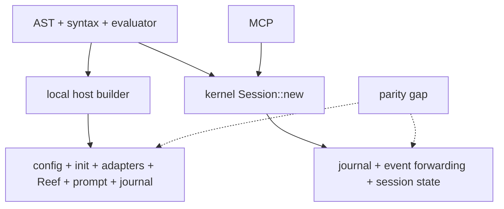
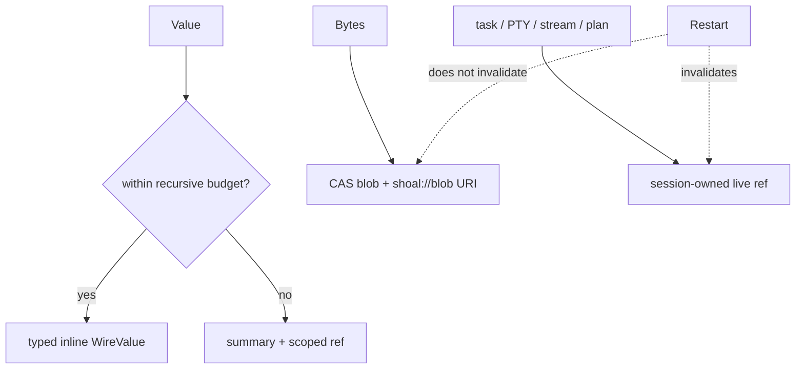

+++
title = "Implementation status and evidence ledger"
description = "A source-audited maturity ledger for every Shoal subsystem, host surface, security boundary, platform promise, and historical design claim."
weight = 121
template = "docs/page.html"

[extra]
group = "Maintenance"
eyebrow = "Reality map"
status = "Audit snapshot: 2026-07-16"
audience = "Maintainers, reviewers, and release owners"
wide = true
+++

This page answers one deliberately narrow question: **what is real in the current tree, through
which host, and with what evidence?** It is not a release announcement and it is not a substitute
for executable tests. It reconciles historical design documents with the source so that an old
“done” label cannot quietly become an architecture guarantee.

Read the [system map](../system-map/) first for ownership, the
[change map](../change-map/) before editing a boundary, and the
[roadmap](../roadmap-and-priorities/) for ordered future work. The status vocabulary below is the
same vocabulary future audits should use.

## Status vocabulary

| Label | Meaning | Required evidence |
|---|---|---|
| **Implemented** | The behavior is reachable through at least one real composition root. | Runtime source plus a focused or integration test. |
| **Implemented, host-limited** | The behavior works, but not through every surface implied by broad product prose. | Host matrix names the supported and missing routes. |
| **Partial** | A useful path exists, but an important semantic, authority, lifecycle, or portability requirement is absent. | The missing requirement is stated explicitly. |
| **Scaffolded** | Types, config, protocol, or a leaf implementation exist without an end-to-end caller. | The last real caller and missing edge are named. |
| **Aspirational** | The idea exists only in design prose or an intentionally deferred contract. | No current user-facing claim is made. |
| **Drifted** | Two executable or serialized descriptions disagree. | Both sides and the intended authority are named. |

“Implemented” never means “finished forever.” It means the audited claim is reachable and tested at
the stated scope. A unit-tested leaf with no host caller remains scaffolded. A UI that returns an
honest unavailable error is a correctly implemented error boundary around an incomplete feature.

## Evidence hierarchy

The audit uses this order when sources disagree:

1. public types and reachable runtime branches;
2. integration tests and the normative language corpus;
3. focused unit tests;
4. generated schemas and protocol fixtures;
5. current internal documentation;
6. historical root documents, comments, wiki prose, and remembered demonstrations.

The snapshot inspected the workspace manifests, all composition roots, the 77 conformance suites,
the kernel router and handlers, MCP mappings, configuration consumers, Reef resolution, prompt
producers, journal schema, and CI definitions. It does **not** certify every OS backend on every
kernel version, every third-party adapter executable, or performance targets on release hardware.

## Executive dashboard

| Area | Status | Strongest current evidence | Material qualification |
|---|---|---|---|
| lexical grammar and parser | Implemented | parser tests, format round trips, conformance corpus | host parse context differs for some statement heads |
| AST and source spans | Implemented | typed AST, parser fixtures, wire span tests | optional outcome spans survive normal and elided wire paths; producers may honestly omit them |
| evaluator and structured values | Implemented | evaluator tests and 1,310 corpus cases | function type checking and method metadata have holes |
| builtins and namespaces | Implemented | canonical builtin identity registry and corpus | broader command resolution remains distributed |
| process capture | Implemented | real process-group and dual-pipe tests | hash preflight has an exec-time TOCTOU window |
| interactive PTY execution | Implemented, host-limited | Unix PTY integration and REPL tests | Windows/ConPTY is deferred; kernel PTYs are poll-based |
| streams and channels | Implemented, host-limited | evaluator stream tests and live kernel bridge | stream-to-stdin and wire item pulling are absent |
| effects and plans | Partial authority | static derivation, policy tests, plan/apply handlers | `cap.request` is unattached; plan refs collide for equal effect shapes |
| Leash filesystem sandbox | Implemented, host-limited | Linux/macOS backend tests and enforcement reporting | network enforcement is unavailable; local malformed-policy mode is permissive |
| task lifecycle | Partial | evaluator jobs and kernel async task tests | kernel suspend/resume returns `TASK_CONTROL_UNAVAILABLE` |
| modules and script runners | Implemented, host-limited | module/corpus tests and `.shl` execution | non-`.shl` bare path heads require explicit `run` |
| Reef environments | Implemented | resolver/provider/lock/view tests and evaluator integration | discovery/cache/persistence fail-soft edges remain |
| adapters | Implemented | schema fixtures, bundled catalog, evaluator bindings | external tools and output dialects remain inherently environment-dependent |
| configuration | Implemented, host-limited | typed loader tests and CLI wiring integration | accepted `kernel`, `journal`, `render.width`, and `leash.policy` fields are inert |
| prompt | Implemented, host-limited | pure renderer snapshots and CLI producer | several context fields are hardcoded or never produced |
| journal and CAS | Implemented | SQLite/CAS/undo/GC tests | dual row granularity and permanent spill pins complicate lifecycle |
| kernel JSON-RPC | Implemented with authority defects | router/handler tests and daemon tests | unattached approval/journal calls, named-session ownership, frame allocation |
| MCP facade | Implemented | live-kernel integration | unsubscribe does not terminate the subscription worker |
| LSP | Partial | protocol tests and shared builtin names | declarations/completion remain mostly lexical, not evaluator-semantic |
| secrets | Implemented, host-limited | secret value redaction and port tests | storage backend and host coverage are narrow by design |
| WASM | Scaffolded | isolated Wasmtime limit tests | no evaluator invocation path or wall-clock deadline |
| Windows | Aspirational | explicit deferred branches | Unix sockets, job control, PTY, sandbox, and path rules need a separate port |

## Host-surface parity

The same syntax crate does not imply the same runtime environment. “Local” below means the
interactive `shoal` REPL or `shoal -c`; “kernel” means direct newline-delimited JSON-RPC;
“MCP” means the stdio facade; “LSP” is editor analysis only.

| Capability | Local shell | `.shl` / `-c` | Kernel | MCP | LSP |
|---|---:|---:|---:|---:|---:|
| parse full language | yes | yes | yes | via tool | yes |
| binding-aware statement-head parse | yes | evaluator-dependent | no | inherits kernel | no |
| evaluate structured values | yes | yes | yes | `shoal_exec` | no |
| persistent evaluator variables | REPL lifetime | process lifetime | named-session lifetime | named-session lifetime | no |
| layered core config | yes | yes | no | no | no |
| init scripts | yes | yes | no | no | no |
| rich prompt | yes | n/a | no | no | no |
| bundled adapters | yes | yes | not assembled by session builder | inherits kernel | names only |
| user/project Reef | yes | yes | incomplete host assembly | inherits kernel | no |
| journal per statement | yes | yes | yes | inherits kernel | no |
| coarse exec journal row | no | no | yes | inherits kernel | no |
| effect planning | yes | yes | yes | tool/resource | no |
| approval workflow | local policy path | local policy path | stored plan + apply | tools | no |
| long-lived PTY ref | foreground job model | limited | yes | resource/tool surface | no |
| live event subscription | language channel | language channel | yes | yes | no |
| completion | Reedline | n/a | context-free endpoint | tool route | protocol completion |
| diagnostics with spans | terminal | terminal | structured RPC | structured tool error | diagnostics |

The most important parity gap is composition, not parsing: the CLI installs config, aliases,
environment, init scripts, adapters, prompt state, journal/frecency, and Reef scopes independently;
the kernel session constructor installs a smaller subset. A shared evaluator builder is therefore a
prerequisite for claiming one language environment across human and agent surfaces.

## Crate-by-crate maturity ledger

The “proof surface” column names the kind of executable evidence, not an immutable test count.
Test counts should be generated by CI rather than copied into prose.

| Crate | Responsibility | Status | Proof surface | Known boundary |
|---|---|---|---|---|
| `shoal-ast` | source spans and syntax-independent AST | Implemented | syntax and formatter tests consume it | serialized AST changes require wire version review |
| `shoal-syntax` | lexing, two-mode parsing, formatting, builtin identity | Implemented | unit/integration tests and corpus parsing | `ParseCtx` availability differs by host |
| `shoal-value` | values, rendering, methods, streams, capability ports | Implemented | method/value/stream tests and corpus | direct host filesystem calls remain beside `Fs` |
| `shoal-eval` | scopes, calls, commands, builtins, effects, modules, Reef | Implemented | largest corpus and integration surface | child creation and command resolution are duplicated |
| `shoal-exec` | capture, process groups, cancellation, PTY, sandbox launch | Implemented on Unix | real subprocess and PTY tests | ConPTY/Windows absent; pin check remains pre-exec |
| `shoal-leash` | effects, plans, policy, enforcement reporting/backends | Implemented, platform-limited | policy unit tests and backend integration | no network containment backend |
| `shoal-journal` | entry lifecycle, CAS, undo, pins, GC, transcript payloads | Implemented | schema, CAS, undo, GC tests | schema v1 has no row-kind/parent relation |
| `shoal-reef` | manifests, constraints, providers, locks, views, runners | Implemented | provider/resolver/temp-tree tests | permissive discovery can hide malformed scopes |
| `shoal-adapters` | declarative command schemas and structured parsers | Implemented | fixture and bundled-spec loading tests | correctness depends on third-party output versions |
| `shoal-config` | typed config discovery, merge, env overrides, validation | Implemented | loader/validation tests | multiple accepted fields have no consumer |
| `shoal-prompt` | pure prompt model, style, module rendering | Implemented | snapshots and renderer benchmark | CLI producer omits or hardcodes model fields |
| `shoal-secret` | redacted secret value and storage abstraction | Implemented, narrow | focused value/store tests | not every execution path is capability-injected |
| `shoal-picker` | structured interactive selection | Implemented locally | evaluator/terminal tests | terminal-only and not an agent protocol |
| `shoal-proto` | JSON-RPC shapes, refs, wire values, numeric errors | Implemented with drift | serialization tests | DateTime producer violates its RFC3339 comment |
| `shoal-auth` | token persistence and validation | Partial lifecycle | token tests and kernel attach path | kernel snapshots store at startup; create/revoke require restart; profile/caps are metadata only |
| `shoal-kernel` | sessions, RPC, refs, plans, tasks, PTYs, events | Implemented with hardening debt | unit, daemon, restart, and live MCP tests | memory-only live state, coarse/fine rows, pre-cap frame allocation |
| `shoal-mcp` | MCP tools/resources over kernel socket | Implemented | unit and live-kernel tests | subscription cancellation ownership is missing |
| `shoal-lsp` | editor diagnostics, completion, symbols | Partial | protocol/unit tests | lexical index cannot model evaluator/module scope fully |
| `shoal-history` | journal inspection CLI | Implemented | CLI behavior through journal API | by-ID lookup scans a broad query; state root differs |
| `shoal-doctor` | installation and environment diagnostics | Implemented, platform-limited | focused checks | Unix socket check is explicitly unsupported elsewhere |
| `shoal` | local CLI, REPL, prompt producer, composition root | Implemented | CLI/config/interactive tests | composition duplicates kernel setup |
| `shoal-wasm` | isolated Wasmtime runtime limits | Scaffolded | leaf tests | no evaluator, value, effect, or host ABI integration |

## Language implementation matrix

### Syntax and dispatch

| Contract | Status | Evidence | Qualification |
|---|---|---|---|
| CMD/EXPR two-mode grammar | Implemented | parser plus corpus | contextual bindings matter at statement head |
| byte spans | Implemented | tokens, AST, errors | external protocols may convert to UTF-16 or drop them |
| comments, strings, interpolation | Implemented | parser/formatter/corpus | formatter is the canonical re-emission path |
| pipelines and redirection | Implemented | AST/evaluator/corpus | values stay structured only on Shoal-aware edges |
| match and patterns | Implemented | evaluator/corpus | pattern expansion belongs to eval, not parser |
| functions and closures | Partial | call/corpus tests | scalar annotations and return annotations are not uniformly enforced |
| modules and exports | Implemented | module integration tests | module cache and child context need coordinated invalidation/inheritance |
| interpreter blocks | Implemented | parser and adapter fixtures | parser names and adapter `class` are two authorities |
| formatter round trip | Implemented | syntax tests | semantic comments/trivia behavior remains part of the contract |

The canonical behavioral inventory is the
[language conformance contract](../language-conformance-contract/). At this audit the corpus contains
**1,310 cases across 77 suites**. The observed harness result was **1,306 passed, 0 failed, 4
skipped**; skips are host-dependent and are not counted as proof of the skipped behavior. Never copy
the older 1,218/74 figure from the retired roadmap back into current docs.

### Values and methods

| Value family | Construction/evaluation | methods/render | wire | Important caveat |
|---|---:|---:|---:|---|
| null/bool/int/float | yes | yes | inline | bool dispatch accepts `.str`/`.display`, metadata omits them |
| string/bytes | yes | yes | bounded/elided | text and bytes must not be conflated at OS boundaries |
| path | yes | yes | lossless path form | non-UTF-8 preservation must survive every new conversion |
| list/record/table/range | yes | yes | recursive with budget | sequence metadata advertises `.get` for receivers dispatch rejects |
| duration/datetime/size | yes | yes | typed variants | kernel DateTime currently emits Unix seconds as a string |
| outcome/error | yes | yes | refs/elision | optional outcome spans are preserved; reconstructed/builtin values can have no anchor |
| stream/channel | yes | yes | label/ref only | no wire pull protocol for stream items |
| task/plan/secret | yes | yes | scoped refs/redaction | restart cannot reconstruct live identity-bearing values |

Method metadata and executable dispatch are currently **drifted** in two exact ways:

- `SEQ_METHODS` advertises `.get` for table and range receivers while runtime dispatch accepts only
  list-plus-integer and record-plus-string;
- bool runtime dispatch supports `.str` and `.display`, while bool metadata omits them.

Completion/docs generation must not treat metadata as proven executable truth until a bidirectional
fixture asserts that every advertised receiver/method pair dispatches and every dispatched pair is
advertised. See [value method dispatch](../value-method-dispatch/).

### Namespaces and commands

The builtin **identity** registry is centralized in the syntax crate and consumed by evaluation,
completion, highlighting, and LSP. That portion of the old R4 roadmap is implemented. The actual
resolution sequence for functions, aliases, adapters, Reef tools, interpreter runners, and ambient
`PATH` remains distributed across evaluator modules. It is working behavior, but its precedence is
harder to audit and easier to diverge than one typed resolver result.

Structured namespaces for JSON, YAML, TOML, CSV, math, HTTP, OS, and config are reachable. External
HTTP effects are represented, but Leash has no OS network-enforcement backend; an effect can be
planned/denied without a claim that allowed traffic is network-confined.

## Execution and concurrency matrix

| Path | Status | Cancellation | Backpressure/bounds | Authority notes |
|---|---|---|---|---|
| captured external command | Implemented | process-group escalation | stdout/stderr drained concurrently; capture limits apply | spawn gate and sandbox path are reachable |
| interactive foreground PTY | Implemented on Unix | process group / terminal control | terminal streaming, host-owned | local shell path differs from captured execution |
| kernel long-lived PTY | Implemented | close/drop terminates | read is polling over vt100 screen | scoped to session ID; no change subscription |
| evaluator background task | Implemented | token and job control | output representation is bounded by normal capture | suspend/resume available for owned process |
| kernel async task | Partial | cancel exists | result stored behind ref | suspend/resume explicitly unavailable |
| list/table stream source | Implemented | consumer lifecycle | finite | single-consumption semantics |
| watch/tail/every | Implemented | sink-to-source propagation | bounded/coalescing source queues | filesystem watch still touches host APIs directly |
| language channel | Implemented | stream consumer lifecycle | replay/live model | `user.*` bridge prevents spoofing kernel channels |
| kernel EventBus | Implemented with scale limits | unsubscribe/disconnect closes queue | 1,024 replay ring; 256-event subscriber queues with coalesced gap summaries | one dedicated writer thread per subscription |
| language EventBus | Partial | stream drop prunes sender | 1,024 replay ring; live `mpsc` subscriber queues are unbounded | clones/sends while holding the channel-map mutex |
| stream to command stdin | Aspirational | — | — | returns `type_error`: not implemented |
| stream over wire | Scaffolded label | no pull cancellation | no cursor/item budget | `WireValue::Stream` is descriptive only |
| WASM invocation | Scaffolded | fuel only in leaf | memory/table/instance limits | no evaluator caller or wall deadline |

The former child-context escalation defect is closed: production child evaluators for `spawn`,
parallel, channels, scripts, and streams build through one audited constructor carrying Leash,
principal, Reef, config/ports, and cancellation state. A source-inventory regression test prevents
new direct child construction. Future child factories must extend that explicit boundary.

## Security and authority status

### Authentication and session identity

| Control | Status | Reality |
|---|---|---|
| kernel socket permissions | Implemented | bound socket is set to mode `0600` on Unix |
| persisted bearer tokens | Partial lifecycle | `TokenStore::validate` gates attach, but the kernel never reloads external create/revoke writes |
| token profile/cap strings | Informational | returned in attach metadata; no Leash/handler authorization consumes them |
| named-session ownership | Unsafe partial | the principal is used when a session name is first created; later principals can receive the same session |
| task/PTY ref scoping | Implemented within session model | handlers compare session identity; inherited session ownership weakness still matters |
| live state after restart | intentionally absent | sessions, plans, approvals, tasks, PTYs, refs, and subscriptions are memory-only |

Session identity must be fixed before treating names as tenant boundaries. Either key sessions by
authenticated owner plus name or persist an explicit ACL and reject unauthorized attach. A journal
principal column does not repair access control after a shared evaluator has already been returned.

Token administration also needs an honest serving-state contract. `shoal-token` atomically rewrites
disk state, while the kernel retains the `TokenStore` it opened at startup. A newly created token is
unusable and a newly revoked token can remain usable until kernel restart; only expiry is checked
against current time on each validation. `profile`/`--cap` values are echoed, not enforced.

### Effects, policy, and enforcement

| Layer | Status | Honest interpretation |
|---|---|---|
| effect derivation | Implemented for modeled operations | opaque/raw paths remain explicitly opaque |
| plan hashing/storage | Implemented bounded object identity | full source/AST/effects/Session/principal digest plus unique object suffix; ephemeral across restart |
| capability approval caller | Implemented one-shot boundary | attached authorized approver, default separation of duties, durable immutable grant audit |
| journal query caller | Implemented exact-owner boundary | attachment required, principal+Session scoped, server-capped pages; richer `JournalRead` policy remains future work |
| allow/ask/deny policy | Implemented | verdict is not itself OS containment |
| filesystem sandbox | Implemented on supported Linux/macOS paths | enforcement tier reports actual backend result |
| process hash gate | Implemented preflight | content is checked before exec; TOCTOU remains |
| network sandbox | Not implemented | network grants are planning/policy only |
| malformed local policy handling | Risky partial | convenience loader can fall back to permissive |
| child authority inheritance | Implemented unified constructor | production sites carry principal/policy/Reef/fs/cancellation; future sites are inventory-guarded |
| secret rendering | Implemented | generic render is redacted; review every new serialization/stdin path |
| cap-request honesty | Implemented | response uses the same enforcement truth as attach |

No documentation should collapse these layers into the sentence “Leash sandboxes commands.” State
the effect coverage, policy verdict, backend dimensions, and unsupported dimensions separately.

## Protocol and agent surface status

### Kernel router

The router exposes session, parse/complete, exec, value, task, PTY, plan, capability, journal, event,
blob, and explain method families. Attachment and parameter requirements are documented in the
[kernel protocol](../kernel-protocol/). Attachment-scoped journal reads, authenticated one-shot
approval, full non-overwriting owner/content-bound plan identities, and bounded-during-read frame
ingestion close the original authority/allocation defects. The following contract limitations remain:

- `value.get` with `format = "raw"` can return full `raw_base64` without the ordinary 64 KiB clamp;
- MCP does not special-case that raw payload, so the bypass crosses the facade;
- DateTime wire values are documented as RFC3339 but produced as Unix-second decimal strings;
- outcome spans now travel when `OutcomeVal` carries one, including through elision, and are omitted
  honestly when the producer has no source anchor;
- `task.suspend` and `task.resume` return `TASK_CONTROL_UNAVAILABLE`;
- kernel live events use bounded 256-event subscriber queues and coalesced gap summaries, but the
  separate in-language EventBus still uses unbounded subscriber channels;
- journal and transcript cursors survive restart through durable indexes, while most other state
  does not.

The raw-fetch path is not automatically wrong—agents sometimes need exact bytes—but it needs its own
explicit offset/length budget or blob/ref resource contract. “Raw” must not mean “unbounded.”

### MCP facade

Tools and resources map to real kernel methods and have live-kernel integration coverage. MCP does
not embed the evaluator, which keeps one source of runtime truth. However, resource unsubscribe
currently acknowledges without owning and terminating the dedicated subscription connection/thread.
Repeated subscribe/unsubscribe therefore has a lifecycle leak until the facade stores cancellation
handles.

### Refs and elision

Inline value encoding, recursive budgets, CAS blobs, and scoped dynamic refs are implemented. The
wire must preserve these distinctions:

## Configuration status

The typed loader, precedence rules, environment overrides, validation, aliases, environment, init,
adapter paths, completion settings, history fields, prompt basics, and Reef user scope are real.
The exact schema and consumers live in the [configuration reference](../configuration-reference/).

Accepted-but-inert fields are a contract problem:

| Field family | Parsed/validated | Host consumer | Status |
|---|---:|---:|---|
| `prompt.*` basic fields | yes | partial | rich prompt separately rereads legacy/template inputs |
| `history.*` | yes | local host | implemented |
| `editor.*` | yes | Reedline host | implemented |
| `completion.*` | yes | local host | implemented |
| `aliases`, `env`, `init` | yes | local builder | implemented locally |
| `adapters.*` | yes | local builder | implemented locally |
| `reef.*` | yes | local builder/resolver | implemented locally |
| `render.width` | yes | none found | inert |
| `kernel.*` | yes | none found | inert |
| `journal.*` | yes | none found | inert |
| `leash.policy` | yes | none found | inert |

Core config selects one nearest ancestor project file, while rich prompt loading checks a different
project path rule. Preserve compatibility for legacy `prompt.template`, but converge discovery and
typed ownership rather than keeping two independent parsers.

## Prompt, editor, and LSP status

The prompt crate is correctly pure: a `PromptContext` snapshot enters and rendered lines/styles
leave. This is a strong boundary. The local producer does not yet populate the entire model:

- editing mode is hardcoded to Emacs;
- multiline is hardcoded false;
- output mode is hardcoded Human;
- stash count is zero;
- battery and custom module data are not gathered;
- git status is gathered synchronously rather than from a deferred/event-driven cache.

Reedline completion, highlighting, history, menu/picker, and keybinding paths are implemented. They
share builtin names but duplicate context heuristics. LSP diagnostics and completion work, while
declaration/reference understanding is based on token-level indexing rather than the evaluator’s
module, export, closure, and dynamic command-resolution semantics. The full audit is in
[prompt, editor, and LSP](../prompt-editor-lsp/).

## Reef and adapter status

### Reef

Manifest parsing, ancestor discovery, semver constraints, provider queries, lock records, content
hashing, view construction, runner selection, evaluator resolution, and `which` reporting are real.
Important qualifications:

- a manifest with an empty `tools` table can be dropped even when runner/hermetic-only options
  should arguably define a scope;
- normal discovery skips malformed or unreadable manifests rather than surfacing a diagnostic;
- evaluator scope caching is keyed too coarsely around cwd and lacks a robust ChainKey/mtime
  invalidation model;
- an unknown tool constrained to `latest` does not imply exhaustive remote probing;
- lock persistence errors can be swallowed;
- version probes may execute before Leash policy evaluation;
- view identity hashes names/paths rather than executable contents.

See the [Reef resolution reference](../reef-resolution/) for the exact pipeline.

### Adapters

Adapters are data-driven command descriptions and output parsers, not magic wrappers around all
versions of a tool. The current tree contains substantially more definitions and command tables than
the older “42 adapters” roadmap count. Catalog size is best generated during the site build or release
process; prose should describe coverage classes and validation rather than freeze a number.

Interpreter-class adapters are real. Their relationship with parser-recognized interpreter blocks
still needs a single discoverable registry or a generated parity test.

## Persistence status

SQLite WAL, version stamping, unfinished rows, zstd-compressed blake3 CAS, output metadata, typed undo
inverses, pins, garbage collection, query filters, and durable transcript payloads are implemented.
The [journal storage reference](../journal-storage-reference/) records the schema and lifecycle.

Four current limitations deserve release-note visibility:

1. kernel execution writes a coarse whole-submission row while the embedded evaluator writes fine
   per-statement rows into the same schema, without a row-kind or parent-exec column;
2. journaling call sites often swallow storage failures to preserve command execution, so durability
   is best effort unless the host surfaces a health event;
3. evaluator spill adoption pins blobs without an automatic owner/release lifecycle;
4. `shoal-history` and doctor derive a different default XDG root than evaluator/kernel state.

Crash persistence is intentionally asymmetric: an appended row with `NULL` completion columns
survives; live task/PTY/ref/session objects do not.

## Platform matrix

| Concern | Linux | macOS | Windows | Portability note |
|---|---:|---:|---:|---|
| parser/evaluator/value semantics | primary | supported | largely portable leaf code | OS/path/process tests still required |
| captured subprocesses | yes | yes | no supported contract | process groups/signals are Unix-shaped |
| interactive PTY | yes | yes | deferred | ConPTY needs a distinct backend |
| Unix kernel socket | yes | yes | unsupported | named pipe or TCP/auth design required |
| filesystem sandbox | Landlock/seccomp path | Seatbelt path | absent | enforcement dimensions differ |
| network sandbox | absent | absent | absent | policy-only everywhere |
| symlink-safe undo | supported path | cwd-under-symlink edge open | unreviewed | path identity rules differ |
| filesystem watch | supported backend | supported backend | uncommitted | cancellation and overflow need platform tests |
| non-UTF-8 path contract | Unix raw bytes | Unix raw bytes | different wide-string model | cannot blindly copy Unix encoding |
| CI | Ubuntu | macOS | none | Windows remains an explicit project, not a checkbox |

“Runs on Rust” is not evidence for Windows support. The kernel transport, PTY, job control, signals,
sandbox, executable resolution, path encoding, and undo safety rules all require coherent Windows
design and integration tests.

## Quality and test evidence

### Current evidence

- the conformance corpus is the normative language behavior suite;
- crate unit tests cover leaf invariants and many error paths;
- integration tests exercise interactive CLI, config wiring, process/PTY behavior, daemon restart,
  and a live MCP-to-kernel route;
- CI runs formatting, Clippy, tests, and release builds on Ubuntu and macOS;
- fuzz targets exist, but their CI build is non-blocking and coverage is shallow;
- Criterion commands exist for parser, evaluator, prompt, and wire benchmarks.

The benchmark thresholds in historical `BENCHMARKS.md` are review budgets, not evidence that the
current commit meets them on a standardized machine. The site’s
[tooling and quality](../tooling-and-quality/) page preserves exact commands and separates measured
results from desired ceilings.

### Known quality gaps

- workspace lint tables exist, but member manifests do not inherit them;
- stronger lint candidates have live violations and must not be enabled as decorative policy;
- two corpus harnesses duplicate fixture/schema behavior;
- `NO_COLOR=1` in the ambient environment makes ANSI-expecting highlighter tests fail; the same 13
  tests pass when that variable is unset;
- test presence is uneven across crates, with significant inline unit coverage that directory counts
  do not reveal;
- protocol bounds, slow-consumer behavior, principal isolation, and child-capability inheritance need
  dedicated adversarial tests.

## Historical-document reconciliation

These root documents were valuable design inputs. Their durable material has been absorbed into the
internal atlas; their counts and status language are not current authority.

| Historical document | Durable intent | Current canonical home | Claim that needed correction |
|---|---|---|---|
| `docs/VISION.md` | typed values, explicit effects, shared agent/human semantics | system map, value/effect pages | the default REPL now executes through an isolated private kernel, while durable machine kernels remain a separate trust/state domain |
| `docs/ROADMAP.md` | wave rationale and original acceptance criteria | this page and roadmap | “done” waves concealed host/security/lifecycle qualifications; counts were stale |
| `docs/TDD.md` | grammar, semantics, errors, edge rulings | language conformance contract | old corpus count and some later feature statuses drifted |
| `docs/STREAMS.md` | one stream model, explicit consumption/backpressure | streams and channels | stream-to-stdin and wire pulling are still absent |
| `docs/IO.md` | typed stdin, interpreter blocks, runner UX | process execution, calls/modules, Reef | bare path auto-run remains `.shl`-only |
| `docs/REEF.md` | reproducible scope/lock/provider/view model | Reef resolution | fail-soft discovery/cache/probe details need stronger caveats |
| `docs/CONFIG.md` | typed layered configuration | configuration reference | several documented keys parse but do nothing |
| `docs/AGENT-SURFACE.md` | refs, elision, events, tools, PTYs | kernel protocol and agent/MCP | raw fetch bypass, unsubscribe lifetime, and restart limits needed correction |
| `docs/CONTRACTS.md` | public APIs and dependency direction | intercrate protocol contracts | some pinned prose lagged current types and wire behavior |
| `docs/BENCHMARKS.md` | performance budgets and commands | tooling and quality | targets were not continuously measured assertions |

### Historical wave disposition

| Old wave | Honest current disposition |
|---|---|
| R0 interactive ergonomics | Implemented on the local shell; host-specific exit/render behavior remains deliberately owned there. |
| R1 streams/channels | Core language path implemented; stream stdin, wire pulling, and some live backpressure remain open. |
| R2 namespaces/builtins | Implemented; security meaning of network effects remains policy-only. |
| R3 modules/tasks/plan/undo | Mostly implemented; kernel task control and cross-child authority inheritance are incomplete. |
| R4 ports/modularization | Structural split and several ports implemented; direct host calls and resolution duplication remain. |
| R5 corpus/docs/polish | Corpus target exceeded; this Zola atlas replaces duplicated wiki/root status prose; polish is continuous. |

## Release claim checklist

Before calling a subsystem “done,” answer all of these with links to executable evidence:

1. Which composition roots can reach it?
2. Which configuration or capability state reaches those roots?
3. Which values, errors, and spans survive local, kernel, and MCP boundaries?
4. Which queues, frames, collections, and outputs have hard bounds?
5. What happens on cancellation, disconnect, crash, and restart?
6. Which principal owns each session, ref, plan, blob, task, and PTY?
7. Which effect is derived and which OS backend enforces it?
8. What is advisory, unavailable, or platform-specific?
9. Which focused invariant test and which live-boundary test prove it?
10. Which diagrams, public docs, protocol fixtures, and migration notes changed?

## Highest-impact open findings

This is a status list, not the work order; ordering and exit criteria live in the roadmap.

1. `cap.request` can approve a stored plan without an authenticated attachment, and
   `journal.query` exposes shared journal rows without caller scoping;
2. token create/revoke changes are invisible to a running kernel and token cap/profile fields are
   descriptive rather than enforced;
3. child evaluators can lose the parent’s Leash and related capabilities;
4. named kernel sessions are not durably owned by the authenticated principal;
5. local and kernel evaluator composition roots diverge materially;
6. raw value fetch and newline-free frame accumulation bypass intended wire bounds;
7. MCP does not own facade-side subscription lifetimes, and the separate language EventBus remains
   unbounded even though the kernel EventBus is bounded;
8. plan refs collide across equal effect shapes and journal coarse/fine rows lack an explicit
   relationship;
9. accepted configuration fields overstate host behavior;
10. Reef discovery, caching, probe authority, and lock persistence favor silent continuation;
11. stream stdin/wire transport and kernel task control are incomplete;
12. WASM remains a leaf scaffold, and Windows remains a separate architecture project.

## Audit maintenance protocol

Update this ledger in the same change that changes reachability or removes a qualification. Do not
replace an explicit caveat with “fixed” unless the new proof includes the lowest invariant and the
real composition boundary. If a feature becomes intentionally unsupported, documenting and testing
the error is better than preserving an unreachable status claim.
