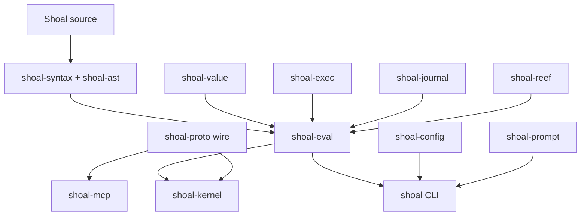
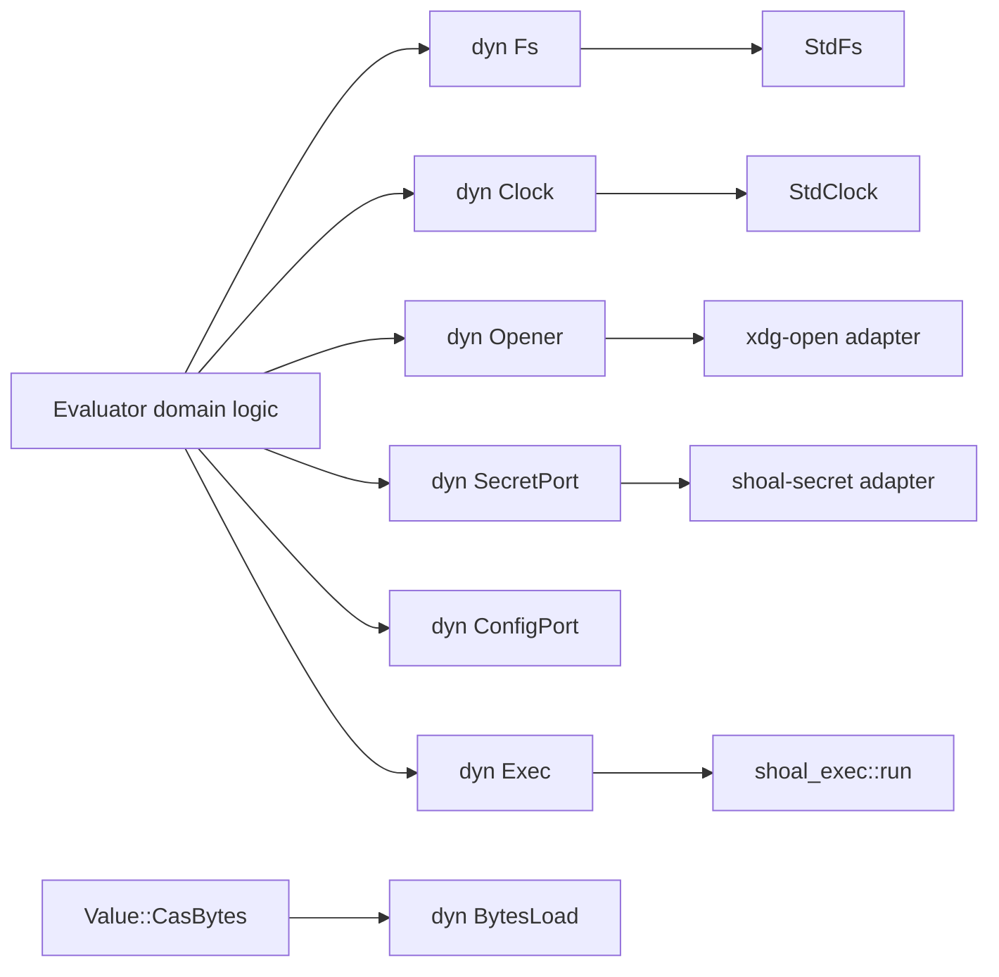
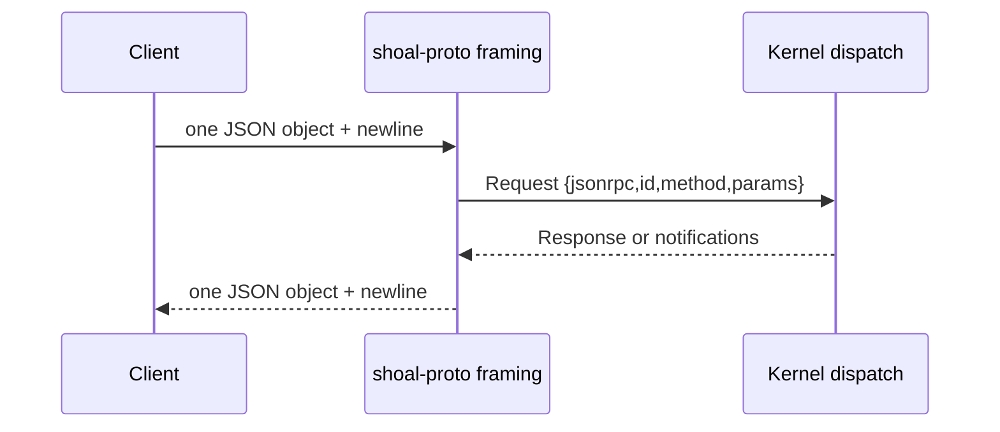

+++
title = "Inter-crate and protocol contracts"
description = "Stable dependency, API, port, wire, error-code, storage, and compatibility boundaries across the Shoal workspace."
weight = 115
template = "docs/page.html"

[extra]
group = "Maintenance"
eyebrow = "Normative engineering contract"
status = "Canonical replacement for docs/CONTRACTS.md"
audience = "Cross-crate, kernel, protocol, and storage contributors"
wide = true
+++

This chapter is the stable narrative replacement for `docs/CONTRACTS.md`. It defines which crate
owns each boundary, what consumers may rely on, and how compatibility is reviewed. Exact Rust fields
and signatures remain authoritative in public source because copying them into prose creates a
second, stale API.

## Contract layers

Shoal has four compatibility layers that must not be conflated:

| Layer | Consumers | Stable artifact | Typical compatibility concern |
|---|---|---|---|
| language | scripts and users | AST meaning, `Value`, render/error behavior, corpus | behavior and diagnostics |
| Rust library | workspace crates/embedders | public types, traits, functions | source/build compatibility |
| durable storage | later Shoal versions/processes | SQLite schema, CAS layout/hash, refs | forward/backward data safety |
| wire protocol | kernel clients/MCP | framed JSON-RPC, params/results, `$`-tagged values | serialized shape and numeric errors |

A language change may leave Rust signatures untouched; a Rust refactor may preserve wire/storage;
a protocol change may need no evaluator change. Reviews should name the layer being changed.

## Dependency-direction contract

The full source-derived crate ledger is maintained in [Crate and module ledger](@/internals/crate-ledger.md).
The durable direction rules are:

- representation and schema crates remain below behavior and hosts;
- `shoal-value` does not depend on the evaluator that interprets its closures;
- the evaluator depends on execution/storage/security providers through narrow APIs and ports;
- `shoal-proto` owns wire data without importing the evaluator's runtime graph;
- `shoal-mcp` talks to the kernel over the socket and does not link the kernel in production;
- `shoal-prompt` remains a pure leaf over snapshots;
- `shoal` and `shoal-kernel` are alternative composition roots, not mutually dependent hosts;
- optional/live integration test dependencies do not become production DAG edges.

This diagram describes direction, not a promise that every crate fits only one numerical tier. The
actual Cargo manifests decide the graph. CI/Cargo prevents cycles but does not prevent an
architecturally undesirable new downward dependency; reviewers must ask whether a trait/data seam
would preserve ownership better.

### Dependency inversion: evaluator callbacks

Value methods need to invoke closure values, but `shoal-value` cannot depend on `shoal-eval`.
`CallCtx` is the inversion seam: the value crate defines a minimal callback/cwd interface and the
evaluator implements it. The current trait exposes only closure invocation and cwd. Filesystem
writes in some methods are therefore not mediated by this trait—an audited gap, not permission to
grow direct effects casually.

### Dependency inversion: host configuration

The evaluator must not parse host config files because `shoal-config` owns discovery, merging,
validation, and environment precedence. `ConfigPort` exposes a resolved plain `Value` snapshot;
composition roots serialize their already-loaded typed config and inject it. The default snapshot
is an empty record and performs no filesystem fallback.

## Public-contract ownership table

| Contract | Owner | In-tree consumers | Compatibility evidence |
|---|---|---|---|
| `Program`, `Stmt`, `Expr`, spans and serde shape | `shoal-ast` | syntax, value, evaluator, kernel tooling | AST round trips and formatter/parser tests |
| lexer/parser/formatter and builtin names | `shoal-syntax` | CLI, evaluator, LSP, completion/highlighting | syntax tests, conformance, formatter properties |
| `Value`, `Env`, `ErrorVal`, methods, streams | `shoal-value` | evaluator, adapters, picker, hosts/kernel | focused value tests + corpus |
| evaluator lifecycle/injection/entrypoints | `shoal-eval` | CLI and kernel | evaluator/integration/conformance tests |
| `ExecSpec`, results, cancellation, PTY sessions | `shoal-exec` | evaluator and kernel | live process/PTY/sandbox tests |
| journal rows, CAS, undo, transcript/GC | `shoal-journal` | evaluator, kernel, history, doctor | schema/CAS/migration tests |
| effects, policy, sandbox lowering | `shoal-leash` | evaluator, exec, kernel, doctor | verdict/unit + OS enforcement tests |
| scoped resolution and locks | `shoal-reef` | evaluator | provider/temp-tree + integration tests |
| adapter catalog/spec/parser | `shoal-adapters` | evaluator, host completion, doctor | fixtures + parser/binding tests |
| request/result/wire-value types | `shoal-proto` | kernel, MCP, test clients | serde/property/framing/live daemon tests |
| token validation | `shoal-auth` | kernel | lifecycle/expiry/revocation tests |
| config schema/load result | `shoal-config` | CLI host | merge/schema/env/host wiring tests |
| prompt snapshot/config/renderer | `shoal-prompt` | CLI host | pure render/config/speed tests |

## Evaluator port contract

Ports exist to make evaluator behavior testable and to create one interception point for policy,
planning, auditing, and alternate hosts.

### `Fs`

The filesystem port covers whole-file read/string read, seekable read, write, append,
**open-for-append** (`open_append`, the open-once incremental writer backing the stream sink),
touch, metadata/symlink metadata, regular-file check, directory enumeration, directory
creation/removal, file removal, rename, copy, hardlink, and symlink. The standard adapter delegates
to `std::fs`. `open_append`'s trait default fails closed (`ErrorKind::Unsupported`) so an adapter
that mediates effects must implement it rather than let a streamed append escape.

Every filesystem **write** the language exposes now crosses `Fs`: path/value `.save`/`.append` route
through `CallCtx::fs().write`/`.append` and stream `.save`/`.append` through `CallCtx::fs().open_append`
(HR-C1/HR-C2). The `Fs` port does **not** yet cover every read-only filesystem *observation*: direct
`Path::exists/is_dir/is_file/canonicalize` calls remain around module/frecency discovery, script
dispatch, stream sources, and cp/ls/cd guards. The in-process filesystem-effect ledger in
[`effects-plans-security.md`](@/internals/effects-plans-security.md) inventories every site (routed
vs. exempt). The architectural contract is the desired single boundary; the observation residue means
it must not yet be described as fully hexagonal.

`CallCtx` (the eval↔methods bridge) exposes `fs() -> &dyn Fs` so value methods reach the same port;
its default is `StdFs`, and a host with an injected/sandboxed port must override it in its `CallCtx`
impl for value-method writes to consult that port.

Adding an effectful filesystem operation should extend `Fs` and its fakes unless there is a
documented host-only reason. A repair needs a port-spy test proving the operation crosses the port,
not merely a successful temp-directory test.

### `Clock`

`Clock::now_ns` supplies journal timestamps. Its standard adapter returns nanoseconds since Unix
epoch clamped to signed 64-bit. Other timing behavior—sleep, time literals, deadlines, prompt time,
process duration—does not uniformly use this port. Call it a journal-time seam, not a universal
clock abstraction.

### `Opener`

`Opener` handles the desktop `open` effect. The Linux-oriented standard adapter spawns detached
`xdg-open` with null stdio. Platform expansion belongs in host adapters; evaluator semantics should
continue to request “open this path,” not select desktop commands.

### `SecretPort`

`SecretPort::get` distinguishes missing secrets from store/permission errors and returns raw bytes.
The standard implementation lives in `shoal-eval` so the value leaf does not depend on
`shoal-secret`. Secret directory discovery currently uses `SHOAL_SECRET_DIR`, then XDG data/home.

### `BytesLoad`

Lazy CAS-backed bytes retain a small preview, true length/hash, and a thread-safe loader. Operations
that require full content call `BytesLoad::load`; length/render can stay cheap. The concrete journal
CAS adapter lives above `shoal-value` to preserve the leaf boundary.

### `ConfigPort`

`ConfigPort::snapshot` returns the already-resolved value tree. No-config evaluators return `{}` and
`config.get` returns null. This is intentionally not a file reader. Child evaluators must inherit the
same Arc/snapshot when semantic continuity is required; several current constructors fail to do so.

### `Exec`

The evaluator-side `Exec` trait accepts a complete `shoal-exec::ExecSpec`, cancellation token, and
returns `ExecResult`. It lives in `shoal-eval` because mentioning exec crate types from
`shoal-value` would invert the dependency. Tests can capture the spec without spawning.

## Process-execution public contract

The exact public types live in `crates/shoal-exec/src/lib.rs`; the stable behavioral contract is:

- `ExecSpec.argv[0]` identifies the program; no shell is implicitly inserted;
- cwd and environment are complete inputs, not ambient deltas;
- stdin is null, inherited, bytes, or file;
- mode is pipe capture or PTY tee;
- optional sandbox policy is lowered before exec and actual enforcement is reported honestly;
- optional spill directory enables bounded-memory stdout spill in capture mode;
- a result distinguishes exit status and signal, preserves bounded output, duration, pid, spill,
  truncation, and enforcement;
- cancellation acts on the process group and escalates;
- streaming capture transfers stdout/stderr reader ownership and still requires a wait/reap;
- long-lived `PtySession` is distinct from one-shot PTY tee and exposes screen snapshots;
- every path, including `Drop`/error/cancel, must avoid zombies and restore terminal state.

Capture cap environment/setter APIs are process-global test/host controls. Tests that mutate them
must serialize and restore state. Spill ownership transfers to the caller, which must adopt or
delete the file.

## Journal and CAS public contract

`shoal-journal` owns SQLite and content-addressed bytes without depending on the evaluator.

Durable logical records include:

- execution entry start/finish metadata;
- output links with kind/hash/length/truncation metadata;
- undo inverse rows;
- pins for GC reachability;
- transcript events keyed to entry IDs;
- blob metadata plus sharded compressed files.

The public API supports open/in-memory variants with options, append/finish, output recording, blob
read/length, spill adoption, filtered queries, ordered ID fetch, undo recording/fetch, transcript
record/fetch, pins, and GC. Exact row structs and methods live in source.

Storage invariants:

- WAL and busy timeout support multi-process access;
- an appended-but-unfinished entry remains visible with null completion fields after a crash;
- blob filenames are BLAKE3-derived and reads rehash decompressed bytes;
- missing and corrupt content are distinct outcomes;
- output hard caps record truthful original/stored lengths;
- a truncated snapshot cannot be treated as a replayable full undo inverse;
- ordered fetch preserves requested ID order and skips absent IDs;
- additive schema creation is idempotent;
- `PRAGMA user_version` refuses databases written by a newer unsupported schema;
- GC preserves pinned/reachable content while entry metadata can outlive collected blobs.

See the persistence chapter and storage reference for schema/transaction detail.

## Adapter public contract

The adapter crate owns a best-effort directory loader returning a catalog plus warnings. One invalid
file does not necessarily prevent all valid adapters from loading. A command spec owns binary name,
class, success codes, top-level/subcommand signatures, short flags, invoke payload/template, output
strategy/type hint, and declared effects.

`parse_output(strategy, bytes, type_hint)` returns an optional structured `Value`; absence means the
strategy could not produce the promised form and callers retain byte/outcome behavior. Strategy
names and exact serde shape are executable schema, not a prose enum.

Consumers may rely on:

- later catalogs/directories shadow according to host loading order;
- signature binding separates consumed structured args from raw argv tails;
- adapter success codes override command default where selected;
- parser failure does not fabricate structure;
- adapter class can influence PTY/capture selection;
- declarations inform plan/effect derivation but do not independently enforce OS policy.

## Wire framing contract

`shoal-proto` uses JSON-RPC 2.0 objects separated by one newline over a Unix byte stream. A frame is
read with `read_line`; EOF before another line returns no request; a line over 16 MiB is invalid.
Writing serializes one object, appends newline, and flushes.

The 16 MiB check occurs after `read_line` has accumulated the line, so it limits accepted frames but
does not prevent allocation proportional to an untrusted unterminated/oversized line. Socket peer
authentication and filesystem permissions are therefore part of framing safety.

Notifications and responses share the same stream. Clients must demultiplex by presence of response
ID versus notification method, and must not assume a request gets the next physical frame when
subscribed events are active.

## Reference contract

`Ref` is a transparent string with a colon-separated kind. Live kinds include transcript/value,
task, plan, and PTY references; CAS refs can encode a BLAKE3 identity. Parsing `Ref::kind` only
splits at the first colon—it does not prove the remainder is valid or authorized.

Authorization is always scoped at resolution time. Knowing another session's ref must not grant
access. Unknown, expired, cross-session, and cross-principal references map to the handler's stable
RPC error family rather than leaking existence details where policy requires hiding them.

## Wire value contract

`WireValue` is an internally tagged JSON enum using `$` with snake-case variants. It represents
null, scalar types, quantities, bytes, lossless paths, collections, outcomes/errors, time types,
globs/regex/ranges, tasks, closures/commands, streams, secrets, and elided refs.

Key serialization rules:

- tables are columnar; every column length equals row count and missing cells are null;
- bytes are encoded as protocol text (currently base64 at conversion boundaries);
- `WirePath.display` is readable and `raw` base64 is present for non-UTF-8 OS bytes;
- errors preserve stable language code/message and optional span/hint/stderr;
- outcomes preserve optional status, signal, nested output, stderr, duration, pid, command, span;
- secrets carry only names;
- closures/commands are display-only and not remotely invocable values;
- streams currently carry a label, not a pullable chunk ref—historical “ref + chunks” prose is
  aspirational;
- `Ref` elision retains type/count/schema/preview/render head plus a fetch URI.

Two current byte-level discrepancies must be treated as contract debt:

- `WireValue::DateTime` is documented by the protocol type as RFC 3339, but kernel conversion in
  `wire.rs` currently emits `timestamp().to_string()`: a Unix-seconds decimal string. Clients must
  not assume the declared RFC 3339 shape until conversion and compatibility tests are repaired.
- `value.get {format:"raw"}` materializes the complete resident or CAS-backed byte value and returns
  `raw_base64` without the ordinary 64 KiB elision clamp. The MCP resource adapter special-cases
  `raw` but not `raw_base64`, leaving the full payload in `structuredContent`. This is a context- and
  memory-boundary bypass, not an endorsed exception to elision.

Wire-value evolution is a client compatibility change. Add serde round trips, old fixture decoding,
kernel conversion tests, and MCP live tests before shipping a variant/field change.

## Protocol parameter ownership

Typed parameter/result structs exist for attach, parse, exec, tasks, PTYs, plans/capabilities,
value fetch, journal query, events, completion, and explanation. Handler method names and
per-method requirements are cataloged in the kernel RPC reference; the serde structs own field
spelling/defaults.

Important defaults include:

- exec mode `run` and position `stmt`;
- async/background field aliases on exec;
- optional timeout can convert synchronous work into a task result;
- elision overrides are optional and hard-clamped by the kernel;
- `mode: approved` requires a verified stored plan and is not a caller-asserted privilege;
- journal and event limits/defaults are applied above/below storage as documented by handlers.

## Stable JSON-RPC error taxonomy

Numeric codes are centralized in `shoal_proto::error_code` and pinned by a unit test:

| Code | Constant | Meaning |
|---:|---|---|
| -32700 | `RPC_PARSE_ERROR` | malformed JSON-RPC frame |
| -32600 | `INVALID_REQUEST` | invalid JSON-RPC request shape |
| -32601 | `METHOD_NOT_FOUND` | unknown method |
| -32602 | `INVALID_PARAMS` | wrong/missing method params |
| -32603 | `INTERNAL_ERROR` | unexpected server failure |
| -32000 | `NOT_ATTACHED` | method requires a session attachment |
| -32001 | `PARSE_ERROR` | submitted Shoal source failed to parse |
| -32002 | `RAISED` | evaluation raised a language `ErrorVal` |
| -32004 | `UNKNOWN_REF` | value/blob ref absent or unreadable |
| -32005 | `BAD_PATH_OR_SLICE` | invalid value projection/slice/format |
| -32010 | `LEASH_DENIED` | denied or invalid-cross-authority approved/plan access |
| -32011 | `APPROVAL_REQUIRED` | policy requires an approval flow |
| -32012 | `UNKNOWN_PLAN` | missing/expired plan ref |
| -32020 | `TASK_CONTROL_UNAVAILABLE` | suspend/resume unavailable for task model |
| -32021 | `UNKNOWN_TASK` | absent or cross-session task |
| -32022 | `UNKNOWN_PTY` | absent/closed/cross-session PTY |
| -32023 | `PTY_SPAWN_FAILED` | resolution, sandbox, PTY, or spawn failure |
| -32030 | `AUTH_FAILED` | token store unavailable or token invalid/revoked/expired |

Language `ErrorVal.code` strings travel inside `RAISED` data and remain a separate taxonomy. Never
renumber a wire code or repurpose it silently. If one code is overloaded today (`LEASH_DENIED` is),
split only with a protocol compatibility plan and client fallbacks.

## Session and authority contract

Most kernel handlers require `session.attach`. Attach establishes session, principal, capabilities,
cwd/environment identity, AST version, enforcement honesty, elision defaults, and channel list.

Stable security properties:

- Unix socket ownership/permissions and peer UID are the first boundary;
- agent tokens are validated through `TokenStore::validate`;
- a named session does not make refs globally visible—handlers still scope every lookup;
- plans, tasks, PTYs, events, values, and approvals are checked against session/principal rules;
- `caps_enforced` states actual OS enforcement availability, not merely policy configuration;
- secret material never crosses the wire through a `Secret` value;
- per-client `it` state must remain distinct even inside a shared session.

Current risk: the first principal attached to a named session can determine session-owned evaluator
state that later principals share. Treat cross-principal named sessions as a security review area.

## Compatibility review matrix

| Change | Must review |
|---|---|
| public Rust field/signature | all `rg` consumers, semver/source compatibility, doctests |
| new crate dependency | DAG direction, feature/default build, licenses, binary size |
| new filesystem/process effect | port coverage, plan/effect declaration, Leash enforcement, journal |
| `Value` variant | equality/render/feed/methods/JSON/wire/elision/journal/picker |
| AST variant | serde version, parser, formatter, evaluator, plan, wire/explain, LSP |
| protocol field/variant | serde defaults, old client behavior, MCP mapping, live daemon tests |
| numeric RPC code | all clients, pinned test, migration/fallback |
| language error code | catch logic, corpus, wire error data, docs |
| journal schema | old fixture migration, newer-version refusal, backup/GC/undo |
| ref syntax | parsing, authorization scope, MCP URIs/resources, persistence lifetime |

## Historical contracts reconciliation

The former root contract is absorbed as follows:

| Old topic | Canonical destination | Status correction |
|---|---|---|
| crate DAG and ownership | crate ledger + this dependency section | generated/audited from Cargo, not a hand-pinned tier list |
| exec signatures | process/PTY chapters + public source | behavioral contract retained; exact signatures stay in Rust |
| journal signatures/schema | persistence/storage chapters + public source | migration/GC/transcript details separated |
| `Value` and render rules | value algebra/method chapters | live enum/registry replaces stale lists |
| language error codes/corpus | language-conformance contract | current emitted codes distinguished from historical proposals |
| adapter API | adapter runtime chapter + source schema | current payload/parser variants prevail |
| `CallCtx` bridge | this page + method dispatch | current two-method trait documented |
| evaluator ports | this page + evaluator/security chapters | aspiration corrected: direct effect paths remain |
| wire/protocol assumptions | this page + kernel RPC/wire chapters | current `$` variants and numeric taxonomy prevail |

This page is deletion-ready with respect to `docs/CONTRACTS.md`. Source comments should link to this
contract or a narrower focused chapter, while exact API references should use Rustdoc paths.

## Reviewer invariants

- Cargo dependency direction reflects ownership; callbacks use dependency inversion.
- Exact signatures live once, in public source.
- Ports are interception boundaries, and known bypasses are tracked as debt.
- Process results distinguish status, signal, truncation, spill, and actual enforcement.
- Durable CAS reads verify content hashes.
- Newer unsupported journal schemas fail safely.
- Frames are newline-delimited JSON-RPC and notifications can interleave.
- Non-UTF-8 paths retain raw bytes on the wire.
- Error-code namespaces remain separate and stable.
- Every reference is authorized when resolved, never by unguessability.
- Schema/renderer support without a live producer or handler is labeled incomplete.
