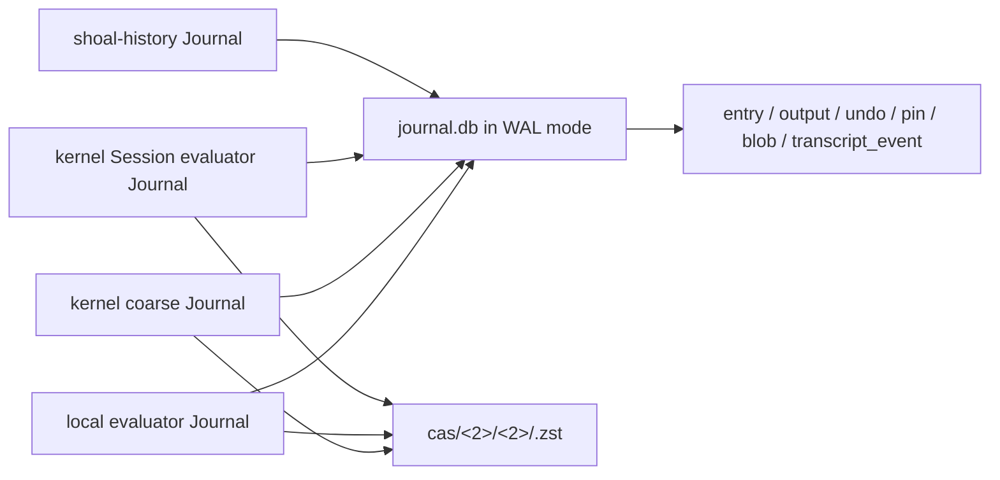
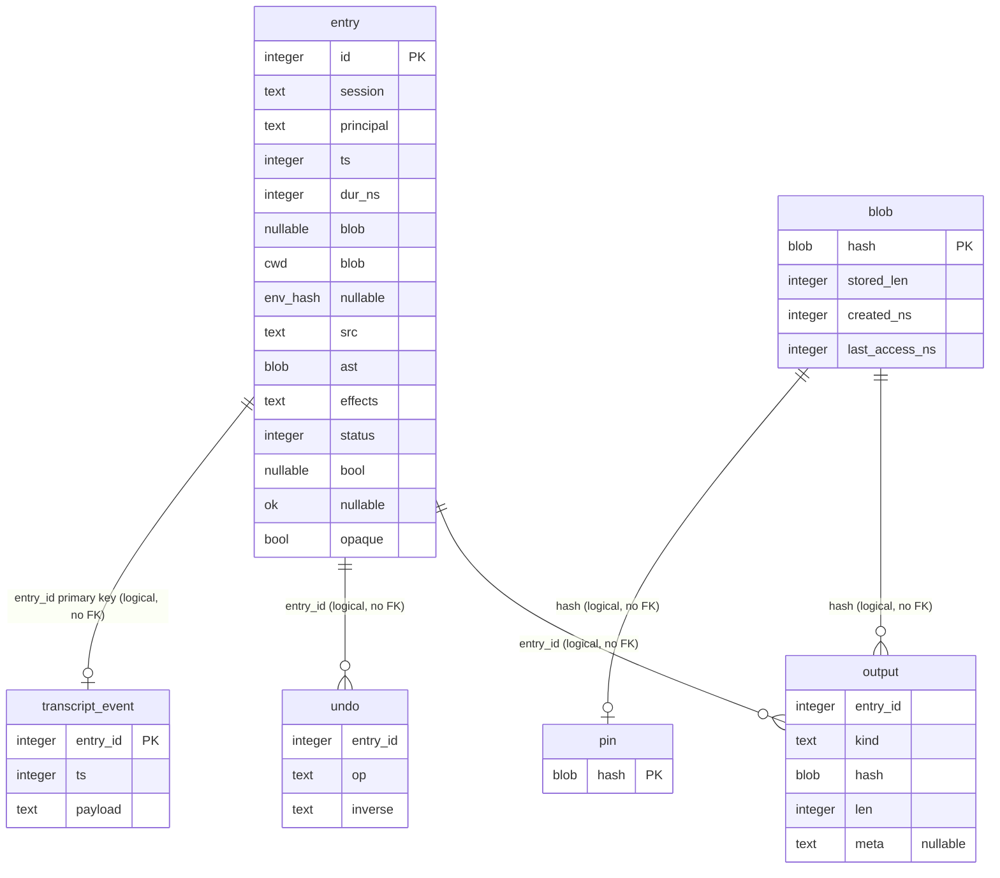
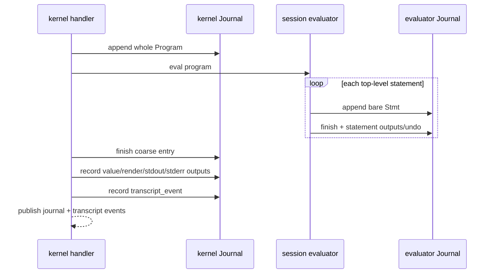
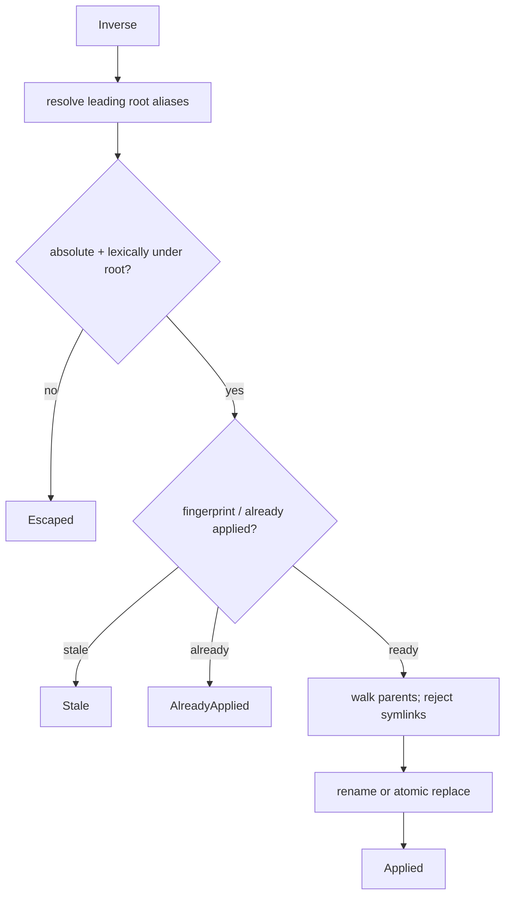

+++
title = "Journal, CAS, undo, and storage reference"
description = "The exact SQLite schema, entry lifecycle, content-addressed store, spill, undo, garbage collection, query, migration, and kernel replay contracts."
weight = 101
template = "docs/page.html"

[extra]
group = "Storage & tooling"
eyebrow = "Persistence atlas"
status = "Source-audited: 2026-07-17"
audience = "Journal, evaluator, kernel, history, and migration maintainers"
wide = true
+++

Shoal's persistence layer is one SQLite connection plus a filesystem content-addressed store. It is
small enough to understand completely, but it participates in four distinct contracts:

- an append/finish execution ledger;
- output and large-value bytes addressed by blake3;
- typed, defensive filesystem undo;
- durable reconstruction for two kernel event channels.

This page records the exact schema and algorithms. The higher-level
[persistence chapter](../persistence/) explains intent; the
[kernel RPC reference](../kernel-rpc-reference/) explains how stored data crosses the wire.

## Storage topology

```text
<state_dir>/
├── journal.db
├── journal.db-wal                 # present while WAL has uncheckpointed pages
├── journal.db-shm                 # SQLite WAL coordination
├── cas/
│   └── ab/
│       └── cd/
│           └── <full-hex>.zst
└── spill/
    └── <capture temporary files>
```

`Journal::open` creates the directory and CAS root, opens `journal.db`, requests WAL mode, sets
`synchronous=NORMAL`, applies a five-second busy timeout by default, initializes/migrates schema, and
retains one `rusqlite::Connection`. `Journal` is `Send` but not `Sync`; hosts put it behind their own
mutex or open independent connections.

`Journal::in_memory` uses an in-memory SQLite database and a temporary on-disk CAS directory whose
lifetime is held by the journal. It does not enable WAL because there is no database file.

## Storage admission and exhaustion policy

Durable history is bounded by two independent admissions:

| Domain | Default | Hard maximum | Environment override |
|---|---:|---:|---|
| SQLite main database plus current WAL | 1 GiB | 64 GiB | `SHOAL_JOURNAL_DATABASE_MAX_BYTES` |
| CAS logical uncompressed content | 4 GiB | 64 GiB | `SHOAL_JOURNAL_CAS_MAX_BYTES` |

Invalid/zero environment values use the default; values above the hard maximum clamp. Embedders can
set the same fields through `JournalOptions`. Different processes can choose different soft limits,
but no cooperating handle can configure above the compiled hard maxima.

Before an `entry` begin insert, Shoal takes an SQLite `IMMEDIATE` transaction, measures the main DB
and WAL files, and admits the bounded row payload plus 64 KiB of write overhead and a further 64 KiB
completion reserve. Failure returns a typed `StorageAdmissionError`. The evaluator maps that to
`journal_begin_failed` and executes no statement effects; the kernel's mandatory coarse audit append
also fails closed. Later output, undo, pin, and transcript writes repeat the serialized check. Finish
is allowed to spend the completion headroom; if SQLite or the filesystem nevertheless refuses it,
the caller reports an indeterminate completion rather than a clean success.

CAS insertion performs its logical-budget check inside the same serialized writer transaction. A
known hash costs no new logical bytes. A new hash is admitted against the greater of tracked
uncompressed bytes and the CAS+spill physical size reconciled when that handle opened, which makes
restart-visible orphan files at least partly visible without imposing an O(number-of-blobs) tree walk
on every command. Pins count and are never evicted automatically. Explicit `shoal-history gc
--apply` can reclaim only unpinned CAS content; it never deletes `entry`, `undo`, or transcript audit
rows. The status command performs a fresh physical walk.

SQLite is additionally configured with `max_page_count`, a 128-page WAL autocheckpoint, and a bounded
`journal_size_limit`. These are defense in depth. They are not a perfect filesystem quota: an active
reader can delay WAL recycling, compression needs temporary headroom, filesystem metadata consumes
space, and another program can write into the state directory. Every write still handles
`SQLITE_FULL`/I/O errors honestly.

Operators can inspect the reconciled counters with `shoal-history status [--json]`; `shoal doctor`
reports current utilization and the two environment controls. Approaching 90% is a warning and
exhaustion is a failure.



The busy timeout reduces—not eliminates—contention under concurrent local/kernel/history handles.
The language evaluator treats an installed journal as an integrity boundary: failure to append the
begin row rejects before statement effects, while a finish/output/undo failure after execution
returns `journal_commit_indeterminate` and warns that effects may already have occurred. A missing
journal remains the explicit no-history mode. Kernel approval auditing is a separate mandatory
fail-closed layer. Some lower-level/direct journal embedders still choose their own error policy;
there is no shared cross-process health record beyond the caller-visible error and unfinished row.

## Schema version and initialization

`PRAGMA user_version` is currently `1`. On every open the code first runs idempotent
`CREATE TABLE/INDEX IF NOT EXISTS`, then reads the version:

| Stored version | Behavior |
|---:|---|
| 0 | treat as fresh or legacy-compatible; stamp 1 |
| 1 | accept unchanged |
| greater than 1 | refuse as newer than this build |
| between 1 and current | future migration dispatch; currently unreachable |

There has not yet been a real stepwise migration. Version-zero adoption assumes existing tables have
the current additive shape; it does not interrogate every column. Also, table initialization happens
before the too-new version refusal, so opening a newer database can still execute idempotent current
`CREATE ... IF NOT EXISTS` statements before returning the error. They should be non-destructive, but
“refuse without touching schema” would require reading `user_version` first.

The first non-additive migration should:

1. hand-build and preserve a v1 fixture;
2. read/refuse versions newer than the binary before DDL;
3. run each `N → N+1` step in one transaction;
4. validate post-migration columns, indexes, and invariants;
5. stamp only after every step succeeds;
6. test restart and concurrent reader behavior;
7. keep a downgrade/backup story for the release note.

## Complete schema

### Relationship map



Relationships are conventional only: the DDL declares no foreign keys, uniqueness constraints on
output/undo, or cascade rules. Public methods can insert an output or undo row for a nonexistent entry
unless their caller validates it. GC can delete a `blob` record/file while old `output` rows retain
the hash; that is how output metadata can survive content aging.

Indexes exist on `entry(ts)`, `entry(parent_id)`, `(principal,session,kind,id)`,
`output(entry_id)`, and `undo(entry_id)`. SQLite primary-key indexes cover entry, pin, blob, and
transcript event IDs. Success/head filtering is not separately indexed.

### `entry`

| Column | Written at append? | Completion meaning |
|---|---:|---|
| `id` | SQLite rowid | durable entry identity |
| `kind` | yes | `statement`, `exec`, or `approval` |
| `parent_id` | yes/null | owning coarse exec for evaluator statements; null otherwise |
| `session`, `principal` | yes | provenance strings supplied by host |
| `ts` | yes | start time, Unix epoch nanoseconds |
| `dur_ns` | null | elapsed duration on finish |
| `cwd` | yes | raw OS path bytes |
| `env_hash` | always null in current append | reserved but unwired |
| `src` | yes | exact source string supplied by host |
| `ast` | yes | JSON bytes/string, producer shape varies |
| `effects` | yes | JSON text |
| `status` | null | exit status; remains null for signal death/unfinished |
| `ok` | null | semantic success after finish |
| `opaque` | yes | whether effect derivation contained opaque behavior |

Schema v2 added `kind` and `parent_id`. The kernel records a whole `Program` `exec` row, while the
session evaluator records `statement` rows whose parent is that exec. Approval grants use
`approval`. Durable event membership filters `kind = exec`; AST decoding remains a corruption check,
not a type heuristic. The v1 migration classifies historical rows from the old producer shapes and
leaves their unreconstructable parent IDs null. Statement ordinal and host vocabulary remain absent.

### `output`

Each row links an entry to a CAS hash and contains:

- `kind`: conventionally `stdout`, `stderr`, `value`, or `render`;
- `hash`: 32 raw blake3 bytes;
- `len`: **stored uncompressed bytes**, after any truncation;
- `meta`: optional JSON `OutputMeta {truncated, original_len, stored_len}`.

Identical bytes can have many output rows and one blob. There is no uniqueness rule preventing the
same entry/kind/hash from being inserted repeatedly.

### `undo`

`op` is a readable discriminator and `inverse` is serialized `UndoInverse` JSON. Replay uses the JSON
tag as its executable authority and orders by SQLite rowid descending. The table does not record
whether a step was later applied; idempotence is inferred from filesystem state and fingerprints.

### `pin` and `blob`

`pin` is a set of raw hashes with no owner, reason, creation time, or expiry. `blob.stored_len` is the
uncompressed content length despite the name; the physical `.zst` file size is not stored.
`last_access_ns` is updated by `Journal::read_blob` but not by the DB-independent `Cas::read`.

### `transcript_event`

At most one row exists per coarse entry. It stores the exact live
`session.transcript` event payload JSON and its publication timestamp. The payload is not reconstructed
from value-output bytes because it contains the live summary/ref shape used by agents.

## Entry lifecycle

`append` inserts identity/source/AST/effects with completion columns null and returns `last_insert_rowid`.
`finish` updates status/ok/duration and errors when no row changed.


The lifecycle is **not one execution-wide SQLite transaction**. Append, finish, each output, each undo, and transcript
event are separate statements. This is deliberate enough to make crash evidence visible, but it
means partial combinations are valid storage states:

- entry exists with no finish after crash;
- finish succeeds but an output insert fails;
- CAS file exists but blob/output row insert fails;
- blob/output rows exist but transcript event insert fails;
- one of several undo inverses is missing after a storage error (the language evaluator reports the
  statement as indeterminate rather than clean success).

Consumers must handle those states without inventing data. If atomic execution finalization becomes
a requirement, define a transaction boundary that does not hold SQLite locks across actual command
execution.

### Kernel dual-write sequence

A successful kernel `exec` writes one coarse row through the kernel handle and one or more fine rows
through the evaluator's second handle. On the coarse path:



There is no transactional relationship between the handles, and no schema parent link. Query counts
therefore mix granularities unless the caller understands producer AST shape.

## Content-addressed store

### Address and physical representation

The address is lowercase blake3 hex over **uncompressed stored bytes**. Physical files use zstd level
3 and shard by the first four hex digits:

```text
hash = abcdef...
path = cas/ab/cd/abcdef....zst
```

On normal output insertion:

1. truncate if above the hard cap;
2. hash stored bytes;
3. take serialized DB/CAS admission;
4. if the content is new or its file is absent, zstd-compress into a temp file in the target directory;
5. atomically persist/rename to the final content path;
6. insert blob metadata and the output link in the admitting SQLite transaction.

The default hard cap is 256 MiB, much larger than kernel/MCP wire caps. Truncation preserves a prefix
plus `\n[shoal: output truncated; see journal metadata]\n`, shortened if the configured cap is smaller
than the marker. The hash and `len` describe stored prefix-plus-marker bytes; `OutputMeta` preserves
original and stored lengths.

Undo snapshots use `record_output_meta` so they can reject truncation rather than later restoring
partial bytes. Ordinary output may be truncated deliberately.

### Integrity reads

Both `Journal::read_blob` and the cloneable DB-independent `Cas::read`:

1. reject a malformed/too-short hex address;
2. read the exact sharded file;
3. zstd-decompress;
4. re-hash decompressed bytes;
5. reject a mismatch as invalid data.

`Journal::read_blob` returns `None` for malformed/missing keys and updates DB access time after a
successful integrity check. `Cas::read` returns IO `NotFound` and cannot update access time because it
holds no connection. A GC policy based on `last_access_ns` therefore does not observe lazy value reads
through `Cas`.

### Concurrency edges

The temp-file-plus-persist sequence protects readers from partial bytes. Cooperating writers serialize
admission and deduplication with `BEGIN IMMEDIATE`, so they cannot both spend the same remaining CAS
budget. A non-Shoal writer can still race the path; integrity reads remain the final authority.

CAS file creation and SQLite blob/output insertion are not one atomic filesystem/database operation.
Orphan files are acceptable GC candidates; orphan DB rows or missing files surface as a read miss.

## Spill and lazy bytes

Large captured stdout can land in `<state>/spill` before journal adoption. `ingest_spill` receives a
precomputed hash and length from `shoal-exec`, streams zstd compression to a temp file, inserts blob
metadata, optionally pins the hash, and best-effort deletes the spill file.

Ingestion checks the opened source file's type and length, hashes it before admission, and hashes the
exact bytes again while compressing. A mismatch leaves the source under its RAII owner and commits no
blob or pin. This closes the former path-swap/corruption gap between executor metadata and CAS naming.

`Journal::cas()` returns a cloneable path-only reader used by lazy `CasBytes` values. This keeps
SQLite out of value objects and allows thread-safe reads. It also means:

- access time is not refreshed;
- deletion can race a lazy read unless pinned;
- pins are global anonymous rows;
- evaluator spill adoption has no automatic unpin when the value/session dies.

The long-term model should be owner leases—manual, history-retention, live-session, or another named
class—rather than a boolean global pin.

## Query behavior

`JournalQuery` supports lower timestamp, exact principal, exact first source word, success, and limit.
Results are newest-first by entry ID, not explicitly by timestamp.

| Filter | Execution site | Detail |
|---|---|---|
| `since_ts_ns` | SQL | `ts >= ?` |
| `principal` | SQL | exact equality |
| `ok` | SQL | null unfinished rows do not match |
| `head` | Rust | first Unicode-whitespace-separated source word exact match |
| `limit` | SQL unless head set; Rust stop otherwise | zero means default 100 |
| `until` | kernel only | post-filter after store query |
| effect kinds | kernel only | serialized JSON substring matching after name normalization |

Outputs are joined per returned entry with a separate indexed query and recording order by rowid.
This is simple but N+1 in query count. `entries_by_id` constructs an `IN` list, fetches only requested
rows, joins outputs, and restores the caller's ID order while silently skipping missing IDs. Kernel
cold replay uses that targeted API.

Because kernel `until`/effect filtering happens **after** the store applies its limit, the wire can
return fewer rows than requested even if older matching rows exist. Effect substring matching can
also confuse kind names with serialized field contents. Move these filters into typed storage logic
when the schema next changes.

## Transcript event persistence and replay

The kernel publishes two durable channels:

| Channel | Durable payload source | Reconstructed timestamp |
|---|---|---|
| `journal` | entry columns | entry start plus duration, or start |
| `session.transcript` | exact `transcript_event.payload` | stored event timestamp |

The EventBus holds an in-memory dense `Vec<i64>` mapping each channel sequence to entry ID. On kernel
open it queries all rows, reverses newest-first results, classifies whole-Program ASTs as coarse kernel
entries, and seeds journal sequence IDs. Transcript sequence includes the coarse IDs that also have a
transcript row.

This survives kernel restart but has important properties:

- sequence zero after a restart means earliest **surviving/classified** row, not a globally persisted
  sequence table;
- classification depends on AST JSON shape;
- seeding uses a query with effectively unbounded limit and materializes all entries;
- corrupt/query failure silently leaves indexes at zero;
- transcript rows exist only for successful coarse execution;
- output/CAS GC does not remove transcript payload rows.

An explicit entry kind/parent and durable channel sequence table would remove shape inference and
make compaction semantics designable.

## Typed undo

### Inverse vocabulary

| Variant | Intended reversal | Preconditions |
|---|---|---|
| `TrashMove` | rename trash path back to original | trash fingerprint matches; original absent |
| `RestoreBytes` | atomically replace current file with prior CAS bytes | current fingerprint matches expected |
| `MoveBack` | rename current `from` back to `to` | source fingerprint matches; destination absent |

`FileFingerprint` stores size, optional modified nanoseconds, and a full blake3 hash for regular
files. Fingerprinting rejects a symlink. Directories have no content hash.

Inverses record in forward execution order and replay by undo rowid descending. Replay stops at the
first error; there is no transaction across filesystem steps and no durable applied marker. Each
variant tries to recognize already-applied state so retry can be idempotent.

### Scope and TOCTOU checks

Before mutation:

1. resolve only a leading run of symlink components on the supplied root, accommodating OS-level
   aliases without canonicalizing user-controlled descendants;
2. require an absolute target;
3. lexically normalize `.` and `..` and prove it strips under root;
4. check the relevant current/trash/source fingerprint;
5. walk target parent components with `symlink_metadata`, rejecting a symlink and creating a missing
   directory one level at a time;
6. rename or atomically persist bytes in the target parent.



There remains a documented production edge for cwd beneath a symlinked path, especially on macOS:
scope-alias accommodation and strict anti-symlink traversal are in tension. Any change needs real
filesystem tests, not only lexical path fixtures.

`RestoreBytes` reads and integrity-checks prior CAS data before comparing/replacing. The atomic
replace writes a temp file, `sync_all`s it, and persists over the path. Directory fsync is not shown,
so power-loss durability of the rename is weaker than full fsync discipline.

## Pins and garbage collection

### Selection algorithm

GC loads every blob with uncompressed length, last access, whether any output references it, and
whether it is pinned. It orders unreferenced before referenced, then oldest access.

1. If TTL is set, select every unpinned blob at/before the cutoff—including referenced blobs.
2. If max bytes is set, continue selecting unpinned blobs in the ordering until remaining bytes fit.
3. Report candidates with a `referenced` flag.
4. In non-dry-run mode, rename each file to a process-ID tombstone, remove it, then delete the blob
   table row.

Pins are the only hard protection. Output references influence order but do not prohibit deletion.
That means journal metadata can intentionally outlive output content. Callers must handle a listed
hash whose blob has aged out.


GC is not a database transaction with filesystem deletion. The tombstone rename avoids exposing a
partially removed final path and attempts to restore on remove failure. A crash after file removal but
before row deletion leaves metadata for a missing file; a crash after tombstone rename leaves a
`.gc-PID` orphan. Concurrent readers/writers and multiple GC processes need dedicated stress tests.

`remaining_bytes` counts uncompressed logical sizes, not physical compressed disk use. A max-bytes
setting should be documented accordingly.

## Public API ledger

| API | Mutation/read | Atomic unit | Notable failure contract |
|---|---|---|---|
| `open[_with_options]` | filesystem + DB | per setup statement | too-new schema refuses; busy timeout installed |
| `in_memory[_with_options]` | temp CAS + memory DB | constructor | temp CAS deleted on drop |
| `append` | entry insert | one SQL statement | returns row ID |
| `finish` | entry update | one SQL statement | unknown ID is `StatementChangedRows(0)` |
| `record_output[_meta]` | CAS file + blob/output rows | not cross-resource atomic | may truncate; returns stored hash |
| `read_blob` | CAS + access timestamp | file read then SQL update | missing is `None`; corrupt is error |
| `blob_len` | blob metadata | one query | no integrity/file existence check |
| `cas` / `Cas::read` | path-only read | filesystem | verifies hash; no access update |
| `spill_dir` | directory create | filesystem | created on demand |
| `ingest_spill` | CAS + blob + optional pin | not cross-resource atomic | trusts producer hash/len; best-effort source delete |
| `query` | entries + output joins | multiple reads | default 100; newest entry ID first |
| `entries_by_id` | targeted entries + joins | multiple reads | requested order; skips missing |
| `record_undo[_inverse]` | undo insert | one statement | no entry FK validation |
| `undo_entry` | DB read + filesystem mutations | stepwise | stops on invalid/escaped/stale/IO |
| `undos_for` | undo read | one query | recording order |
| `pin` / `unpin` / `pins` | pin set | one statement/query | boolean says set changed |
| `gc` | files + blob rows | per blob, nontransactional | references are ageable; pins protected |
| `record_transcript_event` | row insert | one statement | duplicate entry ID fails |
| `transcript_events_by_entry` | targeted read | one query | input order; skips missing |

## State-root ownership

The local evaluator, history CLI, and doctor use the shared XDG state fallback. History and doctor
also load bounded layered config and honor `journal.state_dir`; relative values resolve from startup
cwd. An explicit history `--state-dir` wins and skips config loading, which both targets a durable
kernel's explicit root and provides a recovery path for malformed config.

Kernel sessions open a second handle to exactly the kernel's recorded `state_dir`, which is correct;
they do not independently rediscover a different path.

## Storage invariants

1. `cwd` and path-bearing inverses preserve OS bytes; display text is not canonical identity.
2. a returned CAS blob must re-hash to its address.
3. undo never restores a truncated snapshot.
4. an unfinished row remains visible with null completion rather than being rewritten as failure.
5. signal death keeps `status = NULL`; it is not encoded as `128 + signal`.
6. replay order follows inverse rowid descending.
7. scope escape, symlink parent traversal, and stale fingerprints are hard undo failures.
8. pins, not output references, are the hard GC retention mechanism.
9. `limit = 0` means 100, never unbounded, for public journal queries.
10. a transcript event payload is exact persisted JSON, not a lossy re-derivation.
11. a live `out:N`, task, plan, or PTY ref is not reconstructed merely because journal bytes survive.
12. schema changes that alter meaning require migration fixtures and a version bump.

## Known debt and next schema work

| Finding | Consequence | Preferred repair |
|---|---|---|
| no entry kind/parent/ordinal | coarse/fine ambiguity and AST-shape replay heuristic | v2 execution identity columns/table |
| `env_hash` permanently null | schema promises provenance not captured | wire a real digest or remove/deprecate |
| no foreign keys | orphan logical rows possible | validate/migrate, then add intentional constraints |
| direct non-evaluator hosts choose their own write-error policy | inconsistent degraded-health reporting | shared health event/status contract |
| global anonymous pins | permanent growth and no ownership | lease owner/reason/expiry table |
| lazy `Cas::read` misses access updates | TTL can age actively read values | explicit lease or batched access telemetry |
| duplicate-writer persist race | benign dedup can report failure | verify and accept an existing correct winner |
| kernel post-filters after limit | incomplete `until`/effects results | typed indexed store filters |
| effect filter is JSON substring | false match risk | normalized effect-kind relation/index |
| GC file/DB steps nontransactional | tombstone/missing-file recovery cases | startup reconciliation and GC lock/protocol |
| replay seed scans/materializes all rows | startup cost grows with history | durable channel sequence/index table |
| state-root drift | tools inspect different databases | shared resolver |
| no automatic spill unpin | CAS growth | owner-scoped live-value leases |
| directory rename lacks parent fsync | weaker power-loss guarantee | document or add platform-aware fsync |

## Migration review checklist

Before changing any table or CAS meaning:

1. inventory every opener: local evaluator, kernel, session evaluator, history, doctor/tests;
2. decide compatibility with older binaries and concurrent old readers;
3. capture real v0/v1 fixtures before code changes;
4. back up or copy-on-migrate when destructive transformation is possible;
5. migrate in bounded transactions and retain raw path bytes;
6. verify unfinished, signal-death, truncated, missing-blob, and corrupt-blob rows;
7. test multiple connections under the configured busy timeout;
8. exercise event replay before and after restart;
9. exercise undo against symlink/stale/partially-applied states;
10. run dry and real GC with pins, references, tombstones, and concurrent readers;
11. update kernel/MCP query shapes and history output;
12. update this atlas and the status ledger with the same migration.
