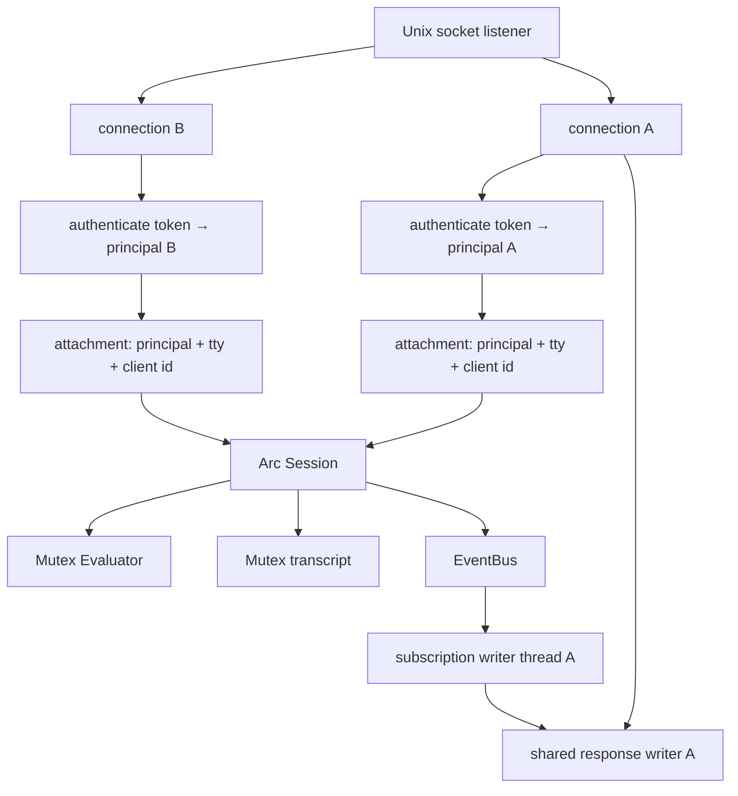
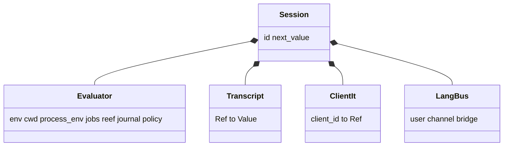
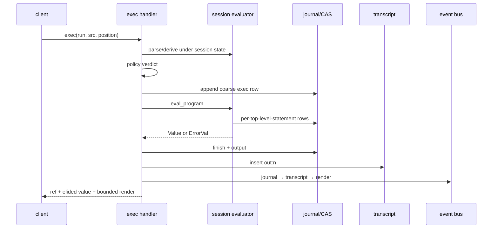
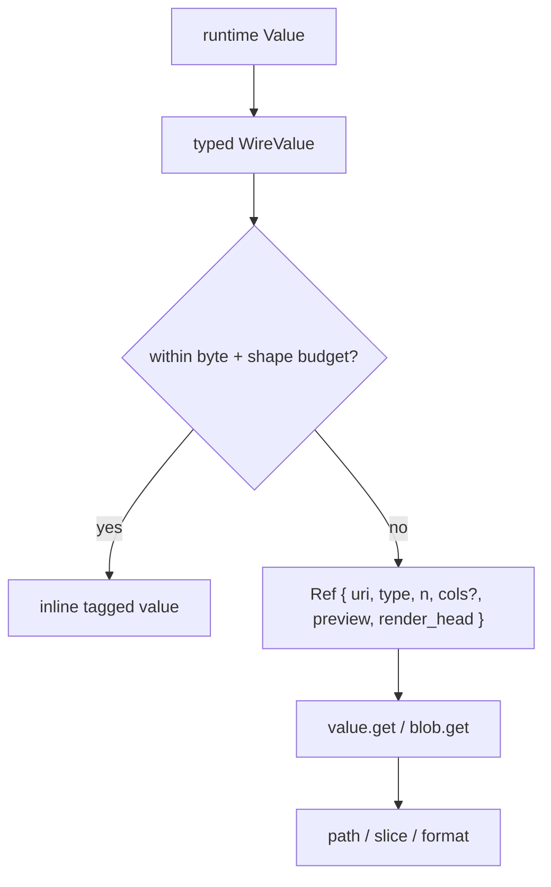
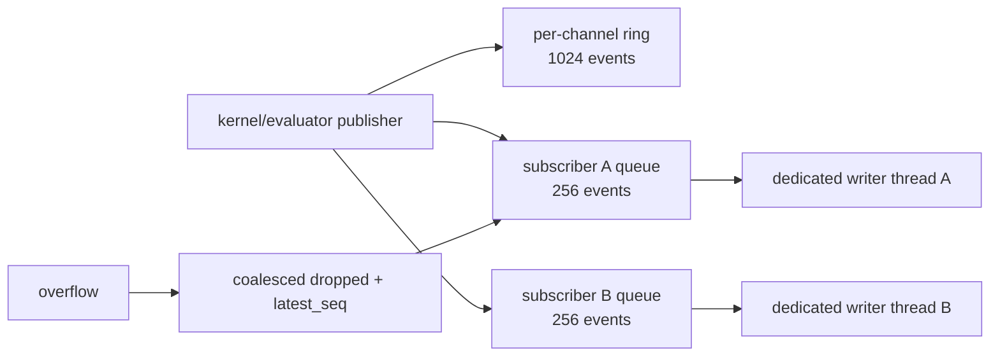

+++
title = "Kernel, sessions, and protocol"
description = "The Unix-socket server, session and connection lifetimes, RPC router, exec lifecycle, wire elision, events, tasks, plans, PTYs, and the thread-per-connection concurrency model and its limits."
weight = 70
template = "docs/page.html"

[extra]
group = "Kernel & agents"
eyebrow = "Kernel architecture"
status = "JSON-RPC contract"
audience = "Kernel and client authors"
wide = true
+++

`shoal-kernel` is a multi-client Unix-socket host for Shoal evaluators. It is not the backend of the
local REPL. Its added responsibilities are identity, named sessions, remote execution policy,
addressable values, bounded serialization, background tasks, long-lived PTYs, plan approval, and
event delivery.

## Process and connection model

The listener accepts a stream and serves each connection independently. A connection receives a
numeric client ID, has at most one current attachment, and shares a locked writer with subscription
threads. Frames are newline-delimited JSON-RPC 2.0.



On disconnect, subscriptions associated with that connection are removed. The named session remains
in the kernel map until process exit (now capped kernel-wide by `max_sessions`; see "Limits, quotas,
and lifecycle GC" below).

Sources: [`shoal-kernel/src/lib.rs`](https://github.com/alliecatowo/shoal/blob/main/crates/shoal-kernel/src/lib.rs)
and [`session.rs`](https://github.com/alliecatowo/shoal/blob/main/crates/shoal-kernel/src/session.rs).

This is a deliberately simplified picture (one connection, one attachment, one session). The full
thread/lock inventory — every spawn site, every shared lock's scope, where a long eval serializes a
session, and which quotas do or do not bound total thread count — is "Concurrency model, threads, and
their limits" further down this page.

## Session attachment

`session.attach` is the identity and feature-negotiation boundary. With a bearer token the token's
principal governs. Without one, the mapping splits on the declared client kind (HR-D6): a
`client.kind:"mcp"` attach lands on the restricted `agent:mcp` principal (profile `"agent"`); other
kinds keep the local `uid:N` principal (profile `local-human`). Permissive MCP attach is an explicit
opt-in (`SHOAL_MCP_PERMISSIVE` on the kernel, or `Kernel::set_mcp_permissive`). See the
[agent/MCP page](@/internals/agent-mcp.md) and the RPC reference for the mapping table.

The response reports the actual available enforcement tier and whether this principal resolves to a
real sandbox. Token capability metadata is returned separately from the policy principal.

The token store is a startup snapshot. A separate `shoal-token create` or `revoke` rewrites the file,
but a running kernel does not reload it; creation and revocation take effect only after restart (live
expiry still uses current time). Token `profile` and `caps` are echoed metadata only. Authorization
continues through the token's principal name, Leash policy, and handler ownership checks.

Every stateful method requires attachment: `journal.query` (HR-D4) and `cap.request` (HR-D1) were the
last exemptions and now reject an unattached caller with `NOT_ATTACHED`. The only naturally public
methods are `session.attach`, `parse`, and `complete`.

### Session identity and the pair-shell model

The session identity model is explicit (HR-D7), and it is the **shared pair-shell model, by
design**: a named session is one shared workspace that multiple principals deliberately join — the
product's pair-shelling goal, a human and an agent (e.g. the local `uid:N` human and the restricted
`agent:mcp`) driving one shell together.

The rules:

- **Objects are session-scoped, and sharing them inside a session is intentional.** Evaluator
  environment, transcript (`out:n` refs), tasks, PTYs, and in-language channels belong to the named
  session. Every principal attached to that session shares full visibility and control — a partner
  can read your PTY's screen, cancel your task, close your PTY. Cross-*session* access is denied
  (an unknown-ref not-found), and that is the isolation boundary.
- **Authority stays per-actor.** Each `exec` installs the *current* attachment principal's Leash
  policy before evaluation, so what a principal may do in the shared session is still its own
  policy's decision — sharing the workspace does not share authority. Plans remain
  requester-scoped, and approval requires a distinct approver by default (HR-D3), which the
  pair-shell composes with naturally: the human partner approves the agent's pending plan.
- **Attribution follows the actor at the exec boundary.** Coarse kernel journal rows, `journal`
  events, and `approval` events carry the current attachment principal. Two principals exec'ing in
  one shared session produce rows attributed to each actor (pinned by the live pair-session test).
- **One documented seam: evaluator statement-level attribution.** The session evaluator's own
  per-statement journal identity is fixed at session creation to the *first* attaching principal
  (`Evaluator::set_journal` has no per-exec principal update). Actor attribution must therefore be
  read from the coarse exec rows, not the finer statement rows, in a multi-principal session.

The **token-isolation consequence** hosts must internalize: a bearer token scopes *authority*, not
*object visibility within a session it joins*. Attaching a restricted principal to a trusted
session name grants it that session's transcript, tasks, and PTYs. The isolation boundary is the
session name — give untrusted or differently-trusted agents their own session names; never reuse
one name across trust boundaries. Isolation tests must use two principals and the *same* name; two
different names do not exercise this boundary.

## Session contents



The evaluator lock serializes evaluation and session mutation. Transcript/value reads use a separate
lock. The language event bus is cached separately so publishing `user.*` events does not wait behind
a long-running evaluation.

Creation installs jump frecency, an evaluator journal when the kernel has an on-disk state directory,
and an evaluator-to-wire `user.*` event forwarder. It does not currently load local CLI config,
aliases/env overrides, init files, bundled/extra adapters, or the user Reef manifest. See the
[system map](../system-map/#two-host-paths-not-yet-full-parity).

## RPC surface

The router is a direct method-to-handler table:

| Family | Methods |
|---|---|
| attachment/views | `session.attach`, `session.env`, `session.reef` |
| language | `parse`, `exec`, `complete`, `explain` |
| values/blobs | `value.get`, `blob.get` |
| tasks | `task.list`, `task.get`, `task.await`, `task.cancel`, `task.suspend`, `task.resume` |
| PTYs | `pty.open`, `pty.send`, `pty.read`, `pty.resize`, `pty.close`, `pty.list` |
| plans/capability | `plan.get`, `plan.list`, `plan.apply`, `cap.request` |
| journal | `journal.query` |
| events | `events.read`, `events.publish`, `events.subscribe`, `events.unsubscribe` |

Source: [`dispatch.rs`](https://github.com/alliecatowo/shoal/blob/main/crates/shoal-kernel/src/dispatch.rs).

### Attachment gate audit

The router does not apply one central attachment middleware; each handler asks for
`attached.as_ref()` independently. The actual source behavior is:

| Method class | Attachment reality |
|---|---|
| `session.attach` | creates/replaces the connection attachment |
| `parse`, `complete` | intentionally context-free and public to a socket client |
| `cap.request` | requires attachment (HR-D1); the caller is the approver, bound into the record |
| `journal.query` | requires attachment (HR-D4); rejects with `NOT_ATTACHED` before reading rows |
| every other current method | handler rejects with `NOT_ATTACHED` before its main operation |

Both former exemptions are closed: a fresh socket connection that never attached now gets
`NOT_ATTACHED` from `journal.query` and `cap.request` alike, instead of a data read or an approval
mutation. A socket mode of `0600` protects against other OS users; the attachment gate authenticates
the token principal, and `cap.request` additionally binds the approver identity.

`cap.request` used to be especially sensitive because the stored plan map is global and plan refs are
not unique object IDs (`Plan::new` hashes effects/reversibility/estimates, truncated to 16 hex
characters, so equal-effect plans overwrite). The residual hardening (unique owner-bound plan object
identity) is tracked in the roadmap, but approval is no longer unauthenticated: the approver must be
attached and — by default — distinct from the requester (HR-D3), and every approval writes an
auditable `ApprovalRecord` (HR-D2). Apply/approved execution still checks the currently stored
source/session/principal.

The target invariant is a short explicit public-method allowlist (`session.attach`, `parse`, and
`complete`), attachment for everything else, approver identity distinct from the requester, and
auditable approval records. See the [roadmap P0](../roadmap-and-priorities/).

## Execution lifecycle

`exec` has three modes: `plan`, ordinary `run`, and internal approved re-entry. Position is `stmt` or
`value`; background and timeout options can turn execution into a task.


### Synchronous run details

1. Parse submitted source and serialize its AST.
2. Lock the session evaluator and install the current actor's policy.
3. Derive the current plan and enforce `run` verdict.
4. Force the evaluator non-interactive and append a coarse kernel journal entry.
5. Set source text so evaluator per-statement journaling can slice spans correctly.
6. Evaluate in requested position.
7. Finish journal metadata and record output/error bytes.
8. Store either result or `Value::Error` in the session transcript under a fresh `out:n` ref.
9. Update only this connection's `client_it`.
10. Publish journal, transcript, and render events; return bounded wire value/render.



### Dual journal granularity

An on-disk kernel run writes a coarse RPC-exec entry and the evaluator can also write one entry per
top-level statement. The `journal` event channel indexes the coarse entry, deliberately not every
evaluator row. Queries and counts must therefore state which granularity they mean; treating all
rows as one-exec-per-row can double-count or misattribute multi-statement requests.

## References and paths

Short refs identify runtime objects:

| Ref form | Meaning |
|---|---|
| `out:n` | session transcript value |
| `task:n` | kernel background/timed task |
| `pty:n` | live kernel PTY |
| `plan:hash` | stored effect plan |
| `val:blake3:hash` | content-addressed bytes/value |

The URI projection is `shoal://kind/id`. `value.get` can walk dot fields, `[n]`, and half-open
`[a..b]` ranges. It synthesizes fields for outcomes, errors, ranges, tasks, and tables so clients can
navigate them like records. Slices clamp to collection length.

Non-UTF-8 paths use `WirePath`: a display string plus raw bytes encoded as base64 when needed. The
display field is for humans, not a guaranteed round-trip representation.

## Wire values and elision

`WireValue` is a tagged JSON algebra corresponding to runtime values. It cannot serialize live Rust
identity directly, so closures/commands/tasks/streams are represented by safe descriptors or refs.

Default automatic elision thresholds are:

| Budget | Default |
|---|---:|
| structured encoded bytes | 8 KiB |
| raw bytes | 4 KiB |
| table rows | 100 |
| list items | 500 |
| absolute text/byte hard cap | 64 KiB |
| ref preview | first 5 items or 256 bytes/chars |



Ordinary tagged-value encoding and elision clamp bytes to the 64 KiB hard cap. There is one current
exception: `value.get {format:"raw"}` in `handlers_value.rs` materializes complete resident or
CAS-backed bytes and returns a `raw_base64` field without passing through that clamp. This can turn a
small ref lookup into an arbitrarily large allocation, base64 expansion, JSON frame, and client
context payload. It is a boundary bypass to repair, not a supported way to opt out of elision.

A successful `Outcome` keeps status metadata inline while applying elision to its `.out` value.
Headless attachments have ANSI removed before render bounding; a future true-TTY kernel client can
request terminal rendering.

The protocol type comments also promise RFC 3339 for `WireValue::DateTime`, while kernel `wire.rs`
currently serializes `timestamp().to_string()`—Unix seconds as decimal text. The current emitted
bytes and declared contract disagree; clients need a compatibility-tested correction rather than an
assumption based on either comment alone.

The JSON-RPC frame limit is 16 MiB, enforced DURING the read rather than after: `read_frame`
(`shoal-proto`) and the MCP stdio bridge's `read_json_line` both wrap the reader in [`Read::take`]
before calling `read_line`, so an oversized or never-terminated frame can never grow the line buffer
past `16 MiB + 1` bytes — the cap is a real resource-exhaustion defense, not a check that runs only
after the damage (an unbounded allocation) is already done.

## Event bus

Static channels are `session.transcript`, `journal`, `approval`, and `render`. `task.{id}` and
`user.{name}` are dynamic. A formerly advertised `reef` channel was removed because no producer was
wired; do not document channels that never emit.



Publishing never performs a blocking socket write. Each subscriber queue is bounded; overflow
coalesces dropped counts and the latest sequence so slow readers can detect gaps. This prevents one
stalled client from blocking producers or other subscribers, but the one-thread-per-subscription
model is a scaling boundary.

Only `journal` and `session.transcript` have durable replay reconstruction through journal-backed
indexes. Approval, render, task, and `user.*` channels are ring-only and lose old events/restart
state. A cursor read from durable channels can recover events older than the 1024-event ring.

Language `channel("user.x").emit(value)` reaches the wire bus through the session forwarder. Both
layers enforce the `user.*` namespace so language code cannot spoof kernel-owned semantic channels.

## Tasks and PTYs

Kernel background/timeout tasks are `TaskEntry` records around a worker thread, completion condition
variable, result ref/error, and evaluator cancellation token. Task events publish start and final
state. `task.await` waits for completion; cancel requests evaluator cancellation.

Suspend and resume are deliberate stubs returning `TASK_CONTROL_UNAVAILABLE`: a worker may execute
arbitrary language and recursively dispatch, not one known process group. Do not expose these as
working merely because the method names exist.

PTY records instead own one concrete long-lived `PtySession`. Methods are session-scoped, and reads
return a bounded rendered screen, cursor, change bit, liveness, and exit state—not raw escape bytes.
PTY entries and task entries are in-memory only.

## Limits, quotas, and lifecycle GC

`shoal-kernel` bounds five kinds of resource growth so a misbehaving or malicious client cannot
exhaust the daemon (site/content/internals/hardening-roadmap.md HR-E3/HR-E4/HR-J3; deep-audit findings H3, H5):

| Limit | Default | Scope | Enforced by |
|---|---:|---|---|
| concurrent connections | 64 | kernel-wide | `serve_until`'s accept loop |
| live named sessions | 256 | kernel-wide | `Kernel::check_session_quota`, called by `handle_session_attach` |
| background/timed tasks | 128 | per session | `Kernel::check_task_quota`, called by `handle_exec`'s background-task path |
| live PTYs | 32 | per session | `Kernel::check_pty_quota`, called by `handle_pty_open` |
| event subscriptions | 256 | per session | `EventBus::subscribe` |

A connection over the connection cap is accepted, sent one `QUOTA_EXCEEDED` (`-32040`) frame naming
the limit (`id: null`, since it never sent a request), and closed — never silently hung or dropped.
A rejected subscription gets the same error code on the `events.subscribe` response, without
registering a subscriber. All five defaults are `shoal_kernel::Limits`, overridable per kernel via
`Kernel::configure_limits` (called from `shoal-kernel`'s own CLI: `--max-connections`,
`--max-sessions`, `--max-tasks-per-session`, `--max-ptys-per-session`,
`--max-subscriptions-per-session`).

All five quotas are enforced in production request handling, each with a passing regression test
(`check_task_quota_rejects_at_the_per_session_cap`,
`check_pty_quota_rejects_at_the_per_session_cap`,
`check_session_quota_rejects_a_new_name_past_the_cap_but_allows_an_existing_one`,
`serve_until_rejects_connections_past_the_cap`, `subscribe_enforces_the_per_session_quota`).
The session quota (HR-J3) closes a real gap the other four left open: a session — unlike a
connection — is never dropped once created (it "remains in the kernel map until process exit", see
"Process and connection model" above), and each one brings its own `Evaluator` plus up to
`max_tasks_per_session` background threads and `max_ptys_per_session` PTY children. Before this
quota existed, one client attaching under many distinct session names (each individually cheap to
request, and each within the unrelated connection cap) could still grow the kernel's total
thread-carrying-capacity without bound — see "Concurrency model, threads, and their limits" below for
the full accounting of what quotas can and cannot see. `check_task_quota`/`check_pty_quota`/
`check_session_quota` share one shape: a quick pre-check against the live count, then the caller
proceeds to create the entry under a separate, later lock acquisition. This is a deliberate,
consistent trade-off, not an oversight: under concurrent requests that both pass the pre-check for
two *different* new tasks/PTYs/session names, both may proceed, so the cap bounds growth to
approximately (not exactly) its configured value. `EventBus::subscribe` is the one quota that checks
and inserts under a single lock acquisition instead, so it has no such window.

Independently of quotas, a long-lived session's own state is bounded by lifecycle GC, run after every
dispatched request rather than on a timer:

| What | Default | Rule |
|---|---:|---|
| session transcript (`out[n]` values) | 4096 entries | keep the highest-numbered (most recent) refs |
| finished tasks per session | 512 entries | reap oldest-finished first; a `running` task is never reaped |
| stored plan TTL | 24 hours | expire a plan once its recorded age exceeds the TTL |

Transcript GC, task GC, and plan expiry are all fully active. `handle_exec`'s `mode == "plan"` branch
(`handlers_exec.rs`) calls `Kernel::note_plan_created` at the same point it stores a new plan, so every
plan created through the normal `exec {mode:"plan"}` path has a recorded age and is eligible for the
24h TTL; a plan that reaches the `plans` map through some other path with no recorded creation time is
the one case `gc_plans` conservatively never expires. None of these defaults retroactively break
ref-addressability: a value, task, or plan referenced shortly after creation stays resolvable well
inside its retention window (see `shoal-kernel`'s
`gc_transcript_evicts_oldest_beyond_the_cap_but_keeps_recent_refs_addressable` test).

## Error taxonomy

The protocol centralizes numeric codes in `shoal-proto`:

| Code | Name | Boundary |
|---:|---|---|
| -32600/-32601/-32602/-32603 | invalid request/method/params/internal | JSON-RPC contract |
| -32000 | `NOT_ATTACHED` | session required |
| -32001 | `PARSE_ERROR` | Shoal source parse |
| -32002 | `RAISED` | language `ErrorVal`, stored by ref |
| -32004/-32005 | unknown ref / bad path or slice | value addressing |
| -32010/-32011/-32012 | leash denied / approval required / unknown plan | authority |
| -32020/-32021 | task control unavailable / unknown task | tasks |
| -32022/-32023 | unknown PTY / PTY spawn failed | PTYs |
| -32030 | auth failed | token attachment |
| -32040 | `QUOTA_EXCEEDED` | connection/session/task/PTY/subscription quota (see "Limits, quotas, and lifecycle GC") |

Some codes intentionally cover related cases; preserve numbers and structured `data` compatibility.
Source: [`shoal-proto`](https://github.com/alliecatowo/shoal/blob/main/crates/shoal-proto/src/lib.rs).

## Concurrency model, threads, and their limits

This section is the kernel concurrency model review (site/content/internals/hardening-roadmap.md HR-J3; deep-audit
finding H3), written against the codebase as of this page's last edit, now that HR-E3's quotas and
HR-E4's lifecycle GC exist. The model is still, plainly, **thread-per-connection plus a
per-session evaluator mutex** — HR-E3/HR-E4/HR-J3 bound resource *counts*; none of them change that
underlying shape. This section documents exactly what the current model guarantees, what it does
not, and which gaps are cheap to close versus which require restructuring (out of scope here; recorded
as recommendations).

### Thread inventory

| Site | Spawns | Bounded by | Notes |
|---|---|---|---|
| `serve_until`'s accept loop (`lib.rs`) | one thread per accepted connection | `max_connections` (kernel-wide) | Runs `handle_stream`'s frame-read loop for the connection's life; releases its slot via an RAII guard even if the thread panics. |
| `handle_session_attach` (`session.rs`) | none directly, but registers a session that itself becomes a long-lived thread anchor | `max_sessions` (kernel-wide, HR-J3) | A session never spawns a thread by itself, but every subsequent task/PTY/subscription thread below is scoped to one. |
| `handle_exec`'s background/timeout path (`handlers_exec.rs`) | one thread per `background:true` or timed-out `exec` | `max_tasks_per_session` | Re-enters `dispatch` → `handle_exec` on the new thread, so this thread ALSO contends for the target session's evaluator lock exactly like a foreground exec. |
| `handle_pty_open` (`handlers_pty.rs`) → `PtySession::open` (`shoal-exec`) | one PTY-reader thread per open PTY (`pump_into_parser`) | `max_ptys_per_session` | Continuously drains the PTY master into the `vt100` emulator so `pty.read` never blocks on the child; independent of the session evaluator lock. |
| `EventBus::subscribe` → `spawn_subscriber_writer` (`eventbus.rs`) | one writer thread per `(connection, channel)` subscription | `max_subscriptions_per_session` | The only place a subscription's socket write happens; isolated behind its own per-subscriber queue so one stalled client only stalls its own thread. |
| `builtin_on` (`shoal-eval/src/channels.rs`) | one thread per `on(channel, handler)` call | **none** | Runs a fresh CHILD `Evaluator` built via the HR-B1 constructor — never the session's own `Evaluator` — so it does not contend for the session lock, but nothing in `shoal-kernel`'s `Limits` counts it either. |
| `spawn_block` (`shoal-eval/src/script.rs`) | one thread per `spawn { … }` | **none** | Fire-and-forget; same child-evaluator shape as `on`. |
| `builtin_parallel` (`shoal-eval/src/host.rs`) | **N** threads per `parallel(…)` call, one per closure argument | **none** | Unlike `spawn`, this call `.join()`s every thread before returning — see "Where a long eval serializes a session" below for why that matters. |
| stream `.buffer(n)` and similar stream constructs (`shoal-eval/src/streams.rs`) | one producer-thread child evaluator per buffered/tailed stream | **none** | HR-G1's bounded decoupling buffer bounds the buffer's *item* count, not the *thread* count across many concurrently-buffered streams. |
| external process capture (`shoal-exec/src/capture.rs`, `pty.rs`) | 2–3 threads per spawned external process (stdout/stderr drain, PTY stdin forwarder) | **none** at the kernel level | Bounded only indirectly: PTY-backed spawns count against `max_ptys_per_session`; ordinary `run`/pipeline spawns do not count against anything. |

The four kernel-visible rows (connection, task, PTY, subscription) plus the kernel-wide session cap
are exactly the five rows in "Limits, quotas, and lifecycle GC" above. Every other row is invisible
to that table: **in-language `spawn`/`parallel`/`on`/stream-buffer/process-capture threads are not
tracked, counted, or capped by any `shoal-kernel` `Limits` field.** A single `exec` call that is
itself well inside every kernel quota can still call `parallel(...)` over an arbitrarily long list and
raise as many raw OS threads as that list has elements.

### Shared locks and their scope

| Lock | Scope | Typically held for |
|---|---|---|
| `Kernel.sessions` | kernel-wide | a quick get-or-insert (`session()`) or the `check_session_quota` pre-check |
| `Kernel.tasks` / `.ptys` / `.plans` / `.plan_created_ns` | kernel-wide | one map operation (insert/lookup/remove) per call |
| `Kernel.journal` / `.auth` | kernel-wide | one journal append/finish or token validate/create/revoke |
| `Session.evaluator` | per session | **the entire body of one synchronous `exec`** — parse happens outside it, but plan derivation, leash policy install, evaluation, and per-statement journaling all run under one lock acquisition |
| `Session.transcript` / `.client_it` | per session | one value insert/lookup per call, independent of the evaluator lock |
| `EventBus.channels` / `.subs` / `.journal_index` / `.transcript_index` | kernel-wide (event bus) | one publish/subscribe/read scan |
| `SubQueue.state` | per subscriber | push/pop only — deliberately never the socket write itself |
| `TaskEntry.inner` | per task | task-state transitions plus `task.await`'s wait loop |
| `PtyEntry.session` (the `PtySession`) | per PTY | one send/read/resize/close call — never held across the PTY's whole lifetime |

Every lock above is reached through the poison-tolerant `LockExt::lock_recover()` helper
(site/content/internals/hardening-roadmap.md HR-E2; deep-audit finding H4) rather than a bare `.lock().unwrap()`:
`lock_recover` recovers the guarded data via `PoisonError::into_inner` instead of panicking a second
time, so one connection's thread panicking while holding a lock does not cascade into every other
connection that later touches the same shared state — that connection's own `handle_stream` thread
still unwinds and exits (an orderly shutdown of just that one connection), but no other connection's
lock acquisitions panic because of it. This review's own pass found and closed the last three
production call sites still using a bare `.lock().unwrap()` — `session.rs`'s `handle_session_attach`
(the token-store validate call and the post-attach `cwd()` read) and `lib.rs`'s
`record_approval_audit`'s journal append — bringing every kernel-wide and per-request/per-task/per-PTY
lock in production code onto `lock_recover()` (the remaining bare unwraps are exclusively inside
`#[cfg(test)]` modules, exercising the poison behavior itself). Do not mechanically replace every
future unwrap found elsewhere in the codebase without first checking whether the surrounding code
already isolates user-derived work from shared critical sections; lock-order changes also require
multi-client stress tests because evaluation, journal, events, and transcript publication cross
several locks.

### Where a long eval serializes a session

`Session.evaluator`'s mutex is the one lock every `exec` against a given session must acquire, and it
holds that lock for the call's *entire* evaluation — not just a map update. Three consequences follow
directly, all still true after HR-E3/HR-E4/HR-J3:

- **A slow `exec` blocks every other principal attached to the same session.** The pair-shell model
  (see "Session identity and the pair-shell model" above) deliberately lets a human and an agent share
  one named session; if one principal's statement runs long — a large loop, a slow external command,
  a `parallel(...)` fan-out (below) — the other principal's next `exec` on that SAME session queues
  behind it. This is deep-audit finding H3's literal example, and no quota changes it: a session fully
  within every quota can still stall its session-mate for the duration of one slow call. It does NOT
  affect a *different* session — that isolation is exactly the session-name boundary the pair-shell
  model already documents.
- **A background/timed task on the same session queues behind a foreground exec, and vice versa.**
  `handle_exec`'s background path re-enters `dispatch` on a new thread, but that thread's own inner
  `exec` still needs `Session.evaluator` — so `max_tasks_per_session`'s 128-task budget does not mean
  128-way *parallelism* within one session; it means up to 128 tasks may be *queued or in flight*, but
  at most one of them (plus the session's own foreground execs) is actually evaluating at a time.
- **`parallel(...)` amplifies this:** because `builtin_parallel` joins every spawned closure before
  returning, a session's own `exec` calling `parallel(...)` over N closures holds `Session.evaluator`
  for as long as the *slowest* closure takes — the session is unavailable to every other principal
  and every queued task for that whole duration, even though the N closures themselves run
  concurrently on their own child evaluators.

By contrast, `on(channel, handler)` and `spawn { … }` do NOT serialize the session: both build a
CHILD evaluator through the HR-B1 constructor and hand it to a new thread, so the handler/spawned
body's execution never touches `Session.evaluator` at all — only the initial (fast) call that
registers the subscription or starts the spawn is made under the session lock.

### What the quotas do and do not bound

- **Connections** (`max_connections`, kernel-wide) bound simultaneously *open sockets*, not sessions,
  not threads, and not memory per connection. A connection that disconnects immediately frees its
  slot regardless of how much session/task/PTY state it created along the way.
- **Sessions** (`max_sessions`, kernel-wide, added by this review) bound the number of distinct NAMED
  sessions the kernel will ever hold — closing the gap the review found: before this cap, the
  connection quota did nothing to stop one (or a few, capped) connections from creating an unbounded
  number of session names over their lifetime, each permanently retained ("remains in the kernel map
  until process exit") and each carrying its own full per-session thread budget below.
- **Tasks and PTYs** (`max_tasks_per_session`, `max_ptys_per_session`, per session) bound
  *kernel-tracked* background execs and interactive PTYs for one session — not the in-language
  `spawn`/`parallel`/`on`/stream threads a single exec running inside that budget can raise (see
  "Thread inventory" above), and not memory: a task's own captured output, or a PTY's rendered
  screen buffer, has no separate per-item size cap here (elision bounds the WIRE response, not the
  resident value).
- **Subscriptions** (`max_subscriptions_per_session`) bound live `events.subscribe` registrations, not
  the ring buffers those subscriptions read from (`EVENT_RING_CAP` = 1024 events per channel,
  kernel-wide, is a separate, already-fixed constant).
- **None of the five quotas bound total kernel thread count directly.** Combining them gives a real,
  finite worst case for kernel-tracked threads — with every default, `max_sessions` (256) ×
  (`max_tasks_per_session` + `max_ptys_per_session` + `max_subscriptions_per_session`) = 256 × 416 ≈
  106,000 kernel-tracked threads — which is a large number, not an unbounded one. That is the
  honest scope of what this review's session cap fixes: it turns "unbounded" into "bounded but still
  large," and it says nothing about the additional, uncounted in-language thread fan-out layered on
  top.

### Failure modes this review confirms remain

1. **Pair-shell slow-eval blocking a session-mate** (above) — architectural, present since the
   pair-shell model shipped, unaffected by HR-E3/HR-E4/HR-J3's quota and GC work. Fixing it means
   changing what `Session.evaluator` protects or how `exec` acquires it — a genuine restructuring of
   the threading model, which this task was scoped NOT to attempt.
2. **Large-but-finite thread counts under maxed-out quotas across many sessions** — see the
   106,000-thread arithmetic above. Real, bounded, and now capped end-to-end for the first time (the
   session count was the one uncapped multiplier), but still large enough that an operator running
   near every default on a resource-constrained host should tune `--max-sessions` down, not assume
   "quotas exist" means "resource usage is small."
3. **In-language `spawn`/`parallel`/`on`/stream-buffer thread fan-out is entirely outside the quota
   system** — the sharpest gap this review finds. A single `exec`, itself within every kernel quota,
   can call `parallel(...)` over an unbounded list and raise an unbounded number of raw OS threads,
   with no `shoal-kernel` `Limits` field able to see it, because the fan-out happens inside
   `shoal-eval`/`shoal-exec` (different crates with no knowledge of `Kernel`'s `Limits`). Closing this
   is NOT a small additive change: it needs either a bounded executor threaded through the HR-B1
   child-context plumbing, or a `shoal-eval`-local counter/cap wired independently of
   `shoal-kernel` — both are real cross-crate design work, recorded here as a recommendation rather
   than wired in this pass.
4. **`Evaluator.jobs` (in-language spawn/parallel/on task records) has no eviction.** Unlike
   `Kernel.tasks` (HR-E4's `gc_tasks` reaps finished entries past `MAX_FINISHED_TASKS_PER_SESSION`),
   `shoal-eval`'s own `jobs: Vec<TaskVal>` list simply grows for the life of the `Evaluator` — a
   long-lived session that calls `spawn`/`parallel`/`on` repeatedly accumulates task records forever.
   Smaller in scope than #3, but still a `shoal-eval` change outside `shoal-kernel`'s `Limits`
   surface; recorded as a follow-up recommendation, not wired here.
5. **Ordinary external-process spawns have no concurrent-process cap.** PTY-backed spawns count
   against `max_ptys_per_session`; a plain `run(...)`/pipeline spawn, or an adapter invocation, does
   not count against anything at the kernel level. Recorded as a recommendation; capping it usefully
   would need to distinguish legitimate wide pipelines from runaway fan-out, which is a policy design
   question, not a mechanical `Limits` addition.

The thread-spawn sites and their quota coverage are enumerated in the thread-inventory and
lock-scope tables above; the dynamic consequence — a slow eval on one principal blocking a
session-mate through the shared per-session evaluator mutex — is what the sequence below shows.

```mermaid
sequenceDiagram
accTitle: Pair-shell slow eval blocks a session-mate
accDescr: Two principals share one named session. A slow exec from one principal blocks the other principal's exec and any queued background task on the same session, because all three contend for the same per-session evaluator mutex; a different session is entirely unaffected.
  participant H as human connection (session S)
  participant A as agent connection (session S, same name)
  participant E as Session S evaluator mutex
  H->>E: exec(slow parallel(...) or long-running script)
  Note over E: lock held for the whole call
  A->>E: exec(quick command)
  Note over A: queued - blocked on the same lock
  E-->>H: result; lock released
  E-->>A: now runs
```

## Restart contract

Kernel restart preserves SQLite journal/CAS, auth store, policy files, Reef manifests/locks, and other
filesystem state. It loses session evaluator state, live transcript values, connection `it`, stored
plans/approvals, tasks, PTYs, event rings/subscribers, and non-durable channel history. Recovery work
must distinguish reconstructible metadata from live identity-bearing objects.
