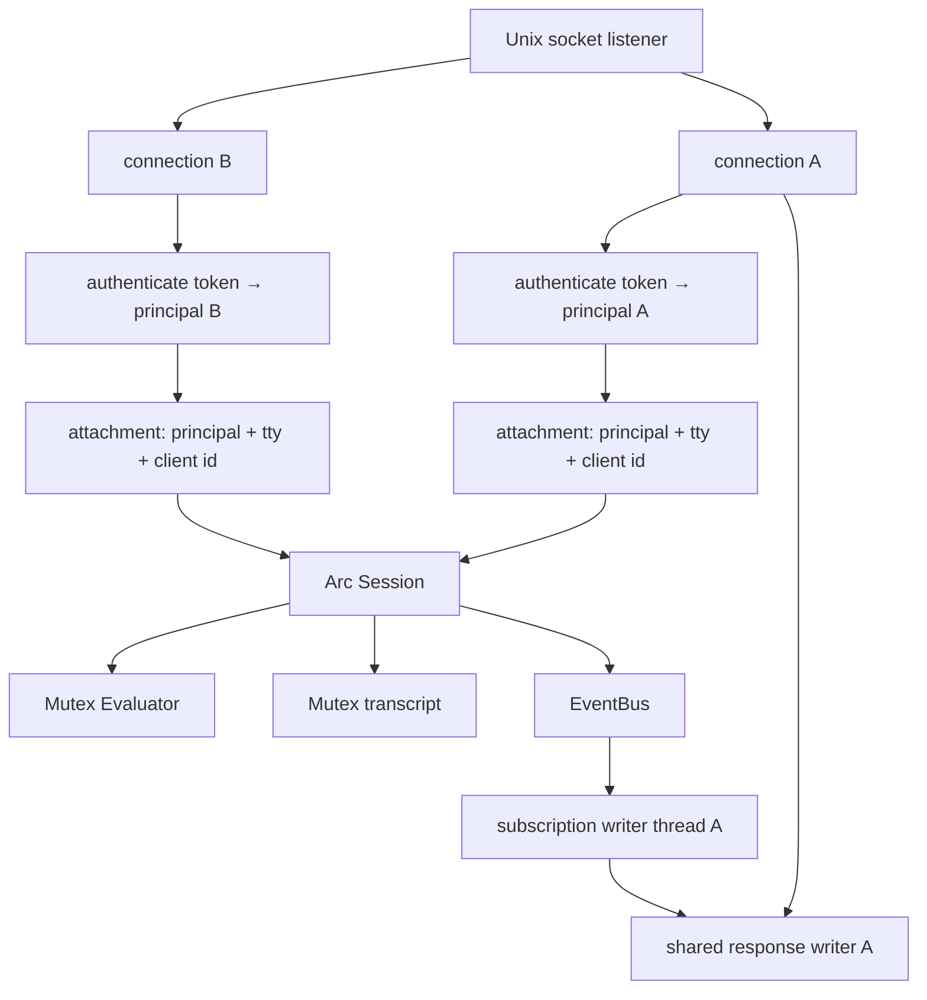
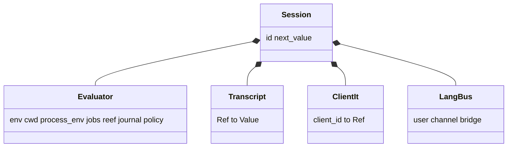
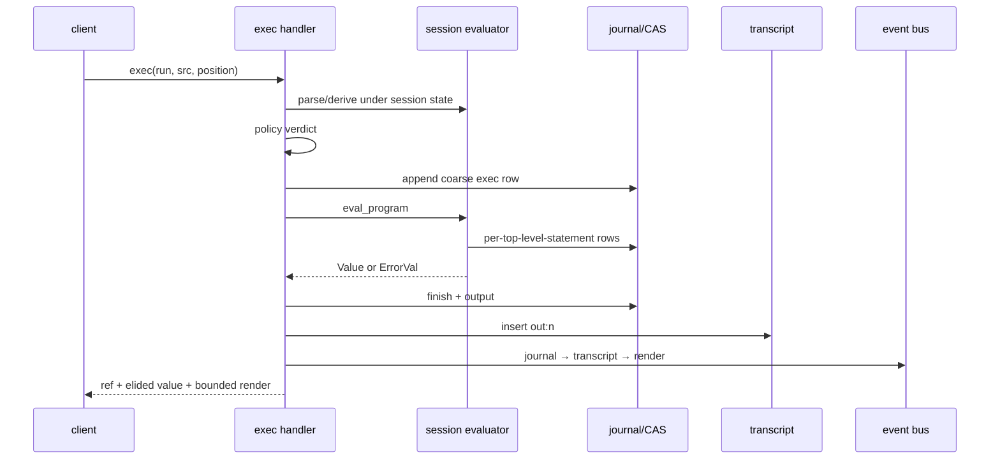
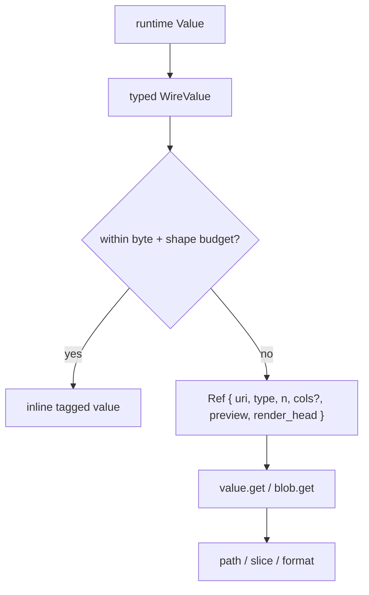
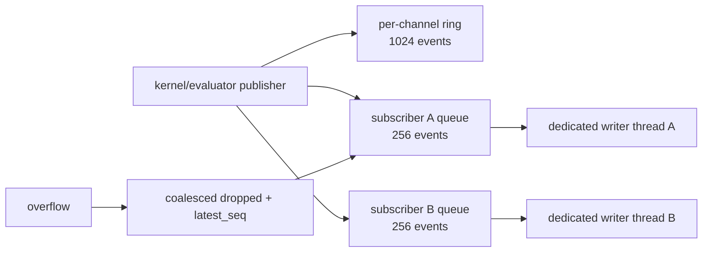

+++
title = "Kernel, sessions, and protocol"
description = "The Unix-socket server, session and connection lifetimes, RPC router, exec lifecycle, wire elision, events, tasks, plans, and PTYs."
weight = 70
template = "docs/page.html"

[extra]
group = "Kernel & agents"
eyebrow = "Kernel architecture"
status = "JSON-RPC contract"
audience = "Kernel and client authors"
wide = true
+++

`shoal-kernel` is a multi-client Unix-socket host for Shoal evaluators. It is not the backend of the
local REPL. Its added responsibilities are identity, named sessions, remote execution policy,
addressable values, bounded serialization, background tasks, long-lived PTYs, plan approval, and
event delivery.

## Process and connection model

The listener accepts a stream and serves each connection independently. A connection receives a
numeric client ID, has at most one current attachment, and shares a locked writer with subscription
threads. Frames are newline-delimited JSON-RPC 2.0.

On disconnect, subscriptions associated with that connection are removed. The named session remains
in the kernel map until process exit.

Sources: [`shoal-kernel/src/lib.rs`](https://github.com/alliecatowo/shoal/blob/main/crates/shoal-kernel/src/lib.rs)
and [`session.rs`](https://github.com/alliecatowo/shoal/blob/main/crates/shoal-kernel/src/session.rs).

## Session attachment

`session.attach` is the identity and feature-negotiation boundary. With a bearer token the token's
principal governs. Without one, the mapping splits on the declared client kind (HR-D6): a
`client.kind:"mcp"` attach lands on the restricted `agent:mcp` principal (profile `"agent"`); other
kinds keep the local `uid:N` principal (profile `local-human`). Permissive MCP attach is an explicit
opt-in (`SHOAL_MCP_PERMISSIVE` on the kernel, or `Kernel::set_mcp_permissive`). See the
[agent/MCP page](@/internals/agent-mcp.md) and the RPC reference for the mapping table.

The response reports the actual available enforcement tier and whether this principal resolves to a
real sandbox. Token capability metadata is returned separately from the policy principal.

The token store is a startup snapshot. A separate `shoal-token create` or `revoke` rewrites the file,
but a running kernel does not reload it; creation and revocation take effect only after restart (live
expiry still uses current time). Token `profile` and `caps` are echoed metadata only. Authorization
continues through the token's principal name, Leash policy, and handler ownership checks.

Every stateful method requires attachment: `journal.query` (HR-D4) and `cap.request` (HR-D1) were the
last exemptions and now reject an unattached caller with `NOT_ATTACHED`. The only naturally public
methods are `session.attach`, `parse`, and `complete`.

### Session identity and the pair-shell model

The session identity model is explicit (HR-D7), and it is the **shared pair-shell model, by
design**: a named session is one shared workspace that multiple principals deliberately join — the
product's pair-shelling goal, a human and an agent (e.g. the local `uid:N` human and the restricted
`agent:mcp`) driving one shell together.

The rules:

- **Objects are session-scoped, and sharing them inside a session is intentional.** Evaluator
  environment, transcript (`out:n` refs), tasks, PTYs, and in-language channels belong to the named
  session. Every principal attached to that session shares full visibility and control — a partner
  can read your PTY's screen, cancel your task, close your PTY. Cross-*session* access is denied
  (an unknown-ref not-found), and that is the isolation boundary.
- **Authority stays per-actor.** Each `exec` installs the *current* attachment principal's Leash
  policy before evaluation, so what a principal may do in the shared session is still its own
  policy's decision — sharing the workspace does not share authority. Plans remain
  requester-scoped, and approval requires a distinct approver by default (HR-D3), which the
  pair-shell composes with naturally: the human partner approves the agent's pending plan.
- **Attribution follows the actor at the exec boundary.** Coarse kernel journal rows, `journal`
  events, and `approval` events carry the current attachment principal. Two principals exec'ing in
  one shared session produce rows attributed to each actor (pinned by the live pair-session test).
- **One documented seam: evaluator statement-level attribution.** The session evaluator's own
  per-statement journal identity is fixed at session creation to the *first* attaching principal
  (`Evaluator::set_journal` has no per-exec principal update). Actor attribution must therefore be
  read from the coarse exec rows, not the finer statement rows, in a multi-principal session.

The **token-isolation consequence** hosts must internalize: a bearer token scopes *authority*, not
*object visibility within a session it joins*. Attaching a restricted principal to a trusted
session name grants it that session's transcript, tasks, and PTYs. The isolation boundary is the
session name — give untrusted or differently-trusted agents their own session names; never reuse
one name across trust boundaries. Isolation tests must use two principals and the *same* name; two
different names do not exercise this boundary.

## Session contents

The evaluator lock serializes evaluation and session mutation. Transcript/value reads use a separate
lock. The language event bus is cached separately so publishing `user.*` events does not wait behind
a long-running evaluation.

Creation installs jump frecency, an evaluator journal when the kernel has an on-disk state directory,
and an evaluator-to-wire `user.*` event forwarder. It does not currently load local CLI config,
aliases/env overrides, init files, bundled/extra adapters, or the user Reef manifest. See the
[system map](../system-map/#two-host-paths-not-yet-full-parity).

## RPC surface

The router is a direct method-to-handler table:

| Family | Methods |
|---|---|
| attachment/views | `session.attach`, `session.env`, `session.reef` |
| language | `parse`, `exec`, `complete`, `explain` |
| values/blobs | `value.get`, `blob.get` |
| tasks | `task.list`, `task.get`, `task.await`, `task.cancel`, `task.suspend`, `task.resume` |
| PTYs | `pty.open`, `pty.send`, `pty.read`, `pty.resize`, `pty.close`, `pty.list` |
| plans/capability | `plan.get`, `plan.list`, `plan.apply`, `cap.request` |
| journal | `journal.query` |
| events | `events.read`, `events.publish`, `events.subscribe`, `events.unsubscribe` |

Source: [`dispatch.rs`](https://github.com/alliecatowo/shoal/blob/main/crates/shoal-kernel/src/dispatch.rs).

### Attachment gate audit

The router does not apply one central attachment middleware; each handler asks for
`attached.as_ref()` independently. The actual source behavior is:

| Method class | Attachment reality |
|---|---|
| `session.attach` | creates/replaces the connection attachment |
| `parse`, `complete` | intentionally context-free and public to a socket client |
| `cap.request` | requires attachment (HR-D1); the caller is the approver, bound into the record |
| `journal.query` | requires attachment (HR-D4); rejects with `NOT_ATTACHED` before reading rows |
| every other current method | handler rejects with `NOT_ATTACHED` before its main operation |

Both former exemptions are closed: a fresh socket connection that never attached now gets
`NOT_ATTACHED` from `journal.query` and `cap.request` alike, instead of a data read or an approval
mutation. A socket mode of `0600` protects against other OS users; the attachment gate authenticates
the token principal, and `cap.request` additionally binds the approver identity.

`cap.request` used to be especially sensitive because the stored plan map is global and plan refs are
not unique object IDs (`Plan::new` hashes effects/reversibility/estimates, truncated to 16 hex
characters, so equal-effect plans overwrite). The residual hardening (unique owner-bound plan object
identity) is tracked in the roadmap, but approval is no longer unauthenticated: the approver must be
attached and — by default — distinct from the requester (HR-D3), and every approval writes an
auditable `ApprovalRecord` (HR-D2). Apply/approved execution still checks the currently stored
source/session/principal.

The target invariant is a short explicit public-method allowlist (`session.attach`, `parse`, and
`complete`), attachment for everything else, approver identity distinct from the requester, and
auditable approval records. See the [roadmap P0](../roadmap-and-priorities/).

## Execution lifecycle

`exec` has three modes: `plan`, ordinary `run`, and internal approved re-entry. Position is `stmt` or
`value`; background and timeout options can turn execution into a task.

### Synchronous run details

1. Parse submitted source and serialize its AST.
2. Lock the session evaluator and install the current actor's policy.
3. Derive the current plan and enforce `run` verdict.
4. Force the evaluator non-interactive and append a coarse kernel journal entry.
5. Set source text so evaluator per-statement journaling can slice spans correctly.
6. Evaluate in requested position.
7. Finish journal metadata and record output/error bytes.
8. Store either result or `Value::Error` in the session transcript under a fresh `out:n` ref.
9. Update only this connection's `client_it`.
10. Publish journal, transcript, and render events; return bounded wire value/render.

### Dual journal granularity

An on-disk kernel run writes a coarse RPC-exec entry and the evaluator can also write one entry per
top-level statement. The `journal` event channel indexes the coarse entry, deliberately not every
evaluator row. Queries and counts must therefore state which granularity they mean; treating all
rows as one-exec-per-row can double-count or misattribute multi-statement requests.

## References and paths

Short refs identify runtime objects:

| Ref form | Meaning |
|---|---|
| `out:n` | session transcript value |
| `task:n` | kernel background/timed task |
| `pty:n` | live kernel PTY |
| `plan:hash` | stored effect plan |
| `val:blake3:hash` | content-addressed bytes/value |

The URI projection is `shoal://kind/id`. `value.get` can walk dot fields, `[n]`, and half-open
`[a..b]` ranges. It synthesizes fields for outcomes, errors, ranges, tasks, and tables so clients can
navigate them like records. Slices clamp to collection length.

Non-UTF-8 paths use `WirePath`: a display string plus raw bytes encoded as base64 when needed. The
display field is for humans, not a guaranteed round-trip representation.

## Wire values and elision

`WireValue` is a tagged JSON algebra corresponding to runtime values. It cannot serialize live Rust
identity directly, so closures/commands/tasks/streams are represented by safe descriptors or refs.

Default automatic elision thresholds are:

| Budget | Default |
|---|---:|
| structured encoded bytes | 8 KiB |
| raw bytes | 4 KiB |
| table rows | 100 |
| list items | 500 |
| absolute text/byte hard cap | 64 KiB |
| ref preview | first 5 items or 256 bytes/chars |

Ordinary tagged-value encoding and elision clamp bytes to the 64 KiB hard cap. There is one current
exception: `value.get {format:"raw"}` in `handlers_value.rs` materializes complete resident or
CAS-backed bytes and returns a `raw_base64` field without passing through that clamp. This can turn a
small ref lookup into an arbitrarily large allocation, base64 expansion, JSON frame, and client
context payload. It is a boundary bypass to repair, not a supported way to opt out of elision.

A successful `Outcome` keeps status metadata inline while applying elision to its `.out` value.
Headless attachments have ANSI removed before render bounding; a future true-TTY kernel client can
request terminal rendering.

The protocol type comments also promise RFC 3339 for `WireValue::DateTime`, while kernel `wire.rs`
currently serializes `timestamp().to_string()`—Unix seconds as decimal text. The current emitted
bytes and declared contract disagree; clients need a compatibility-tested correction rather than an
assumption based on either comment alone.

The JSON-RPC frame limit is 16 MiB. `read_frame` currently uses `read_line` before checking length,
so the limit rejects oversized completed frames but does not prevent the temporary string allocation.
A length-delimited/bounded reader would harden hostile-client behavior.

## Event bus

Static channels are `session.transcript`, `journal`, `approval`, and `render`. `task.{id}` and
`user.{name}` are dynamic. A formerly advertised `reef` channel was removed because no producer was
wired; do not document channels that never emit.

Publishing never performs a blocking socket write. Each subscriber queue is bounded; overflow
coalesces dropped counts and the latest sequence so slow readers can detect gaps. This prevents one
stalled client from blocking producers or other subscribers, but the one-thread-per-subscription
model is a scaling boundary.

Only `journal` and `session.transcript` have durable replay reconstruction through journal-backed
indexes. Approval, render, task, and `user.*` channels are ring-only and lose old events/restart
state. A cursor read from durable channels can recover events older than the 1024-event ring.

Language `channel("user.x").emit(value)` reaches the wire bus through the session forwarder. Both
layers enforce the `user.*` namespace so language code cannot spoof kernel-owned semantic channels.

## Tasks and PTYs

Kernel background/timeout tasks are `TaskEntry` records around a worker thread, completion condition
variable, result ref/error, and evaluator cancellation token. Task events publish start and final
state. `task.await` waits for completion; cancel requests evaluator cancellation.

Suspend and resume are deliberate stubs returning `TASK_CONTROL_UNAVAILABLE`: a worker may execute
arbitrary language and recursively dispatch, not one known process group. Do not expose these as
working merely because the method names exist.

PTY records instead own one concrete long-lived `PtySession`. Methods are session-scoped, and reads
return a bounded rendered screen, cursor, change bit, liveness, and exit state—not raw escape bytes.
PTY entries and task entries are in-memory only.

## Error taxonomy

The protocol centralizes numeric codes in `shoal-proto`:

| Code | Name | Boundary |
|---:|---|---|
| -32600/-32601/-32602/-32603 | invalid request/method/params/internal | JSON-RPC contract |
| -32000 | `NOT_ATTACHED` | session required |
| -32001 | `PARSE_ERROR` | Shoal source parse |
| -32002 | `RAISED` | language `ErrorVal`, stored by ref |
| -32004/-32005 | unknown ref / bad path or slice | value addressing |
| -32010/-32011/-32012 | leash denied / approval required / unknown plan | authority |
| -32020/-32021 | task control unavailable / unknown task | tasks |
| -32022/-32023 | unknown PTY / PTY spawn failed | PTYs |
| -32030 | auth failed | token attachment |

Some codes intentionally cover related cases; preserve numbers and structured `data` compatibility.
Source: [`shoal-proto`](https://github.com/alliecatowo/shoal/blob/main/crates/shoal-proto/src/lib.rs).

## Concurrency and panic risk

Kernel maps and session components use standard mutexes and many `.lock().unwrap()` calls. This keeps
the blocking design legible, but a panic while holding a long-lived shared lock poisons it; a later
unwrap can cascade the failure across otherwise unrelated requests. High-risk boundaries include
evaluator execution, transcript/task mutation, event indexes, and auth state.

Do not mechanically replace every unwrap. First make request-handler panics impossible where
practical, isolate user-derived work from shared critical sections, and define recovery for poisoned
state. Lock-order changes also require multi-client stress tests because evaluation, journal, events,
and transcript publication cross several locks.

## Restart contract

Kernel restart preserves SQLite journal/CAS, auth store, policy files, Reef manifests/locks, and other
filesystem state. It loses session evaluator state, live transcript values, connection `it`, stored
plans/approvals, tasks, PTYs, event rings/subscribers, and non-durable channel history. Recovery work
must distinguish reconstructible metadata from live identity-bearing objects.
