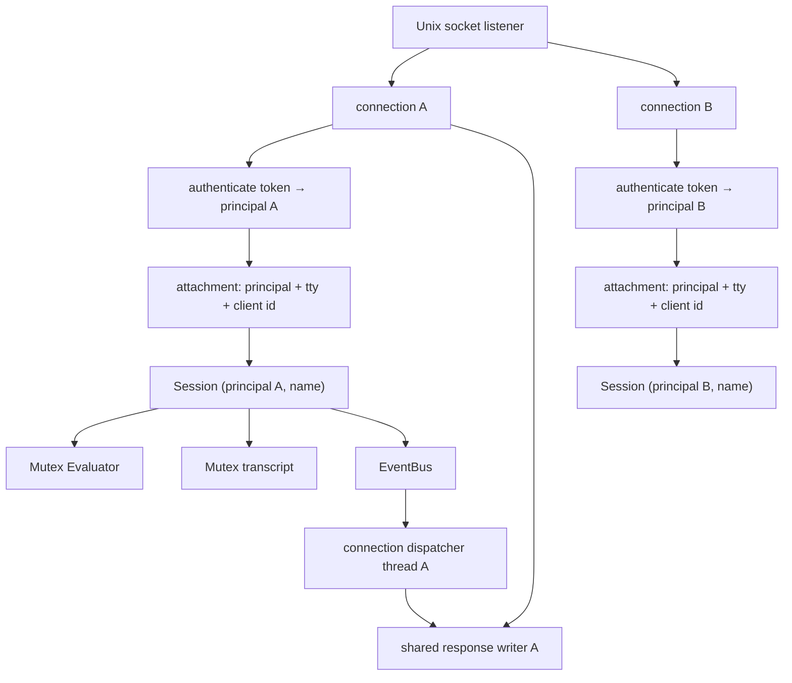
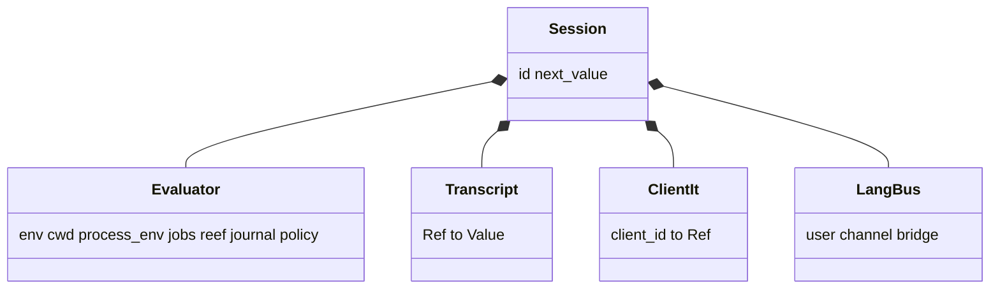
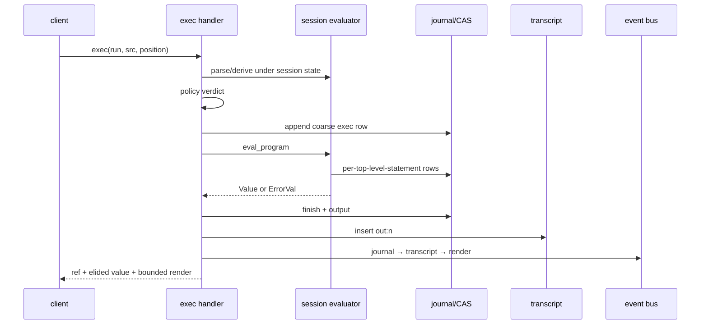
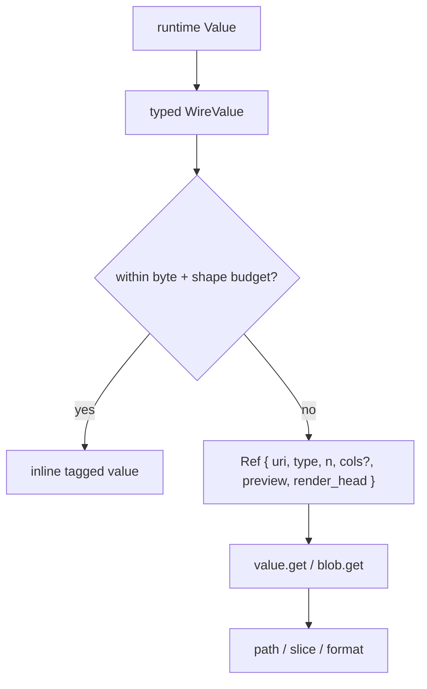
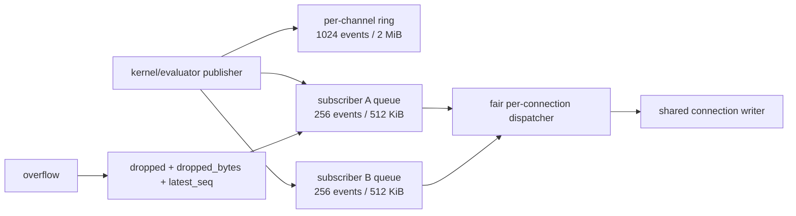

+++
title = "Kernel, sessions, and protocol"
description = "The Unix-socket server, principal-private sessions, RPC lifecycle, bounded transport, quotas, concurrency, plans, tasks, and PTYs."
weight = 70
template = "docs/page.html"

[extra]
group = "Kernel & agents"
eyebrow = "Kernel architecture"
status = "JSON-RPC contract"
audience = "Kernel and client authors"
wide = true
+++

`shoal-kernel` is a multi-client Unix-socket host for Shoal evaluators. It is not the backend of the
local REPL. Its added responsibilities are identity, named sessions, remote execution policy,
addressable values, bounded serialization, background tasks, long-lived PTYs, plan approval, and
event delivery.

## Process and connection model

The listener accepts a stream and serves each connection independently. A connection receives a
numeric client ID, has at most one current attachment, and shares a locked writer with subscription
threads. Frames are newline-delimited JSON-RPC 2.0.

On disconnect, subscriptions associated with that connection are removed. An unattached idle session
can be evicted after 24 hours or to admit another session under the configured process/principal cap.

Sources: [`shoal-kernel/src/lib.rs`](https://github.com/alliecatowo/shoal/blob/main/crates/shoal-kernel/src/lib.rs)
and [`session.rs`](https://github.com/alliecatowo/shoal/blob/main/crates/shoal-kernel/src/session.rs).

## Session attachment

`session.attach` is the identity and feature-negotiation boundary. A public filesystem-socket
connection is machine-only: an explicit bearer selects its machine principal, while tokenless MCP
attaches as restricted `agent:mcp`. Public clients cannot assert `local-human`, even by claiming a
TTY or a bearer profile with that name. Human authority exists only on the server-selected anonymous
descriptor inherited by the private interactive REPL. `shoal-mcp` verifies the returned
`auth_mode`, `connection_trust`, `session_isolation`, and security epoch before exposing tools.

Bearer validation takes a shared fd lock and loads the current token file. After attachment the
kernel refreshes the authenticated token metadata from that fresh locked snapshot before every
request; revocation, expiry, replacement, corruption, or I/O failure detaches the connection and
fails with `AUTH_FAILED`. Token create/revoke take an exclusive fd lock, reload under the lock, and
atomically replace the file, so concurrent CLIs cannot overwrite one another. Profile/cap metadata
does not directly grant language effects: Leash still evaluates the principal. The explicit
machine-admin exceptions are `supervisor` or `plan.approve`, which permit cross-principal approval.

The response reports the actual available enforcement tier and whether this principal resolves to a
real sandbox. Its typed `enforcement` preview separately reports filesystem intent/enforceability,
network-policy-only scope, pre-exec spawn pinning, hermetic disposition, and limitations. Preview
activation is always `deferred-to-spawn`; only the child execution result can report an active
backend. Token capability metadata is returned separately from the policy principal.

Every stateful method requires attachment: `journal.query` (HR-D4) and `cap.request` (HR-D1) were the
last exemptions and now reject an unattached caller with `NOT_ATTACHED`. The only naturally public
methods are `session.attach`, `parse`, and `complete`.

### Principal-private session identity

The registry key is `(principal, visible name)`, not the caller-chosen name alone. Two principals
attaching to `"work"` receive different evaluators, transcripts, refs, tasks, PTYs, event replay, and
quota owners. Journal queries force the attached principal and session into the store query, so a
caller-provided `principal` filter cannot widen access. This is strong in-process object ownership,
not hostile-tenant isolation: all principals still share one process, configured state root, and
global resource ceilings; use separate OS users/kernels for mutually hostile tenants.

## Session contents

The evaluator lock serializes evaluation and session mutation. Transcript/value reads use a separate
lock. The language event bus is cached separately so publishing `user.*` events does not wait behind
a long-running evaluation.

Creation uses the shared host bootstrap: layered config, aliases/environment, adapters, WebAssembly
plugins, Reef inputs, jump frecency, the evaluator journal, and the `user.*` event forwarder. Init
files run only for an inherited private-human TTY profile; durable/headless agent Sessions skip them.
Local terminal UI remains deliberately outside the kernel.

## RPC surface

The router is a direct method-to-handler table:

| Family | Methods |
|---|---|
| attachment/views | `session.attach`, `session.env`, `session.reef` |
| language | `parse`, `exec`, `complete`, `explain` |
| values/blobs | `value.get`, `blob.get` |
| tasks | `task.list`, `task.get`, `task.await`, `task.cancel`, `task.suspend`, `task.resume` |
| PTYs | `pty.open`, `pty.send`, `pty.read`, `pty.resize`, `pty.close`, `pty.list` |
| plans/capability | `plan.get`, `plan.list`, `plan.apply`, `cap.request` |
| journal | `journal.query` |
| events | `events.read`, `events.publish`, `events.subscribe`, `events.unsubscribe` |

Source: [`dispatch.rs`](https://github.com/alliecatowo/shoal/blob/main/crates/shoal-kernel/src/dispatch.rs).

### Attachment gate audit

The router does not apply one central attachment middleware; each handler asks for
`attached.as_ref()` independently. The actual source behavior is:

| Method class | Attachment reality |
|---|---|
| `session.attach` | creates/replaces the connection attachment |
| `parse`, `complete` | intentionally context-free and public to a socket client |
| `cap.request` | requires attachment (HR-D1); an embedded human or explicit machine approver is bound as approver |
| `journal.query` | requires attachment (HR-D4); rejects with `NOT_ATTACHED` before reading rows |
| every other current method | handler rejects with `NOT_ATTACHED` before its main operation |

Both former exemptions are closed: a fresh socket connection that never attached now gets
`NOT_ATTACHED` from `journal.query` and `cap.request` alike, instead of a data read or an approval
mutation. A socket mode of `0600` protects against other OS users; the attachment gate authenticates
the token principal, and `cap.request` additionally binds the approver identity.

Stored plans now have a full BLAKE3 binding over source, canonical AST, derived plan, session, and
requester plus a per-kernel object id, so storing identical source twice creates two objects instead
of replacing the first. `cap.request` validates and mutates the exact stored object under one lock.
The approver must be attached, authorized, and — by default — distinct from the requester (HR-D3).
Only explicit true spellings of `SHOAL_ALLOW_SELF_ACK` opt into self-acknowledgement. Approval first
reserves the exact plan transition under the plan lock, then writes a durable grant audit row; an
audit error or panic restores the reservation and grants nothing. Only after that write succeeds is
the `ApprovalRecord` published. It binds requester, approver, full plan/source hashes, owner, scope,
timestamp, grant audit ID, and consuming execution ID. Approved application atomically consumes the
one-shot grant, so concurrent or sequential replay cannot reuse it; the execution journal row links
back to the grant audit.

The invariant is a short public-method allowlist (`session.attach`, `parse`, and `complete`), fresh
authority checking on every attached request, explicit approver authority, default separation,
immutable plan binding, and durably auditable one-shot approval.

## Execution lifecycle

`exec` has three modes: `plan`, ordinary `run`, and internal approved re-entry. Position is `stmt` or
`value`; background and timeout options can turn execution into a task.

### Synchronous run details

1. Parse submitted source and serialize its AST.
2. Lock the session evaluator and install the current actor's policy.
3. Derive the current plan and enforce `run` verdict.
4. Force the evaluator non-interactive and append a coarse kernel journal entry.
5. Set source text so evaluator per-statement journaling can slice spans correctly.
6. Evaluate in requested position.
7. Finish journal metadata and record output/error bytes.
8. Store either result or `Value::Error` in the session transcript under a fresh `out:n` ref.
9. Update only this connection's `client_it`.
10. Publish journal, transcript, and render events; return bounded wire value/render.

### Dual journal granularity

An on-disk kernel run writes a coarse RPC-exec entry and the evaluator can also write one entry per
top-level statement. The `journal` event channel indexes the coarse entry, deliberately not every
evaluator row. Schema v2 records `kind = exec|statement|approval`; evaluator rows also store the
coarse exec ID in `parent_id`. Kernel and standalone hosts receive the final statement ID directly
from the evaluator instead of discovering a timestamp-adjacent row. Queries can filter by kind;
unfiltered counts still intentionally include both granularities.

## References and paths

Short refs identify runtime objects:

| Ref form | Meaning |
|---|---|
| `out:n` | session transcript value |
| `task:n` | kernel background/timed task |
| `pty:n` | live kernel PTY |
| `plan:hash` | stored effect plan |
| `val:blake3:hash` | content-addressed bytes/value |

The URI projection is `shoal://kind/id`. `value.get` can walk dot fields, `[n]`, and half-open
`[a..b]` ranges. It synthesizes fields for outcomes, errors, ranges, tasks, and tables so clients can
navigate them like records. Slices clamp to collection length.

Non-UTF-8 paths use `WirePath`: a display string plus raw bytes encoded as base64 when needed. The
display field is for humans, not a guaranteed round-trip representation.

## Wire values and elision

`WireValue` is a tagged JSON algebra corresponding to runtime values. It cannot serialize live Rust
identity directly, so closures/commands/tasks/streams are represented by safe descriptors or refs.

Default automatic elision thresholds are:

| Budget | Default |
|---|---:|
| structured encoded bytes | 8 KiB |
| raw bytes | 4 KiB |
| table rows | 100 |
| list items | 500 |
| absolute text/byte hard cap | 64 KiB |
| ref preview | first 5 items or 256 bytes/chars |

Ordinary tagged-value encoding and elision clamp bytes to the 64 KiB hard cap. There is one current
explicit-transfer path: `value.get {format:"raw"}` returns at most 8 KiB of decoded content per
response plus continuation metadata. Resident strings/bytes are sliced before encoding; CAS-backed
bytes use a verified bounded-memory stream. Strings retain the existing Unicode-scalar slice units,
while bytes use octets. `blob.get` likewise accepts byte `offset`/`length`, clamps length to the same
wall, and never materializes the whole compressed-store object for a page. An exact verified-page
LRU (1 MiB/256 entries) removes repeat work; cache misses are admitted through a principal/session
decompression rate window (64 starts per 10 seconds by default), so hostile random offsets cannot
force unbounded repeated full-stream verification.

A successful `Outcome` keeps status metadata inline while applying elision to its `.out` value.
Headless attachments have ANSI removed before render bounding; a future true-TTY kernel client can
request terminal rendering.

The protocol type comments also promise RFC 3339 for `WireValue::DateTime`, while kernel `wire.rs`
currently serializes `timestamp().to_string()`—Unix seconds as decimal text. The current emitted
bytes and declared contract disagree; clients need a compatibility-tested correction rather than an
assumption based on either comment alone.

The JSON-RPC content limit is 16 MiB. Kernel and MCP readers wrap input in a bounded reader before
`read_line`, so oversized or unterminated frames cannot grow the line buffer beyond the cap plus
terminator sentinel. A fixed-stack lexical pass rejects depth above 64, more than 65,536 values,
more than 16,384 items/members in one container, object keys over 64 KiB decoded, and numeric tokens
over 1 KiB before `serde_json` tree allocation. The same limits apply to buffered outbound frames.
Public kernel frames also have a 10-second first-byte/remainder timeout by default.

The MCP facade adds semantic admission before dispatch. Every resource operation admits at most a
4 KiB raw URI, four path segments, sixteen query pairs, 512 decoded bytes per path segment, 64 per
query key, and 2 KiB per query value. Percent escapes and UTF-8 are strict; decoded duplicate keys,
unknown parameters, and path shapes outside that resource's advertised schema fail without quoting
the URI. Numeric extremes are parsed exactly and then reach the kernel's existing raw-page,
event-page, and journal-page clamps. Tool names are limited to the fixed advertised set, source is
limited to the parser's 4 MiB wall, identifier strings and argument collections are bounded, and
unknown fields fail before a kernel call. MCP text remains a 64 KiB UTF-8 byte cap. Kernel error
data is not reflected through the facade, so a rejected path, body, or bearer cannot become an MCP
error amplification channel. Tool and resource structured content has an 8 MiB serialized ceiling,
leaving framing headroom when the facade wraps a bounded kernel response in MCP result metadata.

## Event bus

Static channels are `session.transcript`, `journal`, `approval`, and `render`. `task.{id}` and
`user.{name}` are dynamic. A formerly advertised `reef` channel was removed because no producer was
wired; do not document channels that never emit.

Publishing never performs a blocking socket write. Each subscriber queue is count- and byte-bounded;
overflow coalesces exact dropped counts/bytes and the latest sequence so slow readers detect gaps. This prevents one
stalled client from blocking producers or other subscribers, but the one-thread-per-connection
model is a scaling boundary.

Only `journal` and `session.transcript` have durable replay reconstruction. Their in-memory pointer
windows are capped at 1,024 per exact owner; older bounded pages resolve from the journal. Owners are
hydrated lazily on first use, so kernel startup never loads every historical event. `events.read`
returns at most 256 events and 8 MiB per forward page; follow `page.next_since` while
`page.truncated` is true. Approval, render, task, and `user.*` channels are ring-only and report
`page.history_lost` when the requested cursor predates their retained tail.

Language `channel("user.x").emit(value)` reaches the wire bus through the session forwarder. Both
layers enforce the `user.*` namespace so language code cannot spoof kernel-owned semantic channels.
The kernel additionally admits at most 64 KiB/64 levels per user payload, 128 bytes per channel name,
and 256 retained user-channel identities per exact owner before cloning into live state.

## Tasks and PTYs

Kernel background/timeout tasks are `TaskEntry` records around a worker thread, completion condition
variable, result ref/error, and evaluator cancellation epoch. Capture/PTY execution registers its
process group with that epoch; linked child evaluators share the same registry. `task.suspend` uses
`SIGSTOP` and `task.resume` uses `SIGCONT` for all currently registered groups. Evaluator-only work
has no independently stoppable OS owner and returns `TASK_CONTROL_UNAVAILABLE` honestly. Cancellation
continues stopped groups before the existing INT → TERM → KILL ladder. `task.await` waits across the
`suspended` state until terminal completion. Every task record includes an advisory `controls`
snapshot (`cancel`, `suspend`, `resume`, and `active_process_groups`) so clients can discover useful
operations before attempting them. Membership can change immediately after a read, so the control
RPC remains authoritative and may still return unavailable.

PTY records instead own one concrete long-lived `PtySession`. Methods are owner-scoped, and reads
return a bounded rendered screen, cursor, change bit, liveness, and exit state—not raw escape bytes.
PTY entries and task entries are in-memory only.

## Error taxonomy

The protocol centralizes numeric codes in `shoal-proto`:

| Code | Name | Boundary |
|---:|---|---|
| -32600/-32601/-32602/-32603 | invalid request/method/params/internal | JSON-RPC contract |
| -32000 | `NOT_ATTACHED` | session required |
| -32001 | `PARSE_ERROR` | Shoal source parse |
| -32002 | `RAISED` | language `ErrorVal`, stored by ref |
| -32004/-32005 | unknown ref / bad path or slice | value addressing |
| -32010/-32011/-32012 | leash denied / approval required / unknown plan | authority |
| -32020/-32021 | task control unavailable / unknown task | tasks |
| -32022/-32023 | unknown PTY / PTY spawn failed | PTYs |
| -32030 | auth failed | token attachment |

Some codes intentionally cover related cases; preserve numbers and structured `data` compatibility.
Source: [`shoal-proto`](https://github.com/alliecatowo/shoal/blob/main/crates/shoal-proto/src/lib.rs).

## Concurrency model, quotas, and lifecycle

The kernel uses one OS thread per accepted connection, one worker per active background task, and one
writer thread per active subscription. A session evaluator mutex serializes commands for one exact
`(principal, name)` owner; a slow command does not block another principal's same-named session, but
it does queue the owner's other commands. PTYs own independent mutexes. Request panics quarantine the
affected session; poison-sensitive registries either reconstruct a terminal record or quarantine the
subsystem instead of treating poisoned state as valid.

Default admission limits are:

| Resource | Default | Scope and release semantics |
|---|---:|---|
| connections | 64 | process-wide permit, released on disconnect |
| retained sessions | 256 | process-wide; fixed 64 per principal; idle/LRU eviction only when no external lease remains |
| active background tasks | 128 | exact principal/session owner; permit released at terminal state |
| active PTYs | 32 / 64 / 256 | exact owner / principal aggregate / process-wide; reserved before spawn, released on close/drop |
| subscriptions | 256 | exact owner; released on unsubscribe/disconnect |
| CAS verification starts | 64 per 10 s | exact owner; cache hits are free |
| frame read deadline | 10 s | first byte and remainder; zero disables |

The configurable process/session ceilings use `QUOTA_EXCEEDED` with structured `limit`/`max` data.
Session admission first removes unleased sessions idle for 24 hours, then evicts the least-recently
used unleased owner session when a principal/process ceiling is full; if every candidate is leased,
the new attach is rejected. Existing sessions remain attachable after a ceiling is lowered.
In-language `spawn`/`parallel`/`on` and stream pump threads are not counted by these kernel
registries, but evaluator admission separately caps native workers at 64 per session and 512 per
process. The systems are independently bounded rather than one universal thread executor.

## Restart contract

Kernel restart preserves SQLite journal/CAS, auth store, policy files, Reef manifests/locks, and other
filesystem state. It loses session evaluator state, live transcript values, connection `it`, stored
plans/approvals, tasks, PTYs, event rings/subscribers, and non-durable channel history. Recovery work
must distinguish reconstructible metadata from live identity-bearing objects.
