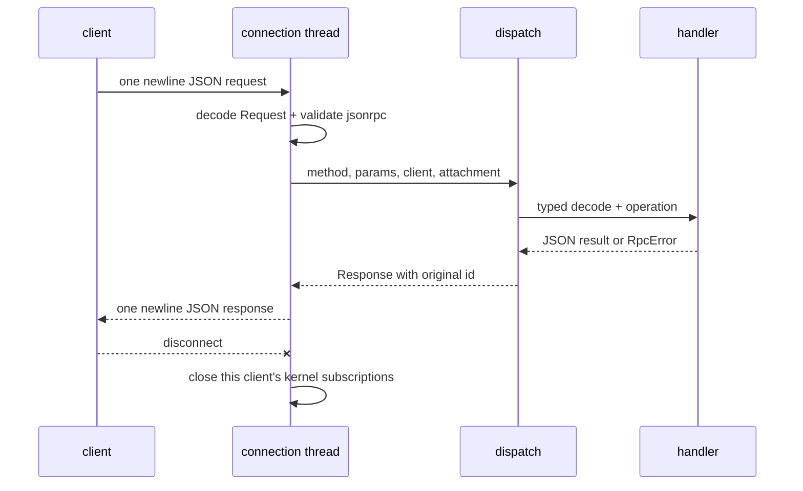
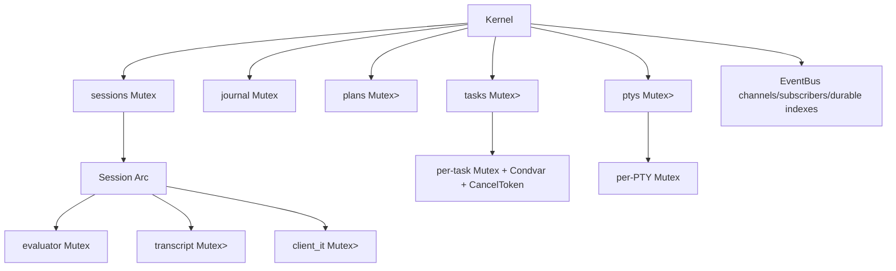

+++
title = "Kernel RPC handler reference"
description = "A method-by-method reference for Shoal kernel attachment, execution, value, plan, task, PTY, journal, event, and introspection handlers."
weight = 71
template = "docs/page.html"

[extra]
group = "Kernel & agents"
eyebrow = "Handler atlas"
status = "Source-audited: 2026-07-16"
audience = "Kernel, protocol, MCP, and security maintainers"
wide = true
+++

This is the exact handler atlas for the newline-framed JSON-RPC server. It complements the
[kernel architecture chapter](../kernel-protocol/) and the
[intercrate protocol contract](../intercrate-protocol-contracts/): those explain the system; this
page makes every routed method, state read, scope check, and known discrepancy reviewable in one
place.

The authority is the direct match in `crates/shoal-kernel/src/dispatch.rs`, the parameter/result
types in `shoal-proto`, and the handler bodies. Examples omit the terminating newline for readability.

## Envelope and connection lifecycle

Every request is one UTF-8 JSON object followed by `\n`:

```json
{"jsonrpc":"2.0","id":1,"method":"parse","params":{"src":"1 + 2"}}
```

A response repeats the arbitrary JSON `id` and has exactly one of `result` or `error`:

```json
{"jsonrpc":"2.0","id":1,"result":{"ast_version":2,"ast":{"stmts":[]}}}
```

```json
{"jsonrpc":"2.0","id":1,"error":{"code":-32000,"message":"attach to a session first"}}
```

The listener is a nonblocking Unix listener so shutdown can be polled. Each accepted stream is reset
to blocking mode and handled by one OS thread. A connection gets a monotonically allocated `client`
number and at most one `Attachment`. The same socket writer is shared with subscription push threads;
whole frames are serialized under its mutex so notifications and responses cannot interleave bytes.



`read_frame` checks a 16 MiB limit **after** `BufRead::read_line` has accumulated the line. The
completed-frame contract exists, but memory allocation is not bounded against a peer that never sends
a newline. The MCP stdio reader has the same shape.

## Router and attachment matrix

| Method | Handler module | Attached? | State class |
|---|---|---:|---|
| `session.attach` | `session.rs` | creates it | session/auth mutation |
| `session.env` | `session.rs` | yes | evaluator read + policy |
| `session.reef` | `session.rs` | yes | evaluator cache read |
| `parse` | `handlers_session.rs` | no | pure syntax |
| `complete` | `handlers_session.rs` | no | lexical completion |
| `explain` | `handlers_session.rs` | yes | parser + evaluator plan derivation |
| `exec` | `handlers_exec.rs` | yes | evaluator, journal, transcript, tasks |
| `value.get` | `handlers_value.rs` | yes | session transcript/CAS read |
| `blob.get` | `handlers_session.rs` | yes | shared CAS read |
| `task.list/get/await/cancel/suspend/resume` | `handlers_task.rs` | yes | session-scoped task registry |
| `pty.open/send/read/resize/close/list` | `handlers_pty.rs` | yes | session-scoped PTY registry |
| `plan.get/list/apply` | `handlers_task.rs` | yes | session/principal-scoped plan registry |
| `cap.request` | `handlers_task.rs` | yes | attached approval mutation, approver-bound |
| `journal.query` | `handlers_value.rs` | yes | attached persistent journal read |
| `events.read/publish/subscribe/unsubscribe` | `eventbus.rs` | yes | global bus plus session bridge |

Both former exemptions are closed: `journal.query` requires attachment (HR-D4), and `cap.request`
requires attachment and binds an approver identity distinct from the requester (HR-D1/D2/D3). The only
methods that remain naturally public are attach, context-free parse, and context-free completion. The
socket's `0600` mode limits OS users, not Shoal token principals — the approver-identity binding does.

## `session.*`

### `session.attach`

Request:

| Field | Type/default | Meaning |
|---|---|---|
| `session` | string or `null`; default `"default"` | named in-memory evaluator |
| `token` | string or `null` | bearer token validated by the persistent kernel |
| `client.kind` | string | descriptive client class |
| `client.tty` | bool | retain terminal color in bounded renders when true |

With a token, `TokenStore::validate` supplies `principal`, token caps, and profile. Without a token,
the caller becomes `uid:<effective-uid>` with profile `local-human`. An ephemeral kernel has no token
store and rejects a supplied token. Calling attach again replaces that connection's attachment.

The persistent kernel loads `tokens.json` once at startup. `shoal-token` is a separate process whose
create/revoke writes are not observed until the kernel restarts; already-loaded expirations still
become invalid as wall time advances. The returned profile and cap strings are descriptive metadata,
not grants. Only principal-based Leash policy and handler ownership checks authorize operations.

The session map is currently keyed only by `session` name. `principal` is consulted when the name is
first created; later callers receive the cached session. This is not a safe multi-principal ownership
model.

Result fields:

| Field | Meaning |
|---|---|
| `session`, `principal` | selected name and actor |
| `caps` | enforcement/tier/profile/token-cap/opaque-verdict summary |
| `cwd` | lossless `WirePath` |
| `env_hash` | currently literal `"local"`, not a real environment digest |
| `ast_version` | currently 2 |
| `caps_enforced` | whether a real backend and non-permissive policy combine to enforce |
| `elide_defaults` | default value budgets |
| `channels` | static kernel channels: transcript, journal, approval, render |

Creation installs a fresh evaluator at the kernel process cwd, default jump history, an optional
second journal handle onto the same state directory, and the `user.*` language-to-wire event bridge.
It does not assemble the local CLI's layered config/init/adapters/Reef environment.

### `session.env`

Params are `{}`. The handler reads the evaluator's session-local environment, retains only UTF-8
name/value pairs, sorts names, then evaluates one `EnvRead {names}` effect for the attached principal.
It returns either:

```json
{"granted":false,"names":["HOME","PATH"]}
```

or, when allowed:

```json
{"granted":true,"names":["HOME","PATH"],"env":{"HOME":"/home/a","PATH":"..."}}
```

The names themselves are disclosed before the grant; only values are conditional.

### `session.reef`

Params are `{}`. It calls the evaluator's cached `prompt_reef_snapshot`, not a fresh provider query or
version probe. Result:

```json
{
  "active_scope":"/work/project/.reef.toml",
  "bindings":[
    {"tool":"node","version":"22.0.0","provider":"mise","scope":"project","constrained":true}
  ]
}
```

A constrained but unlocked tool can have null version/provider fields. Correctness inherits the
evaluator's current Reef cache invalidation limitations.

## Syntax and introspection

### `parse`

Input is `{src: string}`. It invokes context-free `shoal_syntax::parse`, so it does not see session
bindings that can affect statement-head classification. Success is `{ast_version: 2, ast}`. A
language parse failure is `PARSE_ERROR (-32001)` with `{span, hint}` in `error.data`; it is not the
JSON framing parse code `-32700`.

### `complete`

Input is `{src, cursor?}`. `cursor` is a UTF-8 byte index, defaults to `src.len()`, and is clamped to
the source byte length. Result is `{candidates: [...]}` from `complete_at`. The endpoint is not
session/evaluator-semantic completion.

### `explain`

Input must contain either `src` or `ast`. If both exist, `src` wins. Source parse failures use
`PARSE_ERROR`; invalid AST JSON uses `INVALID_PARAMS`; neither present also uses `INVALID_PARAMS`.

It locks the session evaluator long enough to derive a plan and returns:

```json
{
  "ast_version":2,
  "ast":{},
  "effects":[],
  "reversibility":"reversible",
  "plan_ref":"plan:..."
}
```

`explain` does not insert the plan into the kernel plan map. Its `plan_ref` is descriptive and cannot
be assumed applicable through `plan.apply`.

## `exec`

### Parameters

| Field | Type/default | Contract |
|---|---|---|
| `src` | string, required | Shoal program |
| `mode` | `run` by default | `run`, `plan`, or internal verified `approved` |
| `position` | `stmt` by default | `stmt` raises failed outcomes; `value` captures them |
| `async` | false; `background` accepted alias | immediately return a task |
| `timeout_ms` | null | run on a task and wait only this long |
| `elide` | null | optional max bytes/rows/items, still under hard cap |
| `plan_ref` | null | required for `approved` re-entry |

Any async request or request carrying `timeout_ms` first creates a `task:N`, publishes `started` on
`task.N`, and recursively dispatches a synchronous exec in a worker thread. `async:true` returns
immediately. A timeout request waits; if work finishes before the deadline it reconstructs an inline
result from the transcript, otherwise it returns the still-running task and `timed_out:true`. Timeout
does not cancel work.


### Plan mode

`mode:"plan"` parses, derives effects, evaluates the actor policy, and inserts a `StoredPlan` with
source, session, principal, plan, and an approved bit that starts true only for `Allow`. It publishes
an `approval` event for `ApprovalRequired`. The returned `PlanResult` contains ref, effects,
reversibility, verdict, and `approval_pending`.

Current plan refs are the first 16 hex characters of blake3 over only `(effects, reversibility,
estimates)`. They exclude source/session/principal. Insertion into the global map can overwrite an
equal-shape plan; do not use the ref as a unique object ID or bearer capability.

### Run and approved modes

Ordinary run derives a fresh plan and returns `LEASH_DENIED` or `APPROVAL_REQUIRED` before evaluation
when policy says so. Approved mode verifies the currently stored ref has the same session, principal,
and source and is approved or now policy-allowed. A caller cannot merely write `mode:"approved"` to
skip the gate.

The evaluator is locked for the synchronous run. The handler:

1. installs this actor's Leash policy on the evaluator;
2. derives the plan and appends a coarse journal row;
3. stores current source for per-statement evaluator journaling;
4. evaluates at the requested position;
5. finishes the coarse row and records output blobs;
6. stores the value under `out:N` in the session transcript;
7. records a durable transcript-event payload;
8. publishes `journal`, `session.transcript`, and `render` events;
9. returns the structural value and bounded human render.

A raised language error is still inserted as an addressable `out:N`; the RPC error is `RAISED
(-32002)` and its data includes language code/span/hint/status/stderr/ref/URI. The coarse journal row
is finished false and optional stderr is recorded.

### Result bounding

The normal result is `{ref, value, render}`. Structural elision uses the per-call/default budgets and
hard 64 KiB ceiling; render is independently bounded and strips ANSI for `tty:false`. The full value
remains in the in-memory transcript and outputs may be persisted in CAS.

## Values and blobs

### `value.get`

Input:

| Field | Meaning |
|---|---|
| `ref` | session transcript ref such as `out:3` |
| `path` | field/index traversal expression |
| `slice` | `[start,end]`, end-exclusive and clamped |
| `elide` | JSON-value budgets |
| `format` | `json` default, `render`, or `raw` |

Resolution order is transcript lookup → path → slice → format. Slices work for lists, table rows,
Unicode scalar positions in strings, resident byte offsets, and CAS-backed bytes after full
resolution. Slicing another kind is `BAD_PATH_OR_SLICE` rather than a silent no-op.

`json` returns `{ref,value}` with structural elision. `render` returns `{ref,render}` with the hard
render cap. `raw` returns `{ref,raw}` for strings or `{ref,raw_base64}` for bytes. Raw bytes currently
bypass the 64 KiB normal value wall, and a CAS-backed raw request materializes the complete blob
before base64 encoding. This needs offset/length or chunked blob retrieval.

Refs are looked up only in the attached session's transcript map. A missing ref or failed CAS
resolution is `UNKNOWN_REF`; invalid path/slice/type format is `BAD_PATH_OR_SLICE`.

### `blob.get`

Input is `{hash}`. It reads from the kernel journal's CAS. If bytes parse as JSON, result is
`{hash,value:<that JSON>}`. Otherwise it produces a `$:"bytes"` tagged object with length and full
base64. Unknown hash is `UNKNOWN_REF`. The method requires attachment, but the blob lookup itself is
global to the shared CAS and does not prove the caller learned the hash from an authorized row.

## Tasks

Task records contain `task`, `session`, `state`, `started_ns`, `finished_ns`, `result_ref`, and
optional `RpcError`. State vocabulary observed in the handler is `running`, `cancelling`,
`cancelled`, `failed`, and `completed`.

| Method | Params | Behavior/result |
|---|---|---|
| `task.list` | `{}` | all task records whose `task.session.id` equals attached session ID |
| `task.get` | `{task}` | nonblocking snapshot |
| `task.await` | `{task}` | waits on condvar until not running/cancelling |
| `task.cancel` | `{task}` | marks cancelling, sets requested flag, fires cancel token |
| `task.suspend` | `{task}` | validates ownership, then `TASK_CONTROL_UNAVAILABLE` |
| `task.resume` | `{task}` | validates ownership, then `TASK_CONTROL_UNAVAILABLE` |

Ownership is by `session.id`, not directly principal. That inherits the named-session cross-principal
weakness. Tasks remain in the process-global map after completion; there is no eviction/persistence
policy in the handler path.

Cancellation is cooperative through the evaluator/exec cancellation token. A failed outcome returned
in value position is inspected so the task becomes failed; a signal-killed outcome after a requested
cancel becomes cancelled rather than completed.

## Plans and capability approval

### `plan.get`

Input `{plan_ref}`. The handler requires the attached session and principal to match the current
stored record. It reparses stored source for AST, evaluates the current verdict, and returns AST
version/AST/ref/effects/reversibility/verdict/approval flags/source. Unknown is `UNKNOWN_PLAN`; wrong
owner is deliberately reported as `LEASH_DENIED` rather than revealing it.

### `plan.list`

Params `{}`. Returns only records matching attached session and principal. Each record includes ref,
effects, reversibility, current verdict, `approval_pending`, and `approved`; source/AST are omitted.
Ordering follows `HashMap` iteration and is not a stable wire order.

### `plan.apply`

Input `{plan_ref}`. It checks attached session/principal, then requires either the mutable approved bit
or a currently `Allow` verdict. It recursively dispatches `exec` with stored source, statement
position, `mode:"approved"`, and the same ref. The approved exec performs its own same-source/session/
principal verification and re-derives the execution plan.

### `cap.request`

**Requires attachment** (HR-D1). Input `{plan_ref?, effects: [...]}`; `plan_ref` is operationally
required. The attachment principal is the **approver**. Effect entries can be strings or objects with
`kind`; dotted and snake-case spellings are normalized.

Authority model (HR-D2/HR-D3):

1. an unattached caller is rejected with `NOT_ATTACHED` before any approval logic;
2. **separation of duties** — the approver must differ from the plan's requester (owner). A requester
   approving its own plan is `LEASH_DENIED` ("self-approval is not permitted") unless
   self-acknowledgement is explicitly enabled (`SHOAL_ALLOW_SELF_ACK`, or
   `Kernel::set_allow_self_ack`); the default is separation;
3. approval never overrides a hard denial: the plan owner's policy must not evaluate the plan to
   `Deny`, else `LEASH_DENIED`;
4. if a nonempty request omits a plan effect, the result stays `approval_pending` and lists the
   uncovered effects (approval never silently widens past the requested scope);
5. otherwise the plan is approved. An **`ApprovalRecord`** is bound onto the plan — requester,
   approver, plan ref/hash, granted scope, approval timestamp, and (once the approved plan actually
   runs) the journal entry id of the consuming execution. The binding is mirrored into the journal as
   an audit entry (`journal.query` sees a `# approval …` row) and surfaced on `plan.get.approval`.

Response: `{grant:"approved", plan_ref, enforced, granted_effects, requester, approver}`. `enforced`
reports the same honest OS-enforcement truth `session.attach.caps_enforced` does for the requester.

## PTYs

PTY refs are `pty:N`. Registry entries store session ID, recorded principal, display command, and a
mutex-protected `shoal_exec::PtySession`. All methods require attachment and lookups compare session
ID. The principal field is currently not used for access checks.

### `pty.open`

Input `{cmd,args?,cols?,rows?,env?}`. Empty command is invalid. The handler snapshots cwd and session
environment, layers string overrides, defaults to 80×24, optionally gates a content hash when spawn
pinning is active, derives a sandbox, then opens the real PTY and vt100 emulator.

Result is `{pty_id,pid,cols,rows,cmd}` with actual clamped size. Spawn/policy errors use the dedicated
PTY/Leash codes. The PTY path evaluates only the ProcSpawn pin gate explicitly; review effect parity
when adding env/cwd/filesystem policy semantics.

### `pty.send`

Input is `{pty_id,input}`. Input recursively accepts:

- string: literal UTF-8;
- `{key:"Enter"}`: named terminal key;
- `{text:"literal"}`: literal UTF-8;
- `{bytes:"base64"}`: decoded bytes;
- array mixing any of those in order.

Result reports `{pty_id,sent:<byte count>}`. Invalid shapes/keys/base64 use `INVALID_PARAMS`;
write failure uses `INTERNAL_ERROR`.

### `pty.read`

Input `{pty_id}`. Result is bounded by the emulator grid:

```text
pty_id, cmd, cols, rows,
cursor {row, col, hidden},
screen [one string per row],
changed, alive, exit {status, signal} | null, pid
```

It returns the rendered terminal state, never an unbounded escape-sequence log. `changed` compares
with the previous read on that PTY session.

### `pty.resize`, `pty.close`, and `pty.list`

`pty.resize {pty_id,cols,rows}` updates the OS window and emulator, then reports actual dimensions.
`pty.close {pty_id}` checks ownership before removing the map entry, terminates/reaps, and returns
exit data. Drop is a teardown backstop. `pty.list {}` snapshots matching entries, drops the registry
lock, reads each PTY, sorts by numeric ID, and omits screen contents.

There is no PTY-change subscription; clients poll `pty.read` and inspect `changed`.

## Journal query

`journal.query` **requires attachment** and accepts `{since,until,principal,head,ok,effects,limit}`.
Timestamps are Unix epoch nanoseconds. Store-side filters are since/principal/head/ok/limit; the
kernel then post-filters `until` and requires every requested effect substring after dotted/snake
normalization.

`limit` is an optional integer with three-way semantics enforced by the kernel above the store:

| `limit` | Result |
|---|---|
| omitted / `null` | the default page size (100 rows) |
| explicit `0` | **zero rows** — an empty page, never "unbounded" |
| `n` | `min(n, `server maximum`)`; the ceiling is 10,000 rows |

The explicit-zero case is short-circuited in the handler and never reaches the store (whose own
`limit: 0` sentinel means "default 100"). The wire field is therefore `Option<usize>`, so an omitted
limit is distinguishable from a caller who genuinely asked for nothing. The server-side maximum caps a
hostile `limit: usize::MAX` so one query cannot stream the whole journal into a single frame.

Rows are newest-first and contain ID, session, principal, timestamp/duration, lossless cwd, source,
parsed AST/effects, status/ok/opaque, and output `{kind,hash,len}` entries. Output content is fetched
separately through blob/value routes.

Attachment is required for the caller-authentication side effect. A shared pair-shell session's
journal is intentionally readable by every principal attached to that session (see
[session identity](../kernel-protocol/#session-identity-and-the-pair-shell-model)); cross-session
isolation is by using distinct session names. `until`/effects post-filter **after** the store limit,
so a request can return fewer than its limit even when older matching rows exist. Effect matching uses
serialized JSON substring containment rather than parsed effect-kind equality, so the filter deserves
replacement by a typed store query.

## Events

An event is `{channel,seq,ts,payload}`. Sequence is monotonic per channel. Every channel has a
1,024-event ring. Each kernel subscriber has a 256-event queue and dedicated writer thread. At
capacity, events coalesce into `{dropped,latest_seq}` rather than growing without bound.

| Method | Params | Result/behavior |
|---|---|---|
| `events.read` | `{channel,since?,limit?}` | `{channel,events}`; `since` is exclusive |
| `events.publish` | `{channel,payload}` | only `user.*`; returns channel/seq/ts and injects language bus |
| `events.subscribe` | `{channel,since?}` | registers this connection; replays ring then pushes notifications |
| `events.unsubscribe` | `{channel,since?}` | closes/removes this connection/channel queue; `since` ignored |

`journal` and `session.transcript` have durable cold replay. The bus keeps dense seq→entry-ID indexes,
reseeded from journal data at kernel open. A request older than the ring reconstructs those events and
then appends the live ring tail. `approval`, `render`, task, and `user.*` channels are ring-only and
lose history/restart sequence.

`events.publish` rejects kernel-owned names and mirrors the JSON payload into the attached evaluator's
language EventBus without holding the evaluator lock. Language-originated `user.*` emits take the
reverse forwarder and do not echo on injection.

Kernel unsubscribe correctly closes its writer queue. MCP `resources/unsubscribe` is a separate known
gap: the facade does not retain the dedicated connection/thread handle needed to issue this method.

## Error mapping by method family

| Code | Common producers | Boundary meaning |
|---:|---|---|
| -32600 | connection loop | wrong JSON-RPC version |
| -32601 | router fallback | unknown method |
| -32602 | typed decode, enum/path/channel validation | caller parameters invalid |
| -32603 | serialization/journal/PTY/event subscription environment | unexpected internal failure |
| -32000 | attached handlers | no session attachment |
| -32001 | parse/exec/explain | Shoal source parse failure |
| -32002 | exec | raised language `ErrorVal`, still addressable |
| -32004 | value/blob | unknown transcript ref/hash or failed CAS resolution |
| -32005 | value.get | invalid path/slice/raw-format combination |
| -32010 | run/approved/plan/PTY | Leash denial or owner mismatch |
| -32011 | run/apply/PTY | approval required |
| -32012 | plan/capability | unknown/expired plan |
| -32020 | task suspend/resume | deliberately unavailable control |
| -32021 | task lookup | unknown or wrong-session task |
| -32022 | PTY lookup | unknown/closed or wrong-session PTY |
| -32023 | PTY open | resolution/sandbox/spawn failure |
| -32030 | attach | token unavailable/invalid/expired/revoked |

Malformed kernel JSON does not currently become a JSON-RPC error: frame decoding returns an IO error
and closes the connection. The MCP stdio bridge does emit `-32700` for malformed client JSON.

## State and lock map



Synchronous evaluation holds the evaluator lock across parse-plan-related evaluator access and the
actual run, so one session serializes mutation. Reads of transcript, tasks, PTYs, journal, plans, and
events use separate locks. Review lock order whenever one handler touches two registries. Many locks
use `unwrap`; a panic while holding shared state can poison later requests.

## Restart and durability table

| State | Survives process restart? | Reconstruction |
|---|---:|---|
| journal entries/output metadata/CAS | yes | SQLite + files |
| durable transcript-event payload rows | yes | SQLite |
| journal/transcript event sequence index | regenerated | AST-shape + transcript rows |
| sessions/evaluator variables/cwd/env | no | none |
| transcript `out:N` value objects | no | journal summaries are not live refs |
| plan approvals | no | none |
| tasks and PTYs | no | children terminate with owner/drop/process |
| ring-only event history/subscriptions | no | none |
| auth tokens | yes in persistent kernel | token JSON store |

The replay index currently distinguishes coarse kernel rows from fine evaluator rows by asking
whether stored AST JSON deserializes as `Program`. That is an implicit schema discriminator. Add an
explicit entry kind/parent relationship before another producer shape makes the heuristic ambiguous.

## Handler change checklist

For every new or changed method:

1. add/update one typed proto parameter/result type;
2. decide explicitly whether attachment is required and pin the public allowlist;
3. state principal/session/ref/blob ownership independently;
4. bound inbound frame, decoded collection, outbound structure, render, and raw bytes;
5. define cancellation, disconnect, retry, duplicate request, and restart behavior;
6. allocate a named error constant rather than an inline integer;
7. test the handler and a live daemon connection;
8. test the MCP projection if agents can reach it;
9. update event/resource discoverability when state changes;
10. update this reference and the threat model in the same change.
