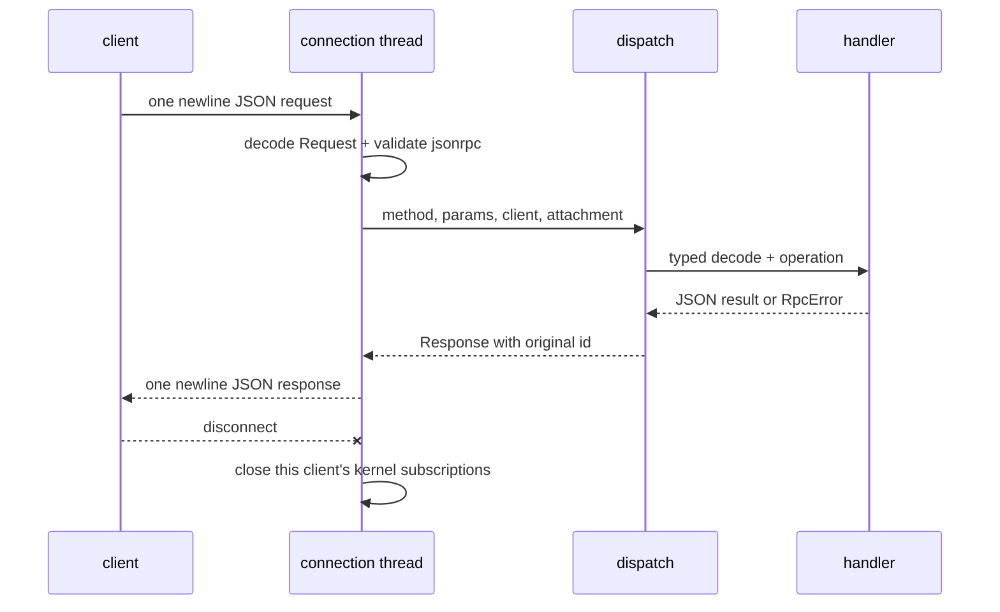
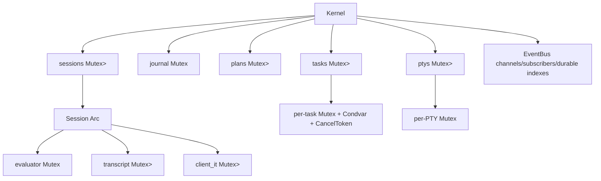

+++
title = "Kernel RPC handler reference"
description = "A method-by-method reference for Shoal kernel attachment, execution, value, plan, task, PTY, journal, event, and introspection handlers."
weight = 71
template = "docs/page.html"

[extra]
group = "Kernel & agents"
eyebrow = "Handler atlas"
status = "Source-audited: 2026-07-16"
audience = "Kernel, protocol, MCP, and security maintainers"
wide = true
+++

This is the exact handler atlas for the newline-framed JSON-RPC server. It complements the
[kernel architecture chapter](../kernel-protocol/) and the
[intercrate protocol contract](../intercrate-protocol-contracts/): those explain the system; this
page makes every routed method, state read, scope check, and known discrepancy reviewable in one
place.

The authority is the direct match in `crates/shoal-kernel/src/dispatch.rs`, the parameter/result
types in `shoal-proto`, and the handler bodies. Examples omit the terminating newline for readability.

## Envelope and connection lifecycle

Every request is one UTF-8 JSON object followed by `\n`:

```json
{"jsonrpc":"2.0","id":1,"method":"parse","params":{"src":"1 + 2"}}
```

A response repeats the arbitrary JSON `id` and has exactly one of `result` or `error`:

```json
{"jsonrpc":"2.0","id":1,"result":{"ast_version":2,"ast":{"stmts":[]}}}
```

```json
{"jsonrpc":"2.0","id":1,"error":{"code":-32000,"message":"attach to a session first"}}
```

The listener is a nonblocking Unix listener so shutdown can be polled. Each accepted stream is reset
to blocking mode and handled by one OS thread. A connection gets a monotonically allocated `client`
number and at most one `Attachment`. The same socket writer is shared with subscription push threads;
whole frames are serialized under its mutex so notifications and responses cannot interleave bytes.



`read_frame` enforces the 16 MiB JSON-content limit during the read; an oversized or unterminated
peer cannot grow the line buffer beyond that bound plus the terminator sentinel. Before decoding,
the shared request/response preflight caps structural depth (64), total values (65,536), per-container
items (16,384), decoded object keys (64 KiB), and numeric tokens (1 KiB). Public kernel connections
also use a 10-second first-byte/remainder read deadline by default. The MCP stdio reader uses the
same bounded line and complexity shape without the socket deadline. Its facade then applies a 4 KiB
resource-URI wall, strict percent/UTF-8 decoding, bounded path/query cardinality, per-resource path
and parameter schemas, and exact numeric parsing before dispatch. Tool calls accept only advertised
names and fields, with a 4 MiB source wall and bounded identifiers/collections. Admission and kernel
error messages never quote the rejected URI, tool name, path, body, or bearer.

## Router and attachment matrix

| Method | Handler module | Attached? | State class |
|---|---|---:|---|
| `session.attach` | `session.rs` | creates it | session/auth mutation |
| `session.env/snapshot`, `kernel.status/shutdown` | `session.rs`/`lifecycle.rs` | yes | owner/session and process lifecycle |
| `session.reef` | `session.rs` | yes | evaluator cache read |
| `parse` | `handlers_session.rs` | no | pure syntax |
| `complete` | `handlers_session.rs` | no | lexical completion |
| `explain` | `handlers_session.rs` | yes | parser + evaluator plan derivation |
| `exec` | `handlers_exec.rs` | yes | evaluator, journal, transcript, tasks |
| `value.get`, `stream.pull/close` | value/stream handlers | yes | owner transcript/CAS/live-stream read |
| `blob.get` | `handlers_session.rs` | yes | shared CAS read |
| `task.list/get/await/cancel/suspend/resume` | `handlers_task.rs` | yes | principal/session-owned task registry |
| `pty.open/send/read/resize/close/list` | `handlers_pty.rs` | yes | principal/session-owned PTY registry |
| `plan.get/list/apply` | `handlers_task.rs` | yes | session/principal-scoped plan registry |
| `cap.request` | `handlers_task.rs` | yes | attached approval mutation, approver-bound |
| `journal.query` | `handlers_value.rs` | yes | attached persistent journal read |
| `events.read/publish/subscribe/unsubscribe` | `eventbus.rs` | yes | global bus plus session bridge |

Both former exemptions are closed: `journal.query` requires attachment (HR-D4), and `cap.request`
requires attachment and binds an approver identity distinct from the requester (HR-D1/D2/D3). The only
methods that remain naturally public are attach, context-free parse, and context-free completion. The
socket's `0600` mode limits OS users, not Shoal token principals — the approver-identity binding does.

## `session.*`

### `session.attach`

Request:

| Field | Type/default | Meaning |
|---|---|---|
| `session` | string or `null`; default `"default"` | named in-memory evaluator |
| `token` | string or `null` | bearer token validated by the persistent kernel |
| `client.kind` | string | descriptive client class |
| `client.tty` | bool | retain terminal color in bounded renders when true |

With a token, `TokenStore::validate` supplies `principal`, token caps, and profile. A tokenless public
socket caller becomes restricted `agent:mcp`; it cannot assert local-human authority. Only the
server-selected inherited descriptor used by the private REPL may attach as
`uid:<effective-uid>`/`local-human`. An ephemeral kernel has no token store and rejects a supplied
token. Calling attach again replaces that connection's attachment and removes subscriptions owned
by the previous attachment.

Token validation takes a shared fd lock and loads the current `tokens.json`. Create/revoke take an
exclusive fd lock, reload under that lock, and atomically replace the file, so concurrent CLIs do not
overwrite one another. After attachment the kernel refreshes the authenticated token metadata before
every request; revocation, expiry, replacement, corruption, or I/O failure detaches the connection
and fails closed with `AUTH_FAILED`. Returned profile/cap strings describe machine authority. Leash
still authorizes language effects; `supervisor`/`plan.approve` are explicit approval capabilities.

The session registry is keyed by `(principal, visible Session name)`. Reconnecting as the same
principal/name returns the same live evaluator; another principal using the same visible name gets a
different evaluator, refs, tasks, PTYs, event rings, and quota accounting. This is strong in-process
ownership isolation, not a hard hostile-tenant boundary: principals still share the kernel process,
global resource budgets, and configured state root.

Result fields:

| Field | Meaning |
|---|---|
| `session`, `principal` | selected name and actor |
| `caps` | enforcement/tier/profile/token-cap/opaque-verdict summary |
| `cwd` | lossless `WirePath` |
| `env_hash` | currently literal `"local"`, not a real environment digest |
| `ast_version` | currently 2 |
| `caps_enforced` | whether a real backend and non-permissive policy combine to enforce |
| `elide_defaults` | default value budgets |
| `channels` | static kernel channels: transcript, journal, approval, render |
| `auth_mode`, `connection_trust` | bearer/restricted/private-human attachment provenance |
| `session_isolation` | current principal-private Session isolation contract |
| `security_epoch` | attachment security contract revision |

Creation applies the shared host bootstrap at the kernel process cwd: config snapshot,
aliases/environment, adapters, WebAssembly plugins, Reef inputs, and init files. It then installs the
authenticated kernel policy, default jump history, an optional second journal handle onto the same
state directory, and the `user.*` language-to-wire event bridge.

### `session.env`

Params are `{}`. The handler reads the evaluator's session-local environment, retains only UTF-8
name/value pairs, sorts names, then evaluates one `EnvRead {names}` effect for the attached principal.
It returns either:

```json
{"granted":false,"names":["HOME","PATH"]}
```

or, when allowed:

```json
{"granted":true,"names":["HOME","PATH"],"env":{"HOME":"/home/a","PATH":"..."}}
```

The names themselves are disclosed before the grant; only values are conditional.

### `session.reef`

Params are `{}`. It calls the evaluator's cached `prompt_reef_snapshot`, not a fresh provider query or
version probe. Result:

```json
{
  "active_scope":"/work/project/.reef.toml",
  "bindings":[
    {"tool":"node","version":"22.0.0","provider":"mise","scope":"project","constrained":true}
  ]
}
```

A constrained but unlocked tool can have null version/provider fields. The evaluator checks its
fixed-size candidate/lock metadata fingerprint before reusing the scope chain, so same-cwd
create/edit/remove changes are visible without restarting the session.

## Syntax and introspection

### `parse`

Input is `{src: string}`. It invokes context-free `shoal_syntax::parse`, so it does not see session
bindings that can affect statement-head classification. Success is `{ast_version: 2, ast}`. A
language parse failure is `PARSE_ERROR (-32001)` with `{span, hint}` in `error.data`; it is not the
JSON framing parse code `-32700`.

### `complete`

Input is `{src, cursor?}`. `cursor` is a UTF-8 byte index, defaults to `src.len()`, and is clamped to
the source byte length. Result is `{candidates: [...]}` from `complete_at`. The endpoint is not
session/evaluator-semantic completion.

### `explain`

Input must contain either `src` or `ast`. If both exist, `src` wins. Source parse failures use
`PARSE_ERROR`; invalid AST JSON uses `INVALID_PARAMS`; neither present also uses `INVALID_PARAMS`.

It locks the session evaluator long enough to derive a plan and returns:

```json
{
  "ast_version":2,
  "ast":{},
  "effects":[],
  "reversibility":"reversible",
  "plan_ref":"plan:..."
}
```

`explain` does not insert the plan into the kernel plan map. Its `plan_ref` is descriptive and cannot
be assumed applicable through `plan.apply`.

## `exec`

### Parameters

| Field | Type/default | Contract |
|---|---|---|
| `src` | string, required | Shoal program |
| `mode` | `run` by default | `run`, `plan`, or internal verified `approved` |
| `position` | `stmt` by default | `stmt` raises failed outcomes; `value` captures them |
| `async` | false; `background` accepted alias | immediately return a task |
| `timeout_ms` | null | run on a task and wait only this long |
| `elide` | null | optional max bytes/rows/items, still under hard cap |
| `plan_ref` | null | required for `approved` re-entry |

Any async request or request carrying `timeout_ms` first creates a `task:N`, publishes `started` on
`task.N`, and recursively dispatches a synchronous exec in a worker thread. `async:true` returns
immediately. A timeout request waits; if work finishes before the deadline it reconstructs an inline
result from the transcript, otherwise it returns the still-running task and `timed_out:true`. Timeout
does not cancel work.


### Plan mode

`mode:"plan"` parses, derives effects, evaluates the actor policy, and inserts a `StoredPlan` bound to
source, canonical AST, effects/estimates, Session, principal, and a unique per-kernel object suffix.
It publishes an `approval` event for `ApprovalRequired`. The returned `PlanResult` contains ref,
effects, reversibility, verdict, and `approval_pending`. Identical repeated plans remain distinct and
cannot overwrite one another; refs are still ephemeral object identifiers, not bearer capabilities.

### Run and approved modes

Ordinary run derives a fresh plan and returns `LEASH_DENIED` or `APPROVAL_REQUIRED` before evaluation
when policy says so. Approved mode verifies the stored immutable binding and either atomically
consumes its one-shot grant or observes that current policy now allows the plan. A caller cannot
merely write `mode:"approved"` to skip the gate.

The evaluator is locked for the synchronous run. The handler:

1. installs this actor's Leash policy on the evaluator;
2. derives the plan and appends a coarse journal row;
3. stores current source for per-statement evaluator journaling;
4. evaluates at the requested position;
5. finishes the coarse row and records output blobs;
6. stores the value under `out:N` in the session transcript;
7. records a durable transcript-event payload;
8. publishes `journal`, `session.transcript`, and `render` events;
9. returns the structural value and bounded human render.

A raised language error is still inserted as an addressable `out:N`; the RPC error is `RAISED
(-32002)` and its data includes language code/span/hint/status/stderr/ref/URI. The coarse journal row
is finished false and optional stderr is recorded.

### Result bounding

The normal result is `{ref, value, render}`. Structural elision uses the per-call/default budgets and
hard 64 KiB ceiling; render is independently bounded and strips ANSI for `tty:false`. The full value
remains in the in-memory transcript and outputs may be persisted in CAS.

## Values and blobs

### `value.get`

Input:

| Field | Meaning |
|---|---|
| `ref` | session transcript ref such as `out:3` |
| `path` | field/index traversal expression |
| `slice` | `[start,end]`, end-exclusive and clamped |
| `elide` | JSON-value budgets |
| `format` | `json` default, `render`, or `raw` |

Resolution order is transcript lookup → path → slice → format. Slices work for lists, table rows,
Unicode scalar positions in strings, resident byte offsets, and CAS-backed bytes. Slicing another
kind is `BAD_PATH_OR_SLICE` rather than a silent no-op.
CAS-backed JSON byte slices stream exactly when they fit the 64 KiB structural hard wall; larger
ranges fail `BAD_PATH_OR_SLICE` before opening the blob and direct the caller to pageable raw mode.

`json` returns `{ref,value}` with structural elision. `render` returns `{ref,render}` with the hard
render cap. `raw` returns one page as `{ref,encoding,raw|raw_base64,page}`. A page contains at most
8 KiB of decoded content; `page` reports `total_len`, `offset`, `returned_len`, `next_offset`,
`done`, `truncated`, and the offset `unit`. String offsets are Unicode scalar indexes while byte and
CAS offsets are octets. CAS pages use the verified streaming reader and never materialize the full
blob before applying the page wall.

Refs are looked up only in the attached session's transcript map. A missing ref or failed CAS
resolution is `UNKNOWN_REF`; invalid path/slice/type format is `BAD_PATH_OR_SLICE`.

### `blob.get`

Input is `{hash,offset?,length?}`. Offset and length are uncompressed byte units; length is clamped
to 8 KiB with overflow-safe arithmetic. A complete small omitted-range request preserves the legacy
`{hash,value}` result. Explicit ranges and oversized values return
`{hash,encoding:"base64",raw_base64,page}` and can be continued at `page.next_offset`. Unknown or
foreign-owner hashes are both `UNKNOWN_REF`: attachment plus exact session/principal output
ownership is checked before opening the CAS.

The journal keeps an exact-range LRU capped at 1 MiB and 256 entries. Cached pages were already
verified against the content hash and are served only while the blob remains live; hits do not
reopen/decompress or consume rate budget. Cache misses and CAS-backed `value.get` reads reserve one
of the exact owner's decompression starts (default 64 per 10 seconds). Excess random/distant pages
fail `QUOTA_EXCEEDED` with `retry_after_ms` before opening the blob. Legacy single-stream `.zst`
objects remain readable without migration.

## Tasks

Task records contain `task`, `session`, `state`, `started_ns`, `finished_ns`, `result_ref`, and
optional `RpcError`. State vocabulary observed in the handler is `running`, `suspended`, `cancelling`,
`cancelled`, `failed`, and `completed`.

| Method | Params | Behavior/result |
|---|---|---|
| `task.list` | `{}` | all task records whose `task.session.id` equals attached session ID |
| `task.get` | `{task}` | nonblocking snapshot |
| `task.await` | `{task}` | waits on condvar until terminal, including across suspension |
| `task.cancel` | `{task}` | marks cancelling, resumes stopped groups, fires cancel token |
| `task.suspend` | `{task}` | `SIGSTOP` every active process group; unavailable for evaluator-only work |
| `task.resume` | `{task}` | `SIGCONT` every group owned by a suspended process-backed task |

Ownership is the exact `(principal, visible session name)` owner captured by the attachment. Wrong
owners receive the same opaque unknown-task result as nonexistent entries. Active-task permits are
reserved before worker spawn and released at terminal state; completed records are bounded and
reaped oldest-first.

Cancellation is cooperative through the evaluator/exec cancellation token. A failed outcome returned
in value position is inspected so the task becomes failed; a signal-killed outcome after a requested
cancel becomes cancelled rather than completed.

## Plans and capability approval

### `plan.get`

Input `{plan_ref}`. The handler requires the attached session and principal to match the current
stored record. It reparses stored source for AST, evaluates the current verdict, and returns AST
version/AST/ref/effects/reversibility/verdict/approval flags/source. Unknown is `UNKNOWN_PLAN`; wrong
owner is deliberately reported as `LEASH_DENIED` rather than revealing it.

### `plan.list`

Params `{}`. Returns only records matching attached session and principal. Each record includes ref,
effects, reversibility, current verdict, `approval_pending`, and `approved`; source/AST are omitted.
Ordering follows `HashMap` iteration and is not a stable wire order.

### `plan.apply`

Input `{plan_ref}`. It checks attached session/principal, then requires either the one-shot grant or a
current `Allow` verdict. It recursively dispatches `exec` with stored source, statement position,
`mode:"approved"`, and the same ref. The approved exec revalidates the immutable binding, re-derives
the plan, and atomically consumes a grant so concurrent/repeated apply cannot replay it.

### `cap.request`

**Requires attachment** (HR-D1). Input `{plan_ref?, effects: [...]}`; `plan_ref` is operationally
required. The attachment principal is the **approver**. Effect entries can be strings or objects with
`kind`; dotted and snake-case spellings are normalized.

Authority model (HR-D2/HR-D3):

1. an unattached caller is rejected with `NOT_ATTACHED` before any approval logic;
2. **separation of duties** — the approver must differ from the plan's requester (owner). A requester
   approving its own plan is `LEASH_DENIED` ("self-approval is not permitted") unless
   self-acknowledgement is explicitly enabled (`SHOAL_ALLOW_SELF_ACK`, or
   `Kernel::set_allow_self_ack`); the default is separation;
3. approval never overrides a hard denial: the plan owner's policy must not evaluate the plan to
   `Deny`, else `LEASH_DENIED`;
4. if a nonempty request omits a plan effect, the result stays `approval_pending` and lists the
   uncovered effects (approval never silently widens past the requested scope);
5. otherwise the exact plan transition is reserved under the registry lock. The kernel writes the
   durable grant audit before publishing an **`ApprovalRecord`**; an audit error or unwind restores
   the reservation and grants nothing. The record binds requester, approver, owner, plan/source
   hashes, granted scope, approval timestamp, grant audit ID, and consuming execution ID. Apply
   atomically consumes the grant exactly once, and the execution audit links back to the grant.

Response: `{grant:"approved", plan_ref, enforced, granted_effects, requester, approver}`. `enforced`
reports the same honest OS-enforcement truth `session.attach.caps_enforced` does for the requester.

## PTYs

PTY refs are `pty:N`. Registry entries store the exact principal/session owner, display command, and
a mutex-protected `shoal_exec::PtySession`. All methods require attachment and compare the full owner.
Admission reserves owner, principal-aggregate, and process-global permits before spawning.

### `pty.open`

Input `{cmd,args?,cols?,rows?,env?}`. Empty command is invalid. The handler snapshots cwd and session
environment, layers string overrides, defaults to 80×24, optionally gates a content hash when spawn
pinning is active, derives a sandbox, then opens the real PTY and vt100 emulator.

Result is `{pty_id,pid,cols,rows,cmd}` with actual clamped size. Spawn/policy errors use the dedicated
PTY/Leash codes. The PTY path evaluates only the ProcSpawn pin gate explicitly; review effect parity
when adding env/cwd/filesystem policy semantics.

### `pty.send`

Input is `{pty_id,input}`. Input recursively accepts:

- string: literal UTF-8;
- `{key:"Enter"}`: named terminal key;
- `{text:"literal"}`: literal UTF-8;
- `{bytes:"base64"}`: decoded bytes;
- array mixing any of those in order.

Result reports `{pty_id,sent:<byte count>}`. Invalid shapes/keys/base64 use `INVALID_PARAMS`;
write failure uses `INTERNAL_ERROR`.

### `pty.read`

Input `{pty_id}`. Result is bounded by the emulator grid:

```text
pty_id, cmd, cols, rows,
cursor {row, col, hidden},
screen [one string per row],
changed, alive, exit {status, signal} | null, pid
```

It returns the rendered terminal state, never an unbounded escape-sequence log. `changed` compares
with the previous read on that PTY session.

### `pty.resize`, `pty.close`, and `pty.list`

`pty.resize {pty_id,cols,rows}` updates the OS window and emulator, then reports actual dimensions.
`pty.close {pty_id}` checks ownership before removing the map entry, terminates/reaps, and returns
exit data. Drop is a teardown backstop. `pty.list {}` snapshots matching entries, drops the registry
lock, reads each PTY, sorts by numeric ID, and omits screen contents.

There is no PTY-change subscription; clients poll `pty.read` and inspect `changed`.

## Journal query

`journal.query` **requires attachment** and accepts `{since,until,principal,head,ok,effects,limit}`.
Timestamps are Unix epoch nanoseconds. Store-side filters are since/principal/head/ok/limit; the
kernel then post-filters `until` and requires every requested effect substring after dotted/snake
normalization.

`limit` is an optional integer with three-way semantics enforced by the kernel above the store:

| `limit` | Result |
|---|---|
| omitted / `null` | the default page size (100 rows) |
| explicit `0` | **zero rows** — an empty page, never "unbounded" |
| `n` | `min(n, `server maximum`)`; the ceiling is 10,000 rows |

The explicit-zero case is short-circuited in the handler and never reaches the store (whose own
`limit: 0` sentinel means "default 100"). The wire field is therefore `Option<usize>`, so an omitted
limit is distinguishable from a caller who genuinely asked for nothing. The server-side maximum caps a
hostile `limit: usize::MAX` so one query cannot stream the whole journal into a single frame.

Rows are newest-first and contain ID, session, principal, timestamp/duration, lossless cwd, source,
parsed AST/effects, status/ok/opaque, and output `{kind,hash,len}` entries. Output content is fetched
separately through blob/value routes.

Attachment is required and the kernel forces the exact attached principal and session into the
journal query. A caller-provided principal filter can narrow but cannot widen that owner boundary;
another principal choosing the same visible session name sees a distinct private session and rows.
`until`/effects post-filter **after** the store limit,
so a request can return fewer than its limit even when older matching rows exist. Effect matching uses
serialized JSON substring containment rather than parsed effect-kind equality, so the filter deserves
replacement by a typed store query.

## Events

An event is `{channel,seq,ts,payload}`. Sequence is monotonic per channel. Every channel ring is
bounded by both 1,024 events and 2 MiB. Each kernel subscriber has a queue bounded by both 256 events
and 512 KiB; each connection owns one shared dispatcher thread. At either queue wall, events coalesce into
`{dropped,dropped_bytes,latest_seq}` rather than growing without bound.
The configured per-session subscription quota is honored up to a hard ceiling of 1,024 identities per
exact owner, so an accidentally permissive configuration cannot make subscription metadata unbounded.

| Method | Params | Result/behavior |
|---|---|---|
| `events.read` | `{channel,since?,limit?}` | `{channel,events,page}`; forward page, `since` exclusive; omitted limit 256, zero empty, maximum 256 |
| `events.publish` | `{channel,payload}` | only `user.*`; returns channel/seq/ts plus `language_mirror:{ok,seq?}` |
| `events.subscribe` | `{channel,since?}` | registers this connection; replays ring then pushes notifications |
| `events.unsubscribe` | `{channel,since?}` | closes/removes this connection/channel queue; `since` ignored |

`journal` and `session.transcript` have durable cold replay. Kernel open does no historical scan. The
first attach/read/exec for an exact principal/session hydrates its full published count and at most the
newest 1,024 seq→entry-ID pointers; older forward pages resolve their bounded ID range directly from
the journal. `page.next_since` continues a truncated page, while `page.history_lost` distinguishes a
ring-only cursor older than `oldest_available`. A page is also bounded to 8 MiB of encoded events;
an individually oversized payload becomes an explicit `payload_truncated` marker without losing its
sequence cursor. Approval, render, task, and `user.*` channels are ring-only and lose old history.

`events.publish` rejects kernel-owned names and validates before the first retained clone: channel
names are at most 128 ASCII bytes, user payloads at most 64 KiB encoded and 64 levels deep, and one
exact owner may retain at most 256 distinct `user.*` channel identities. It then mirrors the JSON
payload into the attached evaluator's language EventBus without holding the evaluator lock. The wire
event is the authoritative RPC commit. `language_mirror.ok` is `true` with that bus's local sequence
when injection succeeds; if the language bus is full or quarantined, the publish still succeeds and
returns `ok:false` with a typed bounded error instead of inviting a retry that would duplicate the
already-committed wire event.
Language-originated `user.*` emits pass through the same wire-bus admission and do not echo on
injection. These limits are per exact principal/session.

Kernel unsubscribe correctly closes its writer queue. MCP subscriptions retain their dedicated
connection, interrupt handle, and forwarding thread; `resources/unsubscribe` closes and joins the
worker deterministically. The facade admits at most 64 concurrent subscription workers, and the
same resource-URI schema is checked for subscribe and unsubscribe.

## Error mapping by method family

| Code | Common producers | Boundary meaning |
|---:|---|---|
| -32600 | connection loop | wrong JSON-RPC version |
| -32601 | router fallback | unknown method |
| -32602 | typed decode, enum/path/channel validation | caller parameters invalid |
| -32603 | serialization/journal/PTY/event subscription environment | unexpected internal failure |
| -32000 | attached handlers | no session attachment |
| -32001 | parse/exec/explain | Shoal source parse failure |
| -32002 | exec | raised language `ErrorVal`, still addressable |
| -32004 | value/blob | unknown transcript ref/hash or failed CAS resolution |
| -32005 | value.get | invalid path/slice/raw-format combination |
| -32010 | run/approved/plan/PTY | Leash denial or owner mismatch |
| -32011 | run/apply/PTY | approval required |
| -32012 | plan/capability | unknown/expired plan |
| -32020 | task suspend/resume | deliberately unavailable control |
| -32021 | task lookup | unknown or wrong-session task |
| -32022 | PTY lookup | unknown/closed or wrong-session PTY |
| -32023 | PTY open | resolution/sandbox/spawn failure |
| -32030 | attach | token unavailable/invalid/expired/revoked |
| -32040 | connection/session/task/PTY/subscription admission | quota exceeded |

Malformed kernel JSON does not currently become a JSON-RPC error: frame decoding returns an IO error
and closes the connection. The MCP stdio bridge does emit `-32700` for malformed client JSON.

## State and lock map



Synchronous evaluation holds the evaluator lock across parse-plan-related evaluator access and the
actual run, so one session serializes mutation. Reads of transcript, tasks, PTYs, journal, plans, and
events use separate locks. Review lock order whenever one handler touches two registries. Many locks
use `unwrap`; a panic while holding shared state can poison later requests.

## Restart and durability table

| State | Survives process restart? | Reconstruction |
|---|---:|---|
| journal entries/output metadata/CAS | yes | SQLite + files |
| durable transcript-event payload rows | yes | SQLite |
| journal/transcript event sequence index | regenerated | AST-shape + transcript rows |
| sessions/evaluator variables/cwd/env | no | none |
| transcript `out:N` value objects | no | journal summaries are not live refs |
| plan approvals | no | none |
| tasks and PTYs | no | children terminate with owner/drop/process |
| ring-only event history/subscriptions | no | none |
| auth tokens | yes in persistent kernel | token JSON store |

The replay index currently distinguishes coarse kernel rows from fine evaluator rows by asking
whether stored AST JSON deserializes as `Program`. That is an implicit schema discriminator. Add an
explicit entry kind/parent relationship before another producer shape makes the heuristic ambiguous.

## Handler change checklist

For every new or changed method:

1. add/update one typed proto parameter/result type;
2. decide explicitly whether attachment is required and pin the public allowlist;
3. state principal/session/ref/blob ownership independently;
4. bound inbound frame, decoded collection, outbound structure, render, and raw bytes;
5. define cancellation, disconnect, retry, duplicate request, and restart behavior;
6. allocate a named error constant rather than an inline integer;
7. test the handler and a live daemon connection;
8. test the MCP projection if agents can reach it;
9. update event/resource discoverability when state changes;
10. update this reference and the threat model in the same change.
