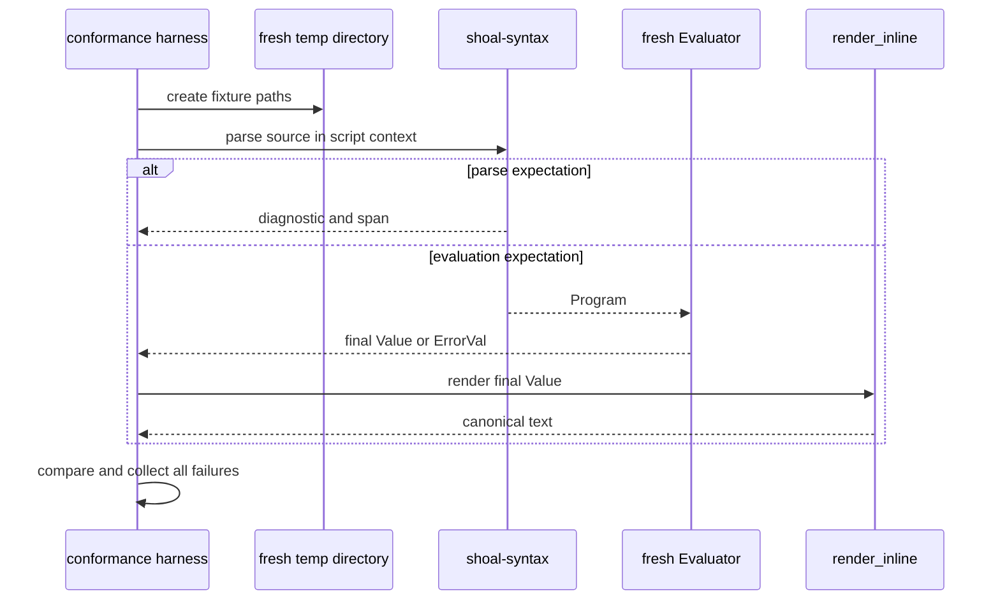

+++
title = "Language and conformance contract"
description = "The stable authority model for Shoal syntax and semantics, executable registries, error/render contracts, and the normative TOML corpus."
weight = 36
template = "docs/page.html"

[extra]
group = "Language & runtime"
eyebrow = "Normative engineering contract"
status = "Canonical replacement for docs/TDD.md"
audience = "Language, evaluator, editor, and conformance contributors"
wide = true
+++

This is the stable narrative contract for Shoal's language implementation. It replaces the old
monolithic `docs/TDD.md` as a link target while deliberately refusing to freeze stale Rust details
in prose. Syntax, semantics, registries, and tests each have a more precise executable authority.

The guiding rule is:

> Narrative states intent and invariants; source defines accepted structure; the conformance corpus
> pins observable language behavior.

## Authority order

When two artifacts disagree, resolve the dispute using this order and then repair the lower layers:

1. **A deliberately reviewed conformance case** is the normative observable behavior for the case
   it covers.
2. **Parser/evaluator/value source plus focused tests** describes current behavior where the corpus
   is silent.
3. **Executable registries and schemas** define enumerated names and shapes: builtin names, method
   metadata, AST variants, adapter schema, protocol types, and error enums.
4. **This chapter and focused architecture chapters** define cross-cutting intent, invariants, and
   ownership.
5. Historical root docs, comments, examples, and roadmap prose are migration inputs, not competing
   sources of truth.


This does not mean an accidental test can permanently override design. A behavior change begins by
deciding the intended result, updating or adding the corpus case, then changing implementation. It
does mean prose alone cannot declare an unimplemented feature “done.”

## Stable ownership map

| Contract surface | Executable authority | Focused narrative |
|---|---|---|
| AST node and span shape | `crates/shoal-ast/src/` serde types | [AST model](@/internals/ast-model.md) |
| lexical tokens and parse status | `crates/shoal-syntax/src/lexer.rs`, parser modules | [Parser and formatter](@/internals/parser-formatter.md) |
| formatting | `shoal_syntax::format_program` + idempotence tests | [Parser and formatter](@/internals/parser-formatter.md) |
| statement/expression evaluation | `crates/shoal-eval/src/` | [Evaluator state](@/internals/evaluator-state.md) |
| calls/modules/namespaces | evaluator call/module/namespace modules | [Calls and modules](@/internals/calls-modules-namespaces.md) |
| builtin command names | `shoal_syntax::commands::builtin_names()` | [Builtin registry](@/internals/builtin-registry.md) |
| value variants and operators | `shoal-value/src/lib.rs`, `ops.rs`, `value_types.rs` | [Value algebra](@/internals/value-algebra.md) |
| value method names | `shoal-value/src/methods/suggest.rs` metadata plus dispatch modules | [Method dispatch](@/internals/value-method-dispatch.md) |
| canonical rendering | `shoal-value/src/render.rs` + corpus expectations | [Value algebra](@/internals/value-algebra.md) |
| streams | `shoal-value/src/stream/`, evaluator stream/channel modules | [Streams and channels](@/internals/streams-channels.md) |
| external execution | `shoal-exec` + evaluator command path | [Process execution](@/internals/process-execution.md) |
| observable semantics | `spec/cases/*.toml` | this chapter |

## Lexical contract

Shoal source is UTF-8 and lexing is modal. The parser requests tokens in expression or command mode
according to grammar position; the lexer does not inspect runtime bindings.

### Common lexical invariants

- Newline and semicolon terminate statements unless the parser recognizes continuation.
- A comment begins with `#` only where `#` starts a token; command word `ver#2` remains one word.
- Double-quoted strings support interpolation and escapes; single-quoted strings are raw; triple
  forms span lines.
- Numeric maximal munch includes size and duration suffixes.
- Tagged regex and datetime literals are lexically distinct values.
- Illegal shell sigils and lone pipe syntax receive curated diagnostics rather than generic token
  errors.
- Every successful token span must advance; lexer fuzz/property tests defend against non-progress.

The exact token enum and spelling rules live in `shoal-syntax::lexer`. A new token is incomplete
until both modes, parser use, formatter round-trip, highlighter/completer behavior, and diagnostics
have been audited.

### Command-mode contract

Command mode recognizes words, path-shaped words, glob-shaped words, flags, leading environment
assignments, redirects, the end-of-flags marker, background suffix, and expression arguments. It is
word-oriented: punctuation that would be an operator in expression mode can be literal command
text.

Shape classification carries semantic consequences:

| Shape | Meaning |
|---|---|
| `~/…`, `./…`, `../…`, `/…` | path word |
| unquoted glob metacharacters | glob value/expansion site |
| `--name`, `--name=value`, `-abc` | flag token, interpreted through known signatures when available |
| leading `NAME=value` | scoped child environment prefix |
| `(expr)` | evaluated expression as one command argument |
| `>`, `>>`, `<` | capture/save or stdin redirection syntax |
| trailing `&` | background/spawn sugar |
| trailing block | thunk/block argument |

Unknown external commands retain raw string behavior where no adapter or closure signature exists.
Known calls can bind named flags and coerce word values according to their signature.

### Expression-mode contract

Expression mode recognizes identifiers, literals, delimiters, operators, calls, field/method/index
postfixes, collections, lambdas, and control expressions. Bare unquoted filesystem paths and globs
are not general expression literals; explicit constructors or strings are required outside command
positions.

## Statement dispatch contract

Statement dispatch is the language's central ambiguity rule:


The parser accepts a `ParseCtx` classification because lexical scope changes whether an identifier
head is a value expression or command. This is the one intentional parse-time environment seam.
Script/module parsing without a populated context cannot reproduce every REPL binding-dependent
decision; hosts must choose and test their context deliberately.

`^head` forces command interpretation. Dynamic execution uses the explicit runtime call surface.
An identifier immediately followed by a method/field chain can use invoke-then-chain behavior where
implemented. The highlighter and completer approximate this rule; the parser remains authoritative.

## Grammar and precedence contract

The recursive-descent/Pratt parser owns the accepted grammar. The stable conceptual precedence from
tight to loose is:

```text
postfix field/method/index/call
unary
multiplicative
additive
range
comparison/membership
logical and
logical or
null coalescing
postfix catch
assignment
```

Comparison chaining is rejected rather than interpreted Python-style. Logical operators
short-circuit. Assignments require a mutable binding/lvalue. Control flow is represented explicitly
in the AST rather than implemented through textual rewriting.

Do not copy a full EBNF into another narrative page. The parser modules, AST serde types, formatter,
and conformance corpus evolve together; a second grammar inevitably drifts. The parser/formatter
chapter supplies the detailed ambiguity map and change procedure.

## Desugaring contract

Surface sugar must lower to a stable AST meaning without text splicing:

| Surface | Semantic lowering |
|---|---|
| leading command environment assignments | dynamically scoped environment around the call |
| trailing command `&` | spawn/background block |
| redirects | captured stdin/stdout save/append behavior |
| a trailing block after a call | callable block argument |
| implicit `.field`/`.method` argument | closure over the implicit item |
| leading-dot continuation line | postfix continuation of prior expression |
| invoke-then-chain | zero-argument invocation followed by value chain where dispatch permits |
| alias declaration | stored partial command AST, never textual macro expansion |
| postfix catch | explicit try/catch evaluation form |
| optional field/method chain | null-preserving access semantics |

The exact desugaring representation is owned by `shoal-ast` and `shoal-syntax`; semantic
equivalence belongs in corpus cases. If formatting a parsed form emits a canonical spelling, its
parse-format-parse AST must remain equivalent.

## Value and condition contract

The live `Value` enum, not an old prose list, is authoritative. Values include scalar quantities,
paths/globs/regex, structured collections, errors/outcomes, streams/tasks/plans, closures/partials,
secrets, lazy CAS-backed bytes, namespaces, and host snapshots.

Key invariants:

- conditions accept booleans and command outcomes; arbitrary list/string/number truthiness is a
  type error;
- data equality is structural for variants that define it, with special/opaque variants following
  explicit implementation rules;
- integer and quantity arithmetic detects overflow and division by zero;
- paths preserve OS-native bytes; strict string conversion can fail while display is lossy;
- secrets render by name and do not become ordinary interpolated strings;
- a stream is single-consumption and unbounded streams reject inherently terminal collection
  without an explicit bound;
- an outcome preserves status versus signal, stdout/stderr, duration, pid, command, and success.

Detailed operator and render matrices live in [Value algebra](@/internals/value-algebra.md).

## Calls, flags, and type annotations

Evaluation is strict and left-to-right. Positional and named arguments bind in signature order;
defaults are evaluated according to the closure/call implementation; variadic tails collect
remaining arguments. Adapter signatures can translate long and short flags before argv assembly.

Current implementation does **not** provide complete runtime type soundness for user annotations:

- expression-call paths do not uniformly enforce parameter annotations;
- command word coercion converts recognized word forms, but already-typed non-string values can
  pass through;
- declared return annotations are not enforced.

Annotations are therefore useful call metadata/coercion hints, not a proof of static or dynamic
type safety. The canonical call chapter documents exact behavior. A future enforcement change is a
language behavior change and needs corpus coverage for expression calls, command calls, defaults,
variadics, and return values.

## Scope, modules, cwd, and environment

- `let` creates immutable bindings; `var` creates mutable bindings.
- Blocks and closures use lexical environments.
- Modules load source files, evaluate them in a module environment, and expose exports through a
  module value.
- Session cwd and environment are evaluator state; scoped `with` behavior must restore state on all
  exits.
- Host-injected ports, configuration, Reef, policy, event bus, and journal are not ordinary lexical
  bindings and require deliberate inheritance in child evaluators.

The last point is a current correctness/security gap: several child-evaluator construction paths
copy only part of host state. Narrative claims about structured concurrency or scoped authority do
not override that source fact. See the evaluator and security chapters for the audited map.

## Process-position contract

An external command can be executed in captured mode or PTY mode. The high-level intent is:

- an ordinary interactive statement can preserve terminal behavior through PTY tee;
- value-producing, redirected, scripted, or non-TTY execution uses capture;
- `interact`/TUI adapter classification can request terminal treatment;
- cancellation targets the child's process group and records signal death distinctly;
- captured output is bounded in memory, optionally spilling to the journal CAS;
- adapter `ok_codes` defines success; the default is exit code zero.

Source position alone is not the complete implementation key: host interactivity, redirection,
adapter class, and explicit overrides participate. Consult the process and PTY chapters before
changing this decision.

## Stream contract

Streams are pull-driven values with single-consumption state. Finite and unbounded sources are
distinguished so terminal operations can reject unsafe collection. Operators compose lazily where
implemented; bounded channels/tee paths must express backpressure or drop behavior explicitly.

Do not use the word “bounded” as a blanket claim. Some bridges use bounded synchronous channels,
while the evaluator's in-language event bus has unbounded live subscriber channels behind a bounded
replay ring. The separate kernel EventBus uses bounded 256-event subscriber queues and coalesced gap
summaries; the two buses must not be described as one identical backpressure implementation.
The stream/channel chapter is the source-derived matrix.

## Builtin and method contract

Names are never pinned by prose lists. The canonical builtin command-head registry is
`shoal_syntax::commands::builtin_names()`, consumed by parser/host tooling and evaluator dispatch.
The discoverable value-method metadata lives in `shoal-value/src/methods/suggest.rs`; actual method
behavior lives in the dispatch modules. They are intended to agree but currently have known drift,
so neither may be treated as a generated perfect registry yet.

Adding a builtin or method requires:

1. executable registry/metadata update;
2. actual dispatch implementation;
3. argument/error/effect behavior tests;
4. a conformance case for stable user-visible behavior;
5. completion/highlighter/LSP audit;
6. external reference and focused internal ledger update.

Current registry/dispatch drift is documented rather than hidden. Do not “fix” prose to claim they
match until tests prove it.

## Canonical render contract

The conformance harness compares the final value using `render_inline`, so its output is a protocol
within the repository. Stable principles include:

- null and booleans use lowercase tokens;
- integers are decimal; floats follow the Rust display path used by the renderer;
- inline strings are quoted/escaped; top-level block rendering may print raw string contents;
- paths display lossily and quote when required by the renderer;
- regex, size, duration, datetime, time, list, record, table, error, outcome, secret, stream, task,
  plan, and lazy-byte values have variant-specific stable forms;
- record order follows the value representation rather than a prose promise of arbitrary map order.

Any render change can alter corpus expectations, shell output, prompt/picker display, journal value
blobs, and test snapshots. Treat it as a compatibility change and audit every consumer.

## Stable language error codes

`ErrorVal.code` is program-visible through caught errors and is asserted by the corpus. Current
source-emitted families include:

| Family | Codes |
|---|---|
| syntax/evaluation | `parse_error`, `type_error`, `arg_error`, `undefined_var`, `field_missing`, `index_range` |
| execution/filesystem | `not_found`, `cmd_failed`, `io_error`, `permission`, `utf8_error`, `no_matches`, `feed_error` |
| numeric/control | `div_zero`, `overflow`, `recursion_limit`, `assert_failed` |
| streams/events | `stream_consumed`, `stream_unbounded`, `channel_closed` |
| network/general | `net_error`, `custom` |
| Reef | `reef_unlocked`, `reef_drift`, `reef_conflict`, `reef_not_found`, `reef_provider` |
| language runners | `runner_not_found` |

Some codes appear only in focused/live paths and not yet in corpus expectations. Conversely,
historical lists named codes such as `lang_block_unbalanced` that current source may not emit as a
distinct `ErrorVal`. The executable construction sites plus `ReefCode` enum are current authority.

Rules for codes:

- code spelling is stable API; messages and hints may improve without forcing callers to parse text;
- choose a specific existing code before falling back to `custom`;
- caught error fields must preserve code, message, hint, stderr, status, and span where available;
- new cross-subsystem codes need an executable enum/registry if possible, corpus coverage, and both
  internal/external documentation;
- JSON-RPC integer error codes are a different layer and must not be conflated with `ErrorVal.code`.

## Normative conformance corpus

`spec/cases/*.toml` is the behavioral specification. At the 2026-07-16 audit it contained 77 suite
files and 1,310 globally named cases; the reconciled tree now contains 78 suites and 1,331 cases. A
case has this conceptual shape:

```toml
[[case]]
name = "globally-unique-behavior-name"
src = """
let x = 2 + 3
x * 2
"""

# exactly one expectation family:
value = "10"
# error = "type_error"
# error_contains = "optional teaching substring"
# parse_error = true
# parse_error_contains = "optional parse teaching substring"

fixture = ["a.txt", "sub/b.log"]
stdin = "reserved / harness-dependent"
skip = "specific host-dependent reason"
```

### Harness lifecycle



Each case uses a fresh evaluator and cwd, with no shared journal. Multi-statement source compares the
last value. Fixtures create empty files and parent directories. Expectations should avoid ambient
PATH, locale, current time, network, user config, or OS-specific rendering unless the case is
explicitly skipped with a reason.

### Current corpus state

The current expected result is 1,327 passed, 0 failed, and 4 skipped. The skips cover a native-thread
recursion-stack condition, a Node block, a jq feed composition, and full-chain Reef `which`. Counts
are evidence from that run, not a permanently hardcoded health claim; release notes must run the
corpus again.

### Exhaustive suite ledger

Every suite is named below so a language area cannot disappear behind an aggregate count. Counts
come from `[[case]]` records in the current tree and sum to 1,331. This table should eventually be
generated and checked in CI; until then, adding, renaming, or splitting a suite requires updating it.

#### Core syntax, control flow, and diagnostics

| Suite | Cases | Behavioral family |
|---|---:|---|
| `assert.toml` | 6 | assertion success, messages, and stable failures |
| `box-era-diagnostics.toml` | 10 | pinned historical parser/evaluator defect diagnostics |
| `catch-forms.toml` | 12 | try/postfix catch, bindings, and caught error fields |
| `closures-more.toml` | 4 | additional closure capture/call behavior |
| `closures.toml` | 8 | closure definition, capture, invocation, and defaults |
| `core-more.toml` | 8 | incremental core-language edge behavior |
| `core.toml` | 63 | declarations, expressions, control flow, functions, collections, errors |
| `desugar-more.toml` | 5 | additional surface-sugar equivalences |
| `desugar.toml` | 13 | primary background/env/redirect/implicit/catch desugaring |
| `edges.toml` | 18 | boundary cases and stable error behavior |
| `fn-param-binding-more.toml` | 7 | function parameter/default/named binding extensions |
| `iife.toml` | 6 | immediately invoked function/lambda forms |
| `lambda-and-record-strict.toml` | 17 | lambda parsing and strict record access |
| `match-guard-lambda.toml` | 6 | guarded arms and lambda interaction |
| `match-more.toml` | 15 | extended pattern and arm behavior |
| `match-type-patterns-2.toml` | 16 | typed patterns and follow-up boundaries |
| `match.toml` | 17 | literals, bindings, alternation, list/record patterns |
| `pipe-and-repl-only.toml` | 7 | curated pipe rejection and surface restrictions |
| `teaching-diagnostics-2.toml` | 9 | follow-up curated parse/eval messages |
| `teaching-diagnostics.toml` | 7 | primary user-facing diagnostic guidance |

#### Values, operators, methods, and rendering

| Suite | Cases | Behavioral family |
|---|---:|---|
| `bytes-value.toml` | 16 | bytes conversion, rendering, UTF-8, comparison/feed boundaries |
| `coercion-cells-3.toml` | 12 | nested/cell coercion strictness |
| `coercion-more.toml` | 6 | additional word/value coercions |
| `coercion.toml` | 62 | numeric, quantity, boolean, datetime, and invalid coercion matrix |
| `collections.toml` | 38 | list/record/table construction, access, transforms |
| `datetime-fields.toml` | 12 | datetime field projection and missing-field behavior |
| `datetime-methods.toml` | 9 | datetime method operations |
| `datetime-more.toml` | 9 | additional datetime arithmetic/parsing edges |
| `datetime-relative.toml` | 10 | relative time anchors and duration composition |
| `error-codes-2.toml` | 3 | follow-up stable error code cases |
| `error-codes.toml` | 11 | representative stable runtime error taxonomy |
| `field-method-fallback.toml` | 16 | field lookup versus zero-arg method fallback |
| `list-methods-2.toml` | 35 | extended list transformations and aggregates |
| `list-methods-3.toml` | 14 | later list-method coverage |
| `list-record-error-boundaries.toml` | 14 | strict heterogeneous/list-record failure boundaries |
| `literals.toml` | 48 | scalar, string, regex, size, duration, time, and collection literals |
| `method-coercion-more.toml` | 44 | method argument coercion and type-specific dispatch |
| `method-errors.toml` | 30 | arity, type, and missing-method diagnostics |
| `misc-composition.toml` | 10 | cross-value composition behavior |
| `numbers-more.toml` | 38 | overflow, bases, floats, quantities, and numeric edges |
| `numbers.toml` | 11 | primary numeric operations and failures |
| `operators-3.toml` | 4 | third-wave operator edge cases |
| `operators-more.toml` | 10 | extended precedence/type behavior |
| `operators-safenav-more.toml` | 3 | optional/safe navigation additions |
| `operators.toml` | 29 | arithmetic, comparison, logic, coalescing, membership |
| `ranges.toml` | 15 | inclusive/exclusive ranges and iteration/type errors |
| `record-table-methods-2.toml` | 21 | record/table transforms and aggregates |
| `record-table-more.toml` | 13 | additional record/table structure behavior |
| `size-duration-more.toml` | 15 | quantity arithmetic, overflow, and type boundaries |
| `size-duration-render-more.toml` | 8 | canonical size/duration presentation |
| `strings-methods-2.toml` | 45 | extended Unicode/string/regex transformations |
| `strings.toml` | 31 | primary string indexing, splitting, matching, replacement |

#### Filesystem, command binding, adapters, and namespaces

| Suite | Cases | Behavioral family |
|---|---:|---|
| `adapters-pack.toml` | 18 | bundled adapter binding, parsing, and success codes |
| `dir-stack.toml` | 14 | `pushd`/`popd`/`dirs` state and errors |
| `fs-builtins-more.toml` | 7 | later filesystem builtin cases |
| `fs-builtins.toml` | 39 | path operations, globbing, mutation, metadata, failures |
| `glob-more.toml` | 3 | additional glob matching/empty behavior |
| `list-path-glob-binding.toml` | 4 | command parameter accumulation and glob/path binding |
| `namespace-roundtrips-2.toml` | 8 | serialization namespace round trips |
| `namespaces-more.toml` | 22 | additional structured namespace operations |
| `namespaces.toml` | 77 | JSON/YAML/TOML/CSV/math/config namespace breadth |
| `os-namespace.toml` | 11 | environment/OS namespace reads and errors |
| `path-field-accessors.toml` | 14 | pure and filesystem-backed path fields |
| `path-fs-methods.toml` | 44 | path read/write/metadata/conversion methods |
| `word-binding-2.toml` | 20 | command words, flags, typed positions, and invalid binds |

#### External I/O, shell blocks, and outcomes

| Suite | Cases | Behavioral family |
|---|---:|---|
| `io-feed-more.toml` | 9 | additional stdin/feed composition and failures |
| `io-sh-more.toml` | 4 | additional language-block/verbatim shell behavior |
| `io.toml` | 14 | feed, shell blocks, runners, stdin/output boundaries |
| `outcome-more.toml` | 4 | additional outcome fields/composition |
| `outcome.toml` | 15 | status/signal/success/output and condition behavior |
| `plan-effects.toml` | 16 | derived plan effects, reversibility, and estimates |

#### Reef

| Suite | Cases | Behavioral family |
|---|---:|---|
| `reef-provider-errors.toml` | 6 | provider error mapping and argument validation |
| `reef.toml` | 25 | scope/lock/runner/builtin integration and stable failures |

#### Streams and sinks

| Suite | Cases | Behavioral family |
|---|---:|---|
| `stream-sinks-more.toml` | 8 | save/feed/terminal sink extensions |
| `streams-3.toml` | 2 | third-wave stream regressions |
| `streams-backpressure.toml` | 6 | boundedness, timeout, and pressure behavior |
| `streams-more.toml` | 7 | additional transformations and consumption rules |
| `streams.toml` | 38 | source/operator/sink baseline, fairness, single consumption, unbounded errors |

### Two-runner risk

There are parallel harness entrypoints in `shoal` and `shoal-eval`. They should execute the same
schema and semantics, but duplicated parsing/fixture/error-comparison logic can drift. The long-term
contract should live in one shared test-support implementation invoked from both packages.

## Behavior-change protocol

For any observable language change:

1. state whether the change is bug fix, specification correction, or compatibility break;
2. add or revise the smallest corpus cases that distinguish old and new behavior;
3. add focused unit/property/live tests for the implementation invariant;
4. change source and registries;
5. run formatter idempotence and conformance through both harnesses;
6. audit completion, highlighting, LSP, adapters, wire rendering, and docs as applicable;
7. record migration advice when existing scripts can break;
8. update implementation status—do not leave completed roadmap prose as the only evidence.

## Historical TDD reconciliation

The old TDD mixed durable choices, stale lists, implemented behavior, and aspirations. Its valuable
content is absorbed as follows:

| Former section | Canonical destination | Reconciliation note |
|---|---|---|
| naming and product thesis | external overview/vision | historical rationale, not runtime contract |
| kernel optionality and hosting | [System map](@/internals/system-map.md), shell/kernel chapters | local interactive shell is embedded today; “interactive always attaches” was aspirational |
| lexical structure, grammar, dispatch, desugaring | this page + parser/AST chapters | executable parser replaces copied EBNF |
| value semantics/coercion/calls | value/call chapters | annotation enforcement gaps are now explicit |
| PTY/process position | process and PTY chapters | exact host decision replaces broad position slogan |
| builtin surface | builtin registry chapter | old handwritten name list was stale |
| adapter schema | adapter runtime chapter | executable serde schema is authority |
| wire protocol | kernel/protocol reference | current method/type registry replaces proposal table |
| effects and Leash | effects/security chapters | separates derivation, authorization, and actual OS enforcement |
| journal/CAS | persistence/storage reference | actual schema/versioning/path semantics replace early sketch |
| implementation plan/open items | implementation status and roadmap | evidence-ranked rather than milestone fiction |
| testing/benchmarks | tooling/quality chapter | current corpus counts and reviewed-not-asserted budgets |
| edge-case register | focused language/execution chapters + corpus | only tested rulings remain normative |

This page is deletion-ready with respect to `docs/TDD.md`: no source comment should continue to use
an ignored or root Markdown document as its normative semantic link.

## Invariants reviewers should defend

- Parser mode is driven by grammar position, not runtime token guessing.
- Binding-aware statement dispatch enters through an explicit parse context.
- Aliases and other sugar manipulate AST/value structures, never splice shell text.
- Only boolean/outcome conditions are accepted.
- Error codes and canonical render forms are program-visible compatibility surfaces.
- Streams cannot be silently consumed twice or infinitely collected.
- OS effects are represented at a host/port boundary even where current code has known leaks.
- Enumerated names come from executable registries.
- A feature with renderer/schema support but no host producer is labeled scaffolded.
- The corpus decides covered observable behavior, and a behavior change updates the corpus first.
