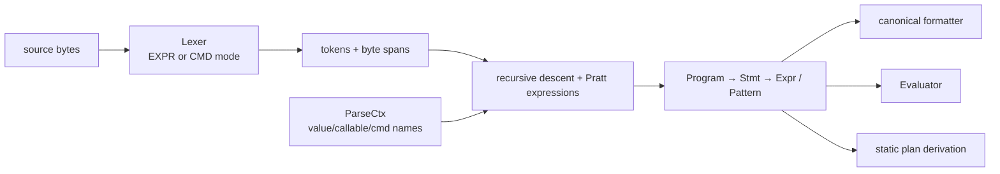
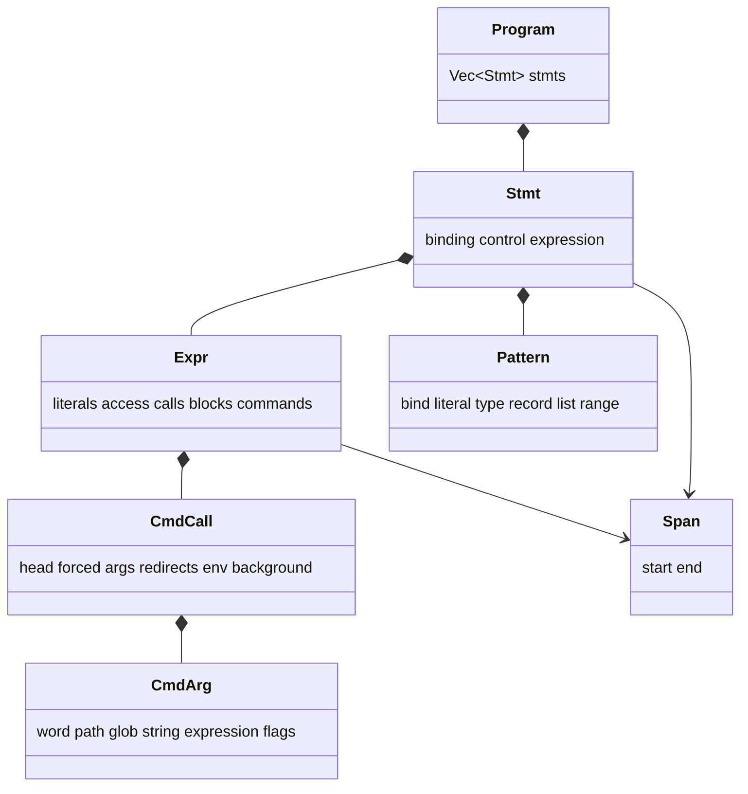
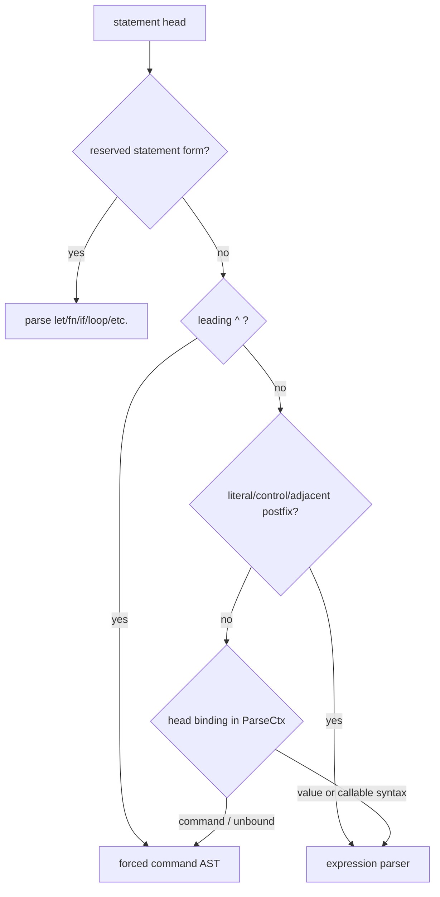
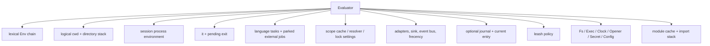
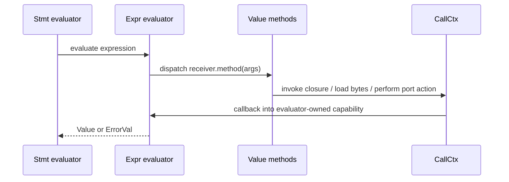
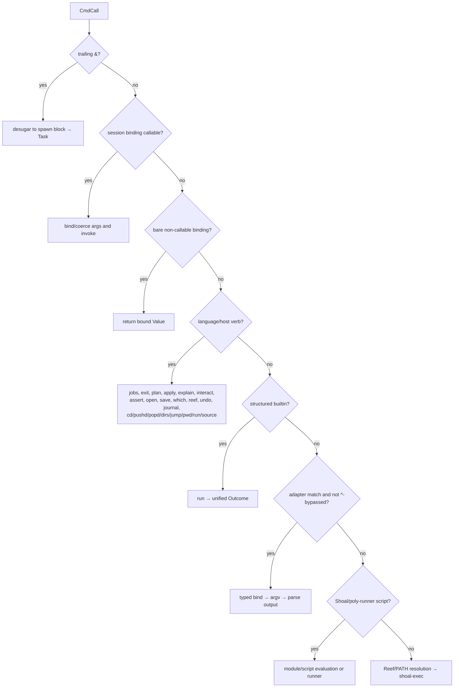
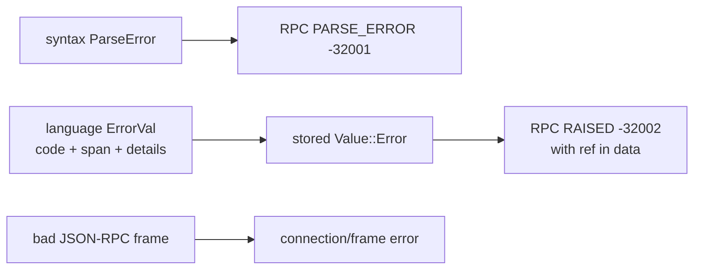

+++
title = "Language engine"
description = "How source becomes a mode-aware AST, how the evaluator assigns meaning, and where command and expression semantics meet."
weight = 30
template = "docs/page.html"

[extra]
group = "Language & runtime"
eyebrow = "Language internals"
status = "Parser and evaluator"
audience = "Language and runtime contributors"
wide = true
+++

Shoal uses a deliberately hybrid grammar: expressions are structured and typed, while command
position keeps shell-like words, flags, globs, redirects, environment prefixes, and backgrounding.
The parser decides which grammar owns a statement head; the evaluator then dispatches the resulting
AST through callables, language verbs, builtins, adapters, scripts, Reef, or external processes.

## Representation pipeline

Spans are half-open byte offsets into the source. They are carried through AST nodes and attached to
language errors where possible. Any feature that synthesizes or transforms an AST must preserve
that distinction: a byte offset is not a Unicode scalar index and not a terminal column.

Sources: [`shoal-ast`](https://github.com/alliecatowo/shoal/tree/main/crates/shoal-ast/src) and
[`shoal-syntax`](https://github.com/alliecatowo/shoal/tree/main/crates/shoal-syntax/src).

## AST inventory

`Program` is a sequence of statements. Statements represent binding and control effects that are
not merely values:

- `let`, mutable assignment, functions, aliases, and `use`;
- `return`, `break`, and `continue` flow;
- `for` and `while` loops;
- expression statements.

Expressions include null/bool/numeric/string/path/glob/regex/size/duration/time literals; variables;
field, index, method, and function calls; command calls; lambdas; lists and records; blocks; `if`;
`match`; `try`/`catch`; `with`; `spawn`; interpreter blocks; unary/binary operators; and ranges.
Patterns cover wildcard, binding, literal, range, type, record, and list destructuring.

The AST intentionally records syntax-level intent. It does not contain open files, resolved
executables, policy decisions, journal IDs, or live values.

## Mode-aware lexing

Expression and command position have different expectations. In expression mode punctuation such
as operators and delimiters has language meaning. In command mode an unquoted token may instead be
a word, path, glob, flag, redirect, or interpolation. Parser routines switch lexer mode as they
cross those boundaries.

This avoids a common shell-parser trap: tokenizing the entire file with one global set of rules and
then attempting to reconstruct command words later. It also means a lexer change must be tested in
both modes and at transitions such as a command argument containing `{ expression }`.

## Statement-head classification

The parser uses syntax and a `ParseCtx` to choose expression or command interpretation.

The real decision tree has additional cases for environment prefixes, assignments, path heads,
interpreter blocks, and REPL dot-chains, but the binding-sensitive fork is the architectural one.
A name known as a value should parse like an expression; an unbound bare word should remain a
command head. `^` explicitly requests command interpretation.

At the interactive prompt, a leading method chain is attached to the current `it` value. `it` and
`out` are REPL/session concepts and are rejected in source contexts that do not provide them.

### Context parity warning

The local REPL builds parser context from its evaluator bindings. Kernel `exec` currently calls the
context-free parse entry point for each request. Evaluator dispatch can recover some cases—most
notably command-shaped user functions and bare bound values—but the hosts do not have identical
statement-head classification. When adding a binding-sensitive syntax rule, write both a multi-line
local test and a multi-request kernel test.

## Incomplete input and canonical formatting

`parse_status` reports `Complete`, `Incomplete`, or `Error`. The editor uses this to distinguish a
line that needs continuation from a line that should execute or show an error. The LSP uses the same
parser for diagnostics.

The formatter walks AST rather than applying textual substitutions. Its output is canonical source,
so grammar additions require a three-part update:

1. parse the new form into an unambiguous node;
2. format every variant of that node;
3. assert parse → format → parse structural stability.

## The evaluator state machine

An `Evaluator` is a session runtime, not a stateless `eval(source)` function.

Lexical environments form parent-linked scopes. Bindings record mutability. Closures capture an
environment, parameters, optional rest parameter, body, and documentation/signature metadata.
Modules execute in a child environment, cache by canonical path, export selected bindings, and use
an import stack to detect circular loads.

The program loop evaluates statements in order and carries an internal flow result: ordinary value,
`return`, `break`, or `continue`. At a top-level statement boundary it can start/finish a journal
entry, emit statement output, update `it`, and honor an evaluator-owned exit request. `exit` never
calls `process::exit` from the evaluator, because that would kill an embedding kernel.

## Expression evaluation

Expressions are tree-walk evaluated. Access and binary operations are split into dedicated modules;
patterns bind through a separate matcher. Calls use `CallArgs` with positional and named values.
Declared parameters are coerced at the call boundary rather than causing ambient coercion across
the language.

Conditions are intentionally strict: boolean values and command outcomes have truth semantics;
arbitrary strings, numbers, and containers do not become truthy or falsy. This prevents empty-string
or zero conventions from leaking unpredictably between structured data and process status.

`CallCtx` is the dependency inversion that lets generic value methods call closures or capabilities
without making `shoal-value` depend on `shoal-eval`.

## Command dispatch

Command AST evaluation is an ordered dispatch. Order is semantics: moving a branch can change what
an existing program invokes.

The exact source order includes redirect handling, glob expansion, typed list/glob parameters, and
external resolution details. Read
[`command.rs`](https://github.com/alliecatowo/shoal/blob/main/crates/shoal-eval/src/command.rs)
before inserting a new command family.

Callable resolution happens even for `^`-forced heads; force bypasses a non-callable shadow and
adapter interception, not a declared callable. Typed callable arguments own their coercion:
`glob` parameters can receive an unexpanded compiled pattern, while `list<T>` can receive an entire
word/glob expansion as one list.

Builtins and external programs both yield `Outcome` values. For a builtin, the structured result is
placed in the outcome's parsed `out` field with successful status. Redirects therefore operate on a
common boundary instead of requiring every builtin to implement shell redirection itself.

## Position is part of execution semantics

The evaluator is told whether a command appears in statement or value position.

| Position | Interactive external mode | Non-zero status |
|---|---|---|
| statement | terminal/PTY tee when the host is interactive | raises a language error |
| value | captured outcome | remains inspectable as an `Outcome` |

Kernel evaluators are non-interactive, so normal kernel `exec` captures output even when evaluating
a statement. Long-lived interactive programs use the kernel's separate `pty.*` API.

## Interpreter blocks and adapter discovery are not fully dynamic

Parser recognition of interpreter block names uses a static list in `shoal-syntax`. Adapter specs
have an `Interpreter` class, but the syntax crate cannot consult the adapter registry through its
current dependency direction. Therefore adding an interpreter adapter alone does not necessarily
teach the parser a new block head. This is a real architecture seam: solve it through an explicit
parser context or generated registry rather than introducing a syntax → adapters dependency cycle.

## Language-error boundary

Evaluator failures are typed `ErrorVal`s with stable string codes and optional source spans/details.
The kernel translates a raised `ErrorVal` into the RPC `RAISED` numeric code while retaining the
language value in the session transcript, so an agent can follow its `out[n]` ref. Keep these layers
distinct:

## Checklist for a language feature

- Add/alter AST representation only if the syntax cannot be expressed by an existing node.
- Update both lexer modes when token behavior crosses expression/command position.
- Update parser context classification, parse-status behavior, formatter, and spans.
- Define evaluation in expression, statement, and nested block positions.
- Define plan effects, reversibility, and opacity before adding an OS side effect.
- Define equality, rendering, JSON/wire projection, and stdin behavior for any new value kind.
- Exercise local REPL parsing, scripts, kernel multi-request sessions, and MCP bounded output.
- Add conformance cases for language contracts and focused Rust tests for internal invariants.
