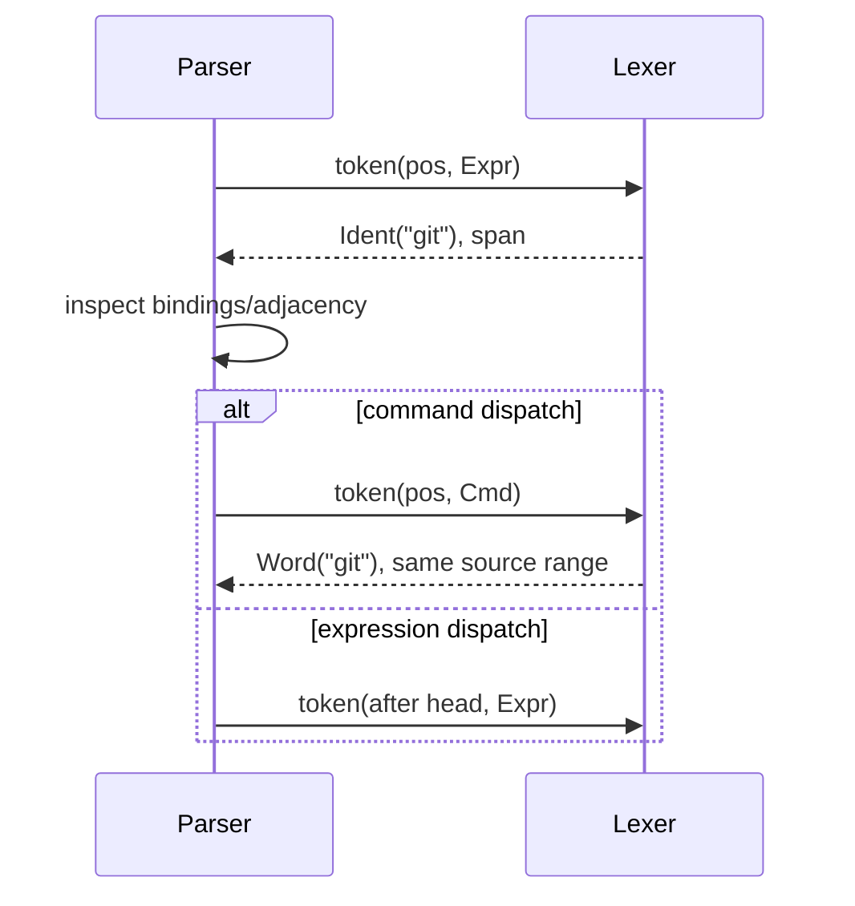
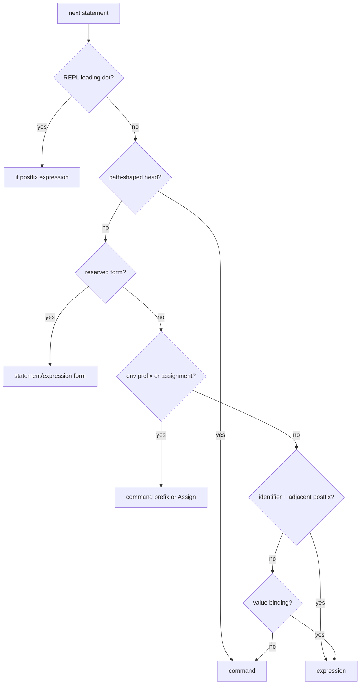
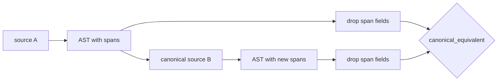

+++
title = "Lexer, parser, and formatter internals"
description = "Modal tokenization, statement dispatch, Pratt precedence, command grammar, ambiguity resolutions, incomplete-input classification, and canonical formatting."
weight = 32
template = "docs/page.html"

[extra]
group = "Language & runtime"
eyebrow = "Language book"
status = "Mode-aware grammar"
audience = "Syntax, editor, and language contributors"
wide = true
+++

Shoal does not have one global token stream. The parser asks a position-addressed lexer to tokenize a
byte offset in expression or command mode, and may rewind/re-lex in the other mode while deciding a
statement head. This is how conventional expressions and shell-like command words coexist without
turning every word into an untyped string.

Sources: [`lexer.rs`](https://github.com/alliecatowo/shoal/blob/main/crates/shoal-syntax/src/lexer.rs),
[`parser.rs`](https://github.com/alliecatowo/shoal/blob/main/crates/shoal-syntax/src/parser.rs), parser
submodules in [`parser/`](https://github.com/alliecatowo/shoal/tree/main/crates/shoal-syntax/src/parser),
and [`format.rs`](https://github.com/alliecatowo/shoal/blob/main/crates/shoal-syntax/src/format.rs).

## Position-addressed modal lexer

`Lexer::token(pos, mode)` returns one token and byte span. It has no mutable cursor, so speculative
parser branches can restore `Parser.pos` and ask for a different interpretation.

Trivia skips spaces/tabs/carriage returns, token-boundary comments, and backslash-newline
continuations, but not ordinary newlines. Newline and semicolon are grammar terminators.

### Token mode comparison

| Source shape | Expression mode | Command mode |
|---|---|---|
| `name` | `Ident` | `Word` |
| `./x`, `/x`, `~/x` | not an expression head | `PathWord` |
| `*.rs`, `[ab].txt` | expression tokens/error | `GlobWord` |
| `--force`, `--x=y` | minus/operator sequence | structured long flag |
| `-abc` | subtraction-shaped tokens | short-flag cluster |
| `NAME=value` | identifier/assignment tokens | `EnvAssign` shape; parser decides prefix vs argument |
| `>`, `>>`, `<`, `&` | comparison/operators where valid | redirect/background tokens |
| quoted strings | shared decoded/interpolated token | shared decoded/interpolated token |
| numeric/size/duration/time | shared typed literal | normally part of command word depending on scan context |

Backticks are rejected with a teaching hint toward `(cmd …)` and `sh { … }`. A single `|` is
recognized only so the parser can issue Shoal's no-pipe diagnostic; `||` remains boolean composition.

The `lexer/number.rs` and `lexer/string.rs` modules own typed numeric/quantity/time scans and escaped,
raw, interpolated, regex, datetime, and raw language-block text respectively.

## Parser state

Value-binding scopes contain `let`/`var`/parameters/pattern binders and make a bare head parse as an
expression. Command-binding scopes contain functions/aliases and leave command-head interpretation.
`path`, `glob`, and `regex` start as value-bound constructor names. `ParseCtx.repl` permits `it`,
`out`, and a leading dot-chain.

`no_trailing_block` resolves an otherwise subtle ambiguity: in `for p in glob("*.md") { … }`, the
brace belongs to `for`, not a trailing closure argument on `glob(...)`. Nested delimiter-enclosed
expressions temporarily lift the restriction because their closing delimiter makes ownership clear.

## Statement dispatch table

The decision is ordered; earlier rules win.

| Priority | Source condition | Parse result |
|---:|---|---|
| 1 | REPL leading `.` but not `./`/`../` | postfix expression seeded with zero-width `it` |
| 2 | raw path head (`/`, `~/`, `./`, `../`) | command statement |
| 3 | reserved statement (`let`, `fn`, `for`, …) | dedicated statement node |
| 4 | expression keywords/literals (`if`, `match`, `try`, `with`, `spawn`, booleans/null) | expression statement |
| 5 | known interpreter immediately followed by raw block | `LangBlock` expression |
| 6 | `NAME=value` followed by command content | command with environment prefix |
| 7 | `env.NAME` or lvalue followed by assignment operator | assignment statement |
| 8 | identifier with adjacent `.`, `?.`, `(`, or `[` | expression/postfix chain |
| 9 | value-bound identifier | expression |
| 10 | unbound or command-bound identifier | command |
| 11 | `^` | forced command |
| 12 | any non-identifier expression starter | expression |

`it` and `out` outside REPL context produce parse errors with a hint, rather than accidentally
spawning commands named `it`/`out`. A real executable with either name remains reachable through `^`.

## Expression parser

Expressions use a Pratt-style loop. Higher binding power binds tighter:

| Power | Operators |
|---:|---|
| 1 | `??` |
| 2 | `||` |
| 3 | `&&` |
| 4 | `==`, `!=`, `<`, `<=`, `>`, `>=`, `in` |
| 5 | `..`, `..=` |
| 6 | `+`, `-` |
| 7 | `*`, `/`, `%` |

Unary `!` and `-` bind before the binary loop; field/index/call/method postfixes bind around the
primary before binary operators. Binary parsing recurses with `bp + 1`, making these operators
left-associative. Comparisons are deliberately non-chainable: use explicit `&&`.

`&&` and `||` operands use `expr_or_command`, so a command can participate in outcome truth semantics.
A single pipe anywhere outside raw/interpreter and pattern-alternation contexts gets a curated error.

### Lambda and delimiter ambiguities

| Ambiguity | Resolution |
|---|---|
| `(a, b) => body` vs parenthesized expression/command | speculative parameter parse; require `=>`, otherwise rewind and `expr_or_command` |
| `x => body` vs command named `x` | top-level primary followed by `=>` is a lambda |
| `{a: 1}` vs statement block | first identifier/string followed by `:` means record; otherwise rewind and block |
| `f(a) { … }` vs following construct body | trailing-block lambda except when caller set `no_trailing_block` |
| `match … { p if x => … }` | guard parser disables bare-identifier lambda at the arm arrow |
| `(cmd args)` | parenthesized fallback uses command/expression dispatch, enabling structured command substitution |

An immediately called non-name expression such as `(x => x + 1)(5)` is lowered by the parser to a
scoped synthetic binding/call form because the AST's `FnCall` stores a name rather than an arbitrary
callee expression.

## Command parser

Environment-shape tokens are prefixes only before the head; after it, `NAME=value` becomes an
ordinary word (`make CC=gcc`). Parenthesized command arguments recursively parse expression or
command content. Long flags retain optional inline/next structured values. Redirect targets are
`CmdArg`s, not raw strings.

The parser rejects box-era shell spellings with actionable alternatives:

- heredocs and here-strings;
- file-descriptor-numbered and stream-merging redirects;
- byte pipe syntax;
- ambiguous dotted command arguments followed by calls, suggesting `(git log).len()`.

## Patterns and binding scopes

Match patterns support alternation at the arm layer. A lone identifier—even one spelling a type—is a
binder; a type pattern requires `TYPE IDENT`. Record patterns are open, list patterns are fixed arity
unless they have `...rest`, and integer patterns can form ranges. Every binder is collected into a
temporary value scope before parsing the guard and body, preventing command misclassification.

## Raw interpreter blocks

The parser has a static `INTERPRETERS` list. A listed head followed by `{ … }` or raw quote syntax is
read as balanced/verbatim source into `Expr::LangBlock`; the body is not lexed as Shoal. The same head
without a block remains a normal command.

Adapter specs can declare `class = "interpreter"`, but they do not extend this list dynamically.
That seam must be solved with parser context/generated registry, not a syntax → adapter dependency.

## Incomplete-input classification

`parse_status` first attempts a full parse, then classifies an error as incomplete when it indicates
unterminated input, an expected token at EOF, an unclosed quote/delimiter stack, or a trailing
operator/comma/dot. Reedline uses this result to continue input; LSP publishes the error as a
diagnostic.

The heuristic scan is deliberately safe for every UTF-8 prefix, but it is not a separate formal
incremental grammar. New delimiter/string/operator forms require prefix tests.

## Canonical formatter

The formatter is an exhaustive AST printer. It emits one statement per line, two-space block
indentation, normalized spaces/commas/operators, escaped double-quoted strings, canonical quantity
base units, quoted non-identifier record keys, and explicit parentheses where atom precedence needs
them. It does not preserve comments or original whitespace because those are not in the AST.

Lossless distinctions that matter for formatting remain separate nodes—most visibly postfix `Catch`.
Comments/doc comments are an exception: only function doc text is retained.

## Grammar-change checklist

- Test both lexer modes and re-lexing at the same position.
- Add an ambiguity-table case for every competing parse.
- Seed all newly bound names while parsing their lexical region.
- Preserve statement terminator and cross-newline continuation behavior.
- Give rejected shell syntax a precise span and teaching hint.
- Update formatter output and canonical-equivalence round trips.
- Exercise every valid UTF-8 prefix through `parse_status`.
- Verify binding-aware local and kernel-exec parsing plus intentionally context-free public parse
  endpoints explicitly.
- Update static interpreter and builtin registries only through their documented workflows.
