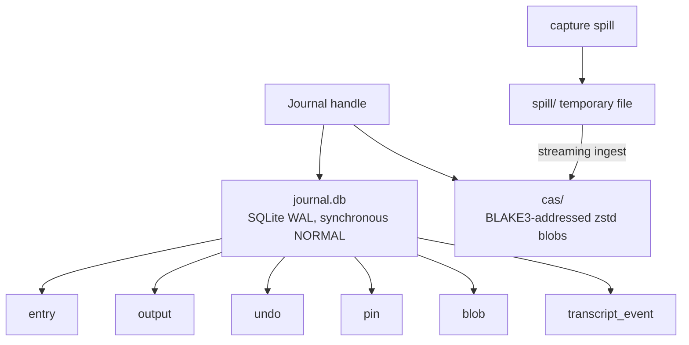
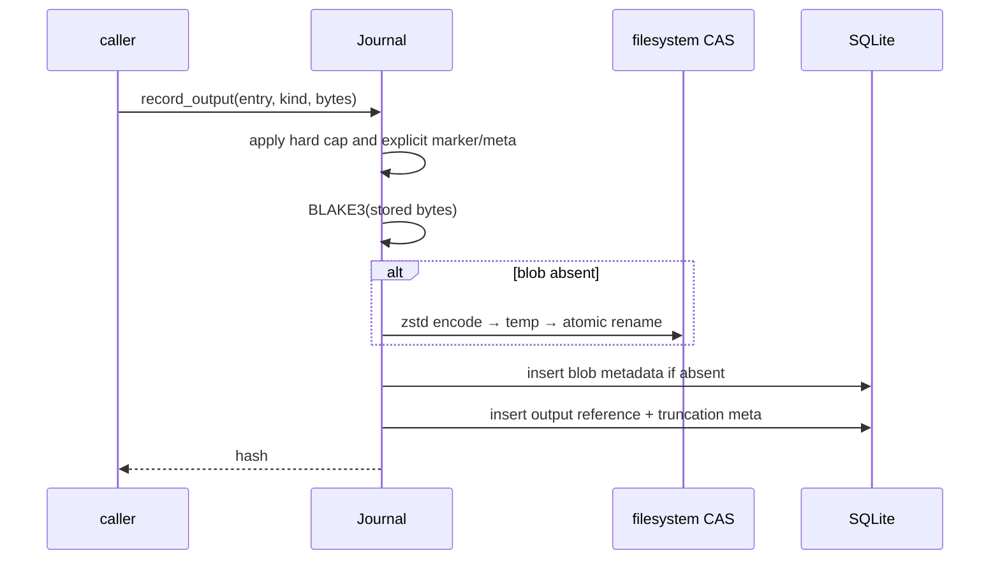
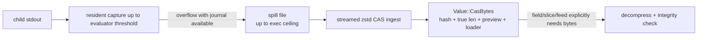
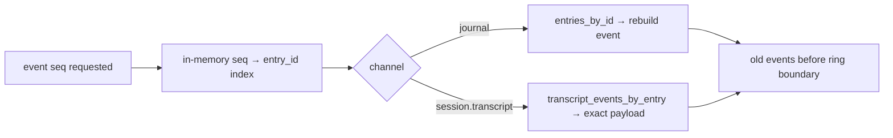

+++
title = "Journal, CAS, undo, and persistence"
description = "The SQLite entry lifecycle, compressed content-addressed output store, lazy bytes, safe undo, garbage collection, and durable event reconstruction."
weight = 100
template = "docs/page.html"

[extra]
group = "Storage & tooling"
eyebrow = "Persistence architecture"
status = "SQLite WAL plus BLAKE3/zstd CAS"
audience = "Storage and provenance contributors"
wide = true
+++

Shoal persistence separates searchable execution metadata from potentially large byte payloads.
SQLite records entries, output references, inverses, pins, blob metadata, and durable transcript
events. A filesystem CAS stores compressed content by BLAKE3 hash.

## Storage layout

```text
<state-dir>/journal.db
<state-dir>/journal.db-wal              # while WAL has live pages
<state-dir>/cas/aa/bb/<full-hash>.zst
<state-dir>/spill/                       # transient capture files
```



Each `Journal` owns one `rusqlite::Connection`, is `Send` but not `Sync`, and is intended to be
opened independently by each process/component. A five-second SQLite busy timeout reduces silently
dropped best-effort writes when the REPL, kernel, and history CLI contend. WAL permits concurrent
readers and leaves an appended-but-unfinished row visible after a crash.

The main shell, kernel, `shoal-history`, and `shoal-doctor` share `ShoalPaths::state_dir`: explicit
`SHOAL_STATE_DIR`, otherwise `$XDG_STATE_HOME/shoal`, otherwise `~/.local/state/shoal`. A relative or
absolute `journal.state_dir` in layered config intentionally moves the shell, doctor, and history
CLI journal; relative paths resolve from each process's startup cwd. `shoal-history --state-dir`
has highest precedence and targets durable kernels launched with an explicit CLI root.

Source: [`shoal-journal`](https://github.com/alliecatowo/shoal/tree/main/crates/shoal-journal/src).

## Schema


Foreign keys are represented by values but are not declared as SQLite foreign-key constraints in
the current DDL. This permits metadata to outlive GC'd bytes and lets history report an output as
“aged out.”

Schema version uses SQLite `PRAGMA user_version`, currently 1. All changes so far were additive; the
migration dispatcher is scaffolded but no real version-to-version migration has shipped. A database
from a newer schema version is rejected rather than guessed at.

## Entry lifecycle

An entry is appended before execution with session, principal, timestamp, byte-backed cwd, exact
source, canonical AST JSON, effects JSON, and opacity. Completion later fills duration, status, and
success. Signal deaths retain `status = NULL` rather than fabricating `128 + signal`.


Outputs are linked as ordered rows of kind `stdout`, `stderr`, `value`, or `render`. Queries return
entries newest-first and join output rows in recording order. `entries_by_id` preserves caller order
and is used by targeted durable event replay.

The standalone `shoal-history::entry` helper uses `Journal::entries_by_id`, so `show ID` fetches only
the requested row and its outputs. Effect-filtered history steps SQLite rows and retains only matches,
stopping at the requested result limit rather than materializing the whole journal.

## Content-addressed store

Bytes are hashed uncompressed, compressed with zstd level 3, and written atomically via temporary
file plus rename. Identical content gets multiple `output` references but one blob file/metadata row.



The default persisted-output hard cap is 256 MiB. Oversized output stores a leading prefix plus an
explicit marker and `OutputMeta { truncated, original_len, stored_len }`. Callers that require exact
bytes—especially undo snapshots—must inspect this metadata and refuse to record a partial inverse.

Reads decompress and re-hash bytes against the requested key. Corruption or swapped content is an
integrity error, never silently returned. Hash validation also prevents malformed/traversal-like keys
from reaching arbitrary paths.

## Spill and lazy CAS bytes

The execution layer can keep moderate captured stdout resident, then stream a larger capture to a
temporary spill file. `ingest_spill` zstd-streams it into CAS without loading it all into RAM, records
blob metadata, optionally pins it, and removes the spill file.



`CasBytes` answers type/length/preview without materializing the payload. The loader is a cheap,
cloneable, database-independent handle to the CAS directory so the value can cross threads without
holding a SQLite connection.

Evaluator spills are ingested with a pin to keep a live ref safe from GC. No evaluator lifecycle path
currently calls `unpin`; only the history CLI and direct API/tests do. This can turn spill pins into
permanent retention until an operator intervenes. A future ownership model needs explicit ref
leases or a durable reason/lifetime on each pin.

## Undo model

Undo stores typed inverses, not reverse shell strings:

| Inverse | Recorded evidence | Replay |
|---|---|---|
| `TrashMove` | original path, trash path, trash fingerprint | rename trash back if original absent and fingerprint unchanged |
| `RestoreBytes` | path, exact prior CAS hash, expected current fingerprint | verify current, load exact prior bytes, atomic replace |
| `MoveBack` | source/destination and expected source fingerprint | rename back if destination absent and fingerprint unchanged |

Inverses replay newest-first so a multi-step command unwinds in reverse order.


The implementation resolves only leading OS-level symlink aliases when aligning roots, then refuses
symlink traversal inside the tracked scope. Fingerprints include size, modification time, and a file
content hash. Replaying against changed state fails rather than overwriting newer user work.

Undo is best-effort at recording time only when exact evidence exists. If a prior file is too large
for an untruncated CAS snapshot, the mutation cannot honestly be labeled reversible.

## Garbage collection

GC supports TTL, maximum-byte budget, dry-run, and pins. Candidates are ordered with unreferenced
blobs before referenced blobs, then least-recent access. TTL selection can include referenced blobs;
pins are the only hard retention mechanism.


Deleting a referenced blob intentionally leaves its output metadata. History checks availability and
reports `aged_out`; a later `blob.get` cannot retrieve it. A failed tombstone deletion attempts to
rename the file back before returning an error.

## Durable transcript and event replay

The kernel's coarse `journal` event payload can be reconstructed from entry columns, so it stores an
in-memory sequence → entry-ID index. `session.transcript` summaries cannot be reconstructed from
entry metadata, so their exact tagged JSON payload and timestamp are stored in `transcript_event`,
keyed by the corresponding coarse entry ID.



The sequence index itself is rebuilt/maintained by the running kernel rather than stored as a generic
event log. Only these two channels have the journal-backed cold path.

## Persistence invariants

- Source, AST, effects, principal, session, cwd bytes, and unfinished state remain queryable without
  output blobs.
- CAS keys always hash uncompressed stored bytes and are verified on read.
- Truncation is represented in both content marker and structured metadata.
- Undo never restores truncated bytes as if complete.
- Undo targets remain within the supplied root and fail on stale fingerprints or symlink parents.
- GC never removes pins, but may age out referenced unpinned blobs.
- A newer database schema is refused by an older build.
- Multiple components open independent SQLite handles; never share a `Journal` concurrently as if it
  were `Sync`.
