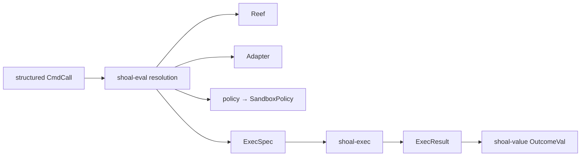
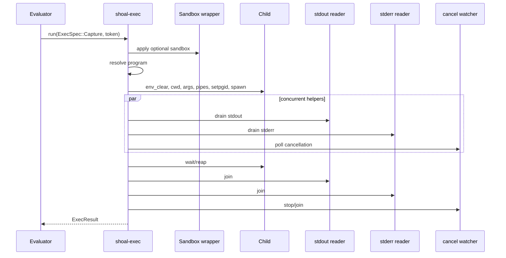
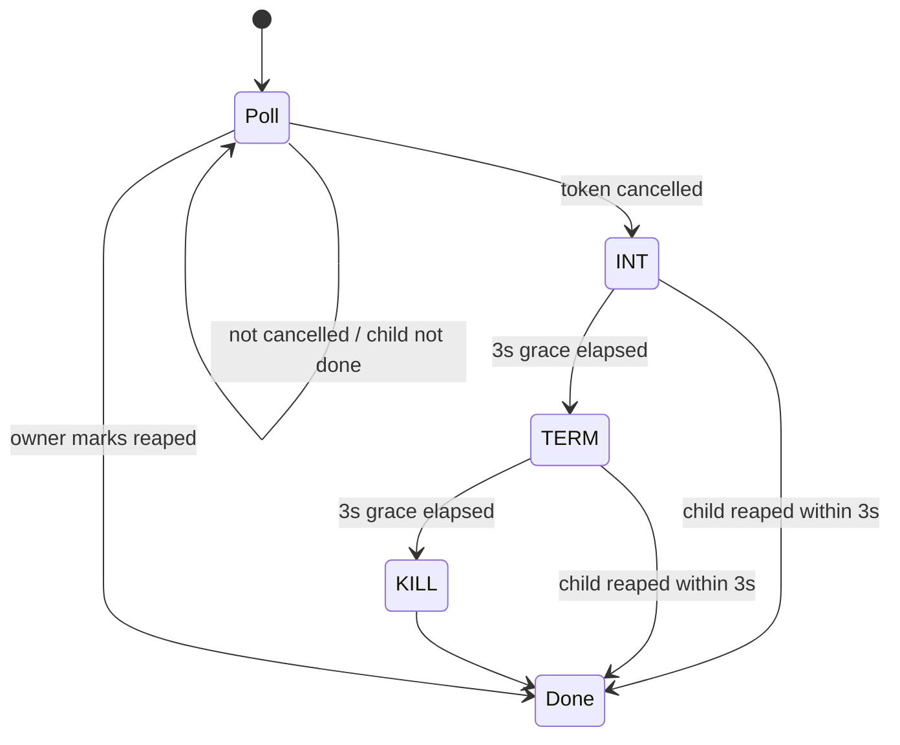
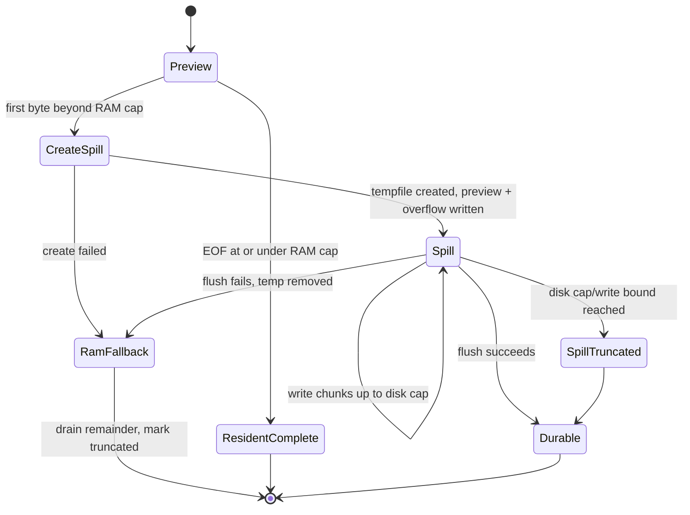

+++
title = "Process execution and capture"
description = "ExecSpec resolution, capture-mode pipes, cancellation escalation, result status, bounded memory and disk spill, stdin modes, sandbox wrapping, and failure ownership."
weight = 51
template = "docs/page.html"

[extra]
group = "Execution & security"
eyebrow = "Execution book"
status = "Process and capture state machine"
audience = "Execution, evaluator, journal, and security contributors"
wide = true
+++

`shoal-exec` is the blocking Unix process engine beneath external commands. It never invokes a shell.
It receives a fully resolved `ExecSpec`, selects pipe capture or a PTY, owns process-group lifecycle,
and returns an `ExecResult` that distinguishes exit status, signal death, stop, truncation, spill,
and actual sandbox enforcement.

This chapter covers capture mode. The [PTY and job-control](../pty-job-control/) chapter covers
interactive execution and long-lived terminal sessions.

Sources: [`lib.rs`](https://github.com/alliecatowo/shoal/blob/main/crates/shoal-exec/src/lib.rs),
[`capture.rs`](https://github.com/alliecatowo/shoal/blob/main/crates/shoal-exec/src/capture.rs),
[`watcher.rs`](https://github.com/alliecatowo/shoal/blob/main/crates/shoal-exec/src/watcher.rs), and
[`sandbox.rs`](https://github.com/alliecatowo/shoal/blob/main/crates/shoal-exec/src/sandbox.rs).

## Execution request contract

`ExecSpec` contains all information needed to spawn exactly one process:

| Field | Contract |
|---|---|
| `argv` | `argv[0]` program plus exact argument bytes |
| `cwd` | child working directory |
| `env` | complete child environment; spawn calls `env_clear` first |
| `stdin` | null, inherited, bytes, or file |
| `mode` | `Capture` or `PtyTee` |
| `sandbox` | optional requested `shoal_leash::SandboxPolicy` |
| `spill` | optional directory permitting oversized stdout spill |

There is no shell command string, implicit environment merge, global cwd mutation, redirection AST,
adapter parser, or Reef constraint in this crate. The evaluator resolves those concerns before it
constructs the spec.

## Program resolution

If `argv[0]` contains `/`, spawning uses that path as supplied. Otherwise `resolve_program` searches
the `PATH` entry in `ExecSpec.env`; only when the spec environment has no `PATH` does it fall back to
the host process `PATH`.

`which` treats an empty PATH component as `.`. A hit must be a regular file with at least one execute
bit. Resolution uses native `OsStr` bytes and does not require UTF-8.

The direct-slash path is not prevalidated by `which`; OS spawn errors remain authoritative. Search
does not apply shell builtins, functions, aliases, extensions, PATHEXT, or shebang parsing itself.

`resolve_and_hash` resolves with the same rules and hashes the executable bytes with BLAKE3. Kernel
hosts use it to build spawn effects compatible with Reef/Leash pin hashes.

## Stdin modes

| `StdinSpec` | Capture behavior | PTY behavior |
|---|---|---|
| `Null` | `/dev/null` | no bytes forwarded |
| `Inherit` | parent stdin | real terminal forwarding when available |
| `Bytes` | piped writer thread, then close | write into PTY master, then stop writing |
| `File` | opened and installed as fd 0 | contents written into PTY master |

In capture mode, byte-input writing ignores `EPIPE` because early child exit is expected. File open
failure occurs before spawn. A `Stream` cannot currently become a live stdin producer; evaluator
`.feed` must materialize a supported value into `Bytes`.

## Capture-mode spawn

The child calls `setpgid(0,0)` before exec, giving it a process group whose id is normally the child
PID. Cancellation and drop cleanup signal the negative PGID, affecting the spawned process tree
rather than only the immediate child.

The command clears inherited environment and installs exactly `spec.env`. Stdout and stderr are
separate pipes. Draining them on two threads is load-bearing: sequential reads can deadlock when a
child fills the pipe not currently being drained.

## Streaming capture handle

`spawn_capture` returns `StreamingChild` with public stdout/stderr readers and hidden child lifecycle
state. This is for callers that consume output incrementally.

`StreamingChild::wait` drops any readers still stored in the handle before waiting. An undrained
child then sees a closed pipe/`EPIPE` instead of leaving the waiter deadlocked behind a full pipe.
The result's stdout/stderr vectors are empty because ownership of stream consumption belonged to the
caller.

Dropping a streaming child without `wait` sends `SIGKILL` to its process group, waits/reaps the child,
marks watcher completion, and joins helper threads. The no-zombie guarantee applies on abandonment,
not only the happy path.

## Cancellation ladder

`CancelToken` is `Arc<AtomicBool>`. All clones share a flag, and cancellation is idempotent.

A watcher polls every 50 ms. Once any watched token trips, exactly one watcher claims escalation:

Each signal targets the whole process group. The watcher checks `done` before signals and throughout
grace periods. This narrows but cannot fully eliminate a PID/PGID reuse race between reap and signal.

Cancellation is not returned as an `io::Error`; execution returns normally with the actual final
exit/signal information. Callers decide how a cancelled outcome should become a language error.

If a distinct token is passed to streaming `wait`, another watcher is installed. A shared `claimed`
flag ensures only one executes the ladder.

## Status decoding

Normal exit produces `status = Some(code), signal = None`. Signal death produces
`status = None, signal = Some("SIG...")`. Shoal does not encode signals as `128 + n`.

Known signal numbers render symbolic names for INT, TERM, KILL, SEGV, ABRT, BUS, FPE, ILL, PIPE,
HUP, and QUIT. Other signals render as `SIG<number>`.

Blocking waits retry `EINTR`. Capture mode does not request `WUNTRACED` and can never return
`stopped = true`.

## Complete result contract

| Field | Meaning |
|---|---|
| `status` | normal exit code, absent on signal death/stop |
| `signal` | fatal signal, absent on normal exit/stop |
| `stdout` | captured bytes or bounded preview |
| `stderr` | captured bytes; empty in PTY mode |
| `truncated` | some captured content was lost at a bound |
| `stdout_spill` | optional caller-owned spill metadata/file |
| `dur` | elapsed wall-clock duration from spawn to reap |
| `pid` | child id |
| `pgid` | child process group id |
| `stopped` | live stopped PTY foreground child |
| `enforcement` | actual sandbox tier/status when requested |

An `io::Error` means resolution, setup, spawning, or wait plumbing failed—not that the child exited
nonzero. Exit status and fatal signal are successful execution results.

## Memory capture bound

The default in-memory cap is 64 MiB per captured stream, with a separate 256 MiB process-wide
admission ceiling across active capture drains. The per-stream cap resolves once from positive
`SHOAL_CAPTURE_CAP_BYTES`; the aggregate cap resolves from
`SHOAL_CAPTURE_AGGREGATE_CAP_BYTES`. Both have hard maxima and their atomic override setters clamp
zero to one byte.

`drain_capped` continues reading to EOF after the buffer reaches the cap, discarding overflow and
setting `truncated`. Continuing the drain prevents pipe backpressure from blocking the child.

Stdout and stderr each request a resident lease before allocating. When concurrent captures exhaust
the aggregate ceiling, a drain receives only the remaining budget (possibly zero), continues to EOF,
and honestly reports truncation or spills stdout. Leases are returned when the drain hands its bytes
to the result. Long-lived evaluator bindings are independently charged to the lexical environment's
retained-value budget. PTY capture has its own merged-buffer bound.

## Disk-spill state machine

Only stdout can spill, only in capture mode, and only when `ExecSpec.spill` supplies an existing
directory. The default per-stream spill cap is 256 MiB, resolved from positive
`SHOAL_CAPTURE_SPILL_CAP_BYTES` or an atomic override. A second 512 MiB process-wide active-spill
ceiling (`SHOAL_CAPTURE_AGGREGATE_SPILL_CAP_BYTES`) and a 16-file admission limit prevent concurrent
captures from multiplying the per-stream bound without limit. Hard maxima are 512 MiB per stream and
1 GiB aggregate.

The spill file is created lazily at first overflow. At that moment the existing preview plus the
overflow tail are written so the file begins at byte zero. BLAKE3 hashes exactly the bytes actually
stored. Reads continue to EOF even after the disk cap, but extra bytes are discarded and
`CaptureSpill.truncated` is true.

The returned `CaptureSpill` contains path, hash, stored length, and its own truncation flag. Its clones
share an RAII owner: the final drop removes an unadopted file and returns its file/byte reservation.
Moving the file into the CAS makes that cleanup a harmless `NotFound`. `shoal-exec` deliberately does
not depend on the journal/CAS crate.

When a spill exists, `ExecResult.stdout` remains the bounded preview. `ExecResult.truncated` does not
mean stdout was lost merely because it spilled; it reflects stderr loss or spill truncation as
assembled by the capture path. Consumers must inspect both result and spill metadata.

## Evaluator spill adoption

The evaluator's command path requests a spill when a journal/CAS context is available, then adopts
the caller-owned file. A successfully adopted large value becomes lazy `CasBytes`/an outcome stdout
reference. Because the CAS owns the complete bytes, the evaluator reduces the retained presentation
preview to 1 MiB before the value enters a lexical environment; this keeps ref-backed values within
the independent per-binding budget. Redirects and `.feed` must load full content through
`stdout_bytes`, not write only the resident preview.

Any error between process return and adoption must clean up the temporary file. Tests should cover
successful adoption, adoption failure, no-journal behavior, disk-cap truncation, and redirects from
spilled outcomes.

## Sandbox application in spawn path

Before resolution/spawn, `sandbox::apply` consumes the optional sandbox request. It resolves the
program, verifies an optional executable-content pin, and may rewrite argv through the sibling
`shoal-sandbox-exec` helper.

| Platform/path | Filesystem enforcement | Network enforcement |
|---|---|---|
| Linux with Landlock ABI/helper | applied, tier A | not enforced |
| macOS helper/Seatbelt | applied, reported tier C | not enforced |
| unsupported host | child may run unconfined with honest degraded status | not enforced |
| any host with `hermetic` and unmet request | spawn fails closed | spawn fails closed |

`net = deny` is advisory unless a future backend reports `network_enforced`. A hermetic request
rejects execution when filesystem or requested network enforcement cannot be fully applied.

The helper is searched beside the current executable or its parent. Missing helper can fail a path
that otherwise has an enforcement mechanism. Wrapped argv encodes read/write/delete grants, then
`--`, resolved program, and original arguments after argv zero.

Executable pinning hashes before exec. There is a documented TOCTOU window between hash verification
and the kernel executing the path; the status must not claim atomic verified execution.

## Spawn failure and cleanup ownership

| Failure point | Owner/action |
|---|---|
| no program/empty argv | return `InvalidInput` before child |
| PATH miss | return `NotFound` before child |
| stdin file open | return I/O error before child |
| sandbox/pin/helper failure | return before unapproved spawn, subject to nonhermetic degrade rules |
| OS spawn including `E2BIG` | propagate `io::Error` |
| reader thread panic | substitute an empty truncated drain result; child still reaped |
| spill create/write/flush failure | drain, fall back to preview/truncation, deterministically remove the invalid file |
| caller drops streaming child | kill group and reap |
| process exits nonzero | return `ExecResult`, not `io::Error` |

## Global configuration caveat

Capture limits are process-global atomics, not fields in `ExecSpec` or evaluator/session config.
The first environment lookup is cached. Tests and multiple kernel sessions can affect one another if
they call setters concurrently or assume per-session limits. The aggregate counters constrain active
drains/files process-wide; returned resident buffers are instead governed by their owner's retention
budget. Moving every limit into requests would make resource budgets composable but requires plumbing
through every execution host.

## Change protocol

1. keep `ExecSpec` fully resolved and shell-free;
2. preserve native `OsString` argv/environment data;
3. put every child in an owned process group before relying on group cancellation;
4. drain stdout and stderr concurrently and continue draining beyond storage caps;
5. define resident, spill, and truncation ownership independently for stdout and stderr;
6. ensure every early/drop path reaps the child and joins helper threads;
7. report actual sandbox enforcement, never requested enforcement as fact;
8. test normal exit, every signal class, cancellation rung, `E2BIG`, missing PATH, closed stdin,
   over-cap output, spill failure, and caller abandonment;
9. update `OutcomeVal`, wire value projection, journal/CAS adoption, and redirect behavior together;
10. keep PTY-specific stop semantics out of capture mode.

## Known sharp edges

- Unix-specific `setpgid`, signals, permissions, and wait status are foundational; there is no
  Windows execution backend.
- Capture caps are process-global and cached; active admission is not fair between concurrent streams.
- Stderr never spills and can lose content above the resident cap.
- Spill create/read/write/flush errors degrade to a truncated resident preview; the detailed I/O cause
  is not carried in `ExecResult`.
- Spill flush establishes kernel-page-cache acceptance, not power-loss durability (`fsync` is not
  performed). The journal/CAS adoption path owns its own durability contract.
- Sandbox pin verification has a TOCTOU gap.
- Network policy has no enforcing backend in the current spawn wrapper.
- Nonhermetic sandbox requests can degrade to an unconfined child, though status is honest.
- `StreamingChild::wait` closes undrained pipes; callers wanting all bytes must drain both concurrently
  before waiting.
