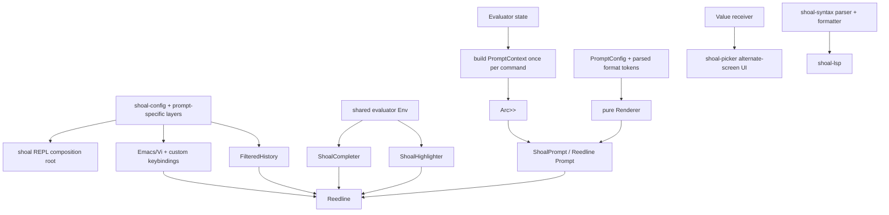
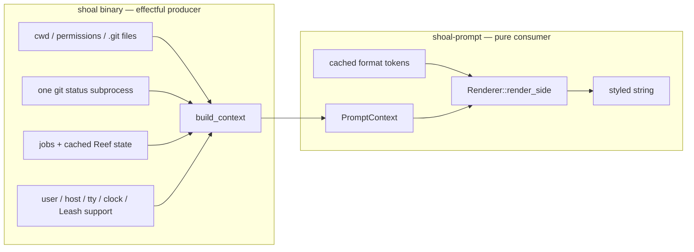
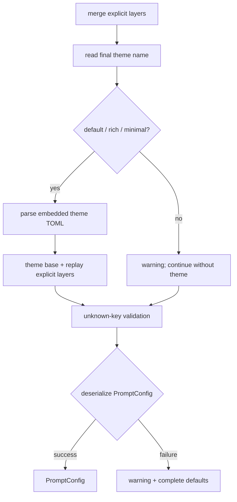
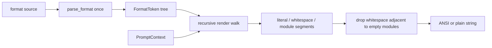
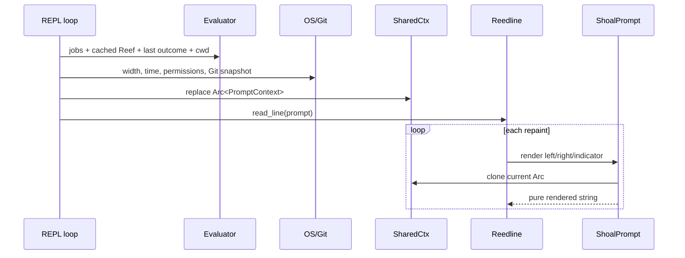
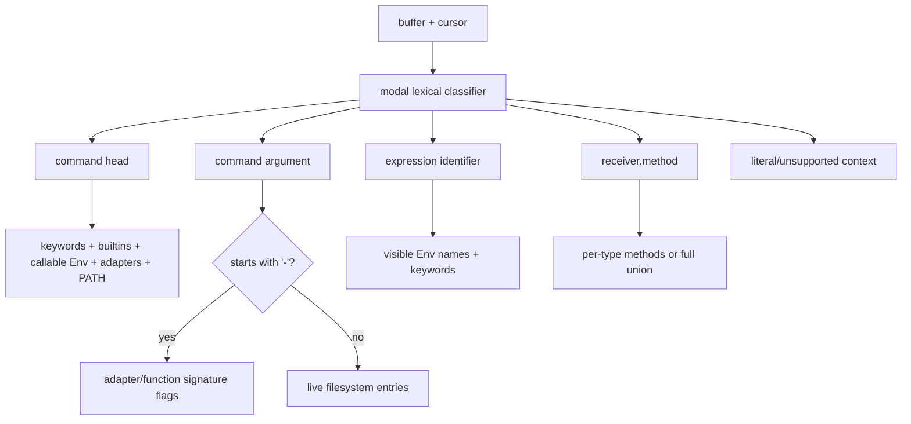
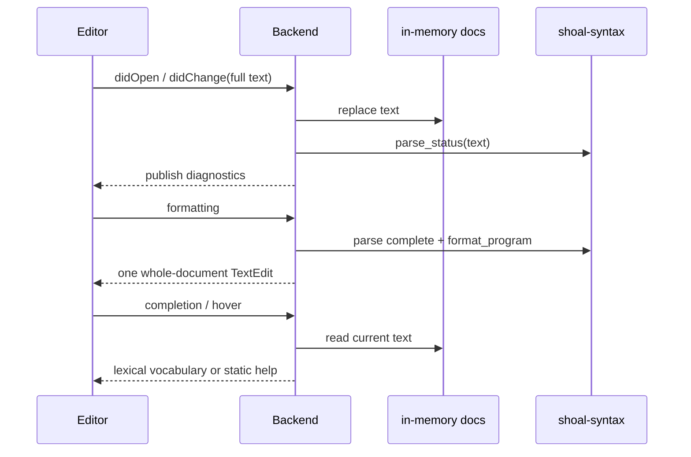
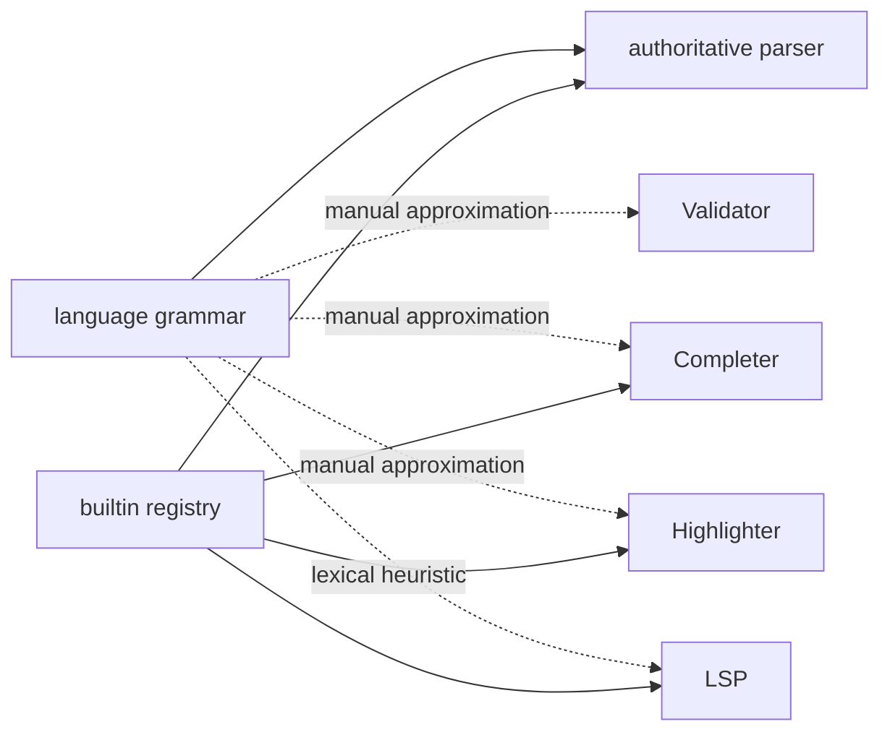

+++
title = "Prompt, editor, completion, picker, and LSP"
description = "The pure prompt renderer and host snapshot seam, Reedline editing stack, context-sensitive completion and highlighting, fuzzy picker, and deliberately lexical language server."
weight = 92
template = "docs/page.html"

[extra]
group = "Storage & tooling"
eyebrow = "Interactive tooling internals"
status = "Implemented core with explicit producer gaps"
audience = "Prompt, terminal UX, editor integration, and LSP contributors"
wide = true
+++

Shoal's interactive tooling has one strong architectural theme: fast presentation logic consumes
small snapshots, while filesystem discovery, process execution, and session mutation stay on the
host side. The prompt is the clearest realization of that rule. Completion and highlighting share
the live lexical environment but perform only bounded discovery. The LSP reuses syntax and
formatter libraries without embedding a full evaluator.

This chapter is the stable replacement for the prompt design notes previously cited from
`scratch/design-prompt.md`. Source comments should link here, to a narrower section when possible.

## Interactive stack at a glance



The pieces are related but have different latency contracts:

| Component | Trigger | I/O allowed? | State model |
|---|---|---:|---|
| prompt renderer | potentially every keystroke/repaint | no | frozen `PromptContext` |
| prompt context producer | once before each `read_line` | yes, bounded | evaluator + OS snapshot |
| completer | Tab/menu request | bounded filesystem/PATH scan | live `Env`, cached PATH dirs, live cwd cell |
| highlighter | buffer repaint | PATH/file metadata checks today | live `Env`, source buffer |
| validator | buffer submission decision | no | source buffer only |
| history adapter | line save/search | file-backed backend | previous recorded entry + filters |
| picker | explicit `.pick()` call | terminal event I/O | isolated modal `Model` |
| LSP | editor RPC | no evaluator/process execution | in-memory full documents |

## Prompt dependency rule

`shoal-prompt` is a domain-pure crate. It has no dependency on another `shoal-*` crate, performs no
filesystem I/O, and spawns no process. The binary owns the conversion from live session state into
the prompt crate's own snapshot types.



The type boundary prevents the prompt renderer from quietly adding a Git command or state lookup.
It does not prevent the producer from becoming slow; producer work is budgeted once per command,
outside the per-keystroke path.

## Prompt configuration layers

The rich prompt loader is intentionally more capable than `shoal-config::Prompt`, but its discovery
is currently independent. Lowest to highest precedence:

1. `/etc/shoal/shoal.toml` `[prompt]`;
2. user `$XDG_CONFIG_HOME/shoal/shoal.toml` `[prompt]`;
3. user `$XDG_CONFIG_HOME/shoal/prompt.toml`, whose root is the prompt table;
4. `cwd/.shoal.toml` `[prompt]`—only the current directory, no ancestor search;
5. prompt-specific environment overrides.

After ordinary layers merge, the selected built-in theme is loaded underneath them and the layers
are replayed on top. Therefore a theme supplies defaults but never defeats a user setting.



Unlike core configuration, a prompt deserialization error does not stop shell startup. It warns and
falls back to all defaults. File reads also use a best-effort path: unreadable files are treated as
absent; malformed files generate warnings. This is a deliberate “a broken prompt must not break the
shell” policy, but it means permission failures and absence are not distinguishable in current
diagnostics.

### Environment controls

| Variable | Effect |
|---|---|
| `SHOAL_PROMPT_LEFT` | `format.left` |
| `SHOAL_PROMPT_RIGHT` | `format.right` |
| `SHOAL_PROMPT_THEME` | selected embedded theme |
| `SHOAL_PROMPT` | deprecated alias for left format; explicit `_LEFT` wins |
| `SHOAL_NERD_FONT` | `1` → `always`, `0` → `never`, otherwise literal mode |

Nerd-font `auto` detection checks, in order of a single boolean expression, `WEZTERM_PANE`,
`KITTY_WINDOW_ID`, `WT_SESSION`, then `SHOAL_NERD_FONT=1`. Unicode and nerd-font support are
separate: a nerd glyph is used only when both are true.

### Legacy template migration

A prompt table containing `template` and no `format` is rewritten to `format.left`; `{cwd}` becomes
`$directory`. A table containing both emits a warning, drops `template`, and keeps the rich format.
This migration runs independently in the prompt host loader, not in `shoal-config`'s typed merge.

## PromptConfig shape

Top-level configuration is:

| Field | Default | Runtime role |
|---|---|---|
| `theme` | empty | optional embedded preset name |
| `nerd_font` | `auto` | `always`, `never`, or environment detection |
| `unicode` | `true` | select Unicode versus ASCII fallbacks |
| `right_prompt_on_last_line` | `false` | forwarded to Reedline |
| `format.left` | module-rich default | main left prompt |
| `format.right` | duration/jobs/time | main right prompt |
| `format.continuation` | `... ` | multiline continuation prompt |
| `format.transient` | `$character ` | post-submit replacement prompt |
| `transient.enabled` | `false` | install Reedline transient prompt |
| `budget.render_deadline_ms` | `5` | stop rendering later modules after elapsed budget |
| `budget.warn_on_exceed` | `true` | accepted but **not observed by renderer/host** |
| `style.*` | semantic palette | named style indirection |
| `module.*` | per-module defaults | visibility, symbols, format, style |

The default left format is:

```text
$directory$git_branch$git_status$git_state$reef$character
```

The default right format is:

```text
$cmd_duration $jobs $time
```

## Format mini-language

Format strings parse once during `Renderer::new` into a recursive token tree:

```rust
enum FormatToken {
    Literal { text, ws_only },
    Placeholder(String),
    Group { inner: Vec<FormatToken>, style: String },
}
```

Supported forms are:

- `$directory` for a module placeholder;
- `[text $module](cyan bold)` for a recursively parsed styled group;
- all other text as literal content.

Identifiers contain ASCII letters, digits, and underscore. A lone `$` is literal. A malformed or
unclosed style group degrades to literal `[` text rather than failing config load. Parsed placeholder
IDs are checked against static modules plus configured `language_<name>` and `custom_<name>` IDs.
Unknown IDs warn at renderer construction and render empty.

Whitespace-only literals adjacent to an empty module are dropped. This prevents formats such as
`$cmd_duration $jobs $time` from accumulating leading or double spaces as conditional modules hide.
Non-whitespace literals are never implicitly removed.



### Deadline behavior

Each side render starts an `Instant` and checks elapsed time before each placeholder. Once elapsed
time exceeds `render_deadline_ms`, remaining placeholders render empty; literal tokens still render.
This is a degradation budget, not preemption: one unexpectedly slow module can itself exceed the
deadline before later modules are skipped. Today modules are pure and small, so the main protection
is against future renderer regressions.

`warn_on_exceed` is not consulted. The standalone `shoal prompt bench` command returns a failure
status when measured p99 exceeds the deadline, but ordinary prompt rendering does not warn.

## Style grammar

A style is a whitespace-separated set of attributes and colors:

- attributes: `bold`, `italic`, `underline`, `dim`/`dimmed`;
- foreground: standard/bright named color, integer ANSI-256 index, or `#rrggbb`;
- background: `bg:` followed by any supported color;
- `none`: explicit no-op.

Tokens are order-independent and the last foreground/background color wins. Unknown tokens are
ignored; a spec with no recognized token produces a warning when parsed through a warning-aware
call. Rendering currently calls `parse_style` with a throwaway warning vector, so a style typo can
be warned in direct tests but is not necessarily surfaced during a normal render. `NO_COLOR` or an
empty/plain style returns the original text without SGR escapes.

Palette names `ok`, `error`, `warn`, `info`, `muted`, and `accent` expand only when the **whole**
style spec equals that name. They are not macros inside a compound spec such as `muted bold`.

## Prompt module ledger

| Placeholder | Snapshot input | Visibility/format behavior | Wiring status |
|---|---|---|---|
| `character` | last outcome, edit mode, Unicode | success/error/Vi-normal symbol | edit mode producer is hardcoded Emacs |
| `directory` | cwd, home, repo-relative path, read-only | home collapse, component truncation | `truncate_style` accepted but ignored |
| `git_branch` | branch or detached SHA | symbol, truncation, template | active |
| `git_status` | counts/degraded flag | staged/worktree/untracked/conflict/stash/ahead/behind | stash always zero; `engine` ignored |
| `git_state` | Git operation state | rebase/merge/cherry-pick/bisect/revert label | active |
| `cmd_duration` | last outcome duration | hides below `min_ms` | active |
| `exit_status` | status/signal/ok | optional success display | active, disabled by default |
| `jobs` | running/suspended/total | threshold + template | active |
| `time` | local h:m:s | small `%H/%M/%S` formatter | active |
| `username` | session identity | root/SSH/show-always gate | active |
| `hostname` | session identity | SSH/show-always gate | active |
| `reef` | cached bindings | constrained by default; version shortened | active |
| `principal` | human/agent | symbols and optional agent name | producer always Human |
| `leash` | detected tier/enforced | per-tier style/symbol | capability snapshot, not loaded policy identity |
| `battery` | optional battery snapshot | charging/low threshold | producer always `None` |
| `language_<name>` | matching Reef binding | constrained/resolved visibility | no independent probe/TTL producer |
| `custom_<name>` | `Ready/Pending/Stale/Error` segment | ready/stale output only | producer map always empty |
| `indent` | none | empty reserved placeholder | active as no-op |

This split is crucial: renderer unit tests can prove that a hand-built battery or agent snapshot
renders correctly even though the real host never produces one. Renderer completeness and
end-to-end feature completeness are different maturity claims.

### Module-specific inert fields

The current source contains several schema promises without a consuming path:

- `directory.truncate_style` does not choose another truncation algorithm;
- `git_status.engine` does not select an engine; the host always uses its current reader;
- `budget.warn_on_exceed` does not emit a runtime warning;
- `battery.sample_interval_s` has no sampler;
- `language.probe_ttl_s` has no prompt-side probe cache;
- custom `command`, `when`, and `cache_ttl` have no host task/cache;
- custom `when` is not evaluated by the pure renderer either;
- `PromptContext.multiline` exists but no module currently reads it.

These fields are preserved as intended extension points, not documented as operational behavior.

## PromptContext snapshot

`PromptContext` contains only owned or cheap-to-clone resolved values:

| Domain | Fields |
|---|---|
| terminal | width, no-color, nerd-font, Unicode, edit mode, multiline |
| location | cwd, home, read-only |
| prior command | outcome ok/status/signal/duration/head |
| session | jobs, principal, Leash tier/enforcement, user/host/SSH/root |
| time | local h:m:s |
| project | optional Git snapshot, Reef bindings |
| optional producers | battery and custom-segment map |

`PromptContext::empty` is both a safe pre-first-command value and a test/benchmark fixture baseline.
It does not perform discovery.

### Static facts

`StaticFacts::resolve` runs at interactive startup and captures:

- user and hostname;
- SSH presence and real-UID root status;
- Leash enforcement capability/status;
- home directory;
- `NO_COLOR`, Unicode, and nerd-font decision;
- principal, currently hardcoded to `Human`.

These do not refresh during the process. Environment or enforcement changes after startup therefore
do not alter the prompt unless a future reload path reconstructs static facts.

### Per-command facts

Before every call to `Reedline::read_line`, the REPL builds a new context with:

- evaluator cwd and writability via `access(W_OK)`;
- last evaluator `it` when it is an `Outcome`;
- live evaluator job counts;
- evaluator's cached Reef prompt snapshot;
- local time;
- Git repository/branch/state/counts;
- current terminal width.

It swaps an `Arc<PromptContext>` under a short `RwLock`. Every Reedline prompt callback clones the
Arc and invokes only the pure renderer. A poisoned lock recovers its contained snapshot.



### Git acquisition

Repository discovery walks ancestors for `.git`, supporting both directories and worktree
`gitdir:` files. `HEAD` and in-progress operation markers are read directly. One
`git -C <cwd> status --porcelain=v2 --branch` subprocess per context build supplies ahead/behind,
staged, unstaged, untracked, and conflict counts. Failure leaves branch/state available, zeros
counts, and sets `degraded = true`—it never reports a failed status lookup as confidently clean.

Stash count is always zero because it would require another command. Snapshot age is also always
zero; there is no asynchronous stale-cache engine today.

### Known hardcoded context gaps

The host currently builds every live context with:

```text
edit_mode = Emacs
multiline = false
principal = Human
battery = None
custom = {}
git.stashed = 0
git.age = 0
```

The shell can genuinely run Reedline in Vi mode, but the prompt never sees Vi normal/insert/visual
state. Consequently `character.vicmd_symbol` is non-operational in the real shell. Agent principal,
battery, custom-command, stash, and stale-age render branches are similarly renderer-complete but
producer-incomplete.

## Reedline prompt adapter

`ShoalPrompt` maps Reedline callbacks to four sides:

- normal left → `Side::Left`;
- normal right → `Side::Right`;
- multiline indicator → `Side::Continuation`;
- transient instance left → `Side::Transient`, with empty right side.

The ordinary prompt indicator is always empty because `$character` owns the visible symbol. This
avoids double chevrons. History search retains a small Reedline-compatible textual indicator.
`right_prompt_on_last_line` is forwarded from configuration.

Transient mode installs a second `ShoalPrompt` sharing the renderer and snapshot cell; Reedline owns
the repaint timing.

## Prompt introspection commands

`shoal prompt` has three source-derived development surfaces:

| Command | Behavior |
|---|---|
| `prompt print --side …` | builds a live standalone context and prints one side |
| `prompt explain --side …` | lists top-level placeholders, plain output, per-module microseconds, total/budget |
| `prompt bench --side … --n N` | fixed rich fixture, warmup, p50/p99/max, nonzero result if p99 exceeds deadline |

`explain` only directly enumerates top-level placeholder tokens, not placeholders nested inside
style groups. The renderer still handles nested placeholders; this is an observability limitation.

## Validator and multiline decisions

`ShoalValidator` currently uses the host's `input_is_incomplete` scanner rather than
`shoal_syntax::parse_status`. It tracks quotes, triple quotes, escapes, comments, and delimiter
balance to decide whether Enter should submit or continue. That keeps incomplete editing cheap but
duplicates part of lexical/parser knowledge.

The LSP diagnostics path does use `parse_status`, and the formatter requires a complete AST. A
future unification should preserve interactive tolerance while eliminating disagreement about novel
syntax.

## Completion architecture

`ShoalCompleter` holds an Arc-backed live `Env`, a mutable cwd cell, adapter catalogs/names, a
per-PATH-directory cache keyed by directory modification time, and match settings.

It classifies the cursor into five contexts without a full parse:



### Head completion

Candidate sources are parser reserved words, the canonical syntax builtin registry, callable live
bindings, adapter names, and executables scanned from process `PATH`. A PATH directory is rescanned
when its metadata modification time changes, and each scan takes at most 4,000 entries. Executable
permission is not checked; entries are names from PATH directories.

### Argument completion

A word beginning with `-` gets flags from the known adapter's top-level and every subcommand
signature, plus a matching closure's named parameters. The classifier does not yet narrow adapter
flags to the selected subcommand.

Other arguments list the relevant directory live. A prefix such as `crates/sho` resolves and scans
`crates/`; `~/` expands from `HOME`; directories receive a trailing slash; hidden entries appear
only when the file prefix itself starts with `.`.

### Expression and method completion

Expression completion returns visible bindings plus reserved words. Method completion recognizes a
trailing dot/optional-chain position and tries to infer the receiver type from:

- direct string, integer, float, size, duration, time, datetime, boolean, list, or record literals;
- a simple live binding's current `Value::type_name`.

Computed calls, chains, indexing, and unknown receiver forms fall back to the union of all method
names. This is deliberately conservative: uncertainty yields broader results rather than false
precision. The method registry still has known metadata/dispatch drift documented in
[Value method dispatch](@/internals/value-method-dispatch.md).

### Matching and result shaping

With fuzzy mode enabled, matching is a case-sensitive or folded non-contiguous subsequence test—not
edit-distance typo correction. Results sort lexically, deduplicate, truncate to `max_results`, and
replace exactly the detected word span. A directory suggestion suppresses appended whitespace.

When `completion.menu = false`, Reedline quick and partial completion are enabled. Multiple
candidates with no common prefix can still cause a popup because Reedline has no separate completer
transport outside its menu engine.

## Highlighter architecture

The highlighter approximates the parser's statement dispatch with the real modal lexer and live
binding knowledge. It tracks whether the next token is a command head and switches command tails to
`Mode::Cmd` so dotted executables, flags, paths, globs, redirects, and environment assignments retain
their actual command-token boundaries.

| Source category | Typical presentation |
|---|---|
| statement keyword | bold green |
| true/false/null | light cyan |
| resolvable command/callable | green |
| unresolved command head | bold red |
| variable/assignment identifier | light blue |
| number/size/duration | cyan |
| string | yellow |
| regex/operator | magenta family |
| path argument | underlined light blue |
| glob | light magenta |
| flag | cyan |
| redirect/background marker | dark gray |

Path-shaped heads (`/`, `./`, `../`, `~/`) are detected before expression tokenization to mirror
parser dispatch. A value-bound identifier at statement head is treated as an expression reference;
a callable binding is a valid command. Invoke-then-chain syntax colors the invoked head by command
resolvability while preserving expression tokenization for the chain.

An unterminated string is normal while typing, so lex failure paints the remaining text as a string
rather than signaling a broken highlighter. Other lexical failures degrade to default style.
`NO_COLOR` is checked lazily on each highlight call and removes all styling.

The highlighter currently searches process `PATH` with direct file checks for command validity on
the repaint path. Unlike the completer, it has no directory cache and does not consult Reef's
synthesized PATH or adapter catalogs directly. This is a latency and semantic-consistency seam worth
repairing.

## Keybinding and edit-mode architecture

The REPL starts from Reedline's default Emacs map or default Vi insert/normal maps. Tab is always
bound to completion-menu-or-next. Custom `[editor.keybindings]` entries overlay the defaults; in Vi
mode each custom binding is installed into both insert and normal maps because the schema has no
per-mode distinction.

Chord grammar is case-insensitive:

- zero or more `ctrl`/`control`, `alt`/`option`, `shift`, or
  `super`/`cmd`/`command`/`meta` modifiers;
- a named navigation/control key, a single character, or `fN`;
- a trailing dash convention lets `ctrl--` name Ctrl+`-`.

Supported actions cover history search/navigation, movement, screen clearing, menu navigation,
external editor, enter/submit, no-op, deletion/clear/cut, completion, undo, and redo. Reedline's
parameterized selection/motion commands are not expressible. Bad chord or action entries warn and
are skipped; they never prevent startup.

The configured Reedline edit mode is active, but—as noted above—the prompt's context is always
Emacs. There is no state bridge from Reedline's current Vi submode into `PromptContext`.

## History adapter

Interactive history uses `FileBackedHistory` when enabled and a path can be resolved. Shoal wraps it
in `FilteredHistory` because Reedline does not supply the desired dedup/ignore semantics:

- `ignore_space` is delegated to Reedline's exclusion-prefix option;
- `dedup` prevents saving a line equal to the last recorded line, including the previous session's
  final line;
- each configured ignore pattern is matched by the host's small glob matcher before save;
- every other history operation delegates unchanged.

This line-editing history is distinct from the execution journal and from `shoal-history`'s command
surface. Their path/state semantics are mapped in [Persistence internals](@/internals/persistence.md).

## Picker architecture

`shoal-picker` is not part of Reedline completion. It is an explicit modal selector reached through
the evaluator-hosted `.pick(multi:, prompt:)` method.

```mermaid
stateDiagram-v2
  [*] --> Filtered: Model&#58;&#58;new / empty query
  Filtered --> Filtered: character / refine
  Filtered --> Filtered: backspace / refine
  Filtered --> Filtered: up/down/page
  Filtered --> Filtered: Tab toggles selection in multi mode
  Filtered --> Accepted: Enter
  Filtered --> Cancelled: Escape
  Accepted --> [*]
  Cancelled --> [*]
```



Inputs normalize as follows: a list becomes its elements; a table becomes record values; a record
or scalar becomes a one-element candidate list. Display uses inline value rendering, with record
fields joined as `key: value` columns.

Fuzzy scoring works on Unicode grapheme clusters. A matched grapheme earns a base score, bonuses for
candidate start/word boundary and consecutive matches, and penalties for late position and longer
candidates. Results sort by descending score then original index, preserving stable ties. Selected
items retain their original `Value`, not the display string.

The picker requires both stdin and stdout terminals, enters raw mode and the alternate screen, hides
the cursor, and restores cursor/screen/raw mode in `Drop`. Key-release/repeat events are ignored; only
presses act. Single-select returns the highlighted candidate or null if none; multi-select returns a
list and uses toggled originals when any exist. Escape becomes a typed evaluator cancellation-style
custom error, while non-TTY use becomes an argument error.

Known UI limit: drawing iterates only the first `height` ranked rows while cursor navigation can move
beyond that range. There is no viewport offset, so a cursor below the first page is not visible.

## LSP architecture

`shoal-lsp` is a Tokio/tower-lsp stdio server. It stores complete document text in an
`Arc<RwLock<HashMap<Url, String>>>`. The advertised capabilities are full-document sync,
formatting, completion, and hover.



### Diagnostics

Complete input publishes no diagnostics. Both `Incomplete` and `Error` publish one error-severity
diagnostic with code `parse_error`, the parser message, and its span. Treating incomplete syntax as
an error is sensible after a document change but can be noisy during typing. There is no semantic,
name-resolution, type, adapter, Reef, or security diagnostic.

### Formatting

Formatting proceeds only for `ParseStatus::Complete`. It returns one edit replacing the entire
document with `format_program(ast)`. Incomplete/error documents return no edit. Formatting options
from the client are ignored.

### Completion

The LSP vocabulary combines:

- parser reserved words;
- extra parser statement forms `with`, `spawn`, and `sh`;
- the canonical syntax builtin-name registry;
- declaration-like names found lexically before the cursor.

Declaration discovery splits text on non-identifier characters and records the word following
`let`, `var`, `fn`, or `alias`. It is not scope-aware, comment/string-aware, shadow-aware, or AST
based. Every item is labeled `KEYWORD`; there are no insertion edits, signatures, methods, fields,
paths, adapter flags, or documentation payloads.

### Hover

Hover identifies the ASCII identifier at the UTF-16 cursor position and serves static Markdown for
`let`, `var`, `fn`, `match`, `with`, `spawn`, `sh`, and `it`. It does not resolve user declarations,
builtins, value methods, adapter commands, or symbols across files.

### Position conversion

LSP character positions count UTF-16 code units. `byte_to_position` and `position_to_byte` explicitly
convert Rust UTF-8 byte offsets and clamp beyond-document/line requests. Tests include emoji and CJK
text. Word scanning itself is ASCII alphanumeric/underscore only.

### Concurrency and lifecycle

Open/change writes the document and awaits diagnostic publication. Reads hold the async docs read
lock while parsing/formatting or assembling results; this can delay a concurrent change on a large
document. Close removes the document and clears diagnostics. Shutdown has no persistence or worker
cleanup.

## Shared semantic drift risks

The parser, REPL validator, completion classifier, highlighter dispatcher, and LSP declaration
scanner each answer related syntax questions at different fidelity:



The builtin list is now shared, which is a strong anti-drift improvement. Statement dispatch,
incompleteness, and declaration/scope logic remain duplicated. Changes to path-head rules, new
statement forms, optional chaining, literals, or callable dispatch require a deliberate audit of all
five consumers.

## Maturity and risk matrix

| Area | Renderer/unit evidence | Host/integration evidence | Maturity |
|---|---|---|---|
| pure format parse/render/style | extensive parser/module/parity tests | live Reedline adapter | strong |
| prompt latency | speed test + Criterion bench + CLI bench | context producer cost not fully gated | strong render, medium end-to-end |
| Git prompt | parser/reader tests | once-per-command producer tests | implemented with deliberate stash gap |
| jobs/Reef prompt | renderer tests | evaluator mapping tests | implemented |
| Vi/principal/battery/custom prompt | renderer tests | no real producer | scaffolded/inert |
| completion | large context/matching/cache test set | Reedline composition | strong heuristic implementation |
| highlighting | broad token/dispatch tests | environment-sensitive color tests | implemented; PATH repaint cost |
| keybindings | chord/action tests | edit-mode construction tests | implemented, mode-state prompt gap |
| picker | pure model/scoring/Unicode tests | terminal loop has no pseudo-TTY integration | implemented with viewport issue |
| LSP | vocabulary/position/diagnostic unit tests | no editor protocol integration suite | useful lexical baseline |

## Prioritized improvements

1. **Bridge real editor state into prompt context.** Expose Emacs/Vi normal/insert/visual and
   multiline state without adding I/O to rendering.
2. **Either implement or remove security/status-like prompt producers.** Agent principal and Leash
   display must represent the actual evaluator/client authority, not only process defaults.
3. **Complete or trim inert prompt schema.** Battery/custom caches, language probes, engine choice,
   deadline warnings, and truncation strategy need producer tests before being advertised.
4. **Unify project prompt discovery with core configuration.** The current-directory-only prompt
   layer visibly disagrees with nearest-ancestor typed config.
5. **Move command-resolution checks out of repaint.** Share the completer's cache or a host command
   index with highlighting, including Reef and adapters.
6. **Give the picker a scrolling viewport** and add pseudo-TTY restoration/cancellation tests.
7. **Build a syntax-service layer** for incomplete-state, cursor context, declarations, symbols, and
   docs so REPL and LSP stop hand-copying grammar decisions.
8. **Make LSP completion typed and scoped** after symbol identity exists; add builtin/method hover
   from executable registries rather than another static table.

## Change checklist

When changing interactive syntax or state:

- parser grammar and `ParseStatus` remain authoritative;
- update REPL validator behavior for new incomplete forms;
- update completer cursor classification and receiver inference;
- update highlighter statement dispatch and CMD-tail tokens;
- update LSP vocabulary/declaration/hover behavior or document the deliberate gap;
- reuse the builtin and method registries rather than adding a word list;
- add both pure tests and a host-wiring test where a producer is involved;
- keep prompt renderer code free of I/O and subprocess APIs;
- measure the producer and renderer separately;
- mark schema fields scaffolded until real host state reaches them.

## Source navigation

| Concern | Primary source |
|---|---|
| rich prompt config/defaults/themes | `crates/shoal-prompt/src/config/`, `themes/` |
| prompt snapshot types | `crates/shoal-prompt/src/context.rs` |
| format grammar | `crates/shoal-prompt/src/format.rs` |
| style grammar | `crates/shoal-prompt/src/style.rs` |
| pure renderer/modules | `crates/shoal-prompt/src/render/` |
| host config/context/Reedline prompt | `crates/shoal/src/prompt.rs` |
| REPL editor composition/history/validator | `crates/shoal/src/repl.rs` |
| completion | `crates/shoal/src/completer.rs` |
| highlighting | `crates/shoal/src/highlight.rs` |
| keybinding parser | `crates/shoal/src/keybindings.rs` |
| fuzzy picker | `crates/shoal-picker/src/lib.rs`, `crates/shoal-eval/src/call.rs` |
| language server | `crates/shoal-lsp/src/lib.rs`, `main.rs` |
