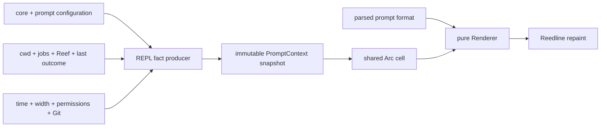
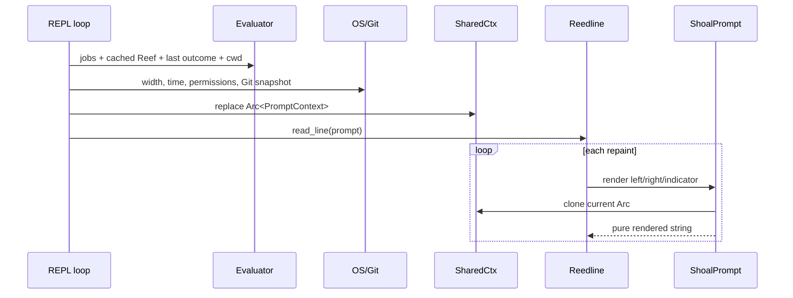
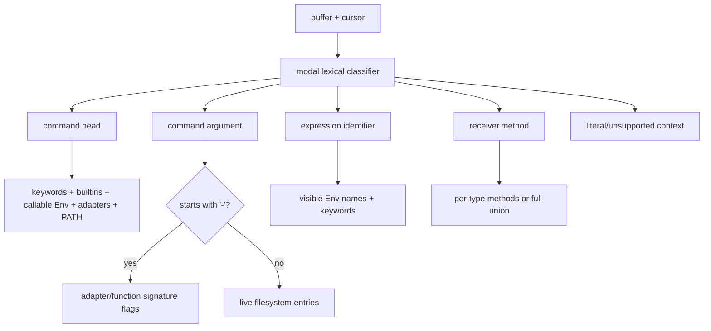
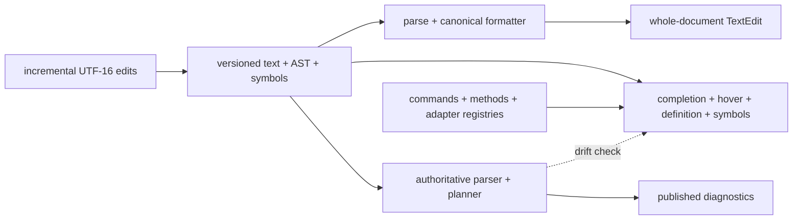

+++
title = "Prompt, editor, completion, picker, and LSP"
description = "The pure prompt renderer and host snapshot seam, Reedline editing stack, context-sensitive completion and highlighting, fuzzy picker, and deliberately lexical language server."
weight = 92
template = "docs/page.html"

[extra]
group = "Storage & tooling"
eyebrow = "Interactive tooling internals"
status = "Implemented core with explicit producer gaps"
audience = "Prompt, terminal UX, editor integration, and LSP contributors"
wide = true
+++

Shoal's interactive tooling has one strong architectural theme: fast presentation logic consumes
small snapshots, while filesystem discovery, process execution, and session mutation stay on the
host side. The prompt is the clearest realization of that rule. Completion and highlighting share
the live lexical environment but perform only bounded discovery. The LSP reuses syntax and
formatter libraries without embedding a full evaluator.

This chapter is the stable replacement for the prompt design notes previously cited from
`scratch/design-prompt.md`. Source comments should link here, to a narrower section when possible.

## Interactive stack at a glance



The pieces are related but have different latency contracts:

| Component | Trigger | I/O allowed? | State model |
|---|---|---:|---|
| prompt renderer | potentially every keystroke/repaint | no | frozen `PromptContext` |
| prompt context producer | once before each `read_line` | yes, bounded | evaluator + OS snapshot |
| completer | Tab/menu request | bounded filesystem/PATH scan | live `Env`, cached PATH dirs, live cwd cell |
| highlighter | buffer repaint | PATH/file metadata checks today | live `Env`, source buffer |
| validator | buffer submission decision | no | source buffer only |
| history adapter | line save/search | file-backed backend | previous recorded entry + filters |
| picker | explicit `.pick()` call | terminal event I/O | isolated modal `Model` |
| LSP | editor RPC | no evaluator/process execution | in-memory full documents |

## Prompt dependency rule

`shoal-prompt` is a domain-pure crate. It has no dependency on another `shoal-*` crate, performs no
filesystem I/O, and spawns no process. The binary owns the conversion from live session state into
the prompt crate's own snapshot types.


The type boundary prevents the prompt renderer from quietly adding a Git command or state lookup.
It does not prevent the producer from becoming slow; producer work is budgeted once per command,
outside the per-keystroke path.

## Prompt configuration layers

The rich prompt loader is intentionally more capable than `shoal-config::Prompt`. Lowest to highest
precedence:

1. `/etc/shoal/shoal.toml` `[prompt]`;
2. user `$XDG_CONFIG_HOME/shoal/shoal.toml` `[prompt]`;
3. user `$XDG_CONFIG_HOME/shoal/prompt.toml`, whose root is the prompt table;
4. the nearest ancestor `.shoal.toml` `[prompt]`, selected by `shoal_config::find_project_config`;
5. prompt-specific environment overrides.

After ordinary layers merge, the selected built-in theme is loaded underneath them and the layers
are replayed on top. Therefore a theme supplies defaults but never defeats a user setting.


Unlike core configuration, a prompt deserialization error does not stop shell startup. It warns and
falls back to all defaults. A missing optional file is silent; unreadable, non-regular, non-UTF-8,
oversized, or malformed files emit path-specific warnings and that layer is ignored. This is a
deliberate “a broken prompt must not break the shell” policy.

Prompt admission is bounded before merge: each source is at most 1 MiB, TOML depth is at most 64,
the merged graph is at most 16,384 nodes, strings are at most 64 KiB, and each of
`module.language` and `module.custom` retains at most 128 identities. At most 16 layers are
accepted, preserving the highest-precedence layers if an embedding caller supplies more. Prompt
environment values are capped at 64 KiB and only the five recognized names are copied from the
process environment. A rejected advisory layer remains visible as a warning while valid layers and
the built-in defaults remain usable.

### Environment controls

| Variable | Effect |
|---|---|
| `SHOAL_PROMPT_LEFT` | `format.left` |
| `SHOAL_PROMPT_RIGHT` | `format.right` |
| `SHOAL_PROMPT_THEME` | selected embedded theme |
| `SHOAL_PROMPT` | deprecated alias for left format; explicit `_LEFT` wins |
| `SHOAL_NERD_FONT` | `1` → `always`, `0` → `never`, otherwise literal mode |

Nerd-font `auto` detection checks, in order of a single boolean expression, `WEZTERM_PANE`,
`KITTY_WINDOW_ID`, `WT_SESSION`, then `SHOAL_NERD_FONT=1`. Unicode and nerd-font support are
separate: a nerd glyph is used only when both are true.

The producer's direct Git control reads are also bounded: worktree `.git` pointers and `HEAD` are
regular UTF-8 files of at most 8 KiB. A hostile control file degrades branch metadata instead of
allocating an unbounded buffer or breaking the shell.

### Legacy template migration

A prompt table containing `template` and no `format` is rewritten to `format.left`; `{cwd}` becomes
`$directory`. A table containing both emits a warning, drops `template`, and keeps the rich format.
This migration runs independently in the prompt host loader, not in `shoal-config`'s typed merge.

## PromptConfig shape

Top-level configuration is:

| Field | Default | Runtime role |
|---|---|---|
| `theme` | empty | optional embedded preset name |
| `nerd_font` | `auto` | `always`, `never`, or environment detection |
| `unicode` | `true` | select Unicode versus ASCII fallbacks |
| `right_prompt_on_last_line` | `false` | forwarded to Reedline |
| `format.left` | module-rich default | main left prompt |
| `format.right` | duration/jobs/time | main right prompt |
| `format.continuation` | `... ` | multiline continuation prompt |
| `format.transient` | `$character ` | post-submit replacement prompt |
| `transient.enabled` | `false` | install Reedline transient prompt |
| `budget.render_deadline_ms` | `5` | stop rendering later modules after elapsed budget |
| `budget.warn_on_exceed` | `true` | sample once per refreshed snapshot and enqueue a bounded warning on overrun |
| `style.*` | semantic palette | named style indirection |
| `module.*` | per-module defaults | visibility, symbols, format, style |

The default left format is:

```text
$directory$git_branch$git_status$git_state$reef$character
```

The default right format is:

```text
$cmd_duration $jobs $time
```

## Format mini-language

Format strings parse once during `Renderer::new` into a recursive token tree:

```rust
enum FormatToken {
    Literal { text, ws_only },
    Placeholder(String),
    Group { inner: Vec<FormatToken>, style: String },
}
```

Supported forms are:

- `$directory` for a module placeholder;
- `[text $module](cyan bold)` for a recursively parsed styled group;
- all other text as literal content.

Identifiers contain ASCII letters, digits, and underscore. A lone `$` is literal. A malformed or
unclosed style group degrades to literal `[` text rather than failing config load. Parsed placeholder
IDs are checked against static modules plus configured `language_<name>` and `custom_<name>` IDs.
Unknown IDs warn at renderer construction and render empty.

Whitespace-only literals adjacent to an empty module are dropped. This prevents formats such as
`$cmd_duration $jobs $time` from accumulating leading or double spaces as conditional modules hide.
Non-whitespace literals are never implicitly removed.


### Deadline behavior

Each side render starts an `Instant` and checks elapsed time before each placeholder. Once elapsed
time exceeds `render_deadline_ms`, remaining placeholders render empty; literal tokens still render.
This is a degradation budget, not preemption: one unexpectedly slow module can itself exceed the
deadline before later modules are skipped. Today modules are pure and small, so the main protection
is against future renderer regressions.

Between commands, the interactive host renders all three interactive sides once against the newly
refreshed snapshot and compares the slowest call with the configured deadline. When
`warn_on_exceed` is enabled, an overrun is sent through Reedline's bounded nonblocking notice
queue. Queue saturation never delays input; a later warning reports how many notices were
suppressed. This sampling does not add logging or mutable state to per-keystroke rendering. The
standalone `shoal prompt bench` command separately returns failure when measured p99 exceeds the
deadline.

## Style grammar

A style is a whitespace-separated set of attributes and colors:

- attributes: `bold`, `italic`, `underline`, `dim`/`dimmed`;
- foreground: standard/bright named color, integer ANSI-256 index, or `#rrggbb`;
- background: `bg:` followed by any supported color;
- `none`: explicit no-op.

Tokens are order-independent and the last foreground/background color wins. Unknown tokens are
ignored; a spec with no recognized token produces a startup warning. `Renderer::new` walks every
palette entry, fixed/dynamic module style, Leash tier style, and recursively nested format-group
style, then caches the parsed result. Per-keystroke rendering performs no style parsing or warning
side effects. `NO_COLOR` or an empty/plain style returns the original text without SGR escapes.

Palette names `ok`, `error`, `warn`, `info`, `muted`, and `accent` expand only when the **whole**
style spec equals that name. They are not macros inside a compound spec such as `muted bold`.

## Prompt module ledger

| Placeholder | Snapshot input | Visibility/format behavior | Wiring status |
|---|---|---|---|
| `character` | last outcome, edit mode, Unicode | success/error/Vi-normal-or-visual symbol | lock-free live Reedline mode bridge |
| `directory` | cwd, home, repo-relative path, read-only | home collapse; `start`/`middle`/`end` component truncation | active |
| `git_branch` | branch or detached SHA | symbol, truncation, template | active |
| `git_status` | counts/degraded flag | staged/worktree/untracked/conflict/stash/ahead/behind | one explicit bounded Git CLI reader |
| `git_state` | Git operation state | rebase/merge/cherry-pick/bisect/revert label | active |
| `cmd_duration` | last outcome duration | hides below `min_ms` | active |
| `exit_status` | status/signal/ok | optional success display | active, disabled by default |
| `jobs` | running/suspended/active total + bounded completed history | active total drives threshold; `${completed}` is history | active |
| `time` | local h:m:s | small `%H/%M/%S` formatter | active |
| `username` | session identity | root/SSH/show-always gate | active |
| `hostname` | session identity | SSH/show-always gate | active |
| `reef` | cached bindings | constrained by default; version shortened | active |
| `principal` | authenticated human/agent | symbols and optional agent name | kernel snapshot authority; standalone is local human |
| `leash` | actual authority tier/enforced | per-tier style/symbol | kernel policy/backend forecast or standalone detection |
| `battery` | optional battery snapshot | charging/low threshold | cached Linux/macOS host producer when enabled |
| `language_<name>` | matching Reef binding | exact constrained/resolved visibility | consumes Reef-owned discovery/cache state |
| `custom_<name>` | `Ready/Pending/Stale/Error` segment | ready/stale output only | bounded background producer with TTL cache |
| `indent` | none | empty reserved placeholder | active as no-op |

This split is crucial: renderer unit tests prove snapshot semantics, while kernel-backed producer
tests prove that authenticated agent/human authority reaches the real host. Renderer completeness
and end-to-end feature completeness remain different maturity claims.

### Trimmed schema and host-owned producers

The former `git_status.engine`, `language.probe_ttl_s`, and `PromptContext.multiline` fields were
removed instead of preserving choices with no consuming implementation. Git status has one honest
CLI-backed acquisition path. Language modules consume Reef-owned resolution/cache state and accept
only `constrained` or `resolved`. Reedline chooses the continuation side directly, so a duplicate
unused multiline bit was not a meaningful snapshot fact.

Directory truncation now implements all three advertised edge-selection modes. Battery sampling is
cached by the host when enabled. Trusted system/user configuration may also define custom modules,
while automatically discovered project config has its entire `module.custom` table removed before
merge. The interactive host owns two bounded workers, treats `command` as quoted argv rather than
shell source, gates it on one exact nonempty environment variable, enforces a 250 ms process-group
deadline and 4 KiB output cap, and publishes only sanitized snapshots to the pure renderer.

## PromptContext snapshot

`PromptContext` contains only owned or cheap-to-clone resolved values:

| Domain | Fields |
|---|---|
| terminal | width, no-color, nerd-font, Unicode, edit mode |
| location | cwd, home, read-only |
| prior command | outcome ok/status/signal/duration/head |
| session | jobs, principal, Leash tier/enforcement, user/host/SSH/root |
| time | local h:m:s |
| project | optional Git snapshot, Reef bindings |
| optional producers | battery and custom-segment map |

`PromptContext::empty` is both a safe pre-first-command value and a test/benchmark fixture baseline.
It does not perform discovery.

### Static facts

`StaticFacts::resolve` runs at interactive startup and captures:

- user and hostname;
- SSH presence and real-UID root status;
- Leash enforcement capability/status;
- home directory;
- `NO_COLOR`, Unicode, and nerd-font decision;
- standalone fallback principal (`Human`); kernel-backed authority is refreshed from the
  authenticated session snapshot.

These do not refresh during the process. Environment or enforcement changes after startup therefore
do not alter the prompt unless a future reload path reconstructs static facts.

### Per-command facts

Before every call to `Reedline::read_line`, the REPL builds a new context with:

- evaluator cwd and writability via `access(W_OK)`;
- last evaluator `it` when it is an `Outcome`;
- live evaluator job counts;
- evaluator's cached Reef prompt snapshot;
- local time;
- Git repository/branch/state/counts;
- current terminal width.

It swaps an `Arc<PromptContext>` under a short `RwLock`. Every Reedline prompt callback clones the
Arc and invokes only the pure renderer. A poisoned lock recovers its contained snapshot.



### Git acquisition

Repository discovery walks ancestors for `.git`, supporting both directories and worktree
`gitdir:` files. `HEAD` and in-progress operation markers are read directly. One
`git -C <cwd> status --porcelain=v2 --branch --show-stash` subprocess per context build supplies
ahead/behind, staged, unstaged, untracked, conflict, and stash counts. Failure leaves branch/state available, zeros
counts, and sets `degraded = true`—it never reports a failed status lookup as confidently clean.

`--show-stash` keeps stash truth inside the existing single-process budget; Shoal does not launch a
second `git stash` command. The former always-zero `GitSnapshot.age` field had no renderer consumer
or asynchronous cache behind it and was removed rather than preserving inert schema.

The Reedline adapter wraps the selected edit mode and publishes Emacs/Vi insert/normal/visual state
through a lock-free scalar before each paint; the pure renderer accepts that state as an overlay on
the frozen context. Kernel-backed contexts require an authenticated `authority` projection and use
its human/agent identity plus real Leash tier/enforcement forecast. Standalone mode is explicitly a
local-human evaluator. Battery and custom values are host-produced only when their modules are
configured.

## Reedline prompt adapter

`ShoalPrompt` maps Reedline callbacks to four sides:

- normal left → `Side::Left`;
- normal right → `Side::Right`;
- multiline indicator → `Side::Continuation`;
- transient instance left → `Side::Transient`, with empty right side.

The ordinary prompt indicator is always empty because `$character` owns the visible symbol. This
avoids double chevrons. History search retains a small Reedline-compatible textual indicator.
`right_prompt_on_last_line` is forwarded from configuration.

Transient mode installs a second `ShoalPrompt` sharing the renderer and snapshot cell; Reedline owns
the repaint timing.

## Prompt introspection commands

`shoal prompt` has three source-derived development surfaces:

| Command | Behavior |
|---|---|
| `prompt print --side …` | builds a live standalone context and prints one side |
| `prompt explain --side …` | lists top-level placeholders, plain output, per-module microseconds, total/budget |
| `prompt bench --side … --n N` | fixed rich fixture, warmup, p50/p99/max, nonzero result if p99 exceeds deadline |

`explain` only directly enumerates top-level placeholder tokens, not placeholders nested inside
style groups. The renderer still handles nested placeholders; this is an observability limitation.

## Validator and multiline decisions

`ShoalValidator` asks `shoal_syntax::parse` first. A complete modal AST submits immediately,
including command arguments ending in `/`; an `Incomplete` parse continues the line. Only a parse
error falls back to the host's bounded quote/comment/delimiter scanner, preserving tolerant editing
for malformed text without overriding a successful grammar decision.

The LSP diagnostics path uses `parse_status`, and the formatter requires a complete AST. The small
fallback scanner is deliberately recovery-only rather than a competing primary grammar.

## Completion architecture

`ShoalCompleter` holds an Arc-backed live `Env`, a mutable cwd cell, adapter catalogs/names, a
per-PATH-directory cache keyed by directory modification time, and match settings.

It classifies the cursor into five contexts without a full parse:



### Head completion

Candidate sources are parser reserved words, the canonical syntax builtin registry, callable live
bindings, adapter names, and executables scanned from process `PATH`. A PATH directory is rescanned
when its metadata modification time changes, and each scan takes at most 4,000 entries. Executable
permission is not checked; entries are names from PATH directories.

### Argument completion

A word beginning with `-` gets flags from the known adapter's top-level and every subcommand
signature, plus a matching closure's named parameters. The classifier does not yet narrow adapter
flags to the selected subcommand.

Other arguments list the relevant directory live. A prefix such as `crates/sho` resolves and scans
`crates/`; `~/` expands from `HOME`; directories receive a trailing slash; hidden entries appear
only when the file prefix itself starts with `.`.

### Expression and method completion

Expression completion returns visible bindings plus reserved words. Method completion recognizes a
trailing dot/optional-chain position and tries to infer the receiver type from:

- direct string, integer, float, size, duration, time, datetime, boolean, list, or record literals;
- a simple live binding's current `Value::type_name`.

Computed calls, chains, indexing, and unknown receiver forms fall back to the union of all method
names. This is deliberately conservative: uncertainty yields broader results rather than false
precision. The method registry still has known metadata/dispatch drift documented in
[Value method dispatch](@/internals/value-method-dispatch.md).

### Matching and result shaping

With fuzzy mode enabled, matching is a case-sensitive or folded non-contiguous subsequence test—not
edit-distance typo correction. Results sort lexically, deduplicate, truncate to `max_results`, and
replace exactly the detected word span. A directory suggestion suppresses appended whitespace.

When `completion.menu = false`, Reedline quick and partial completion are enabled. Multiple
candidates with no common prefix can still cause a popup because Reedline has no separate completer
transport outside its menu engine.

## Highlighter architecture

The highlighter approximates the parser's statement dispatch with the real modal lexer and live
binding knowledge. It tracks whether the next token is a command head and switches command tails to
`Mode::Cmd` so dotted executables, flags, paths, globs, redirects, and environment assignments retain
their actual command-token boundaries.

| Source category | Typical presentation |
|---|---|
| statement keyword | bold green |
| true/false/null | light cyan |
| resolvable command/callable | green |
| unresolved command head | bold red |
| variable/assignment identifier | light blue |
| number/size/duration | cyan |
| string | yellow |
| regex/operator | magenta family |
| path argument | underlined light blue |
| glob | light magenta |
| flag | cyan |
| redirect/background marker | dark gray |

Path-shaped heads (`/`, `./`, `../`, `~/`) are detected before expression tokenization to mirror
parser dispatch. A value-bound identifier at statement head is treated as an expression reference;
a callable binding is a valid command. Invoke-then-chain syntax colors the invoked head by command
resolvability while preserving expression tokenization for the chain.

An unterminated string is normal while typing, so lex failure paints the remaining text as a string
rather than signaling a broken highlighter. Other lexical failures degrade to default style.
`NO_COLOR` is checked lazily on each highlight call and removes all styling.

The highlighter currently searches process `PATH` with direct file checks for command validity on
the repaint path. Unlike the completer, it has no directory cache and does not consult Reef's
synthesized PATH or adapter catalogs directly. This is a latency and semantic-consistency seam worth
repairing.

## Keybinding and edit-mode architecture

The REPL starts from Reedline's default Emacs map or default Vi insert/normal maps. Tab is always
bound to completion-menu-or-next. Custom `[editor.keybindings]` entries overlay the defaults; in Vi
mode each custom binding is installed into both insert and normal maps because the schema has no
per-mode distinction.

Chord grammar is case-insensitive:

- zero or more `ctrl`/`control`, `alt`/`option`, `shift`, or
  `super`/`cmd`/`command`/`meta` modifiers;
- a named navigation/control key, a single character, or `fN`;
- a trailing dash convention lets `ctrl--` name Ctrl+`-`.

Supported actions cover history search/navigation, movement, screen clearing, menu navigation,
external editor, enter/submit, no-op, deletion/clear/cut, completion, undo, and redo. Reedline's
parameterized selection/motion commands are not expressible. Bad chord or action entries warn and
are skipped; they never prevent startup.

The configured Reedline edit mode is active and wrapped by the prompt's lock-free mode tracker.
Emacs and Vi insert/normal/visual state therefore reach `$character` before each paint without
mutating or cloning the frozen context.

## History adapter

Interactive history uses `FileBackedHistory` when enabled and a path can be resolved. Shoal wraps it
in `FilteredHistory` because Reedline does not supply the desired dedup/ignore semantics:

- `ignore_space` is delegated to Reedline's exclusion-prefix option;
- `dedup` prevents saving a line equal to the last recorded line, including the previous session's
  final line;
- each configured ignore pattern is matched by the host's small glob matcher before save;
- every other history operation delegates unchanged.

This line-editing history is distinct from the execution journal and from `shoal-history`'s command
surface. Their path/state semantics are mapped in [Persistence internals](@/internals/persistence.md).

## Picker architecture

`shoal-picker` is not part of Reedline completion. It is an explicit modal selector reached through
the evaluator-hosted `.pick(multi:, prompt:)` method.


Inputs normalize as follows: a list becomes its elements; a table becomes record values; a record
or scalar becomes a one-element candidate list. Display uses inline value rendering, with record
fields joined as `key: value` columns.

Fuzzy scoring works on Unicode grapheme clusters. A matched grapheme earns a base score, bonuses for
candidate start/word boundary and consecutive matches, and penalties for late position and longer
candidates. Results sort by descending score then original index, preserving stable ties. Selected
items retain their original `Value`, not the display string.

The picker requires both stdin and stdout terminals, enters raw mode and the alternate screen, hides
the cursor, and restores cursor/screen/raw mode in `Drop`. Key-release/repeat events are ignored; only
presses act. Single-select returns the highlighted candidate or null if none; multi-select returns a
list and uses toggled originals when any exist. Escape becomes a typed evaluator cancellation-style
custom error, while non-TTY use becomes an argument error.

Drawing uses a fixed-height viewport that follows row and page navigation through the complete
ranked result set. The cursor index and multi-selection identities remain global; scrolling changes
only the visible slice, so accepting after several page moves still returns the original value.

## LSP architecture

`shoal-lsp` is a Tokio/tower-lsp stdio server. It stores versioned document text, AST,
diagnostics, and scoped symbols. The advertised capabilities are incremental sync, formatting,
completion, hover, goto definition, and document symbols.

Tower-lsp's private codec sits behind Shoal's bounded transport pump: at most 16 KiB/64 headers and
a 32 MiB JSON body reach it. The body allowance covers worst-case escaping of a 4 MiB document;
accepted bodies stream through a 64 KiB pipe instead of being copied by the pump. Malformed,
duplicate/missing-length, over-limit, or truncated frames close stdin processing with a constant
error and never echo body content.



### Diagnostics

Parse failures publish syntax diagnostics. Successfully parsed documents also receive
side-effect-free planner diagnostics such as opaque effects. Analysis runs on a blocking worker and
is installed only when both version and text still match, so stale work cannot overwrite newer
edits. There is still no type, adapter-version, Reef-project, or full name-resolution diagnostic.

### Formatting

Formatting proceeds only for `ParseStatus::Complete`. It returns one edit replacing the entire
document with `format_program(ast)`. Incomplete/error documents return no edit. Formatting options
from the client are ignored.

### Completion

The LSP vocabulary combines:

- parser reserved words;
- extra parser statement forms `with`, `spawn`, and `sh`;
- the canonical syntax builtin-name registry;
- parser-derived symbols visible at the cursor.

Symbol discovery walks the AST for bindings (including nested patterns), functions, parameters,
aliases, and nested scopes. Visibility and shadowing follow source order and lexical ranges.
Completion replaces the exact identifier span and carries symbol kinds, resolution detail, and
function docs where available. It remains type-unaware and has no methods, fields, adapter flags,
filesystem paths, or workspace index.

### Hover

Hover resolves visible user declarations and their docs/details first, then static language help and
canonical command-source information. It does not infer value types/methods or perform a workspace
symbol search.

### Definition and document symbols

Goto definition follows scope-aware local declarations. For a direct file `use`, it can open the
module path and resolve an exported member; this is intentionally narrower than a project/module
graph. Document symbols expose the same AST-derived declarations and nesting. References, rename,
workspace symbols, and semantic tokens are not advertised.

### Position conversion

LSP character positions count UTF-16 code units. Incremental changes validate exact line/range
boundaries and optional `range_length`, reject positions inside surrogate pairs, and apply multiple
changes sequentially. Internal spans remain UTF-8 bytes and are converted back to LSP positions.

### Concurrency and lifecycle

Open/change stages a pending version, then enters a 4-worker analysis scheduler with at most 64 URI
jobs and 32 MiB of active/pending source clones. Repeated changes for one URI replace its single
pending job with the latest arrival. Budget rejection is logged, blocking-worker panic releases its
permit, and results publish only when version and text still match; older work cannot install over a
new edit. Close discards pending analysis, removes the document, and clears diagnostics. Symbol and
completion projections are capped at 1,024 entries and diagnostics at 256. Shutdown has no persisted
index because there is no workspace database.

## Shared semantic drift risks

The parser, REPL validator, completion classifier, highlighter dispatcher, and LSP symbol analysis
still answer related syntax questions at different fidelity:


The builtin list and LSP AST are shared sources of truth, which are strong anti-drift improvements.
Statement dispatch, incompleteness, and some cursor classification remain separate. Changes to
path-head rules, statement forms, optional chaining, literals, or callable dispatch still require a
deliberate audit across consumers.

## Maturity and risk matrix

| Area | Renderer/unit evidence | Host/integration evidence | Maturity |
|---|---|---|---|
| pure format parse/render/style | extensive parser/module/parity tests | live Reedline adapter | strong |
| prompt latency | speed test + Criterion bench + CLI bench | context producer cost not fully gated | strong render, medium end-to-end |
| Git prompt | parser/reader tests | once-per-command producer tests | implemented with deliberate stash gap |
| jobs/Reef prompt | renderer tests | evaluator mapping tests | implemented |
| custom prompt | renderer + scheduler admission/cache tests | real config → bounded worker → CLI/render integration | implemented, host-side only |
| battery prompt | renderer + platform parser tests | cached Linux/macOS producer | implemented when enabled |
| Vi/principal/Leash prompt | renderer + tracker/projection tests | live editor state and authenticated kernel authority | implemented |
| completion | large context/matching/cache test set | Reedline composition | strong heuristic implementation |
| highlighting | broad token/dispatch tests | environment-sensitive color tests | implemented; PATH repaint cost |
| keybindings | chord/action/tracked-mode tests | edit-mode construction and live prompt bridge | implemented |
| picker | pure model/scoring/Unicode/viewport tests | terminal loop has no pseudo-TTY integration | implemented; restoration integration proof remains thin |
| LSP | AST scope/definition/incremental/diagnostic unit tests | no editor protocol integration suite | useful local semantic baseline |

## Prioritized improvements

1. **Keep prompt schema tied to real owners.** New fields need a consuming host path and producer
   tests before being advertised; do not reintroduce speculative engine/probe toggles.
2. **Move command-resolution checks out of repaint.** Share the completer's cache or a host command
   index with highlighting, including Reef and adapters.
3. **Add picker pseudo-TTY restoration/cancellation tests** across accept, cancel, read failure, and panic unwinding.
7. **Build a syntax-service layer** for incomplete-state, cursor context, declarations, symbols, and
   docs so REPL and LSP stop hand-copying grammar decisions.
8. **Extend the scoped LSP into a workspace graph** for references/rename and add type/method hover
   from executable registries.

## Change checklist

When changing interactive syntax or state:

- parser grammar and `ParseStatus` remain authoritative;
- update REPL validator behavior for new incomplete forms;
- update completer cursor classification and receiver inference;
- update highlighter statement dispatch and CMD-tail tokens;
- update LSP vocabulary/declaration/hover behavior or document the deliberate gap;
- reuse the builtin and method registries rather than adding a word list;
- add both pure tests and a host-wiring test where a producer is involved;
- keep prompt renderer code free of I/O and subprocess APIs;
- measure the producer and renderer separately;
- mark schema fields scaffolded until real host state reaches them.

## Source navigation

| Concern | Primary source |
|---|---|
| rich prompt config/defaults/themes | `crates/shoal-prompt/src/config/`, `themes/` |
| prompt snapshot types | `crates/shoal-prompt/src/context.rs` |
| format grammar | `crates/shoal-prompt/src/format.rs` |
| style grammar | `crates/shoal-prompt/src/style.rs` |
| pure renderer/modules | `crates/shoal-prompt/src/render/` |
| host config/context/Reedline prompt | `crates/shoal/src/prompt.rs` |
| REPL editor composition/history/validator | `crates/shoal/src/repl.rs` |
| completion | `crates/shoal/src/completer.rs` |
| highlighting | `crates/shoal/src/highlight.rs` |
| keybinding parser | `crates/shoal/src/keybindings.rs` |
| fuzzy picker | `crates/shoal-picker/src/lib.rs`, `crates/shoal-eval/src/call.rs` |
| language server | `crates/shoal-lsp/src/lib.rs`, `main.rs` |
