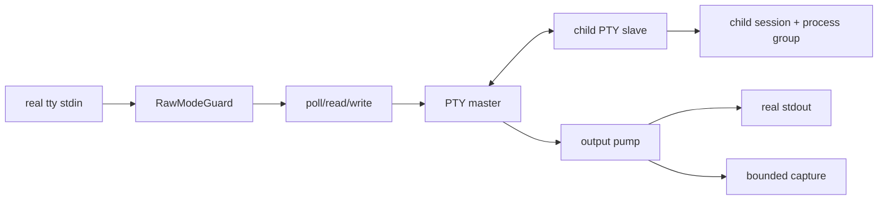
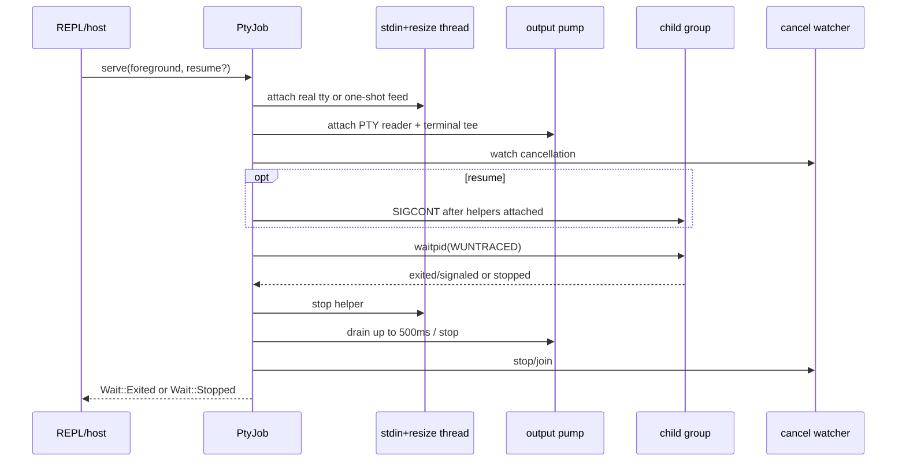
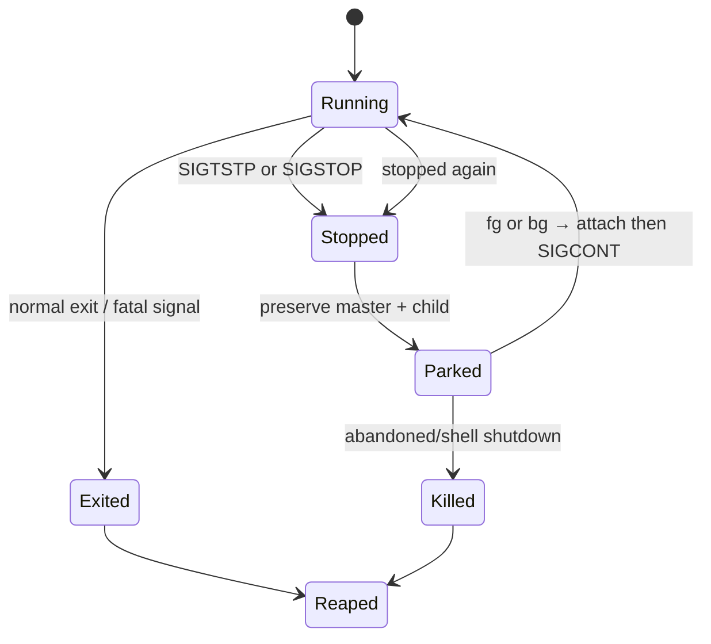
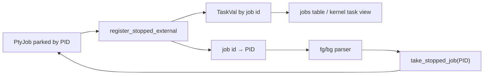
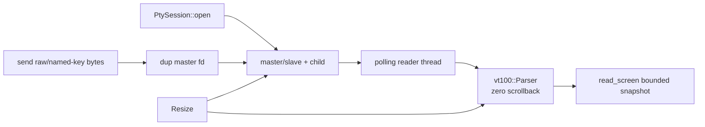

+++
title = "PTYs, terminal sessions, and job control"
description = "Human PTY tee mechanics, raw-mode handoff, stop/park/resume lifecycle, evaluator job bridging, agent screen sessions, key encoding, and cleanup invariants."
weight = 52
template = "docs/page.html"

[extra]
group = "Execution & security"
eyebrow = "Execution book"
status = "Terminal and job-control state machines"
audience = "REPL, execution, kernel PTY, and task contributors"
wide = true
+++

Shoal has two related PTY mechanisms with different consumers:

- `ExecMode::PtyTee` temporarily hands a human's real terminal to one foreground command by raw
  forwarding, tees output, and supports Ctrl-Z/`fg`/`bg`;
- `PtySession` is a long-lived caller-driven PTY with a bounded VT100 screen, used by kernel/MCP
  methods rather than a local stdin/stdout passthrough.

Both create a child as session/process-group leader, retain the PTY master, reap explicitly, and kill
the whole group on abandonment. They do not share one runtime object or registry.

Sources: [`pty.rs`](https://github.com/alliecatowo/shoal/blob/main/crates/shoal-exec/src/pty.rs),
[`pty_session.rs`](https://github.com/alliecatowo/shoal/blob/main/crates/shoal-exec/src/pty_session.rs),
and the REPL bridge in
[`repl.rs`](https://github.com/alliecatowo/shoal/blob/main/crates/shoal/src/repl.rs).

## Why PTY position matters

Statement-position interactive commands need terminal semantics: line discipline, TTY detection,
full-screen applications, control keys, and window size. Value-position commands need separate
stdout/stderr pipes and composable captured bytes. `ExecMode` chooses mechanism after the evaluator
determines expression position.

| Concern | Capture | `PtyTee` |
|---|---|---|
| controlling terminal | none | child PTY slave |
| stdout/stderr | separate pipes | merged terminal byte stream |
| real stdout | not streamed by exec | raw passthrough when real stdout is TTY |
| real stdin | per `StdinSpec` | forwarded in raw mode for inherited foreground input |
| resize | no | real tty size propagated to child PTY |
| stop observation | no | `waitpid(..., WUNTRACED)` |
| returned capture | bounded stdout + stderr | bounded merged tee, stderr empty |
| disk spill | optional stdout | never |

## Terminal handoff model

The child is session leader on **its own** PTY. It is not in the real terminal's session, so classic
`tcsetpgrp(real_tty, child_pgid)` handoff would fail. Shoal's effective handoff is:

1. put real stdin into raw mode;
2. forward its bytes into the PTY master;
3. pass child PTY output through to real stdout;
4. restore original termios when the serve stint ends.

`RawModeGuard` stores original termios and restores it in `Drop`, including panic unwinding. If stdin
is not a TTY or termios setup fails, no guard is created and the command still has a PTY; host input
forwarding is simply absent.

The REPL installs caught no-op handlers for `SIGTSTP`, `SIGTTOU`, and `SIGTTIN`. Caught dispositions
reset to default across exec, so children remain stoppable. Using `SIG_IGN` would leak ignore
semantics into exec'd programs and break Ctrl-Z.

## PTY file-descriptor ownership

The `MasterPty` stays in `PtyJob`. Helper threads receive plain `dup` file descriptors. This is
deliberate:

- retaining the master keeps the slave alive across a stopped job;
- a duplicate can be dropped without moving/destroying job ownership;
- `portable-pty`'s writer has drop-time VEOF/newline behavior that could inject stray output;
- stop teardown can end poll-based helpers while leaving the PTY available for resume.

The child handle is retained only for lifetime ownership; Shoal reaps with its own `waitpid` calls.
Dropping a standard child handle would neither wait nor kill.

## Foreground serve lifecycle

One `PtyJob::serve` represents an initial foreground run or a resume stint.

Attaching output before `SIGCONT` avoids a resume-output gap. Inherited TTY forwarding reattaches on
every foreground stint. Byte/file stdin is one-shot: `pending_feed.take()` consumes it on the first
serve.

The input helper polls every 50 ms so it notices teardown without stealing the next keystroke meant
for the shell. It checks real tty window size approximately every 200 ms and writes changes to the
PTY with `TIOCSWINSZ`.

## Output pump and truncation

The pump polls the PTY master, treats EOF and `EIO` as slave closure, copies bytes to real stdout
when appropriate, and appends a prefix to an in-memory tee under a mutex. The tee uses the global
capture hard cap. Bytes beyond the cap still reach the terminal but set `tee_truncated`.

After reap/stop, serve grants 500 ms for the pump to drain. A descendant may keep the slave open; if
the pump does not finish, the prompt is not held indefinitely. The helper exits once it next observes
an idle poll plus the serve-done flag.

PTY stderr is terminal-merged and `ExecResult.stderr` is empty. A terminal result never has a disk
spill: statement output already reached the display, and the tee is a bounded convenience.

`Outcome.streamed` tells the evaluator/host not to render those captured bytes again. Losing that bit
creates duplicate terminal output.

## Stop versus exit

`waitpid_untraced` retries `EINTR` and returns on termination or stop. A stop is not decoded as an
exit/signal and does not reap the child.

A stopped result has `status = None`, `signal = None`, `stopped = true`, and a clone of tee bytes so
later resume can keep appending. A terminal result takes the accumulated tee, decodes status/signal,
and marks the job reaped.

## Parked job registry

Stopped `PtyJob`s enter the process-global `Mutex<VecDeque<PtyJob>>`, keyed operationally by PID.
`take_stopped_job(pid)` removes one for exclusive resume. `shutdown_stopped_jobs` clears the queue;
each dropped job continues then kills/reaps its group.

The registry is process-global because the local shell assumes one controlling terminal. This does
not naturally model multiple independent interactive REPL sessions in one process.

`PtyJob::Drop` calls continue-then-kill and blocking reap unless already reaped. Sending `SIGCONT`
first ensures a stopped process can act on the subsequent kill.

## Evaluator job-table bridge

The evaluator separately stores `TaskVal` rows and a task-id-to-child-PID map. When an external
foreground command returns `stopped = true`, it:

1. creates a task with the command description;
2. installs suspend/resume hooks targeting the child PGID;
3. marks the task suspended without sending another stop;
4. stores task id to PID;
5. arms a one-shot pending stop notice.

This is a distributed lifecycle: execution owns the live PTY; evaluator owns listing and task hooks;
REPL owns `fg`/`bg` syntax and the transition coordination.

## Local `fg`/`bg` syntax

The REPL recognizes only:

- bare `fg`/`bg`, selecting the greatest currently suspended external job id;
- `fg N`, `bg N`, `fg %N`, or `bg %N`.

It deliberately does not capture `fg name`, `fgrep`, `bg-tool`, or assignments. `fg <identifier>` is
a different host rewrite for language `TaskVal`: it becomes `<name>.resume(); <name>.await()` rather
than operating on the parked PTY registry.

### Foreground resume

The host removes the parked job, prints its command, marks the evaluator row running, and calls
`resume_foreground`. Completion marks the task done/removes the PID map. A second Ctrl-Z re-parks the
same PTY and marks the row suspended again.

### Background resume

The host marks the row running, prints a background notice, and calls `resume_background`. A detached
thread attaches an output pump, does not forward stdin, and uses a fresh never-cancelled token so
foreground Ctrl-C does not kill it. If it stops again, it is re-parked.

Current limitation: background completion does not update the evaluator task row. It can remain
shown as running until session shutdown or another host path retires it. This is a cross-thread
lifecycle gap, not merely stale rendering.

## Task lifecycle versus external jobs

`TaskVal` has independent done/cancel/suspend state and hooks. Spawned language tasks and stopped
external PTYs share the `jobs` table shape but do not share one execution mechanism. External task
hooks signal PGIDs. A generic spawned task may only have a cancellation token or other hooks.

Kernel `task.suspend`/`task.resume` availability must be read against the actual session/handler
implementation: the local evaluator has methods, while some kernel paths intentionally report task
control unavailable. Do not infer RPC support from `TaskVal` alone.

## Long-lived `PtySession`

`PtySession` is for programmatic terminal control. `PtyOpenSpec` carries argv, cwd, complete env,
initial dimensions, and optional sandbox. Dimensions clamp to 1..1000; defaults exposed to callers
are 80×24. If no `TERM` is supplied, the open path injects a usable terminal type.

The emulator has zero scrollback. Memory and read payload are bounded by the visible grid. Output
that scrolls away is not retained as a transcript.

## Screen snapshot contract

`read_screen` returns:

| Field | Contract |
|---|---|
| `cols`, `rows` | current clamped grid |
| cursor row/column | zero-based position |
| `cursor_hidden` | program's VT cursor visibility |
| `rows_text` | exactly one plain row string per grid row; no ANSI/newlines |
| `changed` | rendered-content hash differs from previous read |
| `alive` | child not yet reaped |
| `exit_status`, `exit_signal` | terminal result once reaped |
| `pid` | child/process-group id |

`changed` hashes screen contents, not raw input bytes. An escape query or byte sequence that does not
alter the visible grid does not set it. Resize clears the last hash so the next read reports change.

`read_screen` opportunistically reaps after the reader observes EOF. `alive()` also reaps but
deliberately does not read/hash the screen, so listing sessions does not consume a pending `changed`
signal.

There is no push subscription for screen changes; kernel/MCP clients poll.

## Sending and resizing

`send` writes raw bytes and flushes. Protocol callers can also use `named_key`:

| Family | Accepted names |
|---|---|
| control | Enter/Return/CR, newline/LF, Tab, Backtab, Escape, Backspace, Space |
| navigation | arrows, Home, End, PageUp/PageDown, Insert, Delete |
| function | F1 through F12 |
| control chords | `Ctrl-A`..`Ctrl-Z`, `C-X`, punctuation controls, Ctrl-Space |

Names are largely case-insensitive, while control-prefix parsing accepts specified prefix spellings.
Unknown names return `None`; the kernel should reject rather than silently send text.

Resize clamps dimensions, updates the kernel PTY winsize, resizes the emulator, and forces next-read
change. Pixel dimensions are zero in programmatic resize.

## Session close and drop

`close` is idempotent. It requests reader teardown; if child is still live, sends `SIGCONT` then
`SIGKILL` to the group, waits/reaps, records status/signal, and joins the reader. `Drop` calls the same
termination path, so removing an abandoned kernel PTY cannot orphan the process.

The reader polls every 50 ms, feeds bytes into a mutex-protected VT100 parser, and treats EOF/EIO as
child stream end. A descendant holding the slave can keep `child_exited` false after the immediate
process changes state; this is terminal-stream liveness rather than perfect process-tree census.

## Two PTY systems: do not conflate them

| Property | Human `PtyJob` | Agent `PtySession` |
|---|---|---|
| registry | process-global stopped queue + evaluator map | kernel-owned session map |
| display | raw passthrough | rendered VT100 grid |
| input | real stdin forward | explicit send calls |
| stop/resume | WUNTRACED, fg/bg | no equivalent stop lifecycle API |
| output history | bounded tee prefix | current grid only |
| cancellation | token escalation per serve | close/drop hard kill |
| change observation | terminal bytes already displayed | polling `changed` snapshot |

A refactor can share low-level PTY helpers, but forcing them into one state object would blur
different ownership and output contracts.

## Change protocol

1. preserve process-group ownership and explicit reap on every path;
2. never move/drop the only PTY master while a stopped child must resume;
3. restore termios with RAII and test panic/error exits;
4. attach pumps before `SIGCONT` and bound helper teardown;
5. distinguish stop from exit/signal in result and job state;
6. update parked registry, evaluator task map, and REPL transition together;
7. keep terminal passthrough separate from bounded capture/truncation;
8. clamp agent-controlled dimensions and keep screen payload bounded;
9. test real Ctrl-Z/continue/re-stop, shell shutdown, missing parked resource, background completion,
   resize, named keys, screen change hashing, and drop cleanup;
10. document whether a new API exposes raw terminal history, visible screen, or both.

## Known sharp edges

- Job control is Unix/process-global and assumes one local controlling terminal.
- Background completion does not retire the evaluator row.
- A pump missing its 500 ms drain grace may outlive the serve briefly.
- PTY tee only retains a bounded prefix and never spills.
- Programmatic sessions retain no scrollback and expose no push change subscription.
- Task and PTY registries are separate, so partial transition failures create stale rows/resources.
- Long-lived `PtySession` close is hard-kill rather than graceful INT/TERM escalation.
- Real terminal handoff is raw byte forwarding, not classic controlling-terminal process-group transfer;
  code copied from a conventional shell may be invalid in this model.
