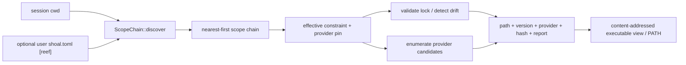
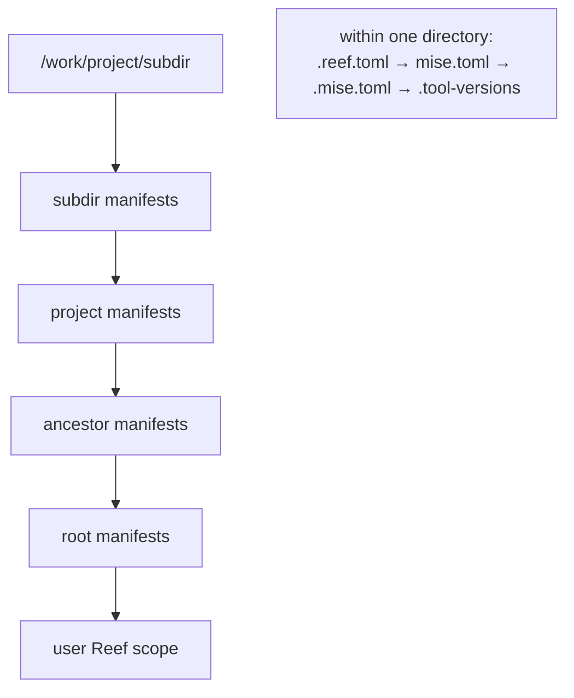
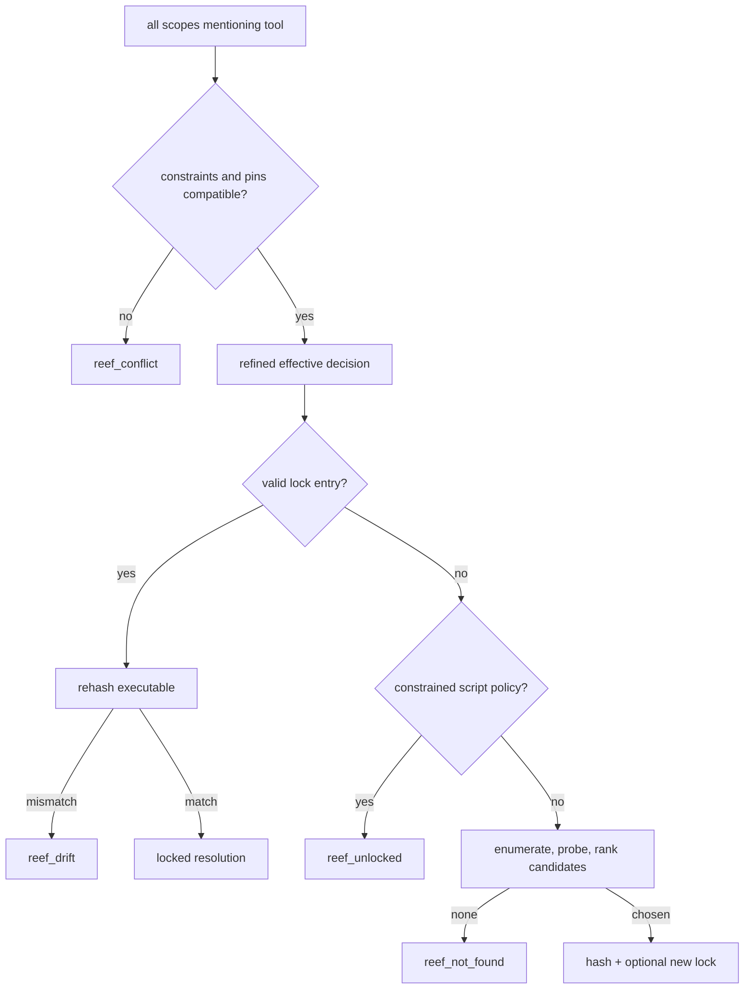
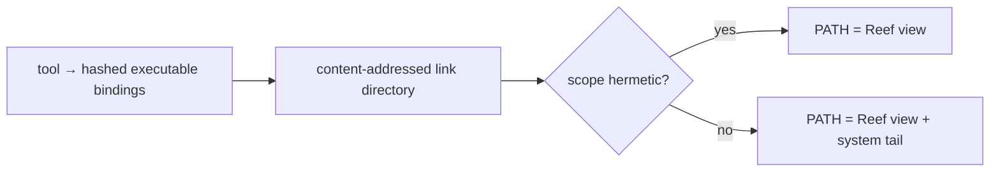
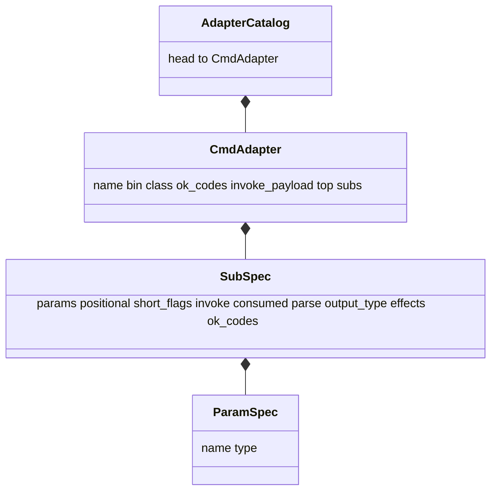
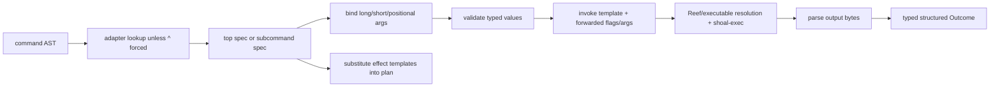
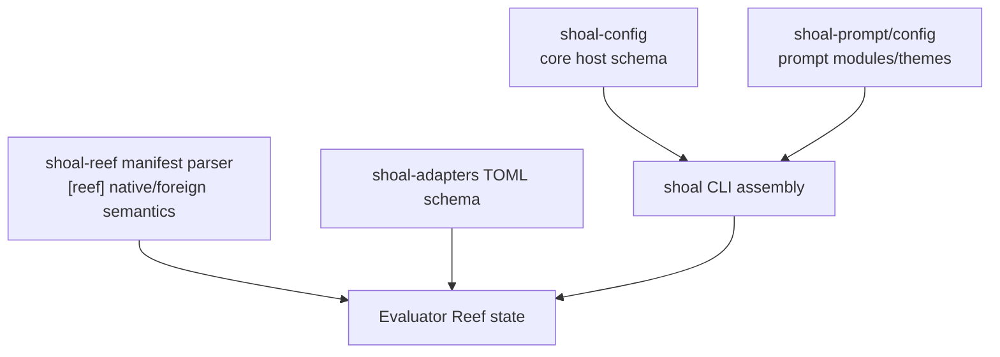

+++
title = "Reef, adapters, and configuration"
description = "Project-scoped tool resolution, lock and drift semantics, executable views, polyglot runners, declarative CLI adapters, and their host integration."
weight = 90
template = "docs/page.html"

[extra]
group = "Language & runtime"
eyebrow = "Integration architecture"
status = "Tool and configuration substrate"
audience = "Reef, adapter, and configuration contributors"
wide = true
+++

Three related systems shape an external command without being the command runner itself:

- configuration layers assemble host options, aliases, env, and adapter paths;
- adapters turn known CLIs into typed calls and structured outcomes;
- Reef selects a reproducible executable and polyglot script runner for the current project scope.

They meet in `shoal-eval`, but retain independent schemas and lifecycles.

## Reef is resolution, not activation

Reef never runs shell hooks or globally mutates environment on `cd`. It discovers an ordered scope
chain and resolves each tool request against constraints, providers, and a lock. A changed `cwd`
changes what the next resolution sees.



Sources: [`shoal-reef`](https://github.com/alliecatowo/shoal/tree/main/crates/shoal-reef/src) and
[`shoal-eval` Reef integration](https://github.com/alliecatowo/shoal/tree/main/crates/shoal-eval/src).

## Scope discovery and precedence

Starting at `cwd` and walking to filesystem root, each directory is checked in this order:

1. `.reef.toml`;
2. `mise.toml`;
3. `.mise.toml`;
4. `.tool-versions`.

The resulting chain is nearest-first. Native Reef precedes foreign formats in the same directory.
The optional user `[reef]` scope is appended last, so project scopes win. A scope's cache identity is
its manifest path plus modification time.



`ScopeChain::discover` silently skips unreadable or malformed native/foreign manifests. Direct parse
APIs return errors, but normal discovery can therefore hide a typo and fall through to another scope
or ambient tool. This best-effort behavior is a usability choice and a diagnostic risk; doctor/
explain paths should surface skipped files if discovery becomes security-sensitive.

Discovery also skips a manifest when its parsed `manifest.tools` map is empty. A manifest containing
only runner declarations or Reef options therefore does **not** participate in the scope chain today;
its runners/options cannot take effect through normal discovery. This behavior is in `scope.rs` and
should be treated as an implementation gap until a test-backed scope-identity rule replaces it.

Runner tables merge in the opposite traversal order—farthest first, then nearer overlays—so the
nearest declaration wins. Hermetic intent is true if any active scope requests it.

## Constraint and provider resolution

The nearest mentioning scope supplies the base constraint. Farther mentions must be compatible and
refine it; conflicting constraints or different provider pins raise `reef_conflict`.

Default provider precedence is:

```text
npm-local → venv → mise → cargo → system
```

Scoped providers win ties over global/ambient providers. Candidates are version-probed with a bounded
timeout, filtered by constraints/provider pin, ranked by highest satisfying version, then provider
precedence and path.



Interactive resolution may auto-lock a constrained miss and emits a notice. Script policy refuses to
guess and asks the user to lock first. Unconstrained ambient commands can resolve without creating a
lock.

## Lock and drift semantics

A lock entry records tool name, version, provider, path, BLAKE3 hash, and resolution time. It must
still satisfy the current effective constraint and provider pin. Use of a valid-looking entry
rehashes the executable; mismatch is `reef_drift`, not an automatic silent refresh.

The hash cache avoids repeated content hashing based on file identity metadata. That is a performance
boundary: changes that preserve the cache identity could conceal drift. When strengthening it,
measure the cost on frequently resolved commands and retain explicit invalidation tests.

Locks live beside the applicable manifest. The evaluator caches scope/resolver state and invalidates
through the chain key rather than modifying global process PATH.

## Executable view and hermetic PATH

Reef builds a content-addressed directory of links to resolved executables. That view becomes the
front of a child PATH. Non-hermetic scopes retain the ambient system tail; hermetic scopes omit it so
only resolved tools appear.



Reef hermetic PATH and Leash hermetic OS enforcement are complementary. The first controls executable
resolution; the second refuses a spawn when requested containment dimensions cannot be enforced.

## Polyglot runners

Runner selection checks extension first, then reads only the first line for a shebang. Defaults are:

| Extension | Invocation |
|---|---|
| `.py` | `python <script>` |
| `.js` | `node <script>` |
| `.ts` | `deno run <script>` |
| `.sh` | `sh <script>` |
| `.shl` | Shoal itself |
| `.rb` | `ruby <script>` |
| `.lua` | `lua <script>` |

There is intentionally no `.rs` default because compile-versus-script intent is ambiguous. A
shebang such as `#!/usr/bin/env python3` becomes a bare `python3` tool invocation. The runner's tool
is then resolved through Reef like any other tool.

## Adapter schema and call path

An adapter catalog maps a command head to a binary, class, success codes, top-level/subcommand
specifications, parameters, flag aliases, invocation templates, parser, output type, and effects.



Classes are CLI, TUI, daemon, and interpreter. Interpreter adapters can declare whether a raw block
body travels as one argument or stdin. As noted in the language-engine page, parser recognition of
block heads is currently static and is not dynamically driven by catalog contents.



Supported parsers include JSON, NDJSON, CSV, TSV, lines, key/value, fixed columns, headerless TSV,
NUL-separated records, and Git porcelain v2. Output type declarations are validated after parsing.

### The consumed-parameter invariant

Some invocation templates pin a machine-readable output format. A user-facing flag that would
override that format remains recognized but must be listed as `consumed`, preventing it from being
forwarded. Otherwise the child emits one format while Shoal applies another parser—silent structured
data corruption. Tests should pair every pinned format with conflicting long and short flag cases.

## Catalog layering

Directory files are sorted before loading. Malformed files/commands produce warnings while valid
siblings survive. A later duplicate command wins and warns. The local host loads the bundled pack and
configured extra directories; completion scans the same relevant names.

The kernel session factory currently does not load those catalogs, so agent/kernel adapter behavior
does not match the local CLI by default. Fixing parity should extract a shared host-assembly function
instead of copying the REPL sequence into session creation.

## Configuration boundaries



Core config treats `[reef.tools]` and `[reef.runners]` as opaque tables so Reef can own their schema.
Prompt config is separately layered/validated. Adapter specs are not core config keys; core config
only lists extra adapter directories. This separation avoids dependency cycles but creates a need for
cross-system diagnostics and provenance views.

## Change checklist

- Does scope precedence remain nearest-first, with native before foreign and user last?
- Does a constraint conflict fail rather than silently choose one scope?
- Does script policy refuse a constrained unlocked tool?
- Does every locked use re-check constraint, provider pin, and content drift?
- Does hermetic PATH omit the ambient tail, and is OS enforcement reported separately?
- Does an adapter's output parser match the exact argv format after every allowed flag?
- Are effects declared for adapter operations before they reach execution?
- Are catalog load order and duplicate warnings deterministic?
- Has the change been tested in both local CLI and kernel host assembly?
