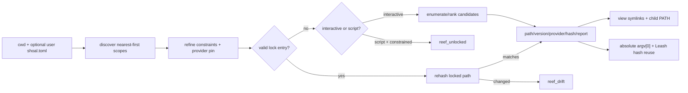
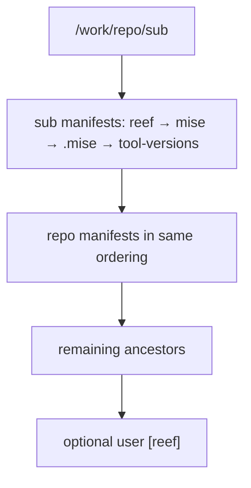
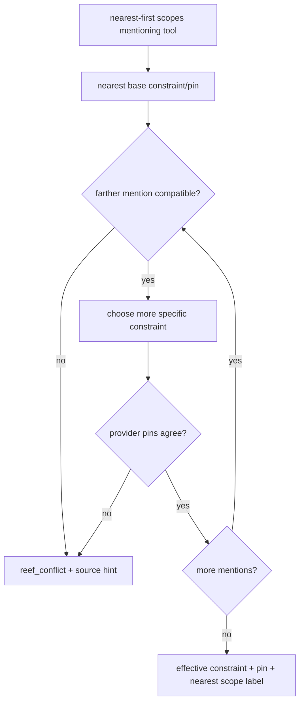
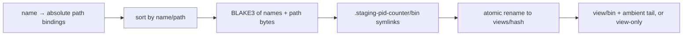

+++
title = "Reef resolution, locks, providers, and executable views"
description = "The complete source-derived path from scoped manifests through constraint refinement, provider ranking, lock/hash validation, PATH synthesis, runners, and evaluator integration."
weight = 93
template = "docs/page.html"

[extra]
group = "Storage & tooling"
eyebrow = "Reproducible tool resolution"
status = "Implemented with cache and discovery gaps"
audience = "Reef, execution, Leash, prompt, and tooling contributors"
wide = true
+++

Reef turns a command name into an explicit executable binding. It does not activate an environment,
run directory hooks, or mutate the session's `PATH` when cwd changes. Resolution happens at a
constrained spawn or an explicit Reef command, and only the child's environment receives a
synthesized view.



## Crate/module ownership

| Module | Owns |
|---|---|
| `manifest.rs` | native/user/foreign manifest parsing |
| `scope.rs` | ancestor discovery, ordering, runner merge, hermetic aggregation |
| `version.rs` | lenient version/constraint parsing, compatibility, ordering |
| `provider/` | candidate discovery, version probes, optional fetch |
| `resolve.rs` | effective decision, lock policy, candidate ranking, resolution report |
| `lock.rs` | `reef.lock` serialization and persistence |
| `hashcache.rs` | BLAKE3 identity cache |
| `view.rs` | stable binding-set view directories and synthesized PATH |
| `runner.rs` | extension/shebang to tool invocation |
| `report.rs` | source-chain explanation records |
| `error.rs` | stable Reef error taxonomy |
| evaluator `reef_resolve.rs` | caching, overrides, spawn hook, lock/view integration |
| evaluator `reef_builtins.rs` | `which` and `reef` user commands |
| evaluator `reef.rs` | prompt snapshot and script-runner selection |

## Manifest model

A normalized `ReefManifest` contains:

- ordered tool name → `ToolReq { constraint, provider? }`;
- extension → runner invocation;
- one `hermetic` boolean.

Native tool entries accept a constraint string or table with optional `version` and `provider`.
Runner entries accept a tool string or `{tool,args}`. Unknown TOML keys are ignored by Serde; there
is no unknown-key warning layer inside `shoal-reef`.

```toml
[tools]
node = "22"
python = { version = "3.12", provider = "mise" }
rg = "*"

[runners]
py = "python"
ts = { tool = "deno", args = ["run"] }

[options]
hermetic = true
```

Foreign adapters are read-only:

| File | Imported data | Ignored data |
|---|---|---|
| `mise.toml`, `.mise.toml` | `[tools]` string, first array entry, or table `version` | runners, provider pins, options, other mise semantics |
| `.tool-versions` | first version token on each non-comment line | fallbacks after first token and plugin-specific semantics |
| user `shoal.toml` | `[reef]` native shape | all other host config |

Parsing APIs return a `ManifestError`; normal scope discovery silently skips unreadable or malformed
files. `reef doctor` has extra checks for local malformed manifests, but ordinary spawn discovery can
fall through without surfacing the typo.

## Scope discovery

Starting at cwd and walking to filesystem root, each directory is checked in this order:

1. `.reef.toml`;
2. `mise.toml`;
3. `.mise.toml`;
4. `.tool-versions`.

Every accepted scope is appended nearest first. Native Reef therefore wins over foreign formats in
the same directory. The optional user `[reef]` scope is appended last.



There is no Git/home boundary and no “nearest manifest only” rule: all accepted scopes participate
in compatibility checking. This differs from `shoal-config`'s single nearest `.shoal.toml`.

### Empty-tools discovery bug

`collect_dir` and user-scope discovery only retain a manifest when `manifest.tools` is nonempty. A
manifest containing only `[runners]` or `[options] hermetic = true` disappears entirely, so its
runner or hermetic intent cannot take effect. This is a source-level behavior gap; the parser itself
successfully returns the data.

### Scope key versus evaluator cache

`ScopeChain::key()` records every source path and mtime, and its comments claim callers can detect
staleness. The evaluator does not use that key. `ensure_reef_chain` rebuilds only when cwd changes;
editing a manifest or lock while remaining in the same cwd leaves the cached chain/lock stale until
some explicit command invalidates it or cwd changes away/back. Prompt snapshots inherit the same
staleness.

## Constraint algebra

Constraints parse leniently:

| Input | Representation | Match behavior |
|---|---|---|
| empty or `*` | `Any` | every candidate, no version probe required |
| `latest` | `Latest` | every candidate, no version probe required |
| dotted integers such as `22`, `3.12` | numeric prefix | candidate leading components must match |
| anything else | raw prefix | raw version string begins with constraint |

Versions likewise preserve raw text, numeric components, optional prerelease/build suffix, and an
explicit unknown state. Unknown sorts below opaque, opaque below numeric. Numeric comparisons pad
missing components with zero, so `22 == 22.0`; prerelease sorts below its final release.

Two numeric constraints are compatible when their shared prefix agrees; the longer refines the
shorter. Raw prefixes refine by string prefix. `Any`/`Latest` are compatible with everything.
Numeric and raw constraints conflict unless a wildcard-like side removes the conflict.

## Effective decision across scopes

For one tool, the nearest mentioning scope supplies the base constraint and initial provider pin.
Every farther mention must be compatible. Compatible constraints refine to the more specific value.
Any farther provider pin is adopted if none exists, or must equal the existing pin.



An unmentioned tool gets unconstrained `Any`, no provider pin, and a provider/ambient scope label.
The evaluator spawn hook deliberately bypasses Reef for such a head even when other tools are
constrained in scope; ordinary PATH behavior remains unchanged.

## Provider contract and default stack

Providers enumerate candidates without network and, where possible, without running the binary.
Version probing is separated so the resolver invokes it only for constraints that require a
concrete version. Fetch is optional and only explicitly invoked by `reef fetch` today.

Default precedence is:

```text
npm-local → venv → mise → cargo → system
```

| Provider | Discovery | Version at discovery | Fetch |
|---|---|---|---|
| `npm-local` | first ancestor `node_modules/.bin/<tool>` executable | unknown | no |
| `venv` | first ancestor `.venv/bin/<tool>` executable | unknown | no |
| `mise` | `$MISE_DATA_DIR`/home installs layout `<tool>/<version>/bin/<tool>` | directory name | `mise install` |
| `cargo` | `$CARGO_HOME/bin` or `~/.cargo/bin` | unknown | no |
| `system` | canonical roots plus deduplicated ambient PATH directories | unknown, lazy probe | no |

Regular-file and Unix executable bits are required. Windows/ConPTY layouts are not implemented.

### System version probe

`<binary> --version` is run with null stdin and captured stdout/stderr. Polling uses a 300 ms hard
deadline, kills/reaps on timeout, and extracts the first dotted version-shaped token, falling back to
a bare integer. Failure or unparseable output becomes `Version::unknown`. Results cache by path for
the life of the provider, without mtime/hash invalidation.

### Candidate ranking

For every allowed provider, the resolver discovers candidates, fills an unknown version only when
the constraint `needs_version`, filters by satisfaction, then chooses:

1. greatest `Version`;
2. lower provider index (higher declared precedence);
3. lexically lower path.

`Any` and `Latest` do **not** request version probing. For candidates whose providers report unknown,
`latest` therefore does not actually compare installed versions; provider precedence/path can decide.
This is a semantic mismatch between the word “latest” and the current optimization rule.

`which --all` only calls provider discovery and never `version_of`, so system/cargo/local rows can
show `unknown` even when singular constrained resolution would probe.

## Lock policy and lifecycle

A `LockEntry` records tool name, version, provider, absolute path, BLAKE3 hash, and resolution
timestamp. `Lockfile` serializes under repeated `[[tool]]`-style TOML according to its serde model and
lives conventionally beside a chosen manifest as `reef.lock`.

The evaluator chooses the lock path beside the nearest native `.reef.toml`; if none exists, beside
the first discovered foreign/user scope. One in-memory lock therefore serves the whole active scope
chain.

### Resolve with an existing lock

A lock entry is eligible when its provider matches any effective pin and its stored version satisfies
the effective constraint. The resolver then hashes the current file at the stored path:

- unreadable path → `reef_not_found` with refresh hint;
- different digest → `reef_drift` with old/new hash prefixes;
- equal digest → return the locked binding and full resolution report.

The binary's version is not re-probed on this path. Integrity is content-based; compatibility with
the constraint relies on the stored version string.

### Lock miss or invalid lock

| Policy | Constrained miss | Unconstrained miss |
|---|---|---|
| interactive | resolve fresh, insert lock, emit one notice | resolve fresh without meaningful project lock use |
| script | `reef_unlocked` with lock hint | resolve fresh if called directly; evaluator normally bypasses unconstrained heads |

`refresh_lock` removes the entry and forces fresh resolution. Interactive spawn writes a fresh
in-memory entry and calls best-effort persistence. `persist_reef_lock` deliberately swallows save
errors, so a command can run after printing an auto-lock notice even when the lock did not reach
disk. A later script can then fail `reef_unlocked`. Persistence failure should become observable.

`reef lock` iterates every uniquely constrained name, optionally refreshes, records per-row success
or code, replaces in-memory lock, and best-effort saves. `reef add` edits the nearest native manifest
or local `.reef.toml`, invalidates the chain, and attempts a refresh lock; the manifest edit remains
even if locking fails.

## Hash cache

File hashing reads BLAKE3 on a cache miss keyed by Unix device, inode, mtime seconds/nanoseconds, and
length. This invalidates normal in-place rewrites while avoiding repeated reads. It is process-local
and unbounded. An adversarial rewrite preserving all identity fields could fool the cache; policy
paths requiring hostile-file guarantees should not rely solely on metadata identity.

The same resolution hash is returned to evaluator execution so Leash spawn preflight can reuse it
instead of reading the executable again. That equality is an important cross-subsystem contract.

## Executable views and child PATH

Once a constrained head resolves, the evaluator creates a binding set containing that tool plus all
currently locked tools. `synth_path` builds:

```text
$XDG_RUNTIME_DIR/shoal/views/<binding-hash>/bin
```

or a UID-scoped temp fallback. The `bin` directory contains name → absolute executable symlinks.
Construction uses a unique staging sibling and atomic rename; a losing concurrent builder discards
its staging directory and reuses the winner.



The view hash addresses the **binding definition** (names and paths), not executable file contents.
Changing bytes at the same path keeps the same view directory, while lock drift still detects the
binary change before resolution succeeds. Existing view directories are trusted/reused without
revalidating symlinks.

Library `ViewConfig::from_env` uses canonical system roots as a non-hermetic tail. Evaluator
integration instead passes the child's current PATH directories, preserving its ambient tail. In
hermetic mode no tail is appended.

The evaluator replaces only the child's PATH and rewrites `argv[0]` to the absolute resolution. It
does not mutate session environment. Explicit slash-containing heads bypass Reef.

## Runner resolution

The built-in extension table is:

| Extension | Tool/template |
|---|---|
| `.py` | `python` |
| `.js` | `node` |
| `.ts` | `deno run` |
| `.sh` | `sh` |
| `.shl` | `self` |
| `.rb` | `ruby` |
| `.lua` | `lua` |

Rust has no default because compile-versus-script semantics are ambiguous. Scope tables merge
farthest first, then nearest overlays, on top of defaults. Extension wins over shebang. With no
known extension, Reef reads only the first line and recognizes direct interpreters or
`/usr/bin/env <tool>`; shebang flags beyond the selected tool are not preserved.

The runner tool is itself a normal command head and is Reef-resolved before spawn. The `self`
sentinel returns control to Shoal's native `.shl` path. Because runner-only manifests are currently
dropped during discovery, custom runners require at least one tool entry in the same manifest.

## Dynamic `with reef:` overrides

`with reef: {node: "22"} { … }` creates a synthetic nearest scope for the block. Nested overrides
are prepended innermost first and popped on every evaluator exit path. Values must be strings.

Overrides can express only tool constraints: no provider pins, runners, or hermetic option. Their
source is the sentinel `<with reef:>` and their mtime is absent. They use the lock path chosen from
the underlying discovered chain; with no discovered manifest, persistence may have no path.

## User-facing commands

| Surface | Current behavior |
|---|---|
| `which <tool>` | resolution report; ambient minimal record on genuine unconstrained miss; unresolved record for conflict/drift/etc. |
| `which <tool> --all` | raw candidates from all providers, no lock/constraint decision |
| bare `reef` | binding table from current scopes/lock |
| `reef add tool@ver` | edit manifest and attempt fresh lock |
| `reef lock [--refresh]` | resolve every constrained name and persist results best-effort |
| `reef fetch <tool>` | ask providers in order; currently only mise installs |
| `reef doctor` | rows for drift/unlocked, orphan lock entries, shadowed ambient binaries, malformed local manifests |

Resolution reports include winner name/scope/constraint/version/path/hash/provider and a nearest-first
chain of selected/shadowed/absent decisions. `which` intentionally surfaces protection states rather
than lying with an ambient fallback on conflict or drift.

## Prompt integration

The prompt snapshot performs no resolution or version probe. It reads the cached scope chain and
already-loaded lock, returning one row per constrained tool. An unlocked tool has no version/provider.
This preserves prompt latency but also inherits evaluator cache staleness and cannot detect drift.

## Stable errors

| Code | Meaning | Typical repair |
|---|---|---|
| `reef_unlocked` | constrained tool has no valid lock under script policy | run `reef lock` |
| `reef_drift` | locked path's bytes differ from stored digest | inspect, then refresh lock |
| `reef_conflict` | scope constraints or provider pins disagree | reconcile named manifests |
| `reef_not_found` | no satisfying provider candidate or locked path unreadable | install/fetch or fix path/constraint |
| `reef_provider` | provider/hash/view/manifest mutation failed | inspect provider/IO detail |

`ReefError` remains dependency-light and is converted to `ErrorVal` at evaluator integration by
copying stable code/message/hint and adding the source span.

## Failure and security analysis

- Discovery uses direct filesystem APIs and silently skips malformed/unreadable files.
- Manifest and provider paths are not mediated by evaluator `Fs`/Leash policy.
- Provider version probing executes candidate binaries before the final command's Leash spawn gate;
  constrained `Any/latest` usually avoids the probe, but numeric/raw constraints can run it.
- `reef fetch` can invoke network-capable `mise install`; it is a builtin path that needs explicit
  effect/policy auditing.
- View symlinks are created in a user runtime/temp tree; directory permissions and symlink integrity
  are part of executable selection security.
- Lock persistence failures are silent.
- Same-cwd manifest/lock edits are stale in evaluator cache.
- “Hermetic” controls PATH tail only; it is not a filesystem/network/process sandbox.

## Test map

`shoal-reef` unit tests cover each manifest adapter, scope ordering, constraint compatibility,
provider layouts/probes, candidate ranking, lock round trips/drift/conflict, hash invalidation, view
idempotence/races, runners, reports, and error strings. Evaluator tests cover spawn rewriting, script
versus interactive lock policy, builtin tables/errors, ambient shadowing, doctor findings, and runner
integration. Corpus suites `reef.toml` and `reef-provider-errors.toml` pin user-visible behavior.

Missing high-value evidence includes same-cwd cache invalidation, lock-save failure propagation,
runner-only/hermetic-only manifest discovery, hostile view-directory mutation, and policy tests for
version probes/fetch.

## Change checklist

When changing Reef:

1. update native and foreign parsing with fixture tests;
2. state whether the change affects normalized manifests, scope precedence, or only one provider;
3. test compatible/refined/conflicting multi-scope decisions;
4. test interactive and script lock policy separately;
5. preserve or intentionally migrate lock TOML and hash meaning;
6. audit provider probing/fetch effects and Leash ordering;
7. audit child PATH/hermetic behavior and view concurrency;
8. audit script runners, prompt snapshot, `which`, doctor, config, and external docs;
9. add corpus coverage for stable errors/records;
10. update implementation status and roadmap for any remaining cache/policy gap.
