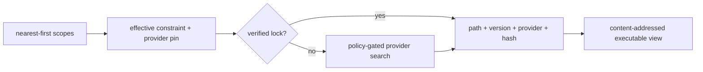

+++
title = "Reef resolution, locks, providers, and executable views"
description = "The complete source-derived path from scoped manifests through constraint refinement, provider ranking, lock/hash validation, PATH synthesis, runners, and evaluator integration."
weight = 93
template = "docs/page.html"

[extra]
group = "Storage & tooling"
eyebrow = "Reproducible tool resolution"
status = "Implemented"
audience = "Reef, execution, Leash, prompt, and tooling contributors"
wide = true
+++

Reef turns a command name into an explicit executable binding. It does not activate an environment,
run directory hooks, or mutate the session's `PATH` when cwd changes. Resolution happens at a
constrained spawn or an explicit Reef command, and only the child's environment receives a
synthesized view.



## Crate/module ownership

| Module | Owns |
|---|---|
| `manifest.rs` | native/user/foreign manifest parsing |
| `scope.rs` | ancestor discovery, ordering, runner merge, hermetic aggregation |
| `version.rs` | lenient version/constraint parsing, compatibility, ordering |
| `provider/` | candidate discovery, version probes, optional fetch |
| `resolve.rs` | effective decision, lock policy, candidate ranking, resolution report |
| `lock.rs` | `reef.lock` serialization and persistence |
| `hashcache.rs` | BLAKE3 identity cache |
| `view.rs` | stable binding-set view directories and synthesized PATH |
| `runner.rs` | extension/shebang to tool invocation |
| `report.rs` | source-chain explanation records |
| `error.rs` | stable Reef error taxonomy |
| evaluator `reef_resolve.rs` | caching, overrides, spawn hook, lock/view integration |
| evaluator `reef_builtins.rs` | `which` and `reef` user commands |
| evaluator `reef.rs` | prompt snapshot and script-runner selection |

## Manifest model

A normalized `ReefManifest` contains:

- ordered tool name → `ToolReq { constraint, provider? }`;
- extension → runner invocation;
- one `hermetic` boolean.

Native tool entries accept a constraint string or table with optional `version` and `provider`.
Runner entries accept a tool string or `{tool,args}`. Unknown TOML keys are ignored by Serde; there
is no unknown-key warning layer inside `shoal-reef`.

```toml
[tools]
node = "22"
python = { version = "3.12", provider = "mise" }
rg = "*"

[runners]
py = "python"
ts = { tool = "deno", args = ["run"] }

[options]
hermetic = true
```

Foreign adapters are read-only:

| File | Imported data | Ignored data |
|---|---|---|
| `mise.toml`, `.mise.toml` | `[tools]` string, first array entry, or table `version` | runners, provider pins, options, other mise semantics |
| `.tool-versions` | first version token on each non-comment line | fallbacks after first token and plugin-specific semantics |
| user `shoal.toml` | `[reef]` native shape | all other host config |

Parsing APIs return a `ManifestError`; normal scope discovery skips unreadable or malformed files so
farther scopes remain usable and retains each reason in `ScopeChain::warnings`. Retention is capped at
64 entries of at most 4 KiB each, with a suppression marker at the ceiling. Interactive evaluation
emits retained warnings once per unchanged discovery identity and remains best-effort. Noninteractive
script/agent evaluation fails closed before an external spawn until the bad authority is repaired.
Evaluator discovery uses the installed filesystem capability and bounded regular-file/UTF-8 reads
rather than ambient whole-file calls. `reef doctor` adds focused invalid-lock and local-manifest
reporting and remains available for diagnosis.

## Scope discovery

Starting at cwd and walking to filesystem root, each directory is checked in this order:

1. `.reef.toml`;
2. `mise.toml`;
3. `.mise.toml`;
4. `.tool-versions`.

Every accepted scope is appended nearest first. Native Reef therefore wins over foreign formats in
the same directory. The optional user `[reef]` scope is appended last.


There is no Git/home boundary and no “nearest manifest only” rule: all accepted scopes participate
in compatibility checking. This differs from `shoal-config`'s single nearest `.shoal.toml`.

### Active-scope admission

Discovery retains a normalized manifest when it constrains a tool, defines a runner, or requests
hermetic execution. This applies equally to native project manifests and the user `[reef]` scope;
runner-only and hermetic-only policy therefore takes effect without a dummy tool entry. A completely
empty/default-only manifest is parsed but omitted because it has no scope-level effect.

### Discovery fingerprint and evaluator cache

The evaluator compares a fixed-size BLAKE3 metadata fingerprint before reusing its parsed chain. It
covers every possible manifest and adjacent lock path from cwd to root, including missing candidates,
plus the user scope; file kind, device, inode, byte length, mtime, and ctime participate. Creating,
editing, replacing, repairing, or removing a manifest or lock therefore reloads both in the same cwd,
including an equal-length rewrite whose mtime is restored. `ScopeChain::key()` remains the narrower
identity of already accepted scopes, while `discovery_key_with` is the cache guard.

## Constraint algebra

Constraints parse leniently:

| Input | Representation | Match behavior |
|---|---|---|
| empty or `*` | `Any` | every candidate, no version probe required |
| `latest` | `Latest` | every candidate, no version probe required |
| dotted integers such as `22`, `3.12` | numeric prefix | candidate leading components must match |
| anything else | raw prefix | raw version string begins with constraint |

Versions likewise preserve raw text, numeric components, optional prerelease/build suffix, and an
explicit unknown state. Unknown sorts below opaque, opaque below numeric. Numeric comparisons pad
missing components with zero, so `22 == 22.0`; prerelease sorts below its final release.

Two numeric constraints are compatible when their shared prefix agrees; the longer refines the
shorter. Raw prefixes refine by string prefix. `Any`/`Latest` are compatible with everything.
Numeric and raw constraints conflict unless a wildcard-like side removes the conflict.

## Effective decision across scopes

For one tool, the nearest mentioning scope supplies the base constraint and initial provider pin.
Every farther mention must be compatible. Compatible constraints refine to the more specific value.
Any farther provider pin is adopted if none exists, or must equal the existing pin.


An unmentioned tool gets unconstrained `Any`, no provider pin, and a provider/ambient scope label.
The evaluator spawn hook deliberately bypasses Reef for such a head even when other tools are
constrained in scope; ordinary PATH behavior remains unchanged.

## Provider contract and default stack

Providers enumerate candidates without network and, where possible, without running the binary.
The trait returns `Result<CandidateDiscovery, ProviderError>`, not `Vec<Candidate>`.
`CandidateDiscovery::push` admits at most 4,096 identities / 16 MiB of tool, version, provider, and
encoded-path state. Built-in providers use it while enumerating, and external implementations cannot
construct an accepted discovery without the same admission. Overflow maps to `reef_provider` rather
than an incomplete candidate set. The resolver folds admitted candidates into one current best
value; it does not duplicate the discovery into a second ranked collection.
Version probing is separated so the resolver invokes it only for constraints that require a
concrete version. Fetch is optional and only explicitly invoked by `reef fetch` today.

Default precedence is:

```text
npm-local → venv → mise → cargo → system
```

| Provider | Discovery | Version at discovery | Fetch |
|---|---|---|---|
| `npm-local` | first ancestor `node_modules/.bin/<tool>` executable | unknown | no |
| `venv` | first ancestor `.venv/bin/<tool>` executable | unknown | no |
| `mise` | `$MISE_DATA_DIR`/home installs layout `<tool>/<version>/bin/<tool>` | directory name | `mise install` |
| `cargo` | `$CARGO_HOME/bin` or `~/.cargo/bin` | unknown | no |
| `system` | canonical roots plus deduplicated ambient PATH directories | unknown, lazy probe | no |

Regular-file and Unix executable bits are required. Windows/ConPTY layouts are not implemented.

### System version probe

`<binary> --version` is run with null stdin while bounded reader workers drain both pipes. Polling
uses a 300 ms hard deadline, kills the process group and reaps on timeout, and extracts the first
dotted version-shaped token, falling back to a bare integer. Failure or unparseable output becomes
`Version::unknown`. Results cache by path plus device/inode/mtime/ctime/length identity, clear at 1,024
entries, and discard uncertain state after lock poison.

Library callers can install a pre-probe guard and an explicit provider subprocess context. Evaluator
callers always do: a restricted principal must allow the opaque effect and any active executable
name/hash pin, then the probe runs through the evaluator's complete environment, cancellation epoch,
and Leash filesystem sandbox. A requested filesystem sandbox is fail-closed when the OS backend is
unavailable. The candidate is never executed after a guard error. Unrestricted library/CLI callers
retain the bounded direct-probe behavior.

### Candidate ranking

For every allowed provider, the resolver discovers candidates, fills an unknown version only when
the constraint `needs_version`, filters by satisfaction, then chooses:

1. greatest `Version`;
2. lower provider index (higher declared precedence);
3. lexically lower path.

`Any` and `Latest` do **not** request version probing. For candidates whose providers report unknown,
`latest` therefore does not actually compare installed versions; provider precedence/path can decide.
This is a semantic mismatch between the word “latest” and the current optimization rule.

`which --all` only calls provider discovery and never `version_of`, so system/cargo/local rows can
show `unknown` even when singular constrained resolution would probe.

## Lock policy and lifecycle

A `LockEntry` records tool name, version, provider, absolute path, BLAKE3 hash, and resolution
timestamp. `Lockfile` serializes under repeated `[[tool]]`-style TOML according to its serde model and
lives conventionally beside a chosen manifest as `reef.lock`. Because the path and executable bytes
are installation- and platform-specific, this is a host-local materialization record rather than a
portable dependency lock; repositories commit exact manifest constraints and materialize the lock
after installing tools on each host.

The evaluator chooses the lock path beside the nearest native `.reef.toml`; if none exists, beside
the first discovered foreign/user scope. One in-memory lock therefore serves the whole active scope
chain.

### Resolve with an existing lock

A lock entry is eligible when its provider matches any effective pin and its stored version satisfies
the effective constraint. The resolver then hashes the current file at the stored path:

- unreadable path → `reef_not_found` with refresh hint;
- different digest → `reef_drift` with old/new hash prefixes;
- equal digest → return the locked binding and full resolution report.

The binary's version is not re-probed on this path. Integrity is content-based; compatibility with
the constraint relies on the stored version string.

### Lock miss or invalid lock

| Policy | Constrained miss | Unconstrained miss |
|---|---|---|
| interactive | resolve fresh, insert lock, emit one notice | resolve fresh without meaningful project lock use |
| script | `reef_unlocked` with lock hint | resolve fresh if called directly; evaluator normally bypasses unconstrained heads |

`refresh_lock` removes the entry and forces fresh resolution. Interactive spawn persists a fresh
candidate lock before rewriting `argv[0]` or publishing the lock in evaluator state. Save failure is
`reef_provider` and stops before process spawn.

`reef lock` iterates every uniquely constrained name, optionally refreshes, records per-row
resolution results, then persists the candidate lock before replacing evaluator state. A save error
fails the command rather than returning misleading successful rows. `reef add` edits the nearest
native manifest or local `.reef.toml`, invalidates the chain, and attempts a refresh lock; the
manifest edit remains when locking or persistence fails, and the returned record says `locked:
false`. Bare `reef` and `which` use the same persistence-before-publication rule for fresh entries.
Malformed or inadmissible existing locks remain a retained load error: constrained execution fails
before resolution/spawn, persistence cannot overwrite the bad file, and `reef doctor` reports it as
an invalid lockfile. Evaluator lock loads and parent-fsynced atomic replacements run through the
installed filesystem capability. `reef add` applies the same one MiB input wall and atomic manifest
replacement before invalidating discovery.

## Hash cache

File hashing reads BLAKE3 on a cache miss keyed by Unix device, inode, mtime and ctime
seconds/nanoseconds, and length. This invalidates ordinary same-inode rewrites, including an
equal-length rewrite whose mtime is restored, while avoiding repeated reads. It is process-local and
clears at 4,096 identities rather than growing for process lifetime. A hostile filesystem able to
preserve or falsify every identity field could still fool this acceleration cache; policy paths
requiring hostile-file guarantees must not treat metadata identity as content authority.

The same resolution hash is returned to evaluator execution so Leash spawn preflight can reuse it
instead of reading the executable again. That equality is an important cross-subsystem contract.

## Executable views and child PATH

Once a constrained head resolves, the evaluator creates a binding set containing that tool plus all
currently locked tools. `synth_path` builds:

```text
$XDG_RUNTIME_DIR/shoal/views/<binding-hash>/bin
```

or a UID-scoped temp fallback. The `bin` directory contains name → absolute executable symlinks.
Construction uses a unique staging sibling and atomic rename; a losing concurrent builder discards
its staging directory and reuses the winner.


The view hash addresses the **binding definition** (names and paths), not executable file contents.
Changing bytes at the same path keeps the same view directory, while lock drift still detects the
binary change before resolution succeeds. Existing view directories are trusted/reused without
revalidating symlinks.

Library `ViewConfig::from_env` uses canonical system roots as a non-hermetic tail. Evaluator
integration instead passes the child's current PATH directories, preserving its ambient tail. In
hermetic mode no tail is appended.

The evaluator replaces only the child's PATH and rewrites `argv[0]` to the absolute resolution. It
does not mutate session environment. Explicit slash-containing heads bypass Reef.

## Runner resolution

The built-in extension table is:

| Extension | Tool/template |
|---|---|
| `.py` | `python` |
| `.js` | `node` |
| `.ts` | `deno run` |
| `.sh` | `sh` |
| `.shl` | `self` |
| `.rb` | `ruby` |
| `.lua` | `lua` |

Rust has no default because compile-versus-script semantics are ambiguous. Scope tables merge
farthest first, then nearest overlays, on top of defaults. Extension wins over shebang. With no
known extension, Reef reads only the first line and recognizes direct interpreters or
`/usr/bin/env <tool>`; shebang flags beyond the selected tool are not preserved.

The runner tool is itself a normal command head and is Reef-resolved before spawn. The `self`
sentinel returns control to Shoal's native `.shl` path. Runner-only project and user manifests are
active scopes.

## Dynamic `with reef:` overrides

`with reef: {node: "22"} { … }` creates a synthetic nearest scope for the block. Nested overrides
are prepended innermost first and popped on every evaluator exit path. Values must be strings.

Overrides can express only tool constraints: no provider pins, runners, or hermetic option. Their
source is the sentinel `<with reef:>` and their mtime is absent. They use the lock path chosen from
the underlying discovered chain; with no discovered manifest, persistence may have no path.

## User-facing commands

| Surface | Current behavior |
|---|---|
| `which <tool>` | resolution report; ambient minimal record on genuine unconstrained miss; unresolved record for conflict/drift/etc. |
| `which <tool> --all` | raw candidates from all providers, no lock/constraint decision |
| bare `reef` | binding table from current scopes/lock |
| `reef add tool@ver` | edit manifest and attempt fresh lock |
| `reef lock [--refresh]` | resolve every constrained name; publish successful rows only after the host-local lock persists |
| `reef fetch <tool>` | ask providers in order; currently only mise installs |
| `reef doctor` | rows for drift/unlocked, orphan lock entries, shadowed ambient binaries, malformed local manifests |

Resolution reports include winner name/scope/constraint/version/path/hash/provider and a nearest-first
chain of selected/shadowed/absent decisions. `which` intentionally surfaces protection states rather
than lying with an ambient fallback on conflict or drift.

## Prompt integration

The prompt snapshot performs no resolution or version probe. It first checks the discovery metadata
fingerprint, then reads the cached parsed scopes and already-loaded lock, returning one row per
constrained tool. An unlocked tool has no version/provider. This preserves prompt latency without
same-cwd manifest staleness; executable drift is still checked only when the tool is resolved.

## Stable errors

| Code | Meaning | Typical repair |
|---|---|---|
| `reef_unlocked` | constrained tool has no valid lock under script policy | run `reef lock` |
| `reef_drift` | locked path's bytes differ from stored digest | inspect, then refresh lock |
| `reef_conflict` | scope constraints or provider pins disagree | reconcile named manifests |
| `reef_not_found` | no satisfying provider candidate or locked path unreadable | install/fetch or fix path/constraint |
| `reef_provider` | provider/hash/view/manifest mutation failed | inspect provider/IO detail |

`ReefError` remains dependency-light and is converted to `ErrorVal` at evaluator integration by
copying stable code/message/hint and adding the source span.

## Failure and security analysis

- Evaluator manifest and lock discovery/load/persistence use its `Fs` capability and bounded reads;
  standalone `shoal-reef` APIs intentionally select the ambient `StdFs` adapter.
- Provider installation layouts, executable hashing, version probes, and view construction remain
  host tooling boundaries rather than evaluator `Fs` operations.
- Provider version probing can execute candidate binaries for numeric/raw constraints. Evaluator
  integration guards that execution with opaque/spawn-pin policy and runs shipped probes through a
  300 ms, 16 KiB, cancellation-aware filesystem-sandboxed capability. A requested sandbox is
  fail-closed if enforcement is unavailable; unrestricted standalone Reef APIs intentionally use
  the bounded ambient runner.
- `reef fetch` can invoke network-capable `mise install`. Evaluator execution rechecks opaque policy,
  spawn pins, and sandbox requirements before entering any provider hook; provider pins restrict
  which hook may run. The shipped mise hook uses the same injected runner with a 15-minute wall and
  256 KiB combined-output cap. Leash filesystem grants are OS-enforced or the installer is refused;
  network access remains represented by the opaque policy decision rather than an OS network sandbox.
- View symlinks are created beneath an owned, real directory forced to mode `0700`. Binding names
  must be one non-empty normal path component, targets must be absolute executable regular files,
  and a reused view must contain exactly the expected symlinks. A mismatch is atomically quarantined,
  removed, rebuilt, and post-publication validated.
- Persistence failures are typed and fail before lock state or spawn publication; manifest and lock
  replacement is atomic, but provider acquisition itself can still have external partial effects.
- “Hermetic” controls PATH tail only; it is not a filesystem/network/process sandbox.

## Test map

`shoal-reef` unit tests cover each manifest adapter, scope ordering, constraint compatibility,
provider layouts/probes, candidate ranking, lock round trips/drift/conflict, hash invalidation, view
idempotence/races, runners, reports, and error strings. Evaluator tests cover spawn rewriting, script
versus interactive lock policy, builtin tables/errors, ambient shadowing, doctor findings, and runner
integration. Corpus suites `reef.toml` and `reef-provider-errors.toml` pin user-visible behavior.

Same-cwd creation/edit/removal/repair fingerprints, equal-length restored-mtime rewrites,
interactive warning-once and strict noninteractive refusal, bounded warning floods, lock-save
failure propagation, oversized manifest admission, provider flood/timeout descendants, cache
identity churn, poisoned-cache recovery, and
runner-only/hermetic-only project and user scope discovery, denied version probes/fetch hooks,
provider-pinned fetch selection, hostile view-link replacement/extra entries, binding path traversal,
symlinked view roots, and live Landlock denial from both version probes and mise installers are
covered. Remaining high-value evidence includes platform-specific provider/view behavior beyond Unix.

## Change checklist

When changing Reef:

1. update native and foreign parsing with fixture tests;
2. state whether the change affects normalized manifests, scope precedence, or only one provider;
3. test compatible/refined/conflicting multi-scope decisions;
4. test interactive and script lock policy separately;
5. preserve or intentionally migrate lock TOML and hash meaning;
6. audit provider probing/fetch effects and Leash ordering;
7. audit child PATH/hermetic behavior and view concurrency;
8. audit script runners, prompt snapshot, `which`, doctor, config, and external docs;
9. add corpus coverage for stable errors/records;
10. update implementation status and roadmap for any remaining cache/policy gap.
